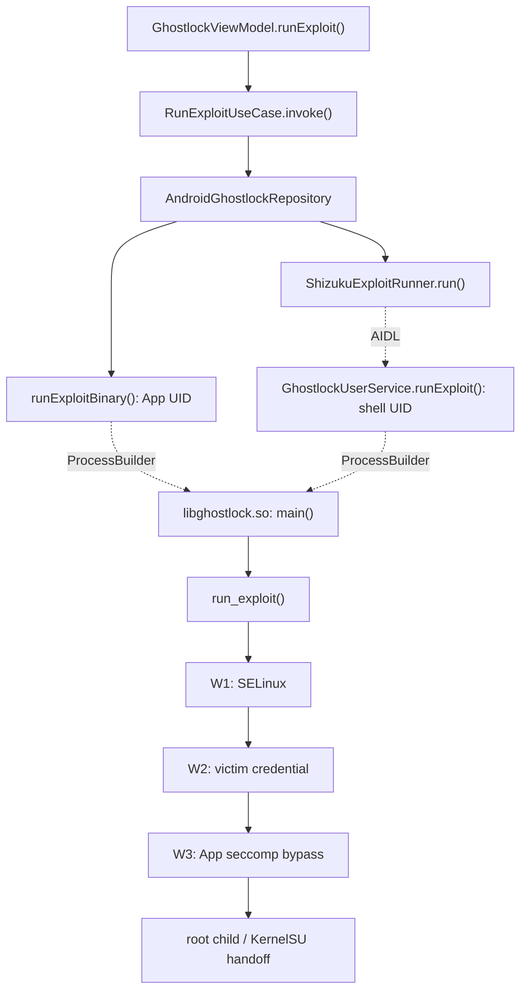

# GhostLock native 分析

本目录对 GhostLock 攻击相关的 native C 实现进行静态分析，不是利用指南。分析范围包括 `src/core` 中的 C 函数、参与地址发现的 kernelsnitch 头文件实现，以及 Kotlin 中启动 native 进程的转发入口。Rust 偏移提取器和无关 UI 函数不在范围内。

## 文档索引

- [Native 函数说明](native-functions.md)：逐文件列出职责、状态、调用与清理语义。
- [三条路线与数据流](routes.md)：Multicast、TCP Zerocopy、pselect/select 的调用和时序。
- [Kotlin 到 native 的转发](kotlin-native-bridge.md)：普通 App 和 Shizuku 两种进程入口。
- [全函数调用大图](all-functions-callgraph.md)：按文件展示节点，并突出三条路线的重合部分。
- [Native 全局状态矩阵](native-global-state.md)：全局变量的读者、写者、生命周期、并发与所有权。
- [Native 解耦计划书](native-decoupling-plan.md)：混合式 C 目标架构、迁移映射、分阶段实施和验收标准。

## 顶层流程

## 符号约定

- 实线：直接同步调用或阶段转移。
- 虚线：线程入口、`fork`、AIDL、信号或新进程。
- “清理”分为用户态资源释放和内核悬空状态 disarm，两者不等价。
- 函数位置以当前工作树为准；源码变更后行号可能偏移。
