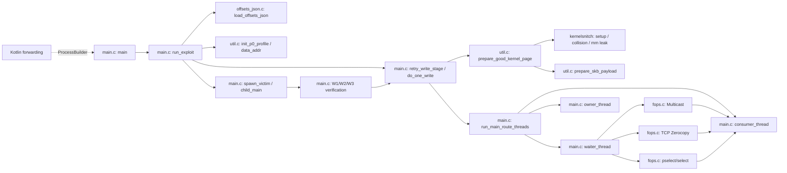
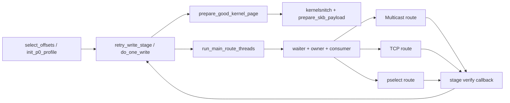
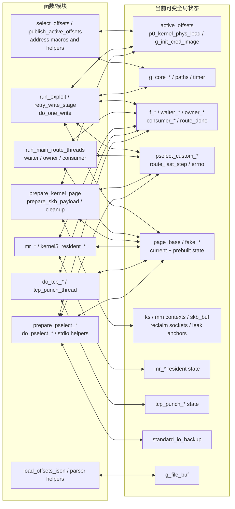
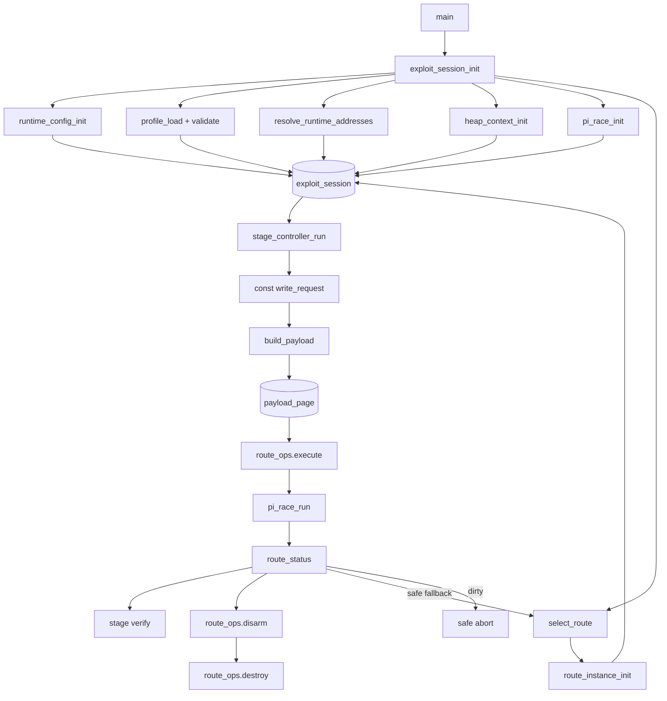

# 全函数调用大图

本图覆盖约定范围内的所有核心native C函数、kernelsnitch/hash/system helper，以及Kotlin native转发入口。为了保留可读性，libc/内核系统调用不单独建节点。

## 跨文件重合总览

三条路线的主要重合点是 `prepare_skb_payload()`、`prepare_good_kernel_page()`、`run_main_route_threads()`、`consumer_thread()`、`retry_write_stage()` 和各阶段验证回调。

## 全节点调用图

```mermaid
flowchart TB
  subgraph KT["Kotlin native bridge"]
    K_VM["GhostlockViewModel.runExploit"]
    K_UC["RunExploitUseCase.invoke"]
    K_RE["AndroidGhostlockRepository.runExploit"]
    K_RS["AndroidGhostlockRepository.runExploitWithShizuku"]
    K_RB["AndroidGhostlockRepository.runExploitBinary"]
    K_SZ["ShizukuExploitRunner.run"]
    K_US["GhostlockUserService.runExploit"]
    K_VM --> K_UC
    K_UC --> K_RE --> K_RB
    K_UC --> K_RS --> K_SZ
    K_SZ -. AIDL .-> K_US
  end

  subgraph MAIN["src/core/main.c"]
    M_main["main"]
    M_run["run_exploit"]
    M_soc["detect_soc"]
    M_val["validate_offsets_profile"]
    M_pub["publish_active_offsets"]
    M_ext["try_external_offsets"]
    M_sel["select_offsets"]
    M_tr["timer_reset"]
    M_tm["timer_ms"]
    M_wait["waiter_thread"]
    M_owner["owner_thread"]
    M_cons["consumer_thread"]
    M_reset["reset_main_route_state"]
    M_threads["run_main_route_threads"]
    M_write["do_one_write"]
    M_checkse["check_selinux_off"]
    M_readse["enforce_readable"]
    M_sec["process_has_seccomp"]
    M_drain["slab_drain"]
    M_cpu["init_cpu_config"]
    M_paths["init_runtime_paths"]
    M_script["write_root_script"]
    M_ksu["kernelsu_module_loaded"]
    M_perf["perf_find_task"]
    M_park["park_rooted_child"]
    M_child["child_main"]
    M_spawn["spawn_child"]
    M_victim["spawn_victim"]
    M_retry["retry_write_stage"]
    M_vse["verify_selinux_stage"]
    M_vw2["verify_w2_stage"]
    M_vw3["verify_seccomp_probe_stage"]
    M_vleaf["verify_leaf_dir_stage"]

    M_main --> M_run
    M_run --> M_cpu
    M_run --> M_paths
    M_run --> M_script
    M_run --> M_sel
    M_sel --> M_ext
    M_ext --> M_val
    M_sel --> M_val
    M_sel --> M_pub
    M_pub --> M_soc
    M_run --> M_tr
    M_run --> M_tm
    M_run --> M_checkse
    M_run --> M_readse
    M_run --> M_drain
    M_run --> M_retry
    M_retry --> M_write
    M_retry --> M_drain
    M_retry --> M_vse
    M_retry --> M_vw2
    M_retry --> M_vw3
    M_retry --> M_vleaf
    M_vse --> M_checkse
    M_write --> M_threads
    M_threads --> M_reset
    M_threads -. pthread .-> M_wait
    M_threads -. pthread .-> M_owner
    M_threads -. pthread .-> M_cons
    M_run --> M_victim
    M_victim --> M_spawn
    M_spawn -. fork .-> M_child
    M_child --> M_perf
    M_child --> M_park
    M_run --> M_sec
    M_run --> M_ksu
  end

  subgraph UTIL["src/core/util.c"]
    U_ms["ms_since"]
    U_setmode["set_pselect_write_mode"]
    U_clearmode["clear_pselect_write"]
    U_tcpselected["tcp_route_selected"]
    U_k5selected["kernel5_route_selected"]
    U_kssetup["setup_kernelsnitch"]
    U_ksready["kernelsnitch_collisions_ready"]
    U_ksrun["run_kernelsnitch_bruteforce"]
    U_kscurrent["current_kernelsnitch_mm_struct"]
    U_kscleanup["cleanup_kernelsnitch"]
    U_readline["read_first_line"]
    U_log["log_startup_context"]
    U_rseq["disable_rseq_for_thread"]
    U_futex["futex_op"]
    U_sched["sched_setattr_tid"]
    U_p0init["init_p0_profile"]
    U_p0["p0_data_alias"]
    U_data["data_addr"]
    U_put64["put64"]
    U_put32["put32"]
    U_cred["fill_profile_cred_copy"]
    U_clone["clone_child"]
    U_cloneleak["clone_leak_child"]
    U_openmem["open_memfd"]
    U_kill["kill_child"]
    U_clonemem["clone_memfd"]
    U_closers["close_reclaim_sockets"]
    U_quarantine["quarantine_reclaim_sockets"]
    U_releaseq["release_quarantined_reclaim_sockets"]
    U_stash["stash_prebuilt_page"]
    U_activate["activate_prebuilt_page"]
    U_discard["discard_prebuilt_page"]
    U_closectx["close_ctx_memfds"]
    U_freectx["free_ctx_storage"]
    U_cleanup["cleanup_page_prepare_state"]
    U_ctxs["prepare_ctxs"]
    U_payload["prepare_skb_payload"]
    U_page["prepare_kernel_page"]
    U_good["prepare_good_kernel_page"]

    U_log --> U_readline
    U_data --> U_p0
    U_clonemem --> U_clone
    U_clonemem --> U_openmem
    U_quarantine --> U_closers
    U_activate --> U_closers
    U_discard --> U_closers
    U_cleanup --> U_closectx
    U_cleanup --> U_freectx
    U_cleanup --> U_kill
    U_payload --> U_tcpselected
    U_payload --> U_put64
    U_payload --> U_put32
    U_payload --> U_cred
    U_payload --> U_data
    U_page --> U_closers
    U_page --> U_cleanup
    U_page --> U_ctxs
    U_page --> U_clone
    U_page --> U_openmem
    U_page --> U_kssetup
    U_page --> U_ksready
    U_page --> U_ksrun
    U_page --> U_kscurrent
    U_page --> U_kscleanup
    U_page --> U_payload
    U_page --> U_ms
    U_good --> U_page
    U_stash --> U_closers
  end

  subgraph FOPS["src/core/fops.c"]
    F_time["fops_elapsed_ms"]
    F_mri["mr_intr"]
    F_mra["mr_adjust"]
    F_mrs["mr_stamp"]
    F_mry["mr_y"]
    F_mrx["mr_x"]
    F_k5start["kernel5_resident_start"]
    F_k5write["kernel5_resident_write"]
    F_k5stop["kernel5_resident_stop"]
    F_k5route["do_kernel5_fake_lock_route"]
    F_tcpidle["tcp_wait_for_consumer_idle"]
    F_tcppair["tcp_make_pair"]
    F_tcppunch["tcp_punch_thread"]
    F_tcproute["do_tcp_fake_lock_route"]
    F_delay["route_delay_usec"]
    F_put["fdset_put_word"]
    F_get["fdset_get_word"]
    F_wps["pselect_words_per_set"]
    F_pglobal["pselect_put_global_word"]
    F_shift["pselect_waiter_shift"]
    F_pwaiter["pselect_put_waiter_word"]
    F_openfds["open_selected_fds"]
    F_reserve["reserve_standard_io"]
    F_restore["restore_standard_io"]
    F_prepsets["prepare_pselect_fdsets"]
    F_psroute["do_pselect_fake_lock_route"]

    F_mry --> F_mrs
    F_k5start -. pthread .-> F_mry
    F_k5start -. pthread .-> F_mrx
    F_k5start --> F_mra
    F_k5start -. signal handler .-> F_mri
    F_k5write --> F_mra
    F_k5stop --> U_closers
    F_k5stop --> U_cleanup
    F_k5route --> U_put64
    F_tcproute --> F_tcppair
    F_tcproute -. pthread .-> F_tcppunch
    F_tcproute --> F_tcpidle
    F_pglobal --> F_put
    F_pwaiter --> F_shift
    F_pwaiter --> F_pglobal
    F_prepsets --> F_pwaiter
    F_psroute --> F_prepsets
    F_psroute --> F_openfds
    F_psroute --> F_reserve
    F_psroute --> F_restore
    F_psroute --> F_delay
    F_psroute --> F_get
    F_psroute --> F_time
  end

  subgraph JSON["src/core/offsets_json.c"]
    J_ws["json_skip_ws"]
    J_key["json_match_key"]
    J_skip["json_skip_value"]
    J_member["json_member_value"]
    J_str["json_read_string"]
    J_int["json_parse_int"]
    J_store["store_profile_scalar"]
    J_fill["fill_external_entry"]
    J_load["load_offsets_json"]
    J_key --> J_ws
    J_skip --> J_ws
    J_member --> J_ws
    J_member --> J_key
    J_member --> J_skip
    J_str --> J_ws
    J_int --> J_ws
    J_fill --> J_member
    J_fill --> J_int
    J_fill --> J_store
    J_load --> J_ws
    J_load --> J_member
    J_load --> J_str
    J_load --> J_fill
  end

  subgraph KS["src/core/kernelsnitch/kernelsnitch.h"]
    S_futex["__futex"]
    S_do["__do_increase"]
    S_inc["__increase"]
    S_cmp["__compare"]
    S_measure["__measure"]
    S_match["__mm_candidate_matches"]
    S_mark["__mm_mark_found"]
    S_leak["__mm_leak"]
    S_leakpass["__run_mm_leak_pass"]
    S_setup["kernelsnitch_setup"]
    S_limit["__collision_pool_limit"]
    S_screen["__screen_collision_pool"]
    S_prove["__prove_collision_pool"]
    S_verify["__verify_collision_pool"]
    S_pass["__collision_pass"]
    S_found["kernelsnitch_found_collisions"]
    S_cleanup["kernelsnitch_cleanup"]
    S_param["kernelsnitch_param"]
    S_default["kernelsnitch"]

    S_do --> S_futex
    S_inc --> S_futex
    S_measure --> S_futex
    S_leak --> S_match
    S_leak --> S_mark
    S_leakpass -. pthread .-> S_leak
    S_setup -. pthread .-> S_do
    S_screen --> S_measure
    S_prove --> S_measure
    S_verify --> S_screen
    S_verify --> S_prove
    S_pass --> S_limit
    S_pass --> S_verify
    S_param --> S_setup
    S_param --> S_pass
    S_param --> S_leakpass
    S_param --> S_cleanup
    S_default --> S_param
  end

  subgraph HASH["src/core/kernelsnitch/futex_hash.h"]
    H_rol["rol32"]
    H_j2["jhash2"]
    H_jn["__jhash_nwords"]
    H_j1["jhash_1word"]
    H_j2w["jhash_2words"]
    H_j3["jhash_3words"]
    H_no["futex_hash_no_trunc"]
    H_cut["__futex_hash"]
    H_init["futex_init"]
    H_hash["futex_hash"]
    H_j2 --> H_rol
    H_jn --> H_rol
    H_j1 --> H_jn
    H_j2w --> H_jn
    H_j3 --> H_jn
    H_no --> H_j2
    H_cut --> H_no
    H_hash --> H_cut
  end

  subgraph SYS["kernelsnitch/utils.h + timeutils.h"]
    X_pin["pin_to_core"]
    X_reset["reset_cpu_pin"]
    X_limit["set_limit"]
    X_unbuf["set_unbuffer"]
    X_name["set_proc_name"]
    X_time["gettime_ns"]
    X_write["write_file"]
    X_ns["set_user_namespace"]
    X_hex["hexdump"]
    X_ul["parse_ul"]
    X_xl["parse_xl"]
    X_tb["rdtsc_begin"]
    X_te["rdtsc_end"]
    X_ns --> X_write
  end

  K_RB -. ProcessBuilder .-> M_main
  K_US -. ProcessBuilder .-> M_main
  M_ext --> J_load
  M_run --> U_log
  M_run --> U_p0init
  M_run --> X_limit
  M_run --> X_unbuf
  M_run --> X_pin
  M_wait --> U_rseq
  M_wait --> U_futex
  M_wait --> U_k5selected
  M_wait --> U_tcpselected
  M_wait --> F_k5route
  M_wait --> F_tcproute
  M_wait --> F_psroute
  M_owner --> U_rseq
  M_owner --> U_futex
  M_cons --> U_rseq
  M_cons --> X_pin
  M_cons --> U_sched
  M_cons --> U_futex
  M_write --> U_setmode
  M_write --> U_clearmode
  M_write --> U_good
  M_write --> U_k5selected
  M_write --> F_k5start
  M_write --> F_k5write
  M_retry --> U_stash
  M_retry --> U_activate
  M_retry --> U_discard
  M_run --> U_quarantine
  M_run --> U_releaseq
  M_run --> F_k5stop
  U_kssetup --> S_setup
  U_ksready --> S_found
  U_kscleanup --> S_cleanup
  S_setup --> H_init
  S_match --> H_hash
  S_screen --> H_hash
  S_measure --> X_tb
  S_measure --> X_te
  S_do --> X_pin
  S_leak --> X_pin
```

## 按路线看重合

这张过滤图显示：三条路线不是三套完整攻击链，而是同一条profile→堆准备→PI竞争→阶段验证主链上的三个可替换覆盖机制。当前重合部分仍由跨文件全局变量连接，因此也是后续解耦的主要边界。

## 函数与全局状态依赖

该图中连线最多的三个状态节点是PI同步、写请求/路线结果和payload page。它们应优先被替换为 `pi_race_context`、`write_request/route_status` 和 `payload_page`。

## 解耦后的对照调用图

目标图不再使用双向“函数↔全局变量”边；状态只通过session所有权、显式参数和结构化返回值流动。
