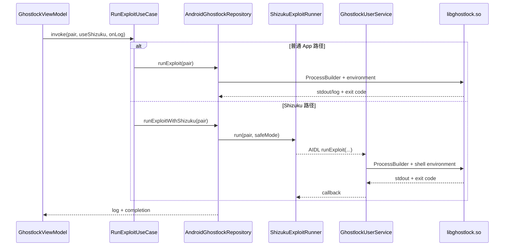

# Kotlin 到 native 的转发入口

Kotlin 不通过 JNI 调用 C。`libghostlock.so` 虽以 `.so` 命名，实际被当作可执行 ELF，通过 `ProcessBuilder` 启动。

| 函数 | 位置 | 用途 | 下游 |
|---|---|---|---|
| `GhostlockViewModel.runExploit()` | `ui/GhostlockViewModel.kt` | UI 内部执行入口；组合 CPU 选择、Shizuku 状态和日志回调 | `RunExploitUseCase.invoke()` |
| `RunExploitUseCase.invoke()` | `domain/usecase/GhostlockUseCases.kt` | 按 `useShizuku` 选择普通或 shell UserService 路径 | Repository |
| `AndroidGhostlockRepository.runExploit()` | `data/AndroidGhostlockRepository.kt` | 普通 App UID 路径 | `runExploitBinary()` |
| `AndroidGhostlockRepository.runExploitWithShizuku()` | 同上 | Shizuku 路径 | `ShizukuExploitRunner.run()` |
| `AndroidGhostlockRepository.runExploitBinary()` | 同上 | 准备工作目录、ksud、CPU/安全模式环境变量和日志；启动 ELF | `ProcessBuilder(libghostlock.so)` |
| `ShizukuExploitRunner.run()` | `shizuku/ShizukuExploitRunner.kt` | 绑定 UserService，传递 CPU、安全模式和回调 | AIDL `runExploit()` |
| `GhostlockUserService.runExploit()` | `shizuku/GhostlockUserService.kt` | 验证 shell UID、`Seccomp: 0` 和内核profile，在 `/data/local/tmp` 启动 ELF | `ProcessBuilder(libghostlock.so)` |

## 边界特性

- Kotlin/native 之间的接口是环境变量、文件、stdout/stderr和退出码，不是类型化 ABI。
- Shizuku 只改变 native 进程的启动身份与 Seccomp 环境；C 程序入口仍是同一个 `main()`。
- `parseSource()`/`libextract.so` 属于 Rust 偏移提取链，不纳入攻击调用图。
