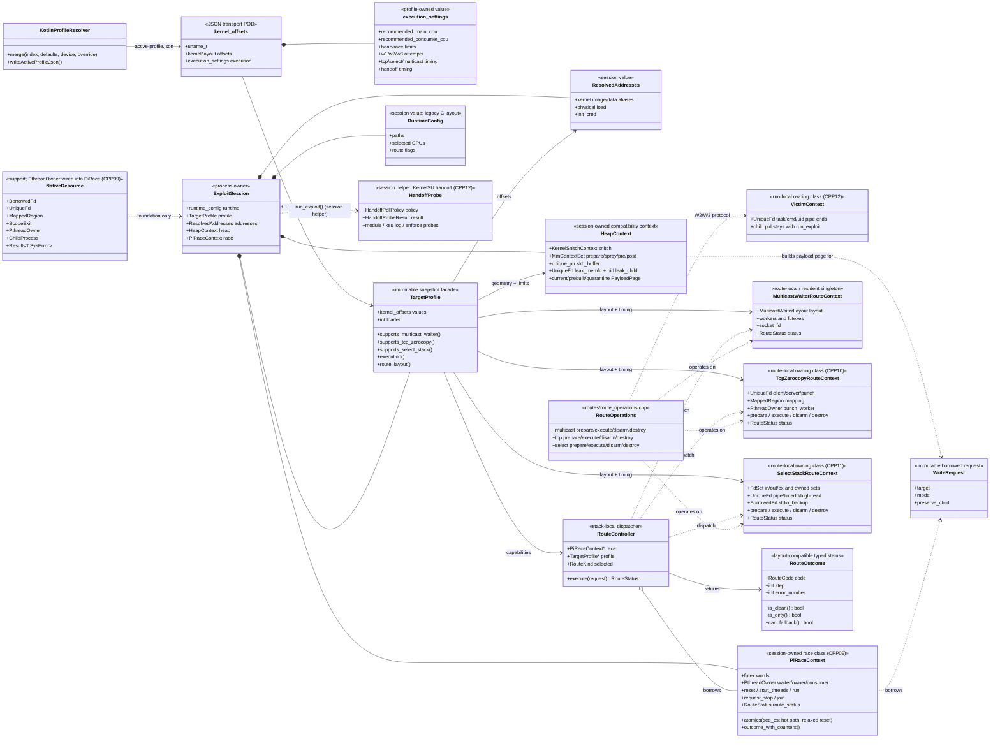

# Native C++ 当前实现 UML

> 本图描述当前代码，而不是迁移完成后的目标设计。实线表示对象持有或直接数据传递，虚线表示借用、兼容引用或函数调用。三条路线的实现目前仍聚合在 `routes/route_operations.cpp`；各路线 `.cpp` 只负责 context 初始化。

## 当前关键边界

- `kernel_offsets` 是 Kotlin JSON 到 Native 的可变 transport；`TargetProfile` 是复制得到的只读语义入口，但两者尚未完全拆成独立 C++ 类型。
- `ExploitSession` 已集中主要全局状态；`RuntimeConfig`/`ResolvedAddresses` 是值类型（CPP04/CPP08），`PayloadPage` move-only（CPP07），CPU 镜像已删除且 config 经 `runtime_config_snapshot()` 访问（CPP12/`SESSION-01`），路径宏也已内联（`e1782f6`，与门禁版逐字节一致）；Heap 侧 `MmContextSet`（owning vector，close/kill 显式）、`UniqueFd leak_memfd`、`unique_ptr skb_buffer` 已收编且 `page_base`/`fake_*` 别名已删除（CPP12/`CPP07-OWNER`，门禁 `CPP12h`），`CORE`/`mm_struct_sz()` 宏已由显式 CPU 与 `target_profile_mm_struct_sz()` 取代（门禁 `CPP12j`）。`VictimContext`（header-only，pipe 集合）已完成两次冷机门禁（`CPP12m`/`CPP12n`）；`handoff_probe_run` 收拢 KernelSU 探针（门禁 `CPP12i`）。其余引用 façade（profile/address/race）仍待收编。
- 三条路线共享 `WriteRequest → HeapContext → PiRaceContext → RouteController`，随后才各自构造 route context。
- `PiRaceContext` 是 `ghostlock::PiRace`：futex、原子量、三个 `PthreadOwner` 与 `RouteStatus` 由该类唯一拥有，`start_threads`/`run`/`request_stop`/`join` 显式分离，`run()` 返回合并 consumer calls/success 的结果；`g_pi_race_context` 仍是 session 成员的引用别名（CPP12 删除）。
- RAII 基础类型已补齐借用、scope、stop 和 handoff 语义；`PthreadOwner` 已接入 `PiRace`（CPP09）与 `TcpZerocopyRoute`（CPP10），`SelectStackRoute`（CPP11）拥有 `FdSet`/`UniqueFd` 并把 stdio 备份保持为 `BorrowedFd`；Multicast 仍必须显式执行 `disarm → destroy`，以防内核继续引用 fd、mmap 或线程相关对象。
- 下一次结构拆分是把 `route_operations.cpp` 的三组函数分别移入对应路线 `.cpp`；该操作会改变编译单元和生成代码，必须独立进行真机门禁。
