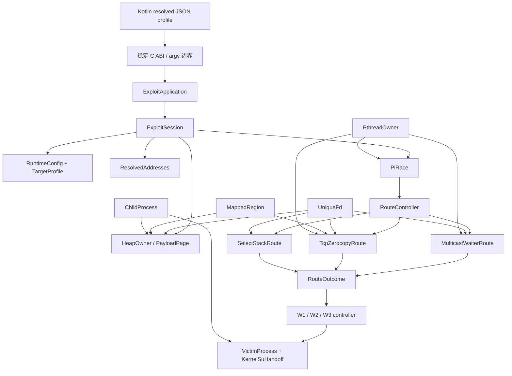

# Native C → 现代 C++ 迁移与 RAII 重构计划

> 状态：CPP00 已完成；CPP01 已实现并完成构建验证，等待真机门禁。基线为 S15 `0c47a9f`，Multicast 最终门禁证据为 `7e51ad7`。
>
> 目标不是机械地把 `.c` 改成 `.cpp`，而是在保持内核交互、竞态时序、payload 字节布局和 Kotlin 启动协议兼容的前提下，用 C++20、STL、强类型及 RAII 重写控制流与生命周期管理。

## 1. 不可违反的实施规则

- [ ] 每阶段和每个子项都用 checkbox；一次只实施一个阶段。
- [ ] 每阶段必须保持可编译、可安装、可运行和旧入口兼容；阶段完成后创建独立 Git 提交并立即暂停。
- [ ] 用户真机确认前不得进入下一阶段。失败时保留在本阶段修复，不把多个行为变化叠到一次门禁中。
- [ ] 用户确认后导出完整 Native 日志到 `analysis/device-gates/CPPxx-YYYYMMDD-<route>-<pass|fail>.native.log`，创建同名前缀分析文档，再勾选阶段标题。
- [ ] 每阶段更新 `analysis/routes.md` 的核心维护图；函数/所有权发生变化时同步更新全函数调用图、函数表和全局状态矩阵。
- [ ] 简单迁移若受会话、profile、共享 Heap 或敏感时序阻塞，在代码现场登记 `TODO(CPPxx-编号)`，并在本计划的 TODO 表登记回补阶段。
- [ ] 函数和类型按职责/攻击链命名，不使用内核版本号；版本差异只能出现在 profile 数据和注释中。
- [ ] 不在同一阶段同时进行“语言迁移”和“攻击算法优化”。先证明等价，再在独立阶段改变策略。
- [ ] 不改变 Kotlin → Native 的参数、stdout/stderr、退出码、日志路径、时间戳文件命名和 Direct/Shizuku 启动协议。
- [ ] 不把异常传播越过 C ABI、线程入口、`fork()` 边界或 `main()`；边界函数必须返回显式状态。
- [ ] 不在竞态关键窗口引入隐藏分配、引用计数、iostream、locale、锁或不可控析构工作。
- [ ] 用户文件 `analysis/s02-execution.log` 始终不纳入提交。

## 2. 技术基线与语言策略

### 2.1 编译模式

- C++ 标准：C++20；迁移期既有 C 文件固定为 GNU C11，因为 KernelSnitch helper 使用 GNU `typeof`。
- C++ 标准库：Android NDK libc++；最终链接由 `clang++` 驱动。
- 迁移期采用混合构建：未迁移 `.c` 由 `clang` 编译，`.cpp` 由 `clang++` 编译，各自产生对象文件后统一链接。
- CLion CMake 必须与 Makefile 使用相同源文件清单和 C++20 设置，但 CMake 仍只作为 IDE 索引/静态分析入口。
- 在 APK 门禁中使用 `llvm-readelf -d` 检查 `DT_NEEDED`，明确采用静态 libc++ 或把 `libc++_shared.so` 一并正确打包；不得依赖设备碰巧存在 C++ runtime。
- Debug/Release 都启用 `-Wall -Wextra -Wconversion` 的可行子集；迁移阶段先记录旧代码噪声，再逐文件收紧，禁止一次性掩盖全部警告。
- 默认禁用 RTTI；业务控制流不使用异常。是否使用 `-fno-exceptions` 必须先完成 libc++/析构行为构建验证。

### 2.2 允许并推荐的现代 C++ 工具

| 目的 | 首选工具 | 使用限制 |
|---|---|---|
| 不可变视图 | `std::span`、`std::string_view` | 不得超过底层 storage 生命周期 |
| 固定布局 | `std::array`、`enum class`、`constexpr` | 与 kernel/transport 对齐处必须 `static_assert` |
| 可选结果 | `std::optional` | 不用于区分多种错误原因的路径 |
| 多分支状态 | `std::variant` 或项目级 `Result<T, Error>` | 不使用异常承载正常失败 |
| 动态所有权 | `std::unique_ptr` + 自定义 deleter | 禁止无意义 `shared_ptr` |
| 动态集合 | `std::vector` | 只在准备阶段分配；竞态前 `reserve()` |
| 文本/路径 | `std::string`、`std::string_view` | 不在 signal/fork child 的受限路径动态构造 |
| 时间 | `std::chrono` | syscall 需要 `timespec` 时在边界显式转换 |
| 并发状态 | `std::atomic<T>` | 保留并注明 memory order；不可机械替换时序 |
| 线程 | 自定义 `Pthread` RAII 或受控 `std::thread` | 需要 TID、调度策略、CPU affinity 的路线优先保留 pthread 语义 |
| 作用域收尾 | 小型 `ScopeExit` 或 RAII owner | 析构必须 `noexcept`、幂等且耗时可预测 |

### 2.3 明确禁止的“现代化”误区

- 不使用 `std::shared_ptr` 管理 fd、mmap、pthread 或 Heap 页面所有权。
- 不用 iostream/`std::format` 替换当前低级日志管线，除非先证明无额外 runtime/分配影响。
- 不让拥有资源的对象可复制；默认删除 copy，只有语义明确时提供 move。
- 不用析构函数静默执行可能阻塞的无限 `join()`；线程 owner 必须先显式 `request_stop()`，析构只执行有界收尾或触发可诊断失败。
- 不在 `fork()` 后调用非 async-signal-safe 的复杂 STL 操作。
- 不把 kernel ABI 数据直接建模成含虚函数、继承或非标准布局的类。
- 不因 RAII 而关闭仍被内核引用的 fd/mmap；dirty failure 的“故意保留至进程退出”必须由显式 `QuarantinedResource` 表示。

## 3. 目标架构



核心原则：`ExploitSession` 拥有一次攻击的全部可变状态；profile/address/request 是不可变值或借用；Heap、route、thread、fd、mmap 和 child 都有唯一 owner；路线只返回结构化结果，不发布隐式全局状态。

## 4. RAII 基础类型设计

### 4.1 `UniqueFd`

- move-only；默认值 `-1`；`valid()`、`get()`、`release()`、`reset()`。
- 析构调用 `close()`，保存 errno 但不抛异常。
- 支持显式 borrowed view，禁止用裸 `int` 表达不清楚的所有权转移。
- 对 dirty kernel reference 提供 `release_to_process_lifetime(reason)`，日志记录故意泄漏原因。

### 4.2 `MappedRegion`

- move-only；拥有 address + length；析构 `munmap()`。
- 构造通过 `Result<MappedRegion, SysError>`，拒绝半初始化对象。
- `bytes()` 返回 `std::span<std::byte>`，payload 编码不再接收无长度裸指针。

### 4.3 `PthreadOwner`

- 保存 `pthread_t`、started/joined/stop 状态及路线角色。
- 显式 `start()`、`request_stop()`、`join()`；析构不得无限阻塞。
- 线程入口使用无异常 C trampoline，立即转发到 `noexcept` 成员函数。
- affinity、scheduler、native TID 和 futex 行为继续使用 pthread/Linux API，不用 `std::jthread` 隐藏这些语义。

### 4.4 `ChildProcess`

- move-only PID owner；区分 running、parked、reaped、transferred。
- 显式 `terminate_and_wait()`/`release_to_handoff()`；析构只清理由当前对象明确拥有且可安全回收的 child。
- `fork()` child 分支保持 C 风格最小代码，不运行父进程 STL 清理路径。

### 4.5 结果与错误

```cpp
enum class RouteCode { Ok, Retryable, FallbackSafe, DirtyFailure, Unsupported };

struct RouteOutcome final {
    RouteCode code;
    RouteStep step;
    std::error_code error;
    bool userspace_clean;
    bool kernel_disarmed;
};
```

- `RouteOutcome` 保持当前 `RouteStatus` 语义和日志数值映射。
- syscall 错误在调用点立即捕获 errno，转换成项目级 `SysError`/`std::error_code`；不得稍后读取被覆盖的 errno。
- dirty、retryable、unsupported 不通过异常表示。

## 5. ABI、内存布局和低级边界

- Kotlin/Direct/Shizuku 当前并非直接构造 C++ 对象；外部入口维持 C ABI/argv/file protocol。
- 需要被 C 文件调用的过渡接口放在 `extern "C"` façade 中；C++ 类型不得泄漏到 C header。
- `kernel_offsets` JSON transport 在迁移初期保持 C-compatible POD；解码完成后转换成不可变 `TargetProfile` C++ value。
- 对 payload、kernel 结构镜像和 syscall 参数使用 `std::is_standard_layout_v`、`std::is_trivially_copyable_v`、`sizeof`、`offsetof` 静态断言。
- 使用 `std::byte`/`memcpy` 编码未对齐字段，不通过未对齐 `reinterpret_cast<T*>` 写入。
- 所有 kernel address 使用独立强类型包装（如 `KernelImageAddress`、`DirectMapAddress`），但底层仍为 `std::uintptr_t` 且无运行时开销。
- `target.h` 中 profile 可覆盖的地址/布局不得继续成为 C++ 业务代码的默认来源；仅真正编译期恒量进入命名空间。

## 6. 分阶段迁移顺序

阶段顺序按“构建基础 → 纯值 → 单资源 → 聚合资源 → 并发 → 三路线 → 全局编排”推进。Multicast one-shot 是当前唯一完整真机覆盖且对栈帧/顺序高度敏感的路线，因此最后迁移。

### [x] CPP00：混合 C/C++ 构建骨架

- [x] Makefile 增加 `NDK_CXX`、独立 `.c/.cpp → .o` 规则和最终 `clang++` 链接；保留当前优化、PIE、pthread、LTO 和 include 定义。既有 C 因 GNU `typeof` 固定为 `gnu11`。
- [x] Gradle input 扩展到 `.cpp/.hpp`；输出路径、APK 打包名称和任务依赖不变。
- [x] CLion CMake project 切换为 `C CXX`，设置 GNU C11/C++20，并使用与 Makefile 相同的生产源文件清单。
- [x] 添加不参与攻击控制流的 C++ link probe；host C 测试已覆盖 C façade、`std::string`/`std::vector`、RAII errno 恢复和异常边界。
- [x] `llvm-readelf` 确认 PIE/DYN，仅依赖 `libm/libdl/libc`；使用静态 libc++，APK 无 `libc++_shared.so` 依赖。Native 大小由 96,928 增至 431,344 字节（+334,416 B）。
- [x] 既有 profile/payload/Heap/KernelSnitch bounds/RouteController 主机测试、CPP link probe、`buildGhostlockNative` 和 `assembleDebug` 全部通过；APK 内 Native SHA-256 与构建产物一致。
- [x] 创建 CPP00 独立提交并暂停。
- [x] `versionCode=178` 真机完成完整 Multicast 门禁；六次路线均 `OK clean=1/1`，W1/W2/W3、root、seccomp 与 KernelSU 交接通过，日志和核心 UML 已更新。

### [ ] CPP01：公共强类型、常量与 `target.h`

- [x] 新建 `target_constants.hpp`：真正稳定的 address-domain 与项目自定义 payload 槽位迁为 `inline constexpr`，按命名空间分类。
- [x] `target.h` 保留 C façade：C++ 分支转发到 namespaced constants，尚未迁移的 C 调用点继续使用数值兼容分支。
- [x] kernel symbol、task/cred/waiter layout offset 及 SoC 物理加载默认值明确留在 profile/C compatibility 层，未伪装成新的 C++ runtime authority。
- [x] 引入零开销、standard-layout、trivially-copyable 的 `KernelAddress<Domain>` 及溢出受检 `checked_add()`；攻击日志和 C 控制流未改变。
- [x] `target_constants_test.cpp` 为 `target.h` 全部地址、symbol、layout、payload 及派生 image 宏建立 `static_assert` 固定向量，并测试正常/溢出地址运算。
- [x] target constants、CPP link probe、既有五组主机回归、`buildGhostlockNative` 和全新 `assembleDebug` 构建通过。
- [x] 创建 CPP01 独立提交并暂停。
- [ ] 真机执行完整 Multicast 门禁，保存 CPP01 日志并更新地址数据流图。

### [ ] CPP02：状态码、时间、字节和系统调用工具

- [ ] 迁移 `route_status.h` 为强类型 `RouteOutcome`，保留 C 数值映射 façade。
- [ ] 迁移 `runtime_time.h` 和纯 util helper，使用 `std::chrono`、`std::span<std::byte>`、`std::string_view`。
- [ ] 新建 `SysError`/`Result<T,E>`；所有 syscall wrapper 在失败点保存 errno。
- [ ] 日志函数继续走现有低级实现，不引入 iostream。
- [ ] 固定测试覆盖 errno、溢出、空 span、时间换算和旧日志字段。
- [ ] 提交、暂停、真机门禁。

### [ ] CPP03：基础 RAII 资源库

- [ ] 实现并测试 `UniqueFd`、`MappedRegion`、`ScopeExit`、borrowed fd view。
- [ ] 实现 `ChildProcess`，覆盖 move、release、kill/wait、重复清理和 fork 失败。
- [ ] 实现 `PthreadOwner`，覆盖创建失败、显式 stop/join、部分启动和析构策略。
- [ ] 添加 fd 数量、mmap、线程及 child 泄漏测试；使用 `/proc/self/fd` 和 waitpid 验证。
- [ ] 本阶段只提供类型，不迁移攻击路线调用点。
- [ ] 提交、暂停、真机门禁。

### [ ] CPP04：Profile、JSON transport 与地址空间

- [ ] `offsets_json.c` 保留解析 façade，内部迁为有界 `std::string_view`/value parser；不改变 Kotlin resolved JSON schema。
- [ ] `TargetProfile` 成为不可变 C++ value，execution/layout accessor 返回 value 或只读 view。
- [ ] `ResolvedAddresses` 使用强地址类型，消除 active offset/address 宏镜像的读者。
- [ ] 明确 `target.h` 剩余 compatibility 常量及删除期限。
- [ ] 对全部内置 profile 运行 schema、解析、地址和 layout 固定向量。
- [ ] 提交、暂停、真机门禁。

### [ ] CPP05：Payload Builder 纯函数化

- [ ] `WriteRequest`、`PayloadWriteLayout` 改为不可变标准布局 value；`WriteMode` 改为 `enum class`。
- [ ] builder 接收 `std::span<std::byte>` 并返回显式编码结果，不写全局 page 状态。
- [ ] 用 `std::array` 表达固定 payload 片段，禁止越界和隐式整数截断。
- [ ] 对 Multicast/TCP/Select 所有已有向量逐字节比较 C 与 C++ 输出。
- [ ] 保留 C façade 直到所有调用者迁完。
- [ ] 提交、暂停、真机门禁。

### [ ] CPP06：FutexHash 与 KernelSnitch

- [ ] `FutexHashContext` 迁为无资源或只读 value；hash 函数使用强类型参数。
- [ ] `KernelSnitch` 类唯一拥有 mmap、数组和 worker；容器在扫描前完成分配/`reserve()`。
- [ ] 用 RAII 替代 init/find/scan/result/destroy 手工状态机，但保留显式阶段检查。
- [ ] `COMPAT-01` 四个零调用 util 适配入口在本阶段删除；不得再创建 C++ 版兼容包装。
- [ ] 验证 collision、range-end、canonical/tag sweep、部分线程创建失败和 destroy。
- [ ] 提交、暂停、真机门禁并保存 KernelSnitch 时序对比。

### [ ] CPP07：Heap 与 PayloadPage 所有权

- [ ] `PayloadPage` move-only；用 `UniqueFd`/`ChildProcess`/明确 state 管理 current、prebuilt、quarantine。
- [ ] `HeapOwner` 唯一拥有 KernelSnitch、skb buffer、mm contexts、leak child 和页面集合。
- [ ] `activate/stash/quarantine` 表达为 move，不复制 fd 或 child PID。
- [ ] dirty kernel reference 使用显式 quarantine/release-to-process-lifetime，不让普通析构误关资源。
- [ ] 删除 `g_heap_context` 及 `page_base/fake_*` 兼容镜像读者；若受 session 阻塞，登记 CPP12 回补。
- [ ] 页面验收、快速修复、部分 prepare 失败和重复清理测试通过。
- [ ] 提交、暂停、真机门禁并比较 Heap 时序。

### [ ] CPP08：RuntimeConfig、日志与进程资源

- [ ] `RuntimeConfig` 使用 `std::string`/强 CPU 类型，构造后只读；删除固定 char buffer 和 `g_runtime_config`。
- [ ] 路径转换到 syscall/exec 边界时使用稳定 `c_str()`，禁止保存临时字符串指针。
- [ ] Native 日志文件 owner RAII 化，保留逐行落盘和每次攻击独立文件行为。
- [ ] Direct/Shizuku、verbose/non-verbose 和路径失败测试通过。
- [ ] 回补 `SESSION-01`、`SESSION-03`。
- [ ] 提交、暂停、两种入口真机门禁。

### [ ] CPP09：PI Race 并发生命周期

- [ ] `PiRace` 类拥有 futex、atomic、三个 `PthreadOwner`、CPU 选择、request borrow 和 outcome。
- [ ] 使用 `std::atomic` 时逐字段记录 memory order；先保持当前顺序一致，不主动“优化”为 relaxed。
- [ ] start/run/request_stop/join 分离；部分线程创建失败按 consumer→owner→waiter 的当前可收敛顺序清理。
- [ ] `RouteStatus` 不再写外部可变指针，由 `PiRace::run()` 返回 `RouteOutcome`。
- [ ] 删除 `g_pi_race_context` 和线程兼容镜像。
- [ ] 主机测试覆盖正常、timeout、部分启动、dirty 和重复 stop。
- [ ] 提交、暂停、Multicast 真机门禁；比较 calls/success/join 与总耗时。

### [ ] CPP10：TCP Zerocopy 路线

- [ ] `TcpZerocopyRoute` move-only，唯一拥有 client/server/punch fd、mapping 和 punch worker。
- [ ] prepare/execute/disarm 显式返回结果；析构只处理已 disarm 或用户态可安全资源。
- [ ] profile attempts/arm sequence/hold iterations 保持不变。
- [ ] fallback 只有 `FallbackSafe && userspace_clean && kernel_disarmed` 才允许。
- [ ] 主机测试和外部 TCP 设备门禁通过后才勾选阶段；无设备时不得宣称完成。
- [ ] 提交、暂停、保存 TCP 成功/安全失败/dirty 证据。

### [ ] CPP11：Select Stack 路线

- [ ] `SelectStackRoute` 拥有 fd sets、pipe/timerfd、stdio borrow 和执行状态。
- [ ] `fd_set` 用专用 wrapper 表达位操作，但 syscall 边界仍传兼容布局。
- [ ] consumer in-flight 时资源转入 `QuarantinedResource`，禁止 RAII 析构提前关闭。
- [ ] compact/tree 两种 layout 分别固定测试和真机验证。
- [ ] 暂不实现外层多 delay/retry；保留 `SELECT-01` 给 CPP12 session。
- [ ] 提交、暂停、保存 Select 与 TCP→Select 回退证据。

### [ ] CPP12：ExploitSession 与阶段控制流

- [ ] 新建 `ExploitSession`，按声明逆序拥有 config/profile/address、Heap、PI race、route controller、victim 和 handoff。
- [ ] `main` 只负责解析、构造 session、运行和映射退出码。
- [ ] W1/W1b/W2/W2b/W3 改为显式 stage state machine；重试返回 typed outcome，不用跨函数全局量。
- [ ] 回补 `SESSION-01`–`SESSION-04`：Heap handoff、CPU/config 镜像和 resident stop 跨 owner 清理。
- [ ] 回补 `SELECT-01`：每次 compact Select 外层重试重新构造 Heap page、PI race 和 route context。
- [ ] `VictimProcess` 与 `KernelSuHandoff` 明确所有权转移、child 退休、module/enforcing 探针结果。
- [ ] 验证每个早退点的析构顺序和日志；确保失败不会触发不安全 fallback。
- [ ] 提交、暂停，三路线及可用回退组合分别真机门禁。

### [ ] CPP13：Multicast Waiter 路线（最后迁移）

- [ ] `MulticastWaiterRoute` 管理 resident 状态、futex、worker、socket、布局和 outcome。
- [ ] one-shot 保持已验证的专用小栈帧、payload builder、socket 和 drain/close 顺序；首个提交只做类型/owner 等价迁移。
- [ ] 对可能影响栈布局的局部对象记录 `sizeof`/地址/汇编差异；禁止在敏感函数栈上放置大型 STL 对象。
- [ ] resident 与 one-shot 共用纯编码逻辑，但生命周期控制保持独立方法。
- [ ] ghost disarm、consumer drain、success 读取、destroy 顺序必须与 S14/S15 成功日志一致。
- [ ] 固定测试、ASan/UBSan 可运行子集、Release 汇编差异和完整 Gradle 构建通过。
- [ ] 提交、暂停；至少多次冷机 Multicast 真机通过后才勾选阶段。

### [ ] CPP14：C façade、遗留全局与文件收尾

- [ ] 删除只为混合迁移存在的 façade、宏、`.c` header 分支和零调用包装。
- [ ] 除真正 process singleton（如日志 sink）外不保留可变全局；每项例外写明线程/所有权理由。
- [ ] 将完成迁移的文件统一为 `.cpp/.hpp`，更新 Makefile、Gradle inputs 和 CLion CMake。
- [ ] 全项目启用最终警告策略，运行 clang-tidy 的 selected checks，不做无关格式化洪泛。
- [ ] 更新所有函数表、调用图、数据流图、全局状态矩阵和中英文架构说明。
- [ ] Debug/Release APK、符号/依赖、体积、启动协议和三路线回归完成。
- [ ] 提交、暂停、最终真机/协作者门禁后结束迁移。

## 7. 每阶段验证矩阵

| 层级 | 必做验证 | 失败含义 |
|---|---|---|
| 编译 | C/C++ objects、LTO、PIE、NDK API、Debug/Release | 构建或 ABI 基线已破坏 |
| 链接 | undefined symbols、libc++ `DT_NEEDED`、binary size | runtime 打包或 façade 不完整 |
| 静态布局 | `sizeof/alignof/offsetof`、standard-layout、trivial-copy | kernel/transport ABI 风险 |
| 单元 | move、重复 cleanup、部分构造、errno、固定字节向量 | RAII/纯函数语义错误 |
| 资源 | fd、mmap、pthread、child、quarantine | 生命周期泄漏或提前释放 |
| 控制流 | OK/retry/fallback-safe/dirty/unsupported | fallback 安全边界错误 |
| 集成 | Native binary、Gradle APK、Direct/Shizuku | 应用集成不兼容 |
| 真机 | W1/W2/W3、route clean、root、seccomp、KernelSU | 不得进入下一阶段 |

可在主机运行的代码使用 ASan/UBSan；涉及 Android kernel syscall、调度和真实 payload 的部分以固定向量、交叉编译及真机日志为准。TSan 不作为 PI 竞态正确性的裁判，因为该代码刻意包含内核协调竞态，但普通用户态数据竞争仍需单独消除。

## 8. 真机日志对比字段

每次门禁至少比较：

- build/version、release/profile、入口、main/consumer CPU、温度或“日志不可判定”；
- Heap prepare 次数、KernelSnitch 时长、mm_struct/page 地址类别；
- 每次 route 的 code、clean/disarmed、step、errno、calls、success 和 join；
- W1/W1b/W2/W2b/W3 尝试次数及 settle 时间；
- child UID、seccomp probe、KernelSU module/ready、SELinux 最终 enforcing；
- fallback 是否发生、失败资源是否 quarantine、进程是否安全退出；
- 与最近一次同路线 C 基线日志的行为和耗时差异。

## 9. 初始 TODO/风险登记

| 编号 | 问题 | 回补阶段 | 完成条件 |
|---|---|---|---|
| CPP-BUILD-01 | 当前 Makefile 单次 clang 编译/链接，尚无 C++ runtime 策略 | CPP00 | mixed objects + clang++ link + APK dependency 验证 |
| CPP-BUILD-02 | Gradle 生成目录偶发出现 `name 2.kt`/`name 3.class` 重复缓存 | 独立 buildSrc 维护 | 生成 task 清理/隔离 output，并连续 clean/incremental 构建通过 |
| CPP-ABI-01 | `kernel_offsets` 同时承担 JSON transport 与 runtime value | CPP04 | transport façade 与 immutable profile 分离 |
| CPP-TARGET-01 | `target.h` 混合编译期常量和 profile fallback | CPP01/CPP04 | 常量命名空间与 profile 数据边界明确 |
| CPP-COMPAT-01 | 四个零调用 KernelSnitch util wrapper | CPP06 | 删除且调用图/构建/门禁通过 |
| CPP-SESSION-01 | config/profile/address/Heap/PI/route 仍由 main/global 拼装 | CPP12 | `ExploitSession` 唯一拥有一次运行 |
| CPP-SELECT-01 | compact Select 外层重试需要跨 Heap/PI/route 重建 | CPP12 | session 级有界重试及真机证据 |
| CPP-DIRTY-01 | consumer in-flight 时 RAII 不能自动关闭内核引用资源 | CPP03/CPP11 | 显式 quarantine/release 类型及测试 |
| CPP-MCAST-01 | one-shot 对栈帧和 drain/close 顺序敏感 | CPP13 | 汇编/日志对比及多次真机成功 |
| CPP-FORK-01 | fork child 不能安全运行复杂 STL/锁/析构路径 | CPP03/CPP12 | child 分支最小化并有退出/回收测试 |

## 10. 完成定义

- [ ] Native 核心使用 C++20 构建，STL/runtime 在 APK 中可重复部署且依赖明确。
- [ ] fd、mmap、pthread、child、Heap page 和路线资源均有可审计唯一 owner。
- [ ] 正常、重试、安全回退、dirty failure 和进程退出的析构/释放顺序可由测试和日志证明。
- [ ] payload/kernel ABI、竞态关键顺序及 Kotlin/Direct/Shizuku 外部协议与 C 基线兼容。
- [ ] Multicast、TCP、Select 各自完成可用设备门禁；缺失设备的路线不得仅凭主机测试宣称完成。
- [ ] 遗留全局、兼容 wrapper 和宽泛 extern 已删除或有明确、编号化、可验证的保留理由。
- [ ] 文档、UML、函数调用图和所有权矩阵与最终 C++ 实现一致。
