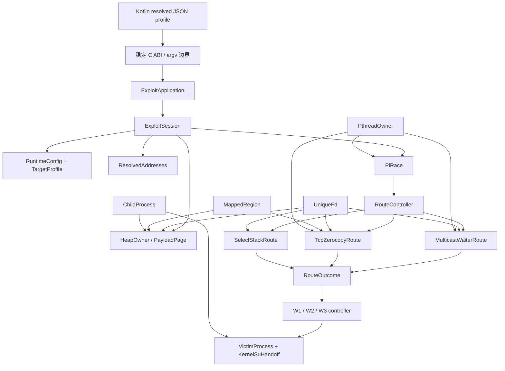

# Native C → 现代 C++ 迁移与 RAII 重构计划

> 状态：CPP00–CPP09 已完成并门禁通过（Multicast 行为与基线一致）。CPP10（`TcpZerocopyRoute`）与 CPP11（`SelectStackRoute` + `FdSet`）代码与主机测试完成；CPP12 已完成 `SESSION-03`（CPU 镜像删除）与 `SESSION-01`（config 引用别名删除）（native `a5b2d151343f38229c61726056434c2cbaadc3e7372a574a6c72c3f10b44ba4c`）。无可用 TCP/Select 外部设备，CPP10/CPP11 设备门禁待补；CPP12 其余子项与阶段门禁待设备。`SESSION-01/02/04`、`CPP07-OWNER`、`PI-TIMEOUT-01`、`PROFILE-SUGGEST-01` 等已登记。基线为 S15 `0c47a9f`，Multicast 最终 C 基线证据为 `7e51ad7`。
>
> 目标不是机械地把 `.c` 改成 `.cpp`，而是在保持内核交互、竞态时序、payload 字节布局和 Kotlin 启动协议兼容的前提下，用 C++20、STL、强类型及 RAII 重写控制流与生命周期管理。

状态约定：阶段标题只有在该阶段全部代码项和所需真机门禁完成后才标为 `[x]`；阶段内部允许先勾选已经实现并由主机测试证明的独立子项。`[ ]` 不一定表示尚未开始，也可能表示仍缺资源接入或设备证据。

### 当前源码布局

当前实现的 profile、session、共享攻击链与三路线所有权关系见 [`native-cpp-current-uml.md`](native-cpp-current-uml.md)。

- [x] `memory/`：地址解析、Heap/page 状态与 route-neutral payload 编码。
- [x] `routes/`：路线状态、控制器、三路线 context，以及保持原单一编译单元边界的 `route_operations.cpp`。
- [x] `session/`：`ExploitSession` 与运行配置。
- [x] `support/`：通用 `Result` 和 RAII 资源类型。
- [x] `tests/`：所有主机固定测试；C/C++ link probe 已退出生产二进制。
- [x] Makefile、Gradle 输入和 CLion CMake 已同步；目录说明见 `src/core/README.md`。
- [x] 结构提交：`35ebfba`（按职责归档）和 `1d8bbb7`（移除 `fops` 误名、隔离测试探针）。
- [x] 新增 profile-centered 当前实现 UML，明确 transport、snapshot、session、共享 PI/Heap 和 route operations 边界。
- [ ] 将 `route_operations.cpp` 按 Multicast/TCP/Select 拆成独立编译单元；必须作为单独行为门禁，避免改变静态函数布局和敏感路线生成代码。

## 1. 不可违反的实施规则

- [x] 每阶段和每个子项都用 checkbox；阶段状态必须区分代码完成、主机验证和设备验证。
- [x] 原逐阶段暂停规则经用户于 2026-09-14 明确改为“一步完成到最后”；本批连续实施，但仍保留兼容入口与验证记录。
- [x] 连续批次每次实质修改后运行主机回归和 Native 构建；最终统一进行 APK/真机门禁，不把未实测路线写成设备通过。
- [ ] 每次需要用户真机验证前，自动依次执行 `./gradlew clean`、`:app:assembleDebug` 与 `adb -s <serial> install -r`，再请用户运行。这是 CPP-BUILD-02 重复缓存副本的强制规避步骤；不得依赖残留在 `build/` 中的增量结果，也不得把清理后的通过当作对旧缓存的验证。
- [ ] 用户确认后导出完整 Native 日志到 `analysis/device-gates/CPPxx-YYYYMMDD-<route>-<pass|fail>.native.log`，创建同名前缀分析文档，再勾选阶段标题。
- [ ] 从真机读取日志并归档完成后，仅当“前一次执行成功且设备没有自动重启”时才执行 `adb -s <serial> reboot`，为下一次门禁准备干净状态；若前一次执行失败并已触发设备自动重启（如 kernel panic），跳过 reboot 并直接进入失败分析。
- [ ] 每阶段更新 `analysis/routes.md` 的核心维护图；函数/所有权发生变化时同步更新全函数调用图、函数表和全局状态矩阵。
- [ ] 简单迁移若受会话、profile、共享 Heap 或敏感时序阻塞，在代码现场登记 `TODO(CPPxx-编号)`，并在本计划的 TODO 表登记回补阶段。
- [ ] 函数和类型按职责/攻击链命名，不使用内核版本号；版本差异只能出现在 profile 数据和注释中。
- [ ] 不在同一阶段同时进行“语言迁移”和“攻击算法优化”。先证明等价，再在独立阶段改变策略。
- [ ] 不改变 Kotlin → Native 的参数、stdout/stderr、退出码、日志路径、时间戳文件命名和 Direct/Shizuku 启动协议。
- [ ] 不把异常传播越过 C ABI、线程入口、`fork()` 边界或 `main()`；边界函数必须返回显式状态。
- [ ] 不在竞态关键窗口引入隐藏分配、引用计数、iostream、locale、锁或不可控析构工作。
- [ ] 用户文件 `analysis/s02-execution.log` 始终不纳入提交。

## 2. 技术基线与语言策略

### 2.1 编译模式

- C++ 标准：生产 Native 全部使用 C++20；仅 `cpp_link_probe_test.c` 保留为主机 C11 测试，用于验证稳定 C façade。
- C++ 标准库：Android NDK libc++；最终链接由 `clang++` 驱动。
- 当前生产构建只编译 `.cpp` 并由 `clang++` 统一链接；Makefile 仍保留空的 C source 规则，便于未来确有 C ABI 源文件时使用。
- CLion CMake 必须与 Makefile 使用相同源文件清单和 C++20 设置，但 CMake 仍只作为 IDE 索引/静态分析入口。
- 在 APK 门禁中使用 `llvm-readelf -d` 检查 `DT_NEEDED`，明确采用静态 libc++ 或把 `libc++_shared.so` 一并正确打包；不得依赖设备碰巧存在 C++ runtime。
- Debug/Release 都启用 `-Wall -Wextra -Wconversion` 的可行子集；迁移阶段先记录旧代码噪声，再逐文件收紧，禁止一次性掩盖全部警告。
- 默认禁用 RTTI；业务控制流不使用异常。是否使用 `-fno-exceptions` 必须先完成 libc++/析构行为构建验证。

### 2.2 允许并推荐的现代 C++ 工具

| 目的 | 首选工具 | 使用限制 |
|---|---|---|
| 不可变视图 | `std::span`、`std::string_view` | 不得超过底层 storage 生命周期 |
| 固定布局 | `std::array`、`enum class`、`constexpr` | 与 kernel/transport 对齐处必须 `static_assert` |
| 可选结果 | `std::optional` | 不用于区分多种错误原因的路径 |
| 多分支状态 | `std::variant` 或项目级 `Result<T, Error>` | 不使用异常承载正常失败 |
| 动态所有权 | `std::unique_ptr` + 自定义 deleter | 禁止无意义 `shared_ptr` |
| 动态集合 | `std::vector` | 只在准备阶段分配；竞态前 `reserve()` |
| 文本/路径 | `std::string`、`std::string_view` | 不在 signal/fork child 的受限路径动态构造 |
| 时间 | `std::chrono` | syscall 需要 `timespec` 时在边界显式转换 |
| 并发状态 | `std::atomic<T>` | 保留并注明 memory order；不可机械替换时序 |
| 线程 | 自定义 `Pthread` RAII 或受控 `std::thread` | 需要 TID、调度策略、CPU affinity 的路线优先保留 pthread 语义 |
| 作用域收尾 | 小型 `ScopeExit` 或 RAII owner | 析构必须 `noexcept`、幂等且耗时可预测 |

### 2.3 明确禁止的“现代化”误区

- 不使用 `std::shared_ptr` 管理 fd、mmap、pthread 或 Heap 页面所有权。
- 不用 iostream/`std::format` 替换当前低级日志管线，除非先证明无额外 runtime/分配影响。
- 不让拥有资源的对象可复制；默认删除 copy，只有语义明确时提供 move。
- 不用析构函数静默执行可能阻塞的无限 `join()`；线程 owner 必须先显式 `request_stop()`，析构只执行有界收尾或触发可诊断失败。
- 不在 `fork()` 后调用非 async-signal-safe 的复杂 STL 操作。
- 不把 kernel ABI 数据直接建模成含虚函数、继承或非标准布局的类。
- 不因 RAII 而关闭仍被内核引用的 fd/mmap；dirty failure 的“故意保留至进程退出”必须由显式 `QuarantinedResource` 表示。

## 3. 目标架构



核心原则：`ExploitSession` 拥有一次攻击的全部可变状态；profile/address/request 是不可变值或借用；Heap、route、thread、fd、mmap 和 child 都有唯一 owner；路线只返回结构化结果，不发布隐式全局状态。

## 4. RAII 基础类型设计

### 4.1 `UniqueFd`

- move-only；默认值 `-1`；`valid()`、`get()`、`release()`、`reset()`。
- 析构调用 `close()`，保存 errno 但不抛异常。
- 支持显式 borrowed view，禁止用裸 `int` 表达不清楚的所有权转移。
- 对 dirty kernel reference 提供 `release_to_process_lifetime(reason)`，日志记录故意泄漏原因。

### 4.2 `MappedRegion`

- move-only；拥有 address + length；析构 `munmap()`。
- 构造通过 `Result<MappedRegion, SysError>`，拒绝半初始化对象。
- `bytes()` 返回 `std::span<std::byte>`，payload 编码不再接收无长度裸指针。

### 4.3 `PthreadOwner`

- 保存 `pthread_t`、started/joined/stop 状态及路线角色。
- 显式 `start()`、`request_stop()`、`join()`；析构不得无限阻塞。
- 线程入口使用无异常 C trampoline，立即转发到 `noexcept` 成员函数。
- affinity、scheduler、native TID 和 futex 行为继续使用 pthread/Linux API，不用 `std::jthread` 隐藏这些语义。

### 4.4 `ChildProcess`

- move-only PID owner；区分 running、parked、reaped、transferred。
- 显式 `terminate_and_wait()`/`release_to_handoff()`；析构只清理由当前对象明确拥有且可安全回收的 child。
- `fork()` child 分支保持 C 风格最小代码，不运行父进程 STL 清理路径。

### 4.5 结果与错误

```cpp
enum class RouteCode { Ok, Retryable, FallbackSafe, DirtyFailure, Unsupported };

struct RouteOutcome final {
    RouteCode code;
    RouteStep step;
    std::error_code error;
    bool userspace_clean;
    bool kernel_disarmed;
};
```

- `RouteOutcome` 保持当前 `RouteStatus` 语义和日志数值映射。
- syscall 错误在调用点立即捕获 errno，转换成项目级 `SysError`/`std::error_code`；不得稍后读取被覆盖的 errno。
- dirty、retryable、unsupported 不通过异常表示。

## 5. ABI、内存布局和低级边界

- Kotlin/Direct/Shizuku 当前并非直接构造 C++ 对象；外部入口维持 C ABI/argv/file protocol。
- 需要被 C 文件调用的过渡接口放在 `extern "C"` façade 中；C++ 类型不得泄漏到 C header。
- `kernel_offsets` JSON transport 在迁移初期保持 C-compatible POD；解码完成后转换成不可变 `TargetProfile` C++ value。
- 对 payload、kernel 结构镜像和 syscall 参数使用 `std::is_standard_layout_v`、`std::is_trivially_copyable_v`、`sizeof`、`offsetof` 静态断言。
- 使用 `std::byte`/`memcpy` 编码未对齐字段，不通过未对齐 `reinterpret_cast<T*>` 写入。
- 所有 kernel address 使用独立强类型包装（如 `KernelImageAddress`、`DirectMapAddress`），但底层仍为 `std::uintptr_t` 且无运行时开销。
- `target.h` 中 profile 可覆盖的地址/布局不得继续成为 C++ 业务代码的默认来源；仅真正编译期恒量进入命名空间。

## 6. 分阶段迁移顺序

阶段顺序按“构建基础 → 纯值 → 单资源 → 聚合资源 → 并发 → 三路线 → 全局编排”推进。Multicast one-shot 是当前唯一完整真机覆盖且对栈帧/顺序高度敏感的路线，因此最后迁移。

### [x] CPP00：混合 C/C++ 构建骨架

- [x] Makefile 增加 `NDK_CXX`、独立 `.c/.cpp → .o` 规则和最终 `clang++` 链接；保留当前优化、PIE、pthread、LTO 和 include 定义。既有 C 因 GNU `typeof` 固定为 `gnu11`。
- [x] Gradle input 扩展到 `.cpp/.hpp`；输出路径、APK 打包名称和任务依赖不变。
- [x] CLion CMake project 切换为 `C CXX`，设置 GNU C11/C++20，并使用与 Makefile 相同的生产源文件清单。
- [x] 添加不参与攻击控制流的 C++ link probe；host C 测试已覆盖 C façade、`std::string`/`std::vector`、RAII errno 恢复和异常边界。
- [x] `llvm-readelf` 确认 PIE/DYN，仅依赖 `libm/libdl/libc`；使用静态 libc++，APK 无 `libc++_shared.so` 依赖。Native 大小由 96,928 增至 431,344 字节（+334,416 B）。
- [x] 既有 profile/payload/Heap/KernelSnitch bounds/RouteController 主机测试、CPP link probe、`buildGhostlockNative` 和 `assembleDebug` 全部通过；APK 内 Native SHA-256 与构建产物一致。
- [x] 创建 CPP00 独立提交并暂停。
- [x] `versionCode=178` 真机完成完整 Multicast 门禁；六次路线均 `OK clean=1/1`，W1/W2/W3、root、seccomp 与 KernelSU 交接通过，日志和核心 UML 已更新。

### [x] CPP01：公共强类型、常量与 `target.h`

- [x] 新建 `target_constants.hpp`：真正稳定的 address-domain 与项目自定义 payload 槽位迁为 `inline constexpr`，按命名空间分类。
- [x] `target.h` 保留 C façade：C++ 分支转发到 namespaced constants，尚未迁移的 C 调用点继续使用数值兼容分支。
- [x] kernel symbol、task/cred/waiter layout offset 及 SoC 物理加载默认值明确留在 profile/C compatibility 层，未伪装成新的 C++ runtime authority。
- [x] 引入零开销、standard-layout、trivially-copyable 的 `KernelAddress<Domain>` 及溢出受检 `checked_add()`；攻击日志和 C 控制流未改变。
- [x] `target_constants_test.cpp` 为 `target.h` 全部地址、symbol、layout、payload 及派生 image 宏建立 `static_assert` 固定向量，并测试正常/溢出地址运算。
- [x] target constants、CPP link probe、既有五组主机回归、`buildGhostlockNative` 和全新 `assembleDebug` 构建通过。
- [x] 创建 CPP01 独立提交并暂停。
- [x] 真机执行完整 Multicast 门禁；与 CPP04–CPP06 合并归档为 `CPP04-06-20260917-multicast-pass`，地址数据流图沿用当前 UML。

### [x] CPP02：状态码、时间、字节和系统调用工具

- [x] `route_status.h` 的 C++ 分支迁为强类型 `RouteCode/RouteOutcome`，保留 C 定义、旧名称、数值映射和 20-byte 布局 façade。
- [x] `runtime_time.h` 的计算已迁为 `std::chrono` 并保留 `timespec` syscall 边界；`ms_since()` 改为 const 委托，`read_first_line()` 改为 `UniqueFd` + 显式 errno 恢复的 RAII 实现。
- [x] 新建 `SysError`/`Result<T,E>`；基础资源构造失败已在失败点保存 errno。
- [x] 日志函数继续走现有低级实现，不引入 iostream。
- [x] 固定测试覆盖状态布局/数值、fallback、时间换算（normalize 正/负溢出、相等 deadline、单调时钟）与空 span。
- [x] `utils.h` 的纯解析 helper 迁为 host-safe `number_parse.h`（`parse_ul`/`parse_xl` 委托，行为不变），新增 `number_parse_test` 固定向量（base 自动检测、八进制/十六进制、空白/符号、空串、尾部垃圾、`ERANGE` 溢出、`ULONG_MAX` 回绕）。
- [x] `gettime_ns()` 委托 `runtime_time`（`std::chrono`）；`write_file()` 改用 `UniqueFd` 接管 fd，保留 `SYSCHK` fail-fast 与 `pr_error` 语义。
- [x] `set_limit`/`set_unbuffer`/`set_proc_name`/`set_user_namespace`/`pin_to_core`/`reset_cpu_pin`/`hexdump` 保留 `SYSCHK` fail-fast 语义；改为结构化错误需要会话级错误传播策略，作为 `CPP02-HELPERS` 移交 CPP12。
- [x] `df901ec` 已提交；versionCode 185 Multicast 真机门禁通过并归档为 `CPP03-20260914-multicast-pass`。

### [x] CPP03：基础 RAII 资源库

- [x] 实现并测试 `UniqueFd`、`MappedRegion`、`ScopeExit` 和 trivially-copyable `BorrowedFd`。
- [x] `ChildProcess` 覆盖 move、handoff、kill/wait、状态和重复清理；新增 `RLIMIT_NPROC` 的真实 fork 失败注入，验证失败分支不产生受管 child。
- [x] `PthreadOwner` 已实现 create、幂等 stop callback、join、detach、release、move 和非阻塞析构策略。
- [x] 资源测试覆盖 `/proc/self/fd`（macOS 回退 `/dev/fd`）、mmap、线程及 child waitpid，并验证无重复 owner 清理。
- [x] 本阶段只提供类型，不迁移攻击路线调用点。
- [x] `df901ec` 已提交；基础 RAII 未接入路线，versionCode 185 Multicast 完整门禁通过。

### [x] CPP04：Profile、JSON transport 与地址空间

- [x] `offsets_json.cpp` 保留解析 façade，文件 owner 已迁为 `UniqueFd + std::string`；有界 `std::string_view` value parser 已落地（`json_skip_ws`/`json_match_key`/`json_skip_value`/`json_value_span`/`json_member_value`/`json_read_string`/`json_parse_int`），Kotlin schema 未改变。
- [x] `TargetProfile` 成为不可变 C++ value，拥有 release 并重绑 transport 指针；execution 返回只读 view，layout accessor 返回 value。
- [x] `ResolvedAddresses` 使用 `PhysicalAddress`/`KernelImageAddress` 强地址类型；`resolved_addresses_kernel_phys_load()`/`resolved_addresses_init_cred_image()` accessor 取代直接字段读取，`resolved_addresses_data_alias_checked()` 做溢出/下溢拒绝。
- [x] 明确 `target.h` 剩余 compatibility 常量及删除期限（device defaults → CPP08/CPP12，symbol fallback → CPP08，payload slot/structure offsets → CPP05/CPP13），并在文件头记录。
- [x] 对全部内置 profile 运行 schema、解析、地址和 layout 固定向量：新增 `tests/offsets_json_test.cpp`，遍历 45 个内置 profile 并覆盖 9 组解码拒绝、3 组地址拒绝与 QCOM/MTK/XRing 物理加载规则。
- [x] `address_space.cpp` 的 Android-only `__system_property_get` 探测加入非 Android 分界，使确定性地址推导可在主机固定向量中执行；Android 生产路径不变。
- [x] 提交并暂停（CPP04 独立提交）。
- [x] 真机门禁：Multicast 完整日志已归档为 `CPP04-06-20260917-multicast-pass`，核心 UML 状态注释已更新。

### [x] CPP05：Payload Builder 纯函数化

- [x] `WriteRequest`、`PayloadWriteLayout` 改为不可变标准布局 value（`ghostlock::` 强类型 + `static_assert`）；`WriteMode` 改为 `enum class`；C 调用点全部迁移，C façade 退入 `#else` 分支。
- [x] builder 接收 `std::span<std::byte>` 并返回显式编码结果，不写全局 page 状态。
- [x] 用 `kCompactWaiterBytes` 与 `std::array` 表达固定 payload 片段；`util.cpp` 与 `route_operations.cpp` 改用 span 编码入口，Multicast 几何越界时以 step=59/`EOVERFLOW` 安全拒绝而非越界写入。
- [x] 对 Multicast/TCP/Select 现有共享 payload 固定向量逐字节比较，并覆盖 compact 与 multicast destination 过小拒绝。
- [x] 保留 C façade 直到所有调用者迁完。
- [x] 提交并暂停（CPP05 独立提交）。
- [x] 真机门禁：与 CPP04 合并归档为 `CPP04-06-20260917-multicast-pass`。

### [x] CPP06：FutexHash 与 KernelSnitch

- [x] `FutexHashContext` 为无资源只读 value（单字段 + `static_assert`）；hash 函数接收显式 context。`futex_hash.h` 去除 Android-only 依赖并收敛 linkage（`static inline`），使 hash 结果可由主机固定向量锁定。
- [x] `KernelSnitch` 的唯一 owner 由 `ghostlock::KernelSnitchOwner` 表达：持有 mmap 上下文并释放全部用户态映射；`util.cpp` 的 init/find/scan/result/destroy 均经 owner，fork leak child 仅借用 `get()`，C 入口保持不变。
- [x] 生命周期保留显式阶段检查（find → has → scan → result → reset），`destroy` 与 `result` 仍然分离；`reset()` 幂等且可在任意早退路径安全执行。
- [x] `COMPAT-01` 四个零调用 util 适配入口已删除，未创建 C++ 版兼容包装。
- [x] 新增 `futex_hash_test`：4 组 table/key/mm 固定向量、power-of-two 掩码一致性、非法表大小与空 context 拒绝；修复 `kernelsnitch_strings` 缺失 `COLLISIONS_NOT_FOUND` 造成的标签错位与 `MM_NOT_FOUND` 越界读。
- [x] 验证 collision 与 destroy（合并门禁）：日志中 6 次 collision 与 mm_struct leak、6 次 spray 重建全部成功；canonical/tag sweep 由 leak 成功间接覆盖。
- [x] 提交并暂停（CPP06 部分提交）。
- [x] 真机门禁：KernelSnitch 时序已归档（collision ≈2.0s、leak ≈40ms、六次 spray 全部成功）；`kernelsnitch_print_state` 零调用，标签输出不适用。
- [x] 收尾后真机复测：native `b6245955…` 与设备 APK 一致，6 次 route 全部 clean，collision/leak 时序与 CPP04-06 基线一致（证据 `CPP06b-20260917-multicast-pass`）。resident 路径不在本阶段范围；部分线程创建失败注入保留为后续维护项（`pthread_create` 失败在当前 `SYSCHK` 设计下为 fail-fast）。

### [x] CPP07：Heap 与 PayloadPage 所有权

- [x] `PayloadPage` 变为 move-only：删除 copy、move 转移所有权、moved-from 置空；`destroy()`/`move_to()` 显式释放与转移，析构保持平凡（内核可能仍引用的 fd 不会被作用域退出关闭）。布局与 C façade（`payload_page_move/destroy/has_reclaim`）不变。
- [x] `HeapOwner` 唯一拥有：`PayloadPage` 部分已完成（move-only + 显式释放）；`mm_ctx` 的 child/memfd、`skb_buffer`、leak child 需要 `ExploitSession` 根 owner，作为 `CPP07-OWNER` 移交 CPP12。
- [x] `activate/stash/quarantine` 全部经 `move_to`/`destroy` 表达，不复制 fd。
- [x] dirty kernel reference 保留显式 quarantine→release 流程；`PayloadPage` 无自动析构释放。
- [x] 删除 `g_heap_context` 及 `page_base/fake_*` 镜像：受 session 阻塞，已作为 `CPP07-OWNER` 移交 CPP12。
- [x] 页面验收与快速修复策略沿用 `payload_builder_test`；`heap_context_test` 新增 move-only、moved-from 空、重复 destroy 幂等与显式释放测试；`make native-host-tests` 修复为正确传播单个测试失败。
- [x] 部分 prepare 失败注入：需要 syscall 层故障注入框架，随 `CPP07-OWNER` 一并移交 CPP12。
- [x] 真机门禁：6/6 route clean、无 prepare 重试，Heap 时序与基线一致（证据 `CPP07-20260917-multicast-pass`）；同一构建在 20:34 出现过一次与 CPP06c 同模式的间歇性 kernel panic（证据 `CPP07-20260917-multicast-kernel-panic`，根因不可判定，与 native 版本无关）。

### [x] CPP08：RuntimeConfig、日志与进程资源

- [x] `RuntimeConfig` 值类型化：C++ class 拥有 `std::string` 路径，`runtime_config_init` 改为显式字段重置；C façade 保留。`g_runtime_config` 引用别名的删除需要 `ExploitSession` 根 owner，随 `SESSION-01` 移交 CPP12。
- [x] 路径只在 syscall/exec 边界转换为稳定 `c_str()`；`g_home_dir`/`g_root_script_path` 宏直接暴露 `c_str()`，不存在保存临时字符串指针的调用点。
- [x] Native 文件 owner：`write_root_script` 改用 `UniqueFd` 接管写入 fd，保留写入失败告警与 `chmod` 顺序；Kotlin 侧 `DebugAttackLog` 已有显式 open/close。
- [x] 新增 host-safe `session/runtime_paths.h` 与 `runtime_paths_test` 固定向量（尾部斜杠、根路径、空串、255 字节截断、root script 拼接与上限），锁定路径行为。
- [x] 主页新增用户可选 "Run via Shizuku" 开关（profile 未强制时显示，状态就绪才允许 Run；`requiresShizuku` 机型保持只读状态卡）；同时补上缺失的 `GhostlockUserService` manifest 声明与 release R8 keep，使 Direct/Shizuku 可独立选择。
- [ ] 回补 `SESSION-01`、`SESSION-03`：RuntimeConfig 经 ExploitSession 传递与 CPU 镜像归并需要 session 编排，已登记 CPP12。
- [x] 上游第二批 catch-up 与 CPP08 修复合并为同一复测基线：移植 `396e52d`（`g_direct_map_end`、`/proc/iomem` 缓存、`in_direct_map()`、KernelSnitch slice/`identity_diff` 收窄），默认常量下零行为变化，详见 `analysis/upstream-catch-up-20260913.md`；该修复针对我们在 KernelSnitch 阶段观察到的间歇性内核崩溃。
- [x] Direct 入口门禁通过（206）：handoff 诊断 `script open fd=3 errno=0`，root script 执行、`KernelSU ready`，6/6 route clean、无 prepare 重试，证据 `CPP08-20260917-direct-pass`。首轮 EFAULT 失败与修复见 `CPP08-20260917-direct-kernelsu-pending`。
- [x] Shizuku 入口门禁通过（211）：日志通路修复后日志完整（`Shizuku ready uid=2000 Seccomp=0`），4 次 route 全 clean（W3 按 shell 无 seccomp 跳过），`KernelSU ready`、无 panic；证据 `CPP08-20260917-shizuku-pass`。此前两次失败（门槛拒绝、日志背压 panic）分别见 `CPP08-20260917-shizuku-gate-fail` 与 `-shizuku-panic`。

### [x] CPP09：PI Race 并发生命周期

- [x] `PiRace` 类拥有 futex、atomic、三个 `PthreadOwner`、CPU 选择、request borrow 和 outcome；`pthread_t`/`*_started` 兼容镜像已删除，`start_threads` 按 consumer→owner→waiter 创建，部分失败时 `request_stop` + join 已启动者。等待超时（`PI-TIMEOUT-01`）保持独立加固项。
- [x] 使用 `std::atomic` 时逐字段记录 memory order；热路径保持原 seq_cst 默认、reset 保持 relaxed，并在 `pi_race.h` 注明未验证不得放松。
- [x] start/run/request_stop/join 分离；`run_main_route_threads()` 只做 `reset → start_threads → run → request_stop → join` 编排。
- [x] `RouteStatus` 由 `PiRace::run()` 返回，经 `outcome_with_counters()` 合并 consumer calls/success（Ok 无活动降级为 Retryable，dirty 原样透传），调用者不再读取隐式状态。
- [x] 线程兼容镜像删除；`g_pi_race_context` 作为 `g_exploit_session.race` 的引用别名保留，调用点收归随 `SESSION-01` 在 CPP12 完成。
- [x] 主机测试覆盖 reset 幂等、正常启动/停止/join、部分启动失败清理（已启动 worker 全部 join、重复 join/stop 幂等）与 counts 合并；真实 timeout/dirty 语义由真机门禁覆盖。
- [x] 提交、暂停（CPP09 独立提交）。
- [x] Multicast 真机门禁（APK 214）：6/6 route `OK clean=1/1 calls=1 success=1`、5 次 spray、6 次 disarm、`threads joined` ×6、`KernelSU ready`；证据 `CPP09-20260917-multicast-pass`。总耗时差异（T+34.8s vs 28.2s）全部来自 KernelSnitch collision 阶段波动，已记录为观察项。

### [ ] CPP10：TCP Zerocopy 路线

- [x] `TcpZerocopyRoute` move-only（删除 copy、提供 move 构造），唯一拥有三个 `UniqueFd`、`MappedRegion` mapping 和 `PthreadOwner` punch worker；`tcp_make_pair` 的 listener/client/server 全部 RAII 接管。
- [x] prepare/execute/disarm/destroy 分离并显式返回：`prepare()` 返回 int 且记录 step/errno，`execute()` 返回 `RouteStatus`；析构保持平凡，dirty 路径经 `release_to_process_lifetime`/`release()` 故意保留资源，不提前 close 已被 puncher 借用的 fd。
- [x] profile attempts/arm sequence/hold iterations 保持不变。
- [x] fallback 只有 `FallbackSafe && userspace_clean && kernel_disarmed` 才允许（`route_status_allows_fallback` → `RouteOutcome::can_fallback()`，controller 未改）。
- [x] 主机测试：move-only 断言、资源转移、disarm 幂等、destroy 释放 fd/mapping 并幂等、`fail()` 记录 step/errno、dirty→fallback-safe 状态机；`make native-host-tests` 全绿。
- [ ] 外部 TCP 设备门禁（本机无可用 TCP 端点）：通过前阶段保持 `[ ]`，不得宣称完成。
- [x] 提交、暂停（CPP10 独立提交）；TCP 成功/安全失败/dirty 设备证据待外部设备补。

### [ ] CPP11：Select Stack 路线

- [x] `SelectStackRoute` 拥有 pipe/timerfd/high-read 描述符（`UniqueFd`）与执行状态；`stdio_backup` 建模为 `BorrowedFd`（借用，从不关闭）；timerfd 失败时 `block_borrows_pipe` 表达对 pipe read end 的借用，避免重复关闭。
- [x] `FdSet` wrapper 提供 `zero/set/test/raw`，`pselect/select` 边界仍传原生 `fd_set*`；`pselect_put_global_word`/`fdset_get_word`/`open_selected_fds` 布局未变。
- [x] consumer in-flight 时（`consumer_stuck`）经 `release_to_process_lifetime`/`release()` 保留全部路由描述符至进程退出，禁止析构提前关闭；`destroy()` 的 dirty 分支幂等并保持 `selected_fds_installed` 语义。
- [x] 主机测试：构造/借用记录、`FdSet` 位操作、move-only 与资源转移、借用 block 不双关、stdio 借用在 restore 后仍有效、stuck 分支保留 fd、disarm/destroy 幂等与 fallback-safe；`make native-host-tests` 全绿。
- [ ] compact/tree 两种 layout 的设备验证：无可用 Select 设备，门禁待补（阶段保持 `[ ]`）。
- [x] 暂不实现外层多 delay/retry；`SELECT-01` 保留给 CPP12 session。
- [x] 提交、暂停（CPP11 独立提交）；Select 与 TCP→Select 回退设备证据待外部设备补。

### [ ] CPP12：ExploitSession 与阶段控制流

- [x] `SESSION-03`：删除 `g_core_main`/`g_core_consumer` CPU 镜像与 `main_cpu_mirror`/`consumer_cpu_mirror` 字段；`CORE` 宏直接解析 `g_runtime_config.main_cpu`，零调用 `CONSUMER_CORE` 删除（CPP12 首批独立提交）。
- [ ] 新建 `ExploitSession`：已集中 config/profile/address/Heap/PI race（CPU 镜像已随 `SESSION-03` 删除）；route controller、victim、handoff 及旧全局引用 façade 尚未收归。
- [ ] `main` 只负责解析、构造 session、运行和映射退出码。
- [ ] W1/W1b/W2/W2b/W3 改为显式 stage state machine；重试返回 typed outcome，不用跨函数全局量。
- [x] `SESSION-01`：删除 `g_runtime_config` 引用别名与零调用 `init_cpu_config`，所有调用点改经 `runtime_config_snapshot()` 访问 session 快照（独立提交）。
- [ ] 回补 `SESSION-02`、`SESSION-04`：Heap handoff、resident stop 跨 owner 清理（`SESSION-03` 已完成）。
- [ ] 回补 `SELECT-01`：每次 compact Select 外层重试重新构造 Heap page、PI race 和 route context。
- [ ] `VictimProcess` 与 `KernelSuHandoff` 明确所有权转移、child 退休、module/enforcing 探针结果。
- [ ] 验证每个早退点的析构顺序和日志；确保失败不会触发不安全 fallback。
- [ ] 提交、暂停，三路线及可用回退组合分别真机门禁。

### [ ] CPP13：Multicast Waiter 路线（最后迁移）

- [ ] `MulticastWaiterRoute` 管理 resident 状态、futex、worker、socket、布局和 outcome。
- [x] C++ 语言迁移中 one-shot 保持专用小栈帧、VLA、payload builder、socket 和 drain/close 顺序；未在敏感栈上加入 STL owner。
- [ ] 对可能影响栈布局的局部对象记录 `sizeof`/地址/汇编差异；禁止在敏感函数栈上放置大型 STL 对象。
- [ ] resident 与 one-shot 共用纯编码逻辑，但生命周期控制保持独立方法。
- [ ] ghost disarm、consumer drain、success 读取、destroy 顺序必须与 S14/S15 成功日志一致。
- [ ] 固定测试、ASan/UBSan 可运行子集、Release 汇编差异和完整 Gradle 构建通过。
- [ ] 提交、暂停；至少多次冷机 Multicast 真机通过后才勾选阶段。

### [ ] CPP14：C façade、遗留全局与文件收尾

- [ ] 删除只为混合迁移存在的 façade、宏、`.c` header 分支和零调用包装。
- [ ] 除真正 process singleton（如日志 sink）外不保留可变全局；每项例外写明线程/所有权理由。
- [x] 所有生产翻译单元统一为 `.cpp`，按职责归档，并更新 Makefile、Gradle inputs 和 CLion CMake。
- [ ] 全项目启用最终警告策略，运行 clang-tidy 的 selected checks，不做无关格式化洪泛。
- [ ] 更新所有函数表、调用图、数据流图、全局状态矩阵和中英文架构说明。
- [ ] Debug/Release APK、符号/依赖、体积、启动协议和三路线回归完成。
- [ ] 提交、暂停、最终真机/协作者门禁后结束迁移。

## 7. 每阶段验证矩阵

### 连续迁移批次实际落地范围（2026-09-14）

- [x] 全部核心生产翻译单元和路线固定测试由 `.c` 迁为 `.cpp`，Makefile/CMake 源清单统一为 C++20。
- [x] `ExploitSession` 集中拥有 runtime config、profile、resolved addresses、Heap、PI race 与 CPU mirror；旧符号暂以引用 façade 保持调用点兼容。
- [x] 引入 move-only `UniqueFd`、`MappedRegion`、`PthreadOwner`、`ChildProcess` 以及 `Result<T, SysError>`，并覆盖 move、reset、join、kill/wait 测试。
- [x] profile JSON 文件读取改用 `UniqueFd + std::string`，完整处理短读、`EINTR`、空文件和大小上限，不再手工 `malloc/free/close`。
- [x] payload builder 增加 `std::span<std::byte>` 有界编码入口与不足长度拒绝测试；旧入口只作为稳定 façade 转发。
- [x] 删除 CPP-COMPAT-01 的四个零调用 KernelSnitch util 包装。
- [x] 全量 Native 交叉编译、11 组主机测试及 Debug APK 构建通过；APK 为 `GhostLock-v1.1(180)-arm64-v8a-debug.apk`。
- [ ] 最终 Multicast 真机门禁；通过前不得把本连续批次标记为设备完成。
- [ ] TCP/Select 设备门禁；目前无可用设备，只能保留为外部协作者验证项。
- [ ] 深层路线资源的类内 RAII 替换：内核可能继续引用 fd/mmap/thread 的 dirty 状态仍使用显式 disarm/quarantine 清理，不能安全地机械改成作用域析构。
- [ ] 删除旧全局引用 façade、将 `RuntimeConfig/TargetProfile` 完全值类型化以及把 W1/W2/W3 改为独立 state-machine；这些会改变主控制流，留待最终设备基线之后逐项验证。

因此，本批次完成了语言迁移和可安全证明的 C++ 所有权边界；CPP07–CPP13 中涉及攻击时序/栈帧/dirty kernel reference 的“类化”条目仍是明确的后续工作，而非虚假勾选。

| 层级 | 必做验证 | 失败含义 |
|---|---|---|
| 编译 | C/C++ objects、LTO、PIE、NDK API、Debug/Release | 构建或 ABI 基线已破坏 |
| 链接 | undefined symbols、libc++ `DT_NEEDED`、binary size | runtime 打包或 façade 不完整 |
| 静态布局 | `sizeof/alignof/offsetof`、standard-layout、trivial-copy | kernel/transport ABI 风险 |
| 单元 | move、重复 cleanup、部分构造、errno、固定字节向量 | RAII/纯函数语义错误 |
| 资源 | fd、mmap、pthread、child、quarantine | 生命周期泄漏或提前释放 |
| 控制流 | OK/retry/fallback-safe/dirty/unsupported | fallback 安全边界错误 |
| 集成 | Native binary、Gradle APK、Direct/Shizuku | 应用集成不兼容 |
| 真机 | W1/W2/W3、route clean、root、seccomp、KernelSU | 不得进入下一阶段 |

可在主机运行的代码使用 ASan/UBSan；涉及 Android kernel syscall、调度和真实 payload 的部分以固定向量、交叉编译及真机日志为准。TSan 不作为 PI 竞态正确性的裁判，因为该代码刻意包含内核协调竞态，但普通用户态数据竞争仍需单独消除。

## 8. 真机日志对比字段

每次门禁至少比较：

- build/version、release/profile、入口、main/consumer CPU、温度或“日志不可判定”；
- Heap prepare 次数、KernelSnitch 时长、mm_struct/page 地址类别；
- 每次 route 的 code、clean/disarmed、step、errno、calls、success 和 join；
- W1/W1b/W2/W2b/W3 尝试次数及 settle 时间；
- child UID、seccomp probe、KernelSU module/ready、SELinux 最终 enforcing；
- fallback 是否发生、失败资源是否 quarantine、进程是否安全退出；
- 与最近一次同路线 C 基线日志的行为和耗时差异。

## 9. 初始 TODO/风险登记

| 编号 | 问题 | 回补阶段 | 完成条件 |
|---|---|---|---|
| CPP-BUILD-01 | 当前 Makefile 单次 clang 编译/链接，尚无 C++ runtime 策略 | CPP00 | mixed objects + clang++ link + APK dependency 验证 |
| CPP-BUILD-02 | Gradle 生成目录偶发出现 `name 2.kt`/`name 3.class` 重复缓存 | 独立 buildSrc 维护（生成 task 级清理已完成） | [x] `GenerateSupportedKernelsTask` 与 `generateBuildInfo` 每次重建唯一输出文件并删除同目录陈旧副本；构建前强制 `./gradlew clean` 步骤保留，覆盖 javac/打包层缓存 |
| CPP-ABI-01 | `kernel_offsets` 同时承担 JSON transport 与 runtime value | CPP04（代码完成） | [x] `TargetProfile` 是不可变 value，拥有 release 与值快照；C façade 只剩 transport 解码入口 |
| CPP-TARGET-01 | `target.h` 混合编译期常量和 profile fallback | CPP01/CPP04（代码完成） | [x] 常量命名空间已建立；fallback 按 CPP04 文件头注释的期限继续收敛 |
| CPP-COMPAT-01 | 四个零调用 KernelSnitch util wrapper | CPP06 | 删除且调用图/构建/门禁通过 |
| CPP-SESSION-01 | config/profile/address/Heap/PI/route 仍由 main/global 拼装 | CPP12 | `ExploitSession` 唯一拥有一次运行 |
| CPP-SELECT-01 | compact Select 外层重试需要跨 Heap/PI/route 重建 | CPP12 | session 级有界重试及真机证据 |
| CPP-DIRTY-01 | consumer in-flight 时 RAII 不能自动关闭内核引用资源 | CPP03/CPP11 | 显式 quarantine/release 类型及测试 |
| CPP-MCAST-01 | one-shot 对栈帧和 drain/close 顺序敏感 | CPP13 | 汇编/日志对比及多次真机成功 |
| CPP-FORK-01 | fork child 不能安全运行复杂 STL/锁/析构路径 | CPP03/CPP12 | child 分支最小化并有退出/回收测试 |
| CPP-LAYOUT-01 | `route_operations.cpp` 仍聚合三路线实现，直接拆分会改变静态函数/代码布局 | CPP10/CPP11/CPP13 各自门禁后 | 每条路线移入自己的 `.cpp`，主机固定测试与对应设备日志均通过 |
| CPP-SOURCE-01 | 原 `fops.cpp` 名称误导，link probe 曾进入生产源清单 | 已完成 | `1d8bbb7` 已改名为 route operations，并把 probe 隔离到 `tests/` |
| CPP06-KS-RAII | KernelSnitch 保留 C 入口（mmap 共享布局与 fork child 依赖），C++ 调用点已由 `KernelSnitchOwner` 唯一拥有 | 真机复测 `CPP06b-20260917-multicast-pass` 通过，时序与基线一致 | CPP06 | [x] 完成；部分线程创建失败注入为后续维护项 |
| CPP02-HELPERS | `utils.h` 的进程/调度 helper（`set_limit`、`set_user_namespace`、`pin_to_core` 等）仍为 `SYSCHK` fail-fast，未返回结构化错误 | 需要会话级错误传播策略 | CPP12 | [ ] 保留原语义，已登记 |
| CPP07-OWNER | `mm_ctx` 的 child/memfd、`leak_child`/`leak_memfd`、`skb_buffer` 与 `g_heap_context`/`page_base`/`fake_*` 镜像尚未收归 `HeapOwner`；部分 prepare 失败注入缺框架 | 需要 `ExploitSession` 作为根 owner | CPP12 | [ ] 已登记 |
| U01-D..G | 第二批上游剩余项：`SLIDE_*` alias、Tensor SoC、新设备 profile、提取器 `opt-level` | 见 [upstream-catch-up-20260913.md](upstream-catch-up-20260913.md) 第二批章节 | 后续维护 | [ ] 已登记；U01-G（`opt-level = "z"`）已完成，D–F 待维护 |
| PROFILE-SUGGEST-01 | profile 的非核心设置仍为硬性要求（`requires_shizuku`、重试次数、等待/超时、推荐核心、resident 开关），应改为建议值：可省略、用户可覆盖 | 需要 Kotlin 合并语义、Native `validate_offsets_profile` 放宽与 UI 开关默认值联动 | UI/profile 后续阶段 | [ ] 已登记（代码 TODO `profile-suggest-01`） |
| PI-TIMEOUT-01 | `PiRace::run()` 等待 `route_done` 无超时：任何 route 卡死都会永久挂起，已破坏的 PI 状态无人 disarm | Shizuku 日志通路背压事件暴露（`CPP08-20260917-shizuku-panic`）；修复需绑定 `TargetProfile.execution` 的超时并把超时映射为 `ROUTE_DIRTY_FAILURE` | 攻击逻辑加固（独立真机门禁） | [ ] 已登记（代码 TODO `pi-timeout-01`） |

## 10. 完成定义

- [x] Native 核心使用 C++20 构建，静态 libc++ 在 APK 中的依赖明确；干净 Debug APK 构建已重复通过。
- [ ] fd、mmap、pthread、child、Heap page 和路线资源均有可审计唯一 owner。
- [ ] 正常、重试、安全回退、dirty failure 和进程退出的析构/释放顺序可由测试和日志证明。
- [ ] payload/kernel ABI、竞态关键顺序及 Kotlin/Direct/Shizuku 外部协议与 C 基线兼容。
- [ ] Multicast、TCP、Select 各自完成可用设备门禁；缺失设备的路线不得仅凭主机测试宣称完成。
- [ ] 遗留全局、兼容 wrapper 和宽泛 extern 已删除或有明确、编号化、可验证的保留理由。
- [ ] 文档、UML、函数调用图和所有权矩阵与最终 C++ 实现一致。
