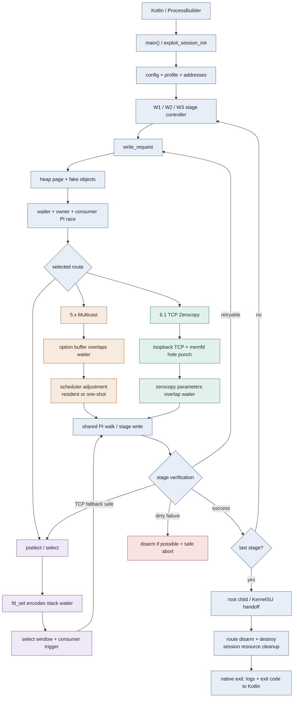
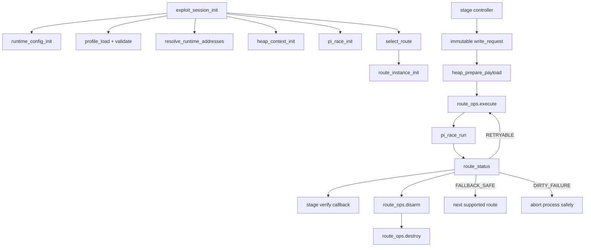

# 会话恢复与阶段执行规则

> 本节是跨会话继续工作的强制入口。恢复工作时先读本节，再查看“实施阶段”和“待回补 TODO 登记表”。

- [ ] 开始前检查 `git status`、最近提交、当前未完成阶段和代码 TODO。
- [ ] 现有未提交修改均视为用户资产；只暂存本阶段负责的文件或 hunk，不得重置或顺带提交。
- [ ] 每次只实施一个阶段；阶段结束时必须保持三条攻击链可编译、可运行及回退兼容。
- [ ] `main.c` 允许提前修改：与当前阶段直接相关且简单、安全的调用点同步迁移，不积压到最后。
- [ ] 简单修改若被 profile、共享解析器或复杂全局状态阻塞，先保留兼容行为并在代码现场添加结构化 TODO；同时在依赖所属的后续阶段登记“回补 TODO”子项。
- [ ] 阶段及所有子项使用 checkbox。完成静态检查和构建后创建本阶段独立提交并立即暂停。
- [ ] 用户真机确认前不得进入下一阶段。失败时留在当前阶段，通过修复提交重新测试。
- [ ] 用户确认真机结果后，先导出并分析本次完整 Native 日志；原始日志保存为 `analysis/device-gates/Sxx-YYYYMMDD-<route>-<pass|fail>.native.log`，分析保存为同名前缀的 `.md`。分析至少记录设备/release、入口、路线、CPU、温度条件、W1/W2/W3 重试、运行时回退、KernelSU 交接、清理和异常；缺失信息必须明确标为“日志不可判定”，不得臆测。
- [ ] 真机日志和分析保存后，再勾选真机门禁与阶段总项，并创建独立的门禁证据提交；TODO 只有在代码注释与登记项同时删除后才算完成。已完成的 S01–S03 不追溯补做。
- [ ] 每阶段真机日志分析完成后，更新 `analysis/routes.md` 的“核心维护图：三路线端到端主链”，只反映该阶段已经验证的结构变化。
- [ ] 核心维护图保持简洁，只展示入口、配置/profile、W1/W2/W3、共享 heap/PI、三路线分叉、验证、回退和清理；详细函数图继续留在 `all-functions-callgraph.md`，不要求每阶段同步重画。

规划注释必须说明当前职责、副作用、输入、输出、未来拆分/名称、目标上下文及兼容策略：

```c
/* Decoupling plan: <当前职责>。Inputs: <显式和隐式输入>;
 * output: <返回值、状态变化、所有权>。Future: <攻击链语义名称>；
 * <目标上下文及兼容说明>。 */
```

阻塞 TODO 统一格式：

```c
// TODO(decoupling:Sxx-topic): Future: <目标符号>；Input: ...；Output: ...
// Blocked by: ...；Completion: 在 Sxx 回补并删除本注释。
```

新符号不含具体内核版本号。固定路线前缀为 `multicast_waiter_`、`tcp_zerocopy_`、`select_stack_`；版本和布局仅写入 profile、注释或测试名。

# Native 混合式 C 解耦计划书

## 1. 目标与非目标

目标是用C的结构体、函数指针、显式参数和返回值替代可变全局状态，使三条route可独立准备、执行、disarm和清理。

不迁移C++，不改Kotlin启动协议、offset JSON格式、环境变量和Rust提取器。首要目标是保持现有时序和内存布局，而不是重写攻击逻辑。

## 2. 设计原则

1. 每个fd、映射、线程、子进程、buffer和内核对象引用有唯一所有者。
2. 用户态 `destroy` 与内核状态 `disarm` 分开。
3. 线程入口只通过 `void *arg` 取得所需context，不读可变进程全局量。
4. 确定性计算接受 `const` 输入并返回结果，不依赖环境变量或文件单例。
5. 路线只返回结构化状态，不通过 `route_last_*` 或日志传递控制信息。
6. 迁移期允许短期兼容包装，但同一状态不得同时存在新旧两份权威副本。

## 3. 目标对象模型

```c
struct runtime_config {
    int primary_cpu;
    int consumer_cpu;
    bool safe_mode;
    char home_dir[256];
    char root_script_path[320];
};

struct address_space {
    uint64_t kernel_phys_load;
    uintptr_t init_cred_image;
    /* 发布后不可变的常用运行期地址 */
};

struct payload_layout {
    uintptr_t fake_lock;
    uintptr_t fake_waiter;
    uintptr_t fake_task;
    uintptr_t fake_parent;
    uintptr_t fake_right;
    uintptr_t fake_left;
    uintptr_t fake_fops;
};

struct payload_page {
    uintptr_t base;
    struct payload_layout layout;
    struct reclaim_pair reclaim;
    enum payload_page_state state;
};

struct pi_race_context {
    struct pi_futexes futexes;
    struct pi_sync sync;
    struct consumer_status consumer;
    pthread_t waiter_thread;
    pthread_t owner_thread;
    pthread_t consumer_thread;
};

struct heap_context {
    struct kernelsnitch_context snitch;
    struct mm_ctx_sets mm;
    struct payload_page current;
    struct payload_page prebuilt;
    unsigned char *skb_buffer;
    size_t skb_buffer_size;
};

struct exploit_session {
    struct runtime_config config;
    const struct kernel_offsets *profile;
    struct address_space addresses;
    struct heap_context heap;
    struct pi_race_context race;
    struct victim_context victim;
    struct route_instance route;
    enum exploit_phase phase;
};
```

## 4. Route多态与失败语义

```c
enum route_result_code {
    ROUTE_OK,
    ROUTE_RETRYABLE,
    ROUTE_FALLBACK_SAFE,
    ROUTE_DIRTY_FAILURE,
    ROUTE_UNSUPPORTED,
};

struct route_status {
    enum route_result_code code;
    int step;
    int error_number;
    bool userspace_clean;
    bool kernel_disarmed;
};

struct route_ops {
    const char *name;
    bool (*supports)(const struct kernel_offsets *profile,
                     const struct runtime_config *config);
    struct route_status (*prepare)(struct route_instance *,
                                   struct exploit_session *);
    struct route_status (*execute)(struct route_instance *,
                                   struct exploit_session *,
                                   const struct write_request *);
    struct route_status (*disarm)(struct route_instance *,
                                  struct exploit_session *);
    void (*destroy)(struct route_instance *, struct exploit_session *);
    bool (*is_clean)(const struct route_instance *);
};
```

`ROUTE_FALLBACK_SAFE` 必须同时满足 `userspace_clean && kernel_disarmed`。`ROUTE_DIRTY_FAILURE` 立即停止当前进程的后续route尝试。

## 5. 函数式边界

以下函数应保持无资源所有权，并尽可能成为纯函数：

```c
int validate_offsets_profile(const struct kernel_offsets *,
                             struct validation_error *);

int resolve_runtime_addresses(const struct kernel_offsets *,
                              enum soc_family,
                              struct address_space *);

enum route_kind select_route(const struct kernel_offsets *,
                             const struct runtime_config *);

int build_payload(const struct kernel_offsets *,
                  const struct address_space *,
                  const struct write_request *,
                  uintptr_t page_base,
                  unsigned char *buffer,
                  size_t buffer_size,
                  struct payload_layout *result);
```

环境变量只在 `runtime_config_init()` 读取一次。route选择、payload布局和后续重试均使用该快照，避免同一次执行中语义变化。

## 6. 状态迁移映射

| 现有状态 | 新位置/处理 |
|---|---|
| `active_offsets` | `session.profile`，发布后 `const` |
| `p0_kernel_phys_load`, `g_init_cred_image` | `session.addresses` |
| `g_core_*`, `g_home_dir`, `g_root_script_path` | `session.config` |
| `t0` | 计时函数的显式基准参数 |
| PI futex和全部同步原子量 | `session.race` |
| `page_base`, `fake_*` | `session.heap.current` |
| `pselect_custom_*` | 单次 `const struct write_request` |
| KS、四组mm context、SKB、leak child/fd | `session.heap` |
| reclaim/quarantine/prebuilt数组 | 带显式状态的 `payload_page/reclaim_pair` |
| `route_last_step/errno` | `struct route_status` 返回值 |
| `mr_*` | `multicast_route_context` |
| `tcp_punch_*` | `tcp_route_context` |
| `standard_io_backup` | `pselect_route_context` |
| `g_file_buf` | JSON loader调用者缓冲 |
| `futex_hashsize` | `kernelsnitch_context.hash_size` |

## 7. 端到端三路线简图



- 三条路线共用初始化、阶段控制、payload页、PI竞争、写后验证和最终清理。
- 路线差异仅集中在“如何让可控数据与stale waiter重叠”：Multicast option、TCP zerocopy参数或select栈上 `fd_set`。
- TCP只能在同时确认用户态资源已清理且内核状态已disarm时回退pselect；dirty failure不继续切换路线。

## 8. 目标调用流



## 9. 实施阶段与真机门禁

阶段标题只有在实现、构建、提交和用户真机确认全部完成后才勾选。每次提交后立即暂停。

### [x] S01：待重构函数规划注释

- [x] 枚举需要拆分、改名或移除全局状态的核心 native C 函数。
- [x] 为目标函数注明职责、输入输出、隐式状态、未来名称和目标上下文。
- [x] 覆盖 `main.c`、`fops.c`、`util.c`、offset JSON、KernelSnitch 和 futex hash 边界。
- [x] 确定保持不变的纯 hash/parser/buffer helper 不添加无意义重构注释。
- [x] 本阶段不改变控制流、ABI、数据布局或攻击时序。
- [x] CLion/Native 编译检查通过（`buildGhostlockNative`；完整 `assembleDebug` 另被本机缺少 Rust Android target 阻塞）。
- [x] 提交 `docs(native): annotate decoupling targets`。
- [x] 提交后暂停。
- [x] 用户真机兼容性确认（提交 `1959270`）。

### [x] S02：无状态工具与运行配置

- [x] 标准化时间、CPU、错误返回、路径和环境快照接口。
- [x] 引入 `RuntimeConfig`；旧 `init_cpu_config()` 保留薄包装。
- [x] 同步迁移 `main.c` 的配置初始化、路径和功能开关调用。
- [x] profile 阻塞项已添加 S08 TODO 并登记。
- [x] 完整 `assembleDebug` 构建通过。
- [x] 提交并暂停。
- [x] 用户真机兼容性确认（连续高温会显著降低竞态成功率；固定核心并冷却后验证通过）。
- [x] 核心维护 UML 已补画到 S02 状态。

### [x] S03：Kotlin 主导的 Profile 配置管线

- [x] 将 `src/kernels/offsets.h` 及各内核头文件中的全部 `known_offsets` 条目等价转换为应用内置 JSON；逐字段比较生成结果，转换完成后 C 不再保存内置 profile 表（43/43 条；每个 kernel release 独立文件，旧头文件仅暂留提取器兼容格式定义）。
- [x] 建立单一版本化 schema：`kernel_profiles/index.json` 保存 `schema_version` 及 release→文件索引，`defaults.json` 保存兼容默认值；每个 release 文件包含自身 `schema_version`、能力、符号、结构偏移、payload 布局及 `execution` 调优参数。
- [x] JSON 保持纯机器数据；`defaults.md` 逐项说明公共参数，`templates/` 为 5.x、6.1、6.6、6.12 四类模板分别提供中英双语说明，profile 总指南负责新设备流程与跳转。
- [x] 文档按语言拆为英文 `.md` 与中文 `_ZH.md`，同语种链接闭合；四个版本文件各自包含完整字段和分层 execution 说明，不再依赖共有模板文档；全部说明迁至顶层 `docs/kernel_profiles/`，不打包进 APK assets。
- [x] 弃用并删除 `src/kernels/**/offsets.h` C 配置表及提取器 `--register` C 注册入口；Makefile 和中英文文档切换到 JSON profile 目录。
- [x] `execution` 纳入当前硬编码的等待时间、超时、重试次数、consumer/路线时序以及推荐 `main_cpu`/`consumer_cpu`；缺省值必须逐项等于修改前常量，避免改变现有攻击行为。
- [x] Kotlin 负责读取内置 JSON、匹配 `uname -r`、合并用户导入配置、验证 schema，并生成单个完全解析的 `active-profile.json`。
- [x] 配置优先级固定为：用户针对同一 release 的字段覆盖 > 内置 JSON > schema 兼容默认值；CPU 界面显式选择 > profile 推荐核心。
- [x] 普通 App 路线将解析后的 profile 写入私有工作目录；Shizuku 路线通过 AIDL 传递解析后的 JSON 文本，由 shell UserService 在其工作目录写入仅本次运行使用的文件。
- [x] Kotlin 启动 Native 时统一传入 `--profile <absolute-path>`；Native 只反序列化该单一 resolved profile、再次校验 release/范围并执行，不再自行选择或合并配置源。
- [x] 迁移 `offsets_json.c` 为“单 profile 传输解码器”：删除共享 buffer、内置表回退和 release 搜索，只保留严格反序列化与 Native 侧防御性验证。
- [x] 为独立命令行调试保留显式 `--profile`，缺少或无效配置时安全退出并给出错误；不得静默回退到 `target.h` 或 C 内置配置。
- [x] 保留现有 offsets 导入入口和默认攻击界面，不在本阶段增加高级编辑页面；现有用户不修改参数时，行为、日志关键字和选路必须保持一致。
- [x] 添加详细 UI TODO：profile 来源/版本展示、推荐核心一键应用、高级参数编辑、恢复默认值、逐字段校验错误、导入差异预览和危险参数确认。
- [x] 添加用户自定义 TODO：按 release 保存稀疏 override、导入/导出、schema 迁移、内置更新后的三方合并及回滚。
- [x] 为 Native 仍使用 `struct kernel_offsets` 和宏读取参数的部分添加 S08 TODO；S08 再收敛为只读 `TargetProfile`。
- [x] 静态验证 43 个独立内置 profile、索引一一对应、必需字段、schema、生成索引以及 Native 强制重编；内置/用户覆盖/未知 release/旧 schema/非法范围均在解析边界拒绝或合并。
- [x] 真机验证 App/Shizuku 两条启动入口和 CLI resolved profile 行为一致。
- [x] 完整 Gradle `assembleDebug` 构建通过。
- [x] 提交并暂停。
- [x] 真机门禁通过后勾选阶段标题并更新核心 UML。
- [x] 真机门禁首次失败后加入 Debug-only Native execution 参数快照；逐字段严格解码 JSON，并以 `debug.execution.<path>=<value>` 输出，与 S02 verbose 对照分支比较。
- [x] 对比 S02/S03 参数快照：33 个 execution 字段的键、顺序和值完全一致，仅来源标记不同；重新真机验证通过，未发现确定性的 profile 参数不兼容项。

S03 的 `execution` 固定分组如下，实施时不得重新决定字段归属：

```json
{
  "execution": {
    "recommended_cpus": { "main": 0, "consumer": 1 },
    "heap": {
      "prepare_max_attempts": 0,
      "prepare_timeout_ms": 0,
      "kernelsnitch_timeout_ms": 0
    },
    "race": {
      "route_wait_ms": 0,
      "setup_settle_us": 0,
      "state_poll_interval_us": 0
    },
    "stages": {
      "w1_attempts": 0,
      "w1_settle_us": 0,
      "w1_scratch_repair_attempts": 0,
      "w2_attempts": 0,
      "w2_settle_us": 0,
      "w3_chain_rounds": 0,
      "w3_attempts": 0,
      "w3_settle_us": 0
    },
    "routes": {
      "tcp_zerocopy": {
        "attempts": 0,
        "arm_sequence": 0,
        "post_receive_hold_iterations": 0
      },
      "select_stack": {
        "enter_delay_us": 0,
        "timeout_us": 0,
        "consumer_max_calls": 0,
        "consumer_burst_calls": 0
      },
      "multicast_waiter": {
        "ready_timeout_ms": 0,
        "post_requeue_settle_us": 0,
        "post_adjust_settle_us": 0
      }
    },
    "handoff": {
      "pre_dispatch_settle_ms": 0,
      "module_poll_attempts": 0,
      "module_poll_interval_ms": 0,
      "enforce_poll_attempts": 0,
      "enforce_poll_interval_ms": 0
    }
  }
}
```

示例中的 `0` 是 schema 占位，不是运行默认值。转换脚本必须从当前 C 常量和字面量填入实际兼容值；缺字段时 Kotlin 使用同一份 schema defaults，Native 收到的 resolved profile 不允许再含未解析缺省值。所有时间统一使用带单位后缀的字段名。

### [x] S04：Futex Hash 上下文

- [x] 引入 `FutexHashContext`，显式传递表大小。
- [x] 保持 Jenkins hash 结果和兼容入口不变。
- [x] 固定 key/mm/table-size 输入向量对比新旧 hash 结果（A301SO 真机执行四组向量，显式 context、旧截断函数和旧入口结果逐位一致）。
- [x] 完整 Gradle `assembleDebug` 构建通过。
- [x] 提交并暂停。
- [x] 用户真机兼容性确认（A301SO、Shizuku、5.15 Multicast 路线）。
- [x] 真机确认后导出完整日志，完成分析并保存 S04 门禁证据。

### [ ] S05：KernelSnitch 上下文

- [ ] 引入 `KernelSnitchContext`，收拢 hash、线程、扫描和结果状态。
- [ ] 生命周期拆为 init、scan、result、destroy。
- [ ] 线程只访问传入 context；旧入口保留包装。
- [ ] 构建、提交、暂停并通过真机门禁。
- [ ] 真机确认后导出完整日志，完成分析并保存 S05 门禁证据。

### [ ] S06：地址状态与 profile view

- [ ] 引入 `ResolvedAddresses` 和只读 `TargetProfile` view。
- [ ] 将简单地址初始化和访问器同步接入 `main.c`。
- [ ] 兼容层暂时镜像旧地址全局量。
- [ ] 复杂 profile 依赖登记到 S08。
- [ ] 构建、提交、暂停并通过真机门禁。
- [ ] 真机确认后导出完整日志，完成分析并保存 S06 门禁证据。

### [ ] S07：Payload/WriteRequest 构建器

- [ ] 用不可变 `WriteRequest` 替代 `pselect_custom_*` 写配置。
- [ ] 分离共享布局和三条路线的 waiter 编码。
- [ ] 安全调用点同步迁移；受 profile/路线状态阻塞处添加 TODO。
- [ ] 对新旧 payload 做逐字节比较。
- [ ] 构建、提交、暂停并通过真机门禁。
- [ ] 真机确认后导出完整日志，完成分析并保存 S07 门禁证据。

### [ ] S08：Profile 对象化与首轮 TODO 回补

- [ ] profile 解析不再直接发布分散全局变量。
- [ ] 提供三条攻击链的语义化能力和布局访问器。
- [ ] 将 S03 已传入 Native 的等待、重试、时序和推荐核心字段接入 `TargetProfile`；删除对应硬编码常量，保留等价默认值。
- [ ] 回补 S02 的配置/profile TODO。
- [ ] 回补 S03 的 parse/profile 激活 TODO。
- [ ] 回补 S06 的地址解析 TODO。
- [ ] 回补 S07 的 payload/profile TODO。
- [ ] 对照 TODO 登记表删除已完成的代码注释。
- [ ] 构建、提交、暂停并通过三条路线真机门禁。
- [ ] 真机确认后分别导出三条路线完整日志，完成分析并保存 S08 门禁证据。

### [ ] S09：Heap 与 PayloadPage 所有权

- [ ] 引入 `HeapContext`、`PayloadPage`、`ReclaimPair` 和显式状态转换。
- [ ] 统一 child、memfd、mapping、SKB、current/prebuilt/quarantine 所有权。
- [ ] 保持分配顺序、喷射布局和释放时机兼容。
- [ ] 构建、提交、暂停并通过真机门禁。
- [ ] 真机确认后导出完整日志，完成分析并保存 S09 门禁证据。

### [ ] S10：共享 PI 竞态

- [ ] 引入 `PiRaceContext`，迁移 futex、原子量和线程句柄。
- [ ] 拆分 reset、start、run、stop、destroy。
- [ ] 修改 `main.c` 线程入口以显式传入 context，保持同步顺序不变。
- [ ] 处理部分线程创建失败时的 join/清理。
- [ ] 构建、提交、暂停并通过真机门禁。
- [ ] 真机确认后导出完整日志，完成分析并保存 S10 门禁证据。

### [ ] S11：TCP Zerocopy 路线

- [ ] 引入 `TcpZerocopyRouteContext`。
- [ ] 拆分 prepare、execute、disarm、destroy。
- [ ] fd、mapping、memfd 和 punch worker 由路线唯一拥有。
- [ ] 构建、提交、暂停并通过 TCP 真机门禁。
- [ ] 真机确认后导出 TCP 完整日志，完成分析并保存 S11 门禁证据。

### [ ] S12：Select Stack 路线

- [ ] 引入 `SelectStackRouteContext`。
- [ ] 迁移 fd_set、stdio backup、waiter layout、执行和 dirty cleanup。
- [ ] 回补 S07/S08 登记的 select-stack TODO。
- [ ] 构建、提交、暂停并通过 compact/tree 两类真机门禁。
- [ ] 真机确认后分别导出 compact/tree 完整日志，完成分析并保存 S12 门禁证据。

### [ ] S13：Multicast Waiter 路线

- [ ] 引入 `MulticastWaiterRouteContext`。
- [ ] 分离 resident/one-shot 共享 stamp、执行、ghost disarm 和清理。
- [ ] 回补 W1/W2 repair、quarantine 和 resident 生命周期 TODO。
- [ ] 保持 W1/W2 修复顺序及长期 writer 行为。
- [ ] 构建、提交、暂停并通过 multicast 真机门禁。
- [ ] 真机确认后导出 multicast 完整日志，完成分析并保存 S13 门禁证据。

### [ ] S14：统一路线接口与运行时回退

- [ ] 定义统一 supports、prepare、execute、disarm、destroy 接口。
- [ ] `main.c` 只负责路线选择和阶段编排。
- [ ] 保持现有路线优先级、错误语义和回退顺序。
- [ ] 仅在用户态清理完成且内核状态 disarm 后允许切换路线。
- [ ] 构建、提交、暂停并验证三条路线及 TCP→Select 回退。
- [ ] 真机确认后分别导出三路线及 TCP→Select 回退日志，完成分析并保存 S14 门禁证据。

### [ ] S15：兼容层、遗留全局和文档收尾

- [ ] 删除零调用的包装、全局镜像和宽泛 `common.h` extern。
- [ ] 检查所有 TODO：完成或记录明确保留理由及后续缺陷编号。
- [ ] 更新全函数调用图、数据流图和全局状态矩阵。
- [ ] 全量构建、提交、暂停并完成最终真机回归。
- [ ] 真机确认后导出最终回归完整日志，完成分析并保存 S15 门禁证据。

## 10. 待回补 TODO 登记表

| 来源阶段 | 代码位置/事项 | 阻塞依赖 | 回补阶段 | 状态 |
|---|---|---|---|---|
| S02 | `tcp_route_selected()` 仍组合 `active_offsets` 与配置快照 | `TargetProfile` 未对象化 | S08 | [x] 已产生，待回补 |
| S02 | `CORE`/`CONSUMER_CORE` 仍需两个兼容镜像 | PI worker 尚未接收 context | S10 | [x] 已产生，待回补 |
| S02 | `main.c` 路径使用配置对象的兼容别名 | `ExploitSession` 尚未成为编排入口 | S14 | [x] 已产生，待回补 |
| S03 | Native 解码后的 resolved JSON 暂存于 `struct kernel_offsets` | profile 消费宏与地址解析尚未对象化 | S08 | [x] 已产生，待回补 |
| S03 | 等待时间、超时、重试次数、路线时序和推荐核心加入 JSON `execution` | Native 各调用点仍使用散落常量 | S08 | [x] 已规划，待接入 |
| S03 | 高级 profile 参数编辑和推荐核心 UI | S03 只迁移数据管线并保持原界面 | UI 后续阶段 | [x] 已规划，待实现 |
| S03 | 用户稀疏 override、导入导出、schema 迁移与回滚 | 需要稳定 schema 和产品交互设计 | UI 后续阶段 | [x] 已规划，待实现 |
| S06 | 地址访问器仍镜像旧全局量 | profile view 尚未统一 | S08 | [ ] 待产生/回补 |
| S07 | select/multicast payload 布局读取全局 profile | 路线布局访问器未统一 | S08/S12/S13 | [ ] 待产生/回补 |
| S13 | W1/W2 fast repair 与 multicast 清理交织 | heap、race、路线 context 均需完成 | S13 | [ ] 待产生/回补 |

## 附录 A：按文件迁移细节

工具和route文件按依赖从少到多迁移。每次只改一个源文件或一组不可分割的`.c/.h`接口，并使用短期兼容包装保证`main.c`在工具文件迁移期不需频繁修改。

### A.1 Kotlin/Profile JSON 配置边界

- Kotlin 是配置源、release 选择、内置/用户合并和 schema 迁移的唯一所有者。
- C 内置 profile 逐项迁移为应用资源 JSON；构建期生成 Kotlin 索引，避免同时维护第二份 release 列表。
- Native 只接收 `--profile` 指定的 resolved 单 profile 文件，并执行严格解码和防御性验证。
- `offsets_json.c/.h` 不再管理配置来源或合并，只作为临时传输解码层；S08 将结果包装为只读 `TargetProfile`。

### 9.2 `kernelsnitch/timeutils.h`：纯计时辅助

- 保持`rdtsc_begin/end`无状态，统一类型、`const`和命名。
- 不改指令、屏障和调用顺序；用汇编对比验证。

### 9.3 `kernelsnitch/utils.h`：系统helper窄化

- CPU固定、rlimit、namespace、文件和数值解析按职责分组。
- `pin_to_core()`只使用显式CPU参数，不读`CORE`/`CONSUMER_CORE`宏。
- 底层helper返回错误，不隐式终止进程；兼容宏保留到调用者迁完。

### 9.4 `kernelsnitch/futex_hash.h`：移除hash全局状态

- 用`futex_hash_context.table_size`替代`futex_hashsize`。
- `futex_hash()`显式接受context；Jenkins hash helper继续保持纯函数。
- 用固定key/mm输入向量对比新旧hash结果。

### 9.5 `kernelsnitch/kernelsnitch.h`：收敛地址发现上下文

- hash context、worker线程、扫描状态和泄露结果统一归入`kernelsnitch_context`。
- 生命周期统一为`init → scan → result → destroy`。
- 线程入口只通过`arg`访问context；不重写碰撞搜索算法和时序参数。

### 9.6 `offset.h` / runtime offset headers：只读profile接口

- 引入`kernel_profile_view`，封装`kernel_offsets`和三条攻击链能力。
- 将`mm_struct_sz()`、`kernelsnitch_collisions()`和`_RSO`宏改为带profile参数的`static inline`访问器。
- 能力命名为`supports_multicast_waiter`、`supports_tcp_zerocopy`、`supports_select_stack`。

### 9.7 `util.c`第一步：运行配置与地址空间

- 新建`runtime_config.c/.h`，一次读取CPU、路径和环境变量。
- 新建`address_space.c/.h`，收纳物理加载地址、`init_cred`和地址换算。
- `util.c`暂时提供旧签名包装，保持`main.c`可构建。

### 9.8 `util.c`第二步：payload builder函数式化

- 新建`payload_builder.c/.h`，用不可变`write_request`替代`pselect_custom_*`。
- 分离路线无关布局、waiter编码和credential template填充。
- 攻击链编码函数命名为`build_multicast_waiter_payload()`、`build_tcp_zerocopy_payload()`、`build_select_stack_payload()`。
- 对新旧payload buffer做逐字节对比。

### 9.9 `util.c`第三步：堆与页所有权

- 新建`heap_spray.c/.h`，引入`heap_context`、`payload_page`、`reclaim_pair`和`mm_context_sets`。
- current/prebuilt/quarantined通过显式state及move/swap/destroy转移，不再逐个复制`fake_*`。
- kernelsnitch、child、memfd、SKB和reclaim socket都有唯一所有者。

### 9.10 `fops.c`第一步：TCP Zerocopy攻击链

- 新建`routes/tcp_zerocopy_route.c/.h`，迁移loopback pair、memfd punch、mapping和consumer协调。
- `tcp_punch_*`进入`tcp_zerocopy_context`。
- 入口统一为`tcp_zerocopy_prepare/execute/disarm/destroy`，worker名为`tcp_zerocopy_punch_worker`。
- 先迁此route，因为其fd/mmap/thread清理已集中在单一`out`路径。

### 9.11 `fops.c`第二步：Select Stack攻击链

- 新建`routes/select_stack_route.c/.h`，迁移fd-set映射、waiter shift、标准fd备份和select/pselect执行。
- 原`pselect_*`工具函数改为`select_stack_*`。
- syscall及waiter布局差异通过profile数据表达，不放入函数名。
- consumer stuck返回`ROUTE_DIRTY_FAILURE`，必要fd由route context保留到进程退出。

### 9.12 `fops.c`第三步：Multicast Waiter攻击链

- 新建`routes/multicast_waiter_route.c/.h`。
- 全部`mr_*`改为`multicast_resident_*`并进入`multicast_waiter_context`。
- resident与non-resident共用stamp/payload helper；ghost disarm、scratch quarantine/repair和resident stop统一归路线生命周期。
- 适用内核版本只在profile和注释中说明。

### 9.13 `fops.c`收敛：公共route接口

- 将剩余公共逻辑收敛为`route.c/.h`，或在无剩余职责时删除`fops.c`。
- 定义`route_ops`、`route_instance`、`route_status`和候选选择器。
- 只有`ROUTE_FALLBACK_SAFE`且同时满足userspace clean/kernel disarmed才能切换route。

### 9.14 `common.h`：最后拆除全局总线

- 删除`page_base`、`fake_*`、PI原子量、route结果和route私有状态的`extern`。
- 拆分profile、runtime、heap、race、route和victim窄接口。
- 用CLion“查找使用位置”确认每个旧符号为零引用后才删除。

### A.15 `main.c`：随阶段渐进接入并最终收敛

- 每个工具或路线阶段均可同步修改简单、安全且直接相关的`main.c`调用点。
- 被 profile 或共享状态阻塞的调用保留兼容包装，并按结构化格式登记 TODO。
- S14 将剩余编排切换到`exploit_session`、`write_request`和`route_status`；S15删除包装和旧全局量。
- Kotlin启动、环境变量、日志关键字和退出码始终保持兼容。

## 附录 B：攻击链命名规则

| 禁止/逐步淘汰 | 统一命名 |
|---|---|
| `kernel5_*`、`5x_*` | `multicast_waiter_*` |
| `mr_*` | `multicast_resident_*` |
| 泛化`tcp_*` | `tcp_zerocopy_*` |
| `pselect_*` route helper | `select_stack_*` |
| `6_1_*`、`6_6_*`、`compact_route_*` | 通过`waiter_layout`和profile能力表达 |

- 攻击链公共前缀固定为`multicast_waiter_`、`tcp_zerocopy_`、`select_stack_`。
- 内核版本号仅允许出现在profile数据、测试名和兼容性注释中。
- 函数名表达行为和资源语义，不表达某个历史内核实现。

## 附录 C：IDE与构建验证流程

1. C阶段使用CLion，确认CMake代码模型为Android ARM64/NDK并等待索引完成。
2. 每次改名前后使用CLion符号导航和“查找使用位置”核对引用集。
3. 检查CLion Problems，不新增未解析符号、头文件循环或类型错误。
4. CLion CMake仅用于代码模型；真实构建仍使用上层Gradle/NDK配置。
5. Kotlin边界使用IntelliJ IDEA检查Repository、`ProcessBuilder`、AIDL和Shizuku转发入口。
6. 每阶段同步更新全局状态矩阵和调用图，记录已消除的全局状态。

## 附录 D：测试计划

| 层级 | 场景 |
|---|---|
| 纯函数 | profile校验、SoC地址换算、route选择、compact/tree payload布局、JSON解析 |
| 所有权 | 部分init失败、重复destroy、current↔prebuilt move、quarantine→release |
| 故障注入 | socket、memfd、mmap、pthread、futex、perf、文件读写失败 |
| 并发 | waiter/owner/consumer只访问传入context；线程启动失败时join已创建部分 |
| Route | `OK`、`RETRYABLE`、`FALLBACK_SAFE`、`DIRTY_FAILURE`、`UNSUPPORTED` |
| 真机 | 5.x Multicast、6.1 TCP、6.1 pselect、6.6/6.12 pselect、App Seccomp、Shizuku Seccomp=0 |

## 附录 E：验收标准

- `common.h` 不再导出可变攻击状态。
- 线程入口不读任何route或PI可变全局量。
- 每个fd、线程、mapping、child和buffer都能在类型中找到唯一所有者。
- 阶段控制器不包含 `kernel5_route_selected()` 或 `tcp_route_selected()` 类的具体route分支。
- route失败可结构化表示用户态清理和内核disarm状态。
- TCP→pselect只在确认clean时发生。
- 现有Kotlin启动方式、offset JSON、环境变量、关键日志和退出码保持兼容。
- 新函数和类型不使用内核版本号，三条route均使用统一攻击链命名。
- 每个非`main.c`阶段都能独立通过CLion索引、Gradle/NDK构建和对应测试后再进入下一阶段。
