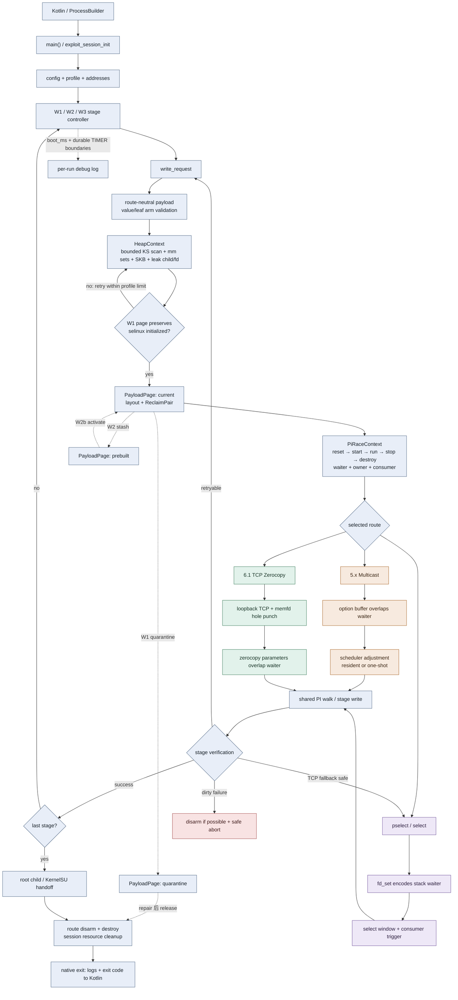
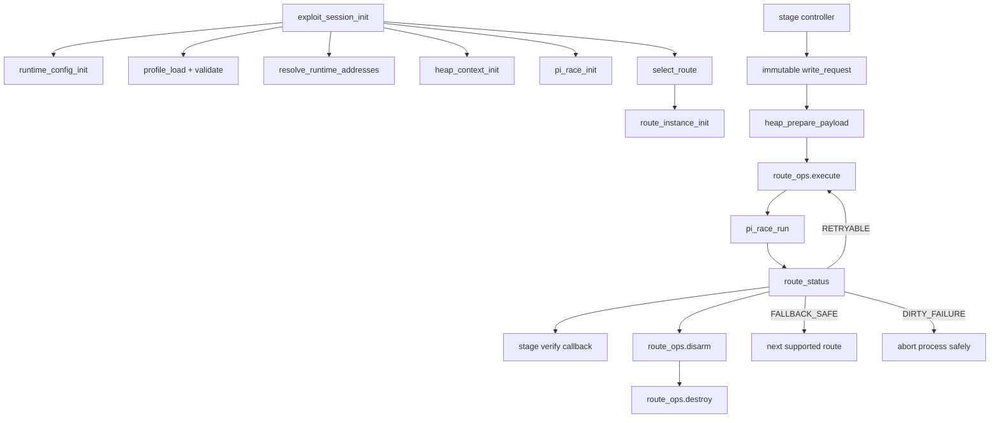

# 会话恢复与阶段执行规则

> 本节是跨会话继续工作的强制入口。恢复工作时先读本节，再查看“实施阶段”和“待回补 TODO 登记表”。

- [ ] 开始前检查 `git status`、最近提交、当前未完成阶段和代码 TODO。
- [ ] 现有未提交修改均视为用户资产；只暂存本阶段负责的文件或 hunk，不得重置或顺带提交。
- [ ] 每次只实施一个阶段；阶段结束时必须保持三条攻击链可编译、可运行及回退兼容。
- [ ] `main.c` 允许提前修改：与当前阶段直接相关且简单、安全的调用点同步迁移，不积压到最后。
- [ ] 简单修改若被 profile、共享解析器或复杂全局状态阻塞，先保留兼容行为并在代码现场添加结构化 TODO；同时在依赖所属的后续阶段登记“回补 TODO”子项。
- [ ] 阶段及所有子项使用 checkbox。完成静态检查和构建后创建本阶段独立提交并立即暂停。
- [ ] 用户真机确认前不得进入下一阶段。失败时留在当前阶段，通过修复提交重新测试。
- [ ] 用户确认真机结果后，先导出并分析本次完整 Native 日志；原始日志保存为 `analysis/device-gates/Sxx-YYYYMMDD-<route>-<pass|fail>.native.log`，分析保存为同名前缀的 `.md`。分析至少记录设备/release、入口、路线、CPU、温度条件、W1/W2/W3 重试、运行时回退、KernelSU 交接、清理和异常；缺失信息必须明确标为“日志不可判定”，不得臆测。
- [ ] 真机日志和分析保存后，再勾选真机门禁与阶段总项，并创建独立的门禁证据提交；TODO 只有在代码注释与登记项同时删除后才算完成。已完成的 S01–S03 不追溯补做。
- [ ] 每阶段真机日志分析完成后，更新 `analysis/routes.md` 的“核心维护图：三路线端到端主链”，只反映该阶段已经验证的结构变化。
- [ ] 核心维护图保持简洁，只展示入口、配置/profile、W1/W2/W3、共享 heap/PI、三路线分叉、验证、回退和清理；详细函数图继续留在 `all-functions-callgraph.md`，不要求每阶段同步重画。
- [ ] C++ 现代化续章（`## 11`，M01+）复用本节全部门禁、日志证据与“提交后暂停”流程；其硬约束优先于现代化收益，任何无法证明与 S15 基线二进制等价的改动都必须回退或保留 C 兼容实现。

规划注释必须说明当前职责、副作用、输入、输出、未来拆分/名称、目标上下文及兼容策略：

```c
/* Decoupling plan: <当前职责>。Inputs: <显式和隐式输入>;
 * output: <返回值、状态变化、所有权>。Future: <攻击链语义名称>；
 * <目标上下文及兼容说明>。 */
```

阻塞 TODO 统一格式：

```c
// TODO(decoupling:Sxx-topic): Future: <目标符号>；Input: ...；Output: ...
// Blocked by: ...；Completion: 在 Sxx 回补并删除本注释。
```

新符号不含具体内核版本号。固定路线前缀为 `multicast_waiter_`、`tcp_zerocopy_`、`select_stack_`；版本和布局仅写入 profile、注释或测试名。

# Native 混合式 C 解耦计划书

## 1. 目标与非目标

目标是用C的结构体、函数指针、显式参数和返回值替代可变全局状态，使三条route可独立准备、执行、disarm和清理。

不迁移C++，不改Kotlin启动协议、offset JSON格式、环境变量和Rust提取器。首要目标是保持现有时序和内存布局，而不是重写攻击逻辑。

## 2. 设计原则

1. 每个fd、映射、线程、子进程、buffer和内核对象引用有唯一所有者。
2. 用户态 `destroy` 与内核状态 `disarm` 分开。
3. 线程入口只通过 `void *arg` 取得所需context，不读可变进程全局量。
4. 确定性计算接受 `const` 输入并返回结果，不依赖环境变量或文件单例。
5. 路线只返回结构化状态，不通过 `route_last_*` 或日志传递控制信息。
6. 迁移期允许短期兼容包装，但同一状态不得同时存在新旧两份权威副本。

## 3. 目标对象模型

```c
struct runtime_config {
    int primary_cpu;
    int consumer_cpu;
    bool safe_mode;
    char home_dir[256];
    char root_script_path[320];
};

struct address_space {
    uint64_t kernel_phys_load;
    uintptr_t init_cred_image;
    /* 发布后不可变的常用运行期地址 */
};

struct payload_layout {
    uintptr_t fake_lock;
    uintptr_t fake_waiter;
    uintptr_t fake_task;
    uintptr_t fake_parent;
    uintptr_t fake_right;
    uintptr_t fake_left;
    uintptr_t fake_fops;
};

struct payload_page {
    uintptr_t base;
    struct payload_layout layout;
    struct reclaim_pair reclaim;
    enum payload_page_state state;
};

struct pi_race_context {
    struct pi_futexes futexes;
    struct pi_sync sync;
    struct consumer_status consumer;
    pthread_t waiter_thread;
    pthread_t owner_thread;
    pthread_t consumer_thread;
};

struct heap_context {
    struct kernelsnitch_context snitch;
    struct mm_ctx_sets mm;
    struct payload_page current;
    struct payload_page prebuilt;
    unsigned char *skb_buffer;
    size_t skb_buffer_size;
};

struct exploit_session {
    struct runtime_config config;
    const struct kernel_offsets *profile;
    struct address_space addresses;
    struct heap_context heap;
    struct pi_race_context race;
    struct victim_context victim;
    struct route_instance route;
    enum exploit_phase phase;
};
```

## 4. Route多态与失败语义

```c
enum route_result_code {
    ROUTE_OK,
    ROUTE_RETRYABLE,
    ROUTE_FALLBACK_SAFE,
    ROUTE_DIRTY_FAILURE,
    ROUTE_UNSUPPORTED,
};

struct route_status {
    enum route_result_code code;
    int step;
    int error_number;
    bool userspace_clean;
    bool kernel_disarmed;
};

struct route_ops {
    const char *name;
    bool (*supports)(const struct kernel_offsets *profile,
                     const struct runtime_config *config);
    struct route_status (*prepare)(struct route_instance *,
                                   struct exploit_session *);
    struct route_status (*execute)(struct route_instance *,
                                   struct exploit_session *,
                                   const struct write_request *);
    struct route_status (*disarm)(struct route_instance *,
                                  struct exploit_session *);
    void (*destroy)(struct route_instance *, struct exploit_session *);
    bool (*is_clean)(const struct route_instance *);
};
```

`ROUTE_FALLBACK_SAFE` 必须同时满足 `userspace_clean && kernel_disarmed`。`ROUTE_DIRTY_FAILURE` 立即停止当前进程的后续route尝试。

## 5. 函数式边界

以下函数应保持无资源所有权，并尽可能成为纯函数：

```c
int validate_offsets_profile(const struct kernel_offsets *,
                             struct validation_error *);

int resolve_runtime_addresses(const struct kernel_offsets *,
                              enum soc_family,
                              struct address_space *);

enum route_kind select_route(const struct kernel_offsets *,
                             const struct runtime_config *);

int build_payload(const struct kernel_offsets *,
                  const struct address_space *,
                  const struct write_request *,
                  uintptr_t page_base,
                  unsigned char *buffer,
                  size_t buffer_size,
                  struct payload_layout *result);
```

环境变量只在 `runtime_config_init()` 读取一次。route选择、payload布局和后续重试均使用该快照，避免同一次执行中语义变化。

## 6. 状态迁移映射

| 现有状态 | 新位置/处理 |
|---|---|
| `active_offsets` | `session.profile`，发布后 `const` |
| `p0_kernel_phys_load`, `g_init_cred_image` | `session.addresses` |
| `g_core_*`, `g_home_dir`, `g_root_script_path` | `session.config` |
| `t0` | 计时函数的显式基准参数 |
| PI futex和全部同步原子量 | `session.race` |
| `page_base`, `fake_*` | `session.heap.current` |
| `pselect_custom_*` | 单次 `const struct write_request` |
| KS、四组mm context、SKB、leak child/fd | `session.heap` |
| reclaim/quarantine/prebuilt数组 | 带显式状态的 `payload_page/reclaim_pair` |
| `route_last_step/errno` | `struct route_status` 返回值 |
| `mr_*` | `multicast_route_context` |
| `tcp_punch_*` | `tcp_route_context` |
| `standard_io_backup` | `pselect_route_context` |
| `g_file_buf` | JSON loader调用者缓冲 |
| `futex_hashsize` | `kernelsnitch_context.hash_size` |

## 7. 端到端三路线简图



- 三条路线共用初始化、阶段控制、payload页、PI竞争、写后验证和最终清理。
- 路线差异仅集中在“如何让可控数据与stale waiter重叠”：Multicast option、TCP zerocopy参数或select栈上 `fd_set`。
- TCP只能在同时确认用户态资源已清理且内核状态已disarm时回退pselect；dirty failure不继续切换路线。

## 8. 目标调用流



## 9. 实施阶段与真机门禁

阶段标题只有在实现、构建、提交和用户真机确认全部完成后才勾选。每次提交后立即暂停。

### [x] S01：待重构函数规划注释

- [x] 枚举需要拆分、改名或移除全局状态的核心 native C 函数。
- [x] 为目标函数注明职责、输入输出、隐式状态、未来名称和目标上下文。
- [x] 覆盖 `main.c`、`fops.c`、`util.c`、offset JSON、KernelSnitch 和 futex hash 边界。
- [x] 确定保持不变的纯 hash/parser/buffer helper 不添加无意义重构注释。
- [x] 本阶段不改变控制流、ABI、数据布局或攻击时序。
- [x] CLion/Native 编译检查通过（`buildGhostlockNative`；完整 `assembleDebug` 另被本机缺少 Rust Android target 阻塞）。
- [x] 提交 `docs(native): annotate decoupling targets`。
- [x] 提交后暂停。
- [x] 用户真机兼容性确认（提交 `1959270`）。

### [x] S02：无状态工具与运行配置

- [x] 标准化时间、CPU、错误返回、路径和环境快照接口。
- [x] 引入 `RuntimeConfig`；旧 `init_cpu_config()` 保留薄包装。
- [x] 同步迁移 `main.c` 的配置初始化、路径和功能开关调用。
- [x] profile 阻塞项已添加 S08 TODO 并登记。
- [x] 完整 `assembleDebug` 构建通过。
- [x] 提交并暂停。
- [x] 用户真机兼容性确认（连续高温会显著降低竞态成功率；固定核心并冷却后验证通过）。
- [x] 核心维护 UML 已补画到 S02 状态。

### [x] S03：Kotlin 主导的 Profile 配置管线

- [x] 将 `src/kernels/offsets.h` 及各内核头文件中的全部 `known_offsets` 条目等价转换为应用内置 JSON；逐字段比较生成结果，转换完成后 C 不再保存内置 profile 表（43/43 条；每个 kernel release 独立文件，旧头文件仅暂留提取器兼容格式定义）。
- [x] 建立单一版本化 schema：`kernel_profiles/index.json` 保存 `schema_version` 及 release→文件索引，`defaults.json` 保存兼容默认值；每个 release 文件包含自身 `schema_version`、能力、符号、结构偏移、payload 布局及 `execution` 调优参数。
- [x] JSON 保持纯机器数据；`defaults.md` 逐项说明公共参数，`templates/` 为 5.x、6.1、6.6、6.12 四类模板分别提供中英双语说明，profile 总指南负责新设备流程与跳转。
- [x] 文档按语言拆为英文 `.md` 与中文 `_ZH.md`，同语种链接闭合；四个版本文件各自包含完整字段和分层 execution 说明，不再依赖共有模板文档；全部说明迁至顶层 `docs/kernel_profiles/`，不打包进 APK assets。
- [x] 弃用并删除 `src/kernels/**/offsets.h` C 配置表及提取器 `--register` C 注册入口；Makefile 和中英文文档切换到 JSON profile 目录。
- [x] `execution` 纳入当前硬编码的等待时间、超时、重试次数、consumer/路线时序以及推荐 `main_cpu`/`consumer_cpu`；缺省值必须逐项等于修改前常量，避免改变现有攻击行为。
- [x] Kotlin 负责读取内置 JSON、匹配 `uname -r`、合并用户导入配置、验证 schema，并生成单个完全解析的 `active-profile.json`。
- [x] 配置优先级固定为：用户针对同一 release 的字段覆盖 > 内置 JSON > schema 兼容默认值；CPU 界面显式选择 > profile 推荐核心。
- [x] 普通 App 路线将解析后的 profile 写入私有工作目录；Shizuku 路线通过 AIDL 传递解析后的 JSON 文本，由 shell UserService 在其工作目录写入仅本次运行使用的文件。
- [x] Kotlin 启动 Native 时统一传入 `--profile <absolute-path>`；Native 只反序列化该单一 resolved profile、再次校验 release/范围并执行，不再自行选择或合并配置源。
- [x] 迁移 `offsets_json.c` 为“单 profile 传输解码器”：删除共享 buffer、内置表回退和 release 搜索，只保留严格反序列化与 Native 侧防御性验证。
- [x] 为独立命令行调试保留显式 `--profile`，缺少或无效配置时安全退出并给出错误；不得静默回退到 `target.h` 或 C 内置配置。
- [x] 保留现有 offsets 导入入口和默认攻击界面，不在本阶段增加高级编辑页面；现有用户不修改参数时，行为、日志关键字和选路必须保持一致。
- [x] 添加详细 UI TODO：profile 来源/版本展示、推荐核心一键应用、高级参数编辑、恢复默认值、逐字段校验错误、导入差异预览和危险参数确认。
- [x] 添加用户自定义 TODO：按 release 保存稀疏 override、导入/导出、schema 迁移、内置更新后的三方合并及回滚。
- [x] 为 Native 仍使用 `struct kernel_offsets` 和宏读取参数的部分添加 S08 TODO；S08 再收敛为只读 `TargetProfile`。
- [x] 静态验证 43 个独立内置 profile、索引一一对应、必需字段、schema、生成索引以及 Native 强制重编；内置/用户覆盖/未知 release/旧 schema/非法范围均在解析边界拒绝或合并。
- [x] 真机验证 App/Shizuku 两条启动入口和 CLI resolved profile 行为一致。
- [x] 完整 Gradle `assembleDebug` 构建通过。
- [x] 提交并暂停。
- [x] 真机门禁通过后勾选阶段标题并更新核心 UML。
- [x] 真机门禁首次失败后加入 Debug-only Native execution 参数快照；逐字段严格解码 JSON，并以 `debug.execution.<path>=<value>` 输出，与 S02 verbose 对照分支比较。
- [x] 对比 S02/S03 参数快照：33 个 execution 字段的键、顺序和值完全一致，仅来源标记不同；重新真机验证通过，未发现确定性的 profile 参数不兼容项。

S03 的 `execution` 固定分组如下，实施时不得重新决定字段归属：

```json
{
  "execution": {
    "recommended_cpus": { "main": 0, "consumer": 1 },
    "heap": {
      "prepare_max_attempts": 0,
      "prepare_timeout_ms": 0,
      "kernelsnitch_timeout_ms": 0
    },
    "race": {
      "route_wait_ms": 0,
      "setup_settle_us": 0,
      "state_poll_interval_us": 0
    },
    "stages": {
      "w1_attempts": 0,
      "w1_settle_us": 0,
      "w1_scratch_repair_attempts": 0,
      "w2_attempts": 0,
      "w2_settle_us": 0,
      "w3_chain_rounds": 0,
      "w3_attempts": 0,
      "w3_settle_us": 0
    },
    "routes": {
      "tcp_zerocopy": {
        "attempts": 0,
        "arm_sequence": 0,
        "post_receive_hold_iterations": 0
      },
      "select_stack": {
        "enter_delay_us": 0,
        "timeout_us": 0,
        "consumer_max_calls": 0,
        "consumer_burst_calls": 0
      },
      "multicast_waiter": {
        "ready_timeout_ms": 0,
        "post_requeue_settle_us": 0,
        "post_adjust_settle_us": 0
      }
    },
    "handoff": {
      "pre_dispatch_settle_ms": 0,
      "module_poll_attempts": 0,
      "module_poll_interval_ms": 0,
      "enforce_poll_attempts": 0,
      "enforce_poll_interval_ms": 0
    }
  }
}
```

示例中的 `0` 是 schema 占位，不是运行默认值。转换脚本必须从当前 C 常量和字面量填入实际兼容值；缺字段时 Kotlin 使用同一份 schema defaults，Native 收到的 resolved profile 不允许再含未解析缺省值。所有时间统一使用带单位后缀的字段名。

### [x] S04：Futex Hash 上下文

- [x] 引入 `FutexHashContext`，显式传递表大小。
- [x] 保持 Jenkins hash 结果和兼容入口不变。
- [x] 固定 key/mm/table-size 输入向量对比新旧 hash 结果（A301SO 真机执行四组向量，显式 context、旧截断函数和旧入口结果逐位一致）。
- [x] 完整 Gradle `assembleDebug` 构建通过。
- [x] 提交并暂停。
- [x] 用户真机兼容性确认（A301SO、Shizuku、5.15 Multicast 路线）。
- [x] 真机确认后导出完整日志，完成分析并保存 S04 门禁证据。

### [x] S05：KernelSnitch 上下文

- [x] 引入 `KernelSnitchContext`，收拢 hash、线程、扫描和结果状态。
- [x] 生命周期拆为 init、scan、result、destroy。
- [x] 线程只访问传入 context；旧入口保留包装。
- [x] 完整 Gradle `assembleDebug` 构建通过；A301SO 固定向量确认 context mask 与旧入口一致。
- [x] 提交并暂停。
- [x] 用户真机兼容性确认（竞态允许不同 CPU 组合存在随机性；至少一次完整执行至 `KernelSU ready`）。
- [x] 真机确认后导出完整日志，完成分析并保存 S05 门禁证据。
- [x] 首次真机失败日志已保存并分析：0/1 核心下 KernelSnitch 与路线均报告成功，但 W1 验证失败；优先以 S04 成功使用的 3/4 核心冷机复测。
- [x] Debug 构建为 Direct/Shizuku 每次攻击在 `Download/GhostLock/` 创建独立时间戳日志并逐行落盘；Release 行为不变。

### [x] S06：地址状态与 profile view

- [x] 引入 `ResolvedAddresses` 和只读 `TargetProfile` view。
- [x] 将简单地址初始化和访问器同步接入 `main.c`。
- [x] 兼容层暂时镜像旧地址全局量。
- [x] 复杂 profile 依赖登记到 S08。
- [x] QCOM/MTK/XRing、显式 load 和 6.12 fallback 固定向量与旧地址公式一致。
- [x] 完整 Gradle `assembleDebug` 构建通过。
- [x] 提交并暂停。
- [x] 用户真机兼容性确认（A301SO、Shizuku、5.15 Multicast 路线，完整执行至 `KernelSU ready`）。
- [x] 真机确认后导出完整日志，完成分析并保存 S06 门禁证据。

### [x] S07：Payload/WriteRequest 构建器

- [x] 用不可变 `WriteRequest` 替代 `pselect_custom_*` 写配置。
- [x] 分离共享布局和三条路线的 waiter 编码。
- [x] 安全调用点同步迁移；受 profile/路线状态阻塞处添加 TODO。
- [x] 对新旧 payload 做逐字节比较（4 组写请求 waiter 向量及 1 组 Multicast stamp 向量，逐字节一致）。
- [x] 完整 Gradle `assembleDebug` 构建通过。
- [x] 提交并暂停。
- [x] 用户真机兼容性确认（A301SO、Shizuku、5.15 Multicast 路线；冷却后使用推荐 0/1 核心完整执行至 `KernelSU ready`）。
- [x] 真机确认后导出完整日志，完成分析并保存 S07 门禁证据。

### [x] S08：Profile 对象化与首轮 TODO 回补（Multicast 门禁通过，其他路线外部补证）

- [x] profile 解析不再直接发布分散全局变量；解码到局部 transport 后复制为拥有自身值快照的 `TargetProfile`。
- [x] 提供三条攻击链的语义化能力和 Multicast/TCP/Select 布局访问器。
- [x] 将 S03 已传入 Native 的等待、重试、时序和推荐核心字段接入 `TargetProfile`；删除对应硬编码常量，保留等价默认值。
- [x] 回补 S02 的配置/profile TODO。
- [x] 回补 S03 的 parse/profile 激活 TODO。
- [x] 回补 S06 的地址解析 TODO。
- [x] 回补 S07 的 payload/profile TODO。
- [x] 对照 TODO 登记表删除已完成的代码注释。
- [x] TargetProfile 值快照、三路线能力/布局和 execution 访问器固定测试通过。
- [x] 完整 Gradle `assembleDebug` 构建通过。
- [x] 提交并暂停。
- [x] 用户确认 A301SO、Shizuku、5.15 Multicast 路线完整执行至 `KernelSU ready`；按发布协作策略将 S08 暂时标记完成。
- [x] Multicast 完整日志和分析已保存为 S08 暂时门禁证据。
- [ ] 后续非阻塞补证：外部协作者完成 TCP Zerocopy 真机测试并回传完整 Native 日志。
- [ ] 后续非阻塞补证：外部协作者完成 Select Stack 真机测试并回传完整 Native 日志。
- [ ] 收到各路线结果后分别保存和分析证据；任一路线失败则重新打开 S08。

### [x] S09：Heap 与 PayloadPage 所有权

- [x] 引入 `HeapContext`、`PayloadPage`、`ReclaimPair` 和显式状态转换。
- [x] 统一 child、memfd、KernelSnitch mapping、SKB、current/prebuilt/quarantine 所有权。
- [x] 保持分配顺序、喷射布局和释放时机兼容。
- [x] `PayloadPage` 整体移动、拒绝部分/重复所有权和销毁关闭 fd 的主机测试通过。
- [x] 完整 Gradle `assembleDebug` 构建通过。
- [x] 提交并暂停。
- [x] 用户真机兼容性确认（A301SO、Shizuku、5.15 Multicast 路线；完整执行至 `KernelSU ready`）。
- [x] 真机确认后导出完整日志，完成分析并保存 S09 门禁证据。

### [ ] U01：`remote/main` 上游 Catch-up（插入 S10 前）

> 完整差异、冲突面和语义映射见 [upstream-catch-up-20260913.md](upstream-catch-up-20260913.md)。不得直接 cherry-pick 旧架构实现，也不得恢复 C `offsets.h` 注册表。

- [x] fetch 并确认拓扑：`origin/decoupling-2` 落后 0；实际待吸收的是 `remote/main` 的 `50d2b72`、`dfb0e84`、`9ee07a8` 三个提交。
- [x] 完成 19 个上游变更路径与当前 S01–S09 架构的冲突分析。
- [x] U01-A：移植 KernelSnitch range-end 截断，添加最后 coarse/slab 边界测试。
- [x] U01-A：为现有每次攻击独立日志加入 `boot_ms` 和阶段耐久同步；Native 文件入口与 Shizuku 管道入口均在现有 `TIMER` 边界落盘，未进入竞态关键窗口。
- [x] U01-A：range-end/溢出和 Heap 回归主机测试、完整 Gradle `assembleDebug` 构建通过；提交并暂停真机门禁。
- [x] U01-A：用户真机确认后保存日志、分析证据并更新核心 UML；A301SO/5.15 Multicast 完整执行至 `KernelSU ready`。
- [x] U01-B：在 `payload_builder`/`WriteRequest` 中移植 compact value/leaf 统一编码和 arm-target 校验。
- [x] U01-B：把 W1 `selinux_state.initialized` 页面字节过滤实现为 Heap 页面验收策略；重试仍使用 `TargetProfile.execution`。
- [x] U01-B：leaf/value/credential、arm mismatch、W1 页面验收固定测试及既有 Heap/KernelSnitch 回归通过；完整 Gradle `assembleDebug` 构建、提交并暂停真机门禁。
- [x] U01-B：用户真机确认后保存安全拒绝与成功日志、分析证据并更新核心 UML；Direct/5.15 Multicast 完整执行至 `KernelSU ready`。
- [x] U01-C：将 Lenovo Y700 `dfb0e84` 从 C offsets 转换为独立完整 6.12 JSON profile，并核验 `STRUCT_OFFSETS_6_12` ABI。
- [x] U01-C：将 REDMI K80 `9ee07a8` 从 C offsets 转换为独立完整 6.1 JSON profile，并核验 compact/shift/`STRUCT_OFFSETS_6_1` ABI。
- [x] U01-C：更新 `index.json` 与中英文独立支持设备文档；在收到对应设备日志前标记为待真机验证。
- [x] U01-C：JSON/schema、索引唯一性和同族 ABI 检查、完整 Gradle `assembleDebug` 构建通过；提交并暂停兼容门禁。
- [x] U01-C：用户确认本步骤无需已有设备兼容复测；Y700/REDMI K80 对应设备门禁继续等待外部协作者，不扩大已验证范围。
- [x] 第二批上游复核（`9ee07a8..42b2f37`，9 提交）：见 [upstream-catch-up-20260913.md](upstream-catch-up-20260913.md) 第二批章节。
- [x] U01-H：移植 `396e52d` 的 direct-map 末端测量——`g_direct_map_end`、`.ghostlock_iomem` 缓存、`in_direct_map()` 越界拒绝与 KernelSnitch slice/`identity_diff` 收窄；默认常量下零行为变化。
- [ ] U01-D：`SLIDE_INIT_TASK`/`SLIDE_ROOT_TASK_GROUP` alias 改动（改变已验证 payload 字节，需独立字节对比与真机门禁）。
- [ ] U01-E：SOC_GOOGLE/Tensor 支持。
- [ ] U01-F：新设备 profile 追加（Honor Magic V5、NX809J/NX888J、Pixel 9 Pro、6.1.162 修正）。
- [ ] U01-G：提取器 `opt-level = "z"` 与 `Cargo.lock` 再生成。
- [x] S11 回补：TCP 上限继续采用 profile；可恢复失败及清理状态采用 `RouteStatus`，未移植硬编码 128 次。
- [ ] S12 回补：compact pselect 多 delay/timeout/retry、in-flight fd 所有权和 child pipe fd window。
- [ ] S14 回补：W3 probe 失败退休 child、逐次 KSU 日志路径、handoff/enforcing 判定。
- [ ] UI 后续回补：6.1 TCP/pselect 开关、日志来源标签及 sparse override 的 `compact_waiter` 继承。
- [ ] U01-Z：逐项复核 `50d2b72` 无行为遗漏，再合并 `remote/main` ancestry 并显式解决冲突。
- [ ] U01-Z：全量测试和 Gradle 构建、提交并暂停最终 catch-up 真机回归。
- [ ] U01-Z：用户真机确认后保存日志证据；确认 `git rev-list HEAD..remote/main` 为 0。

### [x] S10：共享 PI 竞态

- [x] 引入 `PiRaceContext`，迁移 futex、原子量、fast-repair、CPU 和线程句柄。
- [x] 拆分 reset、start、run、stop、destroy。
- [x] 修改 `main.c` 三个线程入口以显式传入 context；保留既有 waiter/owner 同步条件和 route 触发顺序。
- [x] 以 consumer→owner→waiter 的可收敛创建顺序处理部分线程创建失败，并通过显式 stop/join 清理。
- [x] `PiRaceContext` reset/CPU/线程所有权主机测试和完整 Gradle `assembleDebug` 构建通过。
- [x] 提交并暂停。
- [x] 用户真机兼容性确认（A301SO、Direct、5.15 Multicast；6 个竞态生命周期全部完成 join 并执行至 `KernelSU ready`）。
- [x] 真机确认后导出成功及三次 W1 随机失败日志，完成清理分析并保存 S10 门禁证据。

### [ ] S11：TCP Zerocopy 路线

- [x] 引入 `TcpZerocopyRouteContext` 和公共 `RouteStatus`；构造函数在任何失败分支前完成原子量与空资源初始化。
- [x] 拆分 prepare、execute、disarm、destroy；所有 prepare 失败也统一经过 disarm/destroy。
- [x] client/server fd、mapping、memfd 和 punch worker 由路线 context 唯一拥有并按一次性顺序释放。
- [x] TCP 不再通过 S10 兼容宏访问 PI consumer；尚未迁移的 Select/Multicast 临时别名改用 `legacy_` 前缀，避免字段宏污染。
- [x] TCP 尝试次数、arm sequence 和 post-receive hold 继续读取 `TargetProfile.execution`；失败记录 step/errno，只有 userspace clean 与 kernel disarmed 同时成立才标记 `ROUTE_FALLBACK_SAFE`。
- [x] TCP context 固定主机测试、既有 5 组主机回归和完整 Gradle `assembleDebug` 构建通过；提交并暂停。
- [ ] 通过 TCP 真机门禁；当前无可用 TCP 设备，按用户决定暂缓至后续协作者测试；S14 以前仅报告 fallback-safe 状态，不自动切换 Select。
- [ ] 真机确认后导出 TCP 完整日志，完成分析并保存 S11 门禁证据。

### [ ] S12：Select Stack 路线

- [x] 引入 `SelectStackRouteContext`，显式接收 `PiRaceContext`、request、profile execution 与 waiter layout。
- [x] 迁移三组工作/所有权 fd_set、pipe/timerfd、执行结果和 `RouteStatus`；stdio backup 作为进程日志生命周期的显式借用句柄，S14/S15 再迁移其最终所有权。
- [x] 拆分 prepare、execute、disarm、destroy；consumer 未退出时返回 dirty failure 并保留 fd，clean 时关闭 route 安装的描述符。
- [x] 回补 S07/S08 登记的 select layout/context/dirty cleanup TODO；timeout、delay 与 consumer 次数继续由 profile 提供。
- [ ] U01 compact 外层多时序重试：单次 route 已具备 context，但重试需要同步重建 Heap page 与 PI race，登记到 S14 `ExploitSession`，不得在 S12 偷用共享全局重建。
- [x] Select context 主机测试和完整 Gradle `assembleDebug` 构建通过；与 S13 合并提交并暂停。
- [ ] compact/tree 两类真机门禁；按用户决定与 S13 完成后统一测试。
- [ ] 真机确认后分别导出 compact/tree 完整日志，完成分析并保存 S12 门禁证据。

### [x] S13：Multicast Waiter 路线

- [x] 引入 `MulticastWaiterRouteContext`，迁移 futex、原子量、worker、socket、地址、调度策略、CPU、layout 和状态。
- [x] resident/one-shot 共用 context stamp 编码；分离 resident prepare/write、ghost disarm 和 destroy。
- [x] one-shot 显式使用 PI race context，不再使用 S10 临时兼容宏；`fops.c` 中该组宏已全部删除。
- [x] 保持 W1/W2 repair、quarantine 调用顺序及长期 writer 行为；resident stop 中 Heap 回收兼容调用登记为 S14 session handoff TODO。
- [x] Select/Multicast context 主机测试、既有回归和完整 Gradle `assembleDebug` 构建通过；合并提交并暂停。
- [x] 通过 one-shot Multicast 真机门禁；恢复专用敏感路径后完整执行至 `KernelSU ready`。
- [x] 首轮联合真机测试稳定安全失败于 `PI route did not produce a verified write`；未出现 dirty cleanup，按用户决定进入 S14 PI 控制重构后复测。
- [x] S14 首轮复测定位：日志为 `calls=1 success=1`，并非 PI 未命中；S13 将 Multicast 成功判定放在 consumer drain 前，形成完成计数读取竞态。已恢复“disarm/drain→读取 success→destroy”的旧顺序。
- [x] 修复后连续三次均为 `status=0 calls=1 success=1` 但 W1 未生效，确认不是状态误判。为最小化敏感路径差异，one-shot Multicast 回退到 S13 前已真机通过的专用小栈帧、payload builder、socket 和 drain/close 顺序；resident 仍使用 `MulticastWaiterRouteContext`，S14 仍接收结构化 `RouteStatus`。
- [x] 真机确认后导出 Multicast 完整日志并保存为 S14 联合门禁证据；Resident 路线本次未启用，日志不可判定。

### [ ] S14：统一路线接口与运行时回退

- [x] 定义 `RouteController`、统一 capability/supports 检查和 `RouteStatus` 返回；各路线继续由其 context 执行 prepare/execute/disarm/destroy。
- [x] `waiter_thread` 只选择路线并调用 controller；路线结果直接写入 `PiRaceContext.route_status`，不再由 `pi_race_run` 通过 `route_last_*` 猜测。
- [x] 保持 Multicast→TCP→Select 的既有配置优先级；TCP 失败后的 Select 仅作为显式 clean fallback。
- [x] 仅当 `ROUTE_FALLBACK_SAFE && userspace_clean && kernel_disarmed` 时允许 TCP→Select；dirty failure、retryable 和 unsupported 均不切换。
- [x] TCP disarm 只停止 TCP punch/trigger，不再提前终止共享 PI consumer；PI consumer 最终停止仍由 `pi_race_stop` 唯一负责。
- [x] 增加 clean fallback/dirty refusal 固定测试，完整主机回归和 Gradle `assembleDebug` 构建通过；提交并暂停复测。
- [ ] 真机验证 Multicast，并在有设备时验证 TCP、Select 与 TCP→Select 回退。
- [x] Multicast 真机验证通过：所有路线状态均为 `OK clean=1/1`，W1/W2/W3 完成并进入 `KernelSU ready`。
- [ ] 真机确认后分别导出三路线及 TCP→Select 回退日志，完成分析并保存 S14 门禁证据。

### [x] S15：兼容层、遗留全局和文档收尾

- [x] 删除旧 FutexHash、KernelSnitch、路线错误镜像和 Select fd-set 兼容入口；缩窄 `common.h` extern。
- [x] 检查遗留 TODO：未在 S15 安全迁移的会话/所有权问题登记为 `SESSION-01`–`SESSION-04`、`SELECT-01`；零调用 util 级 KernelSnitch 适配入口登记为 `COMPAT-01`，避免在门禁前追加行为变更。
- [x] 更新全函数调用图、数据流图和全局状态矩阵，使其反映 S15 删除项与保留边界。
- [x] 全量构建通过，提交 `0c47a9f` 后暂停；重新部署 `versionCode=176` 并完成最终真机回归。
- [x] 导出最终 Multicast 回归完整日志并完成分析：六次路线执行均 `OK clean=1/1`，W1/W2/W3、root child、seccomp 绕过及 KernelSU 交接全部通过。
- [ ] 最终外部补证：TCP、Select 与 TCP→Select 回退仍受设备缺失限制；不扩大本次 Multicast 门禁结论。

## 10. 待回补 TODO 登记表

| 来源阶段 | 代码位置/事项 | 阻塞依赖 | 回补阶段 | 状态 |
|---|---|---|---|---|
| S02 | PI consumer 已改用 context CPU；`CORE`/`CONSUMER_CORE` 镜像仍被 Heap/KernelSnitch/Multicast 使用 | 对应 owner 尚未全部接收 context | S13/S14 | [x] 镜像全部删除：`CORE` 宏与 KernelSnitch 隐式 pin 已改为显式 CPU（CPP12/`CPP12j`，门禁 `CPP12j-20260917-multicast-pass`） |
| S02 | `main.c` 路径使用配置对象的兼容别名 | `ExploitSession` 尚未成为编排入口 | S14 | [x] 已产生，待回补 |
| S03 | 高级 profile 参数编辑和推荐核心 UI | S03 只迁移数据管线并保持原界面 | UI 后续阶段 | [x] 已规划，待实现 |
| S03 | 用户稀疏 override、导入导出、schema 迁移与回滚 | 需要稳定 schema 和产品交互设计 | UI 后续阶段 | [x] 已规划，待实现 |
| S04 | `futex_hashsize`、`futex_init()`、`futex_hash()` 仅保留为零活跃调用的兼容接口 | 最终兼容性审计尚未完成 | S15 | [x] 已产生，待删除 |
| S05 | `kernelsnitch_setup/find/bruteforce/cleanup` 等旧入口仅保留包装 | 最终兼容性审计尚未完成 | S15 | [x] 已产生，待删除 |
| S07 | Select waiter layout 已语义化，但尚未由路线 context 持有 | Select 路线所有权尚未迁移 | S12 | [x] 已产生，待回补 |
| S07 | Multicast waiter layout 已语义化，但尚未由路线 context 持有 | Multicast 路线所有权尚未迁移 | S13 | [x] 已产生，待回补 |
| S09 | `HeapContext` 暂由进程级兼容全局持有，`common.h` 保留 `page_base`/`fake_*` 别名 | `ExploitSession` 尚未成为编排入口 | S14 | [x] 别名已删除、mm sets/SKB/leak memfd 已收归（CPP12/`CPP07-OWNER`，`4ba123a`/`9a18262`，门禁 `CPP12h-20260917-multicast-pass`） |
| S10 | `fops.c` 路线暂以兼容别名访问 `g_pi_race_context` 的 consumer 协调字段 | TCP 已回补；Select/Multicast 路线 context 尚未迁移 | S12/S13 | [x] TCP 已完成，余项待回补 |
| U01 | 上游 TCP 上限、可恢复失败与清理状态需语义移植 | 已由 profile + TCP route context + `RouteStatus` 完成；自动 fallback 留待公共控制器 | S11/S14 | [x] S11 已回补 |
| U01 | 上游 compact pselect 重试、时序、in-flight fd 和 pipe window 需语义移植 | Select route context 尚未完成 | S12 | [x] 已产生，待回补 |
| U01 | 上游 W3 child 退休及 KSU handoff 日志/判定需语义移植 | stage/victim/session 编排尚未完成 | S14 | [x] 已产生，待回补 |
| U01 | 上游路线 UI 与 sparse override 继承行为 | 需稳定 route/profile schema 和 UI 设计 | UI 后续阶段 | [x] 已产生，待实现 |
| S13 | W1/W2 fast repair 与 multicast 清理交织 | route context 已完成；Heap handoff 需要 session 编排 | S14 | [x] 路线内状态已回补，跨 owner 待完成 |
| S12/U01 | compact Select 外层多 delay/retry 需同时重建 Heap page、PI race 与 route context | `ExploitSession` 尚未成为统一重试所有者 | S14 | [x] route 单次 context 已完成，session 重试待回补 |
| S13 | resident stop 暂时继续调用 Heap reclaim/prepare cleanup | 为保持已验证 W1/W2 停止顺序，尚无 session handoff | S14 | [x] route context 已完成，Heap handoff 待回补 |
| S15/COMPAT-01 | `setup_kernelsnitch()`、ready/result/cleanup 四个 util 级适配入口当前为零调用 | S15 真机门禁所测二进制仍含这些无状态转发；删除会改变已验证产物 | 后续维护 | [ ] 下次行为提交删除并重跑门禁 |
| S15/SESSION-01..04 | RuntimeConfig、HeapContext/CPU 镜像及 resident Heap handoff | 需要真正的 `ExploitSession` 所有权边界 | 后续会话重构 | [ ] 已在代码 TODO 标号 |
| S15/SELECT-01 | compact Select 外层重试需重建 Heap、PI 与 route context | 单路线 context 不能独立拥有完整重试生命周期 | 后续会话重构 | [ ] 已在代码 TODO 标号 |
| S15/现代化 | C++ 现代化续章见 `## 11`；执行按 `native-cpp-migration-plan.md` 的 CPP04–CPP14 落地 | 见 `## 11.2` 前置依赖 | CPP04–CPP14（M01–M06 为映射） | [x] CPP04–CPP09 与 CPP12 的 Session/M02/VictimPipes/Heap owner 段已门禁（最近 `CPP12h-20260917-multicast-pass`）；CPP12 其余与 CPP13/14 待继续 |

## 11. C++ 现代化续章（M01+，规划）

> 本节修订第 1 节“不迁移 C++”的边界：C 解耦（S01–S15）的成果保持不动，C++ 现代化作为后续续章推进。目标是在**不改变攻击行为**的前提下，消除本计划已登记的 `SESSION-01..04`、`SELECT-01` 遗留全局，并提升类型安全、所有权表达与命名空间边界。本节的硬约束、门禁、日志证据和提交/暂停规则沿用第 9 节与开头“会话恢复与阶段执行规则”。
>
> **执行权威**：C++ 现代化按 [`native-cpp-migration-plan.md`](native-cpp-migration-plan.md) 的 CPP04–CPP14 阶段落地；本节的 M01–M06 只是同一批工作的主题汇总视图（M01↔CPP12、M02↔CPP03/08/12、M03↔CPP09、M04↔CPP14、M05↔CPP13、M06↔CPP14），不另立执行批次。两处编号冲突时以 CPP 计划为准，并在 `## 10` 表格更新映射。

### 11.1 硬约束（不可妥协）

- [ ] 攻击关键路径的系统调用顺序、栈帧布局、堆分配顺序、页内容与结构偏移完全不变；ABI 敏感结构保留 `static_assert` 布局/大小/对齐断言。
- [ ] `TargetProfile`、`RouteOutcome`、`kernel_offsets`、`ReclaimPair` 等已参与布局/传输的类型不得因现代化改变尺寸或字段顺序；必要时使用“C 存储 + C++ 访问器”而非直接替换。
- [ ] 不启用异常与 RTTI；错误继续以 `Result` / `RouteStatus` / `int` + `errno` 表达，不引入抛异常路径。
- [ ] 竞态关键窗口内禁止引入堆分配、锁、虚函数或运行期多态；多态仅用函数指针表或静态分发。
- [ ] 保持 Kotlin 启动协议、offset JSON schema、环境变量、关键日志关键字与退出码兼容。
- [ ] 每个 fd、线程、mapping、child、buffer 有唯一 RAII 所有者；替换已验证的敏感释放顺序前，必须逐项证明行为等价。
- [ ] 新类型位于 `namespace ghostlock`，类型名沿用现有 CamelCase、函数/字段沿用 snake_case，且不含内核版本号。
- [ ] 每阶段独立提交后立即暂停；真机门禁与日志证据流程同第 9 节。
- [ ] 每次 Gradle/APK 构建前先执行 `./gradlew clean`（或等价删除 `app/build`），再运行目标任务；该步骤见 `native-cpp-migration-plan.md` 第 1 节，用于规避重复缓存副本。

### 11.2 与既有计划的关系与前置依赖

- [ ] M01–M06 以 `## 10` 的 `SESSION-01..04`、`SELECT-01` 及 `common.h` 宏总线为直接输入；完成后必须同时删除代码 `TODO` 与登记项。
- [ ] 启动前置：S11/S12/S14/U01 真机门禁尚未闭环；M 系列仅在用户确认可用设备，或明确允许“仅对 Multicast 已证路径做非行为性改动”后启动。
- [ ] 任一阶段若无法证明与 S15 基线二进制在攻击关键对象上等价，则停止该阶段并保留 C 兼容实现，登记为回补项而非强推。
- [ ] M 系列不改变 Kotlin/native 的 profile schema；若现代化需要触碰 schema，则按第 3 节流程另立独立阶段，不并入 M01–M06。

### 11.3 阶段

#### [ ] M01：ExploitSession 成为唯一根 owner

- [ ] 将 `g_heap_context`、`g_pi_race_context`、`g_target_profile`、`g_resolved_addresses`、`g_runtime_config` 收拢为 `ghostlock::g_exploit_session` 成员，`ExploitSession` 成为唯一进程级 owner。
- [ ] 删除 `common.h` 的宏别名：`page_base`/`fake_*`/`memfd_leak`、`CORE`/`CONSUMER_CORE`、`mm_struct_sz()` 已删除（CPP12/`CPP12h`/`CPP12j`），调用点经 session/heap context 与 `target_profile_*` 访问器显式访问；`SLIDE_*` 会改变已验证 payload 字节，登记为 U01-D。
- [ ] `run_exploit()` 与阶段控制器改为显式 `ExploitSession &` 参数；回补 `SESSION-01`、`SESSION-02`。
- [ ] `PayloadPage` 的 current/prebuilt/quarantine 移动与 state 转换保持现有语义，不改变回收时机。
- [ ] 门禁：Multicast 真机完整执行至 `KernelSU ready` + TCP/Select 主机回归。

#### [ ] M02：资源所有权全面 RAII 化

- [ ] `main.cpp`、`check_selinux_off()`、`process_has_seccomp()`、`perf_find_task()` 的裸 fd → `BorrowedFd` / `UniqueFd`。
- [ ] `struct child_pipes` → `ghostlock::VictimContext`（`ChildProcess` + 拥有型 pipe 对）；`spawn_child` / `spawn_victim` 改为返回 `Result`。
- [ ] `slab_drain()`、`clone_child`、`clone_leak_child` 的 fork/wait 由 RAII 子进程类型接管，临时 pid 数组不再手工 `calloc`/`free`。
- [ ] fork 边界后的 fd 继承/关闭顺序逐 fd 证明等价；根 shell 链路的 `FD_CLOEXEC` 扫描保持原顺序。
- [ ] 门禁：Multicast 真机 + 主机生命周期测试（部分 init 失败、重复 destroy、move 语义）。

#### [ ] M03：并发原语与布尔语义

- [ ] `PiRaceContext` 的 `atomic_int` → `std::atomic<int>` / `std::atomic<bool>`，`int` 标志 → `bool`；内存序先做 1:1 映射（`seq_cst`），放宽内存序必须单独评审与真机复测。
- [ ] `TargetProfile::loaded_`、`RouteOutcome` 若为 ABI/传输敏感则保留 `int` 存储并补访问器，不直接改字段类型。
- [ ] 用 `std::thread` 或 `PthreadOwner` 统一线程句柄，替换裸 `pthread_t` + `*_started` 标志对。
- [ ] 门禁：Multicast 真机（记录竞态随机性）+ 并发主机测试（线程启动部分失败时 join 已创建部分）。

#### [ ] M04：命名空间与头文件边界

- [ ] 将核心类型/函数移入 `namespace ghostlock`；删除 `#ifdef __cplusplus extern T &g_x;` 兼容技巧。
- [ ] `common.h` 拆分为 profile / runtime / heap / race / route / victim 窄接口（见 9.14），不再导出可变攻击状态。
- [ ] 用“查找使用位置”确认每个旧符号为零引用后再删除。
- [ ] 门禁：全量主机测试 + Multicast 真机。

#### [ ] M05：VLA 与手写缓冲收敛

- [ ] `multicast_waiter_stamp()` 的 VLA → 固定上界 `std::array<unsigned char, N>` + `std::span`，以运行时断言校验 `layout.buffer_size`。
- [ ] 其余攻击关键 VLA 仅在能证明栈布局等价时替换；不能证明的保留原实现并登记 M05 回补 TODO。
- [ ] 门禁：stamp 生成结果与旧实现逐字节对比 + Multicast 真机。

#### [ ] M06：构建、测试与文档收尾

- [ ] 引入统一主机测试运行器；保留现有 `*_fixed_vector_test()` 入口，不替换为外部框架以免改变构建链路。
- [ ] 以 `nm` / `size` / 反汇编对比攻击关键对象与 S15 基线的栈帧和 ABI；差异需逐项批准并登记。
- [ ] 更新 `native-cpp-current-uml.md`、全局状态矩阵与全函数调用图，标注已消除的宏与全局。
- [ ] 门禁：完整 `assembleDebug` + 三条路线与 TCP→Select clean 回退真机。

### 11.4 验收标准（现代化）

- [ ] `common.h` 不再导出任何可变攻击状态或宏别名。
- [ ] `main.cpp` 无裸 `open` / `pipe` / `mmap` / `fork` 所有权泄漏；每个资源在类型中有唯一 owner。
- [ ] 无未登记 VLA；保留项均有等价性证明。
- [ ] 所有线程入口只经 `void *` 取 `ghostlock::` context，不读进程全局。
- [ ] `TargetProfile` / `RouteOutcome` 等 ABI 断言继续通过。
- [ ] 三条路线与 TCP→Select clean 回退门禁通过，关键日志关键字与退出码不变。

## 附录 A：按文件迁移细节

工具和route文件按依赖从少到多迁移。每次只改一个源文件或一组不可分割的`.c/.h`接口，并使用短期兼容包装保证`main.c`在工具文件迁移期不需频繁修改。

### A.1 Kotlin/Profile JSON 配置边界

- Kotlin 是配置源、release 选择、内置/用户合并和 schema 迁移的唯一所有者。
- C 内置 profile 逐项迁移为应用资源 JSON；构建期生成 Kotlin 索引，避免同时维护第二份 release 列表。
- Native 只接收 `--profile` 指定的 resolved 单 profile 文件，并执行严格解码和防御性验证。
- `offsets_json.c/.h` 不再管理配置来源或合并，只作为临时传输解码层；S08 将结果包装为只读 `TargetProfile`。

### 9.2 `kernelsnitch/timeutils.h`：纯计时辅助

- 保持`rdtsc_begin/end`无状态，统一类型、`const`和命名。
- 不改指令、屏障和调用顺序；用汇编对比验证。

### 9.3 `kernelsnitch/utils.h`：系统helper窄化

- CPU固定、rlimit、namespace、文件和数值解析按职责分组。
- `pin_to_core()`只使用显式CPU参数，不读`CORE`/`CONSUMER_CORE`宏。
- 底层helper返回错误，不隐式终止进程；兼容宏保留到调用者迁完。

### 9.4 `kernelsnitch/futex_hash.h`：移除hash全局状态

- 用`futex_hash_context.table_size`替代`futex_hashsize`。
- `futex_hash()`显式接受context；Jenkins hash helper继续保持纯函数。
- 用固定key/mm输入向量对比新旧hash结果。

### 9.5 `kernelsnitch/kernelsnitch.h`：收敛地址发现上下文

- hash context、worker线程、扫描状态和泄露结果统一归入`kernelsnitch_context`。
- 生命周期统一为`init → scan → result → destroy`。
- 线程入口只通过`arg`访问context；不重写碰撞搜索算法和时序参数。

### 9.6 `offset.h` / runtime offset headers：只读profile接口

- 引入`kernel_profile_view`，封装`kernel_offsets`和三条攻击链能力。
- 将`mm_struct_sz()`、`kernelsnitch_collisions()`和`_RSO`宏改为带profile参数的`static inline`访问器。
- 能力命名为`supports_multicast_waiter`、`supports_tcp_zerocopy`、`supports_select_stack`。

### 9.7 `util.c`第一步：运行配置与地址空间

- 新建`runtime_config.c/.h`，一次读取CPU、路径和环境变量。
- 新建`address_space.c/.h`，收纳物理加载地址、`init_cred`和地址换算。
- `util.c`暂时提供旧签名包装，保持`main.c`可构建。

### 9.8 `util.c`第二步：payload builder函数式化

- 新建`payload_builder.c/.h`，用不可变`write_request`替代`pselect_custom_*`。
- 分离路线无关布局、waiter编码和credential template填充。
- 攻击链编码函数命名为`build_multicast_waiter_payload()`、`build_tcp_zerocopy_payload()`、`build_select_stack_payload()`。
- 对新旧payload buffer做逐字节对比。

### 9.9 `util.c`第三步：堆与页所有权

- 新建`heap_spray.c/.h`，引入`heap_context`、`payload_page`、`reclaim_pair`和`mm_context_sets`。
- current/prebuilt/quarantined通过显式state及move/swap/destroy转移，不再逐个复制`fake_*`。
- kernelsnitch、child、memfd、SKB和reclaim socket都有唯一所有者。

### 9.10 `fops.c`第一步：TCP Zerocopy攻击链

- 新建`routes/tcp_zerocopy_route.c/.h`，迁移loopback pair、memfd punch、mapping和consumer协调。
- `tcp_punch_*`进入`tcp_zerocopy_context`。
- 入口统一为`tcp_zerocopy_prepare/execute/disarm/destroy`，worker名为`tcp_zerocopy_punch_worker`。
- 先迁此route，因为其fd/mmap/thread清理已集中在单一`out`路径。

### 9.11 `fops.c`第二步：Select Stack攻击链

- 新建`routes/select_stack_route.c/.h`，迁移fd-set映射、waiter shift、标准fd备份和select/pselect执行。
- 原`pselect_*`工具函数改为`select_stack_*`。
- syscall及waiter布局差异通过profile数据表达，不放入函数名。
- consumer stuck返回`ROUTE_DIRTY_FAILURE`，必要fd由route context保留到进程退出。

### 9.12 `fops.c`第三步：Multicast Waiter攻击链

- 新建`routes/multicast_waiter_route.c/.h`。
- 全部`mr_*`改为`multicast_resident_*`并进入`multicast_waiter_context`。
- resident与non-resident共用stamp/payload helper；ghost disarm、scratch quarantine/repair和resident stop统一归路线生命周期。
- 适用内核版本只在profile和注释中说明。

### 9.13 `fops.c`收敛：公共route接口

- 将剩余公共逻辑收敛为`route.c/.h`，或在无剩余职责时删除`fops.c`。
- 定义`route_ops`、`route_instance`、`route_status`和候选选择器。
- 只有`ROUTE_FALLBACK_SAFE`且同时满足userspace clean/kernel disarmed才能切换route。

### 9.14 `common.h`：最后拆除全局总线

- 删除`page_base`、`fake_*`、PI原子量、route结果和route私有状态的`extern`。
- 拆分profile、runtime、heap、race、route和victim窄接口。
- 用CLion“查找使用位置”确认每个旧符号为零引用后才删除。

### A.15 `main.c`：随阶段渐进接入并最终收敛

- 每个工具或路线阶段均可同步修改简单、安全且直接相关的`main.c`调用点。
- 被 profile 或共享状态阻塞的调用保留兼容包装，并按结构化格式登记 TODO。
- S14 将剩余编排切换到`exploit_session`、`write_request`和`route_status`；S15删除包装和旧全局量。
- Kotlin启动、环境变量、日志关键字和退出码始终保持兼容。

## 附录 B：攻击链命名规则

| 禁止/逐步淘汰 | 统一命名 |
|---|---|
| `kernel5_*`、`5x_*` | `multicast_waiter_*` |
| `mr_*` | `multicast_resident_*` |
| 泛化`tcp_*` | `tcp_zerocopy_*` |
| `pselect_*` route helper | `select_stack_*` |
| `6_1_*`、`6_6_*`、`compact_route_*` | 通过`waiter_layout`和profile能力表达 |

- 攻击链公共前缀固定为`multicast_waiter_`、`tcp_zerocopy_`、`select_stack_`。
- 内核版本号仅允许出现在profile数据、测试名和兼容性注释中。
- 函数名表达行为和资源语义，不表达某个历史内核实现。

## 附录 C：IDE与构建验证流程

1. C阶段使用CLion，确认CMake代码模型为Android ARM64/NDK并等待索引完成。
2. 每次改名前后使用CLion符号导航和“查找使用位置”核对引用集。
3. 检查CLion Problems，不新增未解析符号、头文件循环或类型错误。
4. CLion CMake仅用于代码模型；真实构建仍使用上层Gradle/NDK配置。
5. Kotlin边界使用IntelliJ IDEA检查Repository、`ProcessBuilder`、AIDL和Shizuku转发入口。
6. 每阶段同步更新全局状态矩阵和调用图，记录已消除的全局状态。

## 附录 D：测试计划

| 层级 | 场景 |
|---|---|
| 纯函数 | profile校验、SoC地址换算、route选择、compact/tree payload布局、JSON解析 |
| 所有权 | 部分init失败、重复destroy、current↔prebuilt move、quarantine→release |
| 故障注入 | socket、memfd、mmap、pthread、futex、perf、文件读写失败 |
| 并发 | waiter/owner/consumer只访问传入context；线程启动失败时join已创建部分 |
| Route | `OK`、`RETRYABLE`、`FALLBACK_SAFE`、`DIRTY_FAILURE`、`UNSUPPORTED` |
| 真机 | 5.x Multicast、6.1 TCP、6.1 pselect、6.6/6.12 pselect、App Seccomp、Shizuku Seccomp=0 |

## 附录 E：验收标准

- `common.h` 不再导出可变攻击状态。
- 线程入口不读任何route或PI可变全局量。
- 每个fd、线程、mapping、child和buffer都能在类型中找到唯一所有者。
- 阶段控制器不包含 `kernel5_route_selected()` 或 `tcp_route_selected()` 类的具体route分支。
- route失败可结构化表示用户态清理和内核disarm状态。
- TCP→pselect只在确认clean时发生。
- 现有Kotlin启动方式、offset JSON、环境变量、关键日志和退出码保持兼容。
- 新函数和类型不使用内核版本号，三条route均使用统一攻击链命名。
- 每个非`main.c`阶段都能独立通过CLion索引、Gradle/NDK构建和对应测试后再进入下一阶段。
