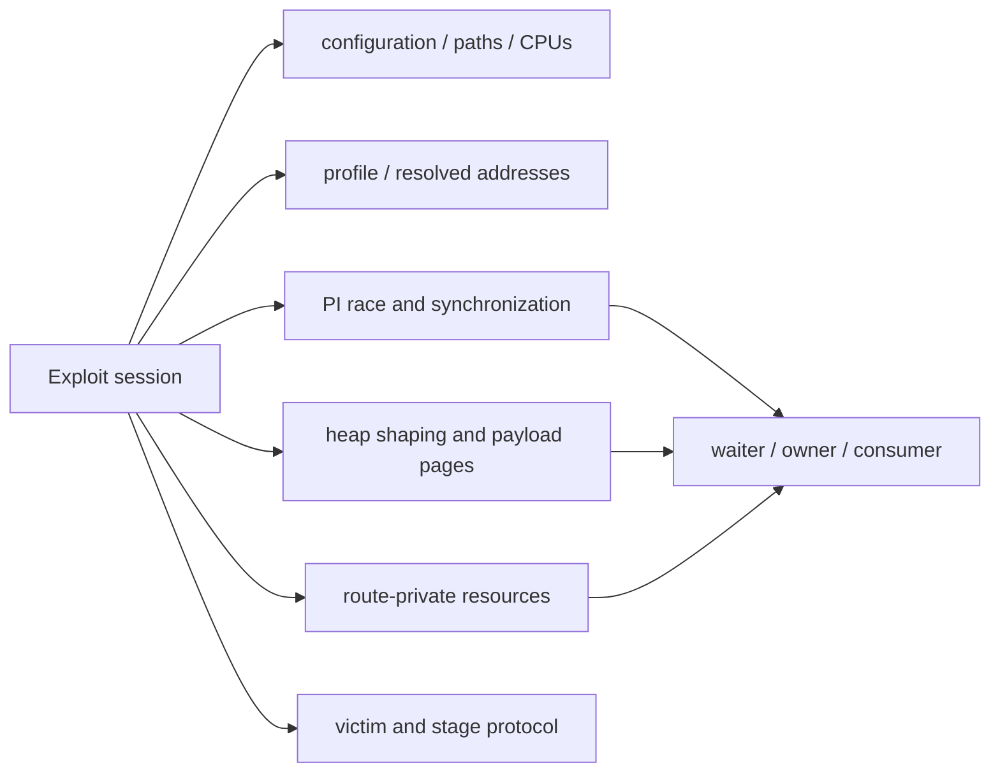
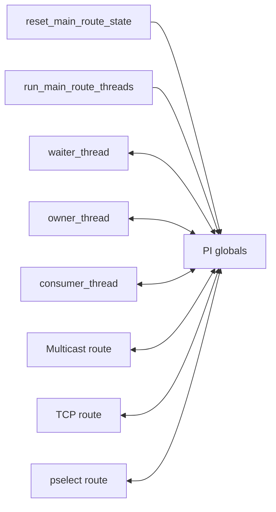
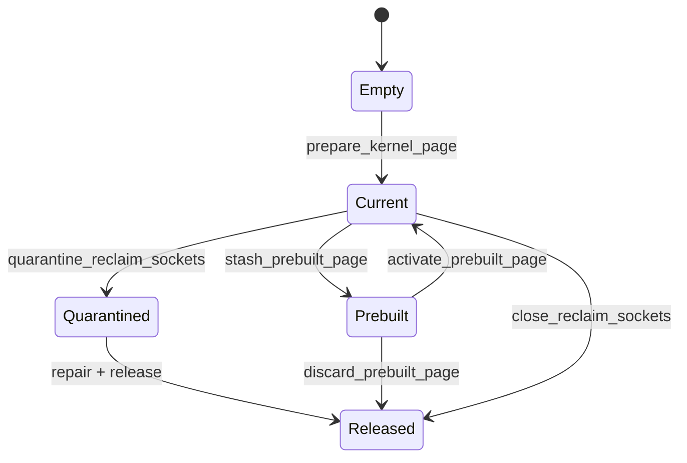
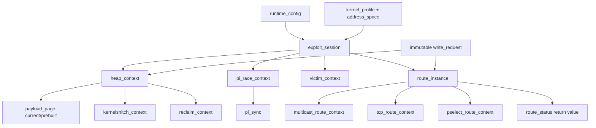

# Native 全局状态调用矩阵

本文档按“定义→主要读者→主要写者→生命周期→目标归宿”分析 native 可变全局状态。宏、编译期常量和不可变偏移表不列为状态。

## 分类总览

当前代码没有 `ExploitSession`；图中六个节点的状态分散在 `main.c`、`util.c`、`fops.c` 和 `common.h` 的 `extern` 声明中。

## 1. Profile、地址与运行配置

| 变量 | 定义 | 主要读者 | 主要写者 | 生命周期/问题 | 目标归宿 |
|---|---|---|---|---|---|
| `active_offsets` | `main.c` | 几乎所有地址、payload、route和验证函数 | `select_offsets()` / `try_external_offsets()` | 选定后实际只读，却通过宏隐式渗透所有文件 | `session.profile` 不可变指针 |
| `g_external_offsets` | `main.c` static | profile验证/发布 | `try_external_offsets()` | 进程期缓冲，实际只需loader期存活 | loader调用者所有输出 |
| `g_external_release` | `main.c` static | `g_external_offsets.uname_r` | JSON loader | 用于保持release字符串存活 | `kernel_profile.release[]` |
| `g_target_profile` | `main.c` | 地址解析；S08前的后续消费者仍走 `active_offsets` | `publish_active_offsets()` | S06只读view，尚未作为显式参数贯穿调用链 | S08迁入`ExploitSession.profile` |
| `g_resolved_addresses` | `util.c` | `p0_data_alias()`、`data_addr()`、地址日志 | `publish_active_offsets()` | S06新增的权威地址快照，发布后只读 | `ExploitSession.addresses` |
| `p0_kernel_phys_load` | `util.c` | 旧日志与地址宏 | `publish_active_offsets()` | S06起仅镜像 `g_resolved_addresses.kernel_phys_load` | S08删除镜像消费者 |
| `g_init_cred_image` | `util.c` | payload/W2和5.x修复 | `publish_active_offsets()` | S06起仅镜像 `g_resolved_addresses.init_cred_image` | S08删除镜像消费者 |
| `g_core_main` | `runtime_config.c`兼容镜像 | `CORE`宏、主线程、clone、Multicast | `runtime_config_init()` | S02已由单一配置快照发布；S10删除镜像 | `pi_race_context`显式CPU参数 |
| `g_core_consumer` | `runtime_config.c`兼容镜像 | `CONSUMER_CORE`宏、consumer/Multicast | `runtime_config_init()` | 同上 | `pi_race_context`显式CPU参数 |
| `g_runtime_config` | `runtime_config.c` | `main.c`、TCP选路及兼容宏 | `runtime_config_init()` | S02新增的单一进程快照；初始化后只读 | `exploit_session.config` |
| `home_dir/root_script_path` | `g_runtime_config`字段 | offsets、日志、ksud、脚本、child | `runtime_config_init()` | S02已从`main.c`分散数组迁入配置对象 | `exploit_session.config` |
| `t0` | `main.c` static | `timer_ms()` | `timer_reset()` | 单一计时器限制并发/嵌套计时 | 显式 `timespec` 参数 |

### 隐式依赖

`runtime_struct_offsets.h`、`mm_struct_sz()`、`kernelsnitch_collisions()` 和多个 `SLIDE_*` 宏直接读 `active_offsets` 或全局地址。这些依赖不会出现在函数签名中，是函数式化的首要对象。

## 2. PI竞争与同步状态

| 变量组 | 主要读者 | 主要写者 | 生命周期/并发 | 目标归宿 |
|---|---|---|---|---|
| `f_wait`, `f_pi_target`, `f_pi_chain` | waiter/owner、`run_main_route_threads()` | `reset_main_route_state()`，内核futex | 每次route run一组，目前作为进程级单例 | `pi_race_context.futexes` |
| `waiter_ready`, `waiter_waiting`, `waiter_tid` | owner、main、consumer | waiter/reset | 跨三线程原子同步 | `pi_sync.waiter` |
| `owner_started`, `owner_chain_done`, `owner_stop` | waiter/main/owner | owner/main/reset | owner生命周期信号 | `pi_sync.owner` |
| `route_done` | main | waiter/reset | route结束信号 | `pi_sync.route_done` |
| `punch_consume_go`, `punch_consume_stop` | consumer及三路线 | route/main/reset | route与consumer的反向控制通道 | `pi_sync.consumer_gate` |
| `consumer_calls`, `consumer_success`, `consumer_inflight` | main、TCP、pselect、Multicast | consumer、route/reset | 统计与安全清理条件混合 | `consumer_status` |
| `main_route_delay_usec` | consumer | reset、TCP、pselect、Multicast | route特有时序参数作为共享变量 | `route_attempt.consumer_delay_usec` |
| `fast_repair_route` | waiter/reset | `retry_write_stage()` | 5.x W2特例渗透公共PI逻辑 | `write_request.fast_repair` |

### 调用者关系

这是最明显的“隐式总线”：三条route、三个线程和外层控制器均能改写同一组原子量。

## 3. 堆塑形、payload与页所有权

| 变量组 | 定义 | 主要读者 | 主要写者 | 所有权问题 | 目标归宿 |
|---|---|---|---|---|---|
| `page_base`, `last_mm_struct` | `util.c` | route/main/payload | page prepare | 当前页和历史泄露无类型区分 | `payload_page` / `heap_diagnostics` |
| `fake_lock`, `fake_w0`, `fake_task`, `fake_parent`, `fake_right`, `fake_left`, `fake_fops` | `util.c` | 三route和payload | `prepare_skb_payload()` / prebuilt activate | 属于某一喷射页，却可独立改写 | `payload_layout` 嵌入 `payload_page` |
| `pselect_custom_write`, `pselect_custom_target`, `pselect_child_node` | `util.c` | payload/pselect/main | set/clear及W2/W3控制流 | 单次请求通过全局传递 | 不可变 `write_request` |
| `ks` | `util.c` static | KS adapter/page prepare | setup/cleanup | 单例指针，无显式所有者 | `kernelsnitch_context` |
| `mm_objs_per_slab` | `util.c` static | context/page prepare | page prepare | 可由profile纯计算 | 局部值或 `heap_geometry` |
| `skb_buf` | `util.c` static | payload/page prepare | page prepare/cleanup | malloc/free隔着多层函数 | `heap_context.skb_buffer` |
| `prepare_ctx`, `spray_ctx`, `pre_ctx`, `post_ctx` | `util.c` static | page prepare/cleanup | `prepare_ctxs()` | 四组相同类型资源的所有权隐式 | `heap_context.mm_sets` |
| `child_leak`, `memfd_leak` | util/main | page prepare/cleanup | clone/page prepare | `memfd_leak`甚至在 `main.c` 定义而在 `util.c` 管理 | `heap_context.leak_anchor` |
| `reclaim_sv[2]` | `util.c` static | page prepare/quarantine/stash | page prepare、close、move | 实际是可移动所有权 | `reclaim_pair active` |
| `quarantined_reclaim_sv[2]` | `util.c` static | release | quarantine/release | 状态由fd是否为-1暗示 | `reclaim_slot{state=QUARANTINED}` |
| `prebuilt_reclaim_sv[2]`, `prebuilt_page_base`, `prebuilt_fake_*` | `util.c` static | activate/discard | stash | 手工复制页和所有fake地址，易漏字段 | 第二个完整 `payload_page` |

### 所有权转移现状

状态转移由多个fd数组和 `-1` 哨兵共同表示，适合改为可移动的 `payload_page` + `reclaim_pair`。

## 4. Route私有状态

### Multicast resident

| 变量组 | 读者/写者 | 生命周期 | 目标归宿 |
|---|---|---|---|
| `mr_l1`, `mr_l2`, `mr_cond` | `mr_x()` / `mr_y()` / start | resident一次建立到stop | `multicast_route_context.futexes` |
| `mr_tx`, `mr_ty` | start/stop | pthread create→join | `multicast_route_context.threads` |
| `mr_y_l2`, `mr_x_l1`, `mr_y_wait`, `mr_x_wait`, `mr_y_done`, `mr_x_done` | x/y/start/stop | resident同步 | `multicast_sync` |
| `mr_respray`, `mr_sprayed`, `mr_stop`, `mr_y_tid` | writer/y/start/stop | 跨线程原子控制 | `multicast_sync` |
| `mr_target`, `mr_value` | write/y | 每次resident write | `write_request`；用原子或mutex发布 |
| `mr_lock`, `mr_task` | stamp/start/y | resident对象 | `multicast_payload` |
| `mr_fd`, `mr_ready`, `mr_policy`, `mr_lock_slot` | 全部resident helper | resident实例 | `multicast_route_context` |

### TCP Zerocopy

| 变量 | 读者/写者 | 问题 | 目标归宿 |
|---|---|---|---|
| `tcp_punch_go`, `tcp_punch_stop`, `tcp_punch_phase`, `tcp_punch_failed` | TCP route/punch thread | 文件级单例，使线程入口无法复用 | `tcp_route_context.punch` |

TCP的client/server fd、punch fd、mapping和punch thread已是 `do_tcp_fake_lock_route()` 局部变量，只需收入context以便统一失败分类和外部清理验证。

### pselect/select

| 变量 | 读者/写者 | 问题 | 目标归宿 |
|---|---|---|---|
| `standard_io_backup[3]` | reserve/restore | 每次route的局部资源被保存为文件单例 | `pselect_route_context.stdio_backup` |

pselect的fd_set、pipe/timerfd目前是局部变量；需进入context的原因是consumer stuck时所有权会延长到进程退出。

## 5. 路线结果和其他工具状态

| 变量 | 读者 | 写者 | 问题 | 目标归宿 |
|---|---|---|---|---|
| `RouteStatus`（位于各 route/PI context） | main线程调度 | 三route controller | S15 已删除 `route_last_step/route_last_errno` 隐式全局返回值 | 保持结构化返回与 clean/disarmed 双判定 |
| `g_file_buf[1 MiB]` | JSON parser | `load_offsets_json()` | 非重入，常驻大缓冲 | loader调用者buffer或局部mapping |
| `FutexHashContext` | KernelSnitch context | `kernelsnitch_context_init()` | S15 已删除 `futex_hashsize`、`futex_init()`、`futex_hash()` 全局兼容层 | 保持显式 context |

S15 审计后仍保留四个零调用的 util 级 KernelSnitch 转发函数及进程级 `ks` owner，登记为 `COMPAT-01`；它们不参与本次已验证攻击链，后续删除必须形成新的可测试提交。会话所有权残项使用 `SESSION-01`–`SESSION-04`，Select 外层重试使用 `SELECT-01` 跟踪。

## 6. 优先级与风险

| 优先级 | 状态簇 | 理由 |
|---|---|---|
| P0 | PI竞争原子量、futex、route result | 跨文件、跨线程、三route共享，最容易产生时序回归 |
| P0 | `page_base`/`fake_*`/reclaim/prebuilt | 表示同一资源的字段可独立更新，所有权转移不原子 |
| P1 | Multicast `mr_*` | 状态数量多，清理跨route/W1/W2 |
| P1 | profile/地址宏 | 隐式依赖范围最广，但选定后只读 |
| P2 | TCP punch、pselect stdio | 局部边界较清晰，易封装 |
| P2 | paths/timer/JSON buffer | 攻击时序风险低，适合早期练习性迁移 |

## 7. 目标依赖图

