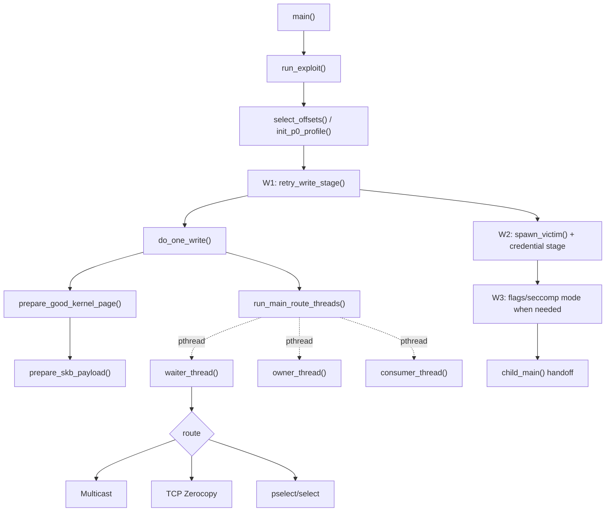
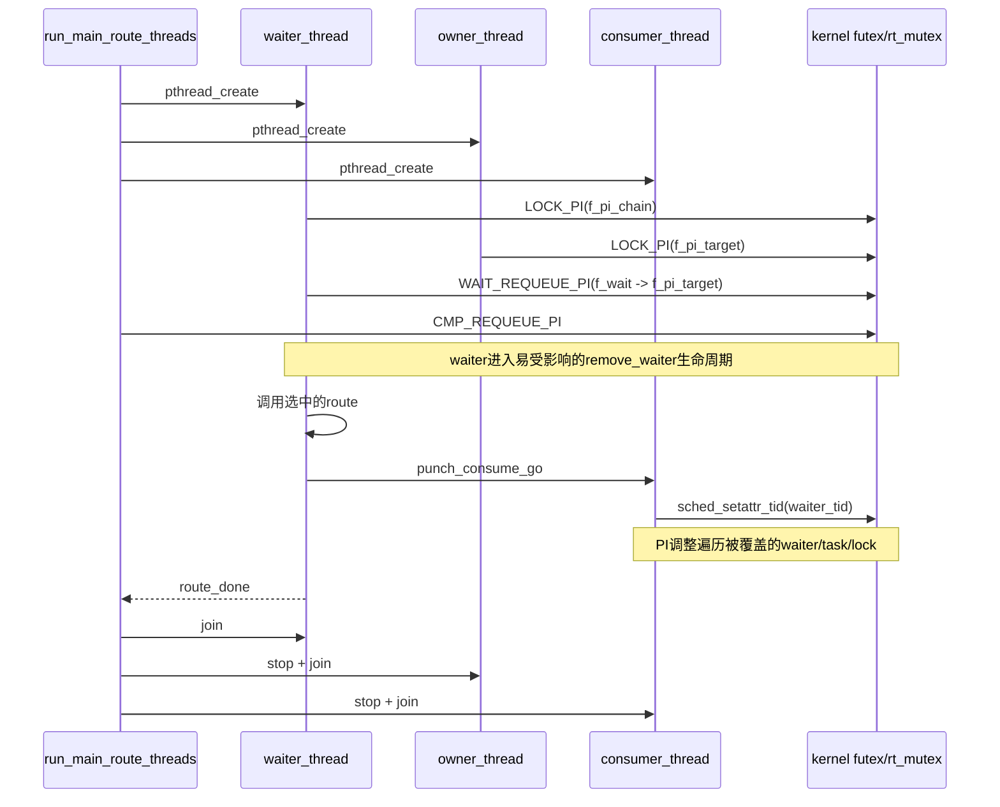
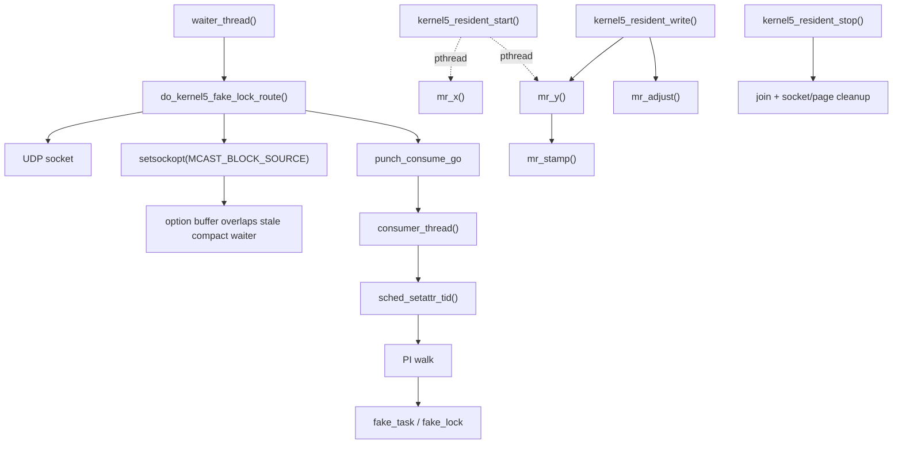
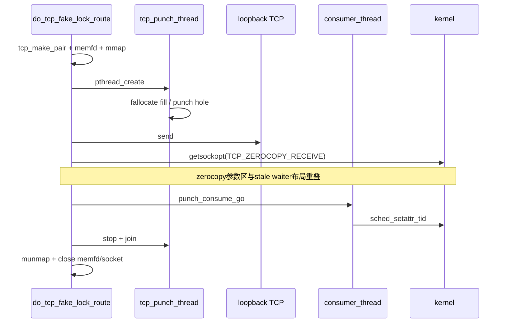
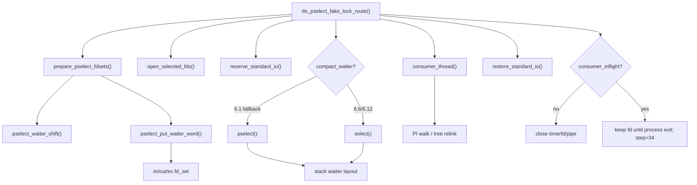
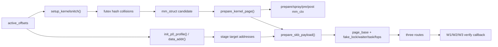
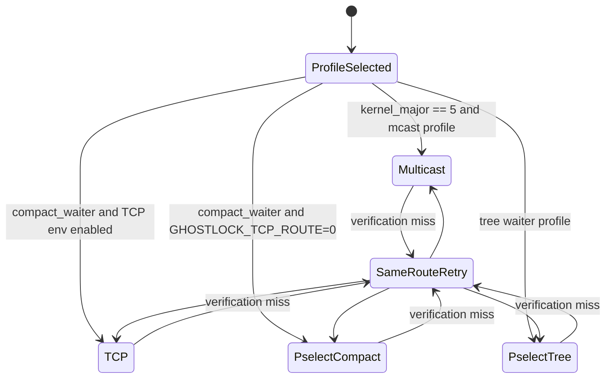

# 三条路线、数据流与清理

## 核心维护图：三路线端到端主链

此图是解耦阶段的唯一强制更新 UML。自 S03 起，每阶段只有在构建和真机测试通过后，才把该阶段已经验证的调用边界更新到图中；未完成或仅有 TODO 的目标结构不得提前画入。S02 不追补更新。

三条路线共用profile、地址转换、堆页准备、fake对象、PI三线程和W1/W2/W3验证；只在“用哪种可控结构覆盖stale waiter”上分叉。

## PI竞争时序

## 5.x Multicast

- 非resident路径的临时socket由route关闭，但waiter还会执行额外futex slow path来disarm `pi_blocked_on`。
- resident路径的线程、socket、reclaim和page状态由 `kernel5_resident_stop()` 收尾。
- W1的scratch quarantine/repair/release位于 `run_exploit()`，因此它与路线内清理并未真正分开。

## 6.1 TCP Zerocopy

TCP是局部资源所有权最集中的路线：线程、映射和fd均经单一 `out` 路径回收。PI三线程和喷射页仍由外层公共代码管理。

## pselect/select

consumer仍停在内核时不关闭相关fd，是为避免回收它仍在引用的对象。这个出口是dirty failure，不适合运行时切换路线。

## 堆与地址数据流

## 路线选择与回退现状

当前所谓TCP→pselect“回退”是启动前由 `GHOSTLOCK_TCP_ROUTE=0` 决定的静态选路。已进入TCP后，失败只重试当前路线，不会在同一进程内自动转pselect。

## 清理边界

| 范围 | 主要所有者 | 清理 | 不干净条件 |
|---|---|---|---|
| PI waiter/owner/consumer | `run_main_route_threads()` | stop原子量 + join | consumer或内核PI路径不返回 |
| Multicast resident | `kernel5_resident_*()` | disarm、join、socket/page cleanup | ghost/scratch未修复 |
| TCP局部资源 | `do_tcp_fake_lock_route()` | stop/join/munmap/close | PI写结果仍可能无法单凭fd清理判定 |
| pselect fd | `do_pselect_fake_lock_route()` | restore stdio + close | consumer stuck时故意保留 |
| 喷射页/mm上下文 | `util.c` | `cleanup_page_prepare_state()` | 与路线和阶段全局状态耦合 |
