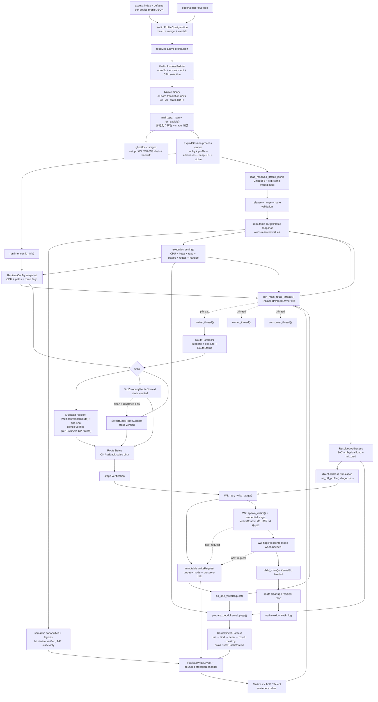
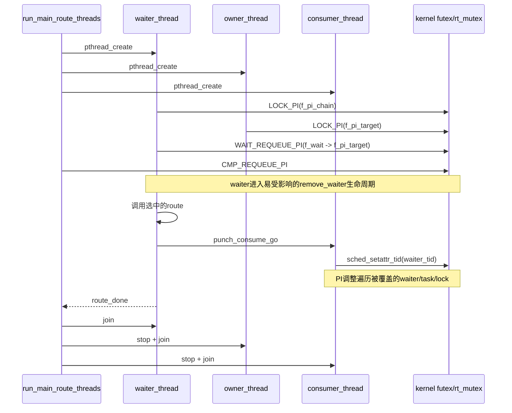
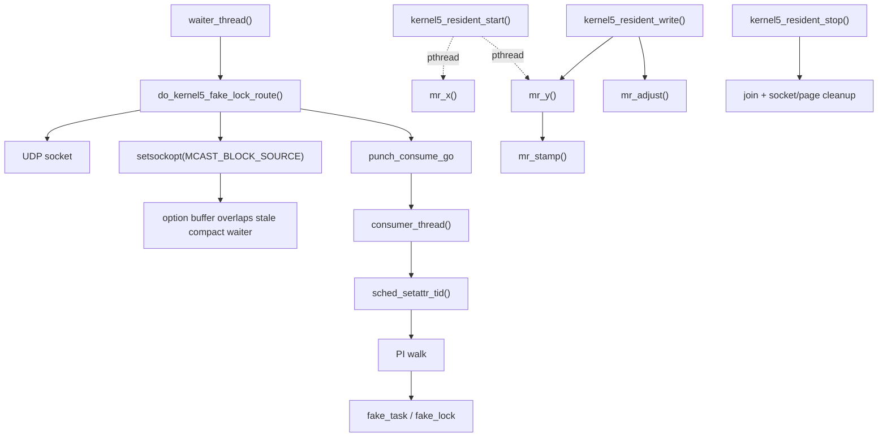
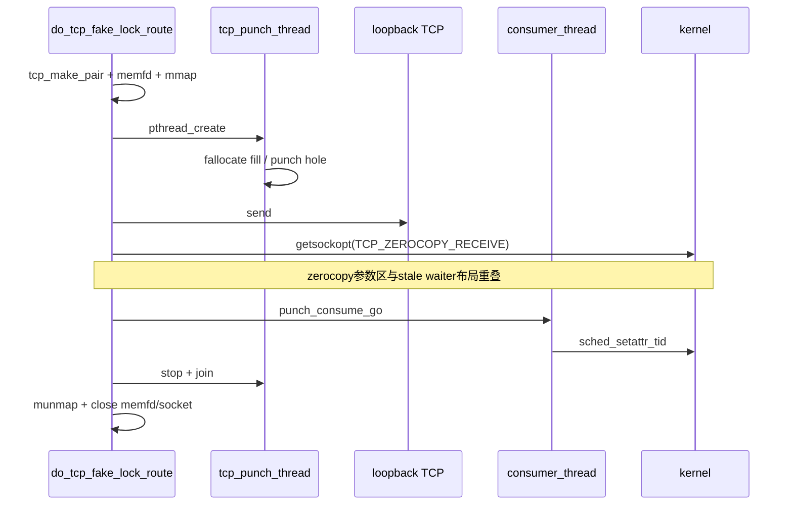
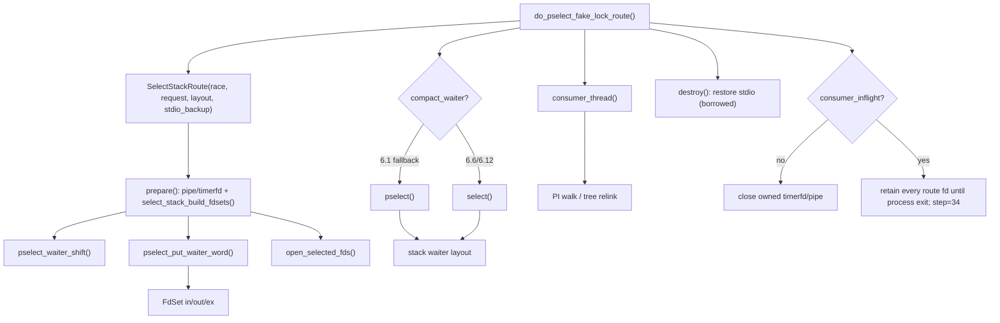
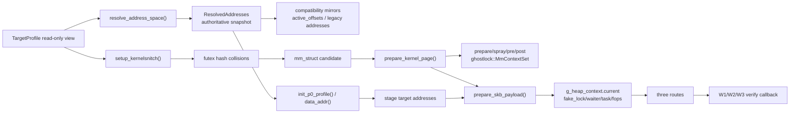
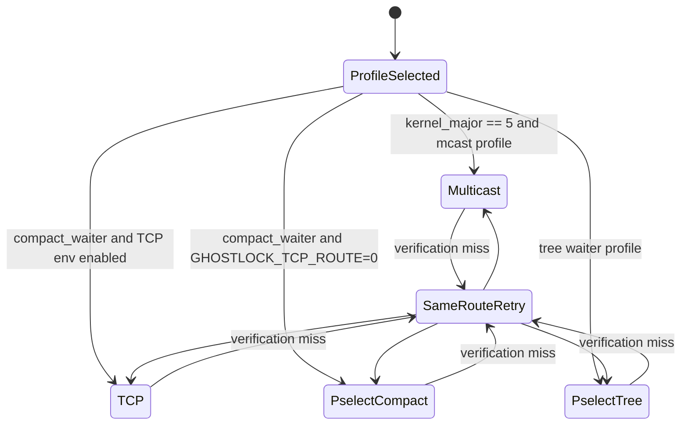

# 三条路线、数据流与清理

## 核心维护图：三路线端到端主链

此图是迁移阶段的唯一强制更新 UML。实线表示当前实现，设备验证状态直接写在路线节点中。全部核心翻译单元为 C++20/静态 libc++，并经 CPP12 批次 A/B 分层（`main` 薄适配 + `ghostlock::ops/race/stages/victim/route/support/memory`）与 CPP13 resident 类化，CPP00–CPP14 迁移已关闭；Multicast 门禁持续通过（最终 `CPP13b` 两次冷机，native `66f0a8a3…`；另有 `CPP12u`/`CPP12v`/`CPP12w`/`CPP13a`，均在 `device-gates/`）。`KERNEL-PANIC-01` 由三个同型实例（两个 NULL-lock + 一个 refcount WARN）覆盖两个构建、同构建同日 PASS→panic→PASS，判定为环境/时序而非布局/代码因果（`CPP12y` 归档）。TCP/Select 仍只有主机固定测试。当前 HEAD 完成 CPP15–CPP17（命名空间/零指令清理 + 三个引用别名 façade 收归），门禁闭环：`CPP16-U01D-20260918-multicast-pass` 与 `CPP17-20260918-multicast-pass*`（含一次同型 W1 panic 后的连续 PASS、成功冷机、零页重试），用户两次豁免第二次冷机，native `55863311…` 为最新基线。

S02–S14 已完成 context 与统一路线状态边界；CPP12 批次 A/B 完成 `main` 分层与 namespace 化，CPP13 把 resident Multicast 收归 `MulticastWaiterRoute` 类并将 payload 编码与 one-shot 同源（one-shot 保持专用小栈帧与 VLA；步骤 B 的分组提取因 `do_kernel5_fake_lock_route` +3 指令被否决），CPP14 完成 C façade 删除、警告/clang-tidy 门禁与文档同步。TCP/Select 仍等待对应设备。三条路线继续共用 profile、地址转换、堆页准备、PI 三线程和阶段验证，只在“用哪种可控结构覆盖 stale waiter”上分叉。

## PI竞争时序

## 5.x Multicast

- 非resident路径的临时socket由route关闭，但waiter还会执行额外futex slow path来disarm `pi_blocked_on`。
- resident路径的线程、socket、reclaim和page状态由 `kernel5_resident_stop()` 收尾。
- W1的scratch quarantine/repair/release位于 `run_exploit()`，因此它与路线内清理并未真正分开。

## 6.1 TCP Zerocopy

TCP是局部资源所有权最集中的路线。CPP10 后由 `TcpZerocopyRoute` 唯一拥有 client/server/punch fd、mapping 与 punch worker（`UniqueFd`/`MappedRegion`/`PthreadOwner`），`prepare → execute → disarm → destroy` 显式分离；join/munmap 失败置 dirty 并保留资源（不提前 close 已被 puncher 借用的 fd）。PI三线程和喷射页仍由外层公共代码管理。

## pselect/select

consumer仍停在内核时不关闭相关fd，是为避免回收它仍在引用的对象；CPP11 后由 `SelectStackRoute` 经 `release_to_process_lifetime` 显式保留（stdout/stderr 备份是 `BorrowedFd`，从不关闭）。这个出口是dirty failure，不适合运行时切换路线。

## 堆与地址数据流

## 路线选择与回退现状

S15 最终回归（`versionCode=176`）与后续 CPP 门禁在同一行为基线上反复验证 Multicast 端到端主链：六次 route 均为 `OK clean=1/1`，W1/W2/W3 后进入 `KernelSU ready`（最终 `CPP13b`，两次冷机）。TCP、Select 和 TCP→Select 回退仍等待对应设备补证；`U01-D` payload alias 生效后需重新门禁。

当前所谓TCP→pselect“回退”是启动前由 `GHOSTLOCK_TCP_ROUTE=0` 决定的静态选路。已进入TCP后，失败只重试当前路线，不会在同一进程内自动转pselect。

## 清理边界

| 范围 | 主要所有者 | 清理 | 不干净条件 |
|---|---|---|---|
| PI waiter/owner/consumer | `PiRace::start_threads/run`（`run_main_route_threads()` 调用） | `request_stop()` 原子量 + `PthreadOwner::join` | consumer 或内核 PI 路径不返回；等待无超时（`PI-TIMEOUT-01`） |
| Multicast resident | `kernel5_resident_*()` | disarm、join、socket/page cleanup | ghost/scratch未修复 |
| TCP局部资源 | `do_tcp_fake_lock_route()` | stop/join/munmap/close | PI写结果仍可能无法单凭fd清理判定 |
| pselect fd | `do_pselect_fake_lock_route()` | restore stdio + close | consumer stuck时故意保留 |
| 喷射页/mm上下文 | `util.c` | `cleanup_page_prepare_state()` | 与路线和阶段全局状态耦合 |
