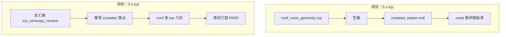
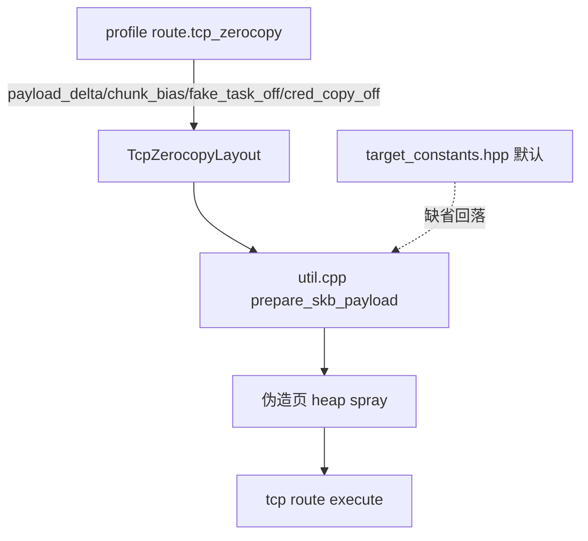

# 5.x tcp_zerocopy 几何推导 立项计划（2026-10-02）

## 现状与基线

- 分支 `vr-ko-bypass-dev`；基线 commit `583b13f`。
- 对象：A301SO `5.15.189-android13-8-00016-g51bba4309aac-ab14546557`（verified 5.15 train）。
- tcp route 实现：`src/core/route/tcp_zerocopy_route.cpp`
  - `prepare()`（215-261）：用户态 socketpair / memfd / fallocate / mmap / punch 线程；先校验
    `heap.current.base/fake_lock/fake_fops` 非空。
  - `execute()`（264-）：`getsockopt(TCP_ZEROCOPY_RECEIVE)` 写 fake waiter
    （`zc[0x28]=waiter->task`、`zc[0x30]=waiter->lock`，312-319），再 arm consumer（329）。
  - 运行参数：`profile.tcp_arm_sequence()` / `tcp_post_receive_hold_iterations()` / `tcp_attempts()`；
    布局标志 `compact_waiter`（route 段，`model.h:118`）。
- 6.1 的 tcp 几何：`conf_route_geometry("tcp_zerocopy", …)` 仅对 verified `STRUCT_OFFSETS_6_1`
  发 `compact_waiter = 1`（`report.rs:218-226`）。
- 5.x：该分支返回空 → tcp conf 只有 `compact_waiter = null`。
- 实测（2026-10-02，A301SO，shell + `--force-attack`）：
  - `tcp_zerocopy { compact_waiter = null }` → `heap spray done` 后崩溃/重启，无 `tcp route enter`（272）。
  - 手补 `compact_waiter = 1` → 同样在极早期崩溃/重启。
  - 对照：同设备 multicast 3/3 成功。
- 静态：`tcp_zerocopy_receive @ +0x1424790` 完整，两次 `bl tcp_zerocopy_vm_insert_batch (@ +0x142530c)`。
- 结论：缺的是 **5.x tcp 几何**（性质同 multicast 的 `waiter_off`），不是原语缺失；当前“tcp 在
  5.15 不可用”与“tcp 在 5.15 可用”都无证据。

## 目标与约束

目标：为 5.x（先 A301SO）推导 `tcp_zerocopy` 运行所需几何，使提取器能发出 5.x tcp 配置且真机门禁通过。

非目标：
- 不改 tcp route 的算法（除非 Explore 证明某落点必须由 profile 参数化）；
- 不改 6.1 的 tcp 几何与 `extract-pselect-fallback-plan.md` 的 fallback；
- 不改 multicast / select、不改 GLK1/profile 格式、不改 wire/app；
- 不把 tcp 重新设为 5.x 的自动建议（那是 `extract-5x-route-suggestion-plan.md` 的范畴）。

## 改动清单（草案，待 Explore 收敛）

| 文件 | 改动 | 理由 |
|---|---|---|
| `tools/extract_rs/src/derive.rs` | 新增 5.x tcp 几何推导：反汇编 `tcp_zerocopy_receive`，定位 `zc`/fake waiter 落点与栈布局 | 提供可发出的几何 |
| `tools/extract_rs/src/report.rs` | `conf_route_geometry` 的 tcp 分支增加 5.15 verified 条件；必要时发新字段 | 发 5.x tcp 几何 |
| `tools/extract_rs/src/symbols.rs` | 5.15 train 的 tcp 布局核验标记（沿用 verified train 体系） | 与 6.1 一致 |
| `tools/extract_rs/src/report.rs` + tests | 单测：A301SO `boot.img` 产出预期 tcp 几何 | 防回归 |
| `src/core/...` | 若推导出需参数化的落点，扩展 `TargetProfile` / route | 视 Explore 结果 |

## 数据流/控制流差异

## 兼容性与回滚

- 只影响提取器对 5.x tcp 的输出/候选；显式 `--route` 行为不变；exit code 语义不变。
- 回滚：还原 `derive.rs` / `report.rs` / `symbols.rs` 与测试改动，无持久化状态。

## 验证矩阵

| 批次 | 命令 | 预期 |
|---|---|---|
| 反汇编 | `disasm_func <a301so boot.img> tcp_zerocopy_receive` | 得到 zc/waiter 落点与栈布局，可解释 `zc[0x28]/[0x30]` |
| 单测/格式 | `cd tools/extract_rs && cargo test --release` / `cargo fmt --check` | 全绿 |
| 离线 | A301SO `--format conf --route tcp_zerocopy` | 含实测 tcp 几何，值可核对 |
| 真机 | 冷机、固定 CPU、单 route `tcp_zerocopy`、KernelSU 干净启动 | `route_done` / `child is root!`，不 panic；归档 `docs/analysis/device-gates/` |
| 取证 | 失败时取 pstore `/sys/fs/pstore/console-ramoops*` | 定位崩溃栈，区分几何错误与内核缺陷 |

## 明确保留

- multicast / select 路径与其几何；
- 6.1 tcp 几何与既有 pselect→tcp fallback；
- 攻击路径其它阶段（W2/W3/handoff）。

## 进度

- [x] 立项
- [x] Explore：反汇编 5.15 `tcp_zerocopy_receive`；结论=需新增 tcp payload 落点字段
- [x] Design：四字段参数化、必填 fail-closed、旧配置补齐、加大 `kernel_offsets`
- [~] Implement：native 侧（`model.h`/`binary.cpp`/`util.cpp`）完成、host tests 全绿；
      Kotlin/assets/extractor 待做
- [ ] 双侧一致性测试 / 离线对拍
- [ ] `cmp_disasm` 复核（8 函数布局位移）+ 重定基线
- [ ] 真机调参（A301SO 5.15.189）

## Explore 结论（2026-10-02）

- tcp route 消费的 profile 字段仅：`compact_waiter`（route 段）+ `tcp_attempts` /
  `tcp_arm_sequence` / `tcp_post_receive_hold_iterations`（execution 段）。payload 落点
  （`TCP_FAKE_TASK_OFF=0x5800`、`TCP_CRED_COPY_OFF=0x6800`、chunk bias `0xe80`、`LOCK_OFF`/`W0_OFF`）
  是**编译期常量**（`target_constants.hpp`、`support/util.cpp:336-372`），与内核版本无关。
- tcp 写入使用的 `zc[0x18/0x20/0x28/0x30]` 是 UAPI `struct tcp_zerocopy_receive`
  （`copybuf_address` / `copybuf_len` / `msg_control` / `msg_controllen`），跨版本稳定
  （`tcp_zerocopy_route.cpp:312-319`）。
- 反汇编 A301SO `tcp_zerocopy_receive @ +0x1424790`：`sub sp,#0x1d0`、清零栈结构、
  两次 `bl tcp_zerocopy_vm_insert_batch`，与 vivo 5.15.178 同构；未见版本相关差异。
- 但 tcp 的 payload 落点是**硬编码的 6.1 值**，没有 profile 字段：`chunk_bias = 0xe80`、
  `payload_delta = 0`、`TCP_FAKE_TASK_OFF = 0x5800`、`TCP_CRED_COPY_OFF = 0x6800`
  （`support/util.cpp:340-341`、`target_constants.hpp:33-34`）。multicast 走 `SKB_FRAG_BIAS` /
  `SKB_DATA_DELTA`，tcp 走这套固定值；它们与内核 skb/slab 布局相关，5.15 不一定相同。
- 静态对照（用 `~/Downloads` 里的 boot.img）：
  - `rt_mutex_waiter` 布局 6.1 与 5.15 **完全一致**（`lock=0x38 pi_tree_entry=0x18 task=0x30
    tree_entry=0x0 wake_state=0x40 ww_ctx=0x50 size=0x58`）→ waiter 编码偏移可通用；
  - `mm_struct` size：6.1（bluejay/boot-2）= **0x3c0**，A301SO 5.15 = **0x3e0** → 跨版本 slab 布局不同。
- 结论：**需要新增 profile 字段**——tcp 的 payload 落点/bias 是 6.1 专属的硬编码常量
  （`chunk_bias=0xe80`、`payload_delta=0`、`TCP_FAKE_TASK_OFF=0x5800`、`TCP_CRED_COPY_OFF=0x6800`），
  而 5.15 的 mm/slab 几何不同，仅靠 `compact_waiter` 不足以让 5.15 tcp 成立；“补 `compact_waiter=1`
  仍早期崩溃”与之一致。需把这些常量参数化为 route 私有字段，并在 5.15 上实测取值。
- 类似项目（已查）：commit `2b8cd59` 表明该 tcp route 移植自 `alex193a/Root-My-Pixel-Payloads`
  （Pixel 6.1，`MAIN_TCP_ROUTE_DEFAULT`）。核对其 `src/common.h`：`SKB_DATA_DELTA=-0xe80`、
  `MM_STRUCT_SZ=0x500`、`SKB_FRAG_BIAS=0` 与 ghostlock 完全一致；`TCP_FAKE_TASK_OFF`/`TCP_CRED_COPY_OFF`/
  `chunk_bias` 是移植时在 ghostlock 侧加入的。该项目只覆盖 Pixel 6.1/**无 5.15**，没有可直接引用的
  5.15 tcp 布局。
- 取证受阻：pstore 需要 root，而 root 又要先成功攻击（鸡生蛋）；`--dump-kernel-log` 也在
  root script 里才拷贝 pstore（`attack/ops.cpp:282-305`），对 panic 无帮助。

## Design：tcp payload 落点参数化（2026-10-02）

### 新增字段（route 私有，`route.tcp_zerocopy` 扩展节）

| 键 | 类型 | 现硬编码值 | 含义 |
|---|---|---|---|
| `payload_delta` | i64 | `0`（tcp） | 伪造页相对 spray base 的偏移（`SKB_DATA_DELTA` 的 tcp 对应量） |
| `chunk_bias` | u64 | `0xe80` | 每个 ORDER3 chunk 的起始偏置（`SKB_FRAG_BIAS` 的 tcp 对应量） |
| `fake_task_off` | u64 | `0x5800` | 伪造 task 在页内偏移（`TCP_FAKE_TASK_OFF`） |
| `cred_copy_off` | u64 | `0x6800` | W2 cred 副本页内偏移（`TCP_CRED_COPY_OFF`） |

- **必填 / fail-closed**：这四个键是 `route.tcp_zerocopy` 的必填项；缺失即该 profile 的 tcp route 无效，
  app/native 必须拒绝（不回落编译期常量）。显式 `0` 与缺失必须区分（presence）；但按“必填”语义，
  缺失本身即错误，不再有“按缺失回落”的分支。
- 只参数化“与内核几何相关”的四个量；`LOCK_OFF`/`W0_OFF`/`FOPS_TABLE_OFF` 等与 `rt_mutex_waiter`
  布局绑定，已确认跨版本一致，保持编译期常量。

### 跨层契约（双侧一致性，AGENTS.md）

| 层 | 文件 | 改动 |
|---|---|---|
| native 结构 | `src/core/profile/model.h` | `TcpZerocopyLayout`（186-188）增 4 个 `std::optional<uint64_t>`；`misc` 增对应槽 |
| native 字段表 | `src/core/profile/binary.cpp` | `kRouteTcp`（181-189）增 4 个 `OPT(...)`；键名与 Kotlin 逐字一致 |
| Kotlin route | `profile-core/.../data/route/TcpConfig.kt` | `entries()` / `apply()` / `from()` 增 4 字段 |
| Kotlin 解析 | `profile-core/.../profile/ProfileResolver.kt` | `KnownTopLevel`/键名映射按需登记 |
| Kotlin 编解码 | `profile-core/.../data/NativeProfile.kt` | `compact_waiter` 同级的编解码与 route 键 `route.tcp_zerocopy` |
| 测试 | `route_catalog_test.cpp` / `RouteCatalogAgreementTest.kt` / `profile_binary_test.cpp` | 字段对齐与往返 |

### native 消费点

- `src/core/support/util.cpp:335-372`（`prepare_skb_payload`）：把硬编码的 `payload_delta`、
  `chunk_bias`、`fake_task_off`、`cred_copy_off` 改为从 `profile.tcp_zerocopy_layout()` 取值，
  缺省回落 `kernel::*` 常量。
- `src/core/kernel/target_constants.hpp` / `target.h`：常量保留为默认，不删除。

### 提取器

- `tools/extract_rs/src/report.rs` 的 `conf_route_geometry` tcp 分支：**总是**发这四个键
  （6.1 发 6.1 值，5.15 发实测/推导值）；不再出现“5.x tcp 无几何”。

### 字段放置（已定：加大 `kernel_offsets`）

- 实测：`sizeof(kernel_offsets)=464`，尾部无 padding（`mcast_attempts/arm_sequence/arm_hold`
  正好占满 `460..463`）；`misc=248`、`geometry=304`、`execution=344`。
- 决定：把四个 tcp 参数作为 `kernel_offsets` 的**新字段**（`std::optional<uint64_t>`，presence 表达必填），
  接受 sizeof 增大（464 → 约 528）。
- 影响与处理：`ExploitSession` 的 `addresses/heap/race/victim` 随之后移；8 个攻击函数访问它们的
  指令立即数改变 → `cmp_disasm` 从 IDENTICAL 变为 strict 差异。**必须逐个复核为“仅布局位移、
  调用顺序不变”**，记录差异表并重定基线（AGENTS.md 允许已复核差异，但需证据）。
- 调参阶段可先用编译期常量找 5.15 的四个值，再启用 profile 字段；两件事不冲突。

### 数据流/控制流

### 攻击关键路径与门禁

- 改动触及 `prepare_skb_payload`（资源准备，属攻击关键路径）→ 必须 `tools/cmp_disasm.py` 对 8 个攻击函数
  比对已确认基线；缺省取值路径应保证 6.1 行为不变（否则说明抽象未零开销）。
- 真机门禁：冷机、固定 CPU、单 route `tcp_zerocopy`、KernelSU 干净启动；归档 `docs/analysis/device-gates/`。

### 验证矩阵（本次）

| 批次 | 命令 | 预期 |
|---|---|---|
| 单测 | `make -C src native-host-tests` | 全绿（含 profile binary 契约/往返） |
| 双侧 | `./gradlew :app:testDebugUnitTest` | `RouteCatalogAgreementTest`/exporter 对拍通过 |
| 形状 | `python3 tools/cmp_disasm.py <baseline> build/native/ghostlock` | 8 函数 IDENTICAL 或已复核差异（缺省路径不变） |
| 提取器 | `cd tools/extract_rs && cargo test --release` | 全绿；5.15 tcp 几何用例 |
| 离线 | A301SO `--format conf --route tcp_zerocopy` | 含 4 个落点键，值可核对 |
| 真机 | A301SO tcp | 不 panic；`SELinux permissive` / `child is root!` |

### 旧配置补齐（必填的代价）

必填意味着所有既有 `tcp_zerocopy` profile 都要补这四个键，否则被 fail-closed 拒绝：

- `app/src/main/assets/profile/`：`6.1.115/6.1.118(x2)/6.1.138(x4)/6.1.145(x2)` 等所有
  `route { tcp_zerocopy }` 的 profile；`6.1-template.conf`、`5.15-template.conf`。
- 提取器对 6.1 一律发四键（值 = 现行常量），保证新导出与旧 assets 一致。
- `docs/profile/PROFILE_SCHEMA.md`（+`_ZH`）与模板字段表同步登记这四个键。
- 反例：任何仍只写 `compact_waiter` 的 tcp profile 都应被拒绝（由校验测试钉住）。

### 缺省与回滚

- 必填：不设“缺省回落”；旧 profile 必须补齐（见上）。
- 回滚：移除 4 个字段与 `util.cpp` 取用点，恢复硬编码；同步移除 assets/templates 的新键。

## 待确认

- 5.15 的取值：静态分析（从内核 skb/mm slab 几何推导）能到什么程度，还是必须真机试错？
- 类似项目里是否已有该 `tcp_zerocopy` 布局的独立实现可供对照（本机工具包载荷侧无 tcp）？
