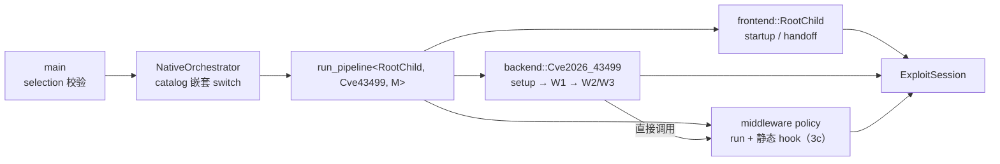

# Batch 4 收尾切片：D1=B 实现级 pipeline 落地（2026-09-24）

> 承接切片 3c（middleware route hook 已收敛为 policy 静态接口）。本切片把 backend/frontend 的**步骤编排**
> 从 `ExploitProcedure` 迁入 policy，落地 `run_pipeline<F,B,M>`（依据整体计划「Native C++23 运行模型」
> L193–214 与「静态分派」L279–304）。**触及攻击关键路径（`do_one_write` 等），`cmp_disasm` + 真机门禁是硬门槛。**

## 现状

- `ExploitProcedure::run` 固定 setup→W1→W2/W3→handoff；三类步骤的归属已部分拆出：
  - setup → `session/backend/cve_2026_43499_backend.*::run_setup`（切片 3a）；
  - handoff → `session/root_child_frontend.*::run_root_child_handoff`（切片 1）；
  - middleware route hook → policy 静态接口（切片 3c）。
- 仍留在 `ExploitProcedure` 的是 **backend 步骤**：`w1` / `w2` / `w3` / `attack_write` /
  `retry_write_stage` / `park_retry_child` / `run` 的编排，以及 W1b scratch repair。
- `make_exploit_procedure` 返回 `unique_ptr<ExploitProcedure>`；`orchestrator.hpp`/`main.cpp` 经基类调用。
- `route/pipeline.hpp`（`Pipeline<F,B,M>` 形状 + `pipeline_supported`）、`backend_policy.hpp`、
  `frontend_contract.hpp` 的声明已就位，尚未接线。

## 目标 / 非目标

**目标**

1. backend policy（`Cve2026_43499`）承载**该 backend 自己的 W1/W2/W3 步骤序列**（可与其他 backend 不同）；
   frontend policy 承载 startup/handoff 步骤；`run_pipeline<F,B,M>` 编译期组合。
2. `ExploitProcedure` 退场（或仅余薄壳）；`make_exploit_procedure` 的 route switch 与空 procedure 绑定删除。
3. 调用点（`orchestrator`/`main`）改为经 `run_pipeline<F,B,M>` 的显式分派。

**非目标**

- 不改 W1/W2/W3 语义、句序、日志文本；不改 victim/child 协议与 handoff 时序。
- 不改 `ExploitSession` 字段布局；不改 middleware 算法/时序/payload。
- 不新增 PI 窗口内间接调用、不新增可变全局、不引入虚基类 provider。

## 分片（每片独立验证，上一片通过再进下一片）

| 片 | 内容 | 8 函数 |
|---|---|---|
| **P1** | 新增 pipeline 接线骨架：`run_pipeline<F,B,M>` 先只组合现有 `frontend::run_root_child_handoff` / `backend::run_setup` 与既有 `ExploitProcedure` 步骤，行为不变；`main`/`orchestrator` 经它调用 | 预期 PASS |
| **P2** | backend 步骤迁入 backend procedure（`w1`/`w2`/`w3`/`attack_write`/`retry_write_stage`/`park_retry_child`/W1b），`ExploitProcedure` 退场或薄壳 | **会变**：逐条复核 + 真机门禁 |
| **P3** | `orchestrator`/`main` 嵌套 switch 枚举 catalog 组合 + 直接 `run_pipeline<...>`；删除 `make_*_procedure` 空绑定 | 预期 PASS（调用点不在 8 函数） |

## 8 函数影响与复核策略（P2 关键）

- P2 迁移 `do_one_write`（现 `ExploitProcedure::attack_write`）到 backend TU → **符号名与内联上下文变化**，
  预期 `cmp_disasm` 报 `MISSING`/`SHAPE-DIFF`。两种处理，P2 开始时定：
  - 在 `tools/cmp_disasm.py` 的 `TARGETS` 增加 backend 命名候选（工具已支持多候选），以指令级对齐复核；或
  - 保留 `ExploitProcedure` 作为 backend procedure 的**薄壳**，让攻击函数符号稳定，仅迁移编排。
- 其余 7 函数（`owner/waiter/consumer/run_main_route_threads/do_kernel5_fake_lock_route/multicast_*`）
  在 `race/threads.cpp` 与 route 单元，P2 不应触及 → 预期 IDENTICAL。
- 若迁移导致 middleware hook 边界被内联进攻击函数，沿用 3c 的 `[[gnu::noinline]]` 边界策略。
- 基线与记录：每片以**上一片候选**为不可变基线（另存 `/private/tmp/`），复核结论与门禁记录按
  `batch4-slice3c-hook-contract.md` / `device-gates/` 的格式归档。

## 控制流（P3 目标）

## 不变量

- victim/child 协议与 handoff 时序、资源所有权与清理顺序；`ExploitSession` 字段布局；
  route 算法/时序/payload；route 选择结果；PI 窗口内无间接调用。

## 验证

| 项 | 命令 | 预期 |
|---|---|---|
| host | `make -C src native-host-tests` | 通过 |
| 构建/静态 | `make -B -C src ghostlock`、`make -C src lint-tidy` | 零告警、0 findings |
| 反汇编 | `python3 tools/cmp_disasm.py <上一片候选> build/native/ghostlock` | P1/P3：8 函数 PASS；P2：差异逐条复核 |
| 真机 | 冷机、固定 CPU 对、multicast、KernelSU 未加载 | P2 后复跑并归档 |

## 实现记录（2026-09-24）

- 用户确认：**`ExploitProcedure` 完全退场**（接受符号变化），P1–P3 **合并为一次落地**（P2 的终态决定 P1
  接线形状，避免引入即弃的中间形态）。
- 候选 `bd35b7012151e4b445e6e1e16da4660c6186ede5918f769e0a36a8e1e449a34d`；
  基线 `fed6b7cf…`（由提交 `722230a` worktree 重建复现，另存 `/private/tmp/ghostlock-b4-pipeline-base`）。
- 结构：
  - `session/stage_types.hpp`（新）：`StageResult` / `VictimRound` / `VictimChain` /
    `write_stage_verify_fn`，自退役过程类迁出，backend/frontend/pipeline 共用；
  - `session/backend/cve_2026_43499_backend.*`：`Cve2026_43499Policy::run`（setup → W1 → W2/W3 编排）+
    `attack_write` / `run_setup`；W1b scratch repair 与 retry/park 为单元内 helper；
  - `session/root_child_frontend.*`：`RootChildPolicy::run`（handoff 步骤）；
  - `route/pipeline.hpp`：`run_pipeline<F,B,M>`（backend steps → frontend handoff，`pipeline_supported`
    编译期约束）；
  - `route/orchestrator.hpp`：`run_orchestrated_pipeline` 以嵌套 `switch` 枚举 catalog 组合并直接调
    `run_pipeline<...>`；未编目组合返回 -1；
  - `main.cpp` 直接调用；`exploit_procedure.{hpp,cpp}`、三个空 procedure 绑定与 `make_*_procedure`
    工厂删除；`route_api.hpp` 去掉工厂声明；
  - `tools/cmp_disasm.py`：`do_one_write` 增加 backend 符号候选（含 session 参数签名）。
- `cmp_disasm`（基线 `fed6b7cf…`）：7 函数 IDENTICAL；`do_one_write` **138 → 132**：
  - 20 个调用目标逐一相同（printf / clock_gettime / fflush / fsync / prepare_good_kernel_page /
    run_main_route_threads / puts 等）；
  - 6 条差来自 this→参数化（序言/尾声去掉 this 保存与 `mov x8/x1` 搬运，栈 0x50→0x40）与 LTO
    参数重排（函数为 local symbol，所有调用点一致）；`request` 字段访问与 `in_direct_map`
    分支结构一致。
- 本地验证：`native-host-tests` 全通过；NDK `-B` 全量零告警；`lint-tidy` 0 findings。
- 真机门禁：**待跑**（候选 `bd35b701…`；multicast、固定 CPU 对、冷机、KernelSU 未加载）。

## 核心攻击代码审查记录（2026-09-24）

> 范围：`722230a`（3c hook 收敛）与 `1241ced`（pipeline 落地）两笔重构触及的核心攻击代码及其
> 资源准备/存活期/回收闭包。方法：Rust 式所有权追踪 + 终结点顺序核对 + `cmp_disasm` 与扩展
> 反汇编对比。基线 `1ac25ff9…` → `fed6b7cf…` → 候选 `bd35b701…`。

### 1. 所有权与生命周期追踪

| 对象/资源 | 所有权类别 | 起点（创建/获取） | 所有者 | 借用者 / 访问区间 | 终结点与释放 |
|---|---|---|---|---|---|
| `g_exploit_session` | owning（进程唯一） | 进程静态初始化 | 进程 | backend/frontend 经 `ExploitSession&` 参数读写；全流程 | 进程结束；无显式释放 |
| `session.victim`（6 pipe + child pid） | owning（session 成员） | `spawn_victim`（每次 spawn） | session | `w2`/`w3`/`park_retry_child`/handoff；`release_child`/`retire_child` 转移 | 失败退出（`X`）、park（`P`）、handoff（`G`）后 release/reset |
| `VictimChain`（3 flags） | borrowed（栈值） | `run_pipeline` 局部 | `run_pipeline` 栈帧 | `Backend::run` 填充 → `Frontend::run` 读取 | `run_pipeline` 返回即终结，无跨帧引用 |
| `w2_stage_context` | borrowed（栈值） | `Cve2026_43499Policy::run` 局部 | `run` 栈帧 | `w2`/`w3`/`verify_*` 指针传递 | `run` 返回即终结，不逃逸 |
| `session.heap.current.base`（spray/repair 页） | owning（session 管理） | `prepare_good_kernel_page`（`attack_write` / `w2_fast_repair_prebuild`） | session.heap | attack_write / route race | 失败 `discard_prebuilt_page`；W2 修复经 `stash`/`activate`；resident 侧 `release_resident_heap`（route destroy） |
| prebuilt 暂存页 | owning（support 静态） | `stash_prebuilt_page` | support | `retry_write_stage`（W2） | `activate_prebuilt_page`（消费）/`discard_prebuilt_page`（失败） |
| `session.race`（PiRace + 3 线程） | owning（session 成员） | route prepare（`race/threads.cpp`，未改） | session.race | owner/waiter/consumer；attack_write 经 `run_main_route_threads` | `request_stop` → join（`run_main_route_threads` IDENTICAL，顺序未变） |
| multicast resident route（进程级静态） | owning（静态） | `kernel5_resident_start`（`MulticastPolicy::resident_write` 内） | multicast_waiter 静态 | workers + resident write | `kernel5_resident_stop`（w1 失败、route destroy、handoff 末尾） |
| quarantine sockets | owning（support 静态） | `quarantine_reclaim_sockets`（W1b） | support | W1b 重试循环 | 成功 `release_quarantined_reclaim_sockets`；失败保留隔离（注释约定） |
| `session.profile`（TargetProfile 值对象） | owning（值） | `install_profile`（`run_setup`） | session | 只读全流程 | 进程结束 |
| `parked_victim` / `parked_victim_cmd` | owning（session 成员） | park / handoff 转移 | session | handoff | signal + reset |

### 2. UAF 检查结论

- 迁移后 backend/frontend 为静态函数：`session_` 成员访问一律改为 `ExploitSession&` 参数（指向
  `g_exploit_session`，进程生命期），不存在“对象销毁后访问成员”；无捕获、无 this 逃逸。
- `VictimChain` / `w2_stage_context` 仅在 `run_pipeline` / `Cve2026_43499Policy::run` 栈帧存活，
  handoff 与 W2/W3 都在其作用域内调用；无跨帧或跨线程引用。
- 作为漏洞原语被有意利用的目标对象（waiter/task/cred）属既定例外，未扩散到辅助对象、race 状态、
  waiter 缓冲、映射或同步资源。
- 结论：**未发现 UAF**。

### 3. 终结点与清理顺序

- W1 失败 → `kernel5_resident_stop`；W1b 成功/失败 → quarantine release/保留；W2 修复 →
  prebuild → 写 → activate，失败 discard（均保留原位置与顺序）。
- route 生命周期 `prepare → execute → disarm → destroy` 未改（`route_lifecycle.hpp` 未动，
  `run_main_route_threads` IDENTICAL）。
- handoff 末尾 `kernel5_resident_stop`、child/parked child 信号与 fd 关闭未改
  （`root_child_frontend.cpp` 仅新增 `RootChildPolicy::run` 薄转发）。
- 结论：**终结点位于合理生命周期边界，成功/失败/重试/提前返回路径均有回收**。

### 4. 核心攻击函数与资源准备/回收的反汇编核对

| 函数 | 基线→候选 | 结论 |
|---|---|---|
| `owner_thread` / `waiter_thread` / `consumer_thread` | IDENTICAL | 等待/唤醒路径不变 |
| `run_main_route_threads` | IDENTICAL | route 选择/race 执行/停线程顺序不变 |
| `do_kernel5_fake_lock_route` | IDENTICAL | 一次性 multicast 顺序不变 |
| `multicast_owner_worker` / `multicast_waiter_worker` | IDENTICAL | waiter/owner 热循环不变 |
| `do_one_write`（`attack_write`） | 138 → 132 | 20 个调用目标逐一相同；差=this→参数 + LTO 参数重排；`resident_write` 分派取代 vtable |
| `middleware::resident_write` | 309 → 294，调用多重集相同（25=25） | 源码未改；差异为 LTO 布局/寄存器重排 |
| `MulticastWaiterRoute::write` / `stop` | IDENTICAL | resident 资源准备/回收不变 |
| `multicast_waiter_stamp` / `multicast_waiter_adjust` | IDENTICAL | waiter 字节/调度辅助不变 |
| `victim::verify_selinux_stage` / `verify_leaf_dir_stage` | IDENTICAL | 校验/探测不变 |
| `support::prepare_good_kernel_page` / `discard_prebuilt_page` | IDENTICAL | 页准备/丢弃不变 |

- 攻击代码（`do_one_write` → `run_main_route_threads` → workers/`do_kernel5`）与资源准备/回收
  （prepare/stash/activate/discard、quarantine、resident start/stop、handoff stop）之间的**相对顺序不变**。
- 编排函数（`Cve2026_43499Policy::run` vs 旧 `ExploitProcedure::run`）因 LTO 内联边界不同不做逐字节
  对比，改以「源码机械迁移（语句顺序/日志文本不变）+ 8 函数调用序列 + 上述资源函数 IDENTICAL」为证据。

### 5. 基线与证据

- 基线：`1ac25ff9…`（切 3a/3b，3c 审查）、`fed6b7cf…`（切片 3c，pipeline 落地审查）。
- 候选：`fed6b7cf…`（切片 3c）、`bd35b701…`（pipeline 落地，真机 PASS
  `B4-pipeline-20260924-multicast-direct-pass.md`）。
- 对比工具：`tools/cmp_disasm.py`（8 函数）+ 扩展同名符号对比脚本（资源准备/回收函数）。

## 架构审查意见与契约修正计划（2026-09-24）

> 外部架构审查（基于 `1241ced` 快照；范围：pipeline / orchestrator / 组件目录 / 阶段类型）提出 5 项。
> 逐条回应；**P1–P4 为实现前的契约修正（L 级）**，P5 为事实澄清。安全审查的最终权威归用户指定的
> 专用安全测试 AI，本仓记录仅作证据输入。

### P1 Middleware 未进入执行契约（成立）

- 现状：`M` 只参与 `pipeline_supported`；执行分派经 profile 在 `route/middleware_hooks.*` 的 policy
  direct chain 完成（3c）。单看该层契约确实无法证明不同 `M` 实例产生不同行为。
- 修正（二选一）：
  - **A（推荐，保留 3c 权威）**：`run_pipeline` 增加 `M::supported(profile)` 前置校验（`RoutePolicy`
    concept 已要求 `supported`）；`M` 与 profile 不一致即拒绝。契约写明：`M` = 编译期选定的 middleware
    policy，执行体是该 policy 的静态 hook（`middleware_hooks.*`），**profile 是运行时权威**；
    orchestrator 的 selection→`M` 映射保证二者一致，校验作防御。
  - **B（更强、改动大）**：backend 步骤模板化接收 `M`，hook 直接 `M::resident_write(...)`。代价：攻击
    路径模板化 + 与 3c 的 policy 静态接口重复，需新 `cmp_disasm`/真机门禁。
- 推荐 A；B 仅在认为“必须由类型直接决定行为”时才选。

### P2 组合兼容性缺少单一权威（成立）

- 修正：在 `component_catalog.hpp` 增加**编译期组合表** + `combination_supported(selection)` 作为唯一
  权威；`selection_supported`（三维各自可用）保留为 ID 可用性预检；orchestrator 先查组合表再 `switch`
  （分支只写 catalog 组合，default 拒绝）。新增 host test：枚举全部组合，断言组合表与 orchestrator
  可派发集合一致（新增组件只改组合表 + 分派分支）。
- 影响：`component_catalog.hpp`（公共数据结构）、`orchestrator.hpp`、host test；不改 8 函数。

### P3 阶段终态语义（成立）

- 修正：落地整体计划已定义的 `RunResult { RunCode code; RunStage stage; bool clean; }`（L183–187）：
  `RunCode = Completed | DiagnosticStop | Failed | Rejected`。`run_pipeline` 返回 `RunResult`；`main`
  映射 exit code。setup 的 `Done`（KernelSU 已 root 提前退出）映射 `DiagnosticStop`；frontend 的
  `Failed`/其他 映射 `Failed`/`Completed`，消除“0/1 合并”。
- 影响：`session/stage_types.hpp` 或新增 `session/run_result.hpp`、`pipeline.hpp`、`orchestrator.hpp`、
  `main.cpp`；8 函数不在其内，仍按常规门禁。

### P4 VictimChain 状态归属（成立）

- 契约澄清（记录为主）：
  - **权威**：`session.victim`（child pid、6 pipe）与 `session.parked_victim*`；
  - `VictimChain` 是 backend 在 W2/W3 期间生成、**转移（transferred）给 frontend 的单线程阶段摘要**
    （`ever_rooted` / `seccomp_ok` / `child_alive` 最近观测）；
  - **一致性**：chain 在 backend run 返回前填充完毕，frontend run 同线程随后调用，期间无并发写；
    handoff 的实际动作仍以 `session.victim` 的 fd/pid 为准（写 'G'、waitpid、release），chain 只做
    路径选择 → 无过期不一致窗口。
  - 约束：若未来引入并发/异步，chain 必须改为只读 session 的访问器。
- 影响：`stage_types.hpp` / `root_child_frontend.hpp` 注释 + 本计划；不改代码逻辑。

### P5 门禁状态（事实澄清）

- 审查快照 `1241ced` 时门禁为待跑属实；其后已真机 **PASS** 并归档
  `B4-pipeline-20260924-multicast-direct-pass.md`（提交 `4caa0e7`，候选 `bd35b701…`）。
- 生命周期/字节码审查的最终判定由用户指定的专用安全测试 AI 复核；本仓记录（所有权追踪 / `cmp_disasm`
  扩展对比）为其证据输入，不替代其结论。

### 修正实现记录（2026-09-24）

用户确认：**P1 选 B**（backend 模板化接收 `M`，避免后期再改更难定位），P2–P4 按上述实现。

- **P2**：`component_catalog.hpp` 新增 `combination_supported()`（唯一派发权威）；`orchestrator.hpp`
  先查它再走嵌套 `switch`，其余返回 `Rejected`；`component_catalog_test` 枚举全部组合，断言组合表
  与三维预检一致（当前恰好 3 个）。
- **P3**：新增 `runtime::RunResult { RunCode code; RunStage stage; bool clean; }`
  （`Completed | DiagnosticStop | Failed | Rejected`）；`run_pipeline` 返回它，setup 的 `Done`
  映射 `DiagnosticStop`；`main.cpp` 显式映射 exit code（`Rejected` 报错）。
- **P1-B**：`Cve2026_43499Policy::run<Middleware>` / `attack_write<Middleware>` 模板化；helper
  （`retry_write_stage` / `w2` / `w3` / `w1_scratch_repair` / `w1`）模板化，直接静态调用
  `M::resident_write` / `M::w1_resident_repair` / `M::w2_fast_repair_prebuild/activate`；
  能力查询用 `if constexpr (M::multicast)` 与 `M::w3_exact_target`；`MulticastPolicy` 的 4 个
  hook 加 `[[gnu::noinline]]` 作为显式中间件边界；**删除 `route/middleware_hooks.*`**（运行时
  dispatch 不再需要）；cpp 末尾显式实例化 3 个 middleware policy。
- **P4**：`stage_types.hpp` 的 `VictimChain` 注释写明权威/一致性/并发约束；frontend 注释同步。

验证（候选 `cacc2c6c7530710d6ec0ec7085452389fe58f6dfd0a7e286948fdf517e5040f9`，基线 `bd35b701…`）：

| 项 | 结果 |
|---|---|
| host tests | 全通过（含 `combination_supported` 枚举断言） |
| NDK `-B` 全量 | 零告警 |
| lint-tidy | 0 findings |
| cmp_disasm | `owner_thread` / `multicast_owner_worker` / `multicast_waiter_worker` IDENTICAL；`waiter_thread` / `consumer_thread` / `run_main_route_threads` / `do_kernel5_fake_lock_route` LAYOUT-SHIFT（仅数据地址注解平移，指令形状与符号目标一致）；`do_one_write`（Multicast 实例）仅 1 处 layout 差异 = 日志全局 PIC 取址形式（GOT 间接 → `ldr [x22,#0x2c0]`），前后 `printf/fflush/fsync` 序列与调用目标一致 |
| 真机门禁 | **待跑**（本轮改模板化，触 8 函数） |

注：`Select` / `Tcp` 的 `attack_write` 实例存在但不在设备门禁范围（无对应设备）；`route/middleware_hooks.*`
删除后，3c 文档中的该机制描述由本节取代。

## 第二轮架构审查回应与修正（2026-09-24）

> 审查（基于 `32ed4f9`，仅架构接口）指出 4 项；逐条修正，均不触攻击路径。

- **P2-1 派发集合可测**：`component_catalog.hpp` 新增 `DispatchTarget` 与 `dispatch_target(selection)`
  （纯 constexpr，orchestrator switch 枚举同一函数）。host test 对全部三元组断言
  `dispatch_target != None ⟺ combination_supported`，并固定每个 middleware 的目标值与不可用组合的
  `None`——「catalog 与 switch 不漂移」从人工约定变为测试保证。
- **P2-2 组合级编译期约束 + `Pipeline` 职责**：新增 `pipeline_catalogued<F,B,M>()`（以
  `combination_supported` 编译期检查）；`Pipeline<F,B,M>` 现在 `static_assert(catalogued)` 并承载
  `Pipeline<...>::run(...)`；orchestrator 改为 `switch (dispatch_target(selection))` +
  `Pipeline<...>::run`；删除逐项可用的 `pipeline_supported` 与自由 `run_pipeline`，公开模板不再能由
  未登记组合实例化。
- **P2-3 结果契约**：删除无来源的 `RunResult.clean`（清理状态归阶段/session，不在结果字段表达）；
  frontend 终态改为显式 `switch`：`Failed→Failed`、`Done→Completed`、`Continue→Failed`（终态契约违反
  不被静默当成功；未来扩展 `StageResult` 会触发 `-Wswitch` 强制更新映射）。
- **P2-4 Batch 5 backend 权威（文档）**：见 `batch5-backend-extension-plan.md` 更新——唯一权威
  `component_catalog::backend_available(kind)`；`BackendPolicy` concept 不携带 available；声明型 identity
  与执行 policy 以 `kind` 对应并 `static_assert` 绑定 catalog。

验证（候选 `dcd5224d7be39c9a702bafeaee4fdcea8f45f7a3ece6fd505fceaf5023cd5cac`，基线 `cacc2c6c…`）：
host tests 全通过（含派发断言）；NDK `-B` 零告警；lint-tidy 0 findings；
`cmp_disasm` **8 函数全部 IDENTICAL（strict，RESULT: PASS）**（本轮不触 backend/route 执行体）。

## 第三轮架构审查回应与修正（2026-09-24）

> 审查（基于 `eb37236`、`62b0759`）确认组合约束/状态语义/可用性重复已实质改善，剩 3 项；逐条修正。

- **P2-1 派发目标 ↔ policy 对应**：`component_catalog` 抽出唯一映射
  `dispatch_target_of(MiddlewareKind)`；`Pipeline<F,B,M>` 暴露 `target = dispatch_target_of(M::kind)`；
  orchestrator 每个 case 以 `static_assert(P::target == DispatchTarget::X)` 锁定——把分支误接到另一个
  仍受支持的 policy 会直接编译失败；host test 固定映射值。
- **P2-2 `BackendExecution` 进入组合入口**：`pipeline.hpp` include `backend_contract.hpp`，
  `Pipeline` 增加 `static_assert(BackendExecution<Backend, Middleware>)`；组合入口与独立 contract 测试
  共用同一 concept（可用 backend 的 `run<M>` 精确返回 `StageResult`）。
- **P2-3 Batch 5 计划表同步**：影响文件表已更新为纯头占位、`backend_contract.hpp` concept、
  无 `available`（见该计划）。

验证（候选 `dcd5224d7be39c9a702bafeaee4fdcea8f45f7a3ece6fd505fceaf5023cd5cac`，基线 `cacc2c6c…`）：
host tests 全通过（含 `Pipeline::target`、映射与 `BackendExecution` 断言）；NDK `-B` 零告警且产物与
上一候选**字节相同**（本轮回合无运行时影响）；lint-tidy 0 findings；`cmp_disasm` **8/8 IDENTICAL**
（strict，RESULT: PASS）。

## 第四轮架构审查回应与修正（2026-09-24）

> 审查（基于 `40e6cfc`，文档/接口边界）指出 4 项；逐条修正。

- **P1 分派键保留完整组合**：`DispatchTarget` 改为完整三元组命名
  （`RootChild_Cve43499_{SelectStack,TcpZerocopy,MulticastWaiter}`），
  `dispatch_target_of(frontend, backend, middleware)` 以完整选择为输入；`Pipeline::target` 由三元组
  计算，orchestrator 每个 case 逐一断言。新增 frontend/backend 时必须同时扩展枚举/映射/分支
  （扩展指南已写明）——分派不再只凭 middleware 轴。
- **P2 Frontend 对称执行契约**：`frontend_contract.hpp` 新增 `FrontendIdentity` /
  `FrontendExecution<F>`（`run(session, chain)` 精确返回 `StageResult`）与 `FrontendIdentityList` /
  `for_each_frontend` 注册表；`root_child_frontend.hpp` 绑定 identity/catalog/execution 断言；
  `Pipeline` 增加 `static_assert(FrontendExecution<Frontend>)`。UMH 占位不满足执行契约。
- **P2 README 构建期/运行期**：README(.md/_ZH) 改为「编目组合在构建期实例化，具体组合由 profile
  选择」，不再写成组件在构建期固定。
- **P2 Profile 版本命名**：PROFILE_SCHEMA(.md/_ZH) 拆分为三套独立名称——profile schema version
  （`schema_version` 字段）、binary wire version（当前 3，v2 兼容解码）、v1 JSON 导入；不再用同一
  v1/v2/v3 序列混指。

验证（候选 `dcd5224d…`（与上一候选字节相同），基线 `cacc2c6c…`）：host 全通过（含完整组合映射、
frontend contract、registry 断言）；NDK `-B` 零告警；lint-tidy 0；`cmp_disasm` 8/8 IDENTICAL。

## 进度

- [x] 现状与 8 函数影响只读梳理；产出本切片计划（2026-09-24）。
- [x] 用户确认：`ExploitProcedure` 完全退场，P1–P3 合并落地。
- [x] P1–P3 实现 + 本地验证（host/构建/lint/`cmp_disasm` 逐条复核）。
- [x] 真机门禁 PASS（`B4-pipeline-20260924-multicast-direct-pass.md`）。
- [x] 核心攻击代码审查（所有权追踪 / UAF / 终结点顺序 / 反汇编核对；权威判归专用安全测试 AI）。
- [x] 架构审查 P1–P4 契约修正实现（P1=B backend 模板化；P2 组合权威；P3 `RunResult`；P4 契约注释）。
- [x] P1-B 真机门禁 PASS（`B4-review-p1b-20260924-multicast-direct-pass.md`，候选 `cacc2c6c…`）。
