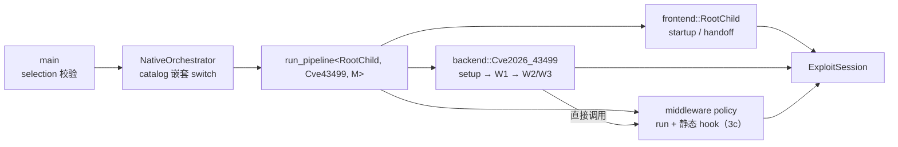

# Batch 4 收尾切片：D1=B 实现级 pipeline 落地（2026-09-24）

> 承接切片 3c（middleware route hook 已收敛为 policy 静态接口）。本切片把 backend/frontend 的**步骤编排**
> 从 `ExploitProcedure` 迁入 policy，落地 `run_pipeline<F,B,M>`（依据整体计划「Native C++23 运行模型」
> L193–214 与「静态分派」L279–304）。**触及攻击关键路径（`do_one_write` 等），`cmp_disasm` + 真机门禁是硬门槛。**

## 现状

- `ExploitProcedure::run` 固定 setup→W1→W2/W3→handoff；三类步骤的归属已部分拆出：
  - setup → `session/backend/cve_2026_43499_backend.*::run_setup`（切片 3a）；
  - handoff → `session/root_child_frontend.*::run_root_child_handoff`（切片 1）；
  - middleware route hook → policy 静态接口（切片 3c）。
- 仍留在 `ExploitProcedure` 的是 **backend 步骤**：`w1` / `w2` / `w3` / `attack_write` /
  `retry_write_stage` / `park_retry_child` / `run` 的编排，以及 W1b scratch repair。
- `make_exploit_procedure` 返回 `unique_ptr<ExploitProcedure>`；`orchestrator.hpp`/`main.cpp` 经基类调用。
- `route/pipeline.hpp`（`Pipeline<F,B,M>` 形状 + `pipeline_supported`）、`backend_policy.hpp`、
  `frontend_contract.hpp` 的声明已就位，尚未接线。

## 目标 / 非目标

**目标**

1. backend policy（`Cve2026_43499`）承载**该 backend 自己的 W1/W2/W3 步骤序列**（可与其他 backend 不同）；
   frontend policy 承载 startup/handoff 步骤；`run_pipeline<F,B,M>` 编译期组合。
2. `ExploitProcedure` 退场（或仅余薄壳）；`make_exploit_procedure` 的 route switch 与空 procedure 绑定删除。
3. 调用点（`orchestrator`/`main`）改为经 `run_pipeline<F,B,M>` 的显式分派。

**非目标**

- 不改 W1/W2/W3 语义、句序、日志文本；不改 victim/child 协议与 handoff 时序。
- 不改 `ExploitSession` 字段布局；不改 middleware 算法/时序/payload。
- 不新增 PI 窗口内间接调用、不新增可变全局、不引入虚基类 provider。

## 分片（每片独立验证，上一片通过再进下一片）

| 片 | 内容 | 8 函数 |
|---|---|---|
| **P1** | 新增 pipeline 接线骨架：`run_pipeline<F,B,M>` 先只组合现有 `frontend::run_root_child_handoff` / `backend::run_setup` 与既有 `ExploitProcedure` 步骤，行为不变；`main`/`orchestrator` 经它调用 | 预期 PASS |
| **P2** | backend 步骤迁入 backend procedure（`w1`/`w2`/`w3`/`attack_write`/`retry_write_stage`/`park_retry_child`/W1b），`ExploitProcedure` 退场或薄壳 | **会变**：逐条复核 + 真机门禁 |
| **P3** | `orchestrator`/`main` 嵌套 switch 枚举 catalog 组合 + 直接 `run_pipeline<...>`；删除 `make_*_procedure` 空绑定 | 预期 PASS（调用点不在 8 函数） |

## 8 函数影响与复核策略（P2 关键）

- P2 迁移 `do_one_write`（现 `ExploitProcedure::attack_write`）到 backend TU → **符号名与内联上下文变化**，
  预期 `cmp_disasm` 报 `MISSING`/`SHAPE-DIFF`。两种处理，P2 开始时定：
  - 在 `tools/cmp_disasm.py` 的 `TARGETS` 增加 backend 命名候选（工具已支持多候选），以指令级对齐复核；或
  - 保留 `ExploitProcedure` 作为 backend procedure 的**薄壳**，让攻击函数符号稳定，仅迁移编排。
- 其余 7 函数（`owner/waiter/consumer/run_main_route_threads/do_kernel5_fake_lock_route/multicast_*`）
  在 `race/threads.cpp` 与 route 单元，P2 不应触及 → 预期 IDENTICAL。
- 若迁移导致 middleware hook 边界被内联进攻击函数，沿用 3c 的 `[[gnu::noinline]]` 边界策略。
- 基线与记录：每片以**上一片候选**为不可变基线（另存 `/private/tmp/`），复核结论与门禁记录按
  `batch4-slice3c-hook-contract.md` / `device-gates/` 的格式归档。

## 控制流（P3 目标）

## 不变量

- victim/child 协议与 handoff 时序、资源所有权与清理顺序；`ExploitSession` 字段布局；
  route 算法/时序/payload；route 选择结果；PI 窗口内无间接调用。

## 验证

| 项 | 命令 | 预期 |
|---|---|---|
| host | `make -C src native-host-tests` | 通过 |
| 构建/静态 | `make -B -C src ghostlock`、`make -C src lint-tidy` | 零告警、0 findings |
| 反汇编 | `python3 tools/cmp_disasm.py <上一片候选> build/native/ghostlock` | P1/P3：8 函数 PASS；P2：差异逐条复核 |
| 真机 | 冷机、固定 CPU 对、multicast、KernelSU 未加载 | P2 后复跑并归档 |

## 待确认

1. 按 **P1 → P2 → P3** 推进（每片独立验证）？
2. P2 的符号策略：`ExploitProcedure` 完全退场（`cmp_disasm` 加 backend 候选）还是保留薄壳？
3. P2 接受 `do_one_write` 经复核的形状/符号变化 + 新真机门禁？

## 进度

- [x] 现状与 8 函数影响只读梳理；产出本切片计划（2026-09-24）。
- [ ] 用户确认范围与 P2 符号策略。
- [ ] P1（预期不改 8 函数）。
- [ ] P2（触 8 函数，复核 + 门禁）。
- [ ] P3（调用点收口）。
