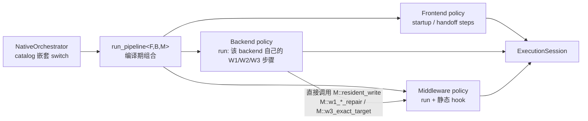

# Batch 4 切片 3c 方案：middleware route hook 收敛为 policy 静态接口（2026-09-24）

> 承接 D1=B。切片 1（handoff）、2（pipeline 形状）、3a（backend setup）、3b（middleware route 入口）
> 已完成，`cmp_disasm` 8 函数 PASS。**3c 把 middleware route hook 从虚函数收敛为
> `run_pipeline<F,B,M>` 内的 policy 静态接口；触及 8 函数，需独立门禁。**
> 形态依据：`native-component-architecture-plan.md`「Native C++23 运行模型」与「静态分派」两节。
> **后续演进**：Batch 4 架构审查（P1-B）把本片的 `route/middleware_hooks.*` 运行时 dispatch 收敛为
> backend 模板参数 `M` 的直接静态调用；policy 静态 hook 与 noinline 边界保留（见
> `batch4-pipeline-landing-plan.md`）。

## 现状：route 相关虚 hook

`ExploitProcedure`（Template Method）定义、由 route 子类 override 的 hook：

| hook | 基类默认 | 覆盖者（middleware） | 作用 |
|---|---|---|---|
| `resident_write` | nullopt | multicast（resident 快速路径） | 单次写内 resident 直写 |
| `w1_attempt_cap` | base | ？ | 一次性 route 不可安全重试 |
| `w2_fast_repair_prebuild/activate` | true | ？ | W2 凭据修复 payload |
| `w1_scratch_repair` | true | multicast | W1 后私有 scratch 修复（W1b） |
| `w1_resident_repair` | true | multicast | resident policycap 修复 |
| `w3_exact_target` | false | tcp | W3 精确写 [target] |

这些是 route（middleware）对 backend（W1–W3）流程的定制点，目前经**虚分派**（vtable）调用。

## 目标与约束

- **分层（与整体计划一致）**：
  - 步骤编排（frontend/backend）由各自 policy 的 `run(ExecutionSession&, RuntimePlanView&)` 承载，
    经 `run_pipeline<F,B,M>` 编译期组合；**不同 backend 可有不同 W1/W2/W3 步骤**，不共享固定骨架。
  - middleware route hook 收敛为 middleware policy 的**静态接口**（host 中性默认 + Android 覆写），
    由 backend 步骤**直接调用**；不再有虚函数、vtable、回调表。
- 3c 边界：只收敛 middleware hook，不改 backend/frontend 步骤、不改 route 算法/时序/payload。
- 保持 `route_lifecycle` 的「PI 窗口内无间接调用」；hook 仍在 PI 窗口外。

## 存量证据（只读）

- 基线候选 `1ac25ff9…`（`build/native/ghostlock`）自比 `cmp_disasm` 8 函数 **IDENTICAL/PASS**。
- `do_one_write`：`0x37088 ldr x8,[x8,#0x10]` + `0x3708c blr x8` → `resident_write` 仍是 vtable
  间接调用（offset `0x10`），未被 LTO 去虚化。
- 调用点仅 `main.cpp:99-100`（`set_force_attack` / `run`）；`orchestrator.hpp` 返回
  `unique_ptr<ExploitProcedure>`（3c 保留该契约）。

## 关键结论（决定分片方式）

- 任何真正的收敛都会改 `do_one_write`（去 `blr` 或改 vtable 偏移）→ 3c **无法「8 函数零影响」
  分片**，作为一次接受差异的门禁批次（内部可再分步，`cmp_disasm` 复核 + 真机门禁按整批一次）。
- **不采用**「单一 procedure + 运行时 hook 分派」替代 pipeline：backend 步骤可变，必须由
  `run_pipeline<F,B,M>` 的编译期组合承载；direct dispatch 只用于 middleware hook 子问题。
- hook 都在 PI 窗口外；收敛是消除既有间接调用，不改变「PI 窗口内无间接调用」不变量。

## 收敛设计：A 的 pipeline + policy 静态 hook 契约



- **共享核心非模板**：session 生命周期与 `run_main_route_threads`（PI 窗口执行）保持单一实现；
  模板只覆盖组件步骤，catalog 只实例化审查过的组合，限制 `F×B×M` 展开。
- **middleware policy 静态接口**（host 可编译 + Android 覆写 + concept 编译期契约）：

```cpp
namespace ghostlock::session { struct ExploitSession; }   // 前向声明，避免 session 依赖进入 host 头

struct RoutePolicyDefaults {
    static constexpr bool multicast = false;
    /* 有副作用的 route 步骤才设 hook；纯能力查询留在 static constexpr 能力上，
     * 由 route_capability()/投影函数读取（避免与同名能力冲突，也少一层机制）。 */
    static std::optional<Status> resident_write(session::ExploitSession&,
                                                const memory::WriteRequest&) noexcept { return std::nullopt; }
    static bool w1_resident_repair(session::ExploitSession&) noexcept { return true; }
    static bool w2_fast_repair_prebuild(session::ExploitSession&) noexcept { return true; }
    static bool w2_fast_repair_activate(session::ExploitSession&) noexcept { return true; }
};

template <class P>
concept MiddlewarePolicy = RoutePolicy<P> &&
    requires(session::ExploitSession& s, const memory::WriteRequest& r) {
        { P::resident_write(s, r) }       -> std::same_as<std::optional<Status>>;
        { P::w1_resident_repair(s) }      -> std::same_as<bool>;
        { P::w2_fast_repair_prebuild(s) } -> std::same_as<bool>;
        { P::w2_fast_repair_activate(s) } -> std::same_as<bool>;
    };
static_assert(MiddlewarePolicy<SelectPolicy> && MiddlewarePolicy<TcpPolicy> &&
              MiddlewarePolicy<MulticastPolicy>);
```

- **能力投影（非 hook）**：`w1_attempt_cap`、`w3_exact_target`、`needs_scratch_repair` 是纯查询，
  由 policy 的 `static constexpr` 能力 + profile 运行时值表达，在 `route/middleware_hooks.hpp`
  以投影函数提供（`w3_exact_target` 与同名能力冲突，投影同时消除了重复真相来源）。
- **Android 覆写只声明、定义在 `.cpp`**：`MulticastPolicy` 在 `#if defined(__ANDROID__)` 下重声明
  4 个 hook，实现放 `multicast_waiter_route.cpp`；host 继承中性默认（`if constexpr` 裁剪分支，
  不链接 Android 符号）。
- **调用点**：backend 步骤（现 `attack_write`/`w1`/`w2`/`w3`）由虚调用改为 `route::middleware::xxx(...)`
  （`for_each_policy` 展开为直接 `bl`，`if constexpr` 按 policy 能力裁剪），与 `run_route`/
  `route_capability` 同构。
- **hook 边界（noinline）**：`route/middleware_hooks.*` 的 4 个有副作用 hook 标注
  `[[gnu::noinline]]`。LTO 否则会把 route 实现（含 resident worker 启动）整个内联进 `do_one_write`，
  使攻击函数 138 → 416 条指令并与 middleware 实现强耦合；noinline 固定为一次直接调用，保持已复核的
  攻击函数形状与组件边界。
- **特例**：`w1_scratch_repair` 依赖 `attack_write`（保留在 `ExploitProcedure` 内），其「是否需要」
  经 `needs_scratch_repair` 投影判断，主体逻辑不搬离类。
- **删除** `MulticastProcedure`/`TcpProcedure`/`SelectProcedure` 的 hook override（三个类保留为
  空绑定，待 pipeline 落地切片替换）；`make_exploit_procedure` 的 route switch 不变。

## 3c 范围与后续切片

| 切片 | 内容 | 影响 |
|---|---|---|
| **3c（本片）** | middleware policy 静态 hook + `ExploitProcedure` 调用点改直接调用；保留 `unique_ptr<ExploitProcedure>` 契约 | 触 8 函数，需门禁 |
| 后续（pipeline 落地） | backend/frontend 步骤迁入 `B::run`/`F::*`；`run_pipeline<F,B,M>` + catalog 嵌套 switch；共享核心非模板 | 步骤可变、组合枚举 |

## 不变量

- victim/child 协议与 handoff 时序、资源所有权与清理顺序；`ExploitSession` 字段布局；
  route 算法/时序/payload；route 选择结果；PI 窗口内无间接调用。

## 实现记录（2026-09-24）

- 候选 `fed6b7cf255b15949e0ed7e1d2cf95f8e81a7f9f71b6ae5ee667693ce918373f`；
  基线 `1ac25ff9eb168fc0238f13a73210693b1d84337136320cba0482a67b6503fbd5`
  （由 `24a583b` worktree 重建复现，另存 `/private/tmp/ghostlock-b4-slice3c-base`）。
- 改动文件：`route_policy.hpp`（契约 + concept）、`route/middleware_hooks.{hpp,cpp}`（新，
  direct dispatch + noinline）、`exploit_procedure.{hpp,cpp}`（删虚 hook、调用点、W1b 搬入）、
  `multicast_waiter_route.cpp`（`MulticastPolicy` 定义）、`tcp_zerocopy_route.cpp`（删 override）、
  `src/Makefile`。
- `do_one_write` 差异（指令索引 25–30，经完整比对）：
  - `ldr x8,[x20]` / `ldr x8,[x8,#0x10]` / `blr x8`（vtable 取虚函数并间接调用）→
    `ldr x0,[x20,#0x8]` / `bl route::middleware::resident_write`（取 session 引用并直接调用）；
  - optional 检查 `tbnz w0,#8` → `and w8,w0,#0xffff; cmp w8,#0x100; b.hs`（ABI 等价）；
  - 其余 132 条指令与全部调用/顺序一致；无新增间接调用（移除了唯一一处 vtable 间接调用）。

## 验证（本地，2026-09-24）

| 项 | 命令 | 结果 |
|---|---|---|
| host | `make -C src native-host-tests` | 全部通过（含 `route_policy_test` 的 `MiddlewarePolicy` concept） |
| 构建 | `make -C src ghostlock`（NDK 30.0.16248370，`-B` 全量） | 零告警 |
| 静态 | `make -C src lint-tidy` | 0 findings |
| 反汇编 | `python3 tools/cmp_disasm.py /private/tmp/ghostlock-b4-slice3c-base build/native/ghostlock` | 7 函数 IDENTICAL；`do_one_write` 6 行差异（见上）已逐条复核等价 |
| 真机 | 冷机、固定 CPU 对、multicast、KernelSU 未加载 | **待跑**（候选 `fed6b7cf…`）；结果归档 `docs/analysis/device-gates/` |

## 进度

- [x] 盘点 route 虚 hook 与 8 函数影响面；产出方案。
- [x] 用户确认推进 3c。
- [x] 只读复核 + 扩展性评估：步骤可变归 `run_pipeline<F,B,M>`，hook 归 policy 静态接口（2026-09-24）。
- [x] 用户确认定稿并开始实现。
- [x] 实现 + 本地验证（host/构建/lint/`cmp_disasm` 逐条复核）。
- [ ] 真机门禁（用户执行）→ 归档并勾选 Batch 4。
