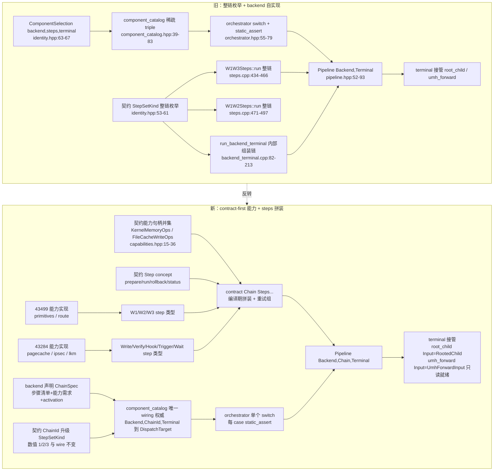

# Contract-First 攻击链装配 计划（2026-10-05）

> 级别：**L**（攻击关键路径 / 跨层契约 / 控制流重构）。状态：**草稿，待维护者认可**。
> 约束：本批次**只写本文档**，不改任何源码、不 commit。
> 相关：ADR-0004（adr/0004-framework-convergence.md:173-197，R18–R21）、
> config-wire-redesign-plan.md §3 R7（:70）、kernel-memory-batch1-plan.md §2.0/§2.5（:44-55、:130-163）、
> flexible-kernel-rw-primitive-plan.md。

---

## 0. 结论先行

维护者提出的**架构反转**：现状是「backend 以整链 StepSet 为模板实参、自己实现整条链」；目标是
「backend 先实现 contract 的能力接口 → steps 按能力需求拼装成完整攻击链 → pipeline catalog 仍是唯一 wiring 权威」。

| # | 设计问题 | 推荐结论（一句话） |
|---|---|---|
| Q1 | step 粒度与接口 | step = prepare → run → rollback → status 编译期概念；**单次效果**为一个 step；W2/W3 的 retry 属链级「重试组」，不是 step 内部循环 |
| Q2 | 链声明与单一权威 | backend 只提供 ChainSpec（步骤 id 列表 + 能力需求 + activation）+ step 类型；**Chain 模板负责拼装**；pipeline/component_catalog.hpp 仍是唯一 wiring 权威；StepSetKind 升级为 ChainId（数值/字符串/wire 不变） |
| Q3 | 编译期 vs 运行时 | Chain 编译期折叠展开，零 vtable/零间接；运行时**只保留 orchestrator 一个 switch**（orchestrator.hpp:55-79）+ backend 内一个 route switch（cve_2026_43499_backend.cpp:121-134） |
| Q4 | 共享性收益边界 | 判据「step 声明的能力需求 ⊆ backend 支持能力集 且输入/输出为 contract 中性」；43284 的 write/verify/rollback 是最先可共享者（43503），43499 的 W1/W2/W3 **必须等 C/KernelMemory 落地**才可能共享 |
| Q5 | 终端与 handoff 边界 | terminal 轴与 TerminalExecution 不变；链的**最后一步**是 HandoffStep，负责填 terminal Input；launch/readiness 仍归 terminal，RootProgram 仍是运行时参数 |
| Q6 | ADR-0004 修订 | R18 的「整链模板实参、backend 自持链」被反转；R21 的稀疏 catalog 继续是权威。建议新增 **R22–R27**（见 §2.6） |

**现状事实校正（重要）**：任务描述称「43499 是唯一已验证可用」，但当前工作树已把
backend_available(Cve2026_43284) 翻为 true（contract/identity.hpp:89-92、:196、:231），
host 测试断言其 app-call 真机门禁已过（tests/component_catalog_test.cpp:55-59）；
而 AGENTS.md:27 仍写 43284「已接线、未可用」。**这是文档漂移**：反转迁移应同时更正
AGENTS.md 与本文档，且**仍需把 43499 当作长期唯一生产路径来保护**（43284 的实际外场覆盖面未记录）。

---

## 1. 现状取证与问题诊断

### 1.1 现状 = 「整链枚举」结构

| 层 | 事实 | 证据 |
|---|---|---|
| 契约 | StepSetKind 是**整链**枚举：Unknown/W1W2/W1W3/PageCacheWrite | src/core/contract/identity.hpp:53-61 |
| 契约 | ComponentSelection = {backend, steps, terminal} | src/core/contract/identity.hpp:63-67 |
| 契约 | 能力句柄只有两个、且是 ctx + 函数指针 + available() 家族 | src/core/contract/capabilities.hpp:15-25（KernelMemoryOps）、:30-36（FileCacheWriteOps） |
| 组合 | catalog 是**稀疏 triple** + DispatchTarget，combination_supported/dispatch_target_of | src/core/pipeline/component_catalog.hpp:39-50、:64-83 |
| 组合 | Pipeline<Backend,Terminal> 每 case static_assert(P::target==...) | src/core/pipeline/pipeline.hpp:52-63；orchestrator.hpp:55-79 |
| 43499 | Cve2026_43499Backend<StepSet> 模板，steps 直接取 StepSet::kind | src/core/backend/cve_2026_43499_backend.hpp:27-31 |
| 43499 | W1W3Steps::run/W1W2Steps::run 是**整链**函数（W1→W2/W3 重试循环在函数体内） | src/core/backend/cve_2026_43499/steps.cpp:434-466、:471-497 |
| 43499 | backend 内部步骤词汇 w1/w2/w3/retry_write_stage/park_retry_child 全在同一 .cpp 的匿名命名空间 | steps.cpp:64-116、:118-136、:140-220、:224-321、:364-430 |
| 43499 | 共享写原语 Cve43499Primitives::attack_write<M>/zero_word<M>；值写带结构副作用、**不是干净单字写** | primitives.hpp:25-38；flexible-kernel-rw-primitive-plan.md:40-47 |
| 43284 | run_chain 已是「写→校验→触发→等待→清理」有序链，含载体回退/回滚/终结点恰一次 | backend/cve_2026_43284/steps/chain.hpp:107-121；chain.cpp:346-491；回滚 :138-153；终结点 :275-293 |
| 43284 | 链通过注入 ChainOps 完成设备解耦，real_ops.* 是真实绑定 | chain.hpp:216-258；real_ops.hpp:44-159 |
| 43284 | PageCacheWriteSteps 仍是 **skeleton**，run 有 TODO(B5-6)，链由 run_backend_terminal 内部执行 | backend/cve_2026_43284/steps/steps.hpp:16-21；backend_terminal.cpp:82-213 |
| 参考 | route 生命周期已有编译期 concept：prepare→execute→disarm→destroy | backend/cve_2026_43499/route/route_lifecycle.hpp:12-32 |

### 1.2 问题诊断

1. **词汇倒置**：StepSetKind 把「链」当原子，backend 必须为每个链变体写一个 run()；W1W2/W1W3
   的差异只是**少一个 W3 step**，却复制了两份整链控制流（steps.cpp:434-497）。
2. **能力接口名存实亡**：contract::KernelMemoryOps/FileCacheWriteOps 已存在，但 43499 的步骤
   并不通过它写内核，而是直接模板化在 route M 上调 Cve43499Primitives（steps.cpp:100、
   primitives.hpp:28-37）；43284 的链则通过 ChainOps 注入（chain.hpp:216-258）。两套写法并存。
3. **唯一权威实际被绕开**：43284 的「链」由 backend 内部的 run_backend_terminal 组装（backend_terminal.cpp:82-213），
   而 steps/steps.hpp 只是空壳（:16-21）。若反转时让 backend 自行拼链并决定 terminal，就会
   出现**第二个组合权威**，违反 ADR-0004 R21（:193-195）与 R1（backend 不得 include pipeline，:32-33）。
4. **门禁规则**：cmp_disasm 自 2026-10-05 起**不再是门槛**，真机门禁是唯一权威判据
   （AGENTS.md:51、:74、:132、:149）。

---

## 2. 设计问题逐条回答

### 2.1 Q1：step 的粒度与接口

**选项**

- (a) step = prepare → run → rollback → status，**一步一效果**，与 route 生命周期类比
  （route_lifecycle.hpp:12-32）。链负责 step 间顺序、跨步回滚、重试组。
- (b) step = 保留现有粗粒度（W1 一个 step、W2 一个 step、W3 一个 step）。
- (c) step 内部自带完整重试/回滚循环，链只顺序调用。

**推荐：以 (a) 为主，(b) 作为首批适配粒度；(c) 只允许用于「本质上不可分割」的复合步。**

理由：

- 与项目既有 lifecycle 风格一致（route 已是 concept + prepare/execute/disarm/destroy），无需新范式；
- 43499 的 retry_write_stage（steps.cpp:64-116）是「写 + verify + 退避 + 重试」的通用循环，
  若做成 step 内循环，会隐藏失败阶段（诊断只能报 step 级）；做成链级重试组可保留 run_state
  标记（steps.cpp:279 等）。
- 43284 的 run_chain 已是「每 block 写 + verify + journal 回滚」（chain.cpp:216-268），
  天然就是 (a) 的形状，重构成 step 不改变语义。

**建议接口（contract 中性，无 vtable）**

    enum class StepStatus : std::uint8_t { Ok, Skipped, Failed, NotReversible, Unsupported };
    enum class StepError  : std::uint8_t { None, Unsupported, Precondition, Io, Verify, Rollback, Fatal };

    template <class S, class Input>
    concept Step = requires(S &s, StepContext<Input> &ctx) {
        { S::id }                    -> std::convertible_to<contract::StepId>;
        { S::required_capabilities } -> std::convertible_to<contract::CapabilityMask>;
        { s.prepare(ctx) }           -> std::same_as<StepStatus>;
        { s.run(ctx) }               -> std::same_as<StepStatus>;
        { s.rollback(ctx) }          -> std::same_as<StepStatus>;
        { s.status }                 -> std::convertible_to<StepStatus>;
    };

**43499 映射**

| 现实现 | 反转后 step | 生命周期阶段 | 回滚语义 |
|---|---|---|---|
| run_setup（cve_2026_43499_backend.cpp:43-86） | SetupStep | run（链首一次性） | NotReversible（进程/信号/cpu 绑定） |
| w1 SELinux 写（steps.cpp:364-401） | SelinuxOffStep | prepare=检查已关；run=写 | NotReversible（权限已放开） |
| w1_scratch_repair（steps.cpp:326-361） | ScratchRepairStep | run | rollback=释放 quarantine socket（:355） |
| w1 ancillary PreSpawn（steps.cpp:408-428） | AncillaryPreSpawnStep | run | 无（行为级 fail-open） |
| w2 的 spawn_victim（steps.cpp:147-170） | SpawnVictimStep | prepare=spawn；run=记录 task | 杀子进程/复位 pipes |
| w2 的 vrtag ancillary（steps.cpp:176-199） | VrDetagStep | run | 无 |
| w2 的 credential 写（steps.cpp:201-216） | CredentialWriteStep | run=写 + verify | NotReversible（cred 已被改） |
| w3（steps.cpp:224-321） | SeccompClearStep | prepare=探测 process_has_seccomp（:239）；run=flags+mode 两次写 | NotReversible |
| retry_write_stage（steps.cpp:64-116） | 通用 retry 链策略 / step 模板 mixin | — | — |
| park_retry_child + W2/W3 外层循环（steps.cpp:118-136、:451-459） | 链级「重试组」RetryGroup<W2,W3> | — | 组失败即链失败 |

> W1W2 vs W1W3 的反转收益：两者变成同一步集合的**两个 ChainSpec**（W1W2 的链不含 SeccompClearStep），
> 不再需要两份 run()。这正是反转的核心价值。

**43284 映射**

| 现 ChainStage（chain.hpp:107-121） | 反转后 step | 回滚语义 |
|---|---|---|
| ResolveTarget | ResolveCarrierStep | 无（只读） |
| ComputePlan | BuildPlanStep | 无（只读/纯计算） |
| PatchCrashDump | CrashDumpPatchStep | 恢复原 block（复用 journal） |
| Write + Verify | PageCacheWriteStep（写+读回校验+journal，chain.cpp:216-268） | 回滚已写 block（chain.cpp:138-153） |
| Hook | LibcxxHookStep | restore_hook（chain.cpp:279-284） |
| Trigger | TriggerSentryStep | NotReversible（sentry 已 fork） |
| WaitResult | WaitTerminusStep | 无（只读轮询） |
| Cleanup | **不是 step**，是链终结点（finish，chain.cpp:275-293） | 恰一次 release + 擦 journal |
| 载体回退（chain.cpp:413-445） | 链级策略，不是 step | 仅在未写任何字节时允许 |

**失败与回滚归谁（推荐规则）**

1. **step 自己的效果**由该 step 的 rollback 负责（43284 journal 已是此形，chain.hpp:262-281）。
2. **跨 step 的回滚顺序**由链负责，**新到旧**（对齐 chain.cpp:141）。
3. **不可逆 step** 的 rollback 返回 NotReversible，链记录 rollback_incomplete（对齐 chain.hpp:296-297）。
4. **终结点**（release/wipe）由链拥有、所有路径恰一次（对齐 chain.cpp:275-293）。
5. terminal 的失败**不**由链回滚（terminal 在链之后，pipeline.hpp:74-91）。

**反例**：若让每个 step 自己决定下一个 step（step 间直接调用），则链结构不可静态检查、
无法保证终结点恰一次，也会把 43499 的 W2/W3 重试控制流重新散落到各 step —— 否决。

---

### 2.2 Q2：链的声明与单一权威

**选项**

- (a) backend 直接提供 run() 自行组装并执行链（现状 43284 的做法，backend_terminal.cpp:82-213）。
  → **否决**：形成第二组合权威，且 backend 要决定 terminal 才能拼出链。
- (b) chain 定义在 pipeline/，backend 只暴露 step 类型。
  → 可行但 pipeline/ 会退化成 backend 注册表，且 StepSetKind→ChainId 的登记点仍分散。
- (c) **contract 提供中性 Chain 模板 + ChainSpec 数据；backend 只声明 step 类型与 spec；
  pipeline/component_catalog.hpp 仍是唯一 wiring 权威。**

**推荐：(c)。**

具体：

1. **契约层**（新增 contract/step.hpp、contract/chain.hpp，保持 host 可编译、不 include backend/pipeline）
   - enum class ChainId：由 StepSetKind 升级而来。**保留数值 0/1/2/3**（identity.hpp:53-61），
     因为 wire 到 native 的 steps 原始 id 是 backend 私有段的 uint16，由 orchestrator 映射
     （orchestrator.hpp:27-39）；改名不改变 wire 字节，也不触发 GLKv3 版本变更（AGENTS.md:110-120 禁止随意起新版本）。
   - struct ChainSpec { ChainId id; std::array<StepId, N> steps; CapabilityMask required; ActivationContext activation; RetryGroups...; }（数值/顺序固定，可 constexpr 比较）。
   - template <class Input, class... Steps> struct Chain：编译期拼接、折叠执行、静态声明 Chain::id/required_capabilities。
2. **backend 侧**：每个 backend 定义自己的 step **类型**（SelinuxOffStep、PageCacheWriteStep …）、
   提供能力实现（KernelMemoryOps/FileCacheWriteOps 填充），并声明
   static constexpr ChainSpec chain_spec<...> 与 using Chain = contract::Chain<Input, ...>。
   backend **不** include pipeline、**不**决定 terminal、**不**执行链。
3. **wiring 权威**：pipeline/component_catalog.hpp 继续持有
   combination_supported（:39-50）与 dispatch_target_of（:64-83），只是把
   StepSetKind 换成 ChainId；每个 triple 对应的具体 Chain 由 catalog/orchestrator 处命名。
   Pipeline<Backend, Terminal> 中 Backend::steps 改为 Backend::Chain::id（pipeline.hpp:55）。

**static_assert / 测试如何锁死**

| 锁 | 位置 / 新增 | 作用 |
|---|---|---|
| static_assert(P::target != None) | pipeline.hpp:58-59（保留） | 每个实例必须是 catalogued triple |
| static_assert(P::target == DispatchTarget::X) | orchestrator.hpp:59-74（保留） | case 与 catalog 不分叉 |
| static_assert(ChainDefinition<Backend::Chain>) + spec 与实现一致 | 新增，backend 头 | 链声明（step 列表/能力需求）与真实 step 类型一致 |
| static_assert(BackendExecution<Backend, Terminal::Input>) | identity.hpp:251-265（保留） | 链产出的 Input 必须匹配 terminal |
| catalog 计数与覆盖测试 | component_catalog_test.cpp:88（catalogued == 3，随批次更新） | 稀疏性不被笛卡尔展开破坏 |
| 能力并集覆盖测试 | 新增（见 kernel-memory-batch1-plan.md:143-144） | 每个 backend 支持集完整声明；未支持→类型化错误 |
| include 防火墙 | tests/include_firewall_test.cpp（AGENTS.md:96） | backend 不得 include pipeline；无第二权威 |

**反例**：若 backend 暴露 struct MyChain { static StageResult run(...); } 自行调用 step 并直接
填 terminal::UmhForwardInput，则新增 terminal 时必须改 backend，catalog 与 backend 的 wiring
知识分叉 —— 否决。

---

### 2.3 Q3：编译期 vs 运行时

**选项**

- (a) Chain 编译期拼装 + 运行时仅 catalog/handler 的**一个** switch。
- (b) 运行时步骤表（函数指针数组）驱动。
- (c) 虚基类 IStep + std::vector<IStep*>。

**推荐：(a)。** 与项目偏好一致：Pipeline<Backend,Terminal> 编译期固定、-fno-rtti、攻击路径禁间接分派
（AGENTS.md:88-95；ADR-0004 R19 :186-188；route 概念 :9-20）。

- **零开销**：Chain::run 用 fold expression 顺序调用 Steps::run(ctx)，全部内联；ChainSpec
  是 constexpr 数据，编译后只留需要的分支。
- **可诊断性**：
  - 编译期：缺 step / 能力需求不满足 / 链未登记 → concept 失败，static_assert 文案给出
    (backend, chain, terminal) 三元组（对齐 pipeline.hpp:58-63）。
  - 运行期：保留 StageResult + backend 私有错误枚举（如 BackendTerminalError，backend_terminal.hpp:108-120）；
    新增**有界** ChainTrace（std::array<{StepId,StepStatus},N>）暴露失败 step，替代/补充
    support::run_state 标记（steps.cpp:176 等）。
- **运行时 switch 数量**：反转前已有两处（orchestrator orchestrator.hpp:55-79 + 43499 route
  cve_2026_43499_backend.cpp:121-134）。反转后 **不新增**：catalog→Pipeline::run 仍是唯一
  分派 switch；链内顺序完全编译期。

**反例**：运行时 step 表会让「漏加一个必需 step」从编译错误退化为运行期静默跳过，
与 R7「未支持必须报错」（config-wire-redesign-plan.md:70）冲突 —— 否决。

---

### 2.4 Q4：共享性收益边界

**判定规则（推荐）**：

> step S 可被 backend B 复用 ⇔ S::required_capabilities ⊆ B::supported_capabilities
> **且** S 的输入/输出类型均为 contract 中性（无 VictimContext/Cve2026_43499Profile/route 模板 M）。

能力集合 → 可用 step 集合：

| 能力句柄 | 现有位置 | 可支撑的中性 step | 现状可用性 |
|---|---|---|---|
| KernelMemoryOps（ctx + read/write + available） | capabilities.hpp:15-25 | WriteZeroStep、WriteWordStep、UpdateBitsStep（需 read-modify-write）、ReadBackVerifyStep | 接口已存在；**任意值写/读尚未实现**，Tier 2 由 C 计划落地（flexible-kernel-rw-primitive-plan.md:128-140） |
| FileCacheWriteOps（ctx + write16） | capabilities.hpp:30-36 | PageCacheWriteStep、PageCacheVerifyStep、JournalRollbackStep | 43284 已用；43503 可复用（:27 明示） |
| AliasOps（image→direct-map） | 计划中（kernel-memory-batch1-plan.md:125） | AncillaryImageAliasStep | 待 Batch 1 冻结 |
| AddressDiscoveryOps | address_discovery.hpp:84-91 | DiscoverTaskStep | 43499 spray 已活体接线（kernel-memory-batch1-plan.md:152） |

**本质私有、不应强抽的 step**

| 私有 step | 证据 | 原因 |
|---|---|---|
| route / PI-futex race 写（attack_write<M>） | primitives.hpp:25-38；ADR-0004 R2/R12 | route 是 backend 内部策略，且写值带结构副作用（flexible-kernel-rw-primitive-plan.md:40-47） |
| victim spawn / park / uid 管道控制流 | steps.cpp:118-136、:140-220 | 依赖 VictimContext 与 CoreSession 私有状态 |
| ESP/CBC 页缓存 datagram | backend/cve_2026_43284/ipsec/ | 43284 漏洞语义私有 |
| .ko vermagic / LKM policy / 双 fork sentry | backend_terminal.cpp:123-174；real_ops.hpp:44-63 | 43284 专属设备行为 |

**收益结论**：
- **先共享**：43284 的 PageCacheWriteStep + verify + rollback（chain.cpp:216-271），因为它已经
  完全跑在 FileCacheWriteOps 上，对目标文件唯一依赖是「16 字节块」这一中性契约；43503 可直接复用。
- **后共享**：43499 的 W1/W2/W3 要等 KernelMemoryOps 具备任意读/写（C 计划 Batch 3/4，
  flexible-kernel-rw-primitive-plan.md:261-265）后，才可能把 retry_write_stage（steps.cpp:64-116）
  抽象为「写 + verify」中性 step。
- **不要过早抽象**：ADR-0004 R9 明确「等第二个原语不同的 backend 真正落地再从两个真实实现抽象」
  （adr/0004-framework-convergence.md:73-75）；43284 的 chain 就是这个「第二个真实实现」。

**反例**：为共享而把 43499 的 route 模板 M 塞进 step 接口（Steps::run<M>），会让所有 backend
被迫认识 route 概念，共享面反而塌缩成 43499 专属 —— 否决。

---

### 2.5 Q5：终端与 handoff 边界

**保持不变的契约**

- ComponentSelection 仍是三维（identity.hpp:63-67）；terminal 仍是装配轴（ADR-0004 R12/R15）。
- TerminalExecution<T> 不变：T::Input 派生 TerminalInput + activation + run（identity.hpp:318-327）。
- RootProgram 仍是**运行时参数**，可由两个 terminal 启动（identity.hpp:121-145）。
- terminal 由 Pipeline 在 backend 返回 Continue 后调用一次（pipeline.hpp:74-91）。

**新链接口边界（推荐）**

1. 链的**最后一步**是 HandoffStep<Input>：把 backend 私有结果转成中性 terminal Input
   （root_child：pid + 命令 fd + 状态位，对齐 cve_2026_43499_backend.cpp:142-157；
   umh_forward：对齐 backend_terminal.cpp:196-211）。
2. HandoffStep 的 Input 类型由 ChainSpec/Chain 的模板参数决定，编译期与 terminal 配对，
   并由 BackendExecution<Backend, Terminal::Input>（identity.hpp:251-265）锁定。
3. **launch / readiness 仍归 terminal**：
   - root_child：启动所选 RootProgram（root_child.hpp:24-31）；
   - umh_forward：**只读**就绪探测，不写/不转发/不 exec（umh_forward.hpp:4-27、:45-60）。
4. **UMH 就绪探测边界**：UmhForwardChannel 由组合根注入（main.cpp:225-236），链的
   WaitTerminusStep 只负责观测 LKM/UMH 终结点（chain.cpp:477-490）并置
   UmhForwardInput.lkm_loaded=true（backend_terminal.cpp:196-199）；终端再做只读确认
   （umh_forward.hpp:41-52）。链不得启动 root 程序、不得跳过 terminal。
5. **handoff 恰一次**：链终结点（release/wipe）先于 terminal；terminal 返回后 chain 不再运行
   （对齐 pipeline.hpp:74-91、chain.cpp:275-293）。

**反例**：让链直接调用 RootProgram 启动逻辑，会绕开 terminal 的 activation 语义
（Descendant vs KernelSpawned，identity.hpp:147-149）与 combination_supported 的 R20 自洽校验
（adr/0004-framework-convergence.md:189-192）—— 否决。

---

### 2.6 Q6：ADR-0004 修订

**R18–R21 冲突点**

| 条款 | 现有文字 | 冲突 |
|---|---|---|
| R18（:180-184） | StepSet 是 backend 的**整链模板实参**，Backend<StepSet> | 与反转「chain 是中性装配物、step 可共享」冲突；链不再隶属单一 backend |
| R12′（:196-197） | Pipeline<Backend<StepSet>, Terminal> | 同上；pipeline 应模板化在 Chain 上 |
| R19（:185-188） | terminal 统一接口 | **不冲突**，保持 |
| R20（:189-192） | combination_supported 校验 activation 自洽 | **不冲突**，升降为链声明的 activation 参与校验 |
| R21（:193-195） | 稀疏 catalog、DispatchTarget、每项 static_assert | **不冲突且必须加强**：catalog 仍是唯一 wiring 权威 |

**建议新增条文（R22–R27）**

- **R22（Step 契约）**：step = prepare → run → rollback → status 编译期 concept，无 vtable；
  step 只负责自身效果与自身回滚；不可逆 step 显式 NotReversible。
- **R23（Chain 是第一装配物）**：chain = 有序 step 列表 + 重试组 + 能力需求 + activation + terminal
  Input 绑定，由 contract::Chain 编译期拼装；ChainId 由 StepSetKind 升级（数值/wire 不变）。
- **R24（单一 wiring 权威）**：pipeline/component_catalog.hpp 是唯一命名 (backend, chain, terminal)
  的地方；backend 只声明 ChainSpec/step 类型/能力实现，**不得** include pipeline、不得自行组装执行链；
  include 防火墙强制（AGENTS.md:96）。
- **R25（能力清单与并集）**：chain 显式声明所需能力，取自**全 backend 并集**词汇；不支持→
  **类型化错误**，禁止静默 no-op/空指针即崩（config-wire-redesign-plan.md:70；
  kernel-memory-batch1-plan.md:130-163）。
- **R26（terminal 边界）**：链以 HandoffStep 产出 terminal Input 结束；launch/readiness 仍归 terminal；
  RootProgram 仍是运行时参数。R19 不变。
- **R27（修订 R18/R12′）**：废止「Backend<StepSet> 以整链为模板实参」的表述；改为
  Pipeline<Backend, Chain, Terminal>，其中 Chain 满足 R22/R23。

---

## 3. 数据流/控制流对照（旧 vs 新）

**不变量**

- 运行时只有 orchestrator 一个 switch（orchestrator.hpp:55-79）+ backend 内一个 route switch
  （cve_2026_43499_backend.cpp:121-134）。
- 稀疏 catalog 形状不膨胀：三 triple 起，按需显式增加（component_catalog_test.cpp:88）。
- 攻击顺序、日志文本、终结点顺序在迁移批次中保持不变；真机门禁为准（AGENTS.md:149）。

---

## 4. 迁移批次与门禁

风险递增；每批「上一批验证通过再进下一批」（AGENTS.md:76-78）。

| 批次 | 内容 | 触及攻击路径 | 门禁（真机为主；cmp 可选） |
|---|---|---|---|
| **B0** | 本文档 + ADR-0004 R22–R27 修订 + 更正 AGENTS.md:27 的 43284 可用性漂移 | 否 | 维护者认可；git diff 只含文档 |
| **B1** | 契约引入：contract/step.hpp、contract/chain.hpp；StepSetKind→ChainId（数值不变）；旧整链 run() 用兼容 adapter 包成链；行为**零变化** | 否（只重排类型） | make -C src native-host-tests 全绿；NDK 零告警；make -C src lint-tidy；include 防火墙；catalog/contract 测试 |
| **B2** | **43284 链化**：把 run_chain 的 stage 拆成 PageCacheWriteStep/LibcxxHookStep/TriggerSentryStep/WaitTerminusStep 等，顺序/终结点/回滚与 chain.cpp:346-491 完全一致；PageCacheWriteSteps skeleton 落地（steps/steps.hpp:16-21） | **是** | host（cve_2026_43284_chain_test、cve_2026_43284_backend_terminal_test）+ NDK + lint + **真机 app-call 门禁**，日志按 docs/analysis/device-gates/*.md 归档（AGENTS.md:152-154） |
| **B3** | **43499 W1/W2/W3 分解**：SelinuxOffStep/ScratchRepairStep/SpawnVictimStep/CredentialWriteStep/SeccompClearStep + W2/W3 重试组；**依赖 C/KernelMemory 落地**（flexible-kernel-rw-primitive-plan.md:261-265） | **是（唯一长期生产路径）** | host + NDK + lint + include 防火墙 + **真机门禁（冷机、固定 CPU 对、单 route、KernelSU 未加载，AGENTS.md:149）** + 归档；cmp_disasm 可选诊断 |
| **B4** | 跨 backend 共享抽取（页缓存 write/verify/rollback step 供 43503） | 视抽取范围 | 仅在**两个真实实现**都存在后做（ADR-0004 R9，adr/0004-framework-convergence.md:73-75）；host + 真机不回归 |

> 43284 现已 backend_available=true（identity.hpp:89-92、:196）且 app-call 门禁已记录
> （identity.hpp:223-227、component_catalog_test.cpp:55-59），因此 B2 同样需要真机门禁，
> 不能因「新」而放宽。

---

## 5. 风险与回滚

| 风险 | 影响 | 缓解 / 回滚 |
|---|---|---|
| **43499 是唯一长期验证路径**，W1/W2/W3 分解可能引入回归 | 提权失败或 panic | B1/B2 **不碰 43499**；B3 前保留旧整链 run() 为编译期 fallback；B3 单独提交，回滚 = git revert；真机门禁不过不进 B4 |
| KERNEL-PANIC-01 已知环境/时序问题：同构建可 PASS/panic/PASS | 误把单次 panic 当代码回归 | 同构建复现 + 冷机复跑（AGENTS.md:156-157）；不在同批混入其它攻击路径改动 |
| 能力并集 / enum 显式选择（kernel-memory-batch1-plan.md:44-55）改变 fail-closed 语义 | 未支持被静默跳过 | step 声明 required_capabilities；缺失→StepError::Unsupported，链失败；host 覆盖测试锁定 |
| 出现第二个组合权威（backend 自行拼链 / 决定 terminal） | catalog 与 backend 分叉 | R24 + include 防火墙（AGENTS.md:96）+ catalog 测试（component_catalog_test.cpp:63-104） |
| CoreSession 布局变化移动 backend_state 偏移 104 | 状态错位 | 只追加字段；session_layout_test.cpp 钉死（kernel-memory-batch1-plan.md:191） |
| wire steps 字段语义变化 | Kotlin/提取器对拍破坏 | ChainId 仅改 C++ 类型名，**数值与字段路径不变**；不 bump GLKv3（AGENTS.md:110-120） |
| 43284 可用性翻转未同步文档 | 读者误判生产状态 | B0 更正 AGENTS.md:27；本文档 §0 已标注 |

**整链回退点**：
- 43284 可回退为不可用：contract/identity.hpp:84-92 的 terminal_available/backend_available
  与 :196、:231 的 static_assert 成对改回（文件内 :69-83 已描述 flip 的精确位置）。
- 43499 回退：恢复 W1W3Steps::run/W1W2Steps::run 整链（steps.cpp:434-497）并摘掉 adapter。

---

## 6. 未决问题清单（≤8，各附推荐）

| # | 问题 | 推荐 |
|---|---|---|
| 1 | 43499 的 W2/W3 retry 是 step 内循环还是链级重试组？ | 链级 RetryGroup<W2,W3>；retry_write_stage（steps.cpp:64-116）作通用 helper，首版可先包成复合 step |
| 2 | StepSetKind 是否改名 ChainId？ | 改名，但保留枚举数值与 token 字符串；保留一个批次别名过渡 |
| 3 | HandoffStep 由链显式声明，还是由 backend run() 在返回前填？ | 显式 HandoffStep，由 ChainSpec 声明，BackendExecution 编译期校验 |
| 4 | ChainSpec 用 constexpr 数据还是 type traits？ | constexpr 数据 + ChainDefinition concept（可 host 断言、无 RTTI） |
| 5 | 能力需求按 step 还是按链声明？ | 以 step 声明为准，链的 required_capabilities 由各 step 并集派生 |
| 6 | 失败用 StageResult 还是新增 StepError？ | 新增 StepError（类型化，满足 R7），在链边界映射为 StageResult |
| 7 | B2 是否等 43499 一起做？ | 否，先 43284（已是链形状）；43499 单独 B3，依赖 C/KernelMemory |
| 8 | 新 ChainId 是否可能超出当前 3 个值？ | 是；wire 是 backend 私有段 uint16（orchestrator.hpp:27-39），可继续登记，不 bump 版本 |

---

## 7. 明确保留

- route 内部生命周期（route_lifecycle.hpp:12-32）与「route 由 backend 从 profile 选」不变
  （component_catalog.hpp:18-20）。
- terminal 统一接口与 activation 语义（identity.hpp:318-327、:147-149）不变。
- orchestrator 唯一分派 switch（orchestrator.hpp:55-79）不变，仅 case 内部类型变为 Chain。
- 稀疏 catalog / DispatchTarget / 每 case static_assert（component_catalog.hpp:39-83）不变。
- ancillary 机制与 platform::vivo 行为不变（ADR-0004 R4）。
- wire/profile 格式、steps 字段与数值、profile 权威不变。
- 43499 攻击语句顺序、日志文本、终结点顺序不变（迁移只允许结构变化，行为以真机门禁判定）。
- kernelsnitch/ 不改（AGENTS.md 说明其冻结但可在顶级重构拆分）。

## 8. 进度

- [x] 现状取证（read/grep，带行号）
- [x] 六个设计问题的选项/推荐/理由/反例
- [x] 新旧 Mermaid 对照
- [x] 迁移批次与门禁、风险与回滚、未决问题
- [ ] 维护者认可
- [ ] B0：ADR-0004 R22–R27 修订 + 更正 AGENTS.md:27
- [ ] B1：contract/step.hpp + contract/chain.hpp + ChainId（行为不变）
- [ ] B2：43284 链化 + 真机门禁
- [ ] B3：43499 W1/W2/W3 分解（依赖 C/KernelMemory）+ 真机门禁
- [ ] B4：跨 backend 页缓存 step 共享（43503）
