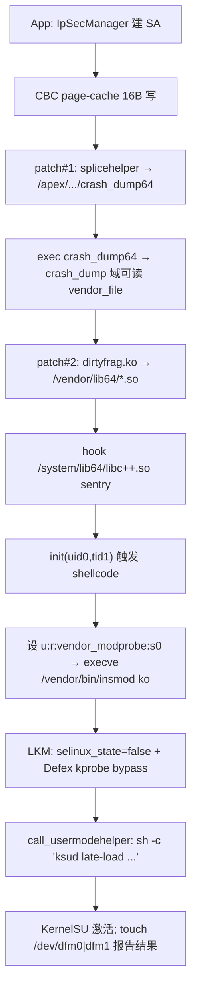
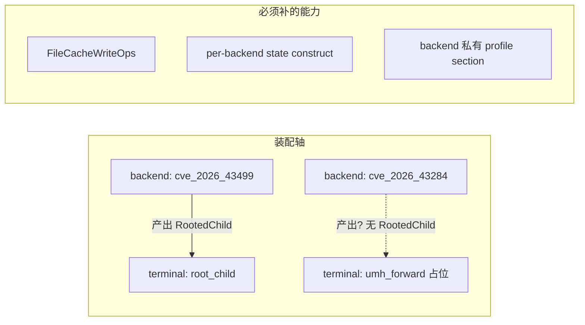

# CVE-2026-43284 backend 加入评估（2026-10-02）

> 类型：解释/评估（`docs/analysis/`），不是最终实现计划。
> 目的：为修改 `docs/archive/20261007-2237-top-level-architecture-rewrite-plan.md` 与
> `architecture-findings-register.md` 提供依据，判断把 CVE-2026-43284 作为第二个
> 可用 backend 加入需要哪些架构能力。
> 基线：分支 `vr-ko-bypass-dev`，HEAD `bc46c4f`（Phase A2-3b），工作树干净。
> 范围与证据：本文只做架构与上游事实调研；**未做真机、未标 supported**。

## 结论摘要

CVE-2026-43284 在目标模型里**可以**是 backend，但不能只按
`adding-a-component.md` 补一个 policy。它撞击目标架构四处，其中三处必须
先补能力，否则会把 43499 的假设（内核内存原语、`RootedChild` 终态、写死的
状态槽）带进新 backend：

1. **capability 轴要中性化**：43284 的 service 是「任意 16 字节页缓存/文件写」，
   不是 `KernelMemoryOps`；现有 T0/T1/T2 能力阶梯是内核内存形状。
2. **terminal 轴要落地 `umh_forward`**：43284 的自然终态不是 `RootedChild`，
   而是「patch 文件 + 加载 LKM + 关 SELinux + UMH 起 `ksud late-load`」。
3. **组合根去 43499 耦合**：`pipeline/orchestrator.hpp` 现在无条件
   `cve43499_state_construct()`，状态槽是 43499 形状。
4. **profile/wire/platform 要允许 backend 私有**：43284 无 route、几乎不需要
   内核 offset，但它需要设备/固件对策与自己的 GLK1 section。

建议把本 CVE 作为「验证 ADR-0004 中性性的第一个非 43499 backend」；先按
`documentation-standards.md` 的计划模板产出 L 级实现计划，再动代码。

---

## 1. 漏洞与原语

### 1.1 根因与修复

- 子系统：`net/xfrm` + `net/ipv4/esp4.c` / `net/ipv6/esp6.c`。
- 根因：`esp_input()` 对「未 clone、非线性、无 `frag_list`」的 skb 走免
  `skb_cow_data()` 快路径，就地（in-place）AEAD 解密会写进由 `splice` 附着的
  **共享 page frag**。认证校验在写入之后，故写入无条件生效。
- 引入：`cac2661c53f3`（2017-01-17）；修复：`f4c50a4034e6`
  （作者 2026-05-04、committer 2026-05-05、netdev 合入 2026-05-07、
  mainline 2026-05-08、同日分配 CVE-2026-43284）。
- 修复方式：IPv4/IPv6 UDP splice 路径标记 `SKBFL_SHARED_FRAG`；ESP 遇到该
  flag 回退 `skb_cow_data()`。
- 同族：CVE-2026-43500（RxRPC，Android GKI 默认禁用）于 2026-05-10 修复。

### 1.2 原语

- 上游 Linux PoC（V4bel）是 **4 字节 STORE**：`crypto_authenc_esn_decrypt()`
  在 `assoclen + cryptlen` 处做一次 `scatterwalk_map_and_copy`，值来自可任意
  指定的 ESN `seq_hi`。
- Android 移植（LSPromise/DFRoot）改用框架 `IpSecManager` 提供的
  AES-CBC + HMAC-SHA256，把原语增强为**任意 16 字节页缓存写**：

  ```
  C = 目标页缓存的旧 16 字节（可先读）
  P = AES_DEC(K, C) XOR IV      （CBC 解密）
  令 IV = AES_DEC(K, C) XOR desired  ⇒  P = desired
  ```

  一个 ESP 包 = 一个 16 字节块；地址即文件偏移，值完全可控。
- **不需要** KASLR/符号/结构体 offset、CFI 或堆喷；无竞态、确定性；失败=无写入，
  不 panic。

### 1.3 Android 触发面

- 普通 App 通过公开 `IpSecManager`（`openUdpEncapsulationSocket()` /
  `allocateSecurityParameterIndex()` / `IpSecTransform`）建立 SA，绕开 SELinux
  `appdomain` 的 `netlink_xfrm_socket` neverallow（该思路归于 DirtyInit）。
- 目标文件页需可被 `splice` 进 skb frag；系统/APEX 文件通常可读，`vendor_file`
  需经 `crash_dump` 域桥接。

### 1.4 兼容性边界（对 profile 的含义）

- 漏洞窗口极宽（2017–2026），原语跨内核高度一致；
- 真正的 per-kernel 依赖集中在**权限转换阶段的内核模块**（见 §2），不是 offset；
- 因此 43284 的 profile 主要承载「端局策略 + 设备/固件适配」，而非像 43499 那样
  的每 release offset 表。

---

## 2. 参考实现的端到端链（DFRoot / DFReroot / LSPromise）

现有 43284 Android 实现（diabl0w/DFRoot、polygraphene/DFReroot、
LSPosed/LSPromise）的链条如下：



- **上游来源**：漏洞与写原语来自 V4bel / LSPromise；`vendor_modprobe` +
  `late-load` + Defex bind-mount 来自 DFReroot；非特权 XFRM socket 方法来自
  DirtyInit；**UMH 终端、Defex kprobe、`--ro-partitions` 等`ksud` 参数来自
  diabl0w/DFRoot**，DirtyFrag 只是它的设备移植 + vendor target 回退。
- **per-kernel**：`.ko` 必须匹配 `vermagic` / `modversions` CRC / 模块签名，
  且 LKM 内 `struct subprocess_info` 布局按目标内核编译决定。
- **设备/固件**：`crash_dump64` ABI 与 label、vendor 载体路径、
  `vendor_modprobe` 域、Defex 符号。
- **UMH 与 vivo `vr.ko`**：UMH 会触发 `android_rvh_commit_creds`，是否被
  `vr.ko` 打 tag 取决于其判据（`new->euid==0` 还是 app-origin/真实提权），
  **不是天然绕过**；本项目已有的 `VrGuard`/`VrTaskTag` 仍是显式中和的正确做法。

---

## 3. 与 cve_2026_43499 的对照

| 维度 | cve_2026_43499 | cve_2026_43284 |
|---|---|---|
| 根因 | rtmutex `remove_waiter()` 悬垂 `pi_blocked_on`（栈 UAF） | ESP 对共享 frag 就地解密 |
| 原语 | 竞态后一次受限指针写 → 搭梯子到物理 R/W | **任意 16 字节页缓存/文件写**（无竞态） |
| 是否需要内核内存 | 是（KASLR、UAF 回收、伪造对象） | 否（写文件内容，不碰内核地址） |
| route | select/tcp/multicast 三选 | **无 route** |
| steps | W1 SELinux / W2 cred / W3 seccomp | W1 由 LKM 关 SELinux；root 由 ksud late-load；**无 cred patch、无 W3** |
| 终态 | 产出 `RootedChild` → `root_child` handoff | 加载 LKM + UMH 起 `ksud late-load` |
| profile 性质 | 每 release offset 表 | 端局/设备策略；几乎无 offset |
| 主要 per-kernel 依赖 | 逐 build offset | 内核模块 ABI/签名 |

**含义**：43284 与 43499 只能共享框架件（pipeline、catalog、session、profile 传输、
W1/W3 目标语义），**原语、steps、route、终态都不同**；这与
`placeholder-backend-survey.md` 对 43503（同族 page-cache 写）的判断一致。

---

## 4. 对目标架构的撞击点



### 4.1 capability 轴中性化（MUST）

`docs/archive/20261007-2237-top-level-architecture-rewrite-plan.md` 的能力阶梯 T0 route write → T1
`KernelMemory` 引导写 → T2 任意读/`update_bits` 以内核内存为中心。43284 既不用
route，也不用 `KernelMemoryOps`/`AddressDiscoveryOps`。必须决定：在 `contract`
增加与 `KernelMemoryOps` 平级的 `FileCacheWriteOps`（推荐，同族 43503 复用），
还是允许 backend 私有 primitive、只共享可用性模型。此决策 MUST 落到 ADR-0004
的 R 系列，否则每个 page-cache backend 各写一套。

### 4.2 terminal 轴落地 `umh_forward`（MUST）

`terminal_contract.hpp` 已声明 `UmhForwardTerminal` 但不可用。43284 的自然
终态不是「我们 fork 的 root 子进程」，套 `RootedChild`（pid + command fd +
uid_read）语义不贴。需要：

- 把 `umh_forward` 从占位变为可用 terminal（policy + catalog +
  `TerminalIdentityList` + contract 测试）；
- 决定 KernelSU late-load 放 terminal 还是保留在 LKM（`terminal_contract` 明确
  「UMH terminal must not be bound to KernelSU」）；
- 决定 terminal 输入契约是否泛化为更中性的 `TerminalInput`/`PrivilegedActivation`，
  或扩展 `RootedChild`。属 R10 的延续 L 级决策。

### 4.3 组合根去 43499 耦合（MUST）

`pipeline/orchestrator.hpp` 在 dispatch 前无条件
`cve43499_state_construct(exploit_session)`。必须改为按
`selection.backend` 构造/析构，例如 backend policy 提供 `state_type` +
`construct(session)`/`destroy(session)`。`CoreSession` 的
`backend_state`/`backend_state_dtor` 已支持，问题只在构造点写死。
`session_layout_test` / `backend_dataflow_test` 需同步。

### 4.4 profile / wire / platform 私有化（MUST）

- `profile/binary.h` 增加 `kBackendCve202643284 = 6` 与校验；GLK1 v2 增加 43284
  自己的 section（载体路径、KMI/.ko 策略、Defex 符号、SELinux exec 上下文、
  late-load 参数），**不得复用 43499 槽**。
- `MiddlewareKind = profile::RouteKind` 目前是全局；43284 无 route，需允许
  backend 缺省 route（A2-3/4/5 的传输去绑定应覆盖）。
- `platform`（`abi`/`runtime`/`vivo`）承载设备与固件对策，以及「内核是否已含
  `f4c50a4`」的 fail-closed 适用性检查。

---

## 5. 逐处改动清单（对齐 `adding-a-component.md`）

| 位置 | 文件 | 改动 |
|---|---|---|
| identity/catalog | `pipeline/backend_policy.hpp`、`pipeline/component_catalog.hpp` | 加 `Cve2026_43284` identity、`BackendKind` 值、`backend_available`、`combination_supported`、新 `DispatchTarget`、`dispatch_target_of`、`backend_name` |
| contract 注册 | `pipeline/backend_contract.hpp` | `BackendIdentityList` 加一项 + `static_assert` |
| 执行 policy | `backend/cve_2026_43284_backend.{hpp,cpp}` | `Cve2026_43284Policy`：`kind`、`run(...)`、`state_type`、typed profile view；无 `run_steps<M>` |
| 状态槽 | `backend/cve_2026_43284_state.hpp` | 私有状态（IpSec 参数、目标文件、`.ko` 选择），走通用槽 |
| 原语 | `backend/cve_2026_43284/{ipsec,pagecache,steps,backend_terminal}` | ESP/IpSec + CBC IV 写 + 端局步骤；**不复用** `PiRace`/payload/heap |
| terminal | `terminal/umh_forward.{hpp,cpp}` + `terminal_contract.hpp` + catalog | 由占位转可用 |
| platform | `platform/{runtime,abi,vivo}` | 设备/固件探测与对策；修复检测 |
| 组合根 | `pipeline/orchestrator.hpp` | per-backend 状态构造；新 case + `static_assert` |
| wire | `profile/binary.{h,cpp}`、GLK1 section | 新 backend id + 私有 section 编解码/校验 |
| Kotlin | `app/.../data/**`、`build.gradle.kts`、UI | 新 backend id/配置/选择（当前 app 侧**无** `BackendKind` 枚举，需新增） |
| 构建/测试 | `src/Makefile`、`component_catalog_test`、`backend_contract_test`、host `backend_dataflow_test`、`profile_binary_test`、`session_layout_test` | 新组合 + 状态 + wire 往返 |
| 门禁 | `tools/cmp_disasm.py` | 43284 是独立新代码，**不改 43499 的 8 函数**，43499 基线保持 |

---

## 6. 前置依赖与批次

43284 依赖重构中尚未完成的项：

- `docs/archive/20261007-2237-top-level-architecture-rewrite-plan.md` 的 **A2-3/4/5**：offset SSOT、
  `ResolvedAddresses`/platform/ancillary 分层、传输/入口去绑定（route 真正
  backend 私有）。
- **A-4**：`BackendExecution` 从
  `run(CoreSession&, decoded, debug_dir, force, RootedChild&)` 收敛为
  `run(CoreSession&, RootedChild&)`，`decoded` 移入 backend 状态；否则 43284
  只能拿到 43499 形状的 `kernel_offsets`。
- **Phase C（KernelMemory 功能）**：若把通用写能力抽成 `Capability`，同批推进
  更顺。

建议顺序：先在 `architecture-findings-register.md` 登记本节结论，修订
`docs/archive/20261007-2237-top-level-architecture-rewrite-plan.md`（新增「非内核内存 capability」与
`umh_forward` 相关条目），再产出 43284 的 L 级实现计划。

---

## 7. 需要拍板的 L 级决策

1. **能力抽象**：新增 `FileCacheWriteOps`，还是 backend 私有 primitive +
   共享可用性模型？（同族 43503 一并考虑）
2. **终态抽象**：43284 用 `umh_forward`，还是新增第三类 terminal？
   `RootedChild` 是否泛化为 `TerminalInput`？
3. **状态槽构造**：由 backend policy 提供 `construct/destroy`（推荐），还是另开
   注册表？
4. **KernelSU late-load 归属**：放 terminal（需破除「terminal 不绑 KernelSU」
   约束）还是留在 LKM/backend？
5. **profile 语义**：43284 的 section 是「策略/适配」而非 offset 表，是否接受
   `kernel_offsets` 泛化为 backend 私有文档？

---

## 8. 明确保留 / 非目标

- **不动** 43499 的攻击函数、W1/W2/W3 顺序、四段生命周期、GLK1 v2 容器与
  profile 唯一配置权威。
- **不复用** 43499 的 wire 槽、route 枚举与状态布局。
- 非目标：本文不做真机验证、不评估 43284 的可利用性上限、不实现代码。

---

## 9. 风险与未验证

- **真机未验证**：43284 的 Android 端到端（尤其 patch#1 `crash_dump64` 校验、
  vendor 载体、模块签名/vermagic）未在本项目验证；未过真机不得标 supported。
- **`.ko` 供应链风险**：第三方预编译内核模块不可审计；且 debug 证书签名的 APK
  不可作为可信来源（见对 DirtyFrag 发布物的核查）。
- **UMH 与 `vr.ko`**：UMH 不保证绕过 `vr.ko`，取决于其 `android_rvh_commit_creds`
  判据；应按 `VrGuard`/`VrTaskTag` 显式中和。
- **上游文本不等于可利用性**：V4bel/MITRE 的描述是修复提交说明，可能省略。

---

## 10. 来源
- 成功案例 https://github.com/ankitrawatgit/DirtyFrag-Android-Root-Jailbreak
  - 已在我的Xperia1V A301SO 5.15上验证通过，成功率100%，远高于ghostlock
  - 已在iqoo I2214 5.10验证通过
  - 已在iQOO Z9 5G验证通过
- 主线修复提交 `f4c50a4034e6`：
  https://git.kernel.org/pub/scm/linux/kernel/git/torvalds/linux.git/commit/?id=f4c50a4034e62ab75f1d5cdd191dd5f9c77fdff4
- DirtyFrag 写原语与披露时间线：https://github.com/V4bel/dirtyfrag
  （`assets/write-up.md`）
- Android 利用链：https://github.com/LSPosed/LSPromise
- 厂商模块/late-load/Defex：https://github.com/polygraphene/DFReroot 、 https://github.com/combeng6th/DirtyInit
- UMH 终端/Defex kprobe/ksud late-load 上游：https://github.com/diabl0w/DFRoot
- 项目内：`docs/archive/20261007-2237-top-level-architecture-rewrite-plan.md`、`placeholder-backend-survey.md`、
  `adding-a-component.md`、`src/core/pipeline/*`、`src/core/backend/cve_2026_43499_state.hpp`
