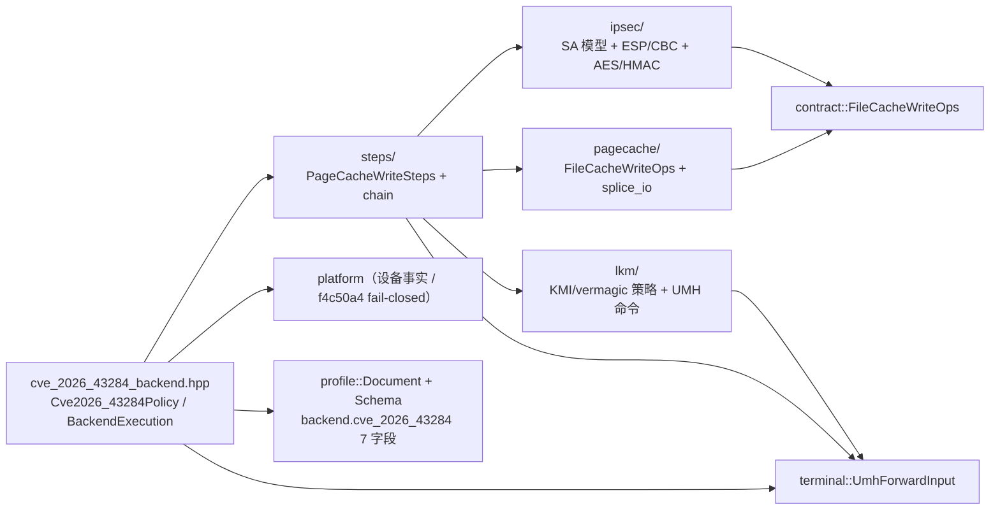
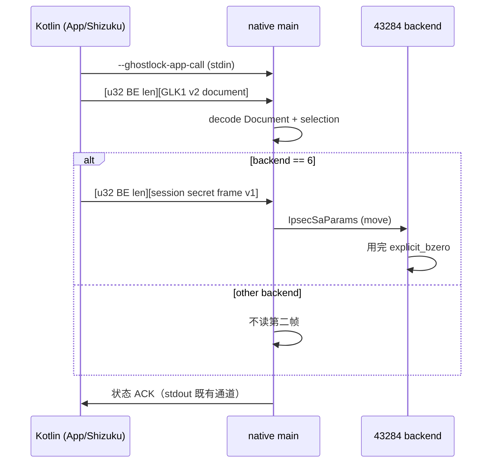

# CVE-2026-43284 vendored 源码改造计划（L 级）

> 类型：实现计划（docs/analysis/，L 级）。
> 主题：把 DirtyFrag-Android-Root-Jailbreak@de2ab7b 的上游源码逐文件改造进 GhostLock 的 43284 backend（B5），
> 冻结运行时参数通道与骨架，并给出分批门禁与不可验证项。
> 基线：vr-ko-bypass-dev / c8dddde。
> 上游事实与端到端链条以 [cve-2026-43284-b5-design.md](docs/analysis/cve-2026-43284-b5-design.md) 为准；
> 本文件只负责逐文件映射、批次、参数通道与骨架，不重复其链条论证。
> 状态：**计划（未实现、未真机、未标 supported）**。骨架头为本次新增，不含实现、不进构建。
> 关联：cve-2026-43284-backend-plan.md、cve-2026-43284-backend-assessment.md、
> terminal-steps-redesign.md（T5）、ADR-0004（R1/R18–R21）、offset-ssot-plan.md、adding-a-component.md。

## 1. 结论摘要

1. 上游 5 个项目、28 个文件全部是 C / AArch64 汇编 / Java，与项目 C++23、命名空间分层、
   `-fno-rtti`、静态 libc++、owner Schema 差异明显：**除 syscall 常量与密码学常量表外一律重写**；
   密码学与汇编常量表按“直接移植并保留署名”处理。
2. 目标目录唯一：`src/core/backend/cve_2026_43284/{ipsec,pagecache,lkm,steps}/`。内核模块保持
   **out-of-tree 外部资产**；`lkm/` 只放 host-safe 的 KMI/vermagic/选择/UMH 命令策略，不把内核 C 编进本仓。
3. 运行时参数通道（SPI/ports/32B+32B 密钥）推荐 **方案 B**：`--ghostlock-app-call` stdin 在 GLK1 帧之后
   追加一个独立、带版本与长度前缀的**会话秘密帧**，由 backend 在选中断言后读取；方案 A（把私有 opaque 帧
   并入 GLK1 文档流）保留为备选。二者都必须保证秘密不落盘、不进日志。
4. 骨架**仅头文件、零编译单元**；`src/Makefile` 的 `HDRS` 通配只覆盖到 3 层目录，本次骨架在 4 层，
   既不进 `CXX_SRCS` 也不改变 `HDRS`，构建行为不变。
5. `backend_available(Cve2026_43284)` 仍为 `false`；B5-1..B5-8 中 B5-4/B5-5/B5-6/B5-7 与 B5-9 存在
   “无 .ko / 无设备无法验证”项，逐项标注；未过真机不得标 supported。

## 2. 上游来源、commit 与授权

| 来源 | 用途 | commit | 授权 |
|---|---|---|---|
| ankitrawatgit/DirtyFrag-Android-Root-Jailbreak | 主线（IpSec + crash_dump + libc++ sentry + LKM/UMH） | `de2ab7b` | 仓库无 LICENSE（保留所有权利）；`include.inc` 为 Odzhan BSD-3 |
| diabl0w/DFRoot | LKM/UMH 上游（含 `soft_reboot`） | `3050d5b` | 仓库无 LICENSE；LKM 头声明 `MODULE_LICENSE("GPL")` |
| polygraphene/DFReroot | 最小 LKM（仅清 SELinux），`.ko` 与源一致 | `9edc769` | 仓库无 LICENSE |
| lsposed/lspromise | 页缓存写原语（`exp.c`/`stage1.S`/`splicehelper.c`），B 线 | `0258165` | 仓库无 LICENSE；`include.inc` 为 Odzhan BSD-3 |
| combeng6th/DirtyInit | 无特权 XFRM/IpSec 用户态思路 | `3409c35` | 仓库无 LICENSE |

署名/合规策略：

- 上游多无 LICENSE，“可供本地研究”不等于“可再分发”；迁移进 `src/` 的实现必须**独立重写**并在文件头
  注明来源仓 + commit + “ported/rewritten from”。
- `include.inc` 的 Odzhan BSD-3 头**必须原样保留**；LKM 为 GPL 派生，仅作为外部资产交付时遵守 GPL。
- 不把任何随仓库发布的预编译 `.ko` / `payload_*.bin` / shellcode blob 当作官方资产（b5-design §4.5/§7.1）。
- 对外分发前逐一取得授权或替换；文档与 UI 明示用户自负与合规边界。

## 3. 命名空间、目录与依赖边界

- 目标命名空间：`ghostlock::backend::cve_2026_43284`，子命名空间 `ipsec` / `pagecache` / `lkm` / `steps`。
- ADR-0004 R1：**backend 不得 include pipeline**。因此 `steps/`、`ipsec/`、`pagecache/`、`lkm/` 的
  头文件不得出现 `pipeline::`；`kind`/`StepSetKind` 的绑定只放在 `cve_2026_43284_backend.hpp`（backend
  允许 include pipeline）。
- backend 允许依赖：`contract`、`memory`、`session`、`platform`、`ancillary`、`terminal`、`profile`、`support`。
- `platform` 不得反依赖 backend（设备探测只返回事实，不 include 43284 头）。



## 4. 逐文件改造映射

### 4.1 `DirtyFrag-Android-Root-Jailbreak@de2ab7b lkm/`

| 上游文件 | 关键内容 | 目标（B5） | 本项目 idiom | 方式 | 授权/署名 | 需要的设备事实 |
|---|---|---|---|---|---|---|
| `lkm/ankit/Makefile` | `obj-m`、`-Os -fno-asynchronous-unwind-tables`、LLVM=1 | 不移植；外部 `.ko` 自建配方（本文 §7.4 记录） | 无（外部资产） | 不移植（参考） | GPL 模块 | KMI/vermagic/CFI |
| `lkm/ankit/build.sh` | DDK `ghcr.io/ylarod/ddk-min:<kmi>` 循环 8 KMI + objcopy 减体 | 不移植；产物源/命令/sha256 归档 | 无 | 不移植（参考） | GPL/第三方容器 | DDK 镜像、KMI |
| `lkm/ankit/dirtyfrag.c` | `kprobes_lookup`、`defex_pre_handler`、`selinux_state`、UMH setup/exec、`si->path` | `lkm/lkm_policy.hpp` + `lkm/lkm_image.hpp`（UMH/Defex 策略）；内核 C 保持 out-of-tree | `platform`（Defex/selinux 探测）、section 7 `late_load_args` / `defex_symbol` | 重写（策略）；内核 C 不移植 | `MODULE_LICENSE(GPL)`；迁移署名 | Defex 符号、`selinux_state`、UMH 拦截、`vendor_modprobe` |
| `lkm/dfroot/Makefile` | 同 ankit | 同上 | 无 | 不移植 | GPL | 同上 |
| `lkm/dfroot/build.sh` | DDK 循环 + objcopy | 文档化构建配方 | 无 | 不移植 | GPL/第三方容器 | 同上 |
| `lkm/dfroot/dirtyfrag.c` | `soft_reboot` 参数、ksud late-load 命令、`task_defex_enforce`/`task_defex_user_exec` hook、`si->path` | `lkm/lkm_image.hpp::build_late_load_command` + `lkm/lkm_policy.hpp`（`soft_reboot` 位） | section 7 `late_load_args`、`terminal::UmhForwardInput` | 重写（策略）；内核 C 不移植 | GPL | Defex 符号、`--soft-reboot` 语义、UMH 拦截 |
| `lkm/dfreroot/Makefile` | 同 | 同上 | 无 | 不移植 | 上游无 LICENSE | 同上 |
| `lkm/dfreroot/build.sh` | DDK 循环 | 文档化 | 无 | 不移植 | 上游无 LICENSE | 同上 |
| `lkm/dfreroot/dirtyfrag.c` | `sprint_symbol` 扫描 `kallsyms_lookup_name`、`selinux_state` 首字节 | `lkm/lkm_policy.hpp`（最小/回退 LKM 选择） | `platform`、`defex_symbol` = 关闭 | 重写 | 上游无 LICENSE | `sprint_symbol` 存在性、kallsyms 扫描窗口 |

### 4.2 `DirtyFrag-Android-Root-Jailbreak@de2ab7b usermode/ankit/`

| 上游文件 | 关键内容 | 目标（B5） | 本项目 idiom | 方式 | 授权/署名 | 需要的设备事实 |
|---|---|---|---|---|---|---|
| `usermode/ankit/exp.c`（894 行） | `configure_vendor_targets`/`valid_vendor_target`；`compute_iv`/`read_vendor_content`/`do_one_write_cbc`/`patch_file_cbc`；`select_ko_image`/`read_device_versions`/`read_custom_ko`/`patch_ko`/`patch_hook`/`restore_hook`/`fadvise_drop`/`createOrphanProcess`/`nativeRunAll` | 拆分：`ipsec/ipsec.hpp`、`pagecache/pagecache.hpp`、`pagecache/splice_io.hpp`、`steps/chain.hpp`、`steps/elf_hook.hpp`、`lkm/*.hpp` | `contract::FileCacheWriteOps`、`terminal::UmhForwardInput`、section 7 token、`platform` | 重写（拆分） | 上游无 LICENSE；迁移署名 | `crash_dump64`、vendor 载体 label/大小、libc++ sentry、insmod 域 |
| `usermode/ankit/aes256.h` | AES-256 ECB 单块解密 + key expansion | `ipsec/aes256.hpp` | host KAT（FIPS-197） | 重写（可移植） | 上游无 LICENSE；署名 | 无 |
| `usermode/ankit/hmac_sha256.h` | SHA-256 + HMAC，ICV 截断 128bit | `ipsec/hmac_sha256.hpp` | host KAT（RFC 2104/4231） | 重写（可移植） | 上游无 LICENSE；署名 | 无 |
| `usermode/ankit/libcxx.S` | sentry shellcode：uid0/tid1 过滤、`/dev/df` mutex、clone、`attr/exec`、`execve insmod` | `steps/shellcode/libcxx_shellcode.S`（参数化 ko/selinux 路径） | section 7 `selinux_exec_context`、`late_load_args` | 直接移植，但必须参数化 | 上游无 LICENSE；署名 | BTI/PAC、insmod 路径、`vendor_modprobe` |
| `usermode/ankit/elf_parser.c` | PT_LOAD `payload_target`、`.dynstr/.dynsym` 查找、PACIASP/BTI +4 | `steps/elf_hook.hpp` | host-safe ELF fixture | 重写 | 上游无 LICENSE | `.dynsym` 符号存在、指令序 |
| `usermode/ankit/include.inc` | AArch64 syscall/常量、`movl/movq/debug/create_mark` 宏 | `steps/shellcode/syscalls_aarch64.inc` | 无（汇编常量） | 直接移植 | Odzhan BSD-3，保留头 | 无 |
| `usermode/ankit/CMakeLists.txt` | `splicehelper` freestanding 编译、`exp` 库、`ko` 依赖 | 不移植；配方记入骨架 README | 无 | 不移植 | 上游无 LICENSE | 无 |
| `usermode/ankit/reporter.h` | JNI `Reporter` + `reportfmt` | 不移植；由 `support` 诊断替代 | `support` | 不移植 | 上游无 LICENSE | 无 |

### 4.3 `lspromise@0258165 usermode/`（B 线，仅参考）

| 上游文件 | 关键内容 | 目标（B5） | 本项目 idiom | 方式 | 授权/署名 | 需要的设备事实 |
|---|---|---|---|---|---|---|
| `usermode/lspromise/exp.c`（798 行） | NETLINK_XFRM `add_sa`/`del_sa`、ESN `seq_hi` 4B 写、`patch_libc`/`patch_cxx`/`patch_ko`、`createOrphanProcess` | 不移植（B 线需 system_server 前置）；XFRM 结构知识入 `ipsec` 注释 | 无 | 不移植（参考） | 上游无 LICENSE | `netlink_xfrm_socket` 权限（appdomain neverallow） |
| `usermode/lspromise/stage1.S` | stage1 切域 execve modprobe、stage2 `finit_module` + shelld | `steps/shellcode/` 第二变体（可选，后置） | section 7 `selinux_exec_context` | 参考/可选移植 | 上游无 LICENSE | 同 `libcxx.S` |
| `usermode/lspromise/splicehelper.c` | freestanding syscall，`splice` 16B 到 fd1 | `pagecache/splicehelper`（外部 asset） | 无 | 直接移植（重写构建） | 上游无 LICENSE | `crash_dump64`、`AT_FDCWD`、fd1 |
| `usermode/lspromise/elf_parser.c` | 与 ankit 重复 | `steps/elf_hook.hpp`（单一权威实现） | host fixture | 不移植（重复） | 上游无 LICENSE | 无 |
| `usermode/lspromise/shelld.c` | abstract socket fd-passing 服务/客户端 | 不移植；与 `umh_forward` 语义不同 | `terminal` | 不移植（参考） | 上游无 LICENSE | 无 |
| `usermode/lspromise/include.inc` | 与 ankit 同源 | 合并进 `steps/shellcode/syscalls_aarch64.inc` | 无 | 直接移植 | Odzhan BSD-3 | 无 |
| `usermode/lspromise/logging.h` | Android log 宏 | 不移植；由 `support` 日志替代 | `support` | 不移植 | 上游无 LICENSE | 无 |

### 4.4 `DirtyInit@3409c35 `

| 上游文件 | 关键内容 | 目标（B5） | 本项目 idiom | 方式 | 授权/署名 | 需要的设备事实 |
|---|---|---|---|---|---|---|
| `usermode/dirtyinit/dfi_exploit.c`（1412 行） | 无特权 XFRM/IpSec、软件 AES/HMAC、`compute_cbc_iv`/`verify_write`/`create_udp_socket`/`discover_payload_layout`/`parse_elf_find_logmessage`/`encode_arm64_b` | `ipsec`（兼容性/失败语义参考）+ `steps/elf_hook`（B 编码参考） | `platform`、`ipsec` | 参考/重写 | 上游无 LICENSE；署名 | libbase 符号、payload layout、`prevent`/verity |

注：DirtyInit 无 LKM；其 `payload_500.bin`/`payload_576.bin` 未 vendor 到本仓（b5-design §4.5），不纳入映射。

### 4.5 `DirtyFrag-Android-Root-Jailbreak@de2ab7b app-reference/`

| 上游文件 | 关键内容 | 目标（B5） | 本项目 idiom | 方式 | 授权/署名 | 需要的设备事实 |
|---|---|---|---|---|---|---|
| `app-reference/ExploitRunner.java` | `IpSecManager` 建 SA、`DEFAULT_VENDOR_TARGETS`、`nativeRunAll` 参数、`stageKsud` | Kotlin `app/.../data/**`（B7）+ 运行时通道 Kotlin 侧 | section 7 token、通道 B | 重写 | 上游无 LICENSE；署名 | IpSecManager（API 28+）、netns 一致 |
| `app-reference/MainActivity.java` | KMI/kernel 版本检测、自定义 `.ko` 校验（arm64 relocatable + 字符串）、选择 UI | Kotlin `app/.../ui/**`（B7）+ `platform` 设备事实 | `platform` | 重写 | 上游无 LICENSE | `uname -r` / KMI / `.ko` 头 |

### 4.6 来源记录 / 构建文件

| 上游文件 | 关键内容 | 目标（B5） | 本项目 idiom | 方式 | 授权/署名 | 需要的设备事实 |
|---|---|---|---|---|---|---|
| `DirtyFrag-Android-Root-Jailbreak@de2ab7b README.md` | 来源、commit、授权、映射表 | 本文档与第三方清单 | 无 | 保留（不移植） | 项目文档 | 无 |
| `lkm/*/Makefile`、`lkm/*/build.sh` | DDK/Kbuild 配方 | 本文 §7.4 记录为外部构建，不进 `src/Makefile` | 无 | 不移植 | 见上 | DDK 容器、KMI |

## 5. 本项目 idiom 对接

### 5.1 `profile::Document` / `Schema` 与 section 7

`backend.cve_2026_43284` 的 7 个字段已在 [schema.hpp](src/core/backend/cve_2026_43284/schema.hpp) 注册，
值为 u64/u16 策略 token（ADR-0003 决策 1，`profile::Document` 只搬运不解释）：

| 字段 | 类型 | B5 解析落点 | 与上游对应 |
|---|---|---|---|
| `carrier_path` | u64 token | `steps/chain.hpp` 载体候选表（默认 libbinderdebug / libstagefrighthw / libstagefright_aidl_bufferpool2 / libbsp_module） | `ExploitRunner.DEFAULT_VENDOR_TARGETS`、`configure_vendor_targets` |
| `lkm_path` | u64 token | `lkm/lkm_policy.hpp`（bundled KMI 表 / 自定义文件 / 交付策略） | `select_ko_image`/`read_custom_ko` |
| `kmi` | u16 | `lkm/lkm_policy.hpp` 与 `uname -r` 比对（fail-closed） | `read_device_versions`/`MainActivity` |
| `selinux_exec_context` | u64 token | `steps/shellcode` 目标上下文 | `libcxx.S`/`stage1.S` |
| `late_load_args` | u64 bitmask | `lkm/lkm_image.hpp::build_late_load_command` | DFRoot `dirtyfrag.c` |
| `defex_symbol` | u64 token | `lkm/lkm_policy.hpp` + `platform` 符号探测 | DFRoot/fork `dirtyfrag.c` |
| `steps` | u16 | 固定 `PageCacheWrite=3`，由 orchestrator/catalog 校验 | component_catalog |

解析规则：缺失/未知 token → **Reject**（R18，native 不设默认、不推导）；token 到字面路径/符号的映射表
由 43284 backend 私有持有，**不得**复用 43499 槽。字段缺口（hook 目标库+符号、vendor 候选多值、ICV 长度、
`--package-name` 字面串）仍按 b5-design §5.2 待定：优先新增 43284 section 数值 token，不 bump GLK1 v2 版本。

### 5.2 `contract::FileCacheWriteOps`

[capabilities.hpp](src/core/contract/capabilities.hpp) 已提供 `write16(ctx, offset, bytes16)`（句柄即可用性，
不设 flag）。`pagecache/` 是唯一实现者：它持有 `IpsecSaParams`、UDP 发送 socket、旧值读取与块序列；
`FileCacheWriteOps` 只暴露单块写，**读旧值、patch 链、hook 计算、触发、清理均属 backend 私有**，不进 capability。
43503 复用同一 capability，但 43284 不实现 43503。

### 5.3 `terminal::UmhForwardInput` / `umh_forward`

[terminal_input.hpp](src/core/terminal/terminal_input.hpp) 已声明 `UmhForwardInput{ TerminalInput + lkm_loaded }`。
43284 的终态正是它：B5 只负责在 LKM init 已执行后填 `lkm_loaded=true` 与 `root_program`（ksud / folkpatch /
自定义 + 参数）；`umh_forward` 的执行 policy 属 B6/T5，本计划不翻 `terminal_available`。43284 不绑 KernelSU。

### 5.4 `Cve2026_43284Policy` / `BackendExecution<B, Input>`

[cve_2026_43284_backend.hpp](src/core/backend/cve_2026_43284_backend.hpp) 目前只有 `kind` + `unavailable_reason`。
B5-7 把 [backend_contract.hpp](src/core/pipeline/backend_contract.hpp) 的 `BackendExecution<B, Input>` 用于
`Input = terminal::UmhForwardInput`（`BackendExecution` 已泛化到 `Input`，见 R10 延续）。43284 的 `run` 形如
`run(CoreSession&, const kernel_offsets& decoded, const char* debug_dir, bool force_attack, UmhForwardInput&)`；
`decoded` 对 43284 无 offset 语义（b5-design / A2-4 计划收敛），过渡期签名保持一致。`State` 走通用槽，
`sizeof` 必须 ≤ `kBackendStateBytes=2048`（密钥 64B + 路径/符号/选择）。

### 5.5 `platform`

[platform/runtime.hpp](src/core/platform/runtime.hpp) 目前只有 iomem 缓存与 SELinux/seccomp 探测。B5 需要的
设备/固件事实（**只返回事实、不 include backend**）：解析 `uname -r`；**是否已含修复 `f4c50a4`**（已打补丁 =
不适用，fail-closed）；`crash_dump64` 存在与 label；vendor 载体候选存在性；Defex 符号存在性；
`vendor_modprobe` 域可用性；以及 43284 与 vivo `vr.ko` 对策（VrGuard/VrTaskTag）的交互。物理落点按 ADR-0004 R5
分 `platform::abi`（数据/schema）与 `platform::runtime`（探测）；不在本批实现。

### 5.6 全局状态 / 热路径

43284 无竞态、无 route、无 KASLR；状态进入 `CoreSession` 的不透明 backend 槽，不新增可变全局
（仅 `g_exploit_session` 与只读 `g_direct_map_end`）。`bind<Schema>` 只在启动期；攻击期不经过 Schema/注册表。

## 6. 运行时参数通道（A / B，待用户拍板）

### 6.1 现状与缺口

GLK1 v2 每个 entry 是单个 u64（[binary.h](src/core/profile/binary.h)、[document.hpp](src/core/profile/document.hpp)）；
入口 `--ghostlock-app-call` 经 [entry.h](src/core/profile/entry.h) 的 `read_glk1_frame_stdin` 读一个
长度前缀帧，读完 stdin 仍留给状态 ACK。而 `IpSecManager` 运行时产出的 **SPI、encap port、sender port、
32B AES 密钥、32B HMAC 密钥** 无法放进 u64 槽。B5 必须先冻结这一通道。

### 6.2 方案 A（备选）：GLK1 文档流内的私有 opaque 帧

在 GLK1 帧之后、由 profile 解码路径再读一个 backend 私有帧，并把它当作文档流的一部分。

- 优点：与 profile 帧紧邻，单点实现。
- 缺点：**把容器/解码路径与具体 backend 绑定**，`profile::Document` 的中性被破坏；`steps`/密钥与
  profile 序列化路径相邻，存在被写入 Download 侧车（`profile.conf`/`profile.bin`）或 golden 字节的风险；
  与 offset-ssot 的“容器只 framing”目标冲突。

### 6.3 方案 B（推荐）：`--ghostlock-app-call` stdin 第二段长度前缀会话帧

在 `read_glk1_frame_stdin` 完成、selection 解码并断言 `backend_id == kBackendCve202643284`（6）之后，
由 orchestration/backend 从**同一 stdin** 再读一个独立的、**自带版本与尾标记**的长度前缀帧；
profile 层完全不认识它。

- 优点：GLK1 v2 容器、`Document`、golden sha256、manifest 全部不动；秘密与会话绑定、与 profile 字节流解耦，
  不经过任何序列化路径；协议可单独做 host 往返与 Kotlin 对拍；非 43284 backend 不消费第二帧，行为不变。
- 缺点：新增一条 stdin 协议契约，`--ghostlock-app-call` 的语义从“GLK1”变为“GLK1 + 可选会话帧”，需双侧同步与文档更新。



### 6.4 会话帧格式（方案 B，待冻结）

```text
u32 be payload_len            // 帧长（不含本字段）
payload:
  u8  version = 1
  u8  kind    = 1            // 1 = IPSEC_SA
  u16 reserved = 0
  u32 spi
  u16 encap_port
  u16 sender_port
  u8  icv_len  = 16
  u8  reserved2[3]
  u8  aes_key[32]
  u8  hmac_key[32]
  u32 trailer = 0x34383238   // 尾标记，校验截断/错位
```

payload 固定 84 字节（含尾标记），`payload_len` 上限设小（例如 4096）以拒绝畸形帧。
校验：`version/kind/trailer/len` 任一不符 → **Reject**（fail-closed），已读字节 `explicit_bzero`。
帧读完即把 `IpsecSaParams` move 进 backend 状态，发送 socket 关闭后再次 `zeroize`。

### 6.5 密钥不落盘的论证

- 密钥只存在于：Kotlin 内存 → stdin 管道 → native 栈/状态 → `explicit_bzero`。
- 不进入 `profile::Document`、`profile.conf`/`profile.bin`、Download 侧车、manifest、日志或进程 argv；
  Kotlin 侧参数经 stdin 写，不经 `ProcessBuilder` 命令行。
- 日志只记录 spi/ports 的**存在性与长度**，不记录密钥字节；错误路径同样不打印。
- 与 b5-design §5.5 的安全约束一致；`IpsecSaParams` 定义 `zeroize` 供状态析构调用。

### 6.6 进程 / 网络命名空间前提

建 SA 的进程与 native 发送进程必须共享 netns，且 native 能绑定 `senderPort`。启动路径二选一并在 B5-1
固定：Shizuku UserService（shell uid）侧建 SA；或 App 侧建 SA 且 native 从 App 派生。两条路径下
`native` 都只接收 SA 参数，不自己建 SA（native 自建需 `netlink_xfrm_socket`，appdomain neverallow，不可行）。

### 6.7 对拍与失败语义

- host：构造 84 字节帧的编解码往返 + 截断/超长/错尾标记/错版本拒绝测试（B5-1）。
- Kotlin：`SessionSecretFrameTest` 产出字节与 native fixture 逐字节一致（B5-1）。
- 缺失/畸形帧且 backend==6 → `Rejected`，不退化、不自动降级。

## 7. 分批 B5-1..n 与门禁

### 7.1 批次表

| 批次 | 内容 | host | NDK | lint | cmp_disasm | 真机 | 无 .ko/设备可否验证 |
|---|---|---|---|---|---|---|---|
| **B5-0**（本批） | 本计划 + 骨架头（不进构建） | 静态检查（头 -fsyntax-only） | — | — | — | — | 可（纯静态） |
| **B5-1** | 方案 B 会话帧 + Kotlin 对拍 + section 7 token→值 + State 布局（≤2048） | 帧往返/拒绝 | ✓ | ✓ | — | — | 可 |
| **B5-2** | `ipsec/`：SA 模型、ESP/ICV、CBC IV、AES-ECB-dec；KAT | FIPS-197 / RFC 2104 向量 + IV 恒等式 | ✓ | ✓ | — | — | 可 |
| **B5-3** | `pagecache/`：`write16`/块序列 + 可注入 `splice_io`；实现 `FileCacheWriteOps` | fake pipe/splice 边界 | ✓ | ✓ | — | — | 部分（真页缓存行为需设备） |
| **B5-4** | `lkm/`：KMI/vermagic fail-closed、`.ko` 选择/交付、UMH 命令构造 | 结构/错误路径 | ✓ | ✓ | — | — | **否（.ko + 设备）** |
| **B5-5** | `steps/` ELF+Hook：`.dynsym` 定位、trampoline/BTI/PAC、shellcode 参数化 | 样本 `.so` fixture 分支编码 | ✓ | ✓ | — | — | 部分（真 hook 需设备 + 目标 so） |
| **B5-6** | `steps/` chain：crash_dump 桥、vendor 载体回退、patch 校验、trigger、清理 | 结构/错误路径 | ✓ | ✓ | — | — | **否（设备）** |
| **B5-7** | `backend_terminal` + `platform`：`BackendExecution<B,Input>`、`UmhForwardInput` 填充、设备事实探测 | 契约 + fake platform | ✓ | ✓ | — | — | 部分（真探测需设备） |
| **B5-8** | 组合：catalog/orchestrator/pipeline + `umh_forward`（B6/T5）+ 43499 回归 | 全量 + 三元组 | ✓ | ✓ | **43499 八函数不变** | 43284 组合需资产 | 部分 |
| **B5-9** | 真机门禁：逐 KMI 一套 + `.ko` 审计记录 + device-gates 归档 | — | — | — | 43499 回归 | **是（必须）** | **否（.ko + 设备 + ksud）** |

批次规则：上一批 host/NDK/lint 全绿再进下一批；同一批连续失败 2 次即停下 debug（AGENTS）；
43284 是独立新代码，**不得改 43499 的 8 个攻击函数**，B5-8 只做回归核对。

### 7.2 门禁矩阵（适用项）

| 批次 | host | NDK | lint | cmp_disasm | 真机 |
|---|---|---|---|---|---|
| B5-0 | 头文件 `-fsyntax-only` | — | — | — | — |
| B5-1 | 协议往返 + 拒绝 | ✓ | ✓ | — | — |
| B5-2 | KAT + IV 恒等式 | ✓ | ✓ | — | — |
| B5-3 | fake splice 边界 | ✓ | ✓ | — | — |
| B5-4 | 结构/错误路径 | ✓ | ✓ | — | — |
| B5-5 | fixture 分支编码 | ✓ | ✓ | — | — |
| B5-6 | 结构/错误路径 | ✓ | ✓ | — | 43284 首次 |
| B5-7 | 契约 | ✓ | ✓ | — | 43284 |
| B5-8 | 全量 + catalog | ✓ | ✓ | 43499 8 函数 | 43499 回归 + 43284 |
| B5-9 | — | — | — | — | 逐 KMI |

### 7.3 无 .ko / 设备 / 目标 so 无法验证的步骤（必须显式标注）

1. 目标页是否真的被 splice 共享并在 ESP 解密中就地写（B5-3/B5-6，只能设备验）。
2. `crash_dump64` patch #1 是否可执行、`crash_dump` 域能否打开 `vendor_file`（B5-5/B5-6）。
3. libc++/libbase hook 是否被 init 实际调用（offset/loader/指令序）（B5-5）。
4. `insmod`/`finit_module` 是否被目标内核接受（签名/vermagic/modversions/CFI）（B5-4/B5-9）。
5. Defex 符号是否存在、kprobe 是否成功、`selinux_state` 覆盖是否生效（B5-4/B5-7）。
6. `struct subprocess_info->path` 偏移是否正确、UMH 是否被 `CONFIG_STATIC_USERMODEHELPER`/厂商策略拦截（B5-4/B5-9）。
7. ksud late-load 参数是否与目标 KernelSU 版本兼容、KernelSU 是否真正就绪（B5-9）。
8. vendor 载体路径与该设备分区布局、label（B5-6）。
9. 与 vivo `vr.ko` 对策的交互（B5-7/B5-9）。
10. panic/启动循环边界（错误 hook 的真实后果）（B5-9）。

### 7.4 每批命令（适用项）与外部 `.ko` 构建

```sh
make -C src native-host-tests        # host
make -C src ghostlock                # NDK（ANDROID_NDK_HOME 或 local.properties）
make -C src lint-tidy                # clang-tidy 0 findings
python3 tools/cmp_disasm.py <baseline> build/native/ghostlock   # 仅 B5-8/B5-9
./gradlew :profile-core:test :app:testDebugUnitTest            # B5-1 起 Kotlin 批
```

外部 `.ko`（不集成进本仓构建，B5-4/B5-9 使用）：以 DirtyFrag-Android-Root 或 DFRoot 的 `dirtyfrag-lkm/`
`dirtyfrag.c` + `Makefile` + `build.sh` 为源，用 `ghcr.io/ylarod/ddk-min:<kmi>` 逐 KMI 重建并审计；
归档源码 commit、DDK tag、构建命令、产物 sha256 与 `.modinfo`。**不使用**随仓库发布的预编译 `.ko`。

## 8. 骨架清单与构建不变性

### 8.1 本次新增（仅头文件 / 文档，无实现、无编译单元）

| 文件 | 内容 |
|---|---|
| `src/core/backend/cve_2026_43284/README.md` | 骨架说明、非目标、来源与署名 |
| `src/core/backend/cve_2026_43284/ipsec/ipsec.hpp` | `IpsecSaParams`、ESP 尺寸常量、`compute_cbc_iv`、`zeroize` 声明 |
| `src/core/backend/cve_2026_43284/ipsec/aes256.hpp` | AES-256 ECB 单块解密声明 |
| `src/core/backend/cve_2026_43284/ipsec/hmac_sha256.hpp` | HMAC-SHA256 声明 |
| `src/core/backend/cve_2026_43284/pagecache/pagecache.hpp` | `FileCacheWriteOps` 适配器与块读写声明 |
| `src/core/backend/cve_2026_43284/pagecache/splice_io.hpp` | 可注入 syscall 抽象声明（host 可 fake） |
| `src/core/backend/cve_2026_43284/lkm/lkm_policy.hpp` | KMI/vermagic/来源选择（fail-closed）声明 |
| `src/core/backend/cve_2026_43284/lkm/lkm_image.hpp` | `.ko` 事实与 UMH late-load 命令构造声明 |
| `src/core/backend/cve_2026_43284/steps/steps.hpp` | `PageCacheWriteSteps` 空壳（不含 pipeline 依赖） |
| `src/core/backend/cve_2026_43284/steps/elf_hook.hpp` | `HookTarget` 与 `.dynsym` 定位声明 |
| `src/core/backend/cve_2026_43284/steps/shellcode.hpp` | shellcode/trampoline 模型声明 |
| `src/core/backend/cve_2026_43284/steps/chain.hpp` | crash_dump 桥、载体回退、trigger、清理声明 |

### 8.2 为什么构建行为不变

- **不加入 `CXX_SRCS`**：无 `.cpp` 编译单元，`ghostlock`/host 测试的源列表不变。
- **不进 `HDRS`**：`src/Makefile` 的 `HDRS := $(wildcard core/*.h core/*.hpp core/*/*.h core/*/*.hpp
  core/*/*/*.h core/*/*/*.hpp)` 只覆盖到 3 层；新骨架位于 `core/backend/cve_2026_43284/<sub>/`（4 层），
  不匹配任何模式，既不新增依赖也不触发重建。
- **不翻可用性**：`component_catalog::backend_available(Cve2026_43284)` 仍为 `false`；
  `cve_2026_43284_backend.hpp` 的 `static_assert(!backend_available(...))` 保持成立；不碰 catalog/orchestrator。
- **不改 43499**：未触碰任何 43499 文件；`cmp_disasm` 不受影响。

### 8.3 本批验证命令与基线结果

```sh
# 1) 基线：改动前 host 全绿
make -C src native-host-tests        # exit 0（记录见下）
# 2) 骨架头静态编译检查（不进构建，仅 -fsyntax-only，覆盖 -Wall -Wextra -Wconversion -Wsign-conversion）
for h in src/core/backend/cve_2026_43284/*/*.hpp; do \
  c++ -std=c++23 -fno-rtti -Wall -Wextra -Wconversion -Wsign-conversion \
    -I src/core -fsyntax-only -x c++ "$h" || exit 1; \
done
# 3) 再跑 host 证明构建行为不变
make -C src native-host-tests        # exit 0
```

实测（本批，2026-10-03，macOS host）：

- `make -C src native-host-tests` **exit 0**；日志末行 `backend_dataflow_test: ok`，
  且 `cve_2026_43284_schema_test: ok (7 fields)`、`profile_manifest_test: ok (101 fields)`。
- 骨架头全部通过 `-fsyntax-only` 零告警；`git diff` 为空（无被跟踪文件改动，`profile-manifest.tsv` 未漂移），新文件均为 untracked。

## 9. 不变量、非目标与风险

**不变量**：GLK1 v2 容器与 `kVersion=2`；`kernel_offsets`/`TargetProfile` 布局；43499 八函数与 W1/W2/W3 顺序；
`backend.cve_2026_43284` 与 43499 的 wire 槽互不复用；profile 唯一配置权威；单可变全局约束。

**非目标**：本文件不实现代码（骨架头除外）、不做真机、不评估 43284 可利用性上限、不引入预编译 `.ko`、
不实现 43503、不翻 `terminal_available(UmhForward)`。

**风险**：

- `.ko` 可加载性/可审计性（vermagic、modversions、CFI、`struct subprocess_info` 偏移）依赖目标设备；
- per-device hook（crash_dump64、vendor 载体、libc++ 符号/指令序、Defex）不可复现；
- 方案 B 是新增 stdin 协议，需 Kotlin↔native 同步，否则 43284 永远因缺帧被 Reject；
- 与 vivo `vr.ko` 的交互、UMH 拦截、panic 边界未验证；
- 上游授权不明确，迁移实现必须独立重写并署名，分发前需授权。

## 10. 需要用户提供的外部资产 / 决策

1. **通道决策**：确认采用方案 B（推荐）还是方案 A。
2. **目标设备**（≥1 台，冷机可复现；最好再覆盖一台 5.15 以外的 KMI）。
3. **与设备 KMI 匹配的 `dirtyfrag.ko`**：优先用上游源 + DDK 自建，提供源码 commit / KMI / DDK tag /
   构建命令 / sha256 / `.modinfo`。
4. **ksud**（与目标 KernelSU/ReSukiSU 匹配的 arm64 二进制或指定 fork 源）。
5. **目标 so 样本**：`libc++.so` / `libc.so` / `libbase.so`（host fixture 与符号核对）。
6. **设备事实包**：`uname -r`、`/proc/version`、KMI、`/sys/fs/selinux/enforce`、`crash_dump64` 的
   `ls -lZ` 与 verity 状态、`/vendor/lib64` 候选与 label、kallsyms 中 `selinux_state`/Defex 符号存在性。
7. **授权确认**：确认在自有/获授权设备测试，并接受 b5-design §7.2 合规约束。
8. **（可选）符号 offset 表**或目标设备反汇编片段，用于 host fixture 校准。

## 11. 来源

- 本仓：cve-2026-43284-b5-design.md、cve-2026-43284-backend-plan.md、cve-2026-43284-backend-assessment.md、
  terminal-steps-redesign.md、offset-ssot-plan.md、branch-plan.md、architecture-findings-register.md、
  docs/analysis/adr/0004-framework-convergence.md、docs/development/adding-a-component.md、
  DirtyFrag-Android-Root-Jailbreak@de2ab7b README.md。
- 代码：src/core/{contract/capabilities.hpp,pipeline/backend_contract.hpp,pipeline/component_catalog.hpp,
  profile/{document.hpp,schema.hpp,binary.h,entry.h},terminal/terminal_input.hpp,
  backend/cve_2026_43284/{schema.hpp,state.hpp},backend/cve_2026_43284_backend.hpp}。
- 上游：ankitrawatgit/DirtyFrag-Android-Root-Jailbreak、diabl0w/DFRoot、polygraphene/DFReroot、
  lsposed/lspromise、combeng6th/DirtyInit（commit 见 §2）。

