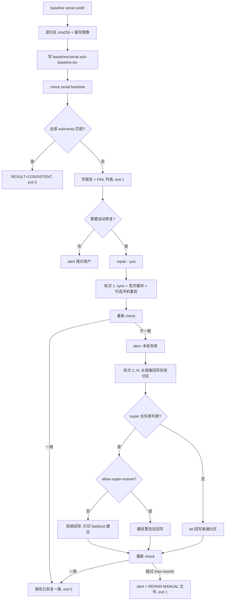
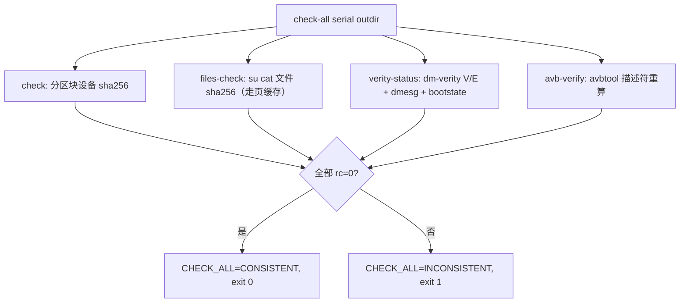

# AVB Guard 工作流：基线 / 一致性检查 / 告警 / 自动修复

> **备份目录必须放在仓库外**：默认 `<repo>/../ghostlock-device-backup`（可用 `GHOSTLOCK_BACKUP_DIR` 覆盖）。
> **不要放 `build/`**——`gradle clean`/构建清理会删掉它（本工作流初版曾放 `build/device-backup`，已迁出）。

## 实测记录（2026-10-04，A301SO）

- 完整基线 26 项（`super` + 物理 AVB + 7 个只读 verity 视图）已落盘并可提交（`tools/device-guard/baselines/QV770MFGJ1-avb-baseline.tsv`）；
- 冷机重启后完整 `check`：`super`、`misc`、全部物理分区、`system-verity`、`system_ext-verity`、`product-verity` 全部 **[ok]**；`metadata` **[var]**（可写状态分区，预期可变）；
- **中途 USB 拔线**导致最后 4 项（`vendor-verity`/`odm-verity`/`system_dlkm-verity`/`vendor_dlkm-verity`）出现 1 个假 `FAIL` + 3 个 `ERR`；改用无线 adb 重跑这 4 项全部 **[ok]**。
- **结论：26/26 一致（`metadata` 除外，属预期）**；拔线是唯一原因，非持久性损坏。

状态：已实现并实测（2026-10-04，A301SO QV770MFGJ1，Android 15，slot _a）。
脚本：`tools/device-guard/avb_guard.sh`。相关门禁：`B5-9-guard-20261003-partition-backup-verify-pass.md`。

补充（2026-10-04 文件级守卫 + AVB 描述符校验，同一设备）：

- `files-baseline --vendor-scan --vendor-glob 'libCB*.so'` 真机跑通：`crash_dump64`（482904B）、
  `libc++.so`（1083168B）、`libbinderdebug.so`、`libstagefrighthw.so`、`libCB.so` 共 5 项 **[ok]**；
  上游另外 2 个缺省载体在该机不存在，记 `[absent]`（不误判）。基线落 `baselines/QV770MFGJ1-files-baseline.tsv`。
- `files-check` 真机重算：5 `[ok]` + 2 `[absent]`，`RESULT=CONSISTENT`，exit 0。
- `verity-status`：本机无 `dmsetup`，回退 `dmctl`；34 个 dm-verity 设备全部 `V`（`state_V=34 state_E=0`），
  `dmesg | grep -i verity` 无错误行，`ro.boot.verifiedbootstate=green`，`RESULT=OK`。
- `avb-verify --slot _a`（对仓库外 `../ghostlock-device-backup/QV770MFGJ1-20261003` 的 4 个 vbmeta 镜像）：
  18 个 hash/hashtree 描述符中 11 `[ok]`、7 `[skip]`（非活动槽 `_b` 的 hashtree 无对应镜像）、0 `fail`，`RESULT=OK`。
- `check-all`（用 `SKIP_ENTRIES` 跳过 `super` 与 7 个 verity 视图避免重复 22GB）：分区 `check` rc=0、
  `files-check` rc=0、`verity-status` rc=0、`avb-verify` rc=0，汇总 `CHECK_ALL=CONSISTENT`。

## 1. 目的

在对 `/system`、`/vendor`、`/apex` 等做页缓存写（CVE-2026-43284 写原语）前后，需要一个可信的安全网：

1. baseline：把 AVB 验证内容的 sha256 清单落盘到可提交位置，并保留分区镜像；
2. check：逐分区重算并对比，输出 [ok]/[FAIL]/[ERR] 报告，不一致时退出码非零；
3. alert：通过 macOS 通知 / 阻塞对话框 / 语音 + 告警文件提示用户；
4. repair：反复修复直到 hash 一致（默认最多 3 轮），失败则明确要求人工介入；
5. files-baseline / files-check：对 exploit 可能触碰的**文件**读页缓存算 sha256，
   捕获分区哈希看不见的页缓存 patch（见 §13）；
6. verity-status：记录 dm-verity 运行时 V/E、dmesg 与 verified boot 状态，出现 E/错误即告警并非零退出（见 §15）；
7. avb-verify：用 vendored avbtool 对留存的 vbmeta 镜像重算 hash/hashtree 描述符摘要（无密钥）（见 §14）；
8. check-all：测试前后各跑一次，串起分区 check + files-check + verity-status + avb-verify（见 §15）。

`check` / `files-check` / `verity-status` / `avb-verify` 全程只读；一切破坏性写入都需要显式 `--yes`。

## 2. 文件与职责

| 路径 | 作用 | 是否入库 |
|---|---|---|
| `tools/device-guard/avb_guard.sh` | 主脚本（baseline/check/alert/repair/files-baseline/files-check/verity-status/avb-verify/check-all） | 是 |
| `tools/device-guard/avb_verify_descriptors.py` | AVB hash/hashtree 描述符重算校验（无密钥） | 是 |
| `tools/device-guard/third_party/avbtool/avbtool` | vendored AOSP `avbtool.py`（单文件，MIT） | 是 |
| `tools/device-guard/third_party/avbtool/README.md` | avbtool 来源/修订/sha256/许可 | 是 |
| `tools/device-guard/baselines/<serial>-avb-baseline.tsv` | 可提交的分区 sha256 基线清单 | 是 |
| `tools/device-guard/baselines/<serial>-files-baseline.tsv` | 可提交的文件级（页缓存）sha256 基线清单 | 是 |
| `build/device-backup/<serial>-<date>/` | 分区镜像留存（`<name>.img`） | 否（build 已忽略） |
| `build/device-backup/avb-guard-reports/` | check / repair 报告 | 否 |
| `build/device-backup/avb-guard-alerts/` | `ALERT-<ts>.txt` + `alerts.log` | 否 |
| `build/device-backup/avb-guard.log` | 追加式操作日志 | 否 |

## 3. 覆盖范围

- 物理 AVB 分区（avb）：`super`、`vbmeta_a/b`、`vbmeta_system_a/b`、`boot_a/b`、`init_boot_a/b`、`dtbo_a/b`、`vendor_boot_a/b`、`recovery_a/b`、`vm-bootsys_a/b`；
- 只读 verity 视图（verity）：`system-verity`、`system_ext-verity`、`product-verity`、`vendor-verity`、`odm-verity`、`system_dlkm-verity`、`vendor_dlkm-verity`；
- 预期可变的状态分区（state）：`metadata`、`misc`。

设备节点自动解析：优先 `/dev/block/by-name/<name>`，否则 `/dev/block/mapper/<name>`。读块设备需要 `su`（KernelSU）。

文件级覆盖（`files-baseline`/`files-check`，见 §13）：`/apex/com.android.runtime/bin/crash_dump64`、
`/system/lib64/libc++.so`、上游 4 个默认 vendor 载体，以及 `--vendor-scan`/`--extra` 追加的设备实际载体。
运行时健康覆盖（`verity-status`，见 §15）：所有 dm-verity 设备（`*-verity` 与 `com.android.*` APEX
verity 设备）的 V/E、`dmesg` verity 行、`ro.boot.verifiedbootstate`。

## 4. 流程图



`metadata` 永远不进入回写路径。

## 5. 命令

```sh
G=tools/device-guard/avb_guard.sh

# 1) 建立基线（默认写 tools/device-guard/baselines/<serial>-avb-baseline.tsv，
#    镜像写到 outdir；用 SKIP_ENTRIES 或 --skip 避免重复 22GB 全量）
export SKIP_ENTRIES="super system-verity system_ext-verity product-verity vendor-verity odm-verity system_dlkm-verity vendor_dlkm-verity"
bash $G baseline QV770MFGJ1 build/device-backup/QV770MFGJ1-20261004

# 2) 只读一致性检查（默认 check 只读；报告写到 build/device-backup/avb-guard-reports/）
bash $G check QV770MFGJ1 tools/device-guard/baselines/QV770MFGJ1-avb-baseline.tsv

# 3) 告警
bash $G alert "检测到 vbmeta_a 与基线不一致" --outdir build/device-backup/avb-guard-alerts

# 4) 修复循环（破坏性，必须 --yes；上限默认 3 轮）
bash $G repair QV770MFGJ1 build/device-backup/repair-run tools/device-guard/baselines/QV770MFGJ1-avb-baseline.tsv --yes --max-rounds 3

# 5) 文件级（页缓存）基线 / 检查：能看见分区 check 看不见的页缓存 patch
bash $G files-baseline QV770MFGJ1 build/device-backup/QV770MFGJ1-files --vendor-scan --vendor-glob 'libCB*.so'
bash $G files-check    QV770MFGJ1 tools/device-guard/baselines/QV770MFGJ1-files-baseline.tsv

# 6) dm-verity 运行时健康（本机无 dmsetup 时自动回退 dmctl）；E/错误 => 非零 + 告警
bash $G verity-status QV770MFGJ1 --report build/device-backup/verity-status.log

# 7) 离线 AVB 描述符校验（用 vendored avbtool 重算 hash / hashtree 摘要；--verify 再加签名路径）
bash $G avb-verify /path/to/retained-images --slot _a --verify

# 8) 一次串起：分区 check + files check + verity-status + avb-verify
SKIP_ENTRIES="super system-verity system_ext-verity product-verity vendor-verity odm-verity system_dlkm-verity vendor_dlkm-verity" \
  bash $G check-all QV770MFGJ1 build/device-backup/QV770MFGJ1-files --image-dir /path/to/retained-images --slot _a

# 无设备时验证比较逻辑（对本地镜像/本地文件镜像）
bash $G baseline LOCAL /tmp/avb --dry-run --image-dir /tmp/avb-images
bash $G check LOCAL /tmp/avb/LOCAL-avb-baseline.tsv --dry-run --image-dir /tmp/avb-images
bash $G files-baseline LOCAL /tmp/avb --dry-run --local-root /tmp/root-mirror --baseline-out /tmp/files.tsv
bash $G files-check LOCAL /tmp/files.tsv --dry-run --local-root /tmp/root-mirror
```

### 参数

| 子命令 | 位置参数 | 可选参数 |
|---|---|---|
| `baseline` | `<serial> <outdir>` | `--baseline-out`、`--image-dir`、`--skip`、`--avbtool`、`--dry-run` |
| `check` | `<serial> <baseline.tsv>` | `--dry-run`、`--image-dir`、`--report`、`--fail-list`、`--skip` |
| `alert` | `<message>` | `--outdir`、`--no-notify`、`--no-dialog`、`--no-say`、`--force-dialog`、`--require-delivery` |
| `repair` | `<serial> <outdir> <baseline.tsv>` | `--yes`、`--allow-super-restore`、`--max-rounds N`、`--cold-reboot`、`--dry-run`、`--image-dir`、`--skip` |
| `files-baseline` | `<serial> <outdir>` | `--baseline-out`、`--extra PATH`（可重复）、`--vendor-scan`、`--vendor-glob PAT`、`--vendor-max N`、`--report`、`--dry-run --local-root DIR` |
| `files-check` | `<serial> <files-baseline.tsv>` | `--report`、`--fail-list`、`--strict-errors`、`--dry-run --local-root DIR` |
| `verity-status` | `<serial>` | `--report`、`--outdir`、`--no-alert`、`--dry-run` |
| `avb-verify` | `<outdir>` | `--slot SLOT`、`--report`、`--verify` |
| `check-all` | `<serial> <outdir>` | `--partition-baseline`、`--files-baseline`、`--image-dir`、`--report`、`--slot`、`--local-root`、`--dry-run`、`--skip-partition`、`--skip-files`、`--skip-verity`、`--skip-avb` |

`repair` 的 `--report` 仅作兼容，实际每轮报告为 `<outdir>/repair-round<N>-<ts>.log`。

## 6. baseline TSV 格式

```
# ghostlock avb_guard baseline v1 (TSV, columns below)
# serial=QV770MFGJ1
# date=2026-10-04T01:03:58Z
# image_dir=build/device-backup/QV770MFGJ1-avbtest
# columns=name<TAB>class<TAB>size<TAB>sha256<TAB>source
# device=A301SO
# release=15
# fingerprint=Sony/A301SO/...
# verifiedbootstate=green
# vbmeta_device_state=locked
# slot=_a
# avb_version=1.2
# avbtool=absent (not used)
vbmeta_a	avb	65536	ea7e866b...	device:QV770MFGJ1:/dev/block/by-name/vbmeta_a
metadata	state	67108864	0a46eb5d...	device:QV770MFGJ1:/dev/block/by-name/metadata
```

以 `#` 开头的行为注释/来源设备属性；数据行按 `<TAB>` 分列。`class` 取值为 `avb` / `verity` / `state`；`size` 与 `sha256` 来自实际镜像。

## 7. 判定标准

| 标记 | 含义 | 影响退出码 |
|---|---|---|
| `[ok]` | hash 与基线一致 | 否 |
| `[FAIL]` | avb/verity 分区 hash 不一致 | 是（非零） |
| `[ERR]` | 无法读取（无 root/节点缺失/空流）或本地镜像缺失 | 是（非零） |
| `[var]` | state 分区（metadata/misc）变化，预期可变 | 否 |
| `[skip]` | 被 `--skip` / `SKIP_ENTRIES` 排除 | 否 |

退出码：`0` 一致；`1` 不一致或不可恢复错误或修复耗尽；`2` 用法错误；`3` `alert --require-delivery` 未送达交互通道。

报告尾部给出 `# summary total=... ok=... fail=... err=... expected_variable=...` 与 `# RESULT=CONSISTENT|INCONSISTENT`；`check` 并写出 `<report>.fail` 列表供 repair 使用。

## 8. 告警方式

`alert` 同时执行：

1. macOS 通知：`osascript -e 'display notification ...'`（非阻塞）；
2. 阻塞对话框：`display dialog ... buttons {"已了解"} default button 1`——仅在交互终端或显式 `--force-dialog` 时弹出，避免 CI/无头环境卡死；
3. 语音：`say "GhostLock AVB guard alert. ..."`——同样限交互（或 `--force-dialog`）；
4. 写 `<outdir>/ALERT-<ts>.txt` 并追加 `alerts.log`，同时输出 `ALERT_FILE=...` 与 `AVB_ALERT status=written ...`。

非交互环境（stdin/stdout 非 TTY）下保证：文件一定写出、退出码可发现。上层修复循环对每轮失败都调用 `alert`；`--require-delivery` 时若无交互通道送达则返回 3。

## 9. 修复回退顺序

`repair` 最多 `--max-rounds`（默认 3）轮，每轮都重新 check：

1. 第 1 轮（不写分区）：`sync` -> 丢弃页缓存（默认 `echo 3 > /proc/sys/vm/drop_caches`，可用 `AVB_FADVISE_CMD` 指定针对目标文件的 `fadvise DONTNEED`）-> 可选 `--cold-reboot`。页缓存型改动（B5-9d 原语）重启即恢复，因此第 1 轮通常即可修好。
2. 第 2 轮起：按上一轮 `.fail` 列表用备份镜像 `su dd` 回写：
   - 普通分区直接回写；
   - `super` 回写必须显式 `--allow-super-restore`，否则拒绝并打印醒目警告与 fastboot 建议；
   - `metadata` 永不回写（即使出现在失败列表也会被跳过）；
   - 备份镜像缺失记 `[ERR]`。
3. 每轮失败：调用 `alert`。
4. 成功：输出 `REPAIR_RESULT=CONSISTENT rounds=N` 与最终 check 报告，`exit 0`。
5. 耗尽：`alert` + 写 `<outdir>/REPAIR-MANUAL-<ts>.txt`，输出 `REPAIR_RESULT=MANUAL_INTERVENTION`，`exit 1`，并保留全部轮次报告作为证据。

## 10. 运行中回写 super 的风险与处置

`super`（14.5GB）承载 dm-linear 映射的 system/vendor/product/system_ext/odm/dlkm 等逻辑分区。在系统运行中直接 `dd` 回写 `super` 风险极高：已挂载逻辑分区的元数据/页与块设备内容会瞬间不一致，可能导致进程崩溃、文件系统损坏，甚至无法开机。

处置原则：

- 脚本把 `super` 单独门控，默认拒绝；只有 `--allow-super-restore` 才写，且写入前打印大字警告；
- 优先 fastboot 路径（脚本在警告中给出）：

  ```sh
  adb reboot bootloader
  fastboot flash super build/device-backup/<serial>-<date>/super.img
  fastboot reboot
  ```

- 若必须运行中修复，应先停掉/卸载相关逻辑分区（本工具不做），并把 `metadata` 排除在外；
- 本工具的演示与 CI 用 `--skip super` 或 `--dry-run`，不在运行中回写 `super`；真机回退仍以 `backup_partitions.sh restore` 与 fastboot 为准。

## 11. 安全约束与可用钩子

- `check` 默认只读；破坏性操作用 `--yes` 显式确认；
- `repair` 无 `--yes`（且非 `--dry-run`）在接触设备前即报错退出；
- `metadata` 硬编码禁止回写；`super` 需 `--allow-super-restore`；
- `--dry-run` 完全不接触设备，用 `--image-dir` 下的本地 `<name>.img` 验证比较与循环逻辑。

| 环境变量 | 作用 |
|---|---|
| `SKIP_ENTRIES` | 空格分隔，等价于 `--skip` |
| `ADB_BIN` | adb 路径（默认 /Users/nickji/Library/Android/sdk/platform-tools/adb） |
| `AVBTOOL` | avbtool 路径（检测到才记录 info_image/verify_image，否则记 absent (not used)） |
| `AVB_FADVISE_CMD` | 自定义丢页缓存命令（针对已 patch 文件 fadvise DONTNEED） |
| `AVB_COLD_REBOOT_CMD` | 自定义冷机重启（默认 adb reboot，属热复位；真冷机需外接电源控制） |
| `AVB_REGAIN_ROOT_CMD` | 冷机重启后重新取 root（重启会卸载 KernelSU，su 消失，否则 re-check 全 [ERR]） |
| `AVB_GUARD_NONINTERACTIVE` | 置 1 强制非交互告警（只写文件） |
| `ALERT_NO_NOTIFY / NO_DIALOG / NO_SAY / FORCE_DIALOG / REQUIRE_DELIVERY` | 告警通道环境覆盖 |

## 12. 实测证据（A301SO）

宿主无 `avbtool`，基线明确记录 `# avbtool=absent (not used)`。为避免重复 22GB，本轮用 `SKIP_ENTRIES` 跳过 `super` 与 7 个 verity 视图（以及 boot/vendor_boot/recovery/vm-bootsys），对 10 个小/中等分区真机跑通：

```
$ bash tools/device-guard/avb_guard.sh baseline QV770MFGJ1 build/device-backup/QV770MFGJ1-avbtest
[baseline] vbmeta_a   class=avb size=65536   sha256=ea7e866b...
...（init_boot/dtbo/metadata/misc 等 10 项）
BASELINE_FILE=tools/device-guard/baselines/QV770MFGJ1-avb-baseline.tsv
$ bash tools/device-guard/avb_guard.sh check QV770MFGJ1 tools/device-guard/baselines/QV770MFGJ1-avb-baseline.tsv
[ok] vbmeta_a / vbmeta_b / vbmeta_system_a/b / init_boot_a/b / dtbo_a/b / metadata / misc
# summary total=10 ok=10 fail=0 err=0 expected_variable=0
# RESULT=CONSISTENT        (exit 0)
```

负向验证（均为只读）：伪造错误 sha -> `[FAIL] init_boot_a` 且 exit 1；不存在的分区 -> `[ERR]` 且 exit 1；`--dry-run` 对本地镜像篡改 -> exit 1、还原后 exit 0；`repair --dry-run --max-rounds 2` 正确在后续轮从镜像“回写”并最终报 `MANUAL_INTERVENTION`。

## 13. 文件级（页缓存）守卫：files-baseline / files-check

> **关键：页缓存型改动只出现在 `files-check`，不会出现在分区 `check`。**
> CVE-2026-43284 的原语改写的是**页缓存**（`address_space` 里的 page），并不落盘。
> 分区 `baseline`/`check` 用 `dd if=/dev/block/...` 读**块设备**，绕过页缓存，因此
> `crash_dump64`、`libc++.so`、vendor 载体被 patch 后，分区哈希**仍然一致**。
> 只有对**文件**做 `su cat <path> | sha256sum`（读取经页缓存）才能看见改动。
> 换句话说：分区 `check` 报告的是「磁盘上的 AVB 内容」，`files-check` 报告的是
> 「当前运行内核页缓存里的内容」；两者互补，不能互相替代。

- 默认目标（`class=fixed`/`vendor`）：
  - `/apex/com.android.runtime/bin/crash_dump64`（patch #1）；
  - `/system/lib64/libc++.so`（sentry hook）；
  - 上游 4 个默认 vendor 载体：`/vendor/lib64/{libbinderdebug.so,libstagefrighthw.so,libstagefright_aidl_bufferpool2.so,libbsp_module.so}`。
- 设备实际存在的载体：`--vendor-scan` 列 `/vendor/lib64/*.so`，`--vendor-glob PAT` 过滤，
  `--vendor-max N` 限流；或 `--extra PATH` 显式追加（如本机 `libCB.so`）。
- `files-baseline <serial> <outdir>`：逐文件读页缓存算 sha256，写
  `tools/device-guard/baselines/<serial>-files-baseline.tsv`（可提交）与
  `<outdir>/files-baseline.txt` 报告；TSV 列为
  `path<TAB>class<TAB>status<TAB>size<TAB>sha256<TAB>source`。
- `files-check <serial> <baseline.tsv>`：重算并对比；不一致时写 `<report>.fail` 且 exit 1。
- 离线：`--dry-run --local-root DIR`，把 `DIR` 当 `/` 根，用本地镜像验证比较逻辑（不接触设备）。

判定标准：

| 标记 | 含义 | 影响退出码 |
|---|---|---|
| `[ok]` | sha256 与基线一致 | 否 |
| `[FAIL]` | sha256 不一致，或基线 `ok` 但现在缺失 | 是（非零） |
| `[absent]` | 基线缺失、现在仍缺失（或基线不可读、现在缺失） | 否 |
| `[new]` | 基线不可读/缺失，现在可读 | 否 |
| `[ERR]` | 现在读取失败（基线 `ok` 时记 ERR）；默认非致命，`--strict-errors` 变致命 | 否（默认） |

文件缺失/不可读在基线中记 `status=absent`/`err`，check 时单独归类为 `[absent]`/`[ERR]`，
**不误判为破坏**；只有「基线 `ok` → 现在 hash 不同 / 现在缺失」才计 `[FAIL]`。

## 14. AVB 描述符离线校验：avb-verify

- vendored avbtool：`tools/device-guard/third_party/avbtool/avbtool`
  （AOSP `external/avb` 的 `avbtool.py`，MIT；来源/修订/sha256 见该目录 `README.md`）。
  宿主无 `python3` 或找不到 avbtool 时**明确报错**（不静默跳过）。
- `avb-verify <outdir> [--slot _a] [--report FILE] [--verify]`：
  1. 对 `<outdir>/vbmeta_a|b.img`、`vbmeta_system_a|b.img` 跑 `avbtool info_image`，列出
     algorithm/salt/digest/partition name 描述符（原样写入报告作为证据）；
  2. 对每个 **hash 描述符**：按描述符的 `image_size` 读取目标镜像
     （槽位感知：`<name><slot>.img` 优先）前 N 字节，用相同 `hash_algorithm`+`salt`
     重算 `H(salt || image)`，与描述符 digest 比对（等价 AVB hash 校验，**不需要密钥**）；
  3. 对每个 **hashtree 描述符**：用 avbtool 的 `generate_hash_tree` 与相同的
     algorithm/salt/block_size/digest padding 重算 Merkle root，与 `root_digest` 比对；
     目标优先用 `<name>-verity.img`。`*-verity` 视图属于**当前活动槽**，必须用 `--slot` 标明，
     否则非活动槽的描述符记 `[skip]` 而不是误报 `[FAIL]`；
  4. `--verify`：额外跑 `avbtool verify_image`（用 vbmeta 内嵌公钥校验签名，无需外部密钥）。
     该路径对链式分区 / A-B 名称解析在离线时可能非零，报告原样记录；完整性以第 2/3 步为准。
- 退出码：所有可重算的描述符匹配 → 0；任一不匹配/硬错误 → 1；找不到 avbtool/参数错误 → 1 或 2。
- 设备端等价路径（免拷贝、免 python）见 §17 `tools/avbcheck/`。

## 15. verity-status 与 check-all

- `verity-status <serial>`：
  - 优先 `dmsetup status`；Android 常见无 `dmsetup` 时自动回退 `dmctl list devices -v`
    与逐设备 `dmctl status <name>`，解析 `verity, V|E`；
  - 记录 `dmesg | grep -i verity | tail`、`ro.boot.verifiedbootstate`、`ro.boot.vbmeta.device_state`、slot；
  - 任一 `E` 或 dmesg 中 verity 的 `error|corrupt|fail|invalid` → `RESULT=ERROR`、非零退出、
    并调用 `alert`（`--no-alert` 抑制）。
- `check-all <serial> <outdir>`：依次跑分区 `check` + `files-check` + `verity-status` + `avb-verify`，
  每步输出 `[step] name rc=N`，汇总 `CHECK_ALL=CONSISTENT|INCONSISTENT` 并以非零退出表示失败。
  默认基线为 `baselines/<serial>-avb-baseline.tsv` 与 `baselines/<serial>-files-baseline.tsv`；
  镜像目录由 `--image-dir` 指定（默认 `<outdir>`）；`--skip-partition/-files/-verity/-avb` 可单独跳过。
  真机完整跑会重复读约 22GB，建议按需用 `SKIP_ENTRIES` 跳过 `super` 与 7 个 verity 视图。



## 16. 已知局限

- `--cold-reboot` 默认是 `adb reboot`（热复位），真冷机需 `AVB_COLD_REBOOT_CMD` 或手动断电；
- 冷机重启后 KernelSU 卸载，必须配置 `AVB_REGAIN_ROOT_CMD` 才能继续 repair；
- 运行中回写 `super` 仍属高危，本文档强烈建议 fastboot；
- `files-check` 读的是**当前页缓存**：若页缓存被丢弃或设备重启，页缓存 patch 消失，
  `files-check` 会重新变回一致——这正是 `repair` 第 1 轮的修复手段之一；
- `avb-verify` 的 hashtree 校验依赖 `<name>-verity.img` 属于**活动槽**，必须用 `--slot` 指明，
  非活动槽或未留存镜像的 descriptor 记 `[skip]`（该槽的 hashtree 完整性未被验证）；
- `avb-verify` 只验证描述符 digest 的**完整性**；**真实性**（签名）由 `avbtool verify_image`
  （内嵌公钥）与设备自身 AVB 负责；本工具在宿主离线时无法替代开机时的 AVB 判定；
- `verity-status` 与所有设备侧文件读取都需要 `su`（KernelSU）；冷机重启后 KernelSU 卸载，
  会退化为 `[ERR]`，需先按 `AVB_REGAIN_ROOT_CMD` 取回 root；
- `--vendor-scan` 全量列 `/vendor/lib64`（本机 1179 个 `.so`）会很慢，建议用
  `--vendor-glob`/`--vendor-max` 限流，或用 `--extra` 显式指定已知载体；
- `avbtool` 缺失时 `baseline` 仍只记录 sha256 与镜像；`avb-verify` 则改用 vendored avbtool
  离线补跑描述符级校验（vbmeta 与目标镜像已留存）。

## 17. 设备端本地校验（avbcheck）

> 目标：把 AVB 哈希/描述符校验放到手机上本地完成，避免为一次校验把 22GB 分区拷到电脑。
> 实现：`tools/avbcheck/`，C++17，NDK **静态 aarch64** 单文件可执行，**无外部依赖、无 python**。

### 17.1 与 host 路径的取舍

| 维度 | host 路径（§14 / `avb_verify_descriptors.py`） | 设备端 `avbcheck` |
|---|---|---|
| 数据搬运 | 需先把每个分区 `dd`/adb 拉成镜像（22GB+，中途拔线会假 FAIL） | **零拷贝**，直接读 `/dev/block/by-name`、`/dev/block/mapper` |
| 依赖 | python3 + vendored avbtool + openssl | 单个静态 ELF，push 即用 |
| 速度 | 受 USB/网络带宽限制 | 受设备存储带宽限制（本机实测读 ~8.4GB 约 140s） |
| 链式分区 | 默认不跟进 chain（§14 以 `--verify` 手动） | 自动跟进 chain 并做子 vbmeta 签名校验 |
| 适用 | 离线留证、CI、无 root 分析 | 真机快速复核、攻击前后 guard |

两者对同一数据应给出**相同摘要**（见 17.4）；设备端不替代 host 留证，二者互补。

### 17.2 构建 / push / 运行

```sh
cd tools/avbcheck
make                      # -> build/avbcheck-aarch64（静态 aarch64）
make test                 # host 单测 + avbtool/python 逐字节交叉校验
adb push build/avbcheck-aarch64 /data/local/tmp/avbcheck
adb shell chmod 755 /data/local/tmp/avbcheck
```

`make` 使用 `ANDROID_NDK_HOME`（本机 `/Users/nickji/Library/Android/sdk/ndk/30.0.16248370`）。
块设备/`/dev/block/mapper` 需要 root，因此用 `su -c` 执行。

### 17.3 命令

```sh
# 1) 单分区/文件流式 SHA-256
su -c "/data/local/tmp/avbcheck hash /dev/block/by-name/vbmeta_a"
su -c "/data/local/tmp/avbcheck hash mapper:system-verity"

# 2) 本机 baseline / check（TSV 列与 avb_guard.sh baseline v1 一致；progress 走 stderr）
su -c "/data/local/tmp/avbcheck baseline --serial QV770MFGJ1 vbmeta_a boot_a system-verity" > /data/local/tmp/avbcheck-baseline.tsv
su -c "/data/local/tmp/avbcheck check /data/local/tmp/avbcheck-baseline.tsv"

# 3) 直接从 /dev/block/by-name/vbmeta<slot> 解析并重算全部描述符 + 签名
su -c "/data/local/tmp/avbcheck avb-verify --slot _a"
su -c "/data/local/tmp/avbcheck avb-verify --slot _a --show-digests"   # 打印重算摘要

# 4) dm-verity 运行时状态（dmctl，无则 dmsetup）+ verifiedbootstate
su -c "/data/local/tmp/avbcheck verity-status"
```

`avb-verify` 行为：
- 解析 `AVB0` 头与 hash/hashtree/chain/property/kernel-cmdline 描述符；
- hash 描述符：从 `<name><slot>` 设备读前 `image_size` 字节算 `H(salt||image)`；
- hashtree 描述符：从 `/dev/block/mapper/<name>-verity`（活动槽）读数据区并按 avbtool 相同规则重建 Merkle root；
- chain 描述符：跟进子 vbmeta（`boot`/`init_boot`/`recovery`/`vbmeta_system`…），用父描述符内嵌公钥校验子 vbmeta 签名后再递归其描述符；
- 顶层 vbmeta 用自嵌公钥校验；
- 输出 `[ok]/[FAIL]/[ERR]/[skip]` 与 `[sig-ok]/[sig-FAIL]/[sig-skip]`；任一 FAIL/ERR 退出非零。

### 17.4 真机验证（2026-10-04，A301SO QV770MFGJ1，Android 15，slot _a，只读）

`hash`（与 `baselines/QV770MFGJ1-avb-baseline.tsv` 完全一致）：
```
ea7e866b28a140e3b210bb3aac22659be96a1548b61b249e2b086a11dfd706b7  65536  /dev/block/by-name/vbmeta_a
```

`check`（用 host 基线中 4 条：vbmeta_a / boot_a / dtbo_a / system-verity）：
```
[ok] vbmeta_a   [ok] boot_a   [ok] dtbo_a   [ok] system-verity
# summary total=4 ok=4 fail=0 err=0 expected_variable=0
CHECK_RESULT=CONSISTENT  (exit 0)
```

`avb-verify --slot _a`（12 描述符，5 签名，exit 0）：
```
### vbmeta_a (24 descriptors, avbtool 1.3.0)
[sig-ok] vbmeta_a (embedded key)
  -- chain boot          -> /dev/block/by-name/boot_a         [sig-ok] [ok] hash boot
  -- chain init_boot     -> /dev/block/by-name/init_boot_a    [sig-ok] [ok] hash init_boot
  -- chain recovery      -> /dev/block/by-name/recovery_a     [sig-ok] [ok] hash recovery
  -- chain vbmeta_system -> /dev/block/by-name/vbmeta_system_a [sig-ok]
       [ok] hashtree product / system / system_ext
  [ok] hash dtbo / vendor_boot
  [ok] hashtree odm / system_dlkm / vendor / vendor_dlkm
# summary ok=12 fail=0 skip=0 err=0 sig_ok=5 sig_fail=0 sig_skip=0
AVB_VERIFY=OK  (exit 0)
```

`verity-status`：
```
devices=43 dmctl=1 dmsetup=0
[V] x34（含 7 个 *-verity + 27 个 APEX verity）
# verifiedbootstate=green vbmeta_device_state=locked
# summary verity_checked=34 V=34 E=0
VERITY_RESULT=OK  (exit 0)
```

**与 host 校验的一致性**：设备端 `avb-verify --show-digests` 重算摘要与 host §14 Python
（`avb_verify_descriptors.py` 对留存同版本镜像）逐字节相同，例如：

| 描述符 | 设备端（avbcheck） | host（Python/avbtool） |
|---|---|---|
| hashtree system | `b595c2d4...d04c5c` | `b595c2d4...d04c5c` |
| hashtree system_ext | `6285bc3e...7fe1b8` | `6285bc3e...7fe1b8` |
| hashtree product | `2aca090a...91679c` | `2aca090a...91679c` |
| hashtree vendor | `17fb8d2b...9fff84` | `17fb8d2b...9fff84` |
| hashtree vendor_dlkm | `cf421d8d...e27f31` | `cf421d8d...e27f31` |
| hash dtbo | `c80fa408...d6600b` | `c80fa408...d6600b` |
| hash vendor_boot | `ff710660...e6a749` | `ff710660...e6a749` |

`make test` 另用 avbtool 合成 fixture，对同一 fixture 断言与
`avb_verify_descriptors.py` 的 hashtree root 逐字节一致（`CROSSCHECK_HASHTREE=IDENTICAL`），
并验证 `SHA256_RSA4096` 签名（`CROSSCHECK_SIGNATURE=OK`）与翻转 1 字节被检出（`CROSSCHECK_TAMPER=DETECTED`）。

### 17.5 已验证 / 未验证

已验证：
- aarch64 静态构建零告警；`make` / `make test` exit 0；
- 设备端 `hash` / `baseline` / `check` / `avb-verify` / `verity-status` 只读跑通，与 host 基线/Python 摘要一致；
- 顶层与 chain 子 vbmeta 的 `SHA256_RSA4096` 签名校验（自实现大数 modexp，PKCS#1 v1.5）；
- hashtree Merkle root 与 avbtool `generate_hash_tree` 逐字节一致。

未覆盖：
- FEC（`fec_offset`/`fec_size`）只解析不校验（与 avbtool 相同，需 `fec` 工具）；
- `blake2b-256` 等非 SHA-2 哈希记 `[ERR]`（本机描述符均为 sha256）；
- 设备端 `avb-verify` 只证明「描述符声明摘要与当前设备内容一致」；**信任根仍是设备自身 AVB**
  （自实现签名校验能发现内容/签名不一致，但不建立可信密钥来源）；
- 非活动槽 hashtree 需存在对应 `<name><slot>` 设备才校验，否则 `[skip]`。

### 17.6 文件

| 路径 | 作用 |
|---|---|
| `tools/avbcheck/src/sha2.h/.cpp` | SHA-256 / SHA-512 |
| `tools/avbcheck/src/avb.h/.cpp` | vbmeta 解析 / Merkle tree / raw RSA / SHA-1 |
| `tools/avbcheck/src/main.cpp` | CLI |
| `tools/avbcheck/tests/test_avbcheck.cpp` | host 单测（标准向量 / 合成 vbmeta / root） |
| `tools/avbcheck/tests/run_crosscheck.sh` | avbtool + python 逐字节交叉校验 |
| `tools/avbcheck/Makefile`、`README.md` | 构建与说明 |
