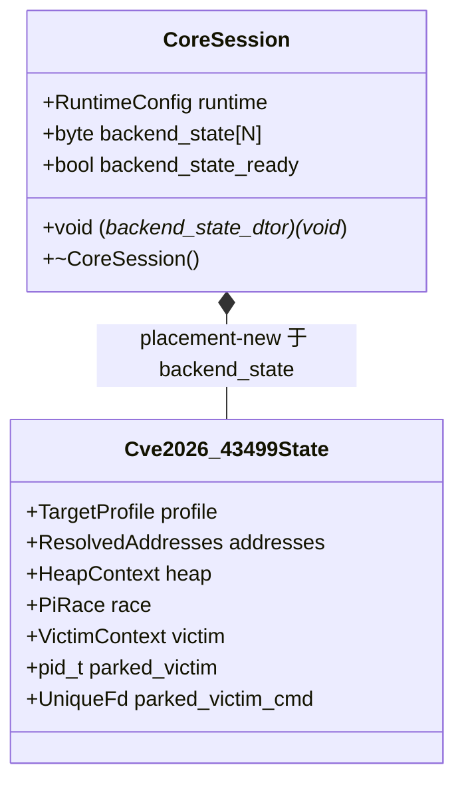

# ExploitSession 通用化（Phase 0）计划（2026-10-03）

对应决策：`docs/analysis/adr/0002-exploit-session-generalization.md`（Proposed）。
上位计划：`docs/analysis/top-level-architecture-rewrite-plan.md`（Phase 0）。
背景调研：`docs/analysis/placeholder-backend-survey.md`。
基线：分支 `vr-ko-bypass-dev`，`acc5e7b` **+ 当前工作树的在飞改动**（保留；审查细节见 `architecture-review-log.md`）。

## 现状与基线

- `session/exploit_session.hpp:36` 的 `ExploitSession` 同时装框架字段（`runtime`）与 43499 专属字段
  （`profile`/`addresses`/`heap`/`race`/`victim`/`parked_victim`/`parked_victim_cmd`），是 `session` god
  namespace 的核心；`Pipeline::run(ExploitSession&)` 因此硬编码单一后端状态。
- `g_exploit_session` 在 `src/` 内共 174 处、33 个文件；后端字段访问集中在：`support/util.cpp`（heap 65）、
  `race/threads.cpp`（profile 14 / race 9）、`route/{multicast,select,tcp}*.cpp`、`attack/ops.cpp`
  （profile 7 / addresses 6）、`profile/accessors.hpp`（addresses 6）、`kernel/runtime_struct_offsets.h`
  （profile 2，头内联）、`session/backend/cve_2026_43499_backend.cpp`（profile 11）、
  `session/root_child_frontend.cpp`（profile 5）。
- 攻击 8 函数中 `waiter_thread`/`owner_thread`/`consumer_thread` 在热循环读
  `g_exploit_session.profile.race_*`；route 与 `do_one_write` 读写 `race`/`heap`/`addresses`。
  这是 `cmp_disasm` 的敏感面。
- 目标：不改变行为与内存访问时序，把 43499 字段移出共享类型，解除 `session → backend` 反向依赖。

### 基线布局实测（2026-10-03，host clang，`-Icore -Icore/tests/host/include`）

用真实头文件编译的探针（`c++ -std=c++23 -fno-rtti`）得到：

```
RuntimeConfig size=104 align=8
TargetProfile  size=792 align=8
HeapContext    size=496 align=8
PiRace         size=208 align=8
ResolvedAddresses size=32 align=8
VictimContext  size=28  align=4
ExploitSession size=1672 align=8
off runtime=0 profile=104 addresses=896 heap=928 race=1424 victim=1632 parked=1660 parkedcmd=1664
```

据此：旧 `profile` 偏移 104；新 `CoreSession{runtime(104) + alignas(8) byte storage}` 的 storage 偏移也是 104；
`Cve2026_43499State{profile,addresses,heap,race,victim,parked_victim,parked_victim_cmd}` 的成员相对偏移与旧
成员相对 `profile` 的偏移一致，故**所有后端字段绝对偏移可精确复现**（`sizeof` 也同为 1672）。
注意：探针用 macOS libc++；AArch64 NDK libc++ 需用同一探针核对，`cmp_disasm` 会给出最终证据。

## 目标与约束

目标：
1. 新增中性 `CoreSession`（仍是进程唯一可变全局，变量名保留 `g_exploit_session`）；
2. 新增 `session::backend::Cve2026_43499State` 承载 43499 字段，访问改类型化访问器；
3. 保持 8 攻击函数的**机器码形状与全局字段绝对偏移不变**（仅 `do_one_write` 因类型改名产生符号拼写差异）。

非目标（本阶段不做，留给后续 Phase）：
- 不搬目录/命名空间（`session::backend::Cve2026_43499State` 先留在原处，Phase A 再搬为
  `backend::cve_2026_43499`）；
- 不拆 `ResolvedAddresses` 为 `memory::AddressSpace`（Phase A2）；不引入 `contract::Capabilities` /
  `KernelMemory`（Phase A/C）；不把 `ComponentSelection` 放进 `CoreSession`（Phase A，避免
  `session → route` 头依赖）；
- 不改 GLK1 wire/profile/CLI/日志文本；不泛化 `RuntimeConfig::apply_profile`（Phase A2）。

约束：
- 单可变全局；PI 窗口零间接调用：访问器必须可内联（无函数指针进入热路径）；
- 四段生命周期、W1→W2→W3→terminal 顺序、`run_state` 阶段名不变；
- `PayloadPage` 保持无析构；`PiRace.request` 保持借用；victim/parked 所有权转移不变。

## 设计：CoreSession 与 backend 状态槽



**状态槽（ADR-0002 开放决策 1）采用 `alignas` 内联存储，不用 `void*`。** 理由：

- `void*` 槽每次访问多一次指针加载（`ldr xN,[x0,#slot]; ldr [xN,#off]`），会让 8 攻击函数出现
  `SHAPE-DIFF`；内联存储让访问仍是 `g_exploit_session + 常量偏移`，形状不变。
- 内联存储不引入第二个可变全局，也不需要后端状态对象的生命周期归属决策。
- 代价：需要一个容量/对齐常量（`kBackendStateBytes`、`kBackendStateAlign`，放中性
  `session/core_session.hpp`，取 8 的倍数），由每个 backend 状态头
  `static_assert(sizeof(State) <= kBackendStateBytes)` 与
  `static_assert(alignof(State) <= kBackendStateAlign)` 守护；host 布局测试再锁偏移。

**布局与偏移保持。** 把 `backend_state` 声明在 `runtime` 之后、成员顺序与旧 `ExploitSession` 完全一致
（`profile,addresses,heap,race,victim,parked_victim,parked_victim_cmd`），并令
`alignas(alignof(void*))`（aarch64 = 8）：

- 旧 `profile` 绝对偏移 = `align_up(sizeof(RuntimeConfig), alignof(TargetProfile))`；
- 新 `profile` 绝对偏移 = `align_up(sizeof(RuntimeConfig), alignof(backend_state))`；
- 两者都是 8 对齐时相等（`RuntimeConfig` 只含 `int32` 与 `std::string`，`sizeof` 为 8 的倍数），
  状态内成员的相对偏移也随顺序复现，故所有后端字段绝对偏移不变。

实测（见上）`RuntimeConfig`=104/align 8、`TargetProfile` align 8，故偏移精确保持。若 NDK ABI 下实测不同
导致偏移变化，则本阶段退化为“已复核的 operand 差异”，按“`cmp_disasm` 复核流程”补审（见下）。
证据由 `session_layout_test` 给出：测试内复刻旧 `ExploitSession` 为测试专用 `LegacySession`，用
断言逐成员比较 `offsetof(CoreSession,storage)+offsetof(State,m)` 与 `offsetof(LegacySession,m)`（含
`sizeof`），避免写死数字。

**访问器（头内联，无间接调用）：**

```cpp
namespace ghostlock::session::backend {
    Cve2026_43499State &cve43499_state(CoreSession &s) noexcept;
    const Cve2026_43499State &cve43499_state(const CoreSession &s) noexcept;
    void cve43499_state_construct(CoreSession &s) noexcept;
} // namespace ghostlock::session::backend
```

调用点写法：`g_exploit_session.profile` → `cve43499_state(g_exploit_session).profile`。
`cve43499_state` 用 `std::launder(reinterpret_cast<T*>(s.backend_state))`；release 下仅剩地址常量计算。

**构造与销毁（保持 O4 顺序）：**

- 构造：`run_orchestrated_pipeline` 在每个 backend 分支、调用 `Pipeline::run` 之前调
  `cve43499_state_construct(g_exploit_session)`（`std::construct_at` placement-new + 置 ready + 登记
  析构钩子）；**幂等**（已 ready 则 no-op，防测试重复调用双重构造）。此后才有任何字段访问。
- 若 `Cve2026_43499State` 构造失败（本设计为 `noexcept`，不预期），归 E1：`Rejected`（PI 窗口外）。
- 销毁：`CoreSession::~CoreSession()` 调用登记的 `backend_state_dtor`。`g_exploit_session` 仍是同一个
  namespace-scope 全局，析构发生在与旧 `ExploitSession` 相同的进程退出点，成员逆序也一致（先状态、
  后 `runtime`），故 O4 的顺序不变。
- 若状态未构造就访问：访问器在 debug 下 `assert(s.backend_state_ready)`；release 下为契约违反。

## 改动清单（逐文件）

新增：

| 文件 | 改动 | 理由 |
|---|---|---|
| `session/core_session.hpp/.cpp` | `CoreSession`：`runtime` + 内联槽 + dtor 钩子 | 取代 `ExploitSession` |
| `session/backend/cve_2026_43499_state.hpp/.cpp` | `Cve2026_43499State` + 访问器 + construct/dtor + 容量 `static_assert` | 43499 私有状态 |
| `tests/session_layout_test.cpp` | 复刻 `LegacySession` 逐成员比较偏移/`sizeof` + 容量/对齐断言 | 机制化锁偏移（§10） |

改名 / 类型替换（机械）：`session/exploit_session.*` → `session/core_session.*`；所有 `ExploitSession`
引用改 `CoreSession`：`route/{pipeline,orchestrator,backend_contract,backend_policy,route_policy,route_api,frontend_contract,route_middleware}.hpp`、`route/{route_middleware,multicast_waiter_route}.cpp`、
`session/root_child_frontend.{hpp,cpp}`、`session/backend/cve_2026_43499_backend.{hpp,cpp}`、
`session/ancillary/{ancillary_controller,ancillary_policy,vr_guard,vr_task_tag}.*`、相关 host 测试与桩。

字段访问改写（`g_exploit_session.X` → `cve43499_state(g_exploit_session).X`，X = 后端字段）：

| 文件 | 字段 | 备注 |
|---|---|---|
| `support/util.cpp` | heap/profile/addresses | 65 处；Phase A 整体移入 backend primitive |
| `race/threads.cpp` | profile | 攻击 3 线程热循环 |
| `route/multicast_waiter_route.cpp` | heap/race/profile | 攻击热路径 |
| `route/select_stack_route.cpp` | heap/race/profile | 同上 |
| `route/tcp_zerocopy_route.cpp` | heap/race | 同上 |
| `attack/ops.cpp` | profile/addresses | `install_profile`/`resolve_profile_addresses` |
| `profile/accessors.hpp` | addresses | slide 别名访问器 |
| `kernel/runtime_struct_offsets.h` | profile | 头内联 `symbol_u32` |
| `session/backend/cve_2026_43499_backend.cpp` | profile | setup/步骤 |
| `session/root_child_frontend.cpp` | profile | handoff |

其它：`session/exploit_session.cpp` 的构造初始化拆分——`runtime` 默认值留 `CoreSession`，
`addresses.soc`/`kernel_phys_load`/`init_cred_image`/`heap.init()` 移入 `Cve2026_43499State` 构造；
`config::runtime_config_snapshot()` 不变。

**改写不是对 `g_exploit_session.` 做 sed**：后端字段也经**参数接收者**访问（`root_child_frontend.cpp` 的
`session.victim`/`session.parked_victim*`、`cve_2026_43499_backend.cpp:393` 的 `session.heap.init()`、
`ancillary_controller.hpp:50` 的 `session.profile`、`vr_guard.cpp:69,84` 的 `session.profile`/
`session.addresses`）。上表按“字段”而非“接收者”列举；实现以**编译器错误清单**为准（移出字段后每个旧访问
都会编译失败，这是防漏改的机制）。

此前遗漏、必须一并改的文件：

- `common.h:16`、`route/route_middleware.hpp:5`：include `session/exploit_session.hpp` → `core_session.hpp`。
- `session/ancillary/ancillary_controller.hpp`：`session.profile` → `cve43499_state(session).profile`；类型改名。
- `session/ancillary/ancillary_policy.hpp`：前向声明与 `AncillaryPolicyFor` 概念中的 `ExploitSession` 改名。
- `session/ancillary/vr_guard.{hpp,cpp}`：`session.profile`/`session.addresses` 走访问器；类型改名。
- `session/ancillary/vr_task_tag.{hpp,cpp}`、注册表：类型改名（该文件无字段访问）。
- `session/root_child_frontend.{hpp,cpp}`：前向声明改名；`session.victim`/`parked_*` 走访问器。
- 测试/桩：`tests/host/route_stub.cpp`、`tests/host/ancillary_stub.cpp`（显式实例化）、
  `tests/host/backend_dataflow_test.cpp`（需先 construct 状态）、`tests/ancillary_test.cpp` 概念签名。
- 头文件内联访问面：`kernel/runtime_struct_offsets.h`、`profile/accessors.hpp` 的 include 与
  `cve43499_state` 调用（两处会因此 include backend 状态头，Phase A2 再归位）。
- 文档：`src/core/README.md:49,81`、`docs/development/engineering-standards.md:138,211`、
  `docs/analysis/ancillary-controller-guide.md:43,100`（“不得新增字段/布局固定”已失效）、
  `docs/analysis/host-attack-dataflow-plan.md:15,26,101,130`（加“现状注：Phase 0 起后端状态在
  `Cve2026_43499State`，绝对偏移不变”）。

构建/工具/文档同批（C1/C3）：`src/Makefile`（`CXX_SRCS`、host 测试依赖、`HDRS`）、
`src/CMakeLists.txt`（`SOURCES`，**仅 CLion 补全用，非构建面**）、
`tools/cmp_disasm.py`（`TARGETS` 增 `CoreSession` 拼写、保留旧拼写）、
`docs/analysis/top-level-architecture-rewrite-plan.md`（进度）。

## 数据流/控制流差异

- 数据流不变：`profile::entry → decoded → install_profile → TargetProfile/ResolvedAddresses →
  攻击/route`。差异只是这些值现在存在 `Cve2026_43499State` 内、经访问器读写；字段绝对地址相同。
- 控制流不变：`main → run_orchestrated_pipeline → Pipeline::run → backend steps → handoff`。
  新增仅在 `Pipeline::run` 之前一次 `construct`（无分支进入 PI 窗口）。
- 不变量：PI 窗口时序、W1→W2→W3→terminal 顺序、route 能力 `constexpr`、单可变全局、
  `run_state` enter/complete 括号与步骤名顺序。

## 所有权与生命周期（O1–O5 强制）

| 对象 | 所有者 | 构造 / 获取 | 借用者 | 释放 / 终结点 |
|---|---|---|---|---|
| `CoreSession.runtime` | 全局 `g_exploit_session` | 静态初始化 | 全体只读 | 进程退出（与旧一致） |
| `Cve2026_43499State` | `CoreSession.backend_state`（内联） | orchestrator `construct`（PI 窗口外） | 攻击/route/handoff | `CoreSession` 析构经钩子（进程退出，与旧一致） |
| `TargetProfile`/`ResolvedAddresses` | 状态（值） | `install_profile`/`resolve_profile_addresses` | 只读 | 随状态 |
| `HeapContext` | 状态 | 状态构造 `heap.init()` | spray/repair | 显式回收 + `CoreSession` 析构；**O1** `PayloadPage` 仍只 `destroy()`，不加隐式析构 |
| `PiRace` | 状态 | 每 route 设置 | 3 线程 | `request_stop()`+join 后才清借用；**O2** `request` 仍是借用栈指针 |
| `VictimContext`/`parked_*` | 状态 | `victim_process`/handoff | W2/W3/handoff | **O3** W3↔handoff 显式转移不变 |

- **O4 终结点顺序**：`参与者停止访问 → 同步/disarm → 资源回收` 不变；构造时机从静态初始化改为
  orchestrator（仍在 PI 窗口外），析构仍在进程退出同一全局点，状态先于 `runtime` 析构。
- **O5**：`run_state` 机制与步骤词表拆分不在本阶段（F13 属 Phase A2），顺序不动。
- **UAF 检查**：本阶段不新增裸指针所有权；`backend_state` 指向内联存储，生命周期 ⊆ 全局；
  无 `free`/`delete`，无二次释放路径。

## cmp_disasm 与偏移保持

- 基线：`git worktree add` 到 `acc5e7b` 构建一次，记录二进制路径与 sha256（门禁记录必须含基线标识）；
  主树构建候选。`TARGETS` 增加 `CoreSession` 拼写（旧拼写保留）。
- 先例（成员偏移位移 → OPERAND-DIFF 已被复核接受并归档）：`docs/analysis/kernel-phys-offset-plan.md`、
  `docs/analysis/5x-tcp-geometry-plan.md`、`docs/analysis/vr-guard-plan.md`。
- 期望：**先修 TARGETS**（`multicast_owner_worker`/`multicast_waiter_worker` 两条目
  已 stale，二进制自比即 `MISSING`/`RESULT: FAIL`；实际可解析 6 个函数），offset 保持成立时 5 个
  `IDENTICAL` + `do_one_write` 符号拼写差异（`LAYOUT-SHIFT` 或新 `TARGETS` 下 `IDENTICAL`）。
- 若 offset 不能保持：脚本在 `OPERAND-DIFF` 上即判 `FAIL`，需先补“已复核差异”流程再放行
  （把 global/struct 立即数与 `[sp,#...]` 栈偏移分开审查，栈偏移变化必须停止调查）。这是本计划
  唯一的工具面待办（见开放项）。

## 兼容性与回滚

- 单分支；回滚 = 丢弃 Phase 0 提交、回到 `B0`（含保留的在飞改动）。无 wire/CLI/配置变化，Kotlin 侧零改动。
- 不新增可变全局；不移动既有字段绝对偏移。

## 验证矩阵

| 项目 | 命令 | 预期 |
|---|---|---|
| host 单测 | `make -C src native-host-tests` | 全绿（含新增 `session_layout_test`） |
| 数据流 harness | `make -C src host-attack-dataflow-test` | 通过（重接影子头） |
| NDK 构建 | `make -C src ghostlock` | 零告警 |
| clang-tidy | `make -C src lint-tidy` | 0 findings |
| 形状对比 | `python3 tools/cmp_disasm.py <acc5e7b-bin> build/native/ghostlock` | 7 IDENTICAL + do_one_write 已复核；或逐条复核记录 |
| 真机 | Xperia 5.15、冷机、固定 CPU 对、单 route、干净启动 | route 命中 + 写验证；门禁编号 `RW-00`，按模板归档到 `docs/analysis/device-gates/` |

## 明确保留

- `RuntimeConfig` 字段与语义、`apply_profile` 当前签名（泛化在 Phase A2）。
- `ResolvedAddresses` 的字段与拆分时机（Phase A2）。
- GLK1 v2 wire、profile 唯一权威、日志文本/顺序、CLI。
- `kernelsnitch/`、legacy v1 转换、`attack::*` 拆分（Phase A2/A3）。

## 开放决策（待维护者确认）

1. 状态槽：**推荐 `alignas` 内联**（本计划按此设计）；备选 `void*`（接受热路径多一次加载）。
2. 全局命名：**推荐保留 `g_exploit_session`**（减小 diff 面，类型改 `CoreSession`）；备选改名
   `g_core_session`（更显式，机械替换 174 处）。
3. 后端状态类型名：**推荐 `Cve2026_43499State`**（与 `Cve2026_43499Policy` 对齐）；备选
   `...::SessionState`。
4. `cmp_disasm` 是否增加“已复核差异”模式：若 Phase 0/A 的 offset 无法保持，则需要；否则本阶段
   不必改工具。

## 进度

- [x] Phase 0 详细计划（本文件）
- [x] 归位在飞改动为 `B0` + 基线二进制
- [x] 修 `cmp_disasm` stale `TARGETS`（6 函数）
- [x] 实现（采用推荐默认：内联槽 / 保留 `g_exploit_session` / `Cve2026_43499State`）
- [x] 新增 `CoreSession` + `Cve2026_43499State` + 访问器
- [x] 迁移全部字段访问点 + 签名
- [x] `session_layout_test` + host 数据流 harness 重接
- [x] 构建/工具接线（Makefile/CMake/cmp_disasm `--reviewed`）
- [ ] 开放决策确认（**唯一未勾**；实现已按推荐默认落地并通过 P0-01，等你确认）
- [x] 门禁：host + NDK 零告警 + lint + `cmp_disasm --reviewed` + 真机 `P0-01` PASS

## Phase 0 实施记录（2026-10-03）

- 基线 `B0 = e987ed9`；基线二进制 `build/native/ghostlock-B0`，sha256
  `ae63a8908cf364ce1a96cf321d3c2cf112e3796aa4cea9a2cdd8f06f186e316e`。
- 布局：`CoreSession.backend_state` 偏移 104，`Cve2026_43499State` sizeof 1568；后端字段绝对偏移
  profile=104 / addresses=896 / heap=928 / race=1424 / victim=1632 / parked=1660 / parkedcmd=1664，
  与基线一致（`session_layout_test` 锁定）。
- `cmp_disasm`：TARGETS 去掉 2 条 stale multicast、加 `CoreSession` 拼写；`--reviewed` 下 6 函数
  全部 `OPERAND-SHIFT`（骨架一致、仅全局数据位移、无 `sp` 变化），RESULT: PASS。
- host `native-host-tests` 22 项全绿；NDK `ghostlock` 零告警；`lint-tidy` 0 findings。
- 注意：访问器去掉了运行期 assert（会改变攻击函数机器码）；构造前提由 orchestrator
  `run_orchestrated_pipeline` 保证。
- 真机门禁 `P0-01` PASS（A301SO / 5.15.189-...-ab14546557，multicast，cold boot boot_ms=68832）：
  route `status=0 clean=1/1` ×3、`child is root!`、`KernelSU ready`，无 panic。记录
  `docs/analysis/device-gates/P0-20261003-multicast-direct-pass.md`。

