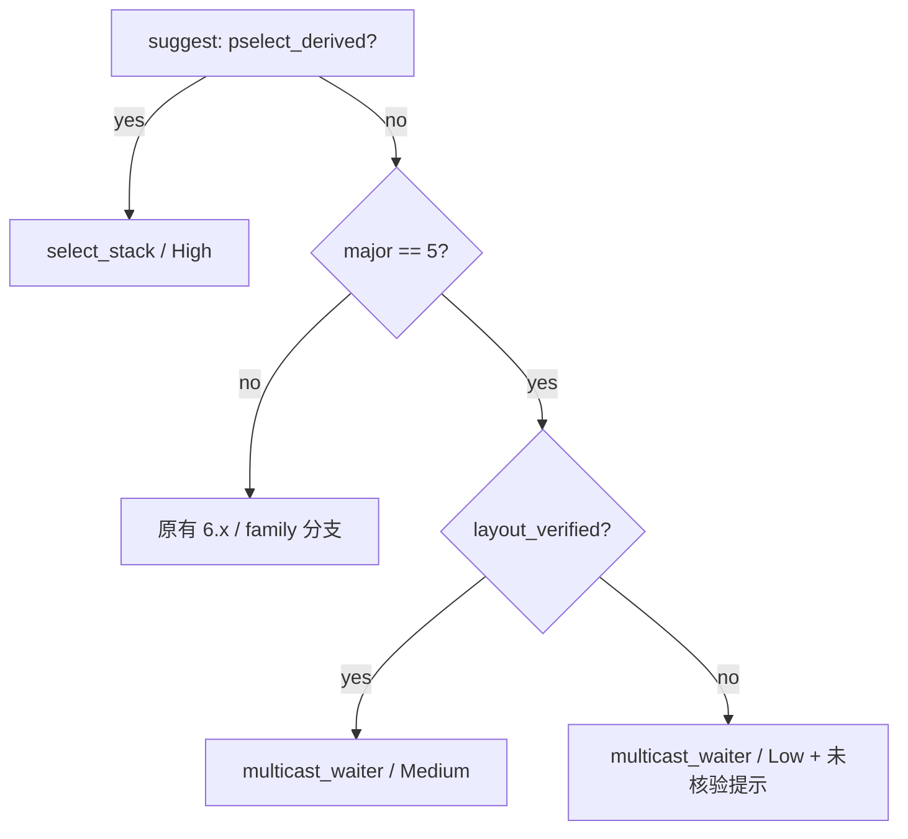

# 5.x 提取器 route 建议 计划（2026-10-02）

## 现状与基线

- 分支 `vr-ko-bypass-dev`；基线 commit `583b13f`（含 PR #228 与 `origin/main`）。
- 对象：`tools/extract_rs` 的 `--analysis` 与 `--format conf` 的 route 建议。
- `suggest()`（`analysis.rs:270-309`）当前顺序：
  1. `pselect_derived` → `select_stack`（High）；
  2. `major == 5 && available("multicast_waiter")` → `multicast_waiter`（Medium）；
  3. `major == 6 && minor == 1 && tcp available` → `tcp_zerocopy`（Medium）；
  4. family 兜底。
- 步骤 2 只读 `major`，不读布局核验状态。判据已存在但未使用：
  - `kernel_layout_verified`（`symbols.rs:135-149`）：5.15 需含 `-android13-`；
  - `kernel_device_geometry_verified`（`symbols.rs:158-160`）：只认 A301SO
    `5.15.189-android13-8-00016-g51bba4309aac-ab14546557`。
- 真机与反汇编证据（2026-10-02）：
  - **vivo PD2361 `5.15.178-g3575c47dc7ce-dirty`（unverified）**：`--analysis` 选
    `multicast_waiter (Medium)`；app 3 次 `W1 1/1 → multicast status=0 success=1 → Write 1 failed`，
    第 4 次 route 内 panic。同镜像 `select_stack` 几何不可行
    （`futex_waiter - pselect_word0 = -248`）；`tcp_zerocopy_receive` 完整。
  - **A301SO `5.15.189-android13-8-00016-...`（verified）**：`tcp_zerocopy_receive @ +0x1424790`
    完整（两次 `bl tcp_zerocopy_vm_insert_batch`）；但提取器对 5.x 的 tcp **不发任何几何**
    （`conf_route_geometry` 的 tcp 分支只认 verified 6.1 → `compact_waiter = null`）；
    手补 `compact_waiter = 1` 后仍在 tcp route 极早期崩溃/重启（日志无 `tcp route enter`）。
    同设备 multicast 3/3 成功。

## 目标与约束

目标：5.x 的 route 建议必须体现布局核验状态，不得对未核验的 5.x 给出与已核验设备相同的
`multicast_waiter (Medium)`。

关键结论（据上）：**5.x 的 `tcp_zerocopy` 几何尚未实现/验证**。A301SO 只证明 tcp 原语存在，
不证明可用；`compact_waiter = null`（乃至手补 `1`）都不足以运行。这既不能判定 tcp“不行”，
也不足以让它成为 5.x 的自动回退。因此本设计**不引入 5.x 的 tcp 自动回退**；“为 5.x 推导并
实测 tcp 几何”另立项目：`5x-tcp-geometry-plan.md`。

非目标：
- 不改 native 攻击代码、不改 GLK1/profile 格式、不改 wire/app；
- 不改 `multicast_waiter_off` 推导与 `MULTICAST_DEVICE_RELEASE` 判定；
- 不修正/扩展 `select_stack`、`tcp_zerocopy` 的几何；
- 不新增 route；不改 `report.rs` 的字段发射规则。

## 改动清单

| 文件 | 改动 | 理由 |
|---|---|---|
| `tools/extract_rs/src/analysis.rs` | `suggest()` 增加 `layout_verified: bool` 形参；`suggest_route()` 用 `kernel_layout_verified(release)` 计算并传入 | 让建议依赖核验状态 |
| 同上 | 5.x 分支：`layout_verified && multicast` → multicast Medium；`!layout_verified && multicast` → multicast **Low** + reasons 注明“布局未核验，须真机门禁；select 几何不可得、tcp 几何未实现，不做自动回退” | 消除未核验 5.x 的 Medium 误导 |
| 同上 | 单测：verified 5.15-android13 → multicast Medium；unverified 5.15-dirty → multicast Low | 防回归 |

不改文件：native、Kotlin、`report.rs`、`main.rs` 的 pselect 终判（6.1 已就位）。

## 数据流/控制流差异

| 条件 | route | confidence |
|---|---|---|
| `pselect_derived` | `select_stack` | High（不变） |
| `layout_verified && multicast` | `multicast_waiter` | Medium（不变） |
| `!layout_verified && multicast` | `multicast_waiter` | **Low** + 未核验提示 |

不变量：`--route` 显式指定最高优先；`pselect_derived → select_stack (High)` 不变；exit code 语义不变。

## 兼容性与回滚

- 纯建议逻辑，无持久化状态、无格式迁移。
- 回归风险点：verified 5.15-android13（A301SO）必须仍得 `multicast_waiter (Medium)`；用单测锁定。
- 回滚：还原 `analysis.rs` 的 `suggest()`/`suggest_route()` 与测试。

## 验证矩阵

| 批次 | 命令 | 预期 |
|---|---|---|
| 单测 | `cd tools/extract_rs && cargo test --release` | 全绿；新增 5.15 verified/unverified 用例 |
| 格式 | `cargo fmt --check` | 干净 |
| 回归（verified） | `5.15.189-android13-8-00016-...` `--analysis` | 仍 `multicast_waiter (Medium)` |
| 新行为（unverified） | `5.15.178-g3575c47dc7ce-dirty` `--analysis` | `multicast_waiter (Low)` + 未核验提示 |
| 反例归档 | A301SO tcp（含手补 `compact_waiter=1`）在 route 早期崩溃、无 route 日志 | 记入本文件“现状”；tcp 几何另立项 |

## 明确保留

- native 攻击路径、`kernelsnitch/`、`LegacyProfileConverter.kt`；
- `multicast_waiter_off` / `MULTICAST_DEVICE_RELEASE` / `kernel_device_geometry_verified` 语义；
- `report.rs` 字段与几何发射规则（含 `report.rs:369` 对 5.x 的 kernelsnitch 默认）；
- 6.1 的 pselect→tcp fallback（`extract-pselect-fallback-plan.md`）。

## 进度

- [x] 计划
- [ ] 实施（`analysis.rs` + 测试）
- [ ] 单测 / `cargo fmt --check`
- [ ] 离线回归（5.15.189 verified 与 5.15.178 unverified）
- [ ] 真机门禁（unverified 5.x 的 multicast）

## 待确认

- 未核验 5.x 的 multicast 用 `Low` 保留候选，还是返回 `None`（强制 `--route` + 门禁）？
- 是否把 A301SO tcp 早期崩溃归档为失败门禁（`docs/analysis/device-gates/`）？
