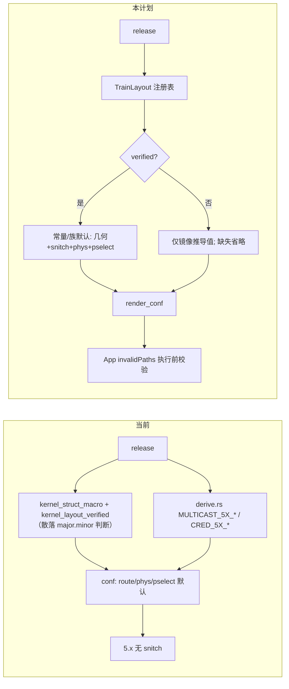

# Extractor 5.15 适配与 5.10 预留计划（2026-09-25）

> 目标：把 extractor 里散落的“内核大版本知识”收敛为**按 Android train 的布局注册表**；据此补齐
> 5.15 的 conf 输出缺口，并为 5.10 预留一条“只需填表 + 真机门禁，不改结构”的路径。
> 本批**不声明 5.10 受支持**，不新增 route，不改 Native/Kotlin/GLK1。

## 现状与基线

- 分支 `very-not-stable-dev`；代码基线 `f424f15` + 当前工作树（已移除 `--format c`、5.15 改按
  `android13` train 验证、candidate conf 已落地）。
- 5.15 现状（`tools/extract_rs`）：
  - `kernel_layout_verified` 对 `5.15.*-android13-*` 返回 true（train 粒度）。
  - `conf_route_geometry("multicast_waiter")` 对已验证 5.x 走 `derive::multicast_geometry_5x`：
    `task_offset`/`lock_offset` 来自 BTF，其余（`waiter_off=96`、`buffer_size=264`、
    `fake_lock_offset=4608`、`fake_task_offset=12800`、`lock_slots_offset=128`、
    `lock_slot_count=12`、`lock_slot_stride=8`、`compact_waiter=1`）是 `MULTICAST_5X_*` 常量。
  - `cred` 走 `derive_cred_5x`（BTF 布局 + 镜像 `init_cred` 值）；`offset.empty_zero_page` /
    `offset.mcast_fake_bss` 从 kallsyms 取。
- 5.15 缺口（与内置 `5.15.189-…-ab14546557.conf` 对比）：
  1. **`kernelsnitch` 整块缺失**：内置 `collisions=8`、`mm_struct_sz=1024`；`render_conf` 对
     5.x 不写任何 snitch 字段（只有 `major==6` 写 `collisions=4`，已验证 6.1 写 `mm_struct_sz`）。
  2. `recommend_shizuku` 固定 0（内置为 1）；这是 App 策略层字段，见 D4。
  3. 其余键（route 几何、task_struct、cred、offset）在 BTF 可用时逐字段齐全。
- 5.10 现状：`kernel_struct_macro` 无 `(5,10)` 分支，`kernel_layout_verified` 无对应 train；
  多播常量、snitch 默认、phys 默认都没有 5.10 版本；多播几何只能走
  `multicast_geometry_btf_only`（仅 task/lock）。代码没有 5.10 硬编码，但也**没有可扩展点**。

## 目标与约束

### 目标

1. 建立单一权威的 **Android train 布局注册表**，承载：模板名、train 标签、是否 verified、
   多播常量、pselect 家族默认、phys 默认、KernelSnitch 默认。
2. 用该注册表补齐 5.15 conf：在 BTF 可用时输出接近内置 profile 的字段（至少补 `kernelsnitch`）。
3. 为 5.10 预留一个注册表条目与代码路径：未验证、无常量时自动退化为“只写镜像推导值”，
   未来接入设备时只改注册表 + 门禁记录。
4. 保持“未验证只输出镜像获得值、缺失省略、App 执行前校验”的既有语义不变。

### 非目标

- 不声明 5.10 或任何新 release 受支持；不新增内置 profile、不改 `index.conf`。
- 不新增 route、不改 `route/component_catalog.hpp`、wire、GLK1、Native/Kotlin 字段表。
- 不改 `--format json`（v1）语义；`--format c` 已移除，不复现。
- 不把 5.15.189 的常量当作“镜像推导值”输出到未验证 release。

## 设计

### D1：单一 train 布局注册表

新增 `tools/extract_rs/src/families.rs`（或 `symbols.rs` 内聚），以静态表表达：

```rust
pub struct TrainLayout {
    pub major: u32,
    pub minor: u32,
    pub train: &'static str,          // "android13"
    pub template: Option<&'static str>, // 6.x STRUCT_OFFSETS_*；5.x 为 None
    pub verified: bool,               // 是否有保留的验证证据
    pub evidence: Option<&'static str>, // 诊断用：验证来源 release（如 A301SO）
    pub multicast: Option<MulticastDefaults>,
    pub pselect_shift: Option<i64>,
    pub phys: Option<u64>,
    pub snitch: Option<SnitchDefaults>,
}
```

- `kernel_struct_macro` 改为查 `template`；`kernel_layout_verified` 改为 `minor` 命中且
  release 含该 train 标签。
- `pselect_waiter_shift_for` / phys 默认 / snitch 默认统一从该表取。
- 5.15 train 条目：`train="android13"`、`verified=true`、`multicast=corroborated{0x60,0x108,compact}`、
  `snitch=Some{collisions:8, mm_struct_sz:1024}`、`pselect_shift=None`、`phys=None`；
  Xperia 的 C 组伪造布局（fake/slot 常量）只挂在精确 release 条目，不随 train 继承。
- 6.1/6.6/6.12 条目：把现有 `pselect_shift`、phys 默认、6.1 `mm_struct_sz`、`collisions=4` 收进表。
- **5.10 条目**：`train="android12"`（待定，见开放问题）、`verified=false`、其余全 `None`。

理由：新增版本只改表；避免 5.15/5.10 的常量散落在 `derive.rs`、`report.rs`、`analysis.rs`。

### D2：补齐 5.15 的 KernelSnitch 输出

- `render_conf` 的 snitch 分支改为查表：
  - `collisions`：`snitch.collisions` 存在即写（5.15=8，6.x=4）。
  - `mm_struct_sz`：优先用 BTF `sizeof(mm_struct)` 作为候选，若条目有 `mm_struct_sz` 默认则以
    默认为准并警告差异（与现有 6.1“设备 SLUB stride 0x400 vs BTF 0x3c0”一致）。
- 仅对 `verified` 的 train 写 snitch 默认；未验证 5.10 不写（与“不套用族默认”一致）。

### D3：多播几何按 train 参数化，并按“证据等级”拆分常量

先分清多播几何里两类完全不同的量（公开证据见下节）：

| 类别 | 字段 | 来源 | 是否可跨设备 |
|---|---|---|---|
| A 帧/拷贝窗口 | `waiter_off`、`buffer_size`、`compact_waiter` | 内核调用栈帧深 + `group_source_req` 拷贝窗口 | 可（同 train ABI），但有跨设备佐证才写 |
| B 结构偏移 | `task_offset`、`lock_offset` | BTF/镜像推导 | 是（本来就是逐镜像推导） |
| C BSS 相对伪造布局 | `fake_lock_offset`、`fake_task_offset`、`lock_slots_offset`、`lock_slot_count`、`lock_slot_stride` | A301SO/Xperia 实测的 BSS 相对布局 | **否**，只有逐设备实测才可写 |

设计：
- `multicast_geometry(layout, structs)` 仍按 `TrainLayout.multicast` 参数化，但把 `multicast`
  拆成 `corroborated`（A + B）与 `device_measured`（C，默认 `None`）两组。
- 已验证 train 只写 `corroborated`。`device_measured` 仅在存在该**设备/release 的专门条目**时写，
  不随 train 继承。因此 A301SO 精确 release 条目保留 C 组；其它 `android13-5.15` 只写 A+B。
- `waiter_off` 是运行时 PROBE 可覆盖的候选默认；profile 字段应能被运行时的 `MCAST_PROBE` 修正，
  extractor 输出的是种子值，不是权威（文档需注明）。
- 未验证 / 无 `multicast` → 维持 `multicast_geometry_btf_only`（仅 B 组）；5.10 预留即此路径。

### 多播常量的公开证据

- 公开变体 `GhostLockAdapt`（POCO air / Redmi 13C 5G，`5.15.180-android13` GKI）独立复现了
  IPv4 `MCAST_BLOCK_SOURCE` stamp：
  - `WAITER_OFF = 0x60 = 96`，`copy size = 0x108 = 264`，与本项目一致；
  - `rt_mutex_waiter` 紧凑布局 `task@0x30`、`lock@0x38`，与 BTF 推导一致；
  - 文档明确 `WAITER_OFF` 随调用栈深度变化、须每次 PROBE（`MCAST_PROBE_INDEX` / `MCAST_STAMP_OFF`）。
- 未找到任何公开案例使用本项目 C 组的 `fake_lock_offset=0x1200` / `fake_task_offset=0x3200` /
  `lock_slots_*`；公开 full-root 走 `PR_SET_MM_MAP` 栈回收或 `rb_erase` forge，机制不同。
- 参考：`github.com/AnonymousUser369/GhostLockAdapt`（`exploit-finale/docs/WRITE-PRIMITIVES.md`、
  `Target/manual_offsets_5-15-180.md`）；上游 `nebusec.ai/buglist/CVE-2026-43499/` 用的是
  `PR_SET_MM_MAP` auxv 回收，而非多播。

### 前人的偏移提取方法（含无 BTF 的 5.x）

调研了本漏洞被引用的上游与本仓库 `gitchw/ghostlock-cve-2026-43499` 里的参考实现，结论是
**“有 BTF 用 BTF，没 BTF 用符号表 + 厂商源码 + 反汇编核对”**：

- **有 BTF（6.6/6.12 OnePlus 参考）**：`tools/extract_target.py` 从 kallsyms 取 28 个全局符号，
  `tools/extract_btf.py`（纯 Python，扫描 `0xEB9F` 魔数解析 BTF）取 57 个结构字段，另有 9 个派生、
  12 个常量，宣称 103/103 全部来自 `boot.img`。这正是“把 BTF 解析放 extractor”的现成范例。
- **无 BTF 5.10 实例一 —— 三星 SM-A155N `5.10.226-android12-9`**（Root My Galaxy `PORTING.md` /
  `SM-A155N-A155NKSS6BYH1.md`）：明确“target contains IKCONFIG but **no BTF**”。做法：
  1. `vmlinux-to-elf` 从 raw ARM64 `Image` 恢复符号化 ELF（110,886 个符号），`llvm-nm` 取全局数据偏移；
  2. 结构布局取自**对应 commit 的厂商源码镜像**，再**逐字段用目标反汇编核对**；
  3. 5.10 是旧版 `rt_mutex_waiter`：`sizeof=0x50`，`task@0x30`、`lock@0x38`、`prio@0x40`、
     `deadline@0x48`，**没有 `wake_state`/`ww_ctx`**（用 `LEGACY_RT_MUTEX_WAITER=1` 选择）。
  4. `kernel_phys_load` 不由 `boot.img`/DT 决定，需在已 root 的同型号机器读 `/proc/iomem`
     的 “Kernel code”；`PSELECT_WORD_SHIFT` 由 `pselect6` 反汇编 + 栈布局推导。
- **无 BTF 5.10 实例二 —— OPPO Find N2 `5.10.236-android12-9`**（`oppo-ghostlock`）：符号偏移
  用 `vmlinux-to-elf nm`，结构/函数偏移用 **IDA** 逐个核对（注释里带 IDA 地址证据），同样没有 BTF；
  `WAITER_LOCAL_OFF=0x50`，`wake_state`/`ww_ctx` 标为“无此字段”。
- 未找到覆盖 5.10 的 OnePlus 参考；现有 OnePlus 参考全是 6.1/6.6/6.12。就现有证据看，**vendor 5.10
  普遍不带 BTF**。

**本项目实测（2026-09-25，用本仓库 extractor）**：三个 5.10 镜像全部**无内嵌 BTF**：

| 镜像 | release | 内嵌 BTF | kallsyms | remove_waiter |
|---|---|---|---|---|
| OnePlus 10 Pro（NE2215 OTA） | `5.10.101-android12-9-00001-…` | ❌ `embedded BTF not found` | 138,213 符号 | 未修补 |
| Redmi K60 (mondrian) | `5.10.252-gki-gabcbe4b2bc10` | ❌ | 172,255 符号 | 未修补 |
| AOSP GKI | `5.10.246-android12-9-g71d49ff6c767` | ❌ | 145,851 符号 | **已修补** |

对 OnePlus 10 Pro 跑 `--format conf`：只得到 `release` + `offset.*`（kallsyms 推导）+ 空的
`multicast_waiter` 分支，`task_struct` / `cred` / `kernelsnitch` 全部缺失（`missing:` 列出 30+ 字段）。
即**无 BTF 时 extractor 目前只能给符号偏移，结构布局全缺**。

对本项目的含义：5.10 预留不能假设 BTF 可用。extractor 的 `kallsyms_finder` 等价于
`vmlinux-to-elf` 的符号恢复；缺的是“无 BTF 时的结构布局”。可选路线见开放问题 2。附带有利事实：
`task@0x30`/`lock@0x38` 在 5.10（0x50 旧布局）到 5.15（0x58 紧凑布局）**都相同**，B 组几何有连续性；
`task_blocks_on_rt_mutex` 的 `stp x20,x19,[x21,#0x30]` 是可直接反汇编读出的字段证据（前人对 5.15.180 的做法）。

### D4：cred 与策略字段

- `derive_cred_5x` 保持通用（BTF + `init_cred` 镜像读取）；`CRED_5X_USAGE_VALUE=256` 标注为
  **route 常量**而非镜像值，5.10 接入时需复核。
- `recommend_shizuku` 由 extractor **恒写 0**：这是内核开发者的人工策略，extractor 不按 route/版本
  自动写 1。只有内核开发者在真机验证后做特殊优化时才把生成物人工改成 1（如内置 5.15 multicast
  profile 的 `1`）。因此 golden 对比中 `0 vs 1` 的差异是既定策略，不是缺口。

### D5：验证与诊断

- 注册表 `verified` 只决定“是否写族默认值”（snitch/几何常量/phys/pselect 默认），不决定
  是否输出；未验证仍输出镜像推导值。`evidence` 仅进 `--analysis` 报告，不写 profile。

### D6：BTF/镜像解析归属 extractor，运行时不做推导

- **BTF 对给定内核镜像不可变**：它是编译期生成的只读 `.BTF` section；`/sys/kernel/btf/vmlinux`
  导出的就是同一份数据。同一 `uname -r` 的 image 不换，BTF 就不变；运行时既不能改也读不到新信息。
  因此 `task_offset`/`lock_offset`、cred 布局、task_struct 等凡由 BTF 决定的值，**离线在 extractor
  解析一次并写入 profile 即可，native 不带 BTF 解析器**。
- 这与项目原则一致：配置权威是 profile，执行层不读配置、不推导（AGENTS 代码约定）。也避免运行时
  的 `/sys/kernel/btf/vmlinux` 权限/SELinux 依赖与额外攻击面。
- **可变性的边界**：release 变化 → BTF 变；同一 `uname -r` 若存在不同厂商/配置构建，BTF 可能不同。
  该风险由 App“精确 `uname -r` 匹配 + 用户显式导入 + 导入后字段校验”的既有契约承担，不通过运行时
  重解析解决。extractor 的 profile 必须绑定它实际解析的那个镜像。
- 无内嵌 BTF 的镜像（部分 MediaTek、可能的 5.10 GKI）：extractor 与运行时都拿不到，字段只能省略；
  不能靠运行时 BTF 补齐。
- 唯一保留的运行时量是 **`waiter_off`（A 组）**：它是栈帧深度偏移而非结构事实，公开案例亦要求每次
  PROBE。设计上把 extractor 输出当种子，未来若 native 引入 `MCAST_PROBE`，允许其在运行时覆盖该字段；
  在此之前 profile 值即最终值。

## 改动清单

| 文件 | 改动 | 理由 |
|---|---|---|
| `tools/extract_rs/src/families.rs`（新增） | `TrainLayout` 表 + 查询函数（template/train/verified/defaults） | 单一权威，新增版本只填表 |
| `tools/extract_rs/src/symbols.rs` | `kernel_struct_macro` / `kernel_layout_verified` 改查表 | 去散落逻辑 |
| `tools/extract_rs/src/derive.rs` | `multicast_geometry` 按 `TrainLayout.multicast` 参数化；常量迁入表 | 5.10 预留 |
| `tools/extract_rs/src/report.rs` | snitch 分支查表（5.15 `collisions=8`/`mm_struct_sz`）；phys/pselect 默认查表 | 补齐 5.15 |
| `tools/extract_rs/src/analysis.rs` | `suggest_route` 的 family 取注册表；报告显示 `evidence` | 诊断一致 |
| `tools/extract_rs/src/{families,symbols,derive,report,analysis}.rs` 测试 | 5.15 完整 golden；5.10 合成 release → 未验证、btf_only、无 snitch/phys 默认；6.x 逐字段不回归 | 锁定边界 |
| `docs/analysis/extractor-5x-derivation-plan.md` | 注明常量已迁入注册表、验证粒度 | 文档同步 |
| `docs/analysis/extractor-5x-510-layout-plan.md` | 本计划 + 实施/验证记录 | 设计与证据同处 |
| `docs/kernel_profiles/templates/kernel-5.x.template.md` / `_ZH.md`（如需） | 说明 5.10 预留状态 | 使用者不误解为已支持 |

## 数据流与控制流差异



不变量：`verified=false` 时不写任何非镜像来源的值；`release` 仍必须存在且 major 为 5/6；
cred 仅由 BTF + `init_cred` 决定；Kotlin 字段校验仍先于 Native 启动。

## 兼容性与回滚

- 已通过门禁的 A301SO `5.15.189` 与 6.x 现有 conf 字段/值必须逐项不变（新增 snitch 除外，
  且 5.15 golden 需重新比对内置 profile）。
- 5.10 无现有输出，纯新增路径；不迁移用户数据，不改已存 profile。
- 回滚只需恢复 extractor 源码与文档；不涉及 ABI、GLK1 或设备资产。

## 验证矩阵

| 场景 | 命令/检查 | 预期 |
|---|---|---|
| Rust 单测 | `cargo test --release --manifest-path tools/extract_rs/Cargo.toml` | 注册表边界、5.15 golden、5.10 预留、6.x 不回归全通过 |
| 格式/lint | `cargo fmt --check`；`cargo clippy --all-targets` | 格式通过；无本批新增 finding |
| 5.15 golden | A301SO `boot.img --format conf` 与内置 `5.15.189.conf` 对比 | route 几何/cred/task/offset 逐字段一致；`kernelsnitch` 与内置一致（`collisions=8`、`mm_struct_sz=1024`）；`recommend_shizuku` 差异为计划内 |
| 5.10 预留 | 合成 `5.10.*-android12-*` release（单测 fixture） | verified=false；仅 BTF task/lock + kallsyms offset；无 snitch/phys 默认/多播常量；不报错 |
| 未验证 5.15 | `5.15.178-…-dirty`（单测已覆盖） | 仍走 btf_only，不套用 Xperia 常量 |
| 6.x 回归 | 现有 6.1/6.6/6.12 conf 单测 | 逐字段不变 |
| Native/设备门禁 | 不适用 | 未改 `src/core`、GLK1、profile binary 或攻击路径 |

## 明确保留

- `src/core/**`、8 个攻击函数及其资源准备/回收顺序。
- GLK1 wire、Native/Kotlin profile 字段表、`LegacyProfileConverter.kt`、内置已验证 profile。
- `--format json`（v1）语义；已移除的 `--format c` 不恢复。
- `OPTIONAL_SYMBOLS` / `struct_slab_cache` 的既有缺失容忍契约。
- 不新增 route，不声明 5.10 支持，不增设绕过验证门控的 flag。

## 开放问题

1. **5.10 的 train 标签**：GKI 5.10 覆盖 Android 12/13，`uname -r` 的 train 后缀需真机样本确认
   （`-android12-` 还是 `-android13-`）；在确认前按 `android12` 预留且 `verified=false`。
2. **5.10 无 BTF 时的结构布局来源**：已实测 OnePlus / Redmi / AOSP GKI 三个 5.10 均无 BTF，
   此时 `task_offset`/`lock_offset`、cred、task_struct 都无法离线推导。可选：
   (a) extractor 从目标反汇编关键函数（如 `task_blocks_on_rt_mutex` 的 `stp …, [x21,#0x30]`）推少数
   关键字段，其余省略；(b) 维护“厂商源码镜像 + commit”的布局表并逐字段反汇编核对（前人的做法）；
   (c) 明确 5.10 只输出符号偏移 + waiter task/lock（反汇编），其余靠人工。需在接入真实 5.10
   `boot.img` 时定夺；在此之前 5.10 候选允许较空。另注：AOSP GKI `5.10.246` 的 `remove_waiter`
   已被修补，接入 5.10 时 preflight 仍按版本判定，不改变 exit 6 语义。
3. **`kernelsnitch.collisions` 来源**：目前来自内置验证 profile 的族默认（5.15=8、6.x=4），
   不是镜像推导；若后续能从镜像或运行时推导，应替换为推导优先。
4. **`recommend_shizuku` 归属**：本计划维持 extractor 不决定；若产品要求 extractor 按 route
   建议该值，需另立跨层设计（Kotlin 策略与之合并顺序）。

## 进度

- [x] Explore：读取 5.15 内置 profile、模板、`derive.rs`/`report.rs`/`symbols.rs`/`analysis.rs`
  与既有 5.x 推导计划，定位 snitch 缺口与 5.10 无扩展点问题。
- [x] Design：本文获认可；用户决定**先做 5.15，5.10 推迟**。
- [x] Implement（5.15）：见下。
- [x] Verify（5.15）：见下。
- [ ] 5.10 / D1 全量注册表 / D6：推迟。

## 批次范围与实施记录（2026-09-25，仅 5.15）

本批只完成 5.15，未做 5.10、未做 D1（TrainLayout 全量注册表）、D6 运行时 BTF（已确认不做）。

已完成：
- **D2**：`render_conf` 的 snitch 改为仅在 verified train 写。`major==5` 写
  `collisions=8` + `mm_struct_sz=1024`；6.1 写 `collisions=4` + `mm_struct_sz=1024`；6.6/6.12 只写
  `collisions=4`；未验证 release 完全不写（不再继承邻族默认）。
- **D3**：`derive.rs` 多播几何拆为
  - `multicast_geometry_corroborated`（`waiter_off`/`buffer_size`/BTF `task`/`lock`/`compact_waiter`）——
    随 verified train 输出；
  - `multicast_geometry_device_measured`（`fake_lock_offset`/`fake_task_offset`/`lock_slots_*`）——
    仅 `symbols::MULTICAST_DEVICE_RELEASE`（精确 5.15.189）输出，不随 train 继承；
  - `multicast_geometry_5x` = 两者组合，保持内置字段顺序。
  未验证仍走 `multicast_geometry_btf_only`。
- 测试：新增 `verified_5x_train_without_device_evidence_omits_measured_placement`、
  `unverified_release_omits_kernelsnitch_defaults`；5.15 golden 断言更新为含 `collisions=8`/`mm_struct_sz=1024`。

验证结果：

| 检查 | 结果 |
|---|---|
| `cargo test` | 28 passed / 0 failed |
| `cargo fmt --check` / `git diff --check` | 通过 |
| `cargo clippy --all-targets` | 无本批新增 finding |
| A301SO `5.15.189` 真实 `boot.img --format conf` | 与内置 profile **逐字段一致**（route/cred/task/offset/`kernelsnitch` 全同；仅 `recommend_shizuku` 0 vs 1，计划内）。stderr 无 `embedded BTF not found`，kallsyms 159,332 符号，`remove_waiter` 未修补 |
| 非精确 5.15 / 未验证 | 单测锁定：不再继承 Xperia C 组与 snitch 默认 |
| Native/设备门禁 | 不适用（未改 `src/core`、GLK1、profile binary 或攻击路径） |
