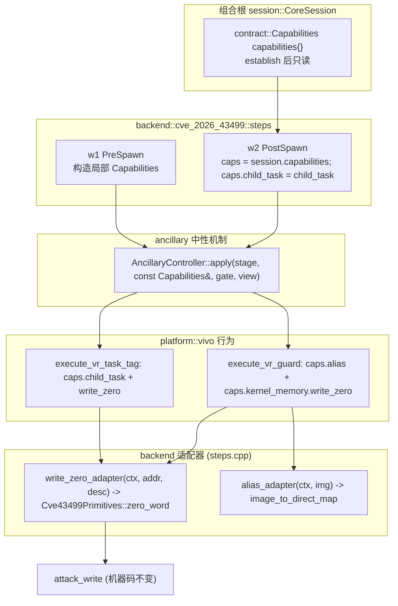

# 内核读写原语 Batch 1 实施计划与开放决策包

> **状态：尚未获批（NOT APPROVED）。** 本文只做只读取证与决策整理；**未修改任何源码、未 commit**。
> **上游计划**：`docs/analysis/flexible-kernel-rw-primitive-plan.md`（Phase C，未定稿）。
> **取证基线**：分支 `vr-ko-bypass-dev`，`git rev-parse` = **f70d671**（计划自述 `acc5e7b`，已过期）；
> 本文源码行号均以该 commit（f70d671）为准，已用 `git show HEAD:<path>` 抽样复核；取证之后共享工作树出现其它并发改动，与本文的只读取证结论无关。
> **本文范围**：只生成 `docs/analysis/kernel-memory-batch1-plan.md`。所有断言附 `文件:行号`。

---

## 0. 结论先行

1. **计划 §241 的「5 条开放决策」里，4 条计划已标「已定」（1/2/4/5），只有第 3 条「接口形态」真开放。**
   但代码取证发现 4 处「计划自述 vs 实际代码」漂移，必须先裁决，否则 Batch 1 无法开工：
   - **D-A**：`AncillaryContext` 在代码里**不存在**；现类型是 `ancillary::AncillaryOps`（`src/core/ancillary/ancillary_policy.hpp:48`），且注释已写明它是「interim hand-rolled handle」。
   - **D-B**：`read_back` 在代码里**不存在**（全仓 grep 仅命中计划文本）；现状是 `AncillaryOps` 有一个**裸 bool** `read_available`，却**没有任何 read 函数指针**（`ancillary_policy.hpp:49-56`），属 ADR-0002 明令禁止的「第二可用性来源」。
   - **D-C**：`contract/capabilities.hpp` **已存在**且已落地 `KernelMemoryOps`/`FileCacheWriteOps`（`contract/capabilities.hpp:15-36`），但其形状是 **`ctx` + 函数指针 + `available()`**，与计划草案 §87-94（**无 ctx、含 `read64/write64/update_bits`、无 `write_zero`**）**不一致**。
   - **D-D**：`ghostlock::contract::Capability` **已被子系统 B 的 CM 插件 ABI 占用**为 `enum class Capability : uint32_t`（`contract/countermeasure.hpp:49-58`）。计划 §81-84 要求在**同一命名空间**新增 `template<class C> concept Capability`——**直接名字冲突，草案无法原样落地**。
2. **计划草案的 `KernelMemoryOps`/`Capabilities` 形状无法支撑现有两个 vendor 行为**：VrGuard 需要**写零**与**image→direct-map 译址**（`platform/vivo/vr_guard.cpp:77-98`），VrTaskTag 需要 **child_task**（`platform/vivo/vr_task_tag.cpp:70-91`），而 §87-94 的草案既无 `write_zero`、也无 alias、也无 child_task。**Batch 1 必须先补齐这三项**。
3. **Batch 1 只做「接口 + ancillary 消费方改造 + host stub」**，不碰 Tier 2、不碰 `WriteRequest`、不碰 `payload_builder`、不碰 profile/提取器。改动的三个 backend 落点（`steps.cpp` 的 `w1`/`w2` 内 ancillary 调用、platform/vivo 行为、contract/session 头文件）**都不在 `tools/cmp_disasm.py` 的 6 个 TARGETS 内**（`tools/cmp_disasm.py:79-143`），因此 **预计 `cmp_disasm` 6/6 IDENTICAL (strict)**（见 §3.2 的残余风险与判定条件）。
4. **批准后第一步（最小可验证动作）**：只改 `contract/capabilities.hpp` + `contract_capabilities_test.cpp` + Makefile 规则，跑 `make -C src native-host-tests`，要求 `contract_capabilities_test: ok`。此步不触任何 backend/攻击路径；接口形状先在 host 冻结，再进 ancillary 迁移。

---

## 1. 取证：计划断言 vs 代码事实

| # | 计划断言（行号） | 代码事实（文件:行号） | 判定 |
|---|---|---|---|
| 1 | 接口含 `CapabilityKind`/`Capability` concept/`Capabilities`（§79-110） | `contract/capabilities.hpp` 无这三个符号；只有 `KernelMemoryOps`(15-25) 与 `FileCacheWriteOps`(30-36)；`AddressDiscoveryOps` 在另一头文件 `contract/address_discovery.hpp:84-92` | **漂移**：草案未落地，且 `Capability` concept 与 CM ABI 同名（见 §2-附加 A） |
| 2 | `KernelMemoryOps{ read, write, read64, write64, update_bits }`（§87-94） | 实际 `KernelMemoryOps{ ctx, read, write, available() }`（`contract/capabilities.hpp:15-25`）；无 read64/write64/update_bits | **漂移**：实际采用全仓统一的 `ctx + *Ops` 家族风格（与 `FileCacheWriteOps`、`AddressDiscoveryOps` 同族） |
| 3 | `available()` 由句柄非空推导（§120） | 实际 `available() = read != nullptr && write != nullptr`（`capabilities.hpp:22-24`） | 冲突：**Tier 1 只写**句柄（write 有、read 无）会被判为「不可用」，直接挡死 `write_zero`。必须拆分读写可用性 |
| 4 | `AncillaryContext` 退役（§16/117/122/196） | 代码里 `AncillaryContext` 不存在；现为 `AncillaryOps`（`ancillary_policy.hpp:48-56`），已被 ADR-0004 R4/ADR-0001 §14 判定要退役为 `contract::Capabilities&` | **术语过期**：退役对象是 `AncillaryOps`，不是 `AncillaryContext` |
| 5 | `AncillaryContext::read_available` 恒 false、`read_back` 注释占位（§16） | `read_available` 恒 false 属实（`steps.cpp:184`、`:415`）；`read_back` 全仓仅计划文本有 | **半漂移**：无 `read_back`；真正的问题是「有 bool、无函数指针」的第二来源 |
| 6 | 值写改由 Tier 2；`WriteRequest{target,mode,preserve_child}`（§11） | 属实：`memory/payload_builder.h:16-32`；`WriteMode` 仅 Disabled/Zero/Credential(16-20)；值由 `payload_write_layout` 派生只有三种(56-76) | 一致（Batch 1 不改它） |
| 7 | `attack_write` 的 cmp TARGETS 清单 | `tools/cmp_disasm.py` 现 TARGETS = owner/waiter/consumer/run_main_route_threads/do_kernel5_fake_lock_route/do_one_write，共 6 组(79-143)；**无** `multicast_owner_worker/multicast_waiter_worker` | **漂移**：计划 §20 说这两项 stale，实际已不在 TARGETS |
| 8 | 「GLK1」传输格式（§33/198/219/239/248/262） | AGENTS.md 与 `src/core/README.md:86-94` 明确当前 wire 是 **GLKv3（MessagePack）**，GLK1 是旧称 | **术语过期**：Batch 2 应说 GLKv3 |
| 9 | B 载体 `ashmem_misc`/`binder_miscdev`/`loop_control`、configfs、pipe_buffer 等 profile 字段（§197） | `src/core/profile` 下 grep 这些符号 **0 命中**；`tools/extract_rs` 仅 `src/symbols.rs:1` 有注释提到 ashmem，无字段 | 一致（Batch 2 才做），但**已定的是决策、不是现状** |
| 10 | 改动清单把 ancillary 放「消费方」（§196） | 现状 ancillary 消费方已逐步归位：机制在 `ancillary/`，行为在 `platform/vivo/`（`vr_guard.hpp:1-85`、`vr_task_tag.hpp:1-78`），注册表 `VivoAncillaryPolicies` 由 backend 注入（`steps.cpp:192-195`、`:422-425`） | 一致；Batch 1 只需把「能力面」从 `AncillaryOps` 换成 `contract::Capabilities` |
| 11 | 「`contract::Capabilities` 由 backend establish 一次写入」 | `CoreSession` **当前没有** `capabilities` 字段（`session/core_session.hpp:20-35`）；ADR-0002 §6 要求加在 backend 状态槽**之后**，且尚未落地 | **未落地**：Batch 1 需新增该字段 |
| 12 | `KernelMemory::channel_kind()`（§159） | 无任何 channel/kernel memory 实现；全仓无 `channel_kind` | 未落地（Batch 3/4 实现，Batch 1 定形状） |

---

## 2. 决策包（可直接裁决）

> 每条格式：`{问题, 现状证据, 选项, 建议, 影响面, 不可逆性}`。计划标「已定」的条目同时给出「是否与代码自洽」。

### 决策 1 —— 实现选型（计划 §245 标「已定」）

| 项 | 内容 |
|---|---|
| **问题** | Tier 2 用哪种读机制？B（fops）主 / C（pipe_buffer）回退 / D（页表）弃用。 |
| **现状证据** | 代码**尚无任何 channel 实现**：`contract/capabilities.hpp` 无 channel 枚举；`KernelMemoryOps` 无 provider（grep 全仓无实现）。计划 §54-66 的对比表属方案论证，非现状。 |
| **选项** | (a) 与计划一致：B 主、C 回退、Tier1 只写；(b) 只做 B，C 删除；(c) B+C 同时建。 |
| **建议** | **接受计划 (a)**。B 与现有 `fake_fops`/credential copy 同源、依赖最少；C 作为同一 `KernelMemoryOps` 的可选后端，仅在 B gadget 缺失或需物理域时启用（计划 §162-169 已给出理由）。 |
| **影响面** | Batch 3 建 B，Batch 4 建 C；Batch 1 只冻结接口与 `channel` 枚举，不写实现。 |
| **不可逆性** | 中。通道枚举与 `KernelMemoryOps` 形状一旦冻结，B/C 都必须适配；枚举可扩展，字段可加，**不建议**在后续批次改名。 |
| **与代码自洽** | 自洽：代码既没有 B 也没有 C，接受该决策不与任何现状冲突。 |

### 决策 2 —— Tier 2 载体（计划 §247 标「已定」）

| 项 | 内容 |
|---|---|
| **问题** | B 的载体优先级与 gadget；C 的载体；「哪个存在」由谁决定。 |
| **现状证据** | profile 无相关字段（grep 0，见 §1#9）；提取器只有注释。计划 §147-155 定：B 载体 `ashmem_misc → binder_miscdev → loop_control`，gadget=configfs；C 通用 pipe。 |
| **选项** | (a) 按计划；(b) 只锁 ashmem+gadget=configfs，备选延后。 |
| **建议** | **接受计划 (a) 作为目标**，但 Batch 2 提取器先只实现 **ashmem + configfs 探测**并把其余两者留 `absent`（fail-closed），避免一次背三套载体。运行时按序尝试、全失败降级 Tier 1。 |
| **影响面** | Batch 2（profile 字段 + 提取器）、Batch 3（建立阶段按序尝试）。 |
| **不可逆性** | **高**：载体顺序、configfs gadget、profile 字段名一旦写入 GLKv3 并被 Kotlin/提取器双侧锁定，改动需双侧同步 + manifest 重导（`src/Makefile:451-457`）。建议字段名在 Batch 1 末尾与维护者一并冻结。 |
| **与代码自洽** | 自洽（尚未落地）。**术语须改**：写「GLKv3」，非「GLK1」（见 §1#8）。 |

### 决策 3 —— 接口形态（计划 §249，唯一真开放）

| 项 | 内容 |
|---|---|
| **问题** | (3a) 值/掩码是否走 `session` 字段而非新增 `attack_write` 参数（保 cmp）？(3b) `KernelMemoryOps`/`Capabilities` 的最终形状是什么？ |
| **现状证据** | (3a) 计划 §181-183 的做法与 `zero_word`「绑定 session 全局、不加参数派生调用点」一致（`primitives.cpp:177-184`），且 `WriteRequest` 尚未改；(3b) 实际 `KernelMemoryOps` 是 `ctx+fp` 家族（`capabilities.hpp:15-25`），计划草案 §87-94 是另一种（无 ctx、多函数），且 `Capability` concept 与 CM ABI 撞名（`countermeasure.hpp:49`）。 |
| **选项** | **3a**：(i) 走 `session`（计划）——`CoreSession` 增 `write_value/write_mask`（计划 §181），`attack_write` 机器码不变；(ii) 扩 `WriteRequest`——可读性好但改 `do_one_write` 机器码，须记已复核差异 + 真机重验。**3b**：(i) 沿用实际 `ctx+*Ops` 家族，扩展 `write_zero`/`channel`，新增 `AliasOps` 与 `Capabilities`；(ii) 按计划草案重写为无 ctx、加 `read64/write64/update_bits`；(iii) 折中：handle 只存原语，`read64/write64/update_bits` 放 facade 派生。 |
| **建议** | **3a 选 (i)**、**3b 选 (i)+(iii)**：保留 `ctx+*Ops` 家族；`KernelMemoryOps` 增 `write_zero` 与 `channel`，拆 `write_available()`/`read_available()`；`read64/write64/update_bits` 由 `KernelMemory` facade 基于 `read/write` 派生（单一真相、少一处适配负担）。**不引入** `template concept Capability`（撞名，见附加 A）；用 `enum class CapabilityKind` 作 tag 即可，或干脆不加 tag、靠 `Capabilities` 具名字段。 |
| **影响面** | 冻结后 Batch 3/4 全按此实现；Batch 2 的 profile 字段只被实现消费、不反向影响接口。 |
| **不可逆性** | **中高**：接口是 L 级跨层契约，一旦 ancillary/backend 与外部 CM 插件共同适配，改名成本大。建议在 Batch 1 一次冻结（含 `KernelMemoryChannel` 枚举数值）。 |

### 决策 4 —— 范围（计划 §251 标「已定」）

| 项 | 内容 |
|---|---|
| **问题** | 是否同批替换 43499 后端并改造 ancillary 消费方？ |
| **现状证据** | ADR-0001 §14（`0001:110-115`）、ADR-0002 §1/§6（`0002:36-41,53-55`）、ADR-0004 R4（`0004:48-51`）均已裁定 `AncillaryOps` 退役、行为取 `contract::Capabilities&`；`AncillaryOps` 注释自称 interim（`ancillary_policy.hpp:45-47`）。 |
| **选项** | (a) 同批做（计划）；(b) 先只做接口、ancillary 留下一批。 |
| **建议** | **接受 (a)，但按批切分**：Batch 1 只做「接口 + ancillary 迁移 + stub Tier1」，**替换 43499 后端写路径放到 Batch 3**。这满足「一个批次只做一类事」且保持 host 可测。 |
| **影响面** | Batch 1 改 `contract`/`session`/`ancillary`/`platform::vivo`/`steps.cpp` 调用点；不改 route/primitive/payload。 |
| **不可逆性** | 低。 |
| **与代码自洽** | 自洽：`AncillaryOps` 确是 interim，退役方向与 ADR 一致。 |

### 决策 5 —— 目标设备（计划 §253 标「已定」）

| 项 | 内容 |
|---|---|
| **问题** | 先验哪台设备？ |
| **现状证据** | 计划 §232-233：Xperia 5.15 可随时调用但无 vr.ko；vr 语义需 vivo 6.1。代码无设备相关证据。 |
| **选项** | (a) Xperia 5.15 先行，vivo 6.1 后补（计划）；(b) 等 vivo 一起。 |
| **建议** | **接受 (a)**。Batch 1 不涉真机（纯 host）；Batch 3 起才需要 Xperia 门禁。 |
| **影响面** | 验证排期。 |
| **不可逆性** | 低。 |

### 附加决策（计划未列，代码取证暴露，必须在 Batch 1 前裁决）

| ID | 问题 | 现状证据 | 选项 | 建议 | 影响面 | 不可逆性 |
|---|---|---|---|---|---|---|
| **A** | `contract::Capability` 名字冲突 | CM ABI 已有 `enum class Capability`（`countermeasure.hpp:49-58`）；ADR-0001 §5 要求同命名空间加 `Capability` concept（`0001:69-71`），计划 §81-84 照抄 | (i) concept 改名 `CapabilityHandle`；(ii) 不加 concept，只加 `CapabilityKind` tag + 具名字段；(iii) 重命名 CM 枚举（**破坏 ABI 与外部插件**） | **(ii)** 最小；如确需概念约束用 (i) | 接口冻结批次 | 低（新增符号，不动 CM ABI） |
| **B** | 只写句柄的可用性 | `KernelMemoryOps::available() = read && write`（`capabilities.hpp:22-24`），而 Tier 1 只有 `write_zero`；照搬会使 ancillary 在 Tier 1 下被误判不可用 | (i) 拆 `write_available()`/`read_available()`；(ii) `available()` 只要求任一方向；(iii) 保留 `AncillaryOps.write_available` bool（违反 ADR「单一来源」） | **(i)**，并把 `channel != Unavailable` 作为主判据 | 直接影响 VrGuard/VrTaskTag 能否在 Tier 1 运行 | 中（`available()` 语义改变会影响所有调用方） |
| **C** | alias / child_task 无家可归 | VrGuard 用 `image_to_direct_map`（`vr_guard.cpp:86`），VrTaskTag 用 `child_task`（`vr_task_tag.cpp:81`）；CM ABI 已把它们建模为 `Capability::Alias`/`Capability::ChildTask`（`countermeasure.hpp:53-54`）与 `glk_host_ops.image_to_direct_map/child_task`（`glk_cm_abi.h:134,142`） | (i) `Capabilities` 增 `AliasOps alias` 与**每次调用填入**的 `child_task`；(ii) 另设 `ancillary::AncillaryView` 包住三者 | **(i)**：backend 在 PostSpawn 造一份局部 `Capabilities` 副本填 `child_task`，行为仍收 `Capabilities&`，字面符合 ADR | Batch 1 行为签名 | 中（`Capabilities` 字段一旦冻结，扩展需双侧） |
| **D** | `update_bits` 语义未定 | 计划 §92 只给签名，无 RMW 语义、无大端/对齐、无并发说明 | (i) 64 位 `old=(old&~mask)|(value&mask)`，逐次 PI 竞态不保证原子；(ii) 要求对齐且原子（当前不成立） | **(i)**，并在头注释显式声明**非原子**（Tier 1 每字一次竞态） | Batch 3 写路径 | 低 |

---

## 3. Batch 1 范围、不变量与 cmp_disasm 判定

### 3.1 只做什么 / 不做什么

| 做 | 不做 |
|---|---|
| 扩展 `contract/capabilities.hpp`：`KernelMemoryOps` 增 `write_zero`/`channel`、拆读写可用性；新增 `AliasOps`、`Capabilities`、`KernelMemory` facade、`KernelMemoryChannel`；新增 host stub 测试 | 不实现任何 Tier 2（B/C）读写；`read`/`write` 保持 `nullptr` |
| `CoreSession` 增 `contract::Capabilities capabilities{}`（置于 backend 状态槽**之后**，ADR-0002 §6） | 不移动 `backend_state`；不改 `WriteRequest`/`WriteMode`/`payload_builder` |
| 退役 `AncillaryOps`：controller / concept / vendor 行为 / controller stub / 测试全部改取 `const contract::Capabilities&` | 不改 route / primitive / race / orchestration；`attack_write`、`zero_word` 源码不变 |
| backend `steps.cpp` 在 W1 PreSpawn、W2 PostSpawn 处构造局部 `Capabilities`，注入 Tier 1 `write_zero` 适配器 + alias + child_task | 不新增 `attack_write` 参数；不改 `support/util.cpp` |
| 更新 README、Makefile 测试接线 | 不改 profile/GLKv3/提取器/Kotlin |

**不变量（必须保持）**：Tier 1 仍是「一次 PI 竞态一次单字写」；`attack_write` 调用点与相对顺序不变；ancillary 的 detag 仍先于 W2 verify（`steps.cpp:171-207`）。

### 3.2 cmp_disasm 影响判定

`tools/cmp_disasm.py` 的 6 个 TARGETS（`tools/cmp_disasm.py:79-143`）：

| TARGET | 定义处 | Batch 1 是否触及 | 理由 |
|---|---|---|---|
| `do_one_write`（= `attack_write`×3 route） | `primitives.cpp:144-175` | **否** | 不新增参数、不改 `WriteRequest`；`cve43499_state(session)` 依赖的 `offsetof(CoreSession, backend_state)` 未动 |
| `zero_word`（非 TARGET，但属原语） | `primitives.cpp:177-184` | **否** | 只被新的 `write_zero` 适配器**调用**，其函数体不变 |
| `do_kernel5_fake_lock_route` | route | **否** | route 源码不动 |
| `run_main_route_threads` | race | **否** | 不接收 `Capabilities`；ADR 要求 route/primitive/attack 接口不出现 Capabilities |
| `owner_thread`/`waiter_thread`/`consumer_thread` | race | **否** | 同上 |

**结论：预期 6/6 IDENTICAL (strict)。** 依据：Batch 1 不修改任何 TARGET 的源码或调用图；`CoreSession` 只在末尾追加字段，`backend_state` 起始偏移 `104` 由 `session_layout_test.cpp:30-49` 钉死，追加不移动既有字段。

**残余风险与判定条件**：
- `.rodata` 增长可能使 TARGET 内 `adrp` 页/偏移重新分区，出现 `LAYOUT-SHIFT`/`OPERAND-DIFF`。此时按工具约定重跑 `python3 tools/cmp_disasm.py --reviewed <base> <cur>`；只有「同一不可变数据或被移动的只读数据」被接受，其余 `RELOC-DIFF` 一律 FAIL。
- **出现 `SHAPE-DIFF` 立即停止该批次**（AGENTS.md 强约束），不得以「host 测试通过」代替。
- 禁止把 `KernelMemory` facade 调用放进 `attack_write`/route/race；值仍走 `WriteRequest` 直到 Batch 3。

---

## 4. 对外接口签名草案（Batch 1 冻结）

> 目标文件：`src/core/contract/capabilities.hpp`（扩展，不新建文件）。风格沿用现仓库 `ctx + *Ops` 家族（`capabilities.hpp:15-25`、`address_discovery.hpp:84-92`）。

```cpp
namespace ghostlock::contract {

/* Tier 2 实际后端；Unavailable = 能力未建立（fail-closed）。数值冻结。 */
enum class KernelMemoryChannel : std::uint8_t {
    Unavailable = 0,   /* 空句柄 */
    WriteOnly   = 1,   /* Tier 1：仅 write_zero / 受控指针写 */
    Fops        = 2,   /* Tier 2-B：pread/pwrite（Batch 3） */
    Pipe        = 3,   /* Tier 2-C：pipe_buffer 物理读写（Batch 4） */
};

/* 内核内存能力句柄。返回 0=成功，负=失败。 */
struct KernelMemoryOps final {
    void *ctx = nullptr;
    /* Tier 2 任意内核读写；未建立时 nullptr。 */
    std::int32_t (*read) (void *ctx, std::uint64_t address, void *out, std::size_t size) noexcept = nullptr;
    std::int32_t (*write)(void *ctx, std::uint64_t address, const void *in, std::size_t size) noexcept = nullptr;
    /* Tier 1 写零一个字；引导与 ancillary 始终可用。desc 仅日志。 */
    std::int32_t (*write_zero)(void *ctx, std::uint64_t address, const char *desc) noexcept = nullptr;
    /* establish 阶段写一次，之后只读；可用性唯一来源。 */
    KernelMemoryChannel channel = KernelMemoryChannel::Unavailable;

    [[nodiscard]] bool write_available() const noexcept {
        return channel != KernelMemoryChannel::Unavailable &&
               (write != nullptr || write_zero != nullptr);
    }
    [[nodiscard]] bool read_available() const noexcept {
        return read != nullptr &&
               (channel == KernelMemoryChannel::Fops || channel == KernelMemoryChannel::Pipe);
    }
    /* 兼容旧调用点；Tier 1 只写句柄返回 false。 */
    [[nodiscard]] bool available() const noexcept {
        return read_available() && write_available();
    }
};

/* image VA -> direct-map alias（ADR-0001 §6 / CM Capability::Alias）。 */
struct AliasOps final {
    void *ctx = nullptr;
    std::uintptr_t (*image_to_direct_map)(void *ctx, std::uintptr_t image_addr) noexcept = nullptr;
    [[nodiscard]] bool available() const noexcept { return image_to_direct_map != nullptr; }
};

/* 本仓库已有 AddressDiscoveryOps（contract/address_discovery.hpp:84-92）。 */
struct Capabilities final {
    KernelMemoryOps kernel_memory{};
    AliasOps        alias{};
    AddressDiscoveryOps discovery{};   /* 需 #include "contract/address_discovery.hpp" */
    /* PostSpawn 每次调用由 backend 填入子任务；其它阶段/常驻副本恒 0。 */
    std::uintptr_t child_task = 0;
};
static_assert(std::is_trivially_copyable_v<Capabilities>);
static_assert(std::is_standard_layout_v<Capabilities>);

/* 便捷 facade：不带 ctx 噪音；64 位/掩码读写由 read/write 派生（单一真相）。 */
struct KernelMemory final {
    const KernelMemoryOps *ops = nullptr;
    [[nodiscard]] bool available() const noexcept { return ops && ops->read_available(); }
    [[nodiscard]] std::int32_t read (std::uintptr_t a, void *out, std::size_t n) const noexcept;
    [[nodiscard]] std::int32_t write(std::uintptr_t a, const void *in, std::size_t n) const noexcept;
    [[nodiscard]] std::int32_t read64 (std::uintptr_t a, std::uint64_t &out) const noexcept;  /* 派生 */
    [[nodiscard]] std::int32_t write64(std::uintptr_t a, std::uint64_t v) const noexcept;      /* 派生 */
    /* 非原子 RMW：old=(old&~mask)|(value&mask)，见附加决策 D。 */
    [[nodiscard]] std::int32_t update_bits(std::uintptr_t a, std::uint64_t mask, std::uint64_t value) const noexcept;
    [[nodiscard]] std::int32_t write_zero(std::uintptr_t a, const char *desc) const noexcept; /* Tier 1 */
    [[nodiscard]] KernelMemoryChannel channel() const noexcept;
};

} // namespace ghostlock::contract
```

**与计划草案的差异（须维护者拍板，即决策 3b）**：
- 保留 `ctx`（与 `FileCacheWriteOps`/`AddressDiscoveryOps` 同族），**不**采用计划 §87-94 的无 ctx 版。
- `read64`/`write64`/`update_bits` 放 **facade 派生**，不占句柄函数指针（计划把它们列进句柄）。
- 句柄新增 `write_zero` 与 `channel`（计划句柄没有 `write_zero`，却在 §125 要求 Tier 1 仍可 `write_zero`，自相矛盾）。
- 新增 `AliasOps` 与 `child_task`（计划 `Capabilities` 遗漏，见附加决策 C）。
- **不加** `template<class C> concept Capability`（撞名，附加决策 A）。

### 4.1 CoreSession 布局

`src/core/session/core_session.hpp`：在 `backend_state_dtor` 之后追加（保持 `backend_state` 在 104B）：

```cpp
struct CoreSession final {
    ghostlock::config::RuntimeConfig runtime{};
    alignas(kBackendStateAlign) std::byte backend_state[kBackendStateBytes]{};
    bool backend_state_ready = false;
    void (*backend_state_dtor)(void *) noexcept = nullptr;
    /* ADR-0002 §6：能力放 backend 槽之后，establish 后只读。 */
    ghostlock::contract::Capabilities capabilities{};
    ...
};
```

`session_layout_test.cpp` 增一条断言：`offsetof(CoreSession, capabilities) >= offsetof(CoreSession, backend_state) + kBackendStateBytes`，钉死「不移动既有字段」。

---

## 5. `AncillaryOps` 退役方案

### 5.1 现状（代码取证）

`AncillaryOps` 六个字段（`ancillary_policy.hpp:48-56`）：`write_available`(bool)、`read_available`(bool)、`write_zero`、`image_to_direct_map`、`child_task`。两个 backend 构造点：`steps.cpp:182-188`（PostSpawn）与 `steps.cpp:413-418`（PreSpawn）。行为消费：`vr_guard.cpp:77-98`、`vr_task_tag.cpp:70-91`。controller 透传：`controller.hpp:69-107`。concept：`ancillary_policy.hpp:74-79`。

### 5.2 目标形状

controller 与行为**只收 `const contract::Capabilities&`**（窄视图，ADR-0002 §1）；不再传 `CoreSession&`（两个行为都 `(void)session`：`vr_guard.hpp:78-79`、`vr_task_tag.hpp:71-72`）。

### 5.3 迁移映射

| 旧 `AncillaryOps` 字段/用法 | 新位置 | 迁移点 |
|---|---|---|
| `write_available` | `capabilities.kernel_memory.write_available()` | `vr_guard.cpp:77`、`vr_task_tag.cpp:75` |
| `read_available` | 删除该裸 bool；读能力由 `kernel_memory.read_available()` 推导 | `steps.cpp:184,415` 删除 |
| `write_zero` | `kernel_memory.write_zero(ctx, addr, desc)`（Tier 1 适配器） | `vr_guard.cpp:93`、`vr_task_tag.cpp:89,91` |
| `image_to_direct_map` | `capabilities.alias.image_to_direct_map(ctx, img)` | `vr_guard.cpp:86` |
| `child_task` | `capabilities.child_task`（每次调用局部填入） | `vr_task_tag.cpp:70,81`；`steps.cpp:187` |
| `apply(..., CoreSession&, AncillaryOps&, ...)` | `apply(..., const contract::Capabilities&, ...)` | `ancillary_policy.hpp:61-79`、`controller.hpp:69-107`、两个 policy 的 `apply` |

### 5.4 数据流



---

## 6. 逐文件改动清单（新增/修改/删除）

### 6.1 生产代码

| 文件 | 动作 | 改动摘要 | 依据 |
|---|---|---|---|
| `src/core/contract/capabilities.hpp` | 修改 | 加 `KernelMemoryChannel`；`KernelMemoryOps` 加 `write_zero`/`channel`、拆 `write_available/read_available`；加 `AliasOps`、`Capabilities`、`KernelMemory` facade；`#include "contract/address_discovery.hpp"` | 计划 §70-128；附加决策 A/B/C/D |
| `src/core/session/core_session.hpp` | 修改 | 末尾追加 `contract::Capabilities capabilities{}`；include capabilities 头 | ADR-0002 §6；计划 §114 |
| `src/core/ancillary/ancillary_policy.hpp` | 修改 | **删除 `AncillaryOps`** 与 `AncillaryZeroFn`/`AncillaryAliasFn`；`AncillaryPolicyDefaults::apply` 与 `AncillaryPolicyFor` 改 `const contract::Capabilities&` | ADR-0004 R4；计划 §117/122/196 |
| `src/core/ancillary/controller.hpp` | 修改 | `AncillaryController::apply` 去掉 `CoreSession&`/`Ops&`，改 `const contract::Capabilities&`；external 重载同步 | 计划 §122 |
| `src/core/platform/vivo/vr_guard.hpp` | 修改 | `VrGuardPolicy::apply` 签名改 `const contract::Capabilities&`；include capabilities | §5.3 |
| `src/core/platform/vivo/vr_guard.cpp` | 修改 | `execute_vr_guard` 签名与字段访问；可用性判定改 `write_available/alias.available` | §5.3 |
| `src/core/platform/vivo/vr_task_tag.hpp` | 修改 | `VrTaskTagPolicy::apply` 签名；删 `using AncillaryOps` | §5.3 |
| `src/core/platform/vivo/vr_task_tag.cpp` | 修改 | `execute_vr_task_tag` 签名与 `child_task`/`write_zero` 访问 | §5.3 |
| `src/core/backend/cve_2026_43499/steps.cpp` | 修改 | 新增 `write_zero_adapter<M>`/`alias_adapter`；W1/W2 两处构造 `contract::Capabilities`（`channel=WriteOnly`、`read/write=nullptr`）取代 `AncillaryOps` | 计划 §195；§3.1 |
| `src/core/primitives.cpp`/`.hpp` | **不动** | `attack_write`/`zero_word` 保持 | cmp 不变量 |
| `src/core/memory/payload_builder.*` | **不动** | 值写语义 Batch 3 才改 | §3.1 |
| `src/core/README.md` | 修改 | 把 `AncillaryOps` 描述改为 `Capabilities`（`README.md:66-68`） | 文档同步 |
| `src/Makefile` | 修改 | `NATIVE_HOST_TESTS` 增测试名 + 对应显式规则 | 见 6.3 |

### 6.2 测试

| 文件 | 动作 | 改动摘要 |
|---|---|---|
| `src/core/tests/contract_capabilities_test.cpp` | 修改 | 断言 `Capabilities` trivially copyable/standard-layout、`KernelMemoryChannel` 数值、只写句柄 `write_available=true && read_available=false`；facade `read64/write64/update_bits` 用 fake read/write 校验掩码与调用序列 |
| `src/core/tests/ancillary_test.cpp` | 修改 | 假 session 改成假 `Capabilities`；`CountingPolicy::apply` 收 `const contract::Capabilities&` |
| `src/core/tests/countermeasure_registry_test.cpp` | 修改 | `BuiltinPolicy::apply` 与两处 `AncillaryOps ops{}`(`:56,134`) 改 `const contract::Capabilities&` |
| `src/core/tests/host/ancillary_stub.cpp` | 修改 | `execute_vr_guard`/`execute_vr_task_tag` 签名改 `const contract::Capabilities&` |
| `src/core/tests/platform_vivo_test.cpp` | 修改（预期小） | 概念断言仍成立；如 policy `apply` 被实例化则补 `Capabilities` 参数 |
| `src/core/tests/session_layout_test.cpp` | 修改 | 加 `capabilities` 偏移断言（§4.1） |
| `src/core/tests/kernel_memory_stub_test.cpp` | **新增** | 纯 host：三通道（WriteOnly/Fops/Pipe）stub，验证 `available()` 门控、`update_bits` 非原子 RMW、`channel()` 日志值；不触 backend |

### 6.3 Makefile 接线

- 现有 `contract_capabilities_test` 规则：`src/Makefile:292-295`（`-Icore $<`，头文件依赖）。
- 新增 `kernel_memory_stub_test`：

```make
$(HOST_BUILD_DIR)/kernel_memory_stub_test: core/tests/kernel_memory_stub_test.cpp   core/contract/capabilities.hpp core/contract/address_discovery.hpp
	@mkdir -p $(HOST_BUILD_DIR)
	$(HOST_CXX) $(HOST_CXXFLAGS) -Icore $< -o $@
```

  并把 `kernel_memory_stub_test` 加入 `NATIVE_HOST_TESTS`（`src/Makefile:174-198`）。
- 注意：**只加名字不够**，必须写显式规则（`src/Makefile:311-313` 注释明确）。
- `host_attack_dataflow_test` 的源清单已含 `core/tests/host/ancillary_stub.cpp` 与 `steps.cpp`（`src/Makefile:217,220`），签名改后会自动重编；无需改清单。

### 6.4 删除

无文件删除。**`AncillaryOps` 类型随 `ancillary_policy.hpp` 删除**（符号级退役，非文件级）。

### 6.5 include 防火墙

`ancillary → contract`、`platform → contract` 均被 R1 允许（`tests/include_firewall_test.cpp:61,66`）。**预期 `0 unexpected`**；若新增越层边会 FAIL，不得静默加白名单（`include_firewall_test.cpp:78-90`）。

---

## 7. Host 测试清单与验收命令

| 验证 | 命令 | 通过判据 |
|---|---|---|
| 编译 + 单测 | `make -C src native-host-tests` | 全绿；含新 `kernel_memory_stub_test`、改后的 `ancillary_test`/`contract_capabilities_test`/`countermeasure_registry_test`/`platform_vivo_test`/`session_layout_test` |
| 数据流 | `make -C src host-attack-dataflow-test` | PASS（real `steps.cpp` + host stub 链接通过） |
| include 防火墙 | 含在上面的 host 套件 | 输出 `142 files, 3 forbidden-layer edges, 3 whitelisted, 0 unexpected, 0 stale`（行数可能因新测试略增，但 unexpected/stale 必须为 0） |
| NDK 构建 | `make -C src ghostlock` | 零告警 |
| lint | `make -C src lint-tidy` | 0 findings |
| 形状 | `python3 tools/cmp_disasm.py build/native/ghostlock-B0 build/native/ghostlock` | **6/6 IDENTICAL (strict)**；若只出现 reloc/annotation 差异，改用 `--reviewed` 并按工具规则裁决（`tools/cmp_disasm.py:30-69`） |

> Batch 1 **无需真机**（纯 host + 不触攻击路径）。真机门禁从 Batch 3 起按 `docs/analysis/device-gates/` 归档。

---

## 8. 与 Batch 2/3/4 的接口边界

| 批次 | 交付 | 对 `Capabilities` 接口的约束 | 触攻击路径 | 验证 |
|---|---|---|---|---|
| **Batch 1** | `contract::Capabilities` + `CoreSession.capabilities` + ancillary 迁移 + Tier 1 stub | **冻结** `KernelMemoryOps`/`AliasOps`/`Capabilities`/`KernelMemoryChannel` 形状与枚举值 | 否（仅 steps.cpp 调用点重排） | host + NDK + lint + cmp |
| **Batch 2** | 提取器 B/C 符号与偏移 + **GLKv3** 输出 | **不改 C++ 接口**；只增 profile 字段，Batch 3 消费 | 否 | `cargo test --release` + profile manifest host 测试（`profile_manifest_v3_test`）+ 实镜像提取 |
| **Batch 3** | `WriteMode::Channel` 引导 + B 通道（ashmem→binder→loop + configfs），实现 `KernelMemoryOps{channel=Fops}`；session `write_value/write_mask`（计划 §181） | 实现已冻结接口；`read/write` 填入，`channel=Fops` | **是**（WriteRequest/payload/session/primitive） | cmp + 真机门禁（Xperia 5.15） |
| **Batch 4** | C 回退（pipe_buffer），实现 `KernelMemoryOps{channel=Pipe}` | 同一接口，仅 `channel` 不同；建立阶段按序回退 | **是** | cmp + 真机门禁 |

**边界硬约束**：
- Batch 2 不得改 `contract::Capabilities`（否则 Batch 1 的冻结失效）。
- Batch 3/4 不得把 `Capabilities` 引入 `attack_write`/route/race 的接口或源码（架构审查 F；`docs/analysis/architecture-review.md` 历史记录），值仍走 `WriteRequest`/session 字段。
- Batch 2 的术语用 **GLKv3**，不得写 GLK1（`src/core/README.md:86-94`）。

---

## 9. 尚未获批 + 批准后第一步

- **本文档不是获批凭证**：上游计划 `docs/analysis/flexible-kernel-rw-primitive-plan.md:260` 的「获批（修正版）」仍未勾选；L 级（跨层契约 + 公共数据结构 + 外围消费方）必须先获维护者认可再写代码（AGENTS.md「先设计后改动」）。
- **需维护者先裁决**：§2 的 **决策 3**（接口形态，3a/3b）与 **附加决策 A/B/C/D**（命名、可用性、alias/child_task、RMW 语义）。决策 1/2/4/5 计划已定且与代码不冲突，可直接确认。
- **批准后第一步（最小可验证动作）**：
  1. 只改 `src/core/contract/capabilities.hpp` + `src/core/tests/contract_capabilities_test.cpp`（+ 可选 Makefile 规则）；
  2. 运行 `make -C src native-host-tests`；
  3. 期望输出含 `contract_capabilities_test: ok`，且 include firewall `0 unexpected`。
  - 此步不触 backend/攻击路径，`cmp_disasm` 自然不变；目的是**先在 host 冻结接口形状**，再进入 §6 的 ancillary 迁移。若第 2 步失败，立即回到接口设计（复现→定位→修复），不得继续改消费方。
