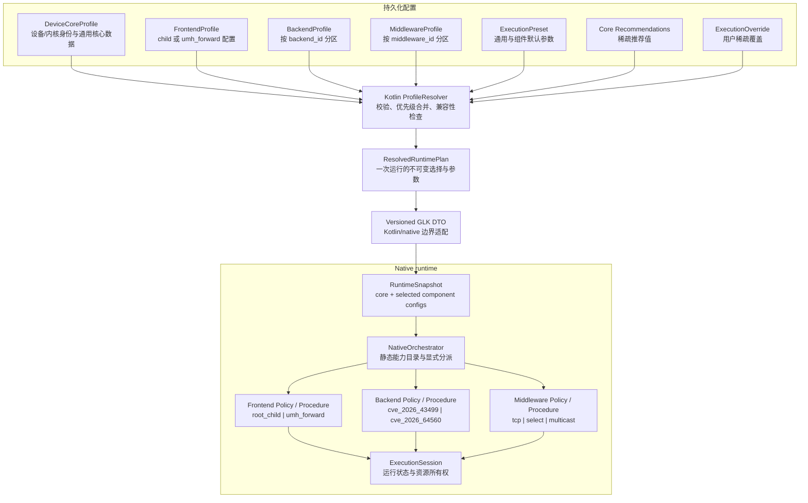

# Native 组件架构与配置解耦计划（2026-09-23）

## 现状与基线

- 分支：`very-not-stable-dev`
- HEAD：`b411bb4`
- 兼容基线按用户明确指定为主线，不以当前 dev 架构或数据格式作为长期兼容承诺。仓库快照中 `remote/main` 为 `10001ae`；`git rev-list --left-right --count remote/main...very-not-stable-dev` 为 `0 351`，即当前 dev 有 351 个主线之外的提交。
- 代码行为基线为 `b411bb4`。初次设计时工作树约有 70 个修改/未跟踪路径；用户随后要求回滚未提交的实现改动，tracked 源码现已恢复，未跟踪的设计/规范文档作为本次文档提交内容保留。不得重放未经设计的旧实现改动。
- 当前 Profile 主链：内置 HOCON、导入配置与稀疏用户 override 由 `AndroidProfileConfigController` 合并；`NativeProfileDocument` 编码 GLK1 v2；native 的 `kernel_offsets` 经 `TargetProfile` 封装为只读快照。
- 主线 `remote/main` 的数据/入口契约不同：设备内置数据由 `src/kernels/offsets.h` 汇总，用户 `offsets.json` 覆盖匹配设备的 built-in 值；App 旧入口无参数启动 native。当前 `--ghostlock-app-call` + GLK1 和 HOCON Profile 属于 dev 后续改动，可重做；主线 JSON 只通过 legacy 边界转换，不能把 legacy converter 扩展为新 route 配置入口。
- 当前 native 扩展点是 route：`RouteKind` / route catalog、编译期 `Policy`、`Procedure` 和 route 生命周期。TCP zerocopy、select stack、multicast waiter 是现有 route 实现。
- 当前 W1/W2/W3、victim child 和 handoff 位于共享 session/procedure 周边；CVE-2026-43499 futex collision 属于漏洞后端职责的目标划分；UMH 转发前端与 CVE-2026-64560 后端是规划项，尚未作为组件集成。
- 现有配置已包含 route 调优，但设备核心字段与 runtime tuning 的文件边界、Kotlin 模型边界仍需收敛。`recommend_shizuku` 是 App 路径建议，不是 native 核心布局。

## 目标与约束

### 目标

1. 将设备核心 Profile、前端、漏洞后端、中间件和执行调优建模为独立配置域。
2. 让 Kotlin 与 native 对跨进程共享的**解析后组件配置**保持字段语义一致；存储模型、UI 编辑态和 Kotlin 策略元数据不要求与 native 类型镜像。
3. 用单一 `ResolvedRuntimePlan` 明确一次运行选用的 frontend、backend、middleware 及各自配置，避免以一个 `route` 字段代表整个执行链。
4. 支持现有 child frontend、三种 middleware、CVE-2026-43499 backend，以及后续 UMH frontend、CVE-2026-64560 backend 的独立注册和兼容性检查。
5. 保持当前 Agent 规范指定的 HOCON 为新配置权威输入；跨 Kotlin/native 的状态只能通过版本化 profile DTO 或项目已允许的文件/进程通道传递。保留主线 `offsets.json` 导入互操作，由 legacy converter 一次性映射到新 CoreProfile；wire 版本按新模型重新确定，不兼容 dev 专有 GLK v2。

### 设计原则

- 组件关系由 Orchestrator 组合；frontend、backend、middleware 不直接依赖其他组件的具体类。
- 配置按组件 ID 命名空间隔离：`frontend.<id>`、`backend.<id>`、`middleware.<id>`。未知组件 ID、未知字段、缺少必需配置或不兼容组合必须产生可诊断错误，不得静默套用另一组件参数。
- 每个组件声明稳定 ID、schema 版本、能力与适用条件；“用户推荐”与“组件实际支持”分开表达。profile 声明不是支持认证，真机 gate 才能记录设备支持状态。
- Native 继续遵守项目限制：不用虚基类作为 route/provider 扩展机制；PI 竞争窗口中不引入间接调用。组件选择在敏感执行区间外完成，使用编译期 Policy、具名 Procedure 与显式静态分派。新架构不得增加可变全局状态。
- Kotlin 核心字段与 native core snapshot 尽量一一对应。格式/展示元数据、导入来源、编辑状态、`recommend_shizuku` 留在 Kotlin；App 在 DTO 边界处理兼容，不要求 native 消费这些字段。
- 新配置先进入解析后的强类型 DTO，再由 native adapter 转成各组件配置；组件实现不读取 HOCON，也不直接解析 wire bytes。

### 非目标

- 本计划只定义组件与配置架构，不设计或记录漏洞利用步骤、内存写入细节、偏移生成方法或绕过实现。
- 不在同一批次重写 `kernelsnitch/`、legacy v1 导入路径、现有 CVE 后端内部实现或现有 middleware 算法。
- 不把 UMH 作为所有设备的默认 frontend，不据架构存在推断设备兼容性。
- 不在组件架构迁移中同时调优 race、重试、CPU 亲和性等执行行为。

## 目标模型



组件组合是计划中的选择，不是承诺所有排列都兼容。Orchestrator 应根据各组件静态声明的能力/约束验证组合，并在执行前拒绝不兼容计划。Session 只承载经审查的公共运行状态与资源所有权，不成为组件任意共享数据的容器。

### 合并规则

对允许调优的叶字段，解析优先级从低至高为：通用 preset → 所选组件 preset → 核心 Profile 的稀疏推荐 → 用户 override → 本次显式会话选择。CPU 对等会话输入不得被设备推荐暗中替代。核心偏移、route/provider ID 和必需能力不属于 tuning override 白名单。

### 模型对应与例外

| 语义域 | Kotlin 持久化/编辑模型 | Kotlin 解析后 / native DTO | 对应规则 |
|---|---|---|---|
| 设备核心 | `DeviceCoreProfile` | `CoreRuntimeConfig` | 字段语义与值域逐项对应；Kotlin 可有文件元数据，native 不接收无关元数据 |
| frontend/backend/middleware 选择 | 组件引用与独立配置段 | 组件 ID + 该组件强类型配置 | ID、schema 版本和字段语义一致；各组件内部类无需全局同构 |
| execution tuning | preset、recommendation、override 分层 | 合并后的 `ExecutionSettings` | 仅解析后的值跨边界；native 不知道值来自哪一层 |
| `recommend_shizuku` | Kotlin App 策略元数据 | 不放入 native core DTO | 明确例外；如旧 wire 仍有槽位，由 Kotlin 兼容适配处理，不作为 native 能力 |
| schema、导入来源、编辑差异 | Kotlin 专有元数据 | 不传输 | App 侧消费 |
| safe mode / 本次运行选择 | 会话或运行选项 | 明确的 runtime option | 不写入设备核心 Profile 或通用 preset |

## 具体数据结构与类边界

本节定义接口形状，不规定漏洞原语、偏移计算或内存操作。具体字段仍由各自组件 schema 单独评审。下列 C++ 类型是架构草图；落地时应优先复用现有类型，并通过边界 adapter 避免重复存储。

### Kotlin 持久化与解析模型

Kotlin 持久化模型表达“配置从哪里来、编辑了什么”；解析模型表达“本次实际选择什么”。两者分开定义：

```kotlin
@JvmInline value class ComponentId(val value: String)
@JvmInline value class ExecutionKey(val value: String)

data class DeviceCoreProfile(
    val release: String,
    val schemaVersion: Int,
    val kernelMajor: Int,
    val core: CoreKernelConfig,
    val recommendations: CoreRecommendations = CoreRecommendations(),
)

data class ComponentProfiles(
    val frontends: Map<ComponentId, FrontendProfile>,
    val backends: Map<ComponentId, BackendProfile>,
    val middlewares: Map<ComponentId, MiddlewareProfile>,
)

data class ComponentSelection(
    val frontend: ComponentId,
    val backend: ComponentId,
    val middleware: ComponentId,
)

data class SparseExecutionValues(val values: Map<ExecutionKey, UInt>)

data class ResolvedRuntimePlan(
    val core: CoreKernelConfig,
    val selection: ComponentSelection,
    val frontend: FrontendConfig,
    val backend: BackendConfig,
    val middleware: MiddlewareConfig,
    val execution: ExecutionSettings,
    val options: RuntimeOptions,
)
```

`CoreKernelConfig`、`FrontendConfig`、`BackendConfig`、`MiddlewareConfig` 和 `ExecutionSettings` 使用 sealed/typed 子模型，不让任意 dotted path Map 直接穿过领域层。HOCON adapter 可以暂时读写 `ValueMap`，但应在输入边界验证字段并立即转成 typed model。`recommend_shizuku` 单独保留在 App 策略模型，不放入 `ResolvedRuntimePlan.core`。

### Native C++23 运行模型

```cpp
namespace ghostlock::runtime {
    struct ComponentId final {
        std::string_view value;
    };

    enum class FrontendKind : std::uint8_t { RootChild, UmhForward };
    enum class BackendKind : std::uint8_t { Cve2026_43499, Cve2026_64560 };
    enum class MiddlewareKind : std::uint8_t {
        TcpZerocopy, SelectStack, MulticastWaiter
    };

    struct RuntimeOptions final {
        bool safe_mode;
        // Run-scoped options only; no App presentation metadata.
    };

    struct ComponentSelection final {
        FrontendKind frontend;
        BackendKind backend;
        MiddlewareKind middleware;
    };

    struct RuntimePlanView final {
        const profile::TargetProfile& core;
        ComponentSelection selection;
        const FrontendConfig& frontend;
        const BackendConfig& backend;
        const MiddlewareConfig& middleware;
        const ExecutionSettings& execution;
        RuntimeOptions options;
    };

    struct RunResult final {
        RunCode code;
        RunStage stage;
        bool clean;
    };
}
```

The concrete config types should use discriminated unions, such as `std::variant<RootChildConfig, UmhForwardConfig>`, for transport/validation. Convert them to a checked `RuntimePlanView` before dispatch. Within native, use existing typed route layout/config types wherever suitable; do not copy their fields into a second parallel structure.

The component contract is compile-time policy-based rather than virtual:

```cpp
template <class Config>
struct ComponentPolicy {
    static constexpr auto kind = /* stable enum value */;
    static bool supports(const RuntimePlanView&) noexcept;
    static RunResult run(ExecutionSession&, const RuntimePlanView&) noexcept;
};

template <class Frontend, class Backend, class Middleware>
RunResult run_pipeline(ExecutionSession& session,
                       const RuntimePlanView& plan) noexcept;
```

These declarations show ownership and call direction only. Implementations must keep the repository's existing route lifecycle and critical-section invariants. `supports()` is pure/read-only and runs before component setup. Policy types must be host-compilable; Android-only work remains in the Android-specific procedure/adapter boundary.

### Native classes and ownership

| Type | Owns / responsibility | Must not own |
|---|---|---|
| `RuntimePlanDecoder` | Decode a supported GLK version; reject malformed/unknown required data | HOCON parsing, UI/import state |
| `RuntimePlanValidator` | Validate IDs, schemas, required fields and compatibility before dispatch | Component execution state |
| `NativeOrchestrator` | Select a compile-time pipeline outside sensitive windows; coordinate stage lifecycle | Per-component hidden singleton state |
| `ExecutionSession` | One run's common state, cancellation/result, shared resource ownership | Arbitrary component-specific scratch data |
| `FrontendPolicy` / procedure | Frontend-specific startup and handoff contract | Backend/middleware implementation details |
| `BackendPolicy` / procedure | Backend-specific availability, preparation and result contract | Frontend process ownership or middleware-specific layout |
| `Middleware Policy` / route | Route-specific lifecycle and configuration use | Frontend selection or backend private state |
| `RuntimeProfileAdapter` | Map the stable wire/core DTO to existing `TargetProfile` and component configs | Decision-making based on App-only metadata |

Do not add `std::function`, virtual dispatch, callback tables, or type-erased function pointers to the execution path. `std::variant` is appropriate at the decode/validation boundary; `std::visit` is limited to non-sensitive normalization if used. The selected pipeline itself is instantiated through direct template calls.

## C++23 特性选用

| C++23/modern C++ feature | Use | Constraint |
|---|---|---|
| `enum class` with fixed underlying type | Stable component IDs in the wire DTO and switch dispatch | Explicit numeric values; never serialize compiler enum layout implicitly |
| `std::expected<T, E>` | Decoder/validator/factory errors with typed error codes | Error paths remain explicit; no exceptions across native process boundary |
| `std::variant` | Typed config alternatives at the DTO boundary | No unchecked `get`; validate kind/config match before constructing runtime view |
| `std::optional<T>` | Truly optional recommendations/fallback choices | Absence must not be confused with numeric zero/default config |
| `std::span<const T>` | Read-only descriptor/field tables and test fixtures | Non-owning lifetime must be scoped to immutable catalogs |
| `std::string_view` | Static component IDs and diagnostic labels | Never retain a view into a temporary decoded buffer |
| Concepts / `static_assert` | Verify Policy interface and allowed config types at compile time | Compile-time checks must not introduce runtime indirection |
| `constexpr` / `consteval` tables | Static component catalog and enum-token agreement | Tables are immutable; no registration-time mutable globals |
| designated initializers | Readable construction of config/result aggregates | Keep declaration order aligned with project's compiler support and avoid ABI serialization |
| `std::visit` | Optional validation of config variant before execution | Do not use as a critical-window dispatch mechanism |

Do not adopt C++23 library features solely for novelty. Before using `std::expected`, confirm the Android NDK libc++ level configured by the project. Where support is insufficient, use a small project-local result type with the same explicit semantics; do not introduce exceptions as a substitute.

## Call chain (pseudocode only)

### App/configuration to native plan

```text
ProfileController.load(deviceRelease, cpuSelection)
  -> HoconProfileStore.loadCore(deviceRelease)
  -> ComponentProfileStore.loadReferencedProfiles()
  -> ExecutionPresetStore.loadCommonAndComponentDefaults()
  -> OverrideStore.loadSparseOverrides()
  -> ProfileResolver.resolve(inputs)
       -> validateCore(core)
       -> resolveSelections(recommendations, explicitChoices)
       -> validateComponentSchemas(selection, componentProfiles)
       -> validateCompatibility(frontend, backend, middleware)
       -> mergeExecution(defaults, recommendations, overrides, sessionChoices)
       -> return ResolvedRuntimePlan or typed ConfigError
  -> RuntimePlanCodec.encode(plan, supportedWireVersion)
  -> ProcessBuilder.start(nativeExecutable)
  -> stdin.write(versionedRuntimeDocument)
```

### Native decode and preflight

```text
main
  -> RuntimePlanDecoder.decode(stdin)
       -> accept supported wire versions
       -> decode core and selected component sections
       -> reject malformed or unknown required sections
  -> RuntimePlanValidator.validate(decodedPlan)
       -> validate component IDs and config-kind correspondence
       -> validate compatibility constraints
       -> build immutable RuntimePlanView
  -> NativeOrchestrator.run(planView)
```

### Static dispatch outside sensitive execution windows

```text
NativeOrchestrator.run(plan)
  -> switch plan.selection.frontend
       -> switch plan.selection.backend
            -> switch plan.selection.middleware
                 -> run_pipeline<RootChildPolicy, Cve43499Policy, TcpPolicy>(session, plan)
                 -> run_pipeline<RootChildPolicy, Cve43499Policy, SelectPolicy>(session, plan)
                 -> ... only catalogued combinations ...
       -> ...
  -> return RunResult

run_pipeline<Frontend, Backend, Middleware>(session, plan)
  -> Frontend::preflight(plan)
  -> Backend::preflight(plan)
  -> Middleware::preflight(plan)
  -> if any preflight fails: return typed failure
  -> construct procedure composition with direct typed calls
  -> run existing shared session lifecycle
  -> collect component statuses
  -> disarm/cleanup through the owning component/session
  -> return RunResult
```

The pseudocode intentionally omits vulnerability operation details. The catalog should enumerate only reviewed combinations; nested switches must reject all other tuples. Do not build a runtime callback graph and do not perform component selection inside the PI-sensitive window.

### Failure and cleanup flow

```text
decode/validation failure
  -> emit ConfigError(stage, componentId, fieldPath)
  -> do not create execution resources

preflight failure
  -> stop before entering the selected pipeline
  -> unwind only resources already acquired by their owner

component failure
  -> map to typed RunResult and existing RouteStatus-compatible reporting
  -> session requests orderly teardown
  -> each component disarms/destroys only resources it owns
  -> return result to app through existing stdout/exit-code contract
```

## 批次 1 的具体字段契约草案

| Kotlin concept | Native concept | Transport | 说明 |
|---|---|---|---|
| `DeviceCoreProfile.release` | `TargetProfile::release()` | required core header field | 与现有 uname release gate 对应 |
| `CoreKernelConfig` | 现有 `TargetProfile` 核心 accessor 集合 | core section | 字段语义保持一致；按现有签名类型映射 |
| `ComponentSelection` | `runtime::ComponentSelection` | required component selection section | 独立 frontend/backend/middleware ID，不复用单一 route byte |
| `FrontendConfig` | `FrontendConfig` variant | selected frontend section | section ID 必须与 selection ID 一致 |
| `BackendConfig` | `BackendConfig` variant | selected backend section | 不共享不同 backend 的私有字段命名空间 |
| `MiddlewareConfig` | existing route config + middleware DTO | selected middleware section | 老 route schema 通过迁移 adapter 读入 |
| `ExecutionSettings` | native execution settings | resolved execution section | 所有来源已在 Kotlin 合并；native 收到确定值 |
| `recommend_shizuku` | 无 native 对应字段 | Kotlin only | 从新 wire 语义移除；旧 v2 兼容 adapter 单独处理 |
| `RuntimeOptions.safe_mode` | runtime option | option section | 运行期参数，不属于设备几何或 preset |

正式实现前，应把上表扩成逐字段 schema：名称、类型、必需性、范围、默认来源、是否允许用户覆盖、Kotlin/native 对照测试。不得在本计划中猜测新增 backend 的设备偏移字段。

## 数据流与控制流变化

```text
现状：HOCON + tuning 解析
  → 单一 resolved profile
  → GLK1 v2
  → native TargetProfile / RouteController

目标：DeviceCoreProfile + component profiles + presets + overrides
  → Kotlin resolver 校验并生成 ResolvedRuntimePlan
  → 版本化 GLK DTO
  → native RuntimeSnapshot
  → Orchestrator 校验组件兼容性并静态分派
  → frontend + backend + middleware 在同一 ExecutionSession 合作
```

不变量：

1. 核心 Profile 缺字段时不得由执行 preset 填补核心数据。
2. 某组件未被选择时，其组件配置不得进入本次 RuntimeSnapshot。
3. fallback（若保留）必须作为组件选择策略建模并显式校验，不得与 middleware ID 混为一谈。
4. `recommend_shizuku` 不决定 native backend/frontend/middleware，也不进入 native 核心能力判定。
5. 配置解析结果在 native 执行期间只读；组件状态仅由其所有者或 ExecutionSession 按契约管理。
6. 新模型写出版本须有显式版本号和拒绝未知必需能力的规则。dev 独有的 GLK v2、HOCON profile schema、组件接口和行为不构成必须保留的兼容契约；Batch 0 只识别并保留主线实际存在且仍需支持的输入/接口。

## 改动清单（按批次）

### [x] Batch 0：基线与工作树归属

- [x] 新建 `docs/analysis/native-component-architecture-plan.md`。
- [x] 核对 dirty worktree：未提交的 tracked Profile/config 实现改动已按用户要求恢复；当前提交 `4ed4d84` 只包含文档。历史上约 70 个 dirty/untracked 路径不再是当前工作区状态，旧实现不重放。
- [x] 核对兼容基线：`remote/main`=`10001ae`；`remote/main...very-not-stable-dev` 为 `0 351`。主线有 built-in `src/kernels/offsets.h`、用户 `offsets.json` 匹配/覆盖和无参数 native 入口；GLK1 app-call/HOCON Profile 是 dev 专有实现。
- [x] 核对历史 device-gate：`NSFUNC-20260922-multicast-pass`（提交 `c700d121`）与 `NSMOD-20260922-route-concept-profile-binary-multicast-pass`（`d855fb3`）记录 A301SO / kernel `5.15.189-android13-8-00016-g51bba4309aac-ab14546557` 冷启动、KernelSU 未加载时 Multicast PASS；这些是旧实现证据，不代表新组件已验证。
- [x] 以 `ANDROID_NDK_HOME=/Users/nickji/Library/Android/sdk/ndk/30.0.16248370 make -B -C src ghostlock` 从文档提交 `4ed4d84` 对应源码强制重建 baseline；命令成功且没有 compiler warning。`build/native/ghostlock` 与 `/private/tmp/ghostlock-baseline-4ed4d84` SHA-256 均为 `2039b06eaf39c9f9b4ec9f47b99636a5ab417409aebc6e9dee4101d5e7781ca3`。历史设备门禁只有上述 A301SO；其他组合须另行确认设备。

### [x] Batch 1：CoreProfile 与执行调优分离，保持运行行为

- [x] `app/src/main/kotlin/com/ghostlock/app/data/AndroidProfileConfigController.kt`：把当前解析流程收敛为 typed `CoreProfile`、`ExecutionPreset`、稀疏 `ExecutionRecommendation`、`ExecutionOverride` 和 `ResolvedProfile`；HOCON `ValueMap` 只留在读写边界。
- [x] `app/src/main/kotlin/com/ghostlock/app/data/`：添加 core 与 tuning 类型及 HOCON adapters。此批只拆设备核心值与现有通用/route tuning，不提前加入 UMH/CVE-64560 的运行时组件选择模型。
- [x] `app/src/main/assets/kernel_profiles/`：设备 release 文件只留 core 字段及可选稀疏 execution recommendation；单独存放一份通用 tuning preset 和现有 middleware/route 的默认 tuning；模板、index 和配置导出同步更新。
- [x] `build.gradle.kts`：exporter 读取新存储结构并应用与 App 相同的优先级；通过 cross-check fixture 保证两个解析入口输出一致，不复制一套无测试的合并语义。
- [x] `app/src/test/**`：测试主线 `offsets.json` 经既有 legacy converter 到 CoreProfile 的转换；测试 HOCON typed parse、优先级、unknown/missing 字段拒绝、recommend_shizuku 隔离及解析后的 NativeProfileDocument 等价性。
- [x] `docs/kernel_profiles/PROFILE_SCHEMA*.md`、`README*.md`：更新 schema、迁移和中英文说明。
- [x] 本批只改 Kotlin/HOCON/Gradle 导出与测试，不改 native 执行路径和 wire 编码；以本批前 `4ed4d84` code baseline 的解析结果作为行为对照，不承诺保留 dev 格式供未来版本读取。`recommend_shizuku` 留在 Kotlin 策略路径。

### [x] Batch 2：Kotlin/native 版本化组件 DTO

- [x] `app/src/main/kotlin/com/ghostlock/app/data/NativeProfile.kt`：拆成 core DTO、component DTO、runtime options 与 wire codec；保持 codec 不承载存储来源信息。
- [x] `src/core/profile/model.h`、`binary.h`、`binary.cpp`：定义 native 对应的只读 runtime/core/component DTO 和新版本解码适配。仅当 Batch 0 证明某旧 wire 格式属于必须支持的主线契约时，才保留该 reader；dev 独有的 GLK v2 reader 可直接替换。
- [x] `src/core/profile/**` 与 Android app 的 binary tests：逐字段校验类型、signedness、默认值、未知字段/版本行为及 round-trip。
- [x] wire 版本及二进制字段表只允许在本批变更；禁止 Kotlin/native 字段顺序各自手维护却无一致性测试。
- [x] `recommend_shizuku` 留在 App 模型；无需为 dev 独有旧 v2 字段继续保留 native 语义槽位。

### [~] Batch 3：native Orchestrator 与现有组件目录化（部分完成）

> 静态审查（2026-09-23）后修正：本批实际只落地组件 catalog 与薄 Orchestrator 骨架；下列条目并非全部完成。

- [~] `route_policy.hpp` 标注为 middleware catalog；`orchestrator.hpp` 校验 selection 后仍调用既有 `make_exploit_procedure`。`route_controller.*`、`exploit_procedure.*` 未改动。
- [ ] `session/**` 仅新增说明性注释，未提供可审计的创建/借用/释放/终结点追踪；`g_exploit_session` 唯一性未变。
- [ ] 三种 middleware 未改（算法/时序不变）；未“接入新的配置 DTO”——Orchestrator 尚未消费 wire 的 frontend/backend 选择（`main.cpp` 仍硬编码；v3 解码器未读取 frontend/backend 且把 middleware ID 截成 u8）。
- [ ] backend contract 未实现（无可用性/状态接口；CVE-2026-43499 仅登记在 catalog）。
- [~] `component_catalog_test` 覆盖 ID/可用性/组合拒绝；生命周期与资源清理测试未新增。
- [x] 攻击路径语义未变：`cmp_disasm` 对 Batch 0 基线 7 函数 IDENTICAL + `do_one_write` 既有 LAYOUT-SHIFT，PASS；冷机 multicast direct 真机 gate PASS（`B3-20260923-multicast-direct-pass`）。
- [ ] 剩余项转 Batch 3.1（与 Batch 1/2 审查 F4 合并）：v3 解码 frontend/backend ID 精确校验并接通 `main → selection`；Session 可审计所有权追踪；生命周期/清理测试。

### [x] Batch 3.1：接通 DTO→Orchestrator、Session 所有权与 Batch 1/2 审查修复

- [x] v3 解码两侧精确校验 frontend/backend/middleware（native `binary.cpp` + Kotlin `fromBinaryV3`），middleware 不再 u8 截断；`parse`/`entry` 新增 `component_ids` 输出（**不改 `kernel_offsets` 布局**），`main.cpp` 用 wire 选择构造 `ComponentSelection`（legacy 回落 decoded route）。
- [x] `ExploitSession` 升级为逐字段所有权契约表（owner / created / borrowers / release / termination）。
- [~] 生命周期/清理测试：route 生命周期由既有 `route_lifecycle_test`/`route_policy_test` 覆盖，selection 拒绝由 `component_catalog_test` 覆盖；组件层未新增清理测试（无新增资源）。
- [x] Batch 1/2 审查修复 F1–F8：F1 v3 `safe_mode` 只经 core 槽 + `safeModeOffset` 按 header version 分派（golden 重生成）；F2 route 调优逐字段合并 preset；F3 exporter 输出限定等于配置的 `build` 生成目录并 staging→backup→rollback（失败保留旧输出，非严格原子）；F4 同上；F5 CPU 会话对优先于 imported/override；F6 exporter 以 `index.conf` 为准、失败即报错、不导出模板；F7 `validateMerged` 区分缺失/类型/零且 exporter 调用；F8 `ExporterAgreementTest` 目录缺失即失败 + 测试依赖 exporter。
- [x] 复审修正 II：exporter 输出限定在 `build` 生成目录、staging→backup→rollback（失败保留旧输出）；`index.conf` 坏项严格拒绝；`ExporterAgreementTest` 断言导出集合与索引非模板项一致；`ExploitSession` 标注 race 终结在 route 卡住时**未闭环**；`profile_binary_test` 断言成功解码的 `component_ids`；`ProfileRoundTripTest` 加 v3 错误组件 ID 回归。
- [ ] F9（typed 主链）另立 Batch 2.5。

### [~] Batch 4：frontend provider 接入（契约脚手架，非解耦）

> 用户确认：D1=A 薄声明 / UMH unavailable / 不做 UI / D4 重新门禁。契约只表达编译期 ID、可用性与故障原因；`ExploitProcedure` 仍承载 child/W1–W3/handoff，**不代表 frontend 已拆分**。

- [~] root-child 边界（D1=B 实拆，切片 1）：`handoff` 已迁为 `session/root_child_frontend.{hpp,cpp}` 的 `run_root_child_handoff`，`ExploitProcedure::handoff` 转薄转发；`handoff_probe` 仍为 root handoff/KernelSU 验证（与 child 生命周期分列）。`cmp_disasm` 8 函数 PASS（候选 `4ee24fbc…`）。
- [ ] D1=B 剩余：`run_pipeline<Frontend,Backend,Middleware>` 形式化组合；D3 模型预留（App frontend 字段/available 语义）。
- [x] UMH frontend 占位：`route/frontend_contract.hpp` 声明 `umh_forward` `available=false` + 原因，无执行路径。
- [ ] `app` 配置模型与 UI：按 D3 本批不做（UMH 无真机证据前不暴露选择）。
- [x] 拒绝分层：解析层只拒未知 ID；`umh_forward`/`cve_2026_64560` 解码后由 Orchestrator 攻击前以明确错误拒绝；host/Kotlin 测试覆盖。
- [ ] 真机门禁：**非确定，未完成同条件复现**（`B4-20260924-multicast-w3-pi-panic-fail.md`）——运行 A（CPU `5/6`）`W2` route 中断、pstore `rt_mutex_adjust_prio_chain` via `sched_setattr`；运行 B（CPU `0/1`）完整 PASS；CPU 对不同、日志无候选 SHA → 非受控对照，与该非确定风险一致但未确认，也不归因 Batch 4 源码。Batch 4 不算完成，待固定 CPU 对同构建复跑。

### [ ] Batch 5：backend 扩展点及第二后端接入

- [ ] `src/core/` 新增 backend catalog/contract 和 CVE-2026-64560 backend 模块；该模块以独立 profile schema 声明其核心配置需求。
- [ ] `app` 增加对应 backend profile 类型与校验；native 只消费已校验的类型化配置。
- [ ] 对兼容性、生命周期、清理、wire 解码和失败隔离做独立测试；设备支持状态必须由对应设备 gate 证据决定。
- [ ] CVE-2026-43499 继续作为独立 backend；不得把其配置强行复用成 CVE-2026-64560 的默认值。

### [ ] Batch 6：文档收敛与旧格式退场评估

- [ ] `docs/kernel_profiles/PROFILE_SCHEMA*.md`：最终字段表和迁移说明。
- [ ] `docs/development/adding-a-route.md`：仅当其职责扩展至新增 frontend/backend/middleware 时，改为或链接唯一权威的 component-extension 指南。
- [ ] `src/core/README.md`：native 组件目录、编译边界、Session 所有权和测试入口。
- [ ] `AGENTS.md`：更新稳定架构规则与权威文档索引。
- [ ] 旧字段/旧 v2 writer 是否移除须另有兼容数据与发布策略证据，不在前序批次顺手删除。

## 兼容性与回滚

- **兼容性范围**：以主线 `remote/main`（调查快照 `10001ae`）实际存在的用户 `offsets.json`、built-in offset 源、native 进程入口及 stdout/exit 行为为准。当前 dev 相对该主线的 351 个提交所引入的 Profile schema、GLK v2、API、组件结构和运行行为均可替换或移除，不要求双读、迁移或二进制兼容。
- 主线 `offsets.json` 是需要保留的用户数据互操作格式；在 legacy converter 边界转换成新 typed core model。新增 frontend/backend/middleware 配置不得塞入旧 JSON converter。
- 新 HOCON schema 与 Kotlin/native DTO 可按本计划直接形成新版本；未知 required component/schema 必须 fail closed 并给出可诊断错误。旧 dev GLK v2 无兼容要求；新 App 入口需保留主线面向用户的启动行为或提供明确、可测试的等价入口。
- 回滚以源码批次、构建产物和配置快照为单位，不承担向 dev 旧 schema/wire/API 回滚兼容的义务。每批保留可复现构建和验证记录；发现差异时先查明映射，不用默认值掩盖。
- 用户明确允许丢弃 dev 相对 main 的改动，不等于可直接删除当前未提交工作树内容。实施时可用新设计替代这些内容，但不得用破坏性清理命令清除尚未核对的本地修改。

## 验证矩阵

| 批次 | 自动验证 | 必须保持/观察的证据 |
|---|---|---|
| 0 | `git status`、`git rev-list`、主线输入/入口契约检查、历史 gate 检索 | 已记录当前清洁代码基线、主线 offsets.json/入口契约、A301SO 历史 Multicast gate 及限制 |
| 1 | `./gradlew :app:testDebugUnitTest`、`./gradlew exportKernelProfiles`、主线输入转换 fixture | 主线实际输入可转换；dev 旧 profile 无兼容要求；解析优先级/拒绝规则测试通过 |
| 2 | `make -C src native-host-tests`、`:app:testDebugUnitTest`、新 codec round-trip 与 cross-language fixture | 主线需要的输入/进程契约保持；新 Kotlin/native 字段表一致；无静默截断/默认化 |
| 3 | `make -C src native-host-tests`、`make -C src ghostlock`、`make -C src lint-tidy` | 三种现有 middleware 在新目录选择下语义不变；攻击函数 `cmp_disasm` 对照基线 |
| 4 | host tests、NDK build、lint-tidy、frontend contract tests | root-child 行为不变；UMH unavailable/error 路径可诊断；设备 gate 单独记录 |
| 5 | host tests、NDK build、lint-tidy、backend/profile compatibility tests | 两个 backend 配置互不误用；未 gate 的组合不标 supported；攻击函数 diff 经审核 |
| 每个触及攻击路径的批次 | `python3 tools/cmp_disasm.py <baseline> build/native/ghostlock`；按 AGENTS 要求真机门禁 | 8 个函数 IDENTICAL 或经复核差异；冷启动、固定 CPU 对、单组合、KernelSU 未加载；日志归档 PASS/FAIL |

按仓库门槛，L 级计划的每个实现批次还须完成 host tests、NDK 零告警、lint-tidy 0 findings；触及攻击关键路径时须完成 `cmp_disasm` 和真机 gate。目标设备不可用时该批保持未完成，不以 host 测试代替设备支持结论。

## 明确保留

- `kernelsnitch/` 上游移植实现和 legacy v1 converter。
- 现有 CVE-2026-43499、W1/W2/W3、三种 middleware 的算法、时序、payload 与内存布局，除经单独批准的实现任务外。
- 主线确实提供的用户输入/导入与 native 进程入口契约；dev 独有的 GLK v2 reader、HOCON profile 数据和组件 API 不列为保留项。
- 进程启动仍通过 ProcessBuilder/文件/已定义 profile DTO，不引入 JNI 或未经批准的跨层通道。
- 不新增可变 native 全局、不在 PI 竞争窗口内增加间接调用、不引入虚基类 provider。
- `recommend_shizuku` 继续由 App 决定 Shizuku 建议/路径，不纳入 native core capability。

## 进度

- [x] 只读调查当前 Profile、route、session 和 native 扩展规则。
- [x] 建立未来组件组合图及配置模型边界。
- [x] 写出本计划与分批改动清单。
- [x] 用户评审并认可计划，授权开始执行。
- [x] Batch 0：确认当前工作树状态、主线兼容输入与历史 gate 证据；干净 baseline 构建留待 Batch 1 开始前完成。
- [x] Batch 1：CoreProfile 与执行调优存储/解析模型解耦并保持 native 输入等价。（host 测试、golden 字节等价与 exporter 一致性通过；未触 native，无需真机 gate）
- [x] Batch 2：定义并验证版本化 Kotlin/native 组件 DTO。（v3 wire + v2 兼容；host tests、Gradle、NDK 零告警、lint-tidy 0 findings）
- [~] Batch 3：部分完成（catalog + 薄 Orchestrator 骨架）。cmp_disasm PASS、host/NDK/lint 通过、冷机 multicast 真机 gate PASS。
- [x] Batch 3.1：DTO→Orchestrator 接通（component_ids）、Session 逐字段所有权表、Batch 1/2 F1–F8 修复。（cmp_disasm PASS、host/Gradle/lint 通过；F9 typed 主链转 Batch 2.5）
- [ ] Batch 4：接入 frontend 扩展点及 UMH frontend。
- [ ] Batch 5：接入 backend 扩展点及 CVE-2026-64560 backend。
- [ ] Batch 6：文档收敛和旧格式退场评估。
