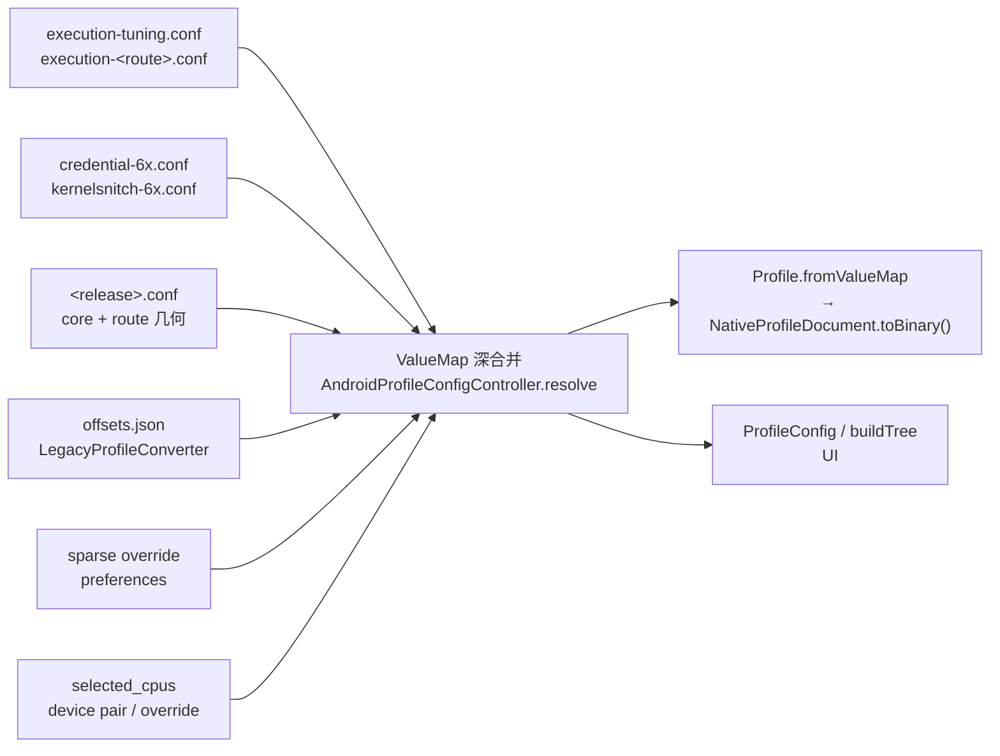

# Native 组件架构 Batch 1 设计：CoreProfile 与执行调优解耦（2026-09-23）

> 本文件是 `docs/analysis/native-component-architecture-plan.md` 中「Batch 1」的逐字段细化设计。
> 总计划给出组件与配置架构；本文件只负责 Batch 1 的落地形状、文件契约与验证。
> 冲突时以总计划为准，并回写本文件。

## 现状与基线

- 分支 `very-not-stable-dev`；文档提交 `f3a4c90`；代码基线 `b411bb4`（`4ed4d84` 的源码快照）。
- Batch 0 已确认：工作树干净，`remote/main`=`10001ae`，主线 `remote/main...very-not-stable-dev` 为 `0 351`。
  主线输入是 `src/kernels/offsets.h` 内置偏移、用户 `offsets.json` 覆盖与无参数 native 入口；dev 的
  GLK1 app-call、HOCON profile 与组件 API 不构成必须保留的兼容契约。
- 本次只读调查的事实（作为设计依据，命令见文末证据）：
  1. `app/src/main/assets/kernel_profiles/*.conf` 中，除 `execution-*.conf` 外没有任何设备文件在自身
     声明 `execution` 覆盖；tuning 一律经 `include "execution-tuning.conf"` 与
     `include "execution-<route>.conf"` 进入（`6.1.138-...-mi.conf` 同时 include tcp 与 select）。
  2. 设备文件的顶层键只有 `release`、`schema_version`、`kernel_major`、`recommend_shizuku`、
     `route`、`fallback`、`kernelsnitch`、`task_struct`、`cred`、`offset`，以及可选的
     `kernel_phys_load`。没有本地 execution 覆盖。
  3. `NativeProfile.kt` 已经存在 typed 结构：`TaskStructOffsets`、`CredTemplate`、
     `KernelOffsetTable`、`ExecutionTuning`，以及 wire codec `NativeProfileDocument`（magic
     `0x0D000721`、version `2`、68 个 common 槽 + per-route 段）。
  4. `AndroidProfileConfigController`（927 行）在同一处承担：HOCON 解析、include 展开、分层合并、
     typed 值抽取、几何校验、UI 树构建、sparse override 持久化、快照渲染与 native 文档构造。
  5. `build.gradle.kts` 的 `exportKernelProfiles` 用 Typesafe Config 重新实现了一套解析/合并
     （`expand`/`parse`/`fillRouteExecution`/`nativeValue`/route 字段表），与 App 的实现相互独立，
     当前没有一致性测试锁定两者。
  6. `recommend_shizuku` 由 App 策略路径消费（`BuiltinProfileCatalog`、`UserProfileStore`、
     `AndroidGhostlockRepository`、`GhostlockViewModel`），不参与 native 执行选择。
  7. 主线 `offsets.json` 经 `LegacyProfileConverter`（幂等、内存内、不重写文件）转成当前
     `ValueMap` 布局；`ProfileMigrationEquivalenceTest` 已用 `remote-main-6x-offsets.json`（50 个
     6.x release）断言 legacy 导入与 builtin 解析结果一致。

### 现状数据流



问题：core 与 tuning 混在同一 `ValueMap`；解析、校验、UI 投影、持久化在同一类；wire 由
`(path)->Long` 值函数直接构造，跨层只靠 dotted path 字符串；Gradle exporter 复制了第二套语义。

## 目标与范围

### 本批目标

1. 把「设备核心 Profile」与「执行调优」在 **存储结构** 与 **解析后模型** 上分开，并各自 typed 化；
   `ValueMap` 收窄为 HOCON 读写边界。
2. 引入解析优先级明确的分层模型：通用 preset → route preset → 设备稀疏推荐 → 用户 override →
   本次会话选择。
3. 让 `build.gradle.kts` 的 exporter 与 App 使用同一份存储结构与同一套优先级，并用 fixture/测试锁定
   两者一致，消除第二套无测试的合并语义。
4. 把主线 `offsets.json` → `LegacyProfileConverter` → typed CoreProfile 的转换纳入测试。
5. **保持 native 输入字节等价**：对相同 `(release, release 选择, CpuPair, import, override)`，
   `NativeProfileDocument.toBinary()` 的输出与 Batch 1 前逐字节一致。

### 明确非目标（本批不做）

- 不改 native 执行路径、不改 `src/core/**`、不做 `cmp_disasm`/真机门禁（未触攻击关键路径）。
- 不改 wire 格式与版本号：本批 HOCON 存储 `schema_version` 仍为 `1`，native magic/version 仍为
  `0x0D000721`/`2`。`NativeProfile.kt` 的字段表与顺序不动。
- 不引入总计划里的组件选择模型（`ComponentProfiles`、`ComponentSelection`、`ResolvedRuntimePlan`
  的 frontend/backend/middleware 部分）与 UMH/CVE-2026-64560。本批的「selection」仍只有单个
  middleware route + fallback。
- 不重写 `kernelsnitch/`、legacy v1 converter、`KernelSU`/Shizuku 路径与现有 UI 交互。
- 不调优 race、重试、CPU 亲和性等执行行为数值。

## 目标模型

### 分层定义

| 层 | 含义 | 现状来源 | 是否进入 native |
|---|---|---|---|
| Core | 设备/内核身份与几何：release、kernel_major、task_struct、cred、offset、kernelsnitch、route 几何、fallback、kernel_phys_load | 设备 `.conf` + `credential-6x.conf` + `kernelsnitch-6x.conf` + legacy converter | 是（wire 不变） |
| ExecutionPreset | 通用 tuning（`execution-tuning.conf`）与 route tuning（`execution-<route>.conf`） | 共享文件 | 是（合并后的值） |
| ExecutionRecommendation | 设备对 execution 的稀疏推荐（现状为空，结构保留） | 设备 `.conf` 的 `execution` 稀疏段 | 合并后进 native |
| ExecutionOverride | 用户稀疏覆盖（execution 与 core 编辑） | `preferences` 的 `debug_profile_overrides` | 合并后进 native |
| Session | `selected_cpus`、`safe_mode` | 设备 CPU 对 / 运行选项 | 是 |
| AppPolicy | `recommend_shizuku`、schema/导入来源/编辑态 | 设备 `.conf` 与用户文档 | 否（App 侧消费） |

`recommend_shizuku` 移出 Core 层语义，归入 AppPolicy；为保持本批 wire 字节等价，构造
`NativeProfileDocument` 时仍由 AppPolicy 单独把该值放进其现有 header 槽（Batch 2 才决定该槽去留）。

### Kotlin 类型（复用优先）

现有 `TaskStructOffsets` / `CredTemplate` / `KernelOffsetTable` / `ExecutionTuning` 即为 typed core 与
execution 的合适表示，**不新建平行结构**。本批新增的是「分层容器 + 解析器 + 边界适配」：

```kotlin
// app/src/main/kotlin/com/ghostlock/app/data/profile/（新包）

/** 设备核心：解析后的强类型，语义与现有 NativeProfile.kt data class 一致。 */
internal data class CoreProfile(
    val release: String,
    val schemaVersion: Int,
    val kernelMajor: UInt,
    val taskStruct: TaskStructOffsets,
    val cred: CredTemplate,
    val offsets: KernelOffsetTable,
    val kernelPhysLoad: ULong,
    val route: RouteKind?,
    val fallback: RouteKind?,
    val kernelsnitchCollisions: UInt,
    val mmStructSz: UInt,
    /** 设备级 execution 稀疏推荐；未声明则为空。 */
    val recommendations: SparseExecutionValues,
)

/** 一层稀疏 execution 值，键为 execution 下的相对路径。 */
internal data class SparseExecutionValues(val values: Map<String, ULong>)

/** 通用 + route preset，解析自 execution-tuning.conf / execution-<route>.conf。 */
internal data class ExecutionPreset(
    val general: Map<String, ULong>,
    val perRoute: Map<RouteKind, Map<String, ULong>>,
)

/** 用户稀疏覆盖：core 编辑（advanced）与 execution 编辑（general）。 */
internal data class ExecutionOverride(
    val execution: Map<String, ULong>,
    val coreOverrides: SparseExecutionValues,
)

/** 解析结果：core + 合并后的 execution + session 选择。 */
internal data class ResolvedProfile(
    val core: CoreProfile,
    val execution: Map<String, ULong>,
    val selectedCpus: CpuPair?,
    val recommendShizuku: Boolean,
)
```

`ResolvedProfile` 通过现有 `NativeProfileDocument.from(...)` 或等价的 typed 构造转成 wire，保证本批
字节不变。typed 构造的映射集中在一处（见「影响文件」的 `CoreProfileCodec`）。

### 解析与合并规则

优先级从低到高（仅作用于允许调优的 execution 叶字段）：

1. 通用 preset（`execution-tuning.conf`）
2. 所选 route（含 fallback）preset（`execution-<route>.conf`）
3. 设备稀疏推荐（设备 `.conf` 的 `execution`）
4. 用户 override（`debug_profile_overrides` 的 `execution`）
5. 本次会话选择（`selected_cpus`）

约束：

- Core 字段（几何、偏移、`route`/`fallback`/能力）**不得**由 preset 或推荐填补；缺失即失败，不做默认化。
- `selected_cpus` 不接受设备推荐的替代：无显式 override 时由设备 CPU 对决定。
- `execution.routes.*` 在解析结果中做与现状一致的「补齐所选 route（+fallback）默认组」处理；导出时裁剪
  未使用组，保持 `trimRouteTuning` 行为。
- `recommend_shizuku` 不进入 `CoreProfile` 决策，也不影响 route/preset 选择。

## 存储结构变更

| 文件 | 现状 | Batch 1 目标 |
|---|---|---|
| `<release>.conf` | core + include tuning | 只保留 core（含 `credential-6x`/`kernelsnitch-6x` 的 include）；移除 `include "execution-tuning.conf"` 与 `include "execution-<route>.conf"`；可选保留一个 `execution` 稀疏 recommendation 段 |
| `execution-tuning.conf` | 通用 tuning | 语义明确为「通用 preset」，内容不变 |
| `execution-<route>.conf` | route tuning | 语义明确为「route preset」，内容不变 |
| `credential-6x.conf` / `kernelsnitch-6x.conf` | 6.x 共享 core | 保留为 Core 层 include，内容不变 |
| `index.conf` | release→file 列表 | 不变（可选新增 `schema_version` 说明，但本批不改解析入口） |
| `*-template.conf` | 参考模板 | 同步移除 tuning include 并说明新分层；仍不参与匹配与导出 |
| `docs/kernel_profiles/templates/*` | 模板参考 | 同步更新 |

设备文件移除 include 后，tuning 由 resolver 显式加载 preset 并按上表优先级合并；由于现状设备文件不含
本地 execution 覆盖（事实 2），解析结果应逐字段等价，等价性由测试锁定。

## 字段契约

### Core 字段（进入 native，wire 布局不变）

分层归属与现有 `NativeProfileDocument` 槽位一一对应，字段名与类型沿用 `NativeProfile.kt`：

| 语义域 | 字段（Kotlin 类型） | 来源 | 必需 | 可被用户覆盖 |
|---|---|---|---|---|
| 身份 | `release: String` | 设备文件 / legacy converter | 是 | 否（运行期 gate） |
| 身份 | `schemaVersion: Int` | 设备文件 | 是 | 否 |
| 身份 | `kernelMajor: UInt` | 设备文件 / legacy infer | 是 | 否 |
| 身份 | `kernelPhysLoad: ULong` | 设备文件 | 否（缺省 0，与现状一致） | 是（advanced） |
| 任务 | `task_struct.*`（15 槽） | 设备文件 / legacy | 是（键存在） | 是（advanced） |
| 凭据 | `cred.*`（15 槽） | 设备文件 / `credential-6x.conf` / legacy 默认 | 是（copy_size/caps_count 非零） | 是（advanced） |
| 符号 | `offset.*`（10 槽） | 设备文件 / legacy | 路由相关子集必需 | 是（advanced） |
| KernelSnitch | `kernelsnitch.collisions` / `mm_struct_sz` | 设备文件 / `kernelsnitch-6x.conf` / legacy 默认 | 路由相关 | 是（advanced） |
| 路由几何 | `route.<tcp.compact_waiter \| select.waiter_shift \| multicast.*>` | 设备文件 | 所选 route 必需 | 是（route 编辑） |
| 回退 | `fallback.to` + `fallback.route.<route>.*` | 设备文件 / legacy | 否（`none` 合法） | 是（fallback 编辑） |

### Execution 字段（合并后进入 native）

现有 `ExecutionTuning` 的 23 个字段全部保留，合并来源见「解析与合并规则」。`execution.routes.*` 与
`execution.selected_cpus` 的补全/裁剪规则与现状一致。

### App-only 字段（不进入 native core）

| 字段 | 归属 | 说明 |
|---|---|---|
| `recommend_shizuku` | AppPolicy | 保留在 `BuiltinProfileCatalog`/`UserProfileStore`/`AndroidGhostlockRepository`；本批仍写入 wire header 槽（等价性要求），但 typed Core 不承载其决策语义 |
| schema/导入来源/编辑差异 | AppPolicy | 不传输 |

正式实现前，本表扩成逐字段 schema（名称、wire 槽、类型、signedness、必需性、范围、默认来源、可否
override、Kotlin/native 对照测试），作为 `docs/kernel_profiles/PROFILE_SCHEMA*.md` 的更新输入。

## 影响文件清单

### Kotlin（新增，位于 `:profile-core`，D1=C2）

| 文件 | 改动 | 理由 |
|---|---|---|
| `settings.gradle.kts` | `include(":profile-core")` | 引入无 Android 依赖的子模块 |
| `profile-core/build.gradle.kts` | 新建纯 Kotlin JVM 模块（`kotlin("jvm")`），无 Android 依赖 | 承载解析/合并/序列化 |
| `profile-core/src/main/kotlin/com/ghostlock/app/data/profile/CoreProfile.kt` | 新增 `CoreProfile`、`SparseExecutionValues`、`ExecutionPreset`、`ExecutionOverride`、`ResolvedProfile` | typed 分层容器 |
| `profile-core/src/main/kotlin/com/ghostlock/app/data/profile/ProfileResolver.kt` | 新增：HOCON `ValueMap` → typed；按优先级合并；拒绝未知/缺失必需字段 | 单一解析权威 |
| `profile-core/src/main/kotlin/com/ghostlock/app/data/profile/CoreProfileCodec.kt` | 新增：`ResolvedProfile` → 现有 `NativeProfileDocument`（复用现有字段表） | 保持 wire 字节等价 |

### Kotlin（修改）

| 文件 | 改动 | 理由 |
|---|---|---|
| `data/AndroidProfileConfigController.kt` | `resolve`/`nativeValue`/`buildNativeDocument` 改为调用 `ProfileResolver` + `CoreProfileCodec`；`ValueMap` 仅出现在 HOCON 边界与 UI 树 | 收敛解析职责，保留 UI/override 行为 |
| `data/BuiltinProfileCatalog.kt` | 设备文件不再自带 tuning 后，flatten 需从新分层取 core；`recommend_shizuku` 走 AppPolicy | 读取新存储结构 |
| `data/ValueModel.kt`、`data/HoconSupport.kt`、`data/route/**`、`data/Profile.kt`、`data/LegacyProfileConverter.kt`、`data/NativeProfile.kt` | 移入 `:profile-core`（均无 Android 依赖）；`NativeProfileDocument` 字段表/顺序不改 | 供 App 与 exporter 共用同一实现 |

### assets / build

| 文件 | 改动 | 理由 |
|---|---|---|
| `app/src/main/assets/kernel_profiles/<release>.conf`（约 50 个 + 4 模板） | 移除 tuning include（保留 core include） | core/tuning 存储分离 |
| `app/src/main/assets/kernel_profiles/execution-*.conf` | 注释明确其 preset 角色 | 语义 |
| `build.gradle.kts` | exporter 改为调用 `:profile-core` 的解析/合并/序列化；删除本地 `expand`/`parse`/`nativeValue`/字段表副本 | 消除第二套无测试语义 |
| `app/build.gradle.kts` | 增加 `implementation(project(":profile-core"))` | App 复用同一解析实现 |
| `docs/kernel_profiles/PROFILE_SCHEMA.md` / `_ZH.md` | 分层、字段表、迁移说明 | 文档同步 |
| `docs/kernel_profiles/README.md` / `_ZH.md`、`defaults.md` / `defaults_ZH.md` | 说明 core/preset/recommendation/override 分层 | 文档同步 |

### 测试（新增/修改）

| 文件 | 覆盖 |
|---|---|
| `data/profile/ProfileResolverTest.kt`（新） | typed parse；优先级逐层；unknown key 与缺失必需字段拒绝；`recommend_shizuku` 隔离 |
| `data/NativeDocumentEquivalenceTest.kt`（新） | 对全部 builtin + 主线 fixture，重构前后 `NativeProfileDocument.toBinary()` 字节等价（golden） |
| `data/ExporterAgreementTest.kt`（新，依赖一致性方案） | exporter 与 App 对同一 release 输出一致 |
| `data/LegacyProfileConverterTest.kt`（改） | legacy → `CoreProfile` 转换与主线 fixture |
| `BuiltinProfilesTest` / `ProfileMigrationEquivalenceTest`（保持通过） | 全量回归 |

## 数据流与控制流差异

```text
现状：
  设备 .conf（含 tuning include）+ 共享文件 + import + override
    → resolve(): ValueMap 深合并 + 几何校验 + UI 树
    → buildNativeDocument(): (path)->Long → NativeProfileDocument → toBinary

目标：
  设备 .conf（仅 core）+ execution-*.conf（preset）+ import + override
    → ProfileResolver.resolve(): typed CoreProfile + ExecutionPreset + Recommendation + Override
    → ResolvedProfile（execution 已按优先级合并确定）
    → CoreProfileCodec → NativeProfileDocument → toBinary（字节与现状一致）
    → 同一 ResolvedProfile 驱动 UI 投影与快照渲染
```

不变量：

1. **Wire 字节等价**：相同输入下 `toBinary()` 与 Batch 1 前逐字节一致。
2. **Core 不被 tuning 填补**：preset/recommendation/override 只作用于 execution 叶字段与允许编辑的 core 叶字段。
3. 未被选择的 route 的几何/配置不进入本次 ResolvedProfile。
4. `recommend_shizuku` 不决定 route/preset/native 能力判定。
5. 解析结果在 native 执行期间只读；本批不新增可变全局或跨层通道。

## 决策（已定，2026-09-23；由代理代用户拍板）

**D1 — exporter 与 App 一致性：C2，新增纯 JVM 子模块 `:profile-core`**

- 决策：采用 C2。新增无 Android 依赖的 Kotlin JVM 子模块 `:profile-core`，在 `settings.gradle.kts`
  中 `include(":profile-core")`；`:app` 以 `implementation(project(":profile-core"))` 依赖；根
  `build.gradle.kts` 的 `exportKernelProfiles` 改为调用该子模块的解析/合并/序列化入口，不再保留第二套
  实现。
- 依据：`buildSrc` 的类只进 build script classpath，`app/src/main/kotlin` 无法依赖它；C2 是「单一来源」
  的唯一可行形态，同时为 Batch 2 的 Kotlin/native 字段表提供唯一定义点。
- 内容边界：子模块承载无 Android 依赖的部分——HOCON 值模型与解析（`ValueModel`、`HoconSupport`）、
  route 类型与配置（`data/route/**`）、wire codec（`NativeProfile.kt`）、legacy 转换
  （`LegacyProfileConverter`），以及新增的 typed 容器、`ProfileResolver`、`CoreProfileCodec`。Android 侧
  （`AssetConfigLoader`、`UserProfileStore`、`AndroidProfileConfigController`、`BuiltinProfileCatalog`）
  留在 `:app`，只通过文本与 typed 模型交互。
- 迁移方式：包名保持 `com.ghostlock.app.data` 以最小化改动（重命名另议）；先移动文件、更新依赖，行为不变。
- 备注：`:app` 的构建脚本需把 `:profile-core` 加入 `android` source 可解析范围；根 exporter 任务不再自行
  解析 HOCON，而是依赖子模块。

**D2 — 严格校验：fail closed**

- Core 缺失必需字段：拒绝该 profile，返回带字段路径的诊断，不用默认值填补。
- 未知 key：拒绝并报路径，不静默忽略。
- 例外与边界：
  - `*-template.conf` 与编辑中的草稿属「未完成」文档，不参与严格校验与自动匹配（现状本就不匹配），
    且 exporter 不导出模板。
  - 主线 legacy 报告中的 BTE-only 字段在 `LegacyProfileConverter` 内剥离，不进入 typed 校验。
  - `recommend_shizuku`、`schema_version`、`release` 是已知的 App/身份字段，不因「非 core」被当未知 key 拒绝。

**D3 — 设备文件移除 tuning include：移除**

- 采用移除：设备 `<release>.conf` 只留 core（保留 `credential-6x`/`kernelsnitch-6x` 的 core include）与
  可选 `execution` 稀疏 recommendation；`execution-tuning.conf` 与 `execution-<route>.conf` 由 resolver
  作为 preset 显式加载。结果与现状等价，由 golden 测试锁定。

**D4 — controller 替换幅度：最小替换**

- 保留 `AndroidProfileConfigController` 的 UI 树（`buildTree`/`generalFields`）、override 持久化
  （`readAdvancedOverride`/`writeAdvancedOverride`）、快照渲染（`renderResolved`/`persistSnapshot`）与
  route/fallback 编辑逻辑。
- 仅把 `resolve`/`resolveCurrent`/`nativeValue`/`buildNativeDocument` 改为调用 `:profile-core` 的
  resolver + codec；`load`/`update*` 对外行为不变。

## 兼容性与回滚

- 兼容范围：主线 `remote/main`=`10001ae` 的用户 `offsets.json`、built-in 偏移源与无参数 native 入口。
  dev 的 HOCON schema、GLK v2、组件 API 不要求保留；本批不改 wire，因此 native 侧无迁移。
- 回滚单位：源码批次 + assets 快照 + golden 字节 fixture。任一批次验证失败，退回上一提交并保留可复现构建。
- 发现字节差异时先查明映射来源，不用默认值掩盖；若差异无法证明不影响 wire 不变量，停止并调查。

## 验证矩阵

| 项 | 命令 | 预期 |
|---|---|---|
| 单元/回归 | `./gradlew :app:testDebugUnitTest` | 全绿；`BuiltinProfilesTest`、`ProfileMigrationEquivalenceTest` 通过 |
| golden 等价 | 同上（`NativeDocumentEquivalenceTest`） | 全部 builtin + 50 个主线 6.x release 字节等价 |
| 导出 | `./gradlew exportKernelProfiles` | 成功；`:profile-core` 单一实现，输出与 `:app` 逐字节一致 |
| 主线输入 | 同上（`LegacyProfileConverterTest`） | `remote-main-6x-offsets.json` → `CoreProfile` 成功且与 builtin 等价 |
| 静态 | `./gradlew :app:lintDebug`（如仓库已启用） | 无新增告警 |

Batch 1 未触 native 攻击路径，无需 `cmp_disasm` 与真机门禁；若实现中发现需改 `src/core/**`，立即按总计划
升级为攻击关键路径批次并补门禁。

### 证据（设计调查命令）

```sh
git log --oneline -5
git status --porcelain
# 设备文件顶层键与 execution 覆盖：见上文 python/rg 调查
rg -n "^include" app/src/main/assets/kernel_profiles/5.15.189-*.conf
rg -n "recommend_shizuku|recommendShizuku" app/src/main --glob '*.kt'
```

## 明确保留

- `kernelsnitch/` 与 `LegacyProfileConverter`（仅在其上增加 typed 适配）。
- `NativeProfileDocument` 字段表、顺序、magic 与 version（本批不动）。
- `AndroidProfileConfigController` 的 UI 树、override 持久化与快照渲染行为。
- `recommend_shizuku` 的 App 策略消费路径。
- 现有 route/几何校验规则（`validateProfileFields`）与 `invalidPaths` 报告形状。

## 实现顺序（批次内子步骤）

1. 采集 golden：用当前代码（`b411bb4`/`4ed4d84` 源码）对全部 builtin 与主线 fixture 生成
   `NativeProfileDocument.toBinary()` 的 SHA-256 fixture，提交为 test resource。
2. 引入 `profile/` typed 容器与 `ProfileResolver`，以现有 `ValueMap` 解析为输入，输出 typed；
   单测覆盖优先级/拒绝/隔离。
3. 引入 `CoreProfileCodec`，让 `buildNativeDocument` 走 typed；golden 测试必须仍通过。
4. 修改 assets：设备文件移除 tuning include；按 D3 决策调整模板与文档。
5. 按 D1=C2 落地 `:profile-core` 子模块，让 exporter 调用同一实现；新增 `ExporterAgreementTest`。
6. 增加 legacy → `CoreProfile` 测试；更新 `PROFILE_SCHEMA*.md`、`README*.md`、`defaults*.md`。
7. 跑满验证矩阵，记录命令与结果，更新总计划的 Batch 1 勾选。

## 进度

- [x] 只读调查现状：存储分层、typed 类型、exporter、legacy 边界、测试覆盖。
- [x] 产出本 Batch 1 设计。
- [x] D1–D4 已定：C2 子模块 / fail closed / 移除 tuning include / controller 最小替换。
- [x] 子步骤 1：golden fixture（`app/src/test/resources/native-doc-golden.sha256`，51 个 release）。
- [x] 子步骤 2–3：`:profile-core` 子模块与迁移（`ValueModel`/`HoconSupport`/`NativeProfile`/`route`，`internal` 公开化）；typed 容器、`ProfileResolver`、`ProfileMerger`、`nativeValue` 单一实现。
- [x] 子步骤 4：D3 移除 55 个设备/模板文件的 tuning include，golden 仍逐字节等价。
- [x] 子步骤 5：exporter 改为 `:profile-core` 的 `exportKernelProfiles`（JavaExec），51/51 与 App 字节一致。
- [x] 子步骤 6：`ProfileResolverTest`、`NativeDocumentEquivalenceTest`、`ExporterAgreementTest` 与全量回归通过。
- [x] 子步骤 7：`PROFILE_SCHEMA*`、`README*`、`defaults*`、`templates/*` 中英与总计划勾选完成。

### 实现偏差（与本文设计相比）

- `Profile.kt`、`LegacyProfileConverter.kt` 留在 `:app`（无 Android 依赖但非 exporter 必需），只依赖 `:profile-core` 的 public 值模型。
- `ResolvedProfile.selectedCpus` 用 `Map<String, ULong>?`；core 不依赖 app 的 `CpuPair`，controller 边界用 `CpuPairView`。
- 合并函数落为 `ProfileMerger`（不再并入 `ProfileResolver`）；`CoreProfileCodec` 的能力由 `ProfileResolver.nativeValue` + `NativeProfileDocument.from` 承担。
- exporter 从根 `build.gradle.kts` 移到 `:profile-core` 的 JavaExec 任务；根脚本删除重复的解析/字段表与 typesafe config 依赖。
- `ProfileResolver.validateMerged` 的 fail-closed 结果并入 controller 的 `invalidPaths`（UI 可诊断），未改变解析成功路径的字节输出。
