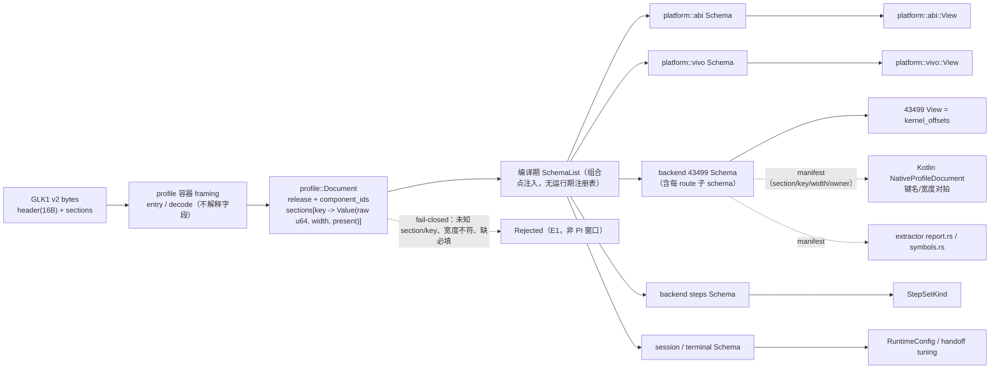
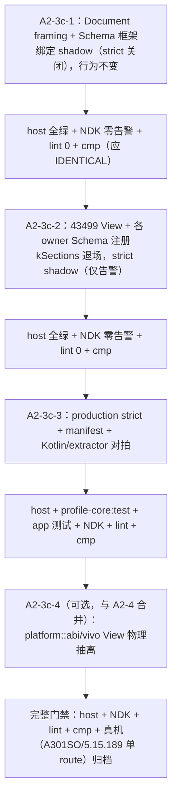

# offset SSOT（ADR-0003 注册模型）计划（2026-10-03）

> 本文件是分支总 plan 的 **A2-3c** 分册；全局顺序/状态以 `docs/analysis/branch-plan.md` 为准。
> 决策依据：`adr/0003-profile-schema-registration.md`（注册模型）、`adr/0004-framework-convergence.md`（R1/R5/R6/R7/
> R13–R17，A2 独立完整门禁）；结构目标见 `top-level-architecture-rewrite-plan.md`。
> 本计划只写文档，不改源码、不改其它文档、不 commit。

## 1. 现状与基线

### 1.1 基线

- 分支 `vr-ko-bypass-dev`；起草时 HEAD 从 `63a45bc` 前进到 `59985fc`（`feat(backend): register cve_2026_43284 as known-but-unavailable (S3 B3)`）。A2-3c 以 `59985fc` 为基线。
- 43284 identity/catalog/wire 已随 `59985fc` 落地：`src/Makefile`、`pipeline/{backend_contract,backend_policy,component_catalog}.hpp`、`profile/binary.h`、
  `tests/{backend_contract_test,component_catalog_test,profile_binary_test}.cpp`、`backend/cve_2026_43284_backend.hpp`。A2-3c 不再与这些文件争抢，但必须兼容其新增的 `kBackendCve202643284`/`BackendKind::Cve2026_43284` 与 43284 私有 section 规划。
- 攻击基线二进制：`build/native/ghostlock-B0`（sha256 `ae63a890…`，见总 plan §5）。A2-3c 的目标是
  **43499 攻击函数逐字节不变**。

### 1.2 offset/字段今天如何分散

1. **单一大结构 + 单一大表**：`profile::kernel_offsets`（`src/core/profile/model.h:152`）把平台 ABI
   （`task_struct`/`cred` 布局/`offset.*`）、设备 phys（`misc.kernel_phys_load/offset`）、厂商 vr
   （`misc.vr_guard/vr_tracepoint_funcs`）与 43499 的 route/exec/几何/尾 padding 混在一个 struct 里；
   `binary.cpp` 的 `kSections`（`src/core/profile/binary.cpp:215`）用 `Field` 函数表
   （`:34`）直接绑定它的成员。
2. **容器解释字段**：`binary_profile::parse`（`:273`）硬编码 `kernel_offsets*` 出参、硬编码三条合法
   route（`:297`），并把 `backend.cve_2026_43499.steps` 作为特例绕过字段表（`:339`）。容器不是中性
   framing，它知道每个 owner 的字段。
3. **未知字段被忽略**：`if (!section) continue;`（`:343`）使未知 section/拼写错误在启动期静默通过；
   `profile_binary_test.cpp:196` 还把「unknown section skipped / unknown key ignored」固化成测试期望。
4. **三端手写键名**：native `binary.cpp` 的 `kSections`、Kotlin `NativeProfile.sections()/apply()`
   （`profile-core/.../data/NativeProfile.kt:83`/`:509`）、extractor `report.rs` 各写一份；靠
   `NativeDocumentEquivalenceTest`（golden sha256）与零散测试兜底。
5. **共享权威结构**：`TargetProfile`（`model.h:205`）包装 `kernel_offsets`，`AddressSpace`、ancillary、
   route、`support/util.cpp`、`runtime_struct_offsets.h` 都经 `TargetProfile::values()` 读它。

### 1.3 为什么阻碍新 backend（43284，无 offset）

- `parse` 的出参类型是 `kernel_offsets`。43284 **没有 KASLR/符号/结构体 offset、没有 route**（见
  `cve-2026-43284-backend-assessment.md` §1.4/§4.4），它的 GLK1 section 是「载体路径 / KMI 策略 / Defex
  符号 / SELinux 上下文 / late-load 参数」。今天只能塞进 43499 形状的 `kernel_offsets`，或绕过字段表。
- 没有 per-owner Schema，就**无法声明**「哪些 section/key 属于 43284」并做 fail-closed 校验；容器的
  `kSections` 表每加一个 backend 就要改一次。
- 没有 strict，新 backend 的 section 与拼写错误无法在启动期区分。
- `RouteKind`/`middleware_id` 目前是全局枚举（`binary.cpp:297`、`main.cpp:92`），43284 无 route，
  「route 缺省」这一合法形态无处表达（评估 §4.4）。

### 1.4 已存在的强制兼容约束（本计划不得违反）

- `session_layout_test.cpp:30-48` 用 `static_assert` 锁死 `Cve2026_43499State` 各成员相对
  `CoreSession.backend_state` 的偏移；`TargetProfile` 的 `sizeof` 一旦变化，`addresses`/`heap`/`race`/
  `victim` 全部位移，攻击代码按偏移读取即失效。
- `kernel_offsets` 尾部 `mcast_attempts/mcast_arm_sequence/mcast_arm_hold` 明确占用既有 padding
  （`model.h:162-168`），改布局会移动现场。
- `tools/cmp_disasm.py` 的 8 个攻击函数 TARGETS（`TARGETS[42]`）必须逐条复核；A2 整阶段（R7）要求
  host + NDK 零告警 + cmp + 真机归档。
- Kotlin 侧 `app/src/test/resources/native-doc-golden.sha256` + `NativeDocumentEquivalenceTest.kt`
  锁定每个内置 profile 的 `toBinary()` 字节；wire 键名/顺序/宽度不能变。

## 2. 目标模型

### 2.1 结构（Mermaid，权威图）

**唯一权威图**：目标结构的图在本文件；其它文档链接本文件，不复制。

### 2.2 `profile::Document`（中性容器）

- 新增 `profile::Document`：只承载 framing 结果——
  - `release`（有主字符串）；
  - 三个 `u16` 组件 id（`terminal/backend/middleware`）+ `steps`，语义仍由 owner 校验；
  - `sections`：有序 `{name -> 有序 {key -> Value}}`；`Value = {raw: u64, width: u8, present: bool}`。
- Document **不命名任何字段、不认识 route、不做默认值**；`decode` 只做边界/长度/计数校验。
- Document 生命周期 = 启动期（组合点 bind 后即可销毁）；View 是值语义、`trivially copyable`，
  不做「引用 Document 的视图」，避免悬空。

### 2.3 owner `Schema` / `View` / `bind<Schema>`

- `FieldSpec{ section, key, width(1/2/4/8), signedness, required }`；
- `Schema` = 编译期 `FieldSpec[]` + `View` 类型；
- `bind<Schema>(const Document&, View&) -> BindStatus`：集中校验 presence/宽度/必填，逐字段搬值；
  任一失败即整体失败（fail-closed，不保留部分结果）；
- `SchemaList`（组合点注入，仿 `BackendIdentityList`）；`bind_all<SchemaList>` 模板遍历；**禁止运行期
  可变注册表**（避免回到单可变全局与静态初始化顺序问题）。
- **所有权规则**：每个 `(section, key)` 恰一个 owner；同 section 可被多 owner 共享，但 key 不重叠，
  由编译期 `static_assert`/测试查重拒绝。backend 需要平台字段时依赖平台 View，不重复声明。

### 2.4 `kernel_offsets` 降级为 43499 的 view

- `kernel_offsets` 不再是「共享权威结构」，而是 **43499 backend 的 View**；`TargetProfile` 是其封装。
- **A2-3c 的物理边界（重要，见 §6 最大风险）**：A2-3c 只做**声明/校验所有权**与 **bind 落点**，
  **不改 `kernel_offsets`/`TargetProfile` 的内存布局**（继续持有 `std::array<char,256> release_`
  与尾部 `mcast_*` padding），以保住 `session_layout_test` 与攻击函数机器码。
  `platform::abi::View` / `platform::vivo::View` 现在**只声明 Schema 与 View 类型**，其物理字段迁移
  （`AddressSpace`、ancillary、`platform::runtime` 改读平台 View）并入 **A2-3c-4 / A2-4** 一起做，
  否则单批无法同时满足「拆分」与「字节不变」。
- 目标所有权划分（固化；括号内为现状 section.key）：

  | owner | 键 |
  |---|---|
  | `platform::abi` | `task_struct.*`；`cred.{usage_offset,ref_count,ref0..3_offset}`；`offset.{init_task,init_cred,empty_zero_page,root_task_group,selinux_enforcing,selinux_blob_sizes,security_hook_heads}`；`kernel.{kernel_phys_load,kernel_phys_offset}`；`meta.kernel_major` |
  | `platform::vivo` | `meta.vr_guard`；`offset.vr_sys_exit_tp`；`vr_guard.tracepoint_funcs` |
  | backend 43499 | `cred.{copy_size,usage_value,caps_offset,caps_count,caps_value,ref0..3_image}`；`offset.{slide_nfulnl_logger,slide_loggers_0_1,slide_boot_id}`；`kernel.{compact_waiter,kernelsnitch_collisions,mm_struct_sz}`；`meta.{fallback_route,safe_mode}`；`execution.{heap,race,stages,consumer}`；`route.*`；`backend.cve_2026_43499.steps` |
  | session / terminal | `execution.recommended_cpus.*`（session）；`execution.handoff.*`（terminal/handoff） |

  `execution.consumer` 目前归 43499（select route 私有），保留在 backend；开放项见 §8。

### 2.5 注册机制与 production strict

- 组合点在 `pipeline`（满足 ADR-0004 R1：`profile` 容器不反向依赖 owner；S5 装配归 pipeline）。
- 两级解析模式：`DecodeMode::Production` 与 `DecodeMode::Tooling`（extractor/编辑器/回放）。
  - Production：已知 owner section 内的未知 key、任何未注册 section、**未知 `route.*` section** → **拒绝**；
    其它已知 route 的 section（非本 document 活跃 route）→ 允许但不 merge（沿用 `binary.cpp:320` 语义）。
  - Tooling：允许未知（保留旧行为），供离线工具读取未来字段。
- 组件 id/route id 合法性由 owner 校验，容器只搬运 u16；这同时解开 catalog↔backend 环。

### 2.6 manifest（三端机械对拍）

- native Schema 为权威，host 工具/测试输出机器可读 manifest：`{owner, section, key, width, required}`。
- Kotlin `NativeProfile.sections()/apply()` 与 extractor `report.rs` 的键名/宽度对 manifest 做
  subset/equality 断言；漂移由测试在 CI 抓，取代人工核对。

## 3. 兼容性约束（硬，非协商）

1. **GLK1 v2 容器中性、不 bump 版本**。`kVersion = 2`、magic、16 字节头、`u16 section_count`、
   `u8 name_len + name + u32 entry_count`、`u8 key_len + key + u64` 全部不动；不新增 v3/预留字段。
2. **`kernel_offsets` 布局与尾部 padding 与攻击代码 byte-identical**：A2-3c-1..3 不改
   `kernel_offsets`/`TargetProfile` 成员与顺序；`session_layout_test` 全绿；新增
   `static_assert(sizeof(profile::TargetProfile) == <基线值>)` 作为显式护栏。
3. **`cmp_disasm` 8 函数**：默认要求 IDENTICAL；若 `bind` 改变了启动路径而被 43499 函数内联引用，
   必须逐条复核并写入门禁记录（ADR-0004 第九轮定位）。
4. **wire 键名与 Kotlin 逐字一致**：section/key 字符串不得改；`app/src/test/resources/native-doc-golden.sha256`
   的 `NativeDocumentEquivalenceTest` 必须保持全绿（`toBinary()` 字节不变）。
5. **`backend.cve_2026_43499.steps` 的私有性**：仍是 backend 私有 section，不迁移 header；新增 43284
   用独立 section，不复用 43499 槽。
6. **热路径零间接**：bind 只在启动期；View 为 POD；攻击函数不经过 Schema/注册表/虚分派。

## 4. 改动清单（逐文件）

> 文件状态以落地时工作树为准；行号为当前快照，仅供定位。实现只碰本表列出的文件。

### 4.1 Native 新增

| 文件 | 改动 | 理由 |
|---|---|---|
| `src/core/profile/document.h` / `document.cpp` | `Document`/`Value`/`decode_document(bytes, mode) -> DecodeResult`，只做 framing 与边界校验 | 容器中性化（ADR-0003 决策 2） |
| `src/core/profile/schema.h` | `FieldSpec`、`Schema` concept、`bind<Schema>`、`SchemaList`、`bind_all`、`BindStatus` | 注册/绑定机制（决策 3/4） |
| `src/core/profile/composite_view.hpp` | A2-3c 过渡：把各 owner Schema 绑定结果落到冻结的 `kernel_offsets`（仅声明层分离） | 保住 §3.2 字节布局 |
| `src/core/backend/cve_2026_43499/profile/schema.hpp` | 43499 keys + 每 route 子 schema + `steps` schema | backend owner 声明 |
| `src/core/platform/abi/schema.hpp` | 平台 ABI keys（View 类型先空壳，物理迁移留 A2-4） | 平台 owner 声明 |
| `src/core/platform/vivo/schema.hpp` | vr keys | 厂商 owner 声明 |
| `src/core/pipeline/profile_binding.hpp` | 组合点唯一 `SchemaList` + `bind_all` 调用 | 装配归 pipeline（S5） |
| `src/core/profile/manifest.cpp`（host-only 工具/测试） | 由 SchemaList 生成 manifest | 三端对拍 |
| `src/core/tests/profile_document_test.cpp` | framing 边界/计数/截断/模式 | 容器测试 |
| `src/core/tests/profile_schema_test.cpp` | 跨 Schema 查重、presence/宽度/必填、strict 拒绝、round-trip | 决策 9 验证 |
| `src/core/tests/profile_manifest_test.cpp` | manifest 完整性/去重 | manifest |

### 4.2 Native 修改

| 文件 | 改动 |
|---|---|
| `src/core/profile/binary.{h,cpp}` | 删 `Field`/`kSections`（`:34`/`:215`）与 `parse` 的字段绑定逻辑；`parse`→`decode`（返回 `Document` + ids）；保留 `serialize`（host 测试/工具，走 Schema 或保留写表）；移除 `:339` steps 特例，改由 43499 schema 处理 |
| `src/core/profile/model.h` | 保留 `kernel_offsets`/`TargetProfile` 布局与访问器；语义注释改为「43499 View」；新增布局 `static_assert` |
| `src/core/profile/entry.{h,cpp}` | 三个入口改为 `decode → bind_all → kernel_offsets`（对外签名可保持 `kernel_offsets*` 以减少爆炸半径，内部走 Document） |
| `src/core/main.cpp` | `:30` 起用 Document/`bind_all` 替代直接 `parse`；`:92` route fallback 逻辑保留但由 43499 schema 校验 |
| `src/core/backend/cve_2026_43499_state.hpp` / `bootstrap.cpp:91` | `install_profile` 从 bound View 构造 `TargetProfile` |
| `src/core/pipeline/{pipeline,orchestrator,backend_contract}.hpp`、`backend/cve_2026_43499_backend.{hpp,cpp}` | 过渡期 `decoded` 参数可继续传 `kernel_offsets&`；若改动，仅限类型别名/装配点 |
| `src/core/memory/address_space.{h,cpp}`、`profile/accessors.hpp`、`runtime_struct_offsets.h`、`support/util.cpp`、`ancillary/*`、`race/threads.cpp`、route `*.{h,cpp}` | **A2-3c 默认不动**（布局不变）；仅当 View 重命名时改引用；`platform::abi::View` 迁移在 A2-3c-4/A2-4 |
| `src/Makefile` | 新增 `document.cpp`/`manifest.cpp` 到源与 `HDRS`；新增三个测试进 `NATIVE_HOST_TESTS`（`:123`） |

### 4.3 测试（native）

| 文件 | 改动 |
|---|---|
| `src/core/tests/profile_binary_test.cpp` | `:196-230` 的「unknown 被忽略」期望改为 strict 拒绝（放 A2-3c-3）；round-trip/编号/header 断言保持 |
| `src/core/tests/session_layout_test.cpp` | 增加 `TargetProfile` `sizeof`/`alignof` 显式 `static_assert`（只加不删） |
| `src/core/tests/address_space_test.cpp` / `route_*` / `ancillary_test.cpp` / `profile_test.cpp` | 若 View 类型不变则不改；否则仅改构造方式（保持向量不变） |
| `src/core/tests/host/backend_dataflow_test.cpp` | 改用 Document→bind 构造，host harness 断言不变 |

### 4.4 Kotlin（profile-core / app）

| 文件 | 改动 |
|---|---|
| `profile-core/src/main/kotlin/com/ghostlock/app/data/NativeProfile.kt` | 键名沿用；`sections()/apply()` 与 manifest 对拍；无字节改动 |
| `profile-core/.../data/profile/ProfileResolver.kt` | 若新增 manifest 校验接入点，仅调用不改优先级 |
| `app/src/test/.../NativeProfileDocumentTest.kt` | 增加 manifest/未知键断言 |
| `app/src/test/.../NativeDocumentEquivalenceTest.kt` + `native-doc-golden.sha256` | **保持不变**（回归护栏，不得更新 golden） |
| 新增 `app/src/test/.../ProfileManifestAgreementTest.kt` | 断言 Kotlin 键 ⊆ native manifest 且宽度一致 |

### 4.5 Extractor

| 文件 | 改动 |
|---|---|
| `tools/extract_rs/src/report.rs` / `symbols.rs` | 输出键对齐 manifest；新增「输出键 ⊆ manifest」测试；不改 `--format conf` 语义 |

### 4.6 文档与构建（实现批次落地，本计划不修改）

| 文件 | 改动 |
|---|---|
| `docs/kernel_profiles/PROFILE_SCHEMA.md` + `_ZH.md` | 增加 manifest/strict/所有权说明 |
| `docs/development/adding-a-component.md` | 新字段 = 加 `FieldSpec` + 注册 + manifest 测试 |
| `src/core/README.md` | profile 分层与 DecodeMode |
| `docs/analysis/branch-plan.md` | 只登记 A2-3c 进度（父级维护） |

## 5. 分批与门禁

### 5.1 批次（Mermaid）

| 批次 | 内容 | host | NDK | lint | cmp_disasm | 真机 |
|---|---|---|---|---|---|---|
| A2-3c-1 | `Document` + `schema.h` + 影子 bind；wire/行为不变 | 全绿（新增 3 测试） | 零告警 | 0 | 期望 IDENTICAL | 不需要（无行为变化） |
| A2-3c-2 | owner Schema 注册、`kSections` 删除、43499 View 由 bind 产生；strict 仅告警 | 全绿 | 零告警 | 0 | 必跑；差异逐条记录 | 冷机单 route（可选，确认无回归） |
| A2-3c-3 | strict 拒绝 + manifest + Kotlin/extractor 对拍 | 全绿 | 零告警 | 0 | 必跑 | 冷机 multicast 最少 1 次 PASS，按 `device-gates/*.md` 归档 |
| A2-3c-4 | 平台/vivo View 物理抽离（与 A2-4 协同） | 全绿 | 零告警 | 0 | 必跑 | 完整真机门禁（冷机、固定 CPU 对 0/1、KernelSU 未加载） |

- 每批门禁命令：`make -C src native-host-tests`、`make -C src ghostlock`、`make -C src lint-tidy`、
  `python3 tools/cmp_disasm.py build/native/ghostlock-B0 build/native/ghostlock`；Kotlin 批加
  `./gradlew :profile-core:test :app:testDebugUnitTest`；extractor 批加
  `(cd tools/extract_rs && cargo test --release)`。
- 同一批次门禁连续失败 2 次即停止前进（AGENTS）；上一批通过再进下一批。
- 真机失败/panic 与通过同等归档；`KERNEL-PANIC-01` 需同构建复现 + 冷机复跑才可归因。

## 6. 风险与回滚

### 6.1 风险表

| # | 风险 | 触发 | 缓解 |
|---|---|---|---|
| R1 | **`kernel_offsets`/`TargetProfile` 布局漂移**（最大） | 为「拆分 owner」改动成员或删 256B `release_`/尾 padding → `Cve2026_43499State` 成员偏移整体前移，攻击代码按偏移读到错字段 → 提权失败/panic | A2-3c-1..3 不动结构体；`session_layout_test` + 新增 `sizeof`/`alignof` `static_assert`；物理拆分强制留到 A2-3c-4 与 A2-4 同批 |
| R2 | strict 拒绝旧工具产出 | extractor/编辑器/HOCON 仍输出已下线字段 → 启动期 `Rejected` | 先 shadow（仅告警）再 strict；manifest 对拍；同步 extractor/资产 |
| R3 | 键名/宽度漂移 | Kotlin 或 extractor 与 native Schema 不一致 | manifest 测试 + `NativeDocumentEquivalenceTest` golden |
| R4 | Document 悬空 | View 引用 Document 存储，Document 先销毁 | View 值语义/POD；bind 后不保留 Document 指针 |
| R5 | 热路径回退 | 误在 PI 窗口用 Schema/间接访问 | 只在启动期 bind；攻击函数只读 POD View；cmp 复核 |
| R6 | 共享 section 所有权歧义（`meta`/`cred`/`offset`/`kernel`） | 两个 Schema 声明同一 key | 编译期/测试查重；§2.4 表固化 |
| R7 | route section 语义回归 | strict 误拒「其它已知 route 的 section」 | 保留「已知 route、非活跃 → 允许不 merge；未知 `route.*` → 拒绝」 |

### 6.2 回滚

- 单分支；每批独立提交，回滚 = `git revert <batch>` 或回到基线快照 `B0`（sha256 `ae63a890…`）。
- `DecodeMode` 是显式开关：strict 出问题可单点切回 `Tooling`，不牵动 wire。
- A2-3c 保持 `TargetProfile` 与 43499 攻击函数字节不变，所以回滚 A2-3c 不需要重跑真机门禁以外的迁移。

## 7. 数据流/控制流差异（不变量）

| 维度 | 旧 | 新 |
|---|---|---|
| 解析 | `parse(bytes) → 直接填 kernel_offsets`；容器知道字段 | `decode(bytes) → Document`；`bind_all<SchemaList>` → Views |
| 未知字段 | 忽略（`binary.cpp:343`） | Production 拒绝；Tooling 忽略 |
| 归属 | 单表 + 单 struct | 每 `(section,key)` 一 owner，编译期注册 |
| 新 backend | 改容器 `kSections` | 加一个 Schema + 注册 + manifest 测试 |

不变量：wire 字节、`kernel_offsets` 布局、W1→W2→W3→terminal 顺序、PI 窗口时序、route 能力、
单可变全局 `g_exploit_session`、`TargetProfile::values()` 语义。

## 8. 明确保留 / 开放项

**保留**：GLK1 v2 容器与 `kVersion=2`；`kernel_offsets`/`TargetProfile` 内存布局；`session_layout_test`
锁；Kotlin golden sha256；43499 8 个攻击函数；`backend.cve_2026_43499` 私有 section；profile 唯一配置权威。

**开放项（实施时定，不阻塞开工）**：
1. `meta.kernel_major`/`recommend_shizuku` 归属（暂定 platform::abi；`recommend_shizuku` 已随 T3c 移除）。
2. `execution.recommended_cpus` 归 session/pipeline 还是 backend（暂定 session）。
3. manifest 形式（JSON / 生成头）与是否升级为 codegen。
4. `cred` 的 layout（platform::abi）与 value（backend）同 section 按 key 拆分的接受度。

## 9. 进度

- [ ] A2-3c-1：`Document` framing + `schema.h` + 影子 bind；行为不变
- [ ] A2-3c-2：owner Schema 注册 + 43499 View；`kSections` 退场；strict shadow
- [ ] A2-3c-3：production strict + manifest + Kotlin/extractor 对拍
- [ ] A2-3c-4：platform::abi/vivo View 物理抽离（与 A2-4 协同）
- [ ] 完整门禁 + 真机归档
