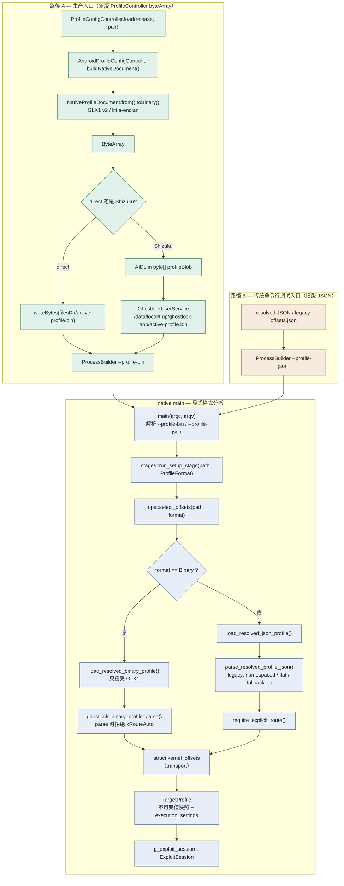
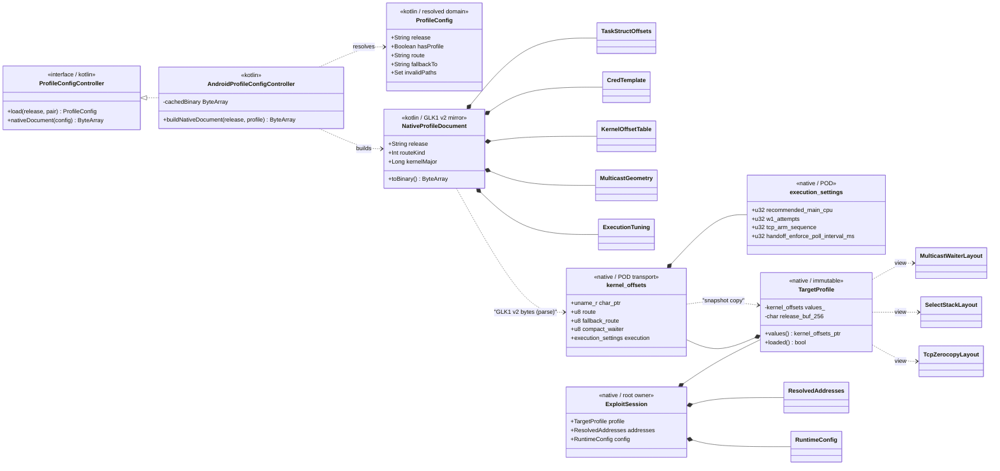
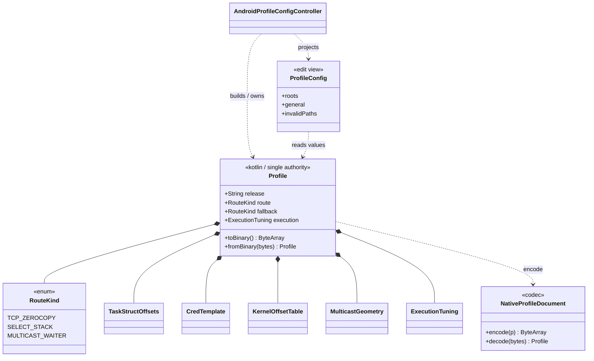

# Profile 输入入口解耦（native 参数输入环节）

> 对象：native 进程的参数输入环节。目标是把「传统命令行 / 旧版 JSON 配置」入口与
> 「新版 ProfileConfigController byteArray」入口分离，去掉运行期 magic 嗅探的隐式分流。
> 本文件是分析/规划，不改变攻击关键路径。

## 1. 依据（docs 记录）

- `native-decoupling-plan.md` S03：Kotlin 统一以 `--profile <absolute-path>` 传一个完全
  resolved 的 profile；Native 只反序列化、不再自行选源或合并（328-330 行）。
- `kernel_profiles/PROFILE_SCHEMA_ZH.md` §9：运行时传输是类型化二进制（`GLK1` v2），
  direct 写 `active-profile.bin`、Shizuku 走 AIDL `in byte[]`；`load_resolved_profile()`
  靠 magic 命中 binary，否则回退 JSON 解码器（269-278 行）。
- `kotlin-native-bridge.md`：Kotlin/native 之间无类型化 ABI，只有 argv、环境变量、文件与
  退出码。

## 2. `remote/main` 与当前分支对比

| 维度 | `remote/main`（旧架构） | 当前 `very-not-stable-dev`（现代化重构后） |
|---|---|---|
| 入口 | `run_exploit(argc, argv)` **忽略 argv**（`main.c:1142-1143`） | `main.cpp:21-29` 解析 `--profile <path>` |
| 配置源 | 内置 `known_offsets[]` C 表按 uname 匹配，或 `load_offsets_json()` 读旧 offsets.json（`main.c:156`） | `ops::select_offsets()` → `load_resolved_profile()`（`exploit_ops.cpp:96-133`） |
| 全局 | `active_offsets` + `*_OFF` 宏重映射 | `TargetProfile` 值快照进 `g_exploit_session` |
| byteArray | 不存在 | `ProfileConfigController.nativeDocument()` 产出 `ByteArray`，落盘后仍以 `--profile` 传入 |

结论：旧版是「内置表 / 旧 json 的单向隐式入口」；新版把「binary 为主 + JSON 兜底」两条
语义不同的路径压进同名参数与同一函数，用 magic 隐式分流。

## 3. 当前耦合点

1. `load_resolved_profile()` 用前 4 字节 magic 隐式选择格式，生产入口与调试入口无法区分
   （`offsets_json.cpp:800-822`）。
2. `parse_resolved_profile_json()` 内保留大量 legacy 分支（namespaced 扁平键、`fallback_to`、
   `route` 字符串、旧提取器输出），这些只服务命令行/测试，却与生产解码共享路径并仍是运行期回退。
3. `require_explicit_route()` 对 binary 冗余（`profile_binary.cpp` 已在 parse 时拒绝
   `kRouteAuto`），对 JSON 才必要，职责混在 loader 出口。
4. usage 文案仍写 `resolved-profile.json`，与实际 `.bin` 不符（`main.cpp:26`）。

## 4. 解耦方案

- **CLI 层**：`--profile-bin <path>` 固化给生产 binary 入口；新增 `--profile-json <path>`
  仅供独立命令行/调试。
- **Loader 层**：删除 magic 嗅探，拆为 `load_resolved_binary_profile()`（只走
  `binary_profile::parse`）与 `load_resolved_json_profile()`（只走 JSON 解码器 +
  `require_explicit_route`）；`select_offsets` / `run_setup_stage` 接收显式 `ProfileFormat`。
- **校验边界**：legacy/JSON 兼容整体收进 `--profile-json` 分支；生产 binary 路径不再保留
  任何 JSON 回退。
- **不变量**：改动只发生在 profile 加载早期（非竞态窗口），生产 binary 路径的调用序列与
  栈帧保持不变。

## 5. 目标调用图



> 当前耦合点：`main.cpp:21-29` 只有一个 `--profile`，`load_resolved_profile()` 用 magic
> 隐式分流。上图中路径 A/B 在 `M3` 由显式格式决定，是解耦目标。

## 6. 数据类型类图



关键点：`NativeProfileDocument`（Kotlin）与 `kernel_offsets`（native transport）是逐字段
镜像，只在 `toBinary()` / `parse()` 边界通过 GLK1 v2 字节布局对应；`TargetProfile` 是复制
后的只读快照，`execution_settings` 内嵌在 transport 里。解耦不改变该镜像关系。

## 7. 统一聚合类设计：Kotlin `Profile`

目标：让**一个类**同时完整表达任意 resolved 配置、并能直接产出攻击执行参数（native
binary），取代当前「`ProfileConfig` 编辑视图 + `NativeProfileDocument` 序列化产物」的双产物。

### 7.1 目标与不变量

- `Profile` 是 Kotlin 侧唯一的运行期权威值；`ProfileConfig` 降级为它的编辑视图投影。
- 字段与 `struct kernel_offsets` 一一对应，`toBinary()` 字节布局仍为 GLK1 v2，**逐字节不变**。
- `route` 不允许 `kRouteAuto`；`fallback` 用 `null` 表示 `kRouteAuto`。数值映射 1/2/3 保持不变。
- 编辑态元数据（override 标记、baseline 对比）不进入本类，避免运行期权威混入 UI 关注点。
  `invalidPaths` 是 profile 自身属性，可保留。

### 7.2 类型定义

```kotlin
enum class RouteKind(val wire: Int, val token: String) {
    TCP_ZEROCOPY(1, "tcp_zerocopy"),
    SELECT_STACK(2, "select_stack"),
    MULTICAST_WAITER(3, "multicast_waiter");

    companion object {
        fun fromToken(t: String?): RouteKind? = values().firstOrNull { it.token == t }
        fun fromWire(w: Int): RouteKind? = values().firstOrNull { it.wire == w }
    }
}

/** Single authority for one fully resolved profile; mirrors kernel_offsets. */
data class Profile(
    val release: String,
    val route: RouteKind,
    val fallback: RouteKind?,
    val kernelMajor: Int,
    val recommendShizuku: Boolean,
    val taskStruct: TaskStructOffsets,
    val cred: CredTemplate,
    val kernelOffsets: KernelOffsetTable,
    val multicast: MulticastGeometry,
    val kernelPhysLoad: Long,
    val pselectWaiterShift: Long,
    val compactWaiter: Boolean,
    val kernelsnitchCollisions: Long,
    val mmStructSz: Long,
    val execution: ExecutionTuning,
    /** Geometry paths violating the profile rules; never serialized. */
    val invalidPaths: Set<String> = emptySet(),
) {
    val effectiveRoute: RouteKind get() = route

    fun supports(candidate: RouteKind): Boolean = route == candidate
    fun hasCompactWaiter(): Boolean = compactWaiter
    fun mmStructStride(fallback: Long): Long =
        mmStructSz.takeIf { it != 0L } ?: fallback

    /* Capability / layout views, mirroring TargetProfile accessors. */
    fun multicastLayout(): MulticastWaiterLayout = MulticastWaiterLayout(
        waiterOffset = multicast.waiterOff,
        bufferSize = multicast.bufferSize,
        taskOffset = multicast.taskOffset,
        lockOffset = multicast.lockOffset,
        fakeLockOffset = multicast.fakeLockOffset,
        fakeTaskOffset = multicast.fakeTaskOffset,
        lockSlotsOffset = multicast.lockSlotsOffset,
        lockSlotCount = multicast.lockSlotCount,
        lockSlotStride = multicast.lockSlotStride,
        fakeBssImageOffset = kernelOffsets.mcastFakeBss,
    )
    fun selectStackLayout() = SelectStackLayout(pselectWaiterShift, compactWaiter)
    fun tcpZerocopyLayout() = TcpZerocopyLayout(compactWaiter)

    fun toNativeDocument(): NativeProfileDocument
    fun toBinary(): ByteArray

    companion object {
        /** Forward: ValueMap -> authority. route must be explicit. */
        fun fromValueMap(release: String, map: ValueMap): Profile?
        /** Reverse: GLK1 bytes -> authority (UI / debug / tests). */
        fun fromBinary(bytes: ByteArray): Profile?
    }
}
```

`MulticastWaiterLayout` / `SelectStackLayout` / `TcpZerocopyLayout` 是在 Kotlin 侧新增的只读
值类型，字段与 native `profile.h` 的同名结构对齐（native 侧已有，仅补 Kotlin 镜像）。

### 7.3 与现有类型的分工

- `Profile`：运行期权威；`toBinary()` 供 `ProfileConfigController.nativeDocument()`。
- `NativeProfileDocument`：收敛为**纯字节 codec**（`encode(Profile)` /
  `decode(ByteArray)`），保留 `flatten()` 的字段顺序，不再对外作为独立数据源。
- `ProfileConfig`：编辑视图，由 `Profile` + override 集合派生（树、`general`、来源）。
- `ValueMap`/`ValueList`：仍是 HOCON 层容器，只在构建/合并/override 阶段使用。

### 7.4 与 native 的映射

| Kotlin | native `kernel_offsets` | 说明 |
|---|---|---|
| `route: RouteKind` | `uint8_t route` | TCP/SELECT/MULTICAST = 1/2/3；不允许 0 |
| `fallback: RouteKind?` | `uint8_t fallback_route` | `null` = `kRouteAuto`(0) |
| `compactWaiter: Boolean` | `uint8_t compact_waiter` | true/false = 1/0 |
| `execution: ExecutionTuning` | `execution_settings` | 逐字段、顺序不变 |
| `invalidPaths` | 无 | 仅 Kotlin 校验元数据，不序列化 |

### 7.5 关系图



### 7.6 迁移步骤与验证

1. 引入 `RouteKind` + token/wire 转换与往返测试（纯 Kotlin，无 native 影响）。
2. 引入 `Profile`（先**组合**现有 `NativeProfileDocument`），补 view 与校验。
3. `AndroidProfileConfigController.buildNativeDocument()` 改为 `Profile.toBinary()`；
   字节快照测试锁定与旧 `toBinary()` 输出一致。
4. 增补 `fromBinary()` 与 `toBinary→fromBinary→toBinary` 往返字节相等测试。
5. （可选，独立提交）把 `NativeProfileDocument` 收敛为 codec；若无法证明字节等价则保留组合形态。
6. 验证：`./gradlew clean :app:assembleDebug` + `make native-host-tests`，Direct/Shizuku 真机门禁。

风险：只要 `toBinary()` 字节不变，native 入口解耦与本类引入对攻击关键路径零影响；反向解析
仅用于 UI/调试，不进入执行路径。

### 7.7 native 侧镜像：`ghostlock::Profile`

Kotlin 与 native 使用**同名镜像**类型 `Profile`，字段一一对应、顺序一致。native 侧合并现有
两类：transport `kernel_offsets`（POD）与语义 view `TargetProfile`。所有攻击决策只读
`Profile`；`kernel_offsets` 退居 codec 的字节载体。

```cpp
namespace ghostlock {

enum class RouteKind : uint8_t {
    TcpZerocopy = 1,
    SelectStack = 2,
    MulticastWaiter = 3,
};

struct Profile {
    std::array<char, 256> release{};
    RouteKind route{};                 // 必须显式，禁止 auto
    bool has_fallback = false;
    RouteKind fallback{};
    uint8_t kernel_major = 0;
    bool recommend_shizuku = false;
    TaskStructOffsets task{};          // 现有字段组，顺序不变
    CredTemplate cred{};
    KernelOffsetsTable offsets{};
    MulticastGeometry multicast{};
    uint64_t kernel_phys_load = 0;
    int32_t pselect_waiter_shift = 0;
    bool compact_waiter = false;
    uint32_t kernelsnitch_collisions = 0;
    uint32_t mm_struct_sz = 0;
    execution_settings execution{};

    bool supports(RouteKind kind) const { return route == kind; }
    bool has_compact_waiter() const { return compact_waiter; }
    MulticastWaiterLayout multicast_layout() const;
    SelectStackLayout select_stack_layout() const;
    TcpZerocopyLayout tcp_zerocopy_layout() const;
};

/* GLK1 codec; the byte layout stays authoritative. */
Profile decode_profile(std::string_view document);
int encode_profile(const Profile &profile, char *buffer, size_t capacity);

}  // namespace ghostlock
```

约束：`Profile` 的内存布局不参与 ABI，但内部字段组与 `kernel_offsets` 兼容布局必须一致，
用 `static_assert(sizeof/offsetof)` 锁定；codec 负责字节与 `Profile` 的转换。这样迁移期
可保留已验证的 `kernel_offsets`/`TargetProfile` 作为过渡 façade，逐步把调用点改为读
`Profile`。

### 7.8 legacy JSON → Profile 适配

旧版 JSON 入口不再直接产出供攻击使用的 `kernel_offsets`，而是先转换为 `Profile`：

```text
legacy offsets.json / resolved JSON --legacy_json::to_profile()--> ghostlock::Profile
```

- 复用现有 `parse_resolved_profile_json()` 的解码逻辑，仅把输出类型改为 `Profile`。
- 显式路由要求（`require_explicit_route`）不变；转换失败安全退出，不回退任何内置表。
- 与第 4 节的 `--profile-json` 入口对齐；转换后与 binary 路径汇合到同一个 `Profile`。

### 7.9 传输机制决策：继续传参，不用 JNA

| | JNA / in-process | 独立进程 + 传参（采用） |
|---|---|---|
| Shizuku shell 身份（uid=2000/`Seccomp=0`） | 不可行 | 可行 |
| Direct untrusted_app uid / Seccomp | 改变，需重测 | 已验证 |
| 崩溃隔离（fork victim / PI / panic） | 无 | 有 |
| 进程级前置（rlimit/rseq/stdio/pin） | 不适用 | 已按此设计 |
| 启动协议兼容、真机门禁 | 全部作废 | 沿用 |
| 「同一对象」保证 | 仍需手写映射 | 共享 GLK1 schema |

采用：`Profile.serialize()` → GLK1 bytes → `--profile-bin`（文件 / AIDL binder）→
`Profile.decode()`。同一类型两侧同名镜像，序列化与反序列化共用同一 schema。

### 7.10 schema 单一来源与一致性强化

1. 单一字段清单（生成脚本或共享 IDL）同时产出 Kotlin `flatten()` 与 native codec 字段表，
   CI 校验字段数与顺序一致（现状仅为注释「两侧必须同步修改」）。
2. GLK1 header 增加 field count 校验（`version` 维持 v2，或视需要升版并保留旧解析）。
3. Kotlin `Profile.fromBinary()` 与 native `encode_profile()` 往返字节锁定。

### 7.11 执行阶段计划

- **P0** 文档与决策（本文件）。
- **P1** Kotlin 权威类型：`RouteKind` + `Profile`（先组合 `NativeProfileDocument`）+ 往返字节
  测试；不改 native，`toBinary()` 输出不变。
- **P2** controller 接入：`nativeDocument()` = `Profile.toBinary()`，`ProfileConfig` 改为
  `Profile` 的投影；字节快照锁定。
- **P3** native 镜像：`ghostlock::Profile` + GLK1 codec；攻击决策迁移到 `Profile`；
  `--profile-bin` / `--profile-json` 入口分离 + legacy→Profile 适配。→ 需真机门禁。
- **P4** schema 单一来源与 field count 校验。
- 每阶段独立提交、Gradle/`make native-host-tests` 验证、提交后暂停；P3 需 Direct + Shizuku
  真机门禁与字节等价证据方可关闭。

## 8. 影响面与验证

- 代码：`src/core/main.cpp`、`src/core/session/exploit_stages.{hpp,cpp}`、
  `src/core/exploit_ops.cpp`、`src/core/offsets_json.{h,cpp}`、`offsets_json_test.cpp`。
- 文档：`kernel_profiles/PROFILE_SCHEMA_ZH.md` §9、`kotlin-native-bridge.md`、
  `native-functions.md`；若立项则并入 `native-decoupling-plan.md`。
- 验证：`make native-host-tests` + `./gradlew clean :app:assembleDebug`；生产 binary 路径
  用 `tools/cmp_disasm.py` 做字节等价对比；Direct + Shizuku 真机门禁通过后再收尾。

## 9. 建议登记

在 `native-decoupling-plan.md` 第 9 节新增一个 Sxx 阶段（入口显式化），并把第 3 节四个
耦合点各列为子项 checkbox；`Profile` 的引入作为 Kotlin-side 子项单列，完成后再同步
第 5/7 节图与 `native-functions.md`。
