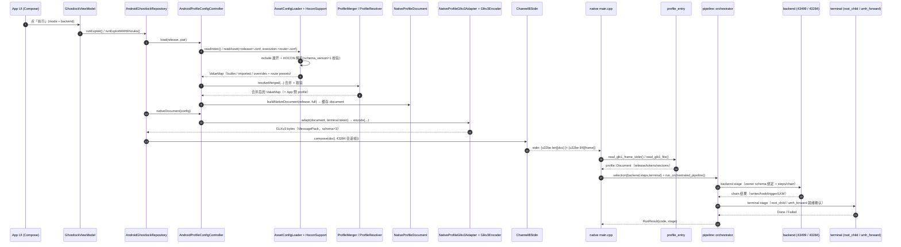
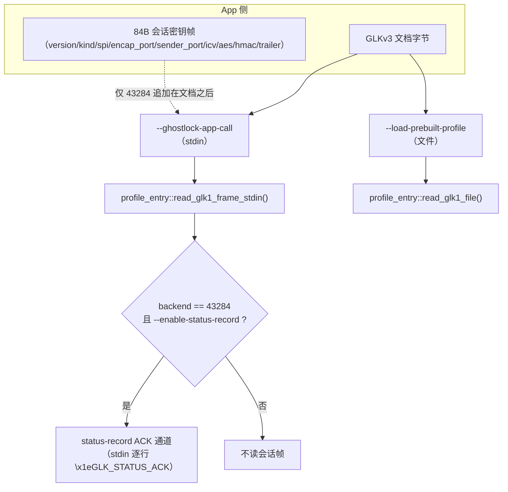
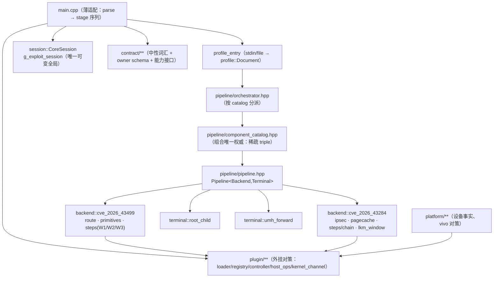

# 全流程 UML：HOCON → 配置模型 → wire → profile → 最终处理

> 术语澄清（先说结论，避免混淆）：
> - **HOCON**：`app/src/main/assets/profile/*.conf`，仅 App 侧解析，文件内 `schema_version = 1`。
> - **"kprofile"**：代码里**没有**叫这个名字的类型。实际是 HOCON 解析后的两层内存模型：`ValueMap`（原始合并结果）与 `Profile`/`ProfileConfig`（App 展示 + 原生文档载体）。
> - **wire**：**GLKv3 MessagePack** 字节流（根 map，`schema = 3`），是唯一的跨语言传输格式。
> - **profile（native）**：`profile::Document`（中性 ID/分段容器）→ 按 owner 绑定的强类型 `Schema::View`。
> - `profile.conf` / `profile.bin`（`Download/GhostLock/<时间>/`）是**调试转储**，不是传输通道。

## 1. 端到端序列（App → native → 设备）

## 2. 数据形态流转（每一跳的确切产物）

```mermaid
flowchart LR
    A["assets/profile/<br/>index.conf · &lt;release&gt;.conf · execution-*.conf<br/>（HOCON 文本, schema_version=1）"]
    B["ValueMap<br/>（include 展开 + HOCON 解析）"]
    C["合并后的 ValueMap<br/>builtin → imported → overrides<br/>+ execution-*.conf 路由预设"]
    D["NativeProfileDocument<br/>owner 分段：backend.* · cred · execution.* · route.*"]
    E["Glkv3Document<br/>根键：schema=3, backend, terminal, release, sections"]
    F["MessagePack 字节<br/>canonical：最短整数 + 键按 UTF-8 排序"]
    G["profile::Document<br/>release / backend_token / terminal_token / sections[]"]
    H["ComponentSelection<br/>contract::BackendKind × StepSetKind × TerminalKind"]
    I["owner Schema::View<br/>43499: backend_profile::bind<br/>43284: profile::bind&lt;Cve2026_43284Schema&gt;"]
    J["runtime 使用<br/>chain / route / 终端 / 会话密钥(仅43284)"]

    A --> B --> C --> D --> E --> F -->|stdin 或文件| G --> H --> I --> J
```

## 3. 两条入口 + 会话密钥通道

## 4. native 内部组件与所有权

## 5. 我这些天改了什么 / 没改什么（可 `git log` 复核）

| 区域 | 是否改动 | 说明 |
|---|---|---|
| HOCON 加载（`AssetConfigLoader`/`HoconSupport`） | **未改** | 今天对该路径 0 提交 |
| 合并/解析（`ProfileMerger`/`ProfileResolver`） | **未改** | 同上 |
| GLKv3 编解码（`Glkv3Encoder`/`NativeProfileGlkv3Adapter`/`glkv3_parse`） | **未改** | 同上（`schema==3` 与键集未动） |
| `ChannelBStdin` / 会话帧布局 | **未改** | 只做过**字节对拍验证**（与 native `session_frame.cpp` 一致） |
| owner schema / bind 机制 | **未改** | `profile::bind<>`、`schema.hpp` 未动 |
| 43284 生产绑定（`execution_binding`/`backend_terminal`/`chain`） | **改过** | hook guard `Reject→Skip`、终点标记、等待 5s→15s、**设备事实降级**、LKM 窗口接线 |
| `terminal/umh_forward` 就绪探针 | **改过** | 改为「app 域可观测的标记优先；不可观测 ≠ 未就绪」 |
| `plugin/`（原 `ancillary`+`countermeasure`） | **改过** | γ 批机械改名 + δ 批新增 `kernel_channel`/`host_ops` |
| `contract/abi/glk_contract_abi.h` | **改过** | 仅**追加** LKM 段与注释；旧字段/位值不变 |
| LKM（`tools/lkm/ghostlock`） | **改过** | 常驻通道 + 会话绑定卸载 + pre-UMH 注册/权限 |
| App Kotlin | **改过** | 路由（43284 直连 vs Shizuku）、文案、构建目录外移 |
| `app/src/main/assets/**` | **未改** | 0 提交 |

## 6. 若你怀疑「被弄乱」，优先核对这些不变量

1. `schema_version = 1` 只属于 **HOCON**；wire 必须是 `schema = 3`——两者混用会在 `glkv3_parse` 直接拒绝；
2. GLKv3 根键**只有** `backend / release / schema / sections / terminal`（可选键缺失即不写）；
3. 分段名 owner-qualified：`backend.<id>`、`cred`、`execution.*`、`route.*`；
4. 会话密钥**永不进文档**，只在 `[u32be len][doc]` 之后的 84B 帧里、且仅 43284；
5. 三端一致性由测试兜底：`route_catalog_test`、`profile_manifest_v3_test`（↔ `profile-manifest-v3.tsv`）、`profile_manifest_test`（↔ `profile-manifest.tsv`）与对应 Kotlin 的 `*AgreementTest`。
