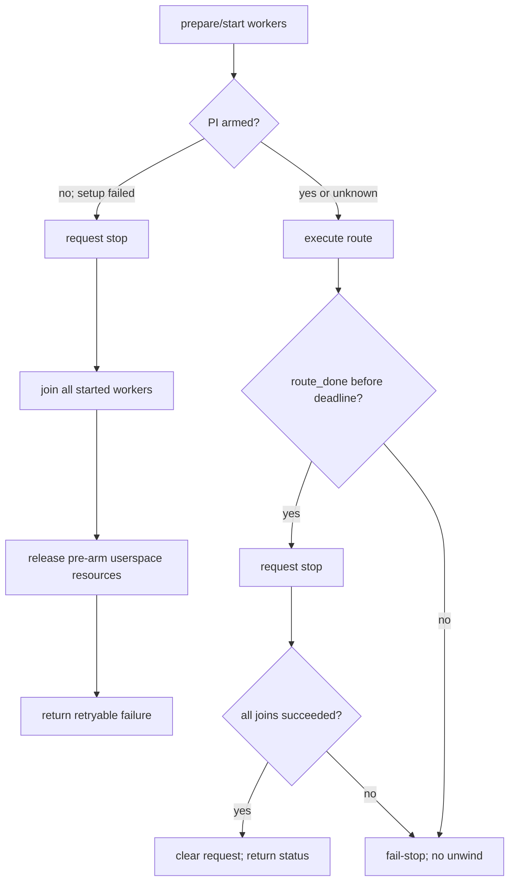

# Race 生命周期与资源终结加固计划（2026-09-24，R2）

> 面向核心攻击代码所有权审查发现的四个缺口：`route_done` 无 deadline、join 失败后仍结束借用、
> 活跃 TCP route 可移动、multicast resident 部分启动没有可达终结点。实现属于攻击关键路径；
> 本计划已获用户认可并完成实现；本页同时保留所有权与验证证据。

## 现状与基线

- 分支 `very-not-stable-dev`，源码基线 `3bc924b1ea5d31ee75d5b6aa5e23795ff4405cb0`。
- 改动前二进制 `build/native/ghostlock` SHA-256：
  `dcd5224d7be39c9a702bafeaee4fdcea8f45f7a3ece6fd505fceaf5023cd5cac`。
- 最近真机 PASS 基线 `/private/tmp/ghostlock-b4-review-p1b-candidate` SHA-256：
  `cacc2c6c7530710d6ec0ec7085452389fe58f6dfd0a7e286948fdf517e5040f9`。
- 当前候选对该真机基线的 8 个攻击函数全部 `IDENTICAL (strict)`；资源准备/回收函数
  `MulticastWaiterRoute::{stop,write}`、`multicast_waiter_{adjust,stamp}`、
  `MulticastPolicy::{resident_write,w1_resident_repair,w2_fast_repair_*}`、
  `prepare_good_kernel_page`、`cleanup_page_prepare_state` 也严格一致。
- 当前缺口：`PiRace::run()` 可永久等 `route_done`；`PiRace::join()` 忽略错误并清空 `request`；
  `TcpZerocopyRoute` 可在 punch worker 借用旧 `this` 时移动；multicast resident 在部分启动失败时
  仅依靠进程自然退出终结。

## 目标与约束

- 所有栈借用必须在栈对象终结前证明访问者已停止；无法证明时不得返回到调用者。
- 把 deadline 检测、取消意图、PI disarm、资源回收分开；deadline 不代表已经安全清理。
- 只在证明 PI 尚未 armed 时执行局部回滚；PI 已 armed 或状态不明时执行 fail-stop，不重试、不 fallback、
  不展开栈、不运行析构器。
- fail-stop 使用 `SYS_exit_group` 结束整个 native 进程，并在调用前写一条同步错误日志。它只保证用户态
  不再继续访问，不宣称内核 PI 状态已安全回收；真机门禁负责验证该终态不会引入 panic。
- 不改变漏洞原语、payload 布局、W1/W2/W3 目标、正常成功路径的 stop/disarm/destroy 顺序。

## 所有权与终结点设计

| 对象/资源 | owner | borrower | 新终结点 |
|---|---|---|---|
| 栈上 `WriteRequest` | backend 调用帧 | `PiRace::request`、waiter、route | 三个 race worker 全部 join 成功后返回；否则 fail-stop |
| `PiRace` futex/atomics | `ExploitSession` | waiter/owner/consumer | clean join 后才允许 reset；deadline 或 join 失败 fail-stop |
| TCP route `this` | waiter 栈帧 | punch worker | 删除 move；worker join 后 route 才可销毁 |
| multicast resident | 进程级静态对象 | waiter/owner、PI consumer | pre-arm 失败回滚并 join；post-arm 失败 fail-stop；成功保持既有 disarm→join→close |
| payload/reclaim state | `HeapContext` | route 与内核引用 | route clean 后才 cleanup；dirty/fail-stop 不回收 |

```mermaid
stateDiagram-v2
    [*] --> Empty
    Empty --> WorkersStarted: workers created
    WorkersStarted --> Empty: pre-arm failure / stop + join + close
    WorkersStarted --> RequeueAttempted: CMP_REQUEUE_PI
    RequeueAttempted --> Armed: expected PI result + waiter ready
    RequeueAttempted --> FailStop: timeout / unknown result / worker not ready
    Armed --> Disarmed: stop request + consumer idle + ghost disarm
    Armed --> FailStop: deadline / disarm cannot be proven
    Disarmed --> Destroyed: join waiter + join owner + close socket
    Destroyed --> [*]
    FailStop --> [*]: SYS_exit_group; no unwinding
```

## 改动清单

1. **Race deadline 与 join 合同**
   - `profile/model.h`、`profile/binary.cpp`、`:profile-core` DTO/导出器及 HOCON defaults：在 GLK1 v3
     options 增加具名 `race.route_done_timeout_ms`，不移动既有 68 个 common slots，也不复用 waiter futex
     的 `race_route_wait_ms`；旧 v2/v3 缺键时 Native 使用 300000 ms 默认值。
   - `race/pi_race.{h,cpp}`：`run()` 使用 monotonic deadline；`join()` 返回逐线程结果，仅当三者均已
     join 才清空 `request`；`reset()` 拒绝覆盖仍 joinable 的 owner。
   - `race/threads.cpp`：deadline、reset 拒绝或 join 失败统一进入 `fail_stop_dirty_race()`；正常路径仍为
     `run → request_stop → join`。fail-stop 前不得清空 `request`、reset futex、释放 payload 或 route 资源。
   - `support/`：增加最小的 `[[noreturn]]` fail-stop helper，只记录原因并调用 `SYS_exit_group`；不分配、
     不加锁、不运行清理回调。

2. **TCP route 禁止活跃移动**
   - `route/tcp_zerocopy_route.{h,cpp}`：删除移动构造，使 route 地址从构造到 punch worker join 保持稳定。
   - `tests/tcp_zerocopy_route_test.cpp`：断言不可复制且不可移动；保留 disarm/destroy、fd/mapping 清理测试。

3. **Multicast resident 部分启动终态**
   - `route/multicast_waiter_route.{h,cpp}`：用显式阶段记录 `Empty/WorkersStarted/RequeueAttempted/Armed/
     Disarmed/Destroyed`。worker 在 pre-arm 自旋点检查 `stop_requested`。
   - waiter/owner 创建失败及 requeue 前 ready timeout：设置 stop，按 waiter→owner 顺序 join，关闭已创建
     socket，回到 `Empty`；waiter 的 pre-arm futex 带同一 monotonic deadline，避免 stop 信号恰好落在
     检查与入睡之间时 join 永久阻塞。该路径允许向调用者返回失败。
   - 从调用 `CMP_REQUEUE_PI` 起，任何未知结果、waiter-ready timeout 或 adjust 失败均 fail-stop；不调用
     普通 `stop()`，防止把未知 PI 状态误报成 clean。
   - 正常 `stop()` 仅接受 `Armed`，保持 `consumer_go=0 → consumer_inflight=0 → kernel_disarmed →
     join waiter → join owner → close socket → release_resident_heap` 顺序；任一 join 失败时不关闭或标记 clean，
     直接 fail-stop。

4. **文档和测试**
   - `session/exploit_session.hpp` 更新所有权表与终结点；本文件更新实际实现进度。
   - 扩充 `pi_race_test`、`multicast_waiter_route_test`、profile binary/Kotlin agreement 测试，覆盖 deadline、
     join 失败不结束借用、reset 拒绝、pre-arm 回滚、post-arm fail-stop 的可测试判定函数。
   - fail-stop 的单元测试只测试“状态应进入 terminal”判定，不在测试进程中真正执行 `exit_group`。

## 控制流差异

正常成功路径的机器码与调用顺序是首要不变量。新增检查若使 8 个攻击函数不再 strict-identical，必须逐条
注解差异；无法证明不影响 PI 窗口、ghost disarm 或资源终结顺序时停止本批并回滚。

## 兼容性与回滚

- GLK1 v3 options 只追加具名键；旧 v2/v3 文档由 Native getter 填入默认 timeout，legacy `offsets.json`
  路径不增加字段，68 个 common slots 保持不变。
- HOCON 未显式配置时使用内置 execution default；现有 profile 无需逐文件重复字段。
- 回滚单位是本批全部源码、profile 契约和测试；不得只回滚 deadline 而保留新的终态判断。
- 真机门禁失败时恢复到上述 `dcd5224d…` 二进制对应源码，不把失败候选设为新基线。

## 验证矩阵

| 项 | 命令/条件 | 通过标准 |
|---|---|---|
| Native host | `make -C src native-host-tests` | 生命周期、字段一致性、pre-arm 回滚测试全部通过 |
| Kotlin | `./gradlew :profile-core:test :app:testDebugUnitTest` | wire/default/export agreement 全部通过 |
| NDK | `ANDROID_NDK_HOME=... make -B -C src ghostlock` | 零告警 |
| Static | `ANDROID_NDK_HOME=... make -C src lint-tidy` | 0 findings |
| 反汇编 | `python3 tools/cmp_disasm.py /private/tmp/ghostlock-b4-review-p1b-candidate build/native/ghostlock` | 8 函数逐条结论；另核对等待、join、reset、multicast start/stop、page prepare/cleanup |
| 真机 | A301SO、5.15、multicast、direct、冷机、固定 CPU 对、KernelSU 未加载 | 正常链 PASS；重复运行无 panic；日志归档新 gate |
| timeout fault gate | 仅在可控测试构建注入 route_done timeout | native 进程 fail-stop，不继续 W2/W3、不 fallback；设备无 panic才接受 |

## 明确保留

- 不修改 `kernelsnitch/`、legacy v1 路径、payload 编码、攻击目标地址和 stage 验证逻辑。
- 不给 Select/TCP 宣称真机验证；它们仍只有 host 固定测试。
- 不在 PI 窗口加入虚调用、`std::function`、锁、分配或异步日志。
- 不把进程退出描述成内核 PI 状态已安全 disarm；只有真机证据支持的结论才写入 gate。

## 进度

- [x] Rust 式所有权追踪及 UAF/终结点审查。
- [x] 当前候选与最近真机 PASS 基线的攻击函数和资源闭包反汇编核对。
- [x] R2 设计收敛：四项问题、状态图、fail-stop 边界、验证矩阵。
- [x] 用户认可 R2（2026-09-24）。
- [x] 分批实现：profile 合同 → race 终结 → TCP immovable → multicast pre-arm rollback。
- [x] Host、Kotlin、NDK 零告警与 clang-tidy 通过。
- [x] 反汇编完成逐函数注解：5 个目标仅 layout shift；3 个目标为本计划要求的 deadline/终结分支差异；
  正常攻击、资源准备、disarm 与回收调用顺序保持不变。候选 SHA-256
  `c98583ec481771926d3993d84b78c2c366d7b14e22a443e31d65c26d1e909dc2`。
- [x] 真机正常门禁归档：`device-gates/RACE-LIFETIME-20260924-multicast-direct-pass.md`。
- [ ] timeout fault gate（未注入；不据此声明 fail-stop 后内核 PI 状态安全）。
