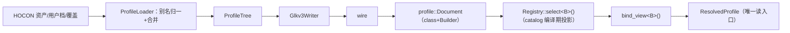
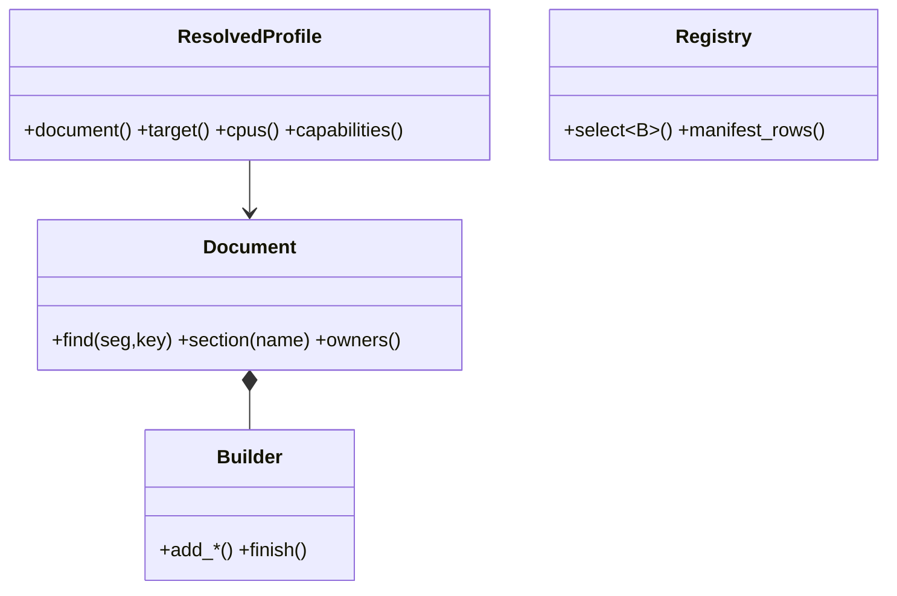
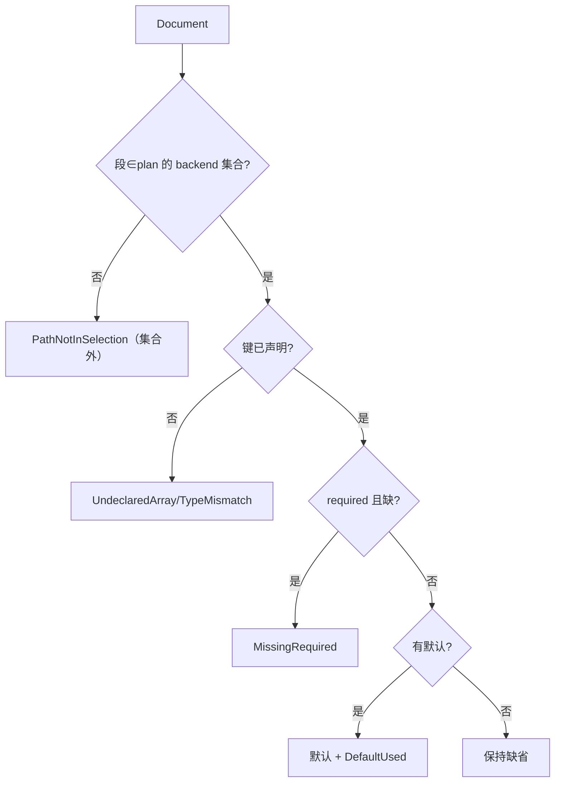

# 单一权威 Profile 模型 + 注册套件：计划与设计（v2.4）

> **性质**：L 级（跨 Native↔Kotlin 契约 + wire 承载 + 公共数据结构）。含概要设计与详细设计。
> **自包含**：本计划不依赖任何外部计划文档；所需事实与规则均就地给出（以代码位置为准）。
> **2026-10-07 裁决**：**terminal 轴取消**（改由 step 的**执行器**表达：UserRoot/Umh/CredGrant/KernelCmdSet）；**backend 并入队列**、多 backend 可在同一 plan 内（同批 handoff/payload 设计 §10 D16–D19）。
> **阶段**：需求 → 概要设计 → 详细设计 → 评审 → **用户批准** → 源程序。状态：**三轮非作者评审 + 复验**（28 条 = 23 全关/5 部分；5 部分与 2 条 P0 已关闭，见评审记录 §6），**待批准**。
> **附录**（算法 A1–A8 + 走查 T1–T8）：[resolved-profile-registry-algorithms.md](resolved-profile-registry-algorithms.md)。**评审与关闭记录**：[review-log](resolved-profile-registry-review-log.md)。

## 1. 现状与基线

| 层 | 现状（实测） | 问题 |
|---|---|---|
| Kotlin | canonical/runtime **两形态** + 双读取路径 | K1/K2/K3/K6/K11 |
| wire | manifest **110** 行（92+9+6 plugin+3 root）；`required=1` **0 行**；golden **58** vs 资产 **66** | N4/A2/K14/B10 |
| native | 6 条读路；Document 为 struct；两处静默过滤；`active_profile()` **4 处**、`.profile.` **50 行** | N1–N3/B11/R3 |
| 约束 | ADR-0003 决策 4/5、ADR-0004 R18/R21、ADR-0006（**terminal 归属需修订**，§3.4）、I4、R1 空账本、Q17、520B/784B | A1/A4/B13/B14 |

## 2. 目标、需求增量与约束

**需求增量（待写入 `requirements.md`；末号 F20/I8，编号空闲已核）**：F21 三层同形 · F22 单一权威读入口 · F23 校验去重 · F24 注册套件（三接口 + 五注册服务；只加载一条路径）。I10 `required` = **owner 被选中时必填**（改 PROFILE_SCHEMA:13）· I11 会话帧独立 API。
**本计划自有的三条规则**：① **组合权威 = `kCombinationCatalog`（唯一）**，选择面 = `backend.<id>{route,queue}`；② **token 形态出现即拒**（文本 `steps`、列表形态）且 **App 停发 wire `steps`**（只带 `route`+`queue`）；③ **registry = catalog 的编译期投影**（I9，见 §3.4）。

**非目标**：不改 `schema==3`/canonical；不引入运行期注册表/虚函数；不动 520B/784B 与 `CoreSession` 槽位；不引入 v4 命名。

## 3. 设计

### 3.1 数据流（同形）



**统一口径**：`ProfileLoader.load(...) → LoadResult{ResolvedProfile?, diagnostics}`，失败不抛也不吞（§3.6/§3.7 同）。

### 3.2 类图与类型（判据：无 invariant 的聚合用 struct；有 invariant 的用 class；新类型 PascalCase + final）



| 类型（层） | 判定 | 不变量 / 要点 |
|---|---|---|
| `profile::{Value,Entry,CompositeItem,Section,Document,Builder}` | class/struct | **缺键 = 无 Entry（取消 `Value::present`）**；`find` 私有；(seg,key) 唯一；**段 = `plan` 用到的 backend 集合**（同 backend 内取 plan 的 route 几何）；Builder 唯一 mutator + fail-closed |
| `profile::Diagnostic`/`Sink` | struct | 12 个 `DiagnosticCode`（`DefaultUsed`/`PathNotInSelection`/`DuplicateKey`/`UndeclaredArray`/…） |
| `session::ResolvedProfile` | class | 绑定完成即只读；**只暴露中性类型**；`target()→const profile::TargetProfile&` |
| `contract::ProfileReader` | concept | **不 include `profile/`**（前向声明 + requires；避免 contract→profile 边，P0-1/B14） |
| `contract::{CapabilityMask,PathSpec,ComponentId,registry_check}` | class/struct/纯函数 | 能力位只允许已知；`PathSpec{owner,path,wire,required,default,source}`；`ComponentId`＝注册表键；`unique_paths/row_count`（守恒 110） |
| `pipeline::{Registry,BackendRegistration<B>,StepRegistration<S>,StepSetRegistration<...>,StepContext}` | class/模板 | 路径唯一 + 每组合有 target；deps 只引更低槽位；顺序 = `kStepSetAliases` |

**无函数指针、无虚表**：注册项是类型，分派 `if constexpr` 展开（N6）。
**层归属**：注册件落 `pipeline/`；`registry_check` 只收 `span<PathSpec>`；`session` 新件只 include `contract`/`profile` ⇒ R1 空账本保持（N5/B14）。**中性类型口径**：按**命名空间**判定——`contract::*` 与中性 `profile::*` 可用（`TargetProfile` 命名空间是 `ghostlock::profile`，`model.hpp:232`），backend 私有类型禁用。

### 3.3 声明面、写回与会话帧

- `ResolvedProfile.declarations` = `available` 唯一归宿。
- **`HoconWriter`**（新）：`tree → HOCON`，供快照/导出/覆盖回读 4 处。**会话帧独立 API**：`ChannelBStdin.appCall(bytes, frame)`，密钥不进文档。

### 3.4 注册与绑定

```mermaid
sequenceDiagram
  participant M as main
  participant P as Registry
  participant B as Backend&lt;B&gt;
  participant R as ResolvedProfile
  M->>P: select&lt;B&gt;()（catalog 编译期投影）
  P->>P: static_assert（双向）
  P->>B: bind_view&lt;B&gt;(Document, State, Sink)
  B-->>P: 冻结存储 + 诊断
  P->>R: 构造（只暴露中性类型）
  R-->>M: target()/cpus()/capabilities()
```

- **权威不变**（规则①③）：catalog 唯一权威；registry 由它派生 + 双向 `static_assert`。**ADR-0006 决策 4** 满足（选行由 registry 投影承担；`component_catalog` 保留 token/矩阵声明面）。
- **ADR-0006 terminal 归属需修订**（2026-10-07）：**terminal 轴取消** ⇒ 由 step 的**执行器**表达（UserRoot/Umh/CredGrant/KernelCmdSet）；词汇保留但不再作为装配维度；同批改 ADR-0006 与 UML 相关图（§9）。
- **ADR-0004 R21 拟改**（G4）：改为「catalog 仍唯一权威；`DispatchTarget` 由 catalog 派生的编译期投影（`select<B>()` + `if constexpr`）+ 双向 `static_assert`，不再手写 case」；锁点 `pipeline.hpp:57-59`/`component_catalog.hpp:48-92`/`component_catalog_test.cpp:155-176`。**R18 不需修订**。**`ComponentSelection` 与 `ComponentId` 同源**。

### 3.5 失败出口



### 3.6 算法修正（A1–A8/T1–T8 见附录）

- **Loader**（K2）：`load(Layers, release, pair, presets, includeParser×2) → LoadResult`；优先级 **overrides > imported > builtin > preset**；内置档 `activeBuiltinRelease() ?: deviceRelease`（`:679`/`:920`），无内置档走 imported-only；`safe_mode` 补丁落 `Glkv3Decoder.patchSafeMode` 等价位。
- **v1/v2**（K6）：LPC 产**已归一 tree 输入**，不再产 `backend.<owner>.steps`；**规则②**（K7–K9）：`available` 拒 **8 条**；flat `steps` 仅 legacy id 迁移保留；`meta→根标量` 归 LPC。
- **D-G/K5**（I10）：`required` 只覆盖**有单一来源**字段；**multicast 键位矛盾**（预设 `execution.routes.*` vs 字段 `route.multicast_waiter.*`，`MulticastConfig.kt:4-33`）⇒ 未决前三项不置 required（§8-3）；消费者 5 类见评审记录 §7。

### 3.7 Kotlin 类型与接口

| 类型 | 判定 | 要点 |
|---|---|---|
| `ProfileValue` | sealed class | `UInt/Int/Bool/Str/Array`；**不声明 `Bin`**（K16） |
| `ProfileTree`/`ResolvedProfile` | class | 段名 ∈ 声明 owner、键唯一、**缺键 = 无 Entry**；构造即完成、只读 |
| `ProfileLoader` | class | **输入边界归一仅此一处**；两个 include 解析器；返回 `LoadResult` |
| `Glkv3Writer`/`HoconWriter`/`TypedView`/`Diagnostic` | class | canonical（**会话帧不在此**）/ 写回 4 处 / **运行时 manifest 驱动，无 codegen** / 与 native 诊断同名同义（K13） |

`LoadResult{profile: ResolvedProfile?, diagnostics}`：失败不抛异常、也不 `runCatching` 吞掉（K2）。

### 3.8 现状 → 新设计 差异对照（模板「数据流/控制流差异」）+ 不变量

| 维度 | 现状 | 新设计 | 不变量 |
|---|---|---|---|
| 读取路径 | 6 条 | 1 条 `ResolvedProfile` | private + 受控访问器 |
| Kotlin 形态 | 两形态 + 双读取路径 | 一形态 `ProfileTree` | `available` 只此一处 |
| 段发射/处理 | 单 backend 段 + 两处拷贝后静默过滤 | **按 plan 用到的 backend 集合发射**（同 backend 内按 route 集合发几何）；集合外段 = 拒绝 | fail-closed |
| 校验/默认值/CPU | 三层各判；43499 无 `default_used`；CPU 双读 | `bind_all` + 注册表查重；`DiagnosticSink` + `cpus()` 单源 | 同一事实只判一次；R5 |

## 4. 改动清单（逐文件）

> 状态：**已关闭** = 复验确认；**未闭** = 待门禁（评审记录 §6）。

| 文件 | 改动 | 理由 |
|---|---|---|
| `profile/{document.hpp,entry.*,glkv3*.cpp,schema.hpp}` | Document/Value/Section → class+Builder；Diagnostic/Sink；`find_value→find`；**取消 `Value::present`**；段集合 fail-closed | N1/N3/N7/N8/N11 |
| `backend/cve_2026_43499/backend_profile.cpp`、`backend/cve_2026_43284/backend_terminal.cpp` | 删「拷贝后过滤」；传 `DiagnosticSink`（补 `default_used`） | N3/R5 |
| `session/{resolved_profile.*（新）,runtime_config.*,core_session.cpp:4-6}`、`profile/runtime_struct_offsets.h`、`backend/cve_2026_43499_backend.cpp:82`、`race/threads.cpp:173-174`、`bootstrap.cpp:27-28` | 唯一读入口；删 `apply_profile` 与默认 CPU 对；CPU 消费点改经 `cpus()`；`target()` 改 `const` | F22/D-E/N9/R1–R3 |
| `pipeline/registry.hpp`（新）、`contract/registry_check.hpp`（新）、`pipeline/{orchestrator,component_catalog,pipeline}.hpp`、`backend/*/schema.hpp` | 注册表投影 + 纯查重；选行替换手写 switch；`required` 落关键字段 + 导出 `PathSpec` | F24/A4/N12/D-G |
| `profile-core/.../{ProfileLoader,ProfileTree,ResolvedProfile,Glkv3Writer,HoconWriter}.kt`（新）、同目录 `{ProfileLayout,NativeProfile,ProfileMerger,ProfileResolver,ProfileExporter,AvailablePriority}.kt`、**`app/.../BuiltinProfileCatalog.kt`**（**app 模块**；第二读路 `:71-100`） | 单模型 + 写回；删第二读路（`AvailablePriority.kt:77-86`、`ProfileResolver.kt:141-152`） | F21/K1/K3/K10/K11/P0-2 |
| `app/{AdvancedUI.kt,AndroidProfileConfigController.kt:51-56,GhostlockModels.kt:128}`、`profile-core/.../ProfileResolver.kt:175-190`、`contract/step_plan.hpp`（`QueueElement`）、plugin 宿主 | 高级页改经新模型；must-have 收窄；插件宿主随冻结面保留 | K10 |
| 测试 | 改写 2 · 重冻 6 类 · 新增 5 类 · 行号同步 1 · 勿动 plugin golden · 清理 `ExporterAgreementTest.kt:32-42`。明细见评审记录 §7 | K11/K15/B12/G9 |

## 5. 兼容性与回滚

- **`PathNotInSelection` 是行为变更**（N3）：B2 必须给 ①「各生产者只发 **plan 用到的 backend 集合**（旧 `.bin` 单 backend 仍可解析）」举证 ②拒绝向量（含「plan 未声明的 backend 段 ⇒ 拒绝」用例）③旧 `.bin` 策略（起点 `AndroidProfileConfigController.kt:1087-1091`）。
- **冻结面**：`native-doc-golden-v3.sha256`（58→66）、`Glkv3Golden` 两 hex、`glkv3-native-fixture.tsv`、5 manifest 双副本、plugin golden（**勿动**）。
- **回滚**：每批独立提交；B2 前 wire 不变；B3 `required` 可单独 revert。

### 5.1 废止双读取路径（就地说明）

- **今天怎么工作**：`NativeProfileDocument.from()` 先读**运行时载体** `backend.queue_selection.<id>.{queue,experimental,queue_route}`，读不到再**回退** `available.<id>.{queue,experimental,route}`（`NativeProfile.kt` 的 `runtimeSelectionPath`/`declaredSelectionPath`；载体由 `ProfileLayout.kt` 的 `QueueSelectionKey` 写入）。
- **为什么是风险**：同一数据经**两条路径**读取 ⇒ 行为分叉属高危形态。真实事故：导出 `.bin` 只走声明路径而**静默丢队列**（`exportProfiles` 的合并文档是 canonical，无载体）；当时的修法正是要废止的双路本身。
- **单模型后靠什么守住等价**：① 只留**一条**读取路径（`ProfileLoader` 直出 `ProfileTree`）；② 冻结 **golden** 保证字节不变；③ 「跨路径等价对拍」改为**单路径对拍**。**同批性**：该废止与 **terminal 取消**、**多 backend 发射**属**同一批**结构性改动，判据共用。

## 6. 验证矩阵

| 判据 | 造错→期望失败 | 测试文件 | 批 |
|---|---|---|---|
| 三层同形（含 Kotlin 单模型） | 加未声明段 ⇒ `PathNotInSelection` | `glkv3_schema_test`/`document_schema_test` | B1/B2 |
| 路径唯一 / 行数守恒(110) / 冻结面对拍 | 复制或删一条 ⇒ 编译失败；副本不一致 ⇒ 红 | `profile_registry_test`/`profile_manifest_v3_test`/`queue_wire_test` | B1/B3/B4.1 |
| `required` + `DefaultUsed` | 删 `execution.stages.w1_attempts` ⇒ `MissingRequired`；删上报 ⇒ 断言失败 | `profile_bind_compat`/`profile_string_binding_test` | B3 |
| 单一读入口 + step 顺序 | 43499 `state.profile` 与 43284 `cve_2026_43284_state(session)` 转 private + 受控访问器后无第二入口；调换注册顺序 ⇒ alias `static_assert` 失败 | `document_schema_test`/`profile_entry_test`/`stepset_steps_manifest_test` | B2/B4.2 |

**命令**：`make -C src native-host-tests` / `./gradlew :app:testDebugUnitTest` / `make -C src profile-manifest-v3|combination-manifest|vocabulary-manifest|stepset-steps-manifest|lkm-kmi-manifest|glkv3-golden-hex`（各 **EXIT=0**）。
**真机门禁**：B2（accessor seam）、B4.2 **是**；B3/B4.1 否。

## 7. 明确保留（不动）

`kCombinationCatalog`（权威）· `schema==3` 与 canonical · 520B/784B 与槽位 · R1 空账本（**不得新增豁免**）· plugin/payload 冻结面 · LPC 的 v1/v2 能力。
**plugin 解冻时的 `Bin` 恢复路径**（K16，本批不声明）：manifest union 增 `bin` + Kotlin `ProfileValue.Bin`（`Glkv3Encoder.kt:29-32`）+ native 解码（`glkv3.cpp:113/:186`），三端同批。

## 8. 待批准事项

1. **废止双读取路径**（现行「载体优先 + 回退 `available` 声明」，见 §5.1）——推荐废止，同批留沿革。
2. **D-A..D-H 八条设计决定**（§3–§5 全部取舍）——推荐整批批准。
3. **multicast 缺口**（K5）：补 `execution-multicast-waiter.conf` + 定键位，还是列已知缺口并延后置 required。

## 9. 同批动作

`requirements.md` 追加 **F21–F24 / I9–I11**（末号 F20/I8）+ 沿革，`I2` 改「v1/v2 → 3」；`PROFILE_SCHEMA.md` `:3`/`:16` 改 **121 行 / 110 数据行 / sha `62ea112b2caf…`**，`:13`（+`_ZH`）按 I10 修订；**ADR**：0003 升 Accepted + 改决策 1；**0006 需修订（terminal 取消）**；0004 R21；新增 **ADR-0007**；**UML**：§1 IPO、§2.1（Rejected +6 类）、**§2.7**、§3.1/§3.2 各 +6 类与删除注记、**terminal 取消相关图（状态机/类图/序列）**、§3.3 Rust、§4.1/§4.2。

## 10. 进度

- [x] 设计 · 评审 · 关闭 · 复验（23 全关/5 部分；5 部分 + 2 P0 已闭）
- [ ] 用户批准（§8）· [ ] B1 → B2 → B3 → B4.1 → B4.2
