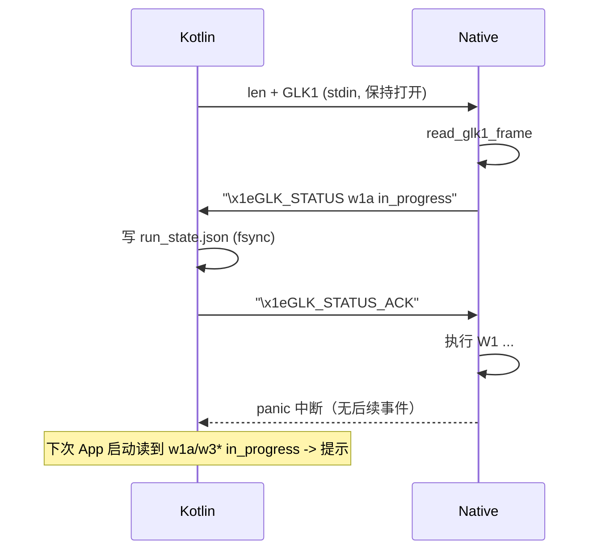

# 攻击步骤状态记录计划（stdio 请求-响应，2026-09-25）

## 现状与基线

- 分支 `very-not-stable-dev`；代码基线 `f424f15` + 当前工作树。
- 现有“上次 W3 失败提示”机制（`AndroidGhostlockRepository`）在真实失败路径上无效：W3 之前的
  PI route 失败通常 kernel panic，进程来不及返回，Kotlin 的 `recordLastRun` 不会执行。机制细节：
  `.ghostlock_last_run` + `.ghostlock_native.log` 含 `"W3 seccomp clear failed"`。
- 现有 Native↔Kotlin 通道：
  - Kotlin `ProcessBuilder(listOf(binary, "--ghostlock-app-call"))` + `stdin=profileBlob`，
    `runProcess` 里 `process.outputStream.use { it.write(stdin) }` **写完即关闭**；stdout/stderr
    合并后按行读取当日志（`AndroidGhostlockRepository.kt:893`）。
  - Native `profile_entry::read_glk1_stdin()` 用 `read_all(STDIN_FILENO)` **一直读到 EOF** 才解析
    （`src/core/profile/entry.cpp:20,52`）。GLK1 v3 header 16 字节**没有总长度字段**
    （`profile/binary.cpp:238`），所以 native 依赖 EOF 判断边界。
- 攻击步骤边界（`src/core/session/backend/cve_2026_43499_backend.cpp`）：
  `run_setup` → `w1`（SELinux；`W1b` scratch；`M::w1_resident_repair`）
  → 循环 `w2`（`W2` cred；`W2b` fast repair）与 `w3`（`W3-0` leaf；`W3` TIF_SECCOMP；`W3` seccomp mode）。

## 目标与约束

### 目标

1. Native 在执行每一步前，通过 **stdio 向 Kotlin 发出“写状态”请求**，Kotlin 落盘后**返回 ACK**，
   Native 收到 ACK 才继续 —— 保证可能 panic 的 PI route 之前状态已持久化。
2. 状态由 **Kotlin** 写文件（Native 不碰文件、不受 uid/权限影响）。文件为 **HOCON（JSON 完全兼容）**。
3. 记录 `w1a..w3c` 每步状态：`not_start | in_progress | completed`。
4. 下一次 App 启动读取：最后停留在 `w3* in_progress` → 用现有对话框提示启用 Shizuku。
5. 通过 **`--enable-status-record`** 启用；未启用时行为与现状**逐字节不变**。

### 非目标

- 不改攻击逻辑/时序/内存布局/route；不改 profile/GLK1 **内容**语义（只在传输层加长度前缀）。
- 不改 `src/core/race/**`、`route/**`、`memory/payload_builder.*` 的函数体。
- 不新增常驻线程；不引入可变全局（沿用 `g_exploit_session` 约定，状态写入用 `run_state` 的只读 bool +
  局部，不新增全局可变状态）。

## 设计

### D1：传输层（stdin 帧化，仅启用时）

- 启用 `--enable-status-record` 时，Kotlin 写 stdin 改为：
  `[4 字节大端 payload 长度][GLK1 bytes]`，**不关闭** stdin（保留用于 ACK）。
- Native 在启用时用新函数 `read_glk1_frame_stdin()`：先读 4 字节长度，再精确读该长度，**不读到 EOF**。
- 未启用时：Kotlin 仍 `write+close`，Native 仍 `read_all` 到 EOF —— 老路径不变。
- 长度上限沿用 `kMaxDocument`（1 MiB）。

### D2：状态事件与 ACK

- Native 每步：向 **stdout** 写一行事件并 `fflush(stdout)`：
  `"\x1eGLK_STATUS <step> <status>\n"`（首字节 `0x1e` 分隔符，避免与正常日志冲突）。
- Kotlin `runProcess` 的 reader 线程识别该前缀行：
  - 写状态文件（D4）；
  - 向 `process.outputStream` 写 `"\x1eGLK_STATUS_ACK\n"` 并 flush（stdin 保持打开）。
  - 该行**不再**作为普通日志输出（或折叠为简短日志）。
- Native 发送后从 stdin 读一行，必须匹配 ACK 才继续；读失败/超时（如 5s）则**只警告并继续**，
  绝不阻塞攻击（best-effort）。

### D3：步骤映射

| key | backend 位置 |
|---|---|
| `w1a` | `w1()`：`"W1: SELinux"` / 已 permissive |
| `w1b` | `w1_scratch_repair<M>()` |
| `w1c` | `M::w1_resident_repair(session)` |
| `w2a` | `w2()`：`"W2: cred"` |
| `w2b` | `w2()`：`W2b` fast repair |
| `w3a` | `w3()`：`"W3-0: leaf dir"` |
| `w3b` | `w3()`：`"W3: TIF_SECCOMP"` |
| `w3c` | `w3()`：`"W3: seccomp mode"` |

跳过/已满足的步骤直接 `completed`。每步在**实质操作前** `enter`（发 `in_progress`+等 ACK），
成功后 `complete`（发 `completed`+等 ACK）。

### D4：Kotlin 状态文件与提示

- 文件：`filesDir/.ghostlock_run_state.json`（HoconSupport 可直接解析）：

```json
{ "schema_version": 1, "run_id": 1758800000, "updated_at": 1758800003,
  "steps": { "w1a": "completed", "w1b": "not_start", "w3b": "in_progress", ... } }
```

- 攻击启动时 Kotlin 先写一次 `reset`（全 `not_start`，新 `run_id`），随后按 ACK 事件更新。
- `AndroidGhostlockRepository` 新增 `suspend fun lastRunStuckAtW3(): Boolean`：读该文件，
  `steps` 中值 `in_progress` 且键以 `w3` 开头 → true；缺失/解析失败/其它 → false。
- 删除旧机制：`lastRunW3SeccompHint`、`recordLastRun`、`LastRunFileName`、`W3SeccompFailureMarker`
  及两条运行路径的 `.also{recordLastRun}`。
- ViewModel `maybeSuggestShizukuForW3()` 改调 `lastRunStuckAtW3()`；文案改为“上次攻击在 W3 阶段中断
  （可能内核 panic），建议改用 Shizuku”。

## 改动清单

| 文件 | 改动 |
|---|---|
| `src/core/main.cpp` | 解析 `--enable-status-record`，与 `--ghostlock-app-call` 组合；启用时走帧读 |
| `src/core/profile/entry.{hpp,cpp}` | 新增 `read_glk1_frame_stdin()`（4 字节长度前缀） |
| `src/core/support/run_state.{hpp,cpp}`（新增） | `enable()`、`enter(step)`、`complete(step)`：emit 事件 + 等 ACK |
| `src/core/session/backend/cve_2026_43499_backend.cpp` | 在 8 个步骤边界调用 `run_state::enter/complete` |
| `app/.../data/AndroidGhostlockRepository.kt` | `--enable-status-record`；stdin 帧化+保持打开；reader 识别事件→写文件+ACK；删除旧机制；新增 `lastRunStuckAtW3()` |
| `app/.../domain/repository/GhostlockRepository.kt` | 方法替换 |
| `app/.../ui/GhostlockViewModel.kt` | `maybeSuggestShizukuForW3` 改调新方法 |
| `app/.../res/values*/strings.xml` | 文案更新 |
| Kotlin / Native 单测 | 状态解析、帧读写、run_state 事件序列 |

## 数据流



不变量：状态事件不改执行顺序；ACK 超时只警告不阻塞；未启用时协议与现状一致。

## 兼容性与回滚

- 未启用 `--enable-status-record` 时，stdin 仍是 `write+close` / `read_all` 到 EOF，行为不变。
- 旧 `.ghostlock_last_run` / 日志字符串逻辑删除。
- 回滚：恢复 Kotlin/Native 代码与文档。

## 门禁与验证

| 场景 | 检查 | 预期 |
|---|---|---|
| NDK 构建 / host 测试 | `make -C src ghostlock`；`make -C src native-host-tests` | 零警告通过 |
| 攻击形状 | `python3 tools/cmp_disasm.py <baseline> build/native/ghostlock` | 8 个 TARGETS 期望 IDENTICAL(strict) |
| lint | `make -C src lint-tidy` | 0 findings |
| 协议单测 | host 测试：帧读、`run_state` 事件序列、ACK 超时路径 | 通过 |
| Kotlin 单测 | `./gradlew :app:testDebugUnitTest`：`w3* in_progress`→提示；`completed`→不提示；旧机制已删 | 通过 |
| 真机门禁 | 干净启动、单 route | 状态文件按步推进；人为触发 panic 后重启，App 提示 W3 中断。**需确认门禁级别** |

## 明确保留

- `race/**`、`route/**`、`payload_builder.*`、8 个 `cmp_disasm` 目标函数体。
- GLK1 **内容**格式、profile binary、内置 profile；新增的仅传输层长度前缀（启用时）。
- 现有对话框/开关逻辑（只改数据来源与文案）。

## 已决（用户确认 2026-09-25）

1. **门禁级别**：接受以 `cmp_disasm` 8 个 TARGETS 反汇编对比（期望 IDENTICAL）代替真机门禁。
2. **提示条件**：任何 `in_progress` 都提示；只有 `w3*` 特殊说明 Shizuku 并自动启用，其余步骤只作
   “上次攻击在 <step> 阶段异常中断（可能内核 panic）”提示，不自动启用 Shizuku。
3. **ACK 超时**：Native 端超时后发 `\x1eGLK_STATUS_DISABLED`、停止本次记录并警告
   `rerun without --enable-status-record`；Kotlin 收到 `DISABLED` 即清理状态文件并提示用户关闭该选项
   重跑。超时不阻塞攻击。
4. **Shizuku 也记录**：`GhostlockUserService` 同样启用；其 stdout 重定向到文件，tailer 识别事件后经
   binder 把 `onStatus(step,status)` 转发给 App 进程，由 App 写 `filesDir` 状态文件并回 ACK。

补充事实（影响实现）：两条路径的 native stdout 均 `redirectOutput(nativeLog)` 到文件，Kotlin 用 tailer
轮询文件转发日志；stdin 是管道。因此状态事件走日志文件、ACK 走 stdin；`runProcess` 需要保持 stdin
打开并把 stdout 文件/tailer 与 stdin writer 关联起来。

## 进度

- [x] Explore：旧机制、攻击阶段边界、`cmp_disasm` 目标、stdio 协议与 GLK1 header。
- [x] Design：获认可（见“已决”）。
- [x] Implement（Native）：
  - 新增 `src/core/support/run_state.{hpp,cpp}`（`configure/enabled/enter/complete`；marker 行 + 有界等 ACK；
    ACK 超时发 `GLK_STATUS_DISABLED` 并停用）。
  - `src/core/profile/entry.{h,cpp}`：新增 `read_glk1_frame_stdin()`（4 字节大端长度前缀，不读到 EOF）。
  - `src/core/main.cpp`：解析 `--enable-status-record`（需配合 `--ghostlock-app-call`），启用时走帧读。
  - `src/core/session/backend/cve_2026_43499_backend.cpp`：`w1a/w1b/w1c`、`w2a/w2b`、`w3a/w3b/w3c`
    步骤边界插入 `run_state::enter/complete`。
  - `src/Makefile`：加入 `core/support/run_state.cpp`。
- [x] Implement（Kotlin）：stdin 帧化 + 保持打开、tailer 识别事件写
  `.ghostlock_run_state.json` 并回 ACK、删除旧 `last_run`/日志标记机制、`lastRunStuckStep()`、
  提示分级（`w3*` 自动启用 Shizuku，其它用 `NOTICE` 仅提示）、Shizuku 路径经新同步 AIDL
  `IGhostlockStatusCallback` 转发 `onStatus`。
- [x] Verify（Native）：
  - NDK 构建 `make -C src ghostlock` 成功、零警告；
  - `cmp_disasm`：**RESULT: PASS**（`multicast_owner_worker`/`multicast_waiter_worker` strict IDENTICAL，
    其余 6 个为 `LAYOUT-SHIFT` 注解地址位移，指令数/形状一致）；
  - `make -C src native-host-tests` 全部通过；
  - `make -C src lint-tidy` exit 0、无用户代码 finding。
- [x] Verify（Kotlin）：`./gradlew :app:compileDebugKotlin` 与 `:app:testDebugUnitTest` 通过。
- 说明：真机行为（状态按步推进、注入 panic 后重启提示）尚未在设备验证。
