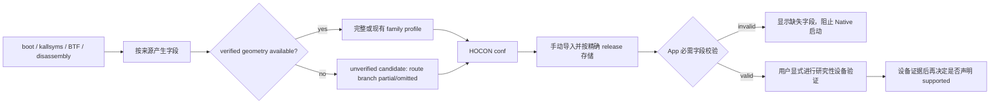

# 未验证内核候选 Profile 导出计划（2026-09-25）

## 现状与基线

- 分支：`very-not-stable-dev`；代码基线：`f424f15`。
- 用户已取消并回滚先前的 extractor fallback guard 决策（“未知 route geometry 时 `--format conf`
  必须拒绝”）：不允许因为候选“可能不能执行”而限制输出。fallback guard 计划文档已删除，
  其代码门控由本计划取代。
- 本计划响应新的需求：未验证 release 也要导出可由 App 导入的 HOCON 候选 Profile；这不等同于
  宣称设备支持。执行前的完整性与可运行性检查由 Kotlin 侧负责。
- `UserProfileStore.parseWith()` 只要求文档可解析且包含 `release`，导入按原文存储。选择后，`AndroidProfileConfigController` 会把缺失必需字段加入 `invalidPaths`，UI 与 Repository 在启动 Native 前阻止无效 Profile。
- 重要现状边界：App 把匹配当前 `uname -r` 的已导入 Profile 视为 `kernelSupported`。如果候选 Profile 后续被补全到全部有效，现有机制允许用户将其用于真机验证；本批不新增“验证状态”字段，也不改变这一既有显式导入语义。

## 目标与约束

### 目标

- 对可识别为 5.x/6.x 且能取得 release 的未验证镜像，`--format conf` 可以输出可解析、可导入的候选文档，即使当前没有可输出的 route 几何。
- 只输出现有允许的图像推导值、明确验证过的布局值和既有共享模板值；不得把 unknown-family 的 6.6、`pselect=-2`、5.15 multicast 常量或 phys 默认重新包装成图像推导结果。
- 对缺失值进行省略；保留已识别 route 的空/部分 branch，使 App 能显示缺失参数并阻止不完整 Profile 启动。
- 清楚标记文档为 unverified candidate，并在 CLI 输出中列出缺失/未验证语义。

### 非目标

- 不新增 profile schema 字段、GLK1 字段、Native/Kotlin 契约或攻击路径。
- 不把候选自动注册为内置 profile、不自动选择导入项、不更改设备 supported 判定。
- 不声称 App 能仅凭导入 Profile 判定其已验证；用户补全且字段有效后，依旧是显式用户候选，可用于研究性真机验证。
- `--format c`（C header 生成）已随 C/C++/Kotlin 消费端移除而删除，本批不再维护；`--format json` / v1 语义不变。

## 设计

### D1：`--format conf` 输出候选，不以无 route geometry 拒绝

- release 仍必须存在且 major 为 5 或 6；无 release、其他 major、无效显式 route 仍报错且不写文件。
- 有显式 route 时使用该 route；否则沿用当前 suggestion。若无 suggestion，仍可导出带 release/common fields 的候选，省略 route；App 会将 `route` 标为 invalid，用户可在 Advanced override 中选择。
- 已有 suggestion 的 route 即使 geometry 为空，也写入 `route { <name> { ... } }`；只放入下列有证据的部分字段。
  注意 App 的 `LegacyProfileConverter` 为兼容旧构建会丢弃空 route branch，因此空几何的候选导入后 `route`
  为空、需在 Advanced 手动选择；extractor 仍写出该 branch，不隐藏已推导的 route 建议。

### D2：候选 route branch 只含可信字段

| route | 未验证 release 可输出 | 不得从相邻 family 猜测 |
|---|---|---|
| `select_stack` | image disassembly 推导的 `waiter_shift` | 未验证时不能用缺省 `-2`；无推导值则省略 |
| `tcp_zerocopy` | 仅已有可信 layout 声明的 `compact_waiter` | 未验证 layout 不补 `compact_waiter` |
| `multicast_waiter` | 镜像 BTF 实际给出的 `task_offset` / `lock_offset` | 不给未验证 5.x 填入 Xperia `waiter_off`、`buffer_size`、fake/slot 常量或 `compact_waiter` |

- 已验证 Android train（6.x 家族与 `android13-5.15`）的既有几何逐字段保持不变。
- 未知 `kernel_phys_load` 不填 family default；显式 `--phys` 与可推导值沿用当前处理。
- Common symbol、BTF struct、5.x credential derivation、现有共享 6.x 模板值沿用现有 renderer 规则；候选头部注释须提示这些输出仍需对照目标镜像与设备，不把 profile 本身标成 supported。

### D3：导入与执行仍服从 App 的现有校验

- HOCON 候选保留 `release` / `schema_version`，不含 `include`，可由普通 Profile import 入口导入。
- `--format conf` 下 `require_fields` 的必需字段/struct 缺失降级为警告并省略字段，不再退出；字段完整性交由 App 的 `invalidPaths` 在执行前拦截。`--format json` / `--format c` 保持原有 fail-closed 语义。
- Kotlin 侧增加回归测试证明：部分/无 route branch 候选可存储与加载；缺失必需字段被 materialize 到 `invalidPaths`，无效时 Run 保持阻止。
- 若候选的图像推导内容已经满足全部字段校验，导入后仍可按现有“用户显式导入 Profile”流程做研究性真机验证。设备验证前不得称为受支持 Profile。若需求是“可导入但在验证前无论字段是否完整都禁止运行”，需另增候选状态与显式 promote 流程，不属于本计划。

## 改动清单

| 文件 | 计划改动 | 理由 |
|---|---|---|
| `tools/extract_rs/src/report.rs` | 将 route 几何硬拒绝改为候选 partial geometry；对未验证 multicast 仅序列化 BTF-derived task/lock；保留 verified 输出；输出 unverified 标记 | 候选仍是合法 HOCON，而非靠错误退出丢失可导入信息 |
| `tools/extract_rs/src/main.rs` | 允许 route 几何缺失；无 suggestion 时允许省略 route；`--format conf` 下把 `require_fields` 的缺失降级为警告；在 stderr 报告 candidate 状态和缺失 route 信息 | CLI 退出成功表示候选文档已生成，不表示 profile 已验证 |
| `tools/extract_rs/src/{report,main}.rs` 测试 | 覆盖 unknown release 的 partial/empty route、无几何、无 route、显式 route、禁止常量回退、verified golden 保持 | 锁定候选边界与原验证输出 |
| `app/src/test/kotlin/com/ghostlock/app/data/UserProfileStoreTest.kt` / `ControllerOverrideTest.kt` | 覆盖候选 HOCON 可导入、可选择、缺字段可见且仍阻止运行 | 验证 Rust 输出可通过 App 的真实导入/验证路径 |
| `README.md` / `README_ZH.md` | 描述 verified conf 与 unverified candidate conf 差异、显式导入语义 | CLI 契约双语一致 |
| `docs/kernel_profiles/README.md` / `_ZH.md`、`PROFILE_SCHEMA.md` / `_ZH.md` | 说明 candidate 可导入不等于完整/受支持；缺失字段需要人工核验，字段验证与设备验证分开 | 使用者能区分“导入成功”和“支持声明” |
| `docs/analysis/extractor-fallback-guard-plan.md` | 删除（用户取消并回滚其 fail-closed 决策） | 避免两份设计互相矛盾 |

## 数据流与控制流差异

控制不变量：分析建议只确定候选 route 名，不产生几何字段；任何没有可信来源的值仍然缺失；App 的 `invalidPaths` 必须继续先于 Native 启动检查。候选 Profile 不能自动覆盖任何内置值。

## 兼容性与回滚

- 已验证 train 的现有 `--format conf` 字段和值必须保持逐项相同（A301SO 5.15.189 作为 `android13-5.15` golden）。
- 未验证 release 的差异是从“route geometry 缺失即失败、无文件”改为“成功输出可导入但可能不完整的 candidate”。这项输出行为变化是本批唯一主要兼容差异。
- `--format c` 已移除；unknown pselect/phys 不得恢复为默认数字；旧 JSON 导入、GLK1、Native、attack functions 与内置 profile 不变。
- 回滚只需恢复 extractor/doc/test 变更；不迁移用户存储，不修改已有导入文档或 App 偏好。

## 验证矩阵

| 场景 | 检查 | 预期 |
|---|---|---|
| Rust 单测 | `cargo test --release --manifest-path tools/extract_rs/Cargo.toml` | candidate route/来源边界与 verified golden 全通过 |
| 格式与 lint | `cargo fmt --check --manifest-path tools/extract_rs/Cargo.toml`; `cargo clippy --all-targets --manifest-path tools/extract_rs/Cargo.toml` | 格式通过；无本批新增 finding |
| 未验证 PD2361 `5.15.178-g3575c47dc7ce-dirty` | 实际 OTA payload `--format conf`；检查 route branch、BTF task/lock、无 Xperia 常量、缺值省略 | exit 0，输出可导入 candidate；stderr 明示未验证与缺少几何 |
| 无 route geometry / 无 suggestion fixture | 实际 CLI 与 renderer fixtures | HOCON 仍包含 release；route branch按 D1；不存在时省略 route，而非编造 |
| Kotlin import/selection | `UserProfileStoreTest`、`ControllerOverrideTest` | 候选成功存储/选择；缺失值在 UI 模型 invalidPaths 中；执行前被拒绝 |
| 验证 train golden | A301SO `android13-5.15` conf 与现有 profile 对比 | 字段和值逐项一致 |
| 全项目回归 | `./gradlew :profile-core:test :app:testDebugUnitTest`、`git diff --check` | 通过；无双语文档漂移 |
| Native/设备门禁 | 不适用 | 不改 Native、GLK1 或 built-in support；本批只验证候选序列化/导入/拒绝无效字段，不声称设备支持 |

## 明确保留

- `src/core/**`、八个攻击函数、资源准备/回收次序、Native/Kotlin wire 与 profile binary 字段表。
- C 格式输出的验证门禁；JSON/v1 兼容；`LegacyProfileConverter.kt`。
- 未验证 family 的 6.6 / `pselect=-2` / 5.15 multicast / phys fallback 禁止项。
- App 对用户导入 profile 的既有显式选择方式与必需字段验证；不自动导入或自动激活。

## 进度

- [x] Explore：核实 extractor conf 门控、renderer、HOCON 导入、profile 校验和 run gate。
- [x] Design：本文列出候选输出与运行语义，获用户认可（2026-09-25）。
- [x] Implement：`report.rs`/`main.rs`/`derive.rs` 候选输出；移除 `--format c`。
- [x] Verify：Rust 测试/格式、App 单测通过，见下。

## 实际验证结果（2026-09-25）

| 检查 | 结果 |
|---|---|
| `cargo test --manifest-path tools/extract_rs/Cargo.toml` | 通过，29 passed / 0 failed（新增 candidate partial-geometry 与空 route branch 测试） |
| `cargo fmt --check --manifest-path tools/extract_rs/Cargo.toml` | 通过 |
| `cargo clippy --all-targets --manifest-path tools/extract_rs/Cargo.toml` | exit 0；仅既有 2 条 warning（`main.rs` collapsible_if / unnecessary_cast），本批未引入新 finding |
| `./gradlew :profile-core:test :app:testDebugUnitTest` | 通过；新增 `UserProfileStoreTest` 用例证明未验证 multicast 候选（仅 BTF `task_offset`/`lock_offset`）可导入并保留，且不含 Xperia 常量；既有 `ControllerOverrideTest` 用例证明缺失字段进 `invalidPaths`、执行前被拦截 |
| 未验证 release `--format conf` | 输出可解析 HOCON；route branch 保留建议 route，未获得的几何省略；stderr 标注 candidate |
| 已验证 release golden | A301SO 精确 5.15.189 输出与内置 profile 逐字段一致（受现有 `conf_5x_carries_the_derived_credential_and_multicast_geometry` 测试保护） |
| `--format c` | 已移除（CLI 不再接受 `c`）；`--help` 只列 text/json/conf |
| Native/设备门禁 | 不适用：未改 `src/core`、GLK1、profile binary 字段或设备 profile；本批只调整候选序列化与 App 校验 |

## 实现要点

- `report.rs::conf_route_geometry` 不再返回错误：未验证 5.x `multicast_waiter` 走
  `derive::multicast_geometry_btf_only`，只写 BTF 实际给出的 `task_offset`/`lock_offset`，
  不补 Xperia 常量；`select_stack` 无图像推导值时为空；`tcp_zerocopy` 未验证时为空。
- `report.rs::render_conf` 只要选定 route 就写出 route 块，几何为空时写空块，保留候选 route 名。
- `main.rs` conf 分支允许 route 缺失或几何为空，stderr 报告 candidate 与缺失语义。
- 删除 `report.rs::require_conf_route_geometry`。
- `pselect_waiter_shift_for` 的 `Option` 语义与 `phys` 的“不跨未知 family 猜默认”予以保留：
  它们表达“没有获得的值就留空”，而非“因不可执行而拒绝输出”。
- `main.rs` 在 `--format conf` 下把必需 symbol/struct 缺失的 `require_fields` 失败降级为警告，
  候选照常写出、缺字段省略；`--format json` 仍是 fail-closed，`--format c` 已移除。
