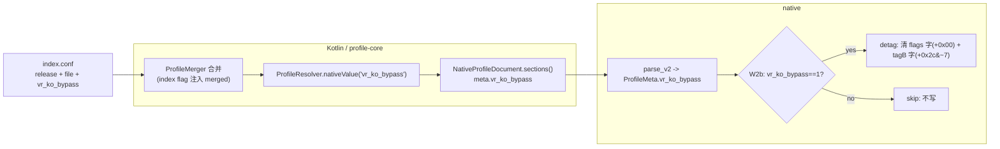
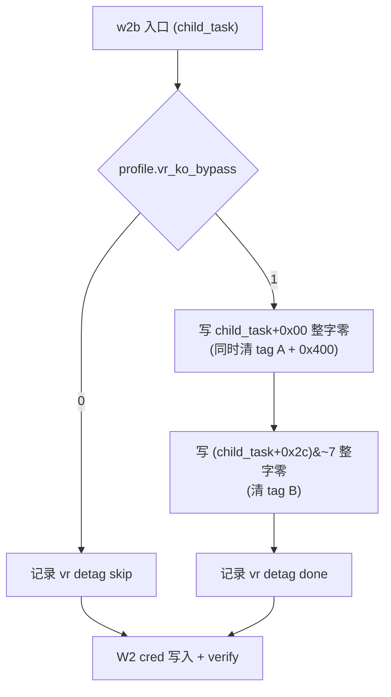

# vivo `vr.ko` 反 root 绕过接入计划（2026-09-27）

> L 级改动：跨 Native↔Kotlin profile 契约 + W2 攻击关键路径。按 `engineering-standards.md` §1.2，
> 本文先于代码；获认可后再实施。模板见 `documentation-standards.md`。

## 现状与基线

- 分支 `very-not-stable-dev`，基线 commit `870c6f2`（`ui`，2026-09-27）。
- Native W2b 已有一段 vr.ko 抹标记（`src/core/session/backend/cve_2026_43499_backend.cpp:146-216`）：
  - 门控：运行期读 `/proc/modules` 探测 `vr` 前缀（`:167-193`）；读不到才保守假设已加载。
  - 写入：两笔 64 位整字清零 —— `child_task+0x00`（覆盖 tag A `+0x06` 与 `VR_SYSCALL_TP_FLAG 0x400`，`:198-200`）、`(child_task+VR_TAG_B_OFF)&~7`（覆盖 tag B `+0x2c`，`:204-207`）。
  - `VR_TAG_B_OFF` 是编译期宏，默认 `0x2c`，注释写明只对 vivo **6.1** 验证树成立（`src/core/profile/macros.h:4-10`）。
  - 没有回读自证。
- 已知问题（来源：`xuanmou.com.cn` vivo 反 root 研究）：`vr.ko` 加载后**隐藏自身**，
  `/proc/modules` 可读但无 `vr` 行 → `vr_needed=0` → **跳过抹标记** → root child 被 `sys_exit` 探针杀。
- 支持列表现状：
  - `docs/kernel_profiles/SUPPORTED_DEVICES.md` / `_ZH.md` 是**手写文本**（vivo T4 / iQOO 12 见第 34 行），无生成脚本。
  - 机器可读的 `app/src/main/assets/kernel_profiles/index.conf` 每条只有 `release` + `file`，**无厂商/机型**。
  - 运行时设备识别只在 `AndroidGhostlockRepository.kt:983` `resolveDeviceName()` 里有一个用于显示名的 `"vivo"` 分支，不参与任何逻辑。
- KSuRoot（`hmascs/KSuRoot`）的做法（作为本次对照基线）：
  - 机制：`vr.ko` 给 app-origin task 打 tag A `+0x06` / tag B `+0x2c`，并在 `thread_info.flags` 置 `VR_SYSCALL_TP_FLAG(0x400)`；task 拿到 euid 0 后由 `sys_exit` tracepoint 探针杀。
  - 清理：**先清 `0x400`**（`AND ~0x400`），**再逐字节清 tag A / tag B**，回读自证（`root vr detag`）。
  - 不变量：tag A 与 tag B **必须同时清**（只清一个会被当 tamper 证据杀）。
  - 归属：**只挂 vivo 方案**，由构建期选载荷决定；非 vivo 选通用载荷，不执行、不检查。

## 目标与约束

目标：

1. profile 新增配置项 `vr_ko_bypass`（0/1），native 用它决定 W2b 是否执行 detag，替代不可靠的 `/proc/modules` 门控。
2. 支持列表中的 vivo / iQOO 内置 profile **自动**带上该标记（单一权威，一处维护）。
3. native detag 采用 KSuRoot 的语义与不变量（先清 `0x400`、tag A/B 同步清、只对 vivo 生效）。

非目标（明确不做）：

- **不引入任意内核读 / 掩码写原语**。当前写原语只有 `WriteMode::Zero`（8 字节写零）与 `Credential`
  （`src/core/memory/payload_builder.h:12-30`），没有"读回自证"所需的任意内核读。
  因此 KSuRoot 的"`AND ~0x400` 精确清位 + 逐字节清 tag + 回读自证"**不照搬**，见下"控制流差异"的取舍。
- 不改 `src/core/kernelsnitch/**`，不改 `LegacyProfileConverter.kt`（v1）。
- 不新增 route，不改任何 `route.*` 私有节。
- 不动 W1 / W2 cred / W3 / handoff 的既有逻辑。

## 改动清单（逐文件）

### Native

| 文件 | 改动 | 理由 |
|---|---|---|
| `src/core/profile/model.h` | `ProfileMeta`（:81-86）加 `uint8_t vr_ko_bypass = 0;`；`TargetProfile` 加 `vr_ko_bypass()` getter | 新配置权威字段 |
| `src/core/profile/binary.cpp` | `kMeta`（:61-66）加 `PLAIN("vr_ko_bypass", meta.vr_ko_bypass)` | wire v2 契约权威；`parse_v2`/`serialize` 通用，无需改 |
| `src/core/session/backend/cve_2026_43499_backend.cpp` | W2b（:165-217）：把 `vr_needed` 门控改为 `session.profile.vr_ko_bypass()`；保留两笔整字清零；日志改 `vr detag bypass=1/skip` | 消除 `/proc/modules` 漏判；写入语义不变 |
| `src/core/attack/ops.cpp`（可选） | `log_execution_settings()` 加 `log_exec("vr_ko_bypass", …)` 便于真机核对 | 可观测性 |
| `src/core/tests/profile_binary_test.cpp` | 固定向量 / round-trip 加 `vr_ko_bypass` 断言 | 字段表一致性 |

### Kotlin / profile-core

| 文件 | 改动 | 理由 |
|---|---|---|
| `profile-core/.../data/NativeProfile.kt` | 构造加 `vrKoBypass: UInt`；`sections()` 的 `meta`（:74-82）加 `"vr_ko_bypass"`；`Builder.apply()` 加分支；`fromBinary()` 加键；`from()` 读该路径 | 双侧字段表逐字一致 |
| `profile-core/.../data/profile/ProfileResolver.kt` | `KnownTopLevel`（:13-17）加 `"vr_ko_bypass"` | 否则 `validateMerged` 报 unknown key |
| `app/src/main/assets/kernel_profiles/index.conf` | vivo / iQOO 的条目加 `vr_ko_bypass = 1` | 支持列表的机器可读权威，见"自动标记" |
| `app/.../data/BuiltinProfileCatalog.kt` | `Entry`（:13-17）加 `vrKoBypass`；`loadEntries()`（:37-51）解析 index entry 的 `vr_ko_bypass` | 运行期匹配该 release 时标记可用 |
| `app/.../data/AndroidProfileConfigController.kt` | `resolve()`（:529-570）把命中 entry 的 `vr_ko_bypass` 注入 merged map | app 侧与 exporter 同源 |
| `profile-core/.../profile/ProfileExporter.kt` | 遍历 entries（:56-87）时读取 entry 的 `vr_ko_bypass` 并注入 merged | 导出侧与 app 同源（`ExporterAgreementTest` 抓漂移） |
| `docs/kernel_profiles/SUPPORTED_DEVICES.md` + `_ZH.md` | 注明 vivo / iQOO 行带反 vr.ko 跳过 | 文档同步 |
| `docs/kernel_profiles/PROFILE_SCHEMA.md` + `_ZH.md`、`defaults.md` + `_ZH.md` | 新增 `vr_ko_bypass` 说明（默认 0） | 字段文档 |

### 自动标记（"支持列表中的 vivo/iQOO 自动加标记"）

单一权威选 `index.conf`（它是支持列表的机器可读形式，且 exporter 与 app 都已读它）：

- 每条目可选 `vr_ko_bypass = 1`；初始只给已知 vivo / iQOO 的 release 加上（`6.1.145-android14-11-g74d1702dab4d-ab14669069`）。
- exporter 与 app 在 resolve 后把该值作为 `vr_ko_bypass` 顶层值落入 merged；`.conf` 若显式写了同名字段则按现有覆盖优先级覆盖（显式优先）。
- **外部导入的 profile**（如 PD2361 `5.15.178-…-dirty`）默认无标记；用户在导入的 `.conf` 顶层写 `vr_ko_bypass = 1` 即可。
- 备选（不采用）：把标记写进每个 `<release>.conf`。缺点是新机型要改多处、且"支持列表"与 `.conf` 会形成双权威。

## 数据流 / 控制流差异

### 数据流（新增标记的跨层契约）

### 控制流（W2 阶段，detag 位置不变，仅门控变）

### 取舍说明（为什么不照搬"逐字节 + 回读"）

- KSuRoot 的 C 载荷有 `pipe_phys_write_data`/`pipe_write64`，可做任意值/单字节写与回读；
  GhostLock 的 PI 写原语只有"写 8 字节零"（`WriteMode::Zero`）与"复制 cred"（`Credential`）。
- GhostLock 现有两笔**整字清零**在语义上已满足 KSuRoot 的两条不变量：
  第一笔同时清 `0x400` 与 tag A（先清 `0x400` 的要求满足），且 tag A/B 在同一轮内被**同时**清。
  代价是 `thread_info.flags` 的其它位（TIF_*）也被清 —— 对攻击 child 可容忍，且与现状一致。
- 因此本次只改**门控与归属**，写入保持现状；"精确掩码写 + 回读自证"列为批次 2（需新原语，另立项）。

## 兼容性与回滚

- wire v2 是对象分段、按 key 查表（`binary.h:12-16`），新增 `meta` entry 不移动其它字段；
  同分支 Kotlin↔native 直接替换，不做旧版本兼容（`AGENTS.md` 约定）。
- `vr_ko_bypass` 用 `PLAIN`（每次写出 0/1，显式优于隐式）：**所有内置 profile 字节都会变**，
  需重算 `app/src/test/resources/native-doc-golden.sha256`（51 行）。这是可接受的单文件成本，
  换取"0 = 显式不需要"的语义，避免 presence 隐式。
- 回滚：整体 `git revert`；无持久状态、无外部格式依赖。

## 验证矩阵

| 批次 | 内容 | 主机测试 | 构建/lint | `cmp_disasm` | 真机门禁 |
|---|---|---|---|---|---|
| 1a | wire 字段 + 双侧解析 + golden 重算 | `make -C src native-host-tests`、`./gradlew :app:testDebugUnitTest`（`ProfileRoundTripTest`、`NativeProfileDocumentTest`、`BuiltinProfilesTest`、`NativeDocumentEquivalenceTest`、`ExporterAgreementTest`） | NDK 零警告 + `make -C src lint-tidy` | 先确认 `TARGETS` 是否覆盖 W2/attack_write；覆盖则必须跑 | 不需要 |
| 1b | W2b 门控改 profile + 日志 | 同上 | 同上 | **必须**（W2 属攻击关键路径） | **必须** |
| 1c | index 自动标记 + 文档 | `BuiltinProfilesTest`、`ExporterAgreementTest` | 同上 | 与 1b 同批 | 不需要 |
| 2（另立项） | 掩码写 / 回读原语 | 固定向量 | 全门槛 | 全量 | 必须 |

1b 真机门禁（前置：冷机、CPU 4/5、单 route、KernelSU 未加载，AGENTS.md §8.3）：

- 目标设备：vivo PD2361 `5.15.178-g3575c47dc7ce-dirty`（导入 profile + 手工 `vr_ko_bypass = 1`）。
- 判定：W2 阶段出现 `vr detag bypass=1`，且 `child is root!` 后 child 未被 `sys_exit` 探针杀、handoff 完成。
- 记录归档 `docs/analysis/device-gates/`（模板见 `documentation-standards.md`），失败与通过同等归档。
- 归因纪律：`vr.ko` 相关结论需同构建复跑，单次结果不构成规律（`engineering-standards.md` §8.4）。

## 明确保留（不做）

- `/proc/modules` 探测：可保留为**日志/旁证**，但**不得**再作为是否执行 detag 的门控；是否删除该探测在批次 1b 决定并记录。
- 两笔整字清零的具体地址与顺序（`+0x00`、`(0x2c)&~7`）不变。
- `VR_TAG_B_OFF` 仍为编译期宏 `0x2c`；改成 profile 字段（支持 5.15 不同布局）列入批次 2。
- `payload_builder` / `WriteMode` / 所有 route / `kernelsnitch/` / `LegacyProfileConverter.kt`。
- 不新增配置类环境变量（`AGENTS.md` §3.1）。

## 进度

- [ ] 1a wire 字段 `meta.vr_ko_bypass` + 双侧解析 + golden 重算
- [ ] 1b W2b 门控改 `profile.vr_ko_bypass` + detag 日志 + `cmp_disasm` + 真机门禁
- [ ] 1c `index.conf` vivo/iQOO 自动标记 + 文档（SUPPORTED_DEVICES / PROFILE_SCHEMA / defaults）
- [ ] 2（另立项）掩码写 / 回读自证原语
