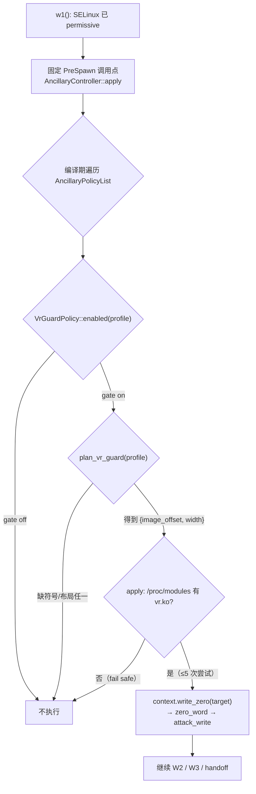
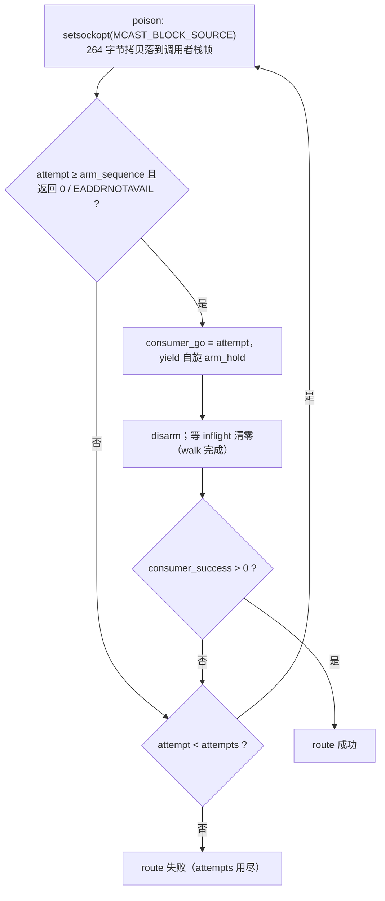

# vr.ko guard（vivo/iQOO 探针中和）批次计划（2026-09-29 起，2026-10-02 更新）

对应分支 `vr-guard-pr`（基 `deff0b1b`，目标分支 `vr-ko-bypass-dev`）。
PR 正文见 `docs/pr-note-vr-guard-pr.md`。

## 现状与基线

- 基线 `deff0b1b`（`Merge branch 'ancillary-architecture' into vr-ko-bypass-dev`）：
  该分支上 `VrGuardPolicy` 只有骨架（`enabled()` 恒 `false`），
  行为契约、执行时机与 profile 契约由 `docs/analysis/ancillary-controller-guide.md` §4–§6 规定。
- 目标问题（上游 #154 / #201 / #61）：临时 root 成功后，vivo 的 `vr.ko` 在
  `__tracepoint_sys_exit` 上的探针按 tag 杀掉 uid 0 的进程及其派生 shell
  （ksud、管理器、子 shell 连锁死亡；应用黑屏 / 管理器白屏 / 系统不稳定直到重启）。
  基线已有的逐任务清 tag 只覆盖 exploit 子进程，**覆盖不到 root 之后的 ksud 与 shell**。
- 触发设备：vivo iQOO 12（V2307A / PD2307, SM8650），
  内核 `6.1.145-android14-11-maybe-dirty`，Android 16 / OriginOS 6，
  构建 `PD2307_A_16.2.20.3.W10`。

## 目标与约束

目标：

1. 按 guide §4–§6 实现 `VrGuardPolicy`：中和 `__tracepoint_sys_exit.funcs`
   （清空后 tracepoint 迭代器跳过全部探针；打标探针仍跑，但无人响应）。
2. profile 契约（gate + 符号 + 布局）native ↔ `profile-core` 双侧镜像；
   布局来自镜像自身 BTF，**不按 `uname -r`/release 推断**（guide §5）。
3. 提取器输出该字段；新增内置 iQOO 12 profile 并登记 `index.conf`。
4. 让该内核能真正完成一轮运行（multicast 重复投毒），否则行为无法真机验证。

非目标：

- 不改 wire 版本；不改既有 profile 字节（gate 与符号仅在非零时写出）。
- 不做按内核版本硬编码的布局表（由 BTF 推导覆盖 6.1/6.6 差异）。
- 不新增 `ExploitSession` 字段、不在攻击路径引入间接分派（guide §7）。

约束：

- 属攻击关键路径改动：`cmp_disasm` 8 函数 + 真机门禁 + 归档（§8.2/§8.3）。
- 攻击函数的结构体偏移与指令形状必须不动：新增字段只能落在既有 padding 内。

## 改动清单（逐文件）

| 类别 | 文件 | 改动 |
|---|---|---|
| 行为（纯函数） | `src/core/session/ancillary/vr_guard.hpp` | `plan_vr_guard()`：profile → `{image_offset, width_bytes}`；缺符号或布局任一事实返回 `nullopt`（fail-closed）。`VrGuardPolicy::enabled()` 只做 profile gate |
| 行为（设备） | `src/core/session/ancillary/vr_guard.cpp`（新增） | 运行时 `/proc/modules` 确认 vr.ko 存在（guide §5；不可读=不存在，fail safe）；5 次尝试写 `sys_exit tp->funcs`；失败不致命，仅告警 |
| 能力注入 | `src/core/session/ancillary/ancillary_policy.hpp` | `AncillaryZeroFn write_zero`（plain 函数指针，无虚分派）；适配器**绑定 session 全局**，不引入参数派生的调用点 |
| 后端 | `src/core/session/backend/cve_2026_43499_backend.{hpp,cpp}` | `zero_word<M>()` 适配器；`w1()` 末尾固定 `PreSpawn` 调用点（加行为只动注册表，不动此块） |
| profile 模型 | `src/core/profile/model.h` | `misc.vr_guard`（gate）、`misc.vr_sys_exit_tp`、`misc.vr_tracepoint_funcs`；`McastTuning` + `mcast_tuning()`。**新字段全部落在既有 padding 内** |
| wire | `src/core/profile/binary.cpp` | vr.ko 三键与 multicast `attempts/arm_sequence/arm_hold` 映射到上述字段（wire 键名不变） |
| 读取点 | `src/core/attack/ops.cpp`、`src/core/route/multicast_waiter_route.cpp` | `mcast_*` 改经 `mcast_tuning()` 读取 |
| multicast 路由 | `src/core/route/multicast_waiter_route.cpp` | 单次投毒 → 重复投毒 / 重复 walk（`attempts/arm_sequence/arm_hold`，默认 128/16/20000） |
| 提取器 | `tools/extract_rs/src/{symbols,report}.rs` | `__tracepoint_sys_exit`（optional）+ BTF `tracepoint.funcs`；`--format conf` 输出 gate/符号/布局 |
| profile-core | `profile-core/.../NativeProfile.kt` 等 | gate/符号/布局的读写、导出与解析器白名单；另镜像 multicast `attempts/arm_sequence/arm_hold`（`MulticastConfig`，随新内置一并补齐）；冻结 golden 夹具不变 |
| 导出器合并修复 | `profile-core/.../ProfileMerger.kt` | 合并基准改为**深拷贝**共享 execution 预设（见下节） |
| 迁移夹具 | `app/src/test/resources/remote-main-6x-offsets.json`、`ProfileMigrationEquivalenceTest.kt` | 新内置进入 remote/main 夹具（实测值 + 嵌套 `route` 声明）；尺寸断言 52 → 53 |
| 内置 profile | `app/src/main/assets/kernel_profiles/6.1.145-android14-11-maybe-dirty.conf`（新增）+ `index.conf` | iQOO 12 条目：gate on、布局 64、multicast 几何与调参、cred refs |
| 主机测试 | `src/core/tests/ancillary_test.cpp` | gate 开/关、fail-closed plan、目标算术；字段位置随 padding 重构同步 |

## 数据流/控制流差异

本次有两处控制流变化，各一张图。行为内部不改变攻击函数语句顺序：调用点在攻击路径之外。





- 控制流：`w1()` 写完 SELinux / 已 permissive 之后 → 固定 `PreSpawn` 调用点 →
  `AncillaryController<M>::apply`（编译期遍历注册表）→ `VrGuardPolicy::apply<M>`
  → profile gate + `/proc/modules` + `plan_vr_guard` → `context.write_zero(target, desc)`
  → `zero_word<M>` → `attack_write<M>(g_exploit_session, …)`。
  **攻击函数内部的语句顺序不变**；调用点在攻击路径之外（此刻 SELinux 已 permissive、
  victim 尚未 spawn）。
- 数据流：布局事实不再来自内核版本 —— `offsetof(struct tracepoint, funcs)` 由镜像 BTF 推导
  （6.1 为 `0x40`，6.6 因新增 `probestub` 为 `0x48`），gate 与符号由提取器写入 profile。
- 不变量（主机探针实测，基线与候选一致）：`sizeof(kernel_offsets)=448`、
  `sizeof(TargetProfile)=712`、`misc@248 / geometry@288 / execution@328`、
  `sizeof(KernelMisc)=40`、`tail pad=4` —— 新增字段全部落在既有 padding，攻击函数偏移未动。

## 兼容性与回滚

- wire：纯加键；旧 profile 字节不变（gate 与符号仅在非零时写出，冻结 golden 未重算）。
- 行为默认关：profile 不带 `vr_guard` 即不执行；提取器只在 BTF 给出布局时输出布局段。
- 回滚：单分支 revert。multicast 重复投毒可由
  `route.multicast_waiter.{attempts,arm_sequence,arm_hold}` 覆盖回单次语义。

## 新内置 profile 附带的两项修复（2026-10-02）

新内置条目把两个既有缺陷变成可见失败，随本批次一并修复：

1. **导出器合并状态泄漏**（`ProfileMerger.resolveMerged`）：合并基准曾直接引用共享的
   `execution` 预设实例，而 `deepMergeValues` 原地写入 —— 首个覆盖 execution 值的内置
   （本 profile 的 `heap.prepare_max_attempts = 12`）把它写进共享预设，同进程内其后的
   profile 全部继承 12，直到某个 profile 显式写回 4。`ExporterAgreementTest`（导出集与
   app 自身文档逐字节比对）在 9 个 profile 上复现。修复：种子前深拷贝该预设
   （`copyValue()`）。缺陷此前不可见，因为没有任何内置把 execution 值改成非默认。
2. **迁移夹具缺口**（`ProfileMigrationEquivalenceTest`）：该测试要求 remote/main 夹具覆盖
   每个现行 6.x 内置。新条目按实测值写入；remote/main 时代没有 multicast 路由，其 `route`
   以嵌套对象声明（转换器对该形态原样透传），迁移解析结果与内置文档逐字节一致；夹具尺寸
   断言随之为 53。

## 验证矩阵

| 项 | 命令 | 结果 |
|---|---|---|
| 主机单测 | `make -C src native-host-tests`（WSL g++ 15） | **25/25 PASS**（`tcp_zerocopy_route_test` 在 x86 上 `yield` 汇编失败，基线同样失败，非本 PR 引入；2026-10-02 复跑） |
| NDK 构建 | `make -C src ghostlock`（ONDK r30.1，API 35） | **0 warning**（二进制 md5 `02f2be01`） |
| lint | `make -C src lint-tidy`（ONDK r30.1 clang-tidy） | **rc=0**（2026-10-02 复跑） |
| 反汇编核对 | `tools/cmp_disasm.py <baseline> build/native/ghostlock` | 见下节 |
| Rust | `cargo test`（extract_rs） | 34/34（2026-09-30）；`--format conf` 对本机 boot.img 复核输出 `vr_sys_exit_tp=37532032`、`tracepoint_funcs=64`（2026-10-02） |
| Kotlin | `:profile-core:test` + `:app:testDebugUnitTest` | 全绿（**80 app 测试 + 17 profile-core**，2026-10-02；含新增 vr.ko 往返夹具、multicast 调参键向量与两处修复的回归） |
| 真机门禁 | 冷启动 / 锁屏 / multicast | 2026-09-30 PASS（旧二进制）；**2026-10-02 最终二进制复跑 PASS**，见 `docs/analysis/device-gates/ANC-01-20261002-multicast-direct-pass.md` |

## 反汇编核对记录（cmp_disasm）

- 基线二进制：干净 `deff0b1b` 工作树构建（md5 `27879fa7b77f03afc786954745dea9f0`）。
- 候选二进制：本分支 + 2026-10-02 批次构建（md5 `02f2be01155bcb3603c77d00a58ded1c`）。
- 工具：分支自带 `tools/cmp_disasm.py`（`51008aa6`，三级）；另用 `origin/main`
  的两级版本（`0fad441f`）交叉核对。**未修改本工具**。

| 函数 | 分支工具（三级） | main 工具（两级） | 复核结论 |
|---|---|---|---|
| `owner_thread` | OPERAND-DIFF ×2 | **IDENTICAL (strict)** | 两处均为 `adrp` 页基址 / 字符串偏移编码；解析后同为 `g_exploit_session+0x1d0`、同一字面量 |
| `waiter_thread` | OPERAND-DIFF ×31 | LAYOUT-SHIFT ×10（仅注解） | 15 处对象 + 16 处字面量，解析后两侧**完全一致** |
| `consumer_thread` | OPERAND-DIFF ×8 | LAYOUT-SHIFT ×2 | 5 处对象 + 3 处字面量，同上 |
| `run_main_route_threads` | OPERAND-DIFF ×45 | LAYOUT-SHIFT ×3 | 33 处对象 + 11 处字面量 + 1 处手工解析（`g_exploit_session+0x5d0`），同上 |
| `do_one_write`（3 个 middleware 实例） | OPERAND-DIFF ×16/实例 | **IDENTICAL (strict)**，126 条/实例 | 每实例 6 处对象 + 10 处字面量，解析后完全一致 |
| `do_kernel5_fake_lock_route` | DIFF 174 → 222 | DIFF 174 → 222 | **既定行为改动**（multicast 重复投毒/重复 walk）：循环包裹既有 poison+walk 主体，主体内语句顺序与 prepare/recycle 顺序不变；真机门禁见下 |
| `multicast_owner_worker` / `multicast_waiter_worker` | MISSING（两侧皆无此符号） | MISSING | 本分支 multicast 实现没有这两个 worker（未实例化）——与 `kernel-phys-offset-plan.md` 反汇编核对记录中同类结论一致（该记录同样把这两项记为「两边都不存在」） |

**复核方法（可复现）**：对每条 `OPERAND-DIFF` 指令，按 `adrp` 页基址 + 立即数解析有效地址，
再经符号表折算为 `符号+偏移`；字符串地址按 ELF 段映射（`llvm-readelf -l`）读出字面量并比对。
结果：**5 个未改行为的攻击函数合计 102 条差异指令，全部解析为「同一对象成员」或
「同一字符串字面量」，0 例指向不同目标**（`do_kernel5_fake_lock_route` 之外）。
102 为单实例口径（`do_one_write` 取一个 middleware 实例）；其三个实例各 16 条，
全部计入为 134 条。
结论：差异均为链接期数据/字符串布局位移引起的**地址编码与最近的符号注解**变化，
不包含结构体成员偏移变化、不包含控制流或语句顺序变化。

### 适配器绑定 session 全局（2026-10-02 修复）

早期实现中 `zero_word<M>(ExploitSession&, …)` 把**参数**转发给 `attack_write<M>`；
经函数指针（`AncillaryZeroFn`）间接调用后，LTO 无法再证明该参数恒为 session 全局，
`attack_write` 由「参数被常量折叠」退化为保留参数 → 寄存器分配与帧大小变化
（`do_one_write` 126 → 130，多保存一个 callee-saved 寄存器）。
将适配器改为绑定 session 全局（`zero_word<M>(target, desc)` 内部使用 `g_exploit_session`）后，
`attack_write` 的所有调用点重新都传同一常量 → **`do_one_write` 恢复 IDENTICAL (strict)，126 条**。
这也消除了「行为实现改动攻击函数代码形状」的耦合（guide §7、AGENTS.md 字节核对要求）。

### 复核脚本

`tmp_resolve2.py` / `tmp_resolve_diffs.py`（工作区 `ghostlock-analysis/`，一次性工具，不入库）
可按上述方法复算本表；WSL 下运行时把脚本内 `BIN` 与 `read_cstr` 的路径换成 `/mnt/e/...`。
`count_diffs.py`（仓库根，未入库）给出未截断的逐函数计数。

2026-10-02 复算：`owner_thread` 1 对象 + 1 字面量；`waiter_thread` 15 + 16；
`consumer_thread` 5 + 3；`run_main_route_threads` 33 + 11（另 1 条手工解析）；
`attack_write`×3 每实例 6 + 10。`DIFFERENT obj/str` 全为 0。

## 真机门禁

2026-09-30（旧二进制），冷启动、锁屏未解锁、multicast、`main=4 consumer=5`：

```
[*] cpu pair: main=4 consumer=5
[*] multicast route status=0 clean=1/1 step=0 errno=0 attempts=16 calls=1 success=1
[*] vr guard: neutralizing __tracepoint_sys_exit.funcs
    image=ffffffc0823cb1c0 target=ffffff802a3cb1c0 width=8
[+] vr guard: sys_exit probe disabled (attempt 1)
[+] child is root!
[+] KernelSU ready
```

`image = KIMAGE_TEXT_BASE(0xffffffc080000000) + 0x23cb180 + 0x40`；`target` 为其 direct-map 别名；
`su -c id` → `uid=0(root) context=u:r:ksu:s0`；设备未 panic，`loadavg` 0.65 平稳；
KSU 管理器模块页正常渲染（#154/#201 的失败形态未复现）。

**已补（2026-10-02）**：最终二进制（代码 tip `a329df60`，`build/native/ghostlock` SHA-256
`7d85c26b…`）在冷启动、锁屏、multicast、`main=4 consumer=5` 上复跑 **PASS**：
`vr guard: sys_exit probe disabled` → `child is root!` → `KernelSU ready`，`su -c id` =
`uid=0(root) context=u:r:ksu:s0`，设备未 panic、SELinux 回到 Enforcing。归档记录：
`docs/analysis/device-gates/ANC-01-20261002-multicast-direct-pass.md`（含逐次尝试统计、
`--dump-kernel-log` 证据包与设备侧 `ghostlock_ksu.log`）。

两条观察（写进记录）：本次 9 次尝试 1 次完整通过，失败均为 route 阶段 panic
（`KERNEL-PANIC-01` 类，环境/时序，不归因代码）；本机开机后 ≈60–90s 的低噪声窗口
（套件 README 的经验）明显优于 240s+ 窗口（后者 6/6 失败）。

## 明确保留

- 不新增 `ExploitSession` 字段（guide §7）。
- 不动 kernelsnitch、`LegacyProfileConverter.kt` 与保留清单文件。
- 不改 wire 版本、不动既有 profile 字节。
- 不修改 `tools/cmp_disasm.py`（两个版本的差异属上游演进）。

## 进度

- [x] multicast 重复投毒（`7bbaab08`）
- [x] vr.ko guard 实现（`9f2f9048`）
- [x] BTF 推导 + profile-core 镜像 + 内置 profile（`60eef53a`）
- [x] 结构体布局回归修复（新字段落 padding）+ 适配器绑定 session 全局（`2912fca4`）
- [x] multicast 调参键的 Kotlin 镜像（`1dc8d2e3`）
- [x] 新内置触发的两项修复：导出器合并隔离（`67a792c3`）+ 迁移夹具覆盖（`a329df60`）
- [x] 主机测试 25/25、NDK 0 warning、lint rc=0、cmp_disasm 复核记录（本文档）
- [x] 冷启动真机门禁复跑 + 日志归档（ANC-01，2026-10-02，PASS）
- [ ] 推送分支并开 PR（本机无 `gh`；步骤见 `SUBMIT.md`）
