> æ�¢å¤�说æ˜�（2026-10-06）：å�Ÿå§‹è·¯å¾„ ¼›åˆ é™¤æ��交 ¼ˆ¼‰ï¼›æ�¢å¤�æ�¥æº� git show c50e3ef44735abd0ac4c54315c80063dea1dc39f^:docs/analysis/remove-multicast-resident-plan.md；内容为删除å‰�å�Ÿæ–‡ï¼Œæœªæ”¹åŠ¨ã€‚

# 删除 multicast resident 写入器� fake BSS 字段 计划（2026-09-26）

## �状�基线

- 分支 `exp/multicast-2`（��退�的主线 `a5a7243` 切出，工作树相对 `remote/very-not-stable-dev`
  仅多两个 Kotlin 文件）。
- 5.15 multicast �际命中路径是 **one-shot**（`do_kernel5_fake_lock_route`），��：
  - `attack_write`（`session/backend/cve_2026_43499_backend.cpp:489`）先试 `M::resident_write`，
    �有返� `nullopt` ��到 one-shot；
  - `MulticastPolicy::resident_write`（`route/multicast_waiter_route.cpp:457`）在
    `profile.multicast_resident()` 为�时返� `nullopt`；
  - 内置 5.15 profile 无 `multicast_resident` 键，且 Kotlin `ProfileResolver.nativeValue` �映射
    该键（�到被 `validateMerged` 拒�的顶层键）→ 值� 0（`known-bugs-2026-09-26-multicast.md` BUG-1）。
  - `remote/very-not-stable-dev` �期全部 PASS 门�（B3/B4×5/RACE-LIFETIME）�功日志�为 one-shot；
    resident 的 `5.x resident writer ready` �未出�。
- resident 在 A301SO 上�未验��功（作者�版 PoC �样写�中；`initial_research.md` 更正）。
- resident �赖的 `fake_lock_offset`/`fake_task_offset` 需� `z_pagemap_global` 符� + 人工�移，
  是 extractor 最难���也最��移�的部分（用户 2026-09-26 决策删除）。
- legacy（v1 `offsets.json`）在 `remote/main` 中**��任何 mcast 字段**；local 的 mcast 支�是
  `8ea6d4c`（GLK1 v4）�加的，�越界，本计划一并清�。

## 目标�约�

### 目标

1. 删除 resident 写入器全部���其 route hook：`MulticastWaiterRoute` 类/`.h`�`resident_route()`�
   `kernel5_resident_{start,write,stop}`�`MulticastPolicy::resident_write`/`w1_resident_repair`。
2. 删除 resident 专� profile 数�：`multicast_resident`�`mcast_fake_lock_offset`�
   `mcast_fake_task_offset`�`mcast_lock_slots_offset`�`mcast_lock_slot_count`�
   `mcast_lock_slot_stride`�`off_mcast_fake_bss`，以� resident 时��数
   `multicast_ready_timeout_ms`/`multicast_post_requeue_settle_us`/`multicast_post_adjust_settle_us`
   （仅 resident worker 使用）。
3. �步删除 extractor 的 mcast fake 几何�导� golden 断言�Kotlin �侧�置�内置 profile�测试�
   文档。
4. �� one-shot multicast�select�tcp 行为� wire 语义��。

### �目标

- �删 route��改 `RouteKind`/`kRouteCatalog`（multicast �留）。
- �删 one-shot 路径� `w2_fast_repair_*`�`w1_scratch_repair`（one-shot 在用）。
- �改 select/tcp profile 字段�页�造�算法。
- �改� v1 legacy 对 pselect/tcp �通用符�的解�；仅移除本项目�加的 multicast 支�（� D4）。
- �声称任何新设备�支�。

## 设计

### D1：删除 Native resident ��

- `route/multicast_waiter_route.h`：删 `MulticastWaiterRoute` 类�`ResidentState`�`can_rollback_prearm`/
  `requires_fail_stop`�`resident_route()`；��留 one-shot 所需的声�。
- `route/multicast_waiter_route.cpp`：删文件级 `multicast_resident_route` �例�两个 worker�
  `start/write/stop`�`multicast_waiter_stamp`�resident disarm/destroy�`kernel5_resident_*` 包装�
  `MulticastPolicy::resident_write`/`w1_resident_repair`；�留 `do_kernel5_fake_lock_route`（one-shot）
  � `w2_fast_repair_*`。
- `route/route_policy.hpp`：� `MiddlewarePolicy` concept � `RoutePolicyDefaults` 删除
  `resident_write`/`w1_resident_repair`；�留 `w2_fast_repair_*`。
- `route/route_api.hpp`：删 `kernel5_resident_write` 声�（若�有）。
- `session/backend/cve_2026_43499_backend.cpp`：
  - `:489` 删除 `M::resident_write` �置分支，`attack_write` 直� heap spray + `run_middleware_route`；
  - `:349` `w1_scratch_repair` �� `multicast_resident()` 早退（�执行 one-shot scratch repair）；
  - `:396` �� `multicast_resident()` �件（� `w1_attempts = 1`）；
  - `:409` 删除 W1 失败时的 `kernel5_resident_stop()`。
- `session/exploit_session.{hpp,cpp}`：删 `release_resident_heap()`（其函数体为通用
  `close_reclaim_sockets`+`cleanup_page_prepare_state`，删除�由既有清�路径覆盖；若他处�需，改为
  直�调用那两个 support 函数）。

### D2：删除 profile 字段（Native + wire）

- `profile/model.h`：`kernel_offsets` 删 `multicast_resident`�`mcast_fake_lock_offset`�
  `mcast_fake_task_offset`�`mcast_lock_slots_offset`�`mcast_lock_slot_count`�
  `mcast_lock_slot_stride`�`off_mcast_fake_bss`；删 `multicast_resident()` 访问器；
  `MulticastWaiterLayout` 删 `fake_lock_offset`/`fake_task_offset`/`lock_slots_offset`/
  `lock_slot_count`/`lock_slot_stride`/`fake_bss_image_offset`；`multicast_layout()` �步；
  resident 时�访问器（`multicast_ready_timeout_ms`/`post_requeue_settle_us`/`post_adjust_settle_us`）
  删除。
- `profile/binary.cpp`：删对应字段表项。
- `profile/execution`（若有 resident 时�字段）�步。

### D3：Kotlin �侧�步（必须�字一致）

- `profile-core/.../route/MulticastConfig.kt`：删 `fakeBssImageOffset`/`resident`/时�字段�
  `MulticastGeometry` 的 fake/slot 字段；`entries()`/`apply()`/`from()`/`EMPTY` �步。
- `ProfileResolver.nativeValue`：确认无�留 resident 分支（本就�映射）。
- `ui/FieldLabels.kt` + `res/values*/strings.xml`：删 resident/fake/slot 标签。
- `app/data/LegacyProfileConverter.kt`�`AndroidProfileConfigController.kt` 中 resident 字段映射删除。
- 内置 `app/src/main/assets/kernel_profiles/5.15.189-…conf`�`5.15-template.conf`：删
  `fake_lock_offset`/`fake_task_offset`/`lock_slots_offset`/`lock_slot_count`/`lock_slot_stride`/
  `mcast_fake_bss`。

### D4：� legacy 移除 multicast（�� remote/main 语义）

- 事�：`remote/main` 的 `offsets_json.c` ��任何 mcast 字段；local legacy 的 mcast 支�是
  `8ea6d4c`（GLK1 v4 ��）�加的，�背“新 route �改 legacy�。
- `src/core/legacy/offsets_json.cpp`：删除 `decode_multicast_branch()`�`g_profile_map` 中的
  `mcast_*` 项�`decode_text` 中对 `route.multicast_waiter` 分支的解�� `kRouteMulticastWaiter`
  赋值；legacy ��为“�解� pselect/tcp + 通用符��。
- `app/src/main/kotlin/.../LegacyProfileConverter.kt`：删除 `McastFields`�`MulticastRouteCodec`�
  `moveMcast`�v1→`multicast_waiter` 的路由�断（`:346-347`）�其它 mcast 引用。
- `kernel_offsets` ��留 one-shot 使用的 `mcast_waiter_off`/`mcast_buffer_size`/
  `mcast_task_offset`/`mcast_lock_offset`（GLK1/HOCON �置需�）；legacy ��为它们建立 v1 映射。
- 测试：删 `offsets_json_test.cpp` 的 multicast 用例；新� remote/main �考格���
  （`check_remote_main_reference_format`）钉死 100% 字段映射。

### D4.1：legacy ↔ remote/main 字段映射核对（100%）

对照 `remote/main:src/core/offsets_json.c` + `src/kernels/offsets.h`：

| remote/main �� | 字段 | � legacy |
|---|---|---|
| 顶层标� | `kernel_phys_load`�`pselect_waiter_shift`�`compact_waiter`�`mm_struct_sz` | `g_profile_map` 全覆盖 |
| `symbols{}` | 9 个 `off_*`（init_task/init_cred/root_task_group/selinux_enforcing/selinux_blob_sizes/security_hook_heads/slide_nfulnl_logger/slide_loggers_0_1/slide_boot_id） | `g_symbol_map` 9/9 + `symbols{}` 嵌套读� |
| `struct_fields{}` | 15 个 `task_*` | `g_task_map` 15/15 + `struct_fields{}` 嵌套读� |

� legacy 严格贴� remote/main：**�解�** `off_empty_zero_page`�`kernel_major`�`recommend_shizuku`
（�两者 remote/main 的 struct 里没有；�者当时�存在），分别默认 `kernel_major = 6`�
`recommend_shizuku = 0`；native `infer_route` � Kotlin `inferRoute` �� 5.x→multicast 分支，
��留 `compact_waiter → tcp / else select`。��留的是当� schema 的本地过渡处�
（`cred_*`�`kernelsnitch{}`�`route/fallback`�`execution`），它们��自 remote/main 的字段集。

守�：`offsets_json_test.cpp::check_remote_main_reference_format` 用 remote/main �始 JSON 形状
（无 `schema_version`�无 `route`）走 `profile_json::select_entry`+`fill_entry`，断言 4 标� + 9 symbols +
15 task 全部 1:1 映射。Kotlin 侧：`LegacyProfileConverter` 仅对**带 release 的完整 legacy 文档**
默认 `kernel_major=6`（稀� override �注入，��覆盖内置 5.15 的 `kernel_major=5`）。

### D5：extractor

- `tools/extract_rs/src/derive.rs`：删 `MULTICAST_5X_FAKE_*`/`LOCK_SLOTS` 常��其对
  `fake_lock_offset`/`fake_task_offset`/`lock_slots_offset` 的输出。
- `tools/extract_rs/src/main.rs`：删 `mcast_fake_bss: kallsyms::unique(&symbols, "z_pagemap_global")`。
- `tools/extract_rs/src/report.rs`：删 `mcast_fake_bss` 字段� conf 输出�更新 golden 断言
  （`report.rs:464/471/484/517-519`�`derive.rs:155-156/836-838`）。

### D6：测试�文档

- Native 测试：`multicast_waiter_route_test.cpp`（删 resident 用例，�留 one-shot ��）�
  `profile_test.cpp`�`profile_binary_test.cpp`（删删字段断言）�`heap_context_test.cpp`（若� resident）。
- Kotlin 测试：`NativeProfileDocumentTest.kt`�`ProfileRoundTripTest.kt`�`OffsetMatchingTest.kt`�
  `RouteCatalogAgreementTest.kt`（route ��，确认��影�）。
- 文档：`docs/kernel_profiles/PROFILE_SCHEMA*.md`�`defaults*.md`�`templates`�
  `docs/development/adding-a-component.md`�`src/core/README.md`�`AGENTS.md` 中 resident 字段�述。

## 数��/�制�差异

```mermaid
flowchart TD
  subgraph Old[当�]
    A[attack_write] --> B{"M::resident_write"}
    B -- "multicast_resident=1" --> R[resident: BSS fake lock/task + slots]
    B -- nullopt --> O1[heap spray + one-shot multicast]
  end
  subgraph New[本计划]
    A2[attack_write] --> O2[heap spray + one-shot multicast<br/>do_kernel5_fake_lock_route]
    O2 --> F[w2_fast_repair / w1_scratch_repair �留]
  end
```

���：one-shot 写�语�select/tcp�`prepare_kernel_page`/`w2_fast_repair` 顺��语义��；
� resident profile 字段的 wire 布局��。

## 兼容性��滚

- GLK1 wire：字段表按�删除；旧 `.bin` �带已删键时的行为需在验�矩阵核对（未知键应被忽略而�拒�）。
- 内置 profile � extractor 输出�步删除，��候选 HOCON �产出这些键。
- �滚：�� resident ���字段（git revert），��移用户数�。

## 验�矩阵

| 批次 | 检查 | 预期 |
|---|---|---|
| B1 Native 删除 | `make -C src native-host-tests` | 通过 |
| B1 | `make -C src ghostlock`（NDK） | 零告警 |
| B1 | `make -C src lint-tidy` | 0 findings |
| B1 | `tools/cmp_disasm.py <baseline> build/native/ghostlock` | 8 函数 IDENTICAL 或已�核差异（`do_one_write`/`do_kernel5_fake_lock_route` �能因删�置分支�化，需���核顺����） |
| B2 字段删除 | Native 字段表 ↔ Kotlin config 一致性测试（`route_catalog_test`/`RouteCatalogAgreementTest`/`profile_binary_test`） | �一列表 |
| B2 | `cargo test --release --manifest-path tools/extract_rs/Cargo.toml` | 通过（golden 更新） |
| B2 | `./gradlew :app:testDebugUnitTest` | 通过 |
| B3 行为 | 真机门�：冷机�固定 CPU 对�� route（multicast）�KernelSU 未加载 | W1/W2/W3 写验�通过；日志归档 `docs/analysis/device-gates/*.md` |
| B3 | �归：one-shot �功�抽样（N 次冷机） | 记录命中�，作为删除�的基线 |

> 攻击关键路径改动：`cmp_disasm`（8 函数）+ 真机门� + 门�记录缺一��。

## �确�留

- `do_kernel5_fake_lock_route`（one-shot）�`prepare_kernel_page`�`w2_fast_repair_*`�
  `w1_scratch_repair`�`stash/activate_prebuilt_page`。
- `select_stack_route` / `tcp_zerocopy_route`；`race/**` 线程模�。
- `RouteKind`/`kRouteCatalog`�GLK1 版本�`--format conf` 的未验�候选语义。
- one-shot 需�的 wire 字段 `mcast_waiter_off`/`mcast_buffer_size`/`mcast_task_offset`/
  `mcast_lock_offset`（GLK1/HOCON �置路径）。
- v1 legacy 对 pselect/tcp �通用符�的解�；multicast � legacy 移除（�� `remote/main` 语义）。
- `g_exploit_session`�`g_direct_map_end` 约定。

## 进度

- [x] Explore：确认 resident �未被�用/验�；one-shot 为唯一�功路径；字段�字段使用点已列。
- [x] Design：本计划（�用户认�：hook 彻底删�时��数删�legacy multicast 整体移除）。
- [x] B1：删除 Native resident �� + hook + backend 调用。验�：host tests PASS�NDK 零告警�lint 0 finding�
  `cmp_disasm` �核（`do_one_write` 仅删 resident optional 快速路径 6 �；worker MISSING �预期；其余为地��定�）。
- [x] B2：删除 profile 字段并�侧�步（Native/Kotlin/extractor/assets/tests/docs）。验�：host tests PASS�
  NDK 零告警�lint 0 finding�`./gradlew :app:testDebugUnitTest` 全绿�`cargo test` 全绿�golden 更新。
- [x] B3：真机门� **PASS**（用户 2026-09-26 确认）；归档记录待补（`docs/analysis/device-gates/`）。
  legacy↔remote/main 字段映射核对完�并加守�测试（D4.1）。
