> æ�¢å¤�说æ˜�（2026-10-06）：å�Ÿå§‹è·¯å¾„ ¼›åˆ é™¤æ��交 ¼ˆ¼‰ï¼›æ�¢å¤�æ�¥æº� git show c50e3ef44735abd0ac4c54315c80063dea1dc39f^:docs/analysis/wire-v2-object-sections-plan.md；内容为删除å‰�å�Ÿæ–‡ï¼Œæœªæ”¹åŠ¨ã€‚

# Wire v2：对象分段 + �� schema + 严格值 计划（2026-09-27）

> 说�：本分支统一为 v2；旧的 v2/v3 定长格�直�替�（Kotlin↔native 版本绑定，��兼容）。
> `src/core/legacy/` 的 v1 JSON 路径已删除，v1 �由 Kotlin `LegacyProfileConverter.kt` 转 v2。

## �状�基线

- 分支 `exp/multicast-2`，基线�交 `1b45387`。
- 当� wire = GLK1 **v3**（`profile-core/.../NativeProfile.kt::toBinaryV3/fromBinaryV3`）：
  `header(16) + release + 68×u64 定长 common + u16 middleware_count + [u8 len,key,u64] +
   u16 option_count + [u8 len,key,u64]`。
- `common` 是**�置编�**的 68 个 slot（`flattenCommon()` ↔ native `binary.cpp::kCommonFields[]`），
  顺�强耦�；�删字段必须两侧�步改索引。
- route/option 段已是“�字→u64�，但�在少数字段使用；native 解��**无法区分“键缺失�和“值 0�**。
- `MulticastConfig` 等对无符�字段用 `toConfigUInt()/toConfigULong()` **clamp**（负数→0），�
  “严格�留 0/负数�冲�。
- Kotlin 侧曾把“核心 profile 对象�和“一般执行�数�在模�上拆分（TaskStructOffsets / CredTemplate /
  KernelOffsetTable / ExecutionTuning），但 wire �混在 68 slot 里，**未�对象级对应**。

## 目标�约�

### 目标

1. wire 改为**对象分段**：�个模�对象一个具� section，section 内是“字段�→u64��目，长度��。
2. **presence �值正交**：字段“�供/未�供�= �目是�出�；值按 u64 ��**严格�存**（0/负数/正数�样），
   �� clamp。
3. native 结�体**拆分为� Kotlin 对象一一对应的�结�**，�选字段用 `std::optional` / presence。
4. **��定长 68**，schema ��删字段而�改容器（�扩展）。
5. Kotlin 对象字段相应改为�空（`Long?`/`Int?`），`entries()` �输出� null；渲染 `= null`。
6. **数值符�/宽度�侧对�**：Kotlin 字段类�必须� native �员的符�和宽度一致——
   `uint8_t→UByte`�`uint32_t→UInt`�`uint64_t→ULong`�`int32_t→Int`�`int64_t→Long`；
   �选字段加 `?`（如 `std::optional<uint32_t>` ↔ `UInt?`）。��出� Kotlin 用 `Long` 承载
   native `uint32_t`�或 `toConfigUInt` 之类改写的情况。wire 的 u64 仅作为�容器。

### �目标

- �改 HOCON �置文件格�� extractor 输出（extractor �产 HOCON；wire 由 app 生�）。
- �改路由算法/攻击代�语义（仅数���）。
- ��留 v2/v3 解�（native � Kotlin 版本绑定，�按用户�求直�替� v3）。
- �改 `legacy/`（v1 offsets.json）。

## 设计

### D1：wire v2 布局

```
u32 magic
u16 version = 4
u16 frontend
u16 backend
u16 route_kind
u16 release_len
release[release_len]
u16 section_count
repeat section_count:
    u8  name_len, name[name_len]            # "task_struct", "cred", "offset",
                                            # "kernel", "execution.<group>",
                                            # "route.multicast_waiter", "meta"...
    u32 entry_count
    repeat entry_count:
        u8  key_len, key[key_len]
        u64 value                            # �始��（有符�二补数）
```

- 无定长 core；无�置耦�；section/entry 顺�无关（解�按�字）。
- 扩展：新�字段 = 在该 section 加一个�目；新�对象 = 加一个 section。
- presence：�目出��“�供�；`u64` 直��拷�，`0`/负数�法。
- `meta` section 承载：`kernel_major`�`recommend_shizuku`�`fallback_route`�`safe_mode` 等标�。

### D2：对象级对应

| wire section | Kotlin 对象 | native 结�体 |
|---|---|---|
| `task_struct` | `TaskStructOffsets` | `TaskStructOffsets`（拆自 kernel_offsets） |
| `cred` | `CredTemplate` | `CredTemplate` |
| `offset` | `KernelOffsetTable` | `KernelOffsets` |
| `kernel` | misc（phys_load/compact_waiter/kernelsnitch/mm_struct_sz） | `KernelMisc`（optional 字段） |
| `execution.<group>` | `ExecutionTuning`（cpus/heap/race/stages/handoff/routes/selected_cpus） | `execution_settings` 的对应�结� |
| `route.<kind>` | `MulticastConfig`/`SelectConfig`/`TcpConfig` | � route layout（optional 字段） |
| `meta` | `NativeProfileDocument` 头部标� | `ProfileMeta` |

- �个对象的“�选/�自动�退�字段在 wire 里�缺席；native 侧为 `std::optional<T>`，Kotlin 侧为
  `T?`；缺席 = ��供，值 = 精确。
- 使用点：`MulticastWaiterLayout.waiter_offset` 改 `std::optional<int32_t>`；one-shot route �
  `nullopt` 直�拒�（�写入），� Kotlin 校验（缺失→invalid）��险。

### D3：native 模�拆分

- `profile::kernel_offsets` 拆为：
  `ProfileMeta`（kernel_major/recommend_shizuku/route/fallback_route/safe_mode）�`TaskStructOffsets`�
  `CredTemplate`�`KernelOffsets`�`KernelMisc`�`ExecutionSettings`；顶层 `TargetProfile` �有这些对象。
- 访问器/使用点（`address_space.cpp`�`route/*`�`backend/*`�`attack/*`）机械�移到�对象。
- `binary.cpp` 字段表按对象分组（对象� + 字段表）；解�按 section �分派，�目缺失→`nullopt`。
- **严格值**：`to_raw/from_raw` 已有；��所有 clamp，签�/���样��。

### D4：Kotlin 侧

- `NativeProfile.kt`：`toBinaryV2/fromBinaryV2`；对象 → sections；�选字段 nullable；`entries()` �略 null。
- `MulticastConfig`（� Select/Tcp）字段改 nullable；移除 `toConfigUInt/ULong` clamp（值�样 Long）。
- `ProfileResolver.nativeValue` 已返� `Long?`；`Profile.fromValueMap` ��把 null 归零（�留 null 语义）。
- 校验：`waiter_off` 等缺失 → `invalid` → 阻止�行；�供则严格使用（� 0/负数，语义�法性�判）。
- �并：`deepMergeValues` 对 `null` 跳过（�覆盖）——补测试钉死“缺席�覆盖已有值�。

### D6：数值符�/宽度对��严格范围

- Kotlin 字段类�严格等� native �员类�（目标 6），�选字段加 `?`；��用宽类�承载或
  `toConfigUInt()` 改写。
- wire �目值统一为 **`ULong`（u64 �容器）**：`UInt → toULong()`�`Int → toLong().toULong()`
  （符�扩展二补数）�`ULong` �样；native `to_raw()` 对无符� `static_cast<uint64_t>`�对有符�
  符�扩展，��一致。
- **严格性**：�� clamp/截断。用**范围校验**代替：无符�字段出�负值�或值超出字段宽度
  （如 32 �字段 > `0xFFFFFFFF`）→ **invalid**（拒��行），而�是�默 wrap/归零。
- native 解�：`from_raw<T>()` �样按�；若 Kotlin 已按类�校验，native 端��一致（越界视为无效，
  � Kotlin ��险）。
- 测试：��类�的往返（`0` / 最大值 / 负值）�越界→invalid�presence（缺席≠0）。

### D5：数��/�制�差异

```mermaid
flowchart LR
  subgraph V3[wire v3]
    A1[header + 68 定长 core + 具� route/opt] --> A2[native �置解�, 缺失=0]
  end
  subgraph V2[wire v2]
    B1[header + sections: 对象� → 字段� → u64] --> B2[native 按�解�, 缺失=nullopt]
  end
```



���：HOCON/extractor ��；route/攻击语义��；值��严格。

## 改动清�

| 文件 | 改动 | �由 |
|---|---|---|
| `profile-core/.../NativeProfile.kt` | v2 编解�；对象→section；nullable；�目值 `ULong` | D1/D2/D4/D6 |
| `profile-core/.../route/*Config.kt` | 字段类�对� native（UInt/ULong/Int）+ nullable；� clamp | D4/D6 |
| `profile-core/.../ProfileResolver.kt`/`ValueModel.kt` | null 语义��并�覆盖 | D4 |
| `app/.../AndroidProfileConfigController.kt` | 校验：缺失→invalid；渲染 null | D4 |
| `src/core/profile/model.h` | 拆�结� + optional | D2/D3 |
| `src/core/profile/binary.cpp` | v2 section 解�；对象字段表 | D1–D3 |
| `src/core/memory/address_space.cpp`�`route/*`�`session/*`�`attack/*` | 访问器�移 | D3 |
| 测试（profile_binary/profile/offsets_json/host） | v2 往返�presence�0/负数严格�缺席�覆盖 | 验� |
| 文档（PROFILE_SCHEMA�defaults�src/core/README） | 记录 v2 | 规范 |

## 验�矩阵

| 批次 | 检查 | 预期 |
|---|---|---|
| B1 wire 容器+对象往返 | `profile_binary_test`（v2：对象往返�缺字段=nullopt�0/负 严格�符�/宽度对��越界=invalid） | 通过 |
| B2 native 模�拆分 | `make -C src native-host-tests`�NDK 零告警�`lint-tidy` 0 | 通过 |
| B2 | `cmp_disasm`（若触�攻击函数内�则�核；profile 解��在 8 函数内） | IDENTICAL/�核 |
| B3 Kotlin | `./gradlew :app:testDebugUnitTest`（� golden �冻） | 通过 |
| B4 真机 | 内置 5.15 冷机� route | W1/W2/W3 通过（wire 往返�影�攻击） |

## �确�留

- HOCON �置格��extractor 输出�`legacy/` v1�route/攻击代�语义�`g_exploit_session`/`g_direct_map_end`。
- 8 攻击函数机器�（wire 改动�进入攻击路径）。

## 进度

- [x] Explore：wire v3 布局�68 slot�clamp�对象划分�状。
- [x] Design：本计划；native v1 已删�AGENTS 加版本纪律。
- [x] B1/B2 native：wire v2 容器 + 对象 section 表 + 模�拆分 + presence/严格值/类�对�；
  �移 util/address_space/runtime_struct_offsets/select_stack_route/backend；�写 profile/profile_binary 测试。
  验�：`make -C src native-host-tests` 全绿�NDK 零告警。
- [x] B3 Kotlin：`NativeProfile.kt` v2 编解� + route configs 短键/�空/� clamp + resolver/校验 + golden。
  验�：`./gradlew :app:testDebugUnitTest :profile-core:test` 全绿�`make -C src native-host-tests` 全绿�golden �冻。
  ���点：`toBinary()` 改为 v2 对象分段；optional 字段�空（`kernelPhysLoad`/`compactWaiter`/
  `kernelsnitchCollisions`/`mmStructSz`）；route section 用短键（`waiter_off`/`waiter_shift`/`attempts`…）；
  新� `NativeProfileDocument.patchSafeMode()` �代固定�移 `safeModeOffset()`（v2 无固定槽）；
  controller 校验对无符�字段越界/负值判 invalid（�� clamp）。
- [ ] B4：真机�归（需设备）。
