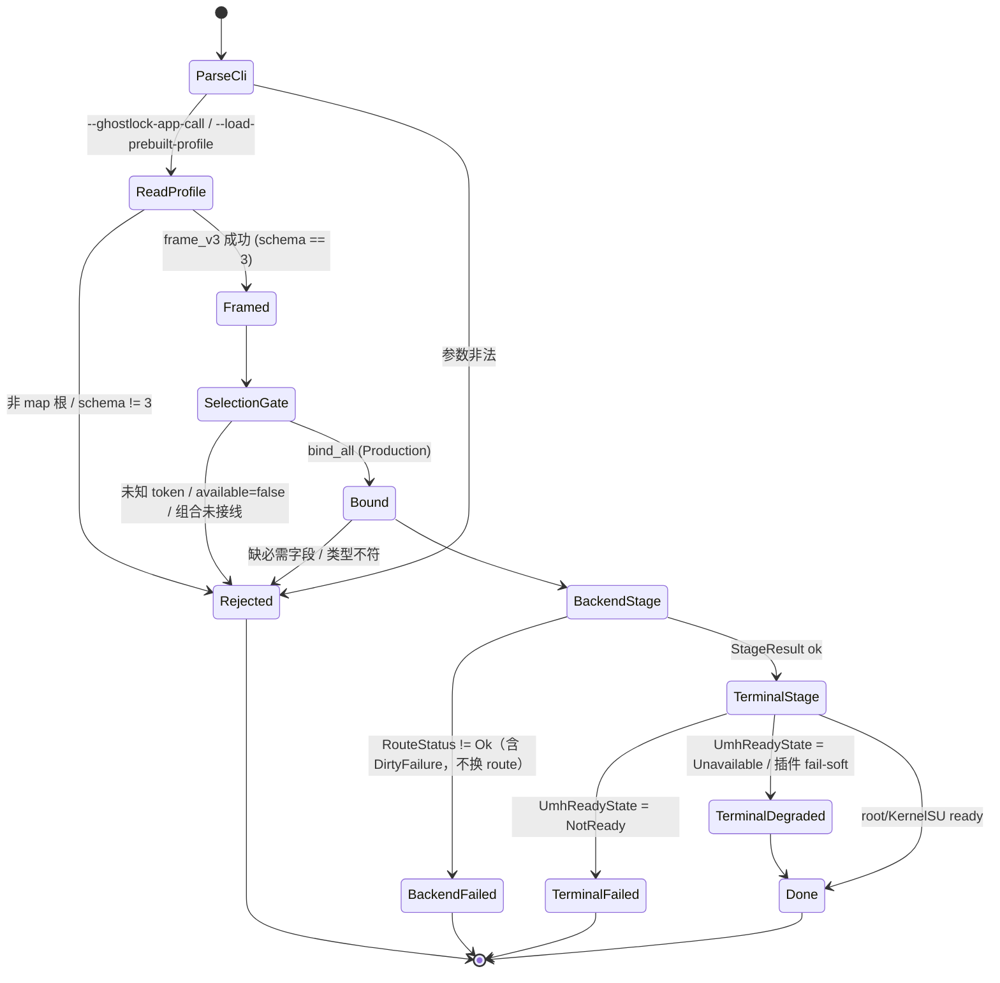
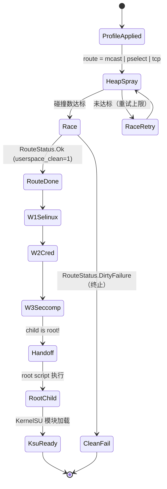
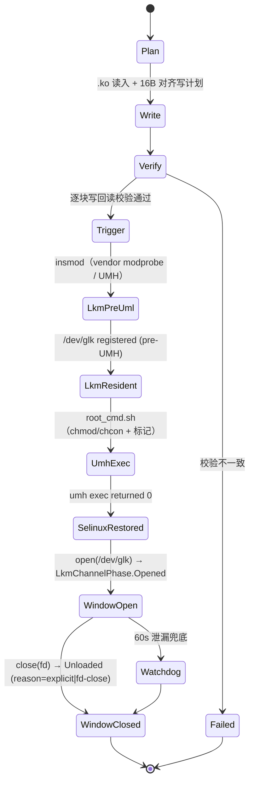
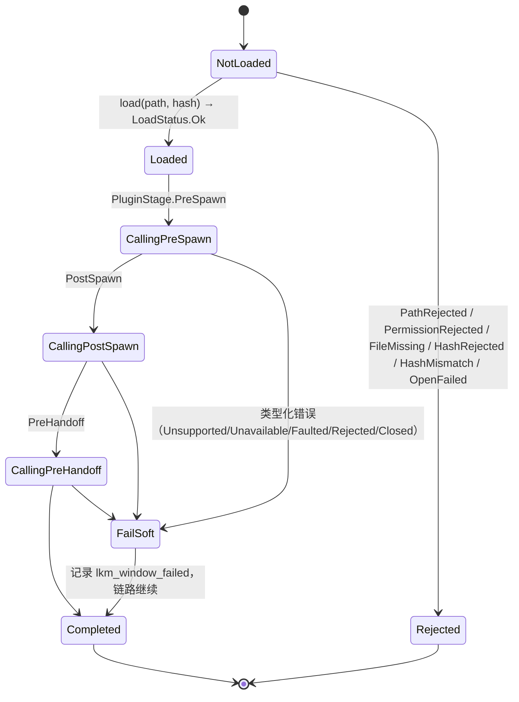
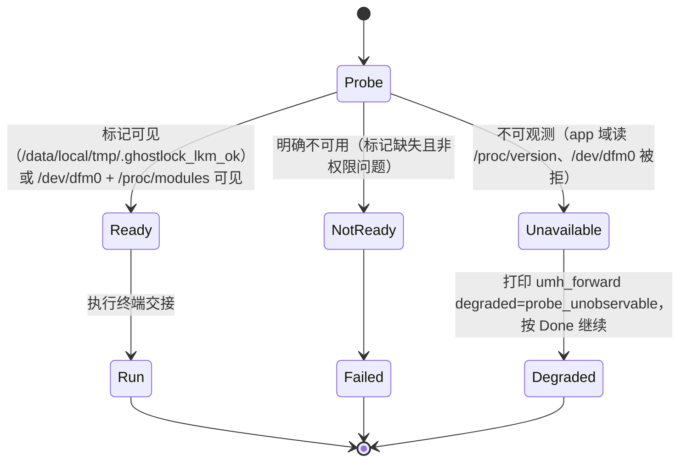
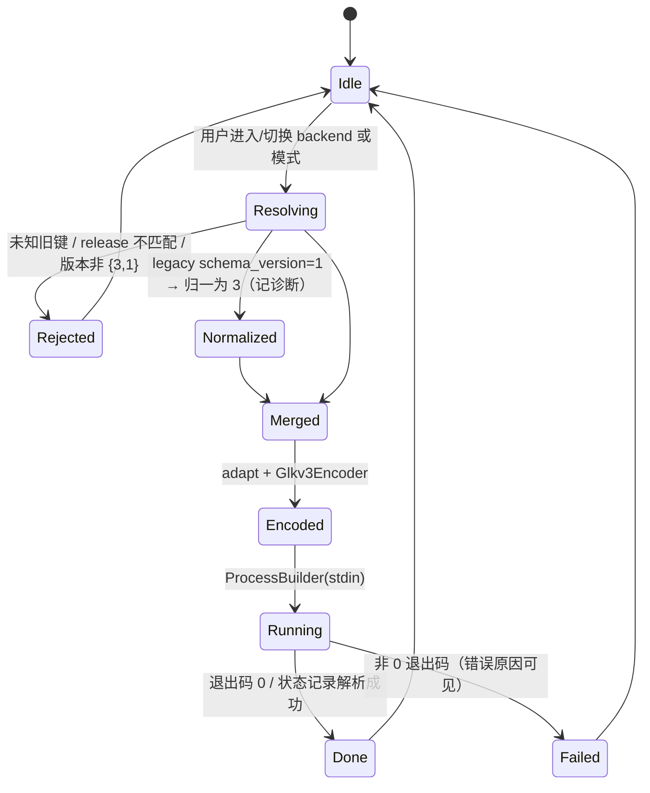

> 恢复说明（2026-10-06）：原始路径 ��删除提交 ����；恢复来源 git show c2cc25c1ee7e9d8b4df0c2b342a4dd3e58a0449d^:docs/analysis/ipo-and-state-machines.md；内容为删除前原文，未改动。

# 数据级 IPO 与状态机（C++ · Kotlin · Rust）

- 快照：HEAD（`c0cbe10`）+ 标注 R6b/T5 在途差异。配套：`full-process-uml.md`（Class/Sequence）。
- 本文件回答两个问题：**每一步的 IN/OUT 到底是什么数据**、**有哪些真正的状态机**。

## 1. IPO（数据级，逐阶段）

| # | 阶段 | IN（类型/字段） | PROCESS（函数/算法） | OUT（类型/字段） | 失败/降级 |
|---|---|---|---|---|---|
| **A1** | Rust 读取镜像 | `boot.img`/OTA zip/URL → `Vec<u8>` | `boot::extract_release`, `fdt::find_fdt_magic`, `arm64_image_size` | raw image + `release` 字符串 | 非 arm64/无 FDT → err |
| **A2** | 符号与类型 | raw image | `kallsyms::decode_names/decode_addresses`, `btf::parse_btf` | 符号表（名→VA）、BTF 结构 | 缺 BTF → 仅 kallsyms |
| **A3** | 反汇编与推导 | 符号表 + 机器码 | `disasm::disassemble_symbol`, `derive::*` | offset/几何（`task_struct`/`cred`/`offset`/route 几何） | 模式不匹配 → 字段缺失 |
| **A4** | 物理布局 | raw image | `iomem::find_kernel_memory_map_entry`, `analysis::*` | `kernel_phys_load/offset`、`delta` | 无 iomem → 缺省 |
| **A5** | 产出 profile | `AnalysisResult` | `report::render_conf`（canonical 布局 + `schema_version = 3`）; `render_json`（v1） | `*.conf`（可导入 App）/`*.json` | `cargo test` 断言「生成 ≡ 内置」 |
| **B1** | HOCON 加载 | `assets/kernel_profiles/*.conf` + `index.conf` + 用户导入 | `HoconSupport`（include 展开、`${}` 变量） | `ValueMap`（含 legacy 键） | 未知键 → 报错带点分路径 |
| **B2** | 归一化 | legacy `ValueMap` | `ProfileLayout.canonicalize`（别名表：`backend.steps`→`selection.*`、`cred/offset` 平台/私有拆分、`meta.*`→`common.*`） | canonical owner-qualified map | 未识别旧键 → fail-closed |
| **B3** | 合并与校验 | canonical map + 覆盖 + 设备 `uname -r` | `ProfileMerger.resolveMerged` → `ProfileResolver.validateMerged` | `ProfileConfig`（resolved 字段集） | release 不匹配 → 拒绝 |
| **B4** | 建文档 | `ProfileConfig` + selection | `NativeProfileGlkv3Adapter.adapt`（**只发所选 backend 的段 + common**） | GLKv3 `Glkv3Value`（map/sections） | 缺段 → 该字段不发射 |
| **B5** | 编码 | `Glkv3Value` | `Glkv3Encoder.encode`（最短整数、键 UTF-8 序） | `ByteArray`（根 map，`schema=3`） | 超 1 MiB → 拒绝 |
| **B6** | 分帧 | 文档字节 + (43284) SA 秘密 | `ChannelBStdin.frame` + `SessionSecretFrame.encode` | `[u32be len][doc]`(+仅 43284 `[u32be 84][frame]`) | 43284 缺帧 → 拒绝 |
| **C1** | 判别 | stdin `ByteArray` | `looks_like_glkv3`（首字节 map/fixmap/map16/32） | bool | 非 map → 直接 -1 |
| **C2** | 帧化 | 文档字节 | `frame_v3` + `decode_neutral`（强制 `schema == 3`，owner 前缀白名单） | `profile::Document{release, backend_token, terminal_token, sections[]}`；`ReadResult.storage` 持有缓冲 | `schema != 3`/未知前缀 → -1 |
| **C3** | 选择解析 | Document 根 token + 组合表 | token → `CombinationSpec{backend, route, steps, terminal, available}`（R6b；HEAD 为三元组） | `DispatchTarget` | 未知 token / `available=false` → 拒绝 |
| **C4** | 绑定 | Document + owner Schema | `SchemaRegistry::bind_all(mode=Production)`（必需性、默认值、`default_used` 诊断） | 类型化 View（route 几何、43284 策略、握手参数） | 缺必需/类型不符 → Rejected |
| **C5** | 后端阶段 | View + `CoreSession` | route：`run_route`→`RouteStatus{code,step,errno,userspace_clean}`；步骤：spray/race/W1/W2/W3 | `StageResult`（ok/failed/degraded） | `DirtyFailure` → 终止（不换 route） |
| **C6** | 终端阶段 | terminal 输入载荷（script / UMH channel） | `RootChildPolicy::run_handoff` 或 `UmhForwardPolicy::run`（`UmhReadyState`: Ready/NotReady/Unavailable） | root child / UMH→LKM 加载 | NotReady → Failed；Unavailable → **Done(降级)** |
| **C7** | 收尾 | 会话 | 状态记录（`--enable-status-record`）、SELinux 还原、LKM unload | 退出码 + status 记录 | 插件失败 → fail-soft 记录 |
| **D1** | 内核原语 | 进程 syscalls | PI-futex 竞争（waiter 覆盖）／ESP 页缓存写 | `RouteStatus.code=Ok` + `userspace_clean` | 竞争失败 → Retryable |
| **D2** | 提权步骤 | 覆盖后的 cred/task | W1 SELinux permissive → W2 cred/uid0 → W3 seccomp 清除 | `uid=0`、`Enforcing` 可写 | 步骤失败 → Backend failed |
| **D3** | 落地 | root script / helper.ko + 会话秘密 | UMH exec（vendor modprobe）或 root child 执行脚本 → `insmod` | `/dev/glk` 注册、module resident、KernelSU ready | 模块未驻留 → 轮询超时 |
| **D4** | 退出/卸载 | fd/定时器 | 插件窗口 close → LKM unload（`explicit`/`fd-close`/`watchdog`） | 模块卸载、AVB `ok=12 fail=0` | watchdog 60s 兜底 |

## 2. 状态机

### 2.1 顶层运行状态机（native `main`）



### 2.2 43499 攻击链状态机



### 2.3 43284 链状态机（含 LKM 窗口）



### 2.4 插件与 LKM 通道状态机



### 2.5 Route 状态机（`RouteResultCode`）

```mermaid
stateDiagram-v2
  [*] --> Prepare
  Prepare --> Unsupported : Policy::supported == false
  Prepare --> Execute : 几何齐备
  Execute --> Ok : 原语成功
  Execute --> Retryable : 竞争未命中（可重试）
  Execute --> FallbackSafe : 干净失败（无泄漏）
  Execute --> DirtyFailure : 有副作用/未清理（终止）
  Ok --> Disarm
  Retryable --> Disarm
  FallbackSafe --> Disarm
  DirtyFailure --> [*]
  Disarm --> Destroy
  Destroy --> [*]
  Unsupported --> [*]
```

### 2.6 UMH 就绪探针（`UmhReadyState`）与降级



### 2.7 Kotlin 配置/运行状态机



## 3. R6b/T5 在途对本文件的影响

- §1 **C3**：HEAD 是 `(backend, steps, terminal)` 三元组；在途中改为 **token 白名单**（`backend.<id>.steps = "mcast_rootchild"`），`available=false` 的计划项在选择门禁处拒绝；
- §2.1 的 `SelectionGate` 分支在途中多一条：**`available=false`（计划项）**；
- §2.2 的 `route = mcast | pselect | tcp` 在途中**由 token 显式给出**（不再几何推断）。
