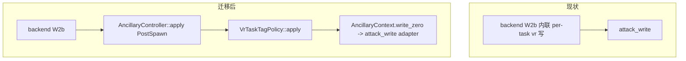

# 归档头（docs/plan 批次，2026-10-07）

- 原始路径：docs/plan/ancillary-vr-task-tag-migration-plan.md
- 归档原因：被 docs/plan/MASTER-PLAN.md 取代；未按现行设计规范编写
- 归档日期：2026-10-07 22:37（America/Toronto）
- 归档来源：task-63（docs-uml）

---

# 把 backend 的 per-task vr.ko 消除迁到 ancillary 计划（2026-10-02）

## 现状与基线

- 分支 `vr-ko-bypass-dev`；基线 commit `583b13f`。
- **A（待迁移）**：backend 内联的 per-task 抹标记，`cve_2026_43499_backend.cpp:147-218`（W2b，
  “ported from root.c”）。判定 `/proc/modules` **读不到 = 执行**；写
  `child_task + TASK_THREAD_INFO_FLAGS_OFF`（0x00，覆盖 tag A `+0x06` 与 `0x400` 位）与
  `child_task + align8(VR_TAG_B_OFF)`（`VR_TAG_B_OFF=0x2c`，`profile/macros.h`）。
- **B（已存在）**：ancillary `VrGuardPolicy`，PreSpawn 清全局 `__tracepoint_sys_exit.funcs`；
  判定 `/proc/modules` **读不到 = 跳过**（与 A 相反）。
- 框架：`AncillaryStage` 已含 `PostSpawn`（`ancillary_policy.hpp:26-30`，注释
  “today's W2b”）；`AncillaryPolicyList` 目前只有 `VrGuardPolicy`；`AncillaryContext` 无 `child_task`。
- `TASK_THREAD_INFO_FLAGS_OFF=0x00`（`kernel/target.h:102`）。

## 目标与约束

目标：把 A 做成一个 ancillary behavior，在 `PostSpawn` 由 `AncillaryController` 调度；backend W2b
不再内联 vr.ko 写。迁移时统一 `/proc/modules` 的判定方向。

非目标：
- 不改 B 的机制（全局清 `funcs`）；
- 不改 tag 常量与 `recommend_vr_guard` 的语义；
- 不改 W2 其它步骤、不改 wire/GLK1、不新增 profile 字段；
- 不动 frontend/handoff。

## 改动清单

| 文件 | 改动 | 理由 |
|---|---|---|
| `session/ancillary/ancillary_policy.hpp` | `AncillaryKind` 追加 `VrTaskTag = 2`；`AncillaryContext` 增 `uintptr_t child_task = 0` | PostSpawn 需要 child task 地址 |
| 新增 `session/ancillary/vr_task_tag.hpp`（+ `.cpp` body） | `VrTaskTagPolicy`：`enabled(profile)` 走 `recommend_vr_guard` gate；`apply<M>(PostSpawn)` 写 flags 字与 tagB 字；host 端 plan 可测 | 承载 A 的逻辑 |
| `session/ancillary/ancillary_controller.hpp` | `AncillaryPolicyList` 追加 `VrTaskTagPolicy` | 注册新行为 |
| `session/backend/cve_2026_43499_backend.cpp` | W2b 内联块（147-218）替换为 `AncillaryController<M>::apply(PostSpawn, session, ctx)`，`ctx.child_task = child_task` | 去内联，改由 controller 调度 |
| `session/backend/cve_2026_43499_backend.hpp` | 复用既有 AncillaryContext adapter（`:42` 注释的 zero-word adapter），确认 `write_zero` 绑定 | 不新增 attack_write 调用点 |
| `tests/ancillary_test.cpp` | 覆盖 `VrTaskTagPolicy` 的 `enabled` 与 host apply | 防回归 |

不改：`vr_guard.*`、`profile/*`、wire、Kotlin、assets。

## 数据流/控制流差异

不变量：
- W2b 在 `getuid()` 校验之前完成 tag 清除（顺序不变）；
- `attack_write` 的调用点仍经同一 adapter（不新增 `attack_write` 派生调用点）；
- 判定与写入的先后（先判 `/proc/modules`，后写 flags、再写 tagB）不变。

## 兼容性与回滚

- 无 profile/GLK1 变更；6.x/5.x 都走同一 behavior（gate 由 `recommend_vr_guard` 决定）。
- gate 语义变化需注意：A 原本**无条件编译**、仅运行时 `/proc/modules` 决定；迁移后先过 `enabled(profile)`。
  若某 profile 没开 `recommend_vr_guard` 但设备有 vr.ko，则会漏做——**待确认项**。
- 回滚：还原 backend W2b 内联块，移除 `VrTaskTagPolicy` 与 `AncillaryKind`/`AncillaryContext` 改动。

## 验证矩阵

| 批次 | 命令 | 预期 |
|---|---|---|
| host 单测 | `make -C src native-host-tests` | 全绿；`ancillary_test` 覆盖 VrTaskTag |
| 形状 | `python3 tools/cmp_disasm.py <baseline> build/native/ghostlock` | 8 函数 IDENTICAL 或已复核差异 |
| NDK | `make -C src ghostlock` | 零告警 |
| 真机 | vivo：W2b 后 `VR.ko per-task tags cleared` / 子进程不被杀；日志归档 | PASS/FAIL 记录 |

## 明确保留

- `VrGuardPolicy`（PreSpawn 全局清 `funcs`）的机制与时机；
- `VR_TAG_B_OFF`/`TASK_THREAD_INFO_FLAGS_OFF` 常量值与来源；
- `recommend_vr_guard` 的 profile 键与提取器发出逻辑（本次不改其判定宽度）；
- 攻击路径其它阶段。

## 进度

- [x] 计划
- [x] 实施（policy + controller + backend W2b）
- [x] host 单测（`make -C src native-host-tests` 全绿）
- [x] `cmp_disasm`（8 函数形状一致；151 处操作数差异逐条折算为同一
      `g_exploit_session+偏移` / 同一字符串 / 同一指针重定位，0 处不同目标）
- [x] NDK 构建（零告警）、`lint-tidy`（rc=0，用户代码 0 findings）
- [ ] 真机门禁（vivo）

## 已定决策（2026-10-02）

1. 新增独立 `VrTaskTag`（`AncillaryKind = 2`），不并入 `VrGuard`。
2. gate **以 profile 为权威**：`enabled(profile) = profile.vr_guard_enabled()`（共用
   `recommend_vr_guard`），不新增 GLK1 字段。
3. `/proc/modules` 方向：`VrTaskTag` 读不到 = 执行；`VrGuard` 本次不动（另开小项）。
4. “漏做”风险改由**提取器/配置侧精确判定**解决（见下），而不是让 behavior 无条件启用。

## 后续：提取器侧的精确 enable 判定

- 现状：`report.rs` 对任何 BTF 含 `struct tracepoint.funcs` 的镜像都发 `recommend_vr_guard = 1`，过宽
  （A301SO 也拿到）。
- 目标：按更精确的 vivo/iQOO 证据设置该 gate（如 `ro.product.*` / vermagic 的 `vivo` 线索 /
  `/proc/modules`），必要时在 app 配置流程**询问用户**是否启用 vr.ko 消除。
- 归属：本计划的一个后续批次，或单独立项（涉及提取器与 app 配置 UI）。本次迁移只消费该 gate，
  不改其判定逻辑。

## 参考与相关工作

- merge `acc5e7b`（PR #241 / hmascs）带入一套**替代方案**：CFI 阶段用常驻读写把 vr.ko 的
  `sys_exit` 探针重定向到内核 `probestub`（按 `commit_creds` 探针 delta 定位），只中和 vr 探针。
- 同源项目 Neo11Plus（`boxiaolanya2008/CVE-2026-43499-Neo11Plus`，iQOO Neo11 / 6.6.89）在同一
  CVE 上**同时实现** per-task detag（Option A）与 probestub 重定向（Option B），并记录 vr 会因
  tag A/B 不同步而判篡改杀——印证我们的 A+B 组合与“detag 先于提权”的顺序；其 Option B 依赖
  我们尚无的读原语。
- 两者的评估见 `docs/analysis/vr-ko-cfi-probe-neutralization/README.md`。
- 与本计划的关系：本计划是 `VrGuard`（清 `tp->funcs` 指针）+ `VrTaskTag`（清 per-task tag），
  比它简单、已过 6.1 真机；它的“delta 匹配 + 只重定向 vr 槽位”记为将来“需与内核其它 tracepoint
  用户长期共存”时的备选，**不在本次引入**（需常驻 read、`WriteMode::Value`、镜像上下界）。
