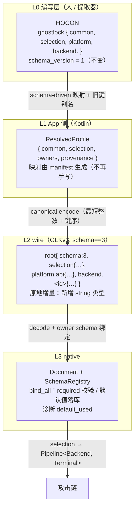
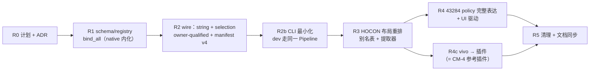

# 归档头（docs/plan 批次，2026-10-07）

- 原始路径：docs/plan/config-wire-redesign-plan.md
- 归档原因：被 docs/plan/MASTER-PLAN.md 取代；未按现行设计规范编写
- 归档日期：2026-10-07 22:37（America/Toronto）
- 归档来源：task-63（docs-uml）

---


# HOCON / kprofile / wire / profile 重设计计划（双 backend 之后）

> **状态**：计划，**待 D1/D2 裁决**（L 级：跨 Native↔Kotlin 契约 + wire 格式 + 配置体系）。本文只给设计，不改代码。
> **触发**：第二个 backend（CVE-2026-43284）接入后，四层里大量「43499 形状」的隐含假设暴露出来。
> **一句话目标**：把「**公共部分**」与「**backend 私有策略**」的划分与登记方式统一起来，使新 backend 只需声明一份 schema。

## 目录

1. [背景与问题](#1-背景与问题)
2. [目标 / 非目标](#2-目标--非目标)
3. [核心规则 R1–R6](#3-核心规则-r1r6)
4. [目标模型](#4-目标模型)
5. [分层设计](#5-分层设计)
6. [专题](#6-专题)
7. [批次与门禁](#7-批次与门禁)
8. [风险与回滚](#8-风险与回滚)
9. [待裁决](#9-待裁决)
10. [附录 A：现状实测证据](#附录-a现状实测证据) · [附录 B：决策记录](#附录-b决策记录)

---

## 1. 背景与问题

### 1.1 现状（实测证据）

| 层 | 现状 | 双 backend 暴露的问题 |
|---|---|---|
| **HOCON**（`app/src/main/assets/profile/*.conf`） | `release/kernel_major/backend{steps}/route/fallback/kernelsnitch/task_struct/cred/offset`；`index.conf` 列 release→file；`execution-*.conf` 公共调参 | ① **无 `backend.kind`**（由 Kotlin 注入）；② 组几乎全是 43499 专属，**43284 没有落脚点**；③ route 与 backend 强耦合（43284 是 route-less）；④ 没有「哪个 backend 支持哪些 steps/terminal」的矩阵 |
| **kprofile**（HOCON→运行时 profile） | `AndroidProfileConfigController` + **手写**映射 + 注入 `backend.kind`/`steps` | ① **43284 私有策略不填**（磁盘实测 section 里只有 `steps`）；② 默认值散在 native 代码，Kotlin 不知道；③ 加 backend 要改多处手写代码 |
| **wire**（GLKv3 MessagePack，`schema==3`） | 类型只有 `uint/int/bool`（94/3/4），路径如 `backend.cve_2026_43284.carrier_path`（**数值 token**） | ① **无 string** → 路径类只能靠 token 或硬约定（本机靠 `$GHOSTLOCK_HOME/helper.ko`）；② token 语义不可自解释；③ required 与 backend 代码检查**不一致**（连续撞到 `ProfileIncomplete`/`MissingProfileKmi`/`MissingLkmPath`） |
| **profile**（native `profile/` + owner schema） | `profile` 只做 framing；owner：`platform::abi` 31 / `cve_2026_43499` 63 / `cve_2026_43284` 7；manifest TSV 为对拍权威 | ① **required/默认值没有单一权威**（一半在 schema、一半在 `run_backend_terminal`）；② `bind_all` 与校验模式不统一；③ 新 backend 要自造 token 约定 |
| **CLI** | 15 个标志，其中 **10 个是 43284 dev/策略标志**，且**绕过 Pipeline** | 选择与策略从命令行来；dev 门禁跑的不是生产路径（B6/T5 接线缺口长期无人发现，即由此） |

### 1.2 共同根因

> 四层里「**公共部分**（设备事实/选择/执行调参）」与「**backend 私有策略**」**没有统一的划分与登记方式**。
> 加第二个 backend 时，公共部分被复制、私有部分被硬编码。

---

## 2. 目标 / 非目标

**目标**

1. **单一划分**：common 与 backend policy 的定义在四层一一对应、可机械对拍。
2. **声明式扩展**：新 backend 只声明一份 policy schema（字段/类型/必填/默认/来源），HOCON 样例、Kotlin 映射、native 绑定、manifest 全部自动派生。
3. **路径可表达**：模块路径/载体路径/脚本路径可用 **string**，摆脱魔法 token 与硬约定。
4. **单一权威 + 可审计**：required/默认值只写在 owner schema；运行期用到的默认值必须出现在诊断里。
5. **不破坏既有**：43499 的 wire 字节与行为不变；v2 只读保留；Kotlin/native 对拍继续存在。

**非目标**

- 不引入新版本号（见 R1）；不重写 MPack 解析；不把 route 变成第三个装配轴；不动 `LegacyProfileConverter.kt` 的 v1 转换。

---

## 3. 核心规则 R1–R6

> 这六条是**已裁决**的约束，后续设计一律由它们推导，不再逐项讨论。

| # | 规则 | 含义 | 直接推论 |
|---|---|---|---|
| **R1** | **单一 schema 权威 + 原地增量** | 每个字段的**类型（含新增 `string`）、必填性、默认值、来源、文档**只在一份 owner schema 声明一次；wire 一律**原地**扩展（`schema == 3` 不变、**不新增版本号**）；native 绑定/Kotlin 映射/HOCON 键/manifest/诊断全由它派生 | 不存在「HOCON v2 / wire v4」；加类型不算格式变更 |
| **R2** | **owner-qualified paths** | 字段路径必须以 owner 限定：`backend.<id>.*` 或 `platform.<module>.*` | **route 归 backend**（`backend.<id>.route.<kind>.*`）；消除 `cred/offset/kernel` 跨 owner 同名二义 |
| **R3** | **common / backend 私有 的划分** | common = 设备事实、selection、执行调参、platform 横切；backend policy = 只有该 backend 懂的策略 | `backend.<id>.*` 收纳 route/execution/私有策略；`platform.*` 收纳 ABI/平台事实 |
| **R4** | **选择只来自 wire；CLI 只承载传输/安全/可观测** | backend/steps/terminal 与一切策略来自文档；CLI 不得出现 backend 专属标志 | staged CLI 删除；dev 走**同一文档 + 同一 Pipeline**（dev 门禁因此覆盖生产路径） |
| **R5** | **默认值可见** | 运行期凡使用默认值，必须在诊断里记录（`default_used=<path>`） | 杜绝「默认值在代码里、Kotlin 不知道」 |
| **R6** | **backend×terminal 兼容矩阵同源对拍、可扩展** | 兼容性由 native catalog 单一权威，Kotlin 侧**派生**投影（不硬编码） | 新增 terminal 只改 matrix + catalog 两处；UI 无需改代码 |
| **R8** | **一个子系统一个家**：vivo 拆走后对策子系统不得跨两层 | `platform/` 只留设备/平台事实（`abi`/`device_facts`/`runtime`）；对策子系统（loader+registry+controller+policy）**集中一处**；`contract/glk_cm_abi.h`、`contract/countermeasure.hpp` 留 `contract`；**SHA-256 上移 `support/`**（现为 `platform/countermeasure/sha256.*` + `backend/.../ipsec/hmac_sha256.*` 两份，后者存在仅因 R1 禁 backend→platform） |
| **R7** | **能力词汇 = 全 backend 并集；未支持必须报错** | `contract` 的能力词汇覆盖任一 backend 的全部能力（新 backend 只加声明、不改词汇）；backend 不支持某能力时调用返回**类型化错误**，不得静默 no-op / 静默默认 / 空指针即崩；`contract::Capability` 与 CM ABI 能力位**同源** | 见 `kernel-memory-batch1-plan.md` §2.5 |

---

## 4. 目标模型

### 4.1 四层与数据流



### 4.2 字段模型（FieldSpec）

```
FieldSpec {
  path      :  owner-qualified 路径（R2）
  wire      :  uint | int | bool | string          // string 为本次新增
  required  :  bool                                 // true 且缺失 → 绑定期 Rejected，错误带 path
  default   :  字面量 | derived 回调（如 KMI 由 release 推导）| convention 路径（如 $GHOSTLOCK_HOME/helper.ko）
  source    :  profile | derived | convention | platform
  doc       :  一句话语义（同步进 manifest 与文档）
}
```

`source` 决定优先级：**profile 值 > derived > convention**；`derived`/`convention` 触发时（R5）必须落诊断。

---

## 5. 分层设计

### 5.1 HOCON（布局重排；`schema_version` 恒为 1）

**没有 HOCON v2**：`schema_version = 1` 是 Kotlin 侧校验（`AndroidProfileConfigController` 的 `require(... == 1)`，63 个内置 conf 全为 1），native 不解析 HOCON。本次只做**键布局重排 + 旧键别名归一化**，不新增版本号、不引入第二种格式。

```hocon
ghostlock {
  schema_version = 1                    # 不变
  release = "5.15.189-android13-8-00016-…"
  selection { backend = "cve_2026_43499"  steps = "w1_w3"  terminal = "root_child" }
  execution { … }                       # 公共调参
  platform { abi { … }  vivo { … } }
  backend {
    cve_2026_43499 { route { … }  execution { … }  … }
    cve_2026_43284 { module_path = "helper.ko"  carrier_path = ""  … }
  }
}
```

- **别名表**：解析器同时认旧键与新键，归一化到同一内存模型 → 旧文件（含用户导入 profile）不改也能跑；
- 提取器（`tools/extract_rs`）改为输出新布局；63 个内置 conf 机械迁移（owner 列即权威）；
- `index.conf` 增 **backend 矩阵**：`{ backend, steps[], terminal[], available }`，驱动 UI 可用性，与 native catalog 对拍。

### 5.2 kprofile（App 侧解析结果）

`ResolvedProfile = { common, selection, owners: Map<owner, Fields>, provenance }`。

- 映射**由 manifest 生成**，不再逐字段手写；
- 归一化（旧键别名）在解析期完成，产物只有一种形状；
- **不得**在 Kotlin 侧兜底默认值：默认值属于 schema（R1/R5）；
- 会话级选择（如 `session.root.*`，见 §6.2）与设备级 profile 分离，避免把会话态写进 release 文件。

### 5.3 wire（GLKv3 原地增量）

- **新增 `string` 类型**（UTF-8，上限 256）：用于 `program_path`/`program_argv`/`module_path`/`carrier_path`；canonical 规则不变（最短整数 + 键 UTF-8 序）；
- **新增 `selection` 段**（见 D1）取代把 kind 塞进 header token 的做法（header 保留一段兼容读取）；
- **section 命名**：`backend.<id>.*`、`platform.<module>.*`、`session.*`（R2/R3）；
- **required 语义入校验**，由 schema 驱动，不再由 backend 代码各自判；
- **manifest 升级为 v4**：列 `owner, path, wire, required, default, source, doc`；三端（native 导出 / Kotlin 映射 / 提取器）对拍。

### 5.4 profile（native）

- `profile` 只留 **framing**；`SchemaRegistry` 组合 `platform::abi`、`platform::vivo`、`backend::<id>`（按 selection 选取）；
- `bind_all(registry, mode)`：统一 required 校验 + 默认值落库 + 诊断（`mode = Production | Test`）；
- backend 代码**不再自判 required**（`run_backend_terminal` 里那类检查上收）。

### 5.5 CLI（15 → 8；若 probe 并入 stage 则 7）

**规则（R4）**：CLI 只承载 **传输 / 运行控制 / 安全 / 可观测**；选择与一切策略来自 wire。

| 类别 | 标志 |
|---|---|
| 传输 | `--ghostlock-app-call` \| `--load-prebuilt-profile <bin>` |
| 运行控制 | `--stage=probe\|plan\|write\|trigger\|full`（默认 full） |
| **安全（封闭清单，数据永不授权）** | `--force-attack`、`--allow-dev-target`、`--allow-vermagic-rewrite` |
| 可观测 | `--enable-status-record`、`--dump-kernel-log <dir>` |

**删除 → 进 wire**：`--run-cve-2026-43284 <ko> <target>`、`--probe-cve-2026-43284`、`--stage`(旧)、
`--cve43284-hook-target/-symbol/-guard`、`--cve43284-carrier`、`--cve43284-patch1-target`、
`--cve43284-allow-vermagic-rewrite`。**不引入 `--dev`、不引入 wire `dev.*`**：stage/probe 是运行控制与诊断，不属于文档；
真正的风险项是 CLI 安全开关，比「文档段 + 信任闸」更简单，且不会让 dev 文档与生产文档**形状分叉**（分叉正是 B6/T5 长期隐藏的根因）。

---

## 6. 专题

### 6.1 owner-qualified 重命名表（R2）

实测（`profile-manifest-v3.tsv` 路径顶层前缀按 owner 分布）：

| owner | 顶层前缀 |
|---|---|
| `cve_2026_43499` | `route`(18)、`execution`(24)、`cred`(8)、`offset`(4)、`kernel`(3)、`meta`(4)、`backend`(1)、`vr_guard`(1) |
| `platform::abi` | `task_struct`(15)、`cred`(7)、`offset`(7)、`kernel`(2) |
| `cve_2026_43284` | `backend`(7) |

两个问题：① 43499 几乎无 owner 限定（8 个根命名空间，仅 1 字段在 `backend.*`）；② `cred`/`offset`/`kernel` 在两个 owner 间**同名**，wire 路径本身二义。

| 现路径 | 目标路径 | 判定 |
|---|---|---|
| `route.<kind>.*` (18) | `backend.cve_2026_43499.route.<kind>.*` | 43499 私有；43284 无 route |
| `execution.*` (24) | `backend.cve_2026_43499.execution.*` | race/consumer/handoff/heap 均为 43499 私有 |
| `cred`/`offset`/`kernel` | 平台事实→`platform.abi.*`；43499 模板→`backend.cve_2026_43499.*` | 消歧 |
| `meta.*` (4) | `common.*` | 元信息/选择，公共 |
| `vr_guard.*` (1) | `countermeasure.vivo_vr_guard.*` | 随 vivo 插件化（§6.3） |
| `backend.cve_2026_43284.*` (7) | 不变 | 已是正确形状（样板） |

**代码与数据分离**：route **实现**若被两个 backend 复用，上移到中性模块由各 backend 引用；**选择与私有参数**永远随 backend，wire 不出现共享 route 段。Kotlin `RouteKind` 目录改为每 backend 一份。

**迁移**：manifest 已带 owner 列 → 重命名表**自动生成**；HOCON/文档按 §5.1 别名归一化。

### 6.2 root 参数化（`session.root.*`）

**需求**：可选择**执行什么程序**、可选择**执行后是否恢复 SELinux**；进 wire，并在 Kotlin **高级设置**可选。

**现状**：`contract/identity.hpp:129` 已有 `RootProgram{ RootProgramKind kind; char argv[192]; }`（有界 `set_argv`/`argv_view`），但**从未进 wire**（两个 manifest 均无），生产只能默认 KernelSU + `/data/adb/ksud`。LKM 侧已有 `cmd`（**`sh -c` 字符串**）、`permissive`、`restore_enforce`、`defex`；43499 脚本已自行恢复 enforcing（`root_script.cpp:202`）。

| 路径 | 类型 | 语义 | 默认 |
|---|---|---|---|
| `session.root.program_kind` | uint token | `kernelsu` / `custom` | `kernelsu` |
| `session.root.program_path` | string | `custom` 时的可执行路径 | 空 |
| `session.root.program_argv` | string | 追加参数（**不做 shell 解析**） | 空 |
| `session.root.selinux_after` | uint token | `restore_enforce` / `leave_permissive` | **`restore_enforce`（安全默认）** |

**映射**：43499/root_child → 程序=脚本载荷、`restore` 保留 `root_script.cpp:202`；43284/umh_forward（LKM）→ 程序→`cmd`、`selinux_after`→`restore_enforce`。

**安全审查（必须落进实现批次）**

1. `cmd` 现为 `sh -c` 字符串（**注入面**）：wire 携带 **path + argv**，native **直接 exec（不经 shell）**或安全转义；
2. **路径白名单**（`/data/adb/`、`/data/local/tmp/`、app files、`$GHOSTLOCK_HOME`）+ 拒绝相对路径/`..`/symlink 逃逸（`realpath` 复核）/非可执行位；
3. **长度**：`kArgvCapacity=192` 偏紧 → 与 string 上限一起定（建议 256）；
4. **安全默认** `restore_enforce`；`leave_permissive` 必须显式勾选 + UI 警告；
5. **可审计**：实际生效的 program/selinux 策略必须出现在诊断里（R5）。

**Kotlin 高级设置**：root 程序选择器（KernelSU / 自定义路径+参数）、SELinux 恢复开关（默认开）+ 风险提示；**落点仍是 profile**，不引入 app 私有偏好。

### 6.3 vivo 对策 → countermeasure 插件（= CM-4 参考插件）

**裁决**：删除 in-tree vivo 对策，改由 countermeasure 插件系统实现。

**现状**：`platform/vivo/` 8 文件 ~455 行（`vr_guard`、`vr_task_tag`），**已是 `ancillary::AncillaryPolicy` 形态**，经 `registry.hpp` 的**编译期元组**注入，调用点在 `backend/cve_2026_43499/steps.cpp`；配置在 `cve_2026_43499` 的 `misc.vr_guard` + `VrGuardLayout`。插件系统已落地：`contract/glk_cm_abi.h`、`platform/countermeasure/{loader,sha256}`、`ancillary/{controller,external_registry}`。

| 现对策 | 宿主能力 | ABI 阶段 |
|---|---|---|
| `vr_guard` | `KERNEL_WRITE` + `ALIAS` | `ON_STAGE @ PRE_SPAWN` |
| `vr_task_tag` | `CHILD_TASK` + `KERNEL_WRITE` | `ON_STAGE @ POST_SPAWN` |

**迁移方式**

1. **行为等价**：改写为 ABI 插件（`glk_cm_*_entry`）→ `external_registry::register_module` 静态注册 → `ancillary::controller` 同阶段驱动；**保留 `steps.cpp` 的 controller 调用点**（只把编译期元组换成注册表驱动），以维持 6 组攻击函数机器码形状 → `cmp_disasm` 可 IDENTICAL；
2. **可选**：同插件编译为 `.so`，由 `platform/countermeasure/loader` 动态加载（原始动机：`vr.ko` 一天更新 30 次）。

**配置随迁**：`cve_2026_43499.misc.vr_guard` + 布局偏移 → `countermeasure.vivo_vr_guard.*`（owner = 插件 id）。

**验证限制（如实记录）**：本机是 **Sony A301SO**，**无法真机验证 vivo 行为**。可验证：① host 插件生命周期/能力校验/阶段顺序/失败记录/保留项拒绝；② 设备上「无 vivo 对策 → 跳过，43499 链不受影响」；③ 43499 全链真机回归 + `cmp_disasm`。**真实 Vivo 设备门禁列为未完成项**，不得因 host 绿而标 supported。

### 6.4a `support/` 是层名（保留），但 `support/util.cpp` 是错放的攻击路径

**命名**：`utils`/`util` = 杂物抽屉（无边界/无归属，业界视为坏味道）；`support` = 基础设施层
（先例：**LLVM `llvm/Support`**、Chromium `base/`、Android `libbase`）。本仓库选 `support` 是刻意的：
AGENTS 顶层命名空间含它、R1 防火墙把它列为受限层，且目录内绝大多数文件**按用途命名**
（`log.hpp`/`status.hpp`/`timing.hpp`/`run_state.*`/`cli.*`/`fatal_error.hpp`/`number_parse.h`）。

**真问题**：`support/util.cpp`（2063 行）把 **43499 攻击路径**（`prepare_kernel_page` 喷雾、
`prepare_skb_payload`、fake_lock/fake_w0 布置）与日志/计时/futex 封装混在一个中立层文件里，
并直接访问 `backend::cve43499_state(...)`。

**证据**：`tests/include_firewall_test.cpp` 的 **4 条白名单全部**是
`support/util.cpp → backend/cve_2026_43499/{cve_2026_43499_state.hpp, route/route_policy.hpp,
backend_profile/accessors.hpp, leak/address_discovery.h}` —— 即白名单不是四个无关例外，
而是**一个错放文件的症状**。

**清理方向**：保留 `support/` 层名（改名 `utils` 只会合法化杂物抽屉）；把 `util.cpp` **按用途拆分**：
攻击/喷雾代码迁入 `backend/cve_2026_43499/`（喷雾归 `spray/` 或并入 `route/`/`primitives/`），
其余拆成按用途命名的文件；目标是把 **防火墙白名单降到 0**（A3-2 报告已预告该去向）。
**风险**：跨 TU 搬移会改变内联决策 → 机器码必然变化，须 `cmp` 归因 + **真机门禁**，
按攻击路径批次的完整门槛执行。

### 6.4b ancillary 与 platform 的职责划分（R8 取证）

**问题**：vivo 拆成插件后，`ancillary` 与 `platform` 是否重复？**不是整体重复，但有两处真实重叠**：

| 目录 | 内容 | 性质 |
|---|---|---|
| `platform/` | `abi.hpp`(31 字段)、`device_facts.*`、`runtime.*` | 设备/平台事实 |
| `platform/vivo/` | `vr_guard`、`vr_task_tag` | 待删（R4c → 插件） |
| `platform/countermeasure/` | `loader.*`(CM-2)、`sha256.*` | **非平台事实**：对策子系统的装载半边 |
| `ancillary/` | `ancillary_policy.hpp`、`controller.*`(CM-3)、`external_registry.hpp`(CM-3) | 对策子系统的调度/注册半边 |

重叠点：① 同一子系统跨两层；② SHA-256 两份（`platform/countermeasure/sha256.*` 与 `backend/.../ipsec/hmac_sha256.*`，
前者的头注释自述「backend/ 被 R1 禁止 include platform/」所以才复制）。

**目标**：`platform/` = 设备/平台事实（abi/device_facts/runtime），不含对策代码；
对策子系统集中一处（loader+registry+controller+policy）；SHA-256 上移 `support/`。
**待裁决**：子系统沿用 `ancillary/` 名（改动小）还是改名 `countermeasure/`（更直白，但需同步防火墙层表、AGENTS、文档）。

### 6.4 backend × terminal 兼容矩阵（当前已实现，可扩展）

现状落点：`ExecutionModeMapping.kt` 的 `resolveExecutionSelection(mode, backend)`。

| ExecutionMode | entry | steps | terminal | backend |
|---|---|---|---|---|
| `General` | App | `w1_w3` | `root_child` | `cve_2026_43499` |
| `Shizuku` | Shell | `w1_w2` | `root_child` | `cve_2026_43499` |
| `Umh` | Shell | `pagecache_write` | `umh_forward` | `cve_2026_43284` |

即 **43499 → {root_child, Shizuku}**、**43284 → {UMH}**；resolver 以 `backend == 43284 || mode == Umh → 强制 {43284, pagecache_write, umh_forward}` 保证永远寻址不到未 catalogued 的 triple。

**定位（R6）**：这张矩阵是 `selection` 的 **Kotlin 侧投影**，必须与 native catalog（`combination_supported`/`dispatch_target`）**同源对拍**；单一权威仍是 native catalog，Kotlin 从导出的 manifest/矩阵**派生** UI 选项。新增 terminal 时只改「矩阵 + catalog」两处。

**待修的 UI 缝隙（M 级）**：`GhostlockUI.kt:755` 是 `ExecutionMode.entries.forEach`，**不按 backend 过滤**——非法组合被 resolver 静默改写而非置灰。改为按矩阵过滤/置灰。

---

## 7. 批次与门禁



| 批 | 内容 | 门禁 |
|---|---|---|
| **R0** | 本计划 + ADR（规则 R1–R6） | 文档评审 |
| **R1** | policy schema + registry + `bind_all` required/default（**native 内化，不动 wire**） | host / NDK / lint + 真机 43499 回归（`cmp_disasm` 可选诊断） |
| **R2** | wire：`string` 类型 + `selection` 段（D1）+ owner-qualified 路径 + manifest v4 + Kotlin **生成式**映射 | host / NDK / lint / cmp + `profile-core:test`/`:app:testDebugUnitTest` + manifest 三端对拍 |
| **R2b** | **CLI 最小化**：删 10 个 43284 标志；dev 走同一 Pipeline；矩阵过滤 UI 缝隙 | host / NDK / lint / cmp（**IDENTICAL**：只动入口与数据流）+ 真机 43284 与 43499 各一次 dev 回放 |
| **R3** | HOCON 布局重排（`schema_version` 仍为 1）+ 旧键别名 + 提取器改输出 + `index.conf` backend 矩阵 | 提取器 `cargo test` + Kotlin 解析测试（新旧布局都过）+ 真机 43499 |
| **R4** | 43284 policy 完整表达（`module_path`/`carrier_path` 用 string，去掉约定与 token 迂回）+ UI 驱动 | 真机 43284 app-call 全链 + AVB 校验 |
| **R4c** | vivo → countermeasure 插件（= CM-4 参考插件 + ADR-0005）；配置迁 owner | host 插件生命周期/能力/阶段测试 + cmp IDENTICAL + 43499 真机回归；**Vivo 真机门禁未完成** |
| **R5** | 清理：删除不再需要的 token 间接层；文档（`PROFILE_SCHEMA`/`README`/AGENTS）同步 | 全门禁 + 真机回归 |

---

## 8. 风险与回滚

| # | 风险 | 处置 |
|---|---|---|
| R-1 | wire 变更扩散（manifest/golden/Kotlin 适配器） | 三端对拍测试同批更新；R2 独立成批 |
| R-2 | HOCON 布局兼容 | 必须以**别名表**兼容旧键（否则 63 个内置 profile 与用户导入 profile 全废）；**不得借机升版本号** |
| R-3 | 行为漂移 | R1 只内化校验/默认值，**不得改 43499 机器码**（cmp 必须 IDENTICAL） |
| R-4 | 默认值搬迁引发语义变化 | 任何变化必须体现在诊断（R5） |
| R-5 | 攻击路径形状变化（shellcode 槽位） | 优先选不动攻击路径的方案（D2 建议 (b)） |
| R-6 | 非 Vivo 设备无法验证 vivo 对策 | host 测试 + 「无对策→跳过」；Vivo 门禁显式挂未完成 |

**回滚**：每批独立提交；wire 保留 v3 只读路径；HOCON 旧布局别名长期保留；CLI 批可单独 revert。

---

## 9. 待裁决

**D1. `selection` 显式化**：新增 `selection { backend, steps, terminal }` 段，还是继续只用 header token？
→ 建议**新增**：selection 本身即「一个被 schema 声明的段」（R1 直接产物），显式化后可校验、可诊断、UI 可回显；代价是 header token 保留一段兼容读取。

**D2. root 参数到内核侧的传输**（§6.2）：(a) 扩 libcxx hook shellcode 槽位传 `cmd=`/`restore_enforce=`；
**(b) LKM 读固定路径参数文件**（native 在 trigger 前写，文件缺失→安全默认）；(c) 渲染进每轮生成的 root 脚本。
→ 建议 **(b)**：唯一真正独立的一条（涉及攻击路径形状与「崩溃时是否停在 permissive」）；(b) 不动攻击路径，cmp 可维持 IDENTICAL。

---

## 附录 A：现状实测证据

- **manifest 规模**：`profile-manifest-v3.tsv` = 94 `uint` + 3 `int` + 4 `bool`；owner 分布 `cve_2026_43499` 63 / `platform::abi` 31 / `cve_2026_43284` 7；**无 string 类型**。
- **HOCON**：63 个内置 conf 的 `schema_version` 全为 1；Kotlin `require(... == 1)`；native 不解析 HOCON。
- **Kotlin 可用性**：`FrontendKind` RootChild=true、UmhForward=true；`BackendKind` 43499=true、43284=true、64560=false。
- **CLI**：15 个标志（`--ghostlock-app-call`、`--load-prebuilt-profile`、`--enable-status-record`、`--dump-kernel-log`、`--force-attack`、`--allow-dev-target`、`--run-cve-2026-43284`、`--probe-cve-2026-43284`、`--stage`、`--cve43284-hook-target`、`--cve43284-hook-symbol`、`--cve43284-hook-guard`、`--cve43284-carrier`、`--cve43284-patch1-target`、`--cve43284-allow-vermagic-rewrite`）。
- **生产路径实证故障链**（2026-10-04 真机）：`CarrierRejected(4)` → `ProfileIncomplete(2)` → `MissingProfileKmi(4)` → `ChainRejected(10)`，逐个暴露「默认值在代码里」与「required 无单权威」。
- **vivo 代码**：`platform/vivo/` 8 文件；`VivoAncillaryPolicies = tuple<VrGuardPolicy, VrTaskTagPolicy>`。
- **第三方库**：`src/lib/mpack`（MIT，`MPACK_DIR := lib/mpack`）；上游 DirtyFrag 系列已**不再 vendored**，来源与 commit 记入 README 的「Credits & License」。

## 附录 B：决策记录

| 日期 | 决定 | 位置 |
|---|---|---|
| 2026-10-04 | 单一 schema 权威 + 原地增量（R1） | §3 |
| 2026-10-04 | route 归 backend；owner-qualified paths（R2） | §3 / §6.1 |
| 2026-10-04 | CLI 最小化、选择只来自 wire（R4） | §5.5 |
| 2026-10-04 | **不存在 HOCON v2**：`schema_version` 恒为 1 | §5.1 |
| 2026-10-04 | vivo 对策删除 → countermeasure 插件（= CM-4） | §6.3 |
| 2026-10-04 | root 程序 + SELinux 恢复策略进 wire + Kotlin 高级设置 | §6.2 |
| 2026-10-04 | backend×terminal 矩阵：43499→{root_child, Shizuku}、43284→{UMH}（当前已实现，可扩展） | §6.4 |
| 2026-10-05 | `third_party/dirtyfrag` 删除（来源记入 README 致谢）；mpack 迁至 `src/lib/mpack` | 附录 A |

## 归档评估（2026-10-06，批次 2）

- **判定：丙（混合）⇒ 留住，不归档**（仍有现行内容；R8 与契约头结论仍现行，vivo 迁移段作废）
- **证据（实测，Lead 复核 + 本轮符号实测）**：
  - R8「一个子系统一个家」与 contract/countermeasure.hpp 保留结论**仍现行**；Lead 复核命中点：§281「platform/vivo/ 待删」**已完成**（已删）；§248「配置迁到 countermeasure.vivo_vr_guard.*」**随 vr_guard 撤销而作废**（Lead 实测 B/C/D 佐证）。
- **含过期片段清单（仅标注，本批不改正文）**：
  - §236/§248/§281 的 vivo/countermeasure 迁移段 ⇒ 过期片段。
- **未归档原因**：  - R8 组织原则与 wire 重构结论仍被在途工作引用。
