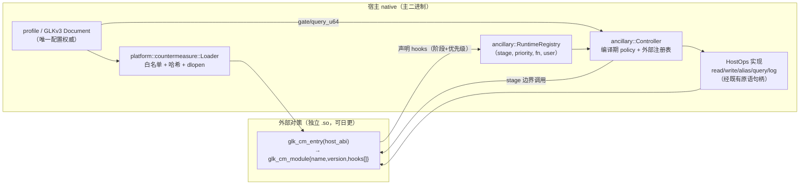

# 归档头（docs/plan 批次，2026-10-07）

- 原始路径：docs/plan/countermeasure-plugin-plan.md
- 归档原因：被 docs/plan/MASTER-PLAN.md 取代；未按现行设计规范编写
- 归档日期：2026-10-07 22:37（America/Toronto）
- 归档来源：task-63（docs-uml）

---


# 平台对策插件化（Countermeasure Plugin）设计

> 状态：**草案，待维护者认可后实施**（L 级：跨层契约 + 动态加载 + 新运行期注册表）。
> 动机：厂商对策（如 `vr.ko` 相关处置）**一天可能更新数十次**，不应随 native 主二进制一起发版；
> 需要「把对策拆成可独立更新的动态库」，且对策代码只能经**宿主提供的读写原语**动手、只能在
> **宿主声明的阶段**执行。

## 1. 目标与非目标

**目标**
1. 外部对策以**独立动态库**（`.so`）分发/更新，主二进制不重编。
2. 库只能通过**受控能力面**（read/write 原语 + 地址换算 + 中性策略查询 + 日志）操作内核内存；
   不接触 backend/session/route 内部类型。
3. 库在 `entry` 返回时**声明**自己要挂在哪个阶段（+ 优先级 + 名字）；宿主负责排序、门控与调用。
4. 全程 **fail-closed**：ABI 不匹配 / 不在白名单目录 / 哈希不符 / 符号缺失 / 阶段执行失败 → 该库被跳过并记录，
   绝不静默继续。

**非目标**
- 不做运行期下载；库的来源与路径由 profile/宿主配置决定（本设计只定义**加载白名单与校验**）。
- 不改变攻击原语与 6 个攻击函数（插件**不得**在攻击函数内新增调用点，见 §7）。

## 2. 现状与要修订的约束

| 现状 | 位置 | 说明 |
|---|---|---|
| 中性机制 | `ancillary/controller.hpp` | 编译期 `PolicyList` tuple + 调用方注入 gate |
| 阶段词汇 | `ancillary/ancillary_policy.hpp` | `AncillaryStage{PreSpawn,PostSpawn,PreHandoff}` |
| 能力面（手工） | `AncillaryOps` | `write_available/read_available/write_zero/image_to_direct_map/child_task` |
| 在树厂商对策 | `platform/vivo/{vr_guard,vr_task_tag}` | 编译进主二进制 |
| **冲突** | ADR-0004 **R14** | 「编译期 `AncillaryPolicyList`、**无运行期注册表**」——本设计必须修订该条 |

**修订方式（建议新增 ADR-0005，并回填 ADR-0004 R14）**：
- **在树**核心对策仍走编译期 tuple（R14 对它们继续有效，保证攻击路径零虚分发、零运行期分配）；
- **新增**「外部对策运行期注册表」，仅承载**树外动态库**，入口固定为阶段边界，且其调用点位于
  ancillary controller 内部（不在 6 个攻击函数内）。

## 3. 结构



R1 依赖边：`contract` 定义 ABI 的结构化 C++ 映射与阶段词汇；`platform` 实现 Loader（`dlopen`）；
`ancillary` 持有运行期注册表与分派；ABI 头**自包含**（外部作者只 include 它，不 include 本项目任何头）。

## 4. ABI（稳定 C 接口）

单一自包含头：`sdk/countermeasure/include/glk_cm_abi.h`（C99；跨界只用 POD/函数指针，无异常、无 RTTI、无 STL）。

```c
#define GLK_CM_ABI_VERSION 1u

typedef enum glk_cm_stage {
    GLK_CM_STAGE_PRE_SPAWN      = 0, /* W1 完成、victim 尚未 spawn */
    GLK_CM_STAGE_POST_SPAWN     = 1, /* root child 已存在（今天的 W2b） */
    GLK_CM_STAGE_PRE_TERMINAL   = 2, /* terminal 接管前（原 PreHandoff） */
    GLK_CM_STAGE_PRE_ROUTE      = 3, /* backend 已选 route、执行前（可选） */
    GLK_CM_STAGE_POST_TERMINAL  = 4  /* 收尾/清理（可选，失败不回滚主流程） */
} glk_cm_stage;

/* 宿主能力面：库唯一的操作入口。所有字段在 ABI v1 内固定，新增能力只允许追加到尾部并
 * 用 size/abi_version 判定可用性。 */
typedef struct glk_host_ops {
    uint32_t  size;            /* = sizeof(glk_host_ops)，前向兼容 */
    uint32_t  abi_version;     /* = GLK_CM_ABI_VERSION */
    void     *ctx;             /* 宿主私有句柄，库不得解引用 */

    /* —— 读写原语（内核已翻译 VA）—— */
    int32_t (*read_u64)(void *ctx, uint64_t va, uint64_t *out);
    int32_t (*write_u64)(void *ctx, uint64_t va, uint64_t value);
    int32_t (*read_bytes)(void *ctx, uint64_t va, void *dst, uint32_t len);
    int32_t (*write_bytes)(void *ctx, uint64_t va, const void *src, uint32_t len);
    /* 记名零写：走既有原语句柄，便于审计/回滚与 cmp 门禁不新增调用点 */
    int32_t (*zero_word)(void *ctx, uint64_t va, const char *desc);

    /* —— 地址换算 —— */
    uint64_t (*image_to_direct_map)(void *ctx, uint64_t image_addr);

    /* —— 中性策略查询（profile 是唯一权威；不跨 ABI 暴露结构体布局）—— */
    int32_t (*query_u64)(void *ctx, const char *path, uint64_t *out);
    int32_t (*query_str)(void *ctx, const char *path, char *buf, uint32_t cap);

    /* —— 观测 —— */
    void (*log)(void *ctx, int32_t level, const char *msg);

    /* —— 每次调用的上下文（阶段相关；无则为 0）—— */
    uint64_t child_task;       /* POST_SPAWN 起有效 */
} glk_host_ops;

typedef int32_t (*glk_cm_stage_fn)(void *user, glk_cm_stage stage, const glk_host_ops *host);

typedef struct glk_cm_hook {
    glk_cm_stage    stage;
    uint32_t        priority;  /* 同阶段从小到大；相等按注册顺序稳定排序 */
    glk_cm_stage_fn fn;
    void           *user;
    const char     *name;      /* ASCII、NUL 结尾，仅用于日志/诊断 */
} glk_cm_hook;

typedef struct glk_cm_module {
    uint32_t           abi_version;  /* 必须 == 宿主传入的 host_abi_version */
    uint32_t           size;         /* = sizeof(glk_cm_module) */
    const char        *name;         /* 例 "vivo.vr_guard" */
    const char        *version;      /* 库自己的版本串（打日志用） */
    uint32_t           hook_count;
    const glk_cm_hook *hooks;        /* 静态表，加载期读取，之后不再变更 */
} glk_cm_module;

/* 唯一导出符号。宿主 ABI 不兼容时返回 NULL。 */
const glk_cm_module *glk_cm_entry(uint32_t host_abi_version);
```

**返回码约定**：`0` = 成功；负值 = 失败（与 native `Status` 的 fail-closed 语义一致）。
**阶段语义**：`fn` 返回非 0 时，该库在该阶段失败 → 记录并**跳过该库的后续阶段**（是否中止整条攻击链由该阶段决定，
见 §6）。

## 5. 宿主侧：加载与注册

1. **白名单目录**：只从 `<app files>/countermeasures/` 或 `$GHOSTLOCK_HOME/countermeasures/` 加载；
   目录/文件若对 group/other 可写则拒绝。
2. **完整性**：profile 侧登记 `<name>.so` 的 sha256；加载前校验，不符即拒绝并告警。
3. **ABI 校验**：取 `glk_cm_entry`；`module->abi_version == GLK_CM_ABI_VERSION`、`module->size` 与
   宿主已知字段兼容、`hooks` 非空且 `hook_count` 合理（有上限）。
4. **注册**：把 hooks 追加到 `ancillary::RuntimeRegistry`（`module` 生命周期由 loader 持有，
   注册表只借用）。同 `(stage, priority)` 按注册顺序稳定。
5. **门控**：profile 是唯一权威。宿主为每个 module 计算 `enabled`（例如 `meta.vr_guard`、
   目标进程条件、route 条件），**不由库自行决定**；库只能通过 `query_u64` 读取中性策略值。
6. **失败处理**：加载/校验/注册任一失败 → 该库整体跳过，写入 `run.target`/阶段诊断，不 abort 主流程；
   已注册库在某阶段失败 → 该库后续阶段不再调用（半途失败不做「补偿」以外的操作，库可自行在
   `POST_TERMINAL` 做清理）。

## 6. 阶段与调用时机（必须与既有攻击顺序相容）

| 阶段 | 对应今天 | 允许做的事 | 失败后果 |
|---|---|---|---|
| `PRE_SPAWN` | W1 之后、spawn 之前 | 清 tracepoint、改全局表等不依赖 child 的处置 | 该库跳过后续阶段；不影响 W2 |
| `POST_SPAWN` | W2b | 依赖 `child_task` 的 per-task 处置 | 同上 |
| `PRE_TERMINAL` | 原 `PreHandoff` | handoff 前最后一次处置 | 同上 |
| `PRE_ROUTE`（新，可选） | route 已选、执行前 | 针对特定 route 的厂商适配 | 同上 |
| `POST_TERMINAL`（新，可选） | 收尾 | 清理/上报 | 仅记录，不影响结果 |

**硬约束**：插件调用点**只能在阶段边界**（ancillary controller 内），**不得**进入 6 个攻击函数
（`owner_thread/waiter_thread/consumer_thread/run_main_route_threads/do_kernel5_fake_lock_route/do_one_write`）——
`cmp_disasm` 门禁必须保持 6/6 IDENTICAL。

## 7. 不变量与风险

**不变量**
- I-1：6 个攻击函数机器码 strict IDENTICAL（插件只在阶段边界被调用）。
- I-2：`kernel_offsets`(520/8)/`TargetProfile`(784/8)、`session_layout_test` 不变。
- I-3：wire/GLKv3 文档不变（插件的加载清单与哈希放 profile 扩展节，走既有 v3 字段机制）。
- I-4：`contract` 不依赖 `platform`/`backend`/`terminal`（R1 防火墙 0 unexpected/0 stale）。
- I-5：插件拿到的只有 `glk_host_ops`（无 session/backend 类型），所有写经既有原语句柄，可审计。

**风险**
- R-1：`dlopen` 引入运行期依赖/加载失败面 → 白名单 + 哈希 + fail-closed + 诊断；默认无插件时行为与今天逐字节一致。
- R-2：ABI 演进 → 用 `size`/`abi_version` 双闸；新增能力只追加字段。
- R-3：库可写入任意内核 VA → 这是**设计意图**（它就是对策），但必须：(a) 只能经宿主原语；
  (b) 每次写有描述串入审计/回滚；(c) 插件不得新增攻击函数调用点。
- R-4：R14 冲突 → 新增 ADR-0005 修订，明确「在树编译期 / 树外运行期」两条通道。
- R-5：Android 打包（`.so` 从 assets 解出到应用私有目录再 `dlopen`）需验证 API 级别与 SELinux 允许；
  未验证项标注在批次门禁中。

## 8. 批次

| 批次 | 内容 | 门禁 |
|---|---|---|
| **CM-1** | ABI 头（`sdk/countermeasure/include/glk_cm_abi.h`）+ C++↔ABI 映射与 `static_assert`（阶段枚举 1:1、结构布局、版本）| host + NDK + lint；无运行期行为 |
| **CM-2** | `platform::countermeasure::Loader`（白名单/哈希/`dlopen`/probe）+ **测试插件 `.so`**（host 构建）+ fail-closed 用例（ABI 不符、符号缺失、哈希不符、目录不可信、`fn` 返回失败）| host（真实 `dlopen`）+ NDK + lint + cmp |
| **CM-3** | `ancillary::RuntimeRegistry` + Controller 分派（阶段+优先级+gate）+ 诊断输出；在树 policy 与外部注册表共存 | host + NDK + lint + cmp（6/6）+ **真机门禁**（无插件加载时行为不变） |
| **CM-4** | 把一个在树对策（建议 `vr_task_tag`）按 ABI 写成参考插件，验证「在树实现」与「插件实现」语义一致；文档 + ADR-0005 | 同 CM-3 + 真机 |
| **CM-5**（后续） | profile 侧加载清单/哈希字段 + Android assets 打包与解出加载 | Kotlin 对拍 + 真机 |

## 9. 裁决记录（2026-10-04，维护者）

1. **阶段/触发器/能力：全部在 ABI v1 预留，但只实现最小子集。** ABI 头声明全集
   （阶段含 `PRE_ROUTE`/`POST_TERMINAL`；触发器含 `ON_LOAD`/`ON_BOOT_READY`/`PERIODIC`；能力含 `FILE_CACHE_WRITE`/`EXEC`/`KERNEL_HOOK`），
   **宿主只实现 `ON_STAGE` + `{KERNEL_READ, KERNEL_WRITE, ALIAS, CHILD_TASK}`**；其余在加载期一律**拒绝注册并记录诊断**（fail-closed），
   不做半实现、不静默降级。
2. **内核侧（`KERNEL_HOOK`）不在本 ABI 内提供**：Defex/RKP/KNOX 类对策走独立的内核侧通道（LKM）；本设计只覆盖用户态阶段回调。
   本期**不建内核侧 ABI**。
3. **写原语粒度**：`read/write_u64` + `read/write_bytes` + `zero_word` + `image_to_direct_map` 足够；`vr` 类定位用 alias + `query_u64` 组合，不加新原语。
4. **门控归属**：profile 是唯一权威，库不自行决定启用。
5. **哈希来源**：profile 扩展节（走既有 GLKv3 字段机制）。
6. **R14 修订**：新增 ADR-0005，并在 ADR-0004 R14 标注取代关系。
7. **ABI 头位置**：本期放 `src/core/contract/glk_cm_abi.h`（自包含 C99、无任何项目 include，仍受 R1 防火墙与 lint 覆盖）；
   待需要对外分发时（CM-5）再导出到 SDK 目录，避免过早新增顶级目录。
8. **`PRE_ROUTE` 语义**由 backend 定义（其阶段枚举映射到 ABI 阶段），不写死某个 backend 的内部步骤。

---

## 10. 交叉验证：43499 与其它攻击路径的注入时机 / 其它厂商对策的能力需求

### 10.1 各攻击路径今天真实的注入时机

| 路径 | 原语 | 现有注入点 | 时机说明 |
|---|---|---|---|
| **43499 multicast_waiter / select_stack / tcp_zerocopy** | PI-futex 竞争 → W1(SELinux) / W2(cred) / W3(seccomp) | `PreSpawn`（W1 之后、victim spawn 之前）、`PostSpawn`（W2b，root child 已存在） | **均在竞争窗口之外**；窗口内不插任何外部调用（cmp 门禁要求） |
| **43284（DirtyFrag）** | 文件**页缓存** 16B 写（无内核内存写） | chain 阶段：patch#1(crash_dump64) → patch#2(vendor 载体) → hook apply(libc++ sentry) → trigger(double-fork init) → LKM | 内核侧能力由**加载的 LKM** 提供（kprobe + UMH），不是宿主读/写原语 |
| 64560 / 31431 / 43503 / 23274 | 占位（AF_ALG AEAD / skbuff 页缓存 / xt_IDLETIMER warn 等） | 未实现 | 原语形态不同，注入时机待各自设计 |

**关键事实**：今天两个在树对策都只要求「阶段边界 + 内核地址读改写」：
- `vr_guard`：按 **image offset** 定位 `__tracepoint_sys_exit.funcs`，写指针数组一项 → 需要 `image_to_direct_map` + `write_u64`。
- `vr_task_tag`：对 **child task** 做 read-modify-write（`task+0x00` 的 thread_info.flags、`+0x2c` 的 tag B）→ 需要 `child_task` + `read_u64`/`write_u64`。

### 10.2 能力需求矩阵（★ = 本设计可满足）

| 对策 | 需要的时机 | 需要的能力 | 满足？ |
|---|---|---|---|
| 43499 `vr_guard` | PreSpawn（spawn 前） | image→VA 换算 + 写指针数组一项 | ★ |
| 43499 `vr_task_tag` | PostSpawn（child 存在） | `child_task` + 读改写 per-task 字段 | ★ |
| **Samsung Defex**（`task_defex_enforce` 强制放行；上游 LKM 做法：kprobe `pre_handler` 置 `x0=0`、`pc=lr`） | 需**内核空间 hook**（在函数被调用时拦截） | kprobe / 改内核 text | **✗ 不满足**（userspace 阶段回调做不到；除非 Defex 恰读一个**可写**函数指针，属侥幸，不能依赖） |
| **Samsung DMC Vault / Odin lockdown**（DFReroot：每次开机、系统服务重置后 ~1s 内重写 flags） | **开机器 + 周期性** | 内核/文件写 + 定时 | **✗ 不满足**（阶段模型是一次运行内的一次性回调，无周期/开机触发） |
| SELinux permissive（43284 由 LKM 写 `selinux_state`） | 攻击前/中 | 内核写 | ⚠️ **取决于能力位**：有内核写原语（如 43499 W1 那种）则 ★；43284 单独运行时宿主无内核写 → 该库必须被跳过（fail-closed） |
| `hook_guard`(PAC/BTI)、carrier 选择、`.ko` KMI/vermagic 预检 | **构建/资产期** | 非运行期 | ✗ 不属于本 ABI（应留在 backend/资产层） |
| UMH 被 `CONFIG_STATIC_USERMODEHELPER` 拦 | 需要 **exec/进程** 能力 | exec / 替代加载路径 | ✗ 能力面无 exec/文件 API |
| 页缓存型对策（dm-verity/AVB 场景） | 任意 | **文件页缓存**写 | ✗ 当前 `write_*` 是**内核 VA**；需另加 file-cache 原语或走 backend |
| 必须在**竞争窗口内**参与的对策 | race window 内部 | 侵入攻击函数 | ✗ 设计明确禁止（cmp 门禁） |

### 10.3 结论与对设计的修订

**结论**：设计对「阶段边界 + 内核地址读改写」这一类（含 43499 现有两策、以及任何"改内核数据即可"的厂商对策）**是够的**；
但对**内核空间 hook（Defex 类）**、**周期性/开机器触发（DMC 类）**、**exec/文件页缓存能力**、**竞争窗口内处置**不成立。

**据此修订 ABI（v1 即纳入，避免以后破坏兼容）**：

1. **能力声明 + fail-closed 跳过**：`glk_cm_module` 增加 `required_caps` 位掩码；
   宿主在加载期比对自身可用能力，缺失即**不注册**该库并记录（不再"加载后发现不行"）。
   `enum glk_cm_cap { KERNEL_READ=1<<0, KERNEL_WRITE=1<<1, ALIAS=1<<2, CHILD_TASK=1<<3,
   FILE_CACHE_WRITE=1<<4, EXEC=1<<5, KERNEL_HOOK=1<<6 }`。
2. **触发器维度**：把「阶段」升级为「触发器」，为将来的开机/周期需求留位：
   `enum glk_cm_trigger { ON_STAGE=0, ON_LOAD=1, ON_BOOT_READY=2, PERIODIC=3 }`，
   `hook.trigger` + `hook.stage`（`ON_STAGE` 时有效）+ `hook.period_ms`（`PERIODIC` 时有效）。
   **v1 实现只做 `ON_STAGE`**；`ON_BOOT_READY`/`PERIODIC` 声明可用但宿主未实现时按 §1 缺能力处理（跳过 + 记录）。
3. **明确划界**：`KERNEL_HOOK` 能力**不在 userspace ABI 内提供**；Defex 类对策走**内核侧通道**
   （LKM / 未来的内核侧对策插件），本 ABI 只负责**用户态、阶段边界、数据读写型**对策。
4. **backend 相关阶段**：`PRE_ROUTE` 由 backend 定义语义（43284 的 patch/hook/trigger 若要暴露，走 backend 自己的阶段枚举映射），
   避免把某个 backend 的内部步骤写死进全局 ABI。
5. **能力缺失的可观测性**：每个未注册/被跳过的库必须在诊断里出现（name/version/缺哪个能力/原因），
   便于现场定位"为什么某个厂商对策没生效"。

