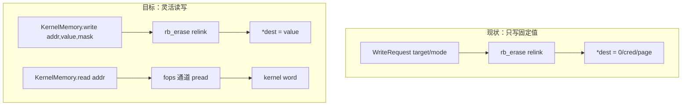

# 归档头（docs/plan 批次，2026-10-07）

- 原始路径：docs/plan/flexible-kernel-rw-primitive-plan.md
- 归档原因：被 docs/plan/MASTER-PLAN.md 取代；未按现行设计规范编写
- 归档日期：2026-10-07 22:37（America/Toronto）
- 归档来源：task-63（docs-uml）

---


# 43499 后端：灵活内核读写原语 计划（2026-10-03）

## 现状与基线

- 分支 `vr-ko-bypass-dev`；当前 HEAD `acc5e7b`。
- 现有原语是**纯写、单字**：`Cve2026_43499Policy::attack_write<M>` →
  `prepare_good_kernel_page` → PI-futex `CMP_REQUEUE_PI` 竞态 → `rb_erase` 左子重连。
  重连把伪造 waiter 的 `pi_tree` 字段当控制字：`{pc = value, rb_left = dest, rb_right = 0/…}`
  ⇒ `*dest = value`，并在 one-child 臂额外把 `*(value)` 写为 `dest-8`
  （`memory/payload_builder.cpp:35-75`、`support/util.cpp:334-486`、`backend.cpp:441-471`）。
- 写入值**不在请求里**：`WriteRequest{target, mode, preserve_child}`（`payload_builder.h:14-32`），
  值由 `payload_write_layout` 派生，只有三种：`0`（leaf）、`page_base+0x100`（W1，低字节清
  `selinux_state.enforcing`）、`init_cred_alias`（W2）。`WriteMode` 只有 `Disabled/Zero/Credential`。
- **没有通用内核读**：`perf_find_task` 是寄存器泄漏，`kernelsnitch` 是 futex 计时侧信道，
  其余是 procfs/sysfs。无 `copy_to_user`、无把内核值送回用户态的通道。
  `AncillaryContext::read_available` 恒 `false`，`read_back` 只是注释占位。
- `attack_write`、`zero_word`、`do_*_fake_lock_route`、`waiter/owner/consumer_thread`、
  `run_main_route_threads` 是 `tools/cmp_disasm.py` 的攻击函数；经**参数**新增调用点会改变其
  机器码（`vr-guard-plan`：参数派生调用点使 `do_one_write` 126→130）。`tools/cmp_disasm.py`
  的 `multicast_owner_worker/multicast_waiter_worker` 两项已 stale（resident multicast 已移除）。

## 目标与约束

目标：把“只写、固定值”的原语替换为**灵活内核读写原语**，供 43499 后端与 ancillary 使用：

- `read(addr, out, len)` / `write(addr, in, len)`：任意内核读、干净任意写；
- `update_bits(addr, mask, value)`：位级 read-modify-write；
- 以上由 **Tier 2 通道**提供；Tier 1 只负责引导（零 / 受控指针写）；
- 保持攻击函数机器码可控（见“cmp_disasm 策略”）。

非目标：

- 不新增漏洞；不换前端/handoff；不改 GLK1 之外的传输格式；不引入可变全局（仍只 `g_exploit_session`）。
- 不要求一次调用写多字（可重复调用，每次一次 PI 竞态）。

## 可行性分析

| 能力 | 现状 | 结论 |
|---|---|---|
| 任意值写 | 值写臂在重连里是**两处写**：`*target = value` 外加对 `value` 关联地址（`*(value+8)`/`rb_left/rb_right`）的第二次写；`payload_write_layout_accepts_page` 还对 `value` 的 bit16 有要求 | **不可直接**：只适合 0 / 受控指针值；写任意小值（清位后的 flags 字）会 fault。任意值/掩码写改由 **Tier 2 通道**提供 |
| 位掩码写 | 需先读旧值 | 依赖 Tier 2 的读 |
| 任意读 | 无任何机制 | **需新增第二段原语**（研究级） |

> 复核（2026-10-03）：`memory/payload_builder.cpp:39-47` 的 `encode_compact_waiter`、`:96-105` 的
> `accepts_page`、`support/util.cpp:397-403` 的注释、以及现有仅有的三种值（0 / `page_base+0x100`
> / `init_cred_alias`）共同证明：值写带结构副作用，**不是干净单字写**。因此 `KernelMemory::write`
> 的任意值语义由 Tier 2（`pwrite`）提供；Tier 1 只保留“零 / 受控指针”引导写。

关键判断：**读无法靠现有 `rb_erase` 重连“顺带”得到**——没有任何用户可见 sink 被内核地址填充。
在此 CVE 上已被验证可行的读法只有一个来源：用一次受控写把某个内核指针改成指向用户可控的伪造
对象，从而让一个用户可触发的 syscall 变成任意读/写。本仓库 W2 已经在用该套路（`layout.fops` /
`fake_fops` / credential copy），因此第二段最自然的落点是 **fops 通道**。

## 读机制对比

| | B. fops 通道 | C. pipe_buffer 物理读写 | D. 页表/PTE |
|---|---|---|---|
| 数据域 | 内核镜像 VA（`.data`/`.bss`/堆） | 物理页 → direct-map 别名 | 用户 VA 直映射 |
| 一次操作 | `pread/pwrite` syscall | `read/write` syscall | 直接 load/store |
| 建立 | 一次受控写把字符设备 `fops` 指向 spray 页伪造表；read/write_iter 指向内核既有“private_data 当地址”函数 | 改写 `pipe_buffer`（`page`/`offset`/`ops`）使 pipe 落到任意物理页 | 多次写改 PTE/VMA |
| 依赖 | 目标 fops 符号 + handler gadget + 伪造对象布局 | `pipe_buffer` 布局 + 受控 pipe + phys↔virt | PTE 定位 + 多写 + TLB 一致性 |
| 优点 | 与现有 `fake_fops`/credential copy 同源；持久、无需每次竞态 | 物理域；可探测 phys | 最干净、无 gadget |
| 风险 | gadget/符号缺失、KCFI、设备权限 | pipe 生命周期、读错页 | 时序/TLB、panic 风险最高、无先例 |
| 现状 | 同 CVE 已被 Neo11Plus 验证 | 同 CVE 已被 Neo11Plus 验证 | 未验证 |

结论：**默认 B**（镜像 VA、依赖最少、与现有代码同源），**C 作为补充分支**（需物理域时），D 不作默认。

## 设计

### 对外接口（backend 提供给外围组件的工具函数）

外围组件（ancillary / exec / 后续阶段）**只依赖此接口，不关心机制**。实现可在 B/C/D 间替换，
接口不变。宿主可测的声明与能力查询放在头文件，Android 实装在 backend 单元。

```
/* 接口归叶子 contract（backend 无关能力契约）；实现由 backend/platform 提供并绑定。 */
namespace ghostlock::contract {
    /* 可选能力的公共父接口：稳定 id + 结构性 concept（无 vtable；PI 窗口禁间接分派）。 */
    enum class CapabilityKind : std::uint8_t { KernelMemory = 1, AddressDiscovery = 2 };

    template <class C>
    concept Capability = requires {
        { C::kind } -> std::convertible_to<CapabilityKind>;
    };

    /* 能力 1：内核内存（Tier 2 建立后可用）。空句柄 = 不可用（fail-closed）。 */
    struct KernelMemoryOps {
        bool (*read)       (uintptr_t addr, void* out, size_t len) = nullptr;
        bool (*write)      (uintptr_t addr, const void* in, size_t len) = nullptr;
        bool (*read64)     (uintptr_t addr, uint64_t& out) = nullptr;
        bool (*write64)    (uintptr_t addr, uint64_t value) = nullptr;
        bool (*update_bits)(uintptr_t addr, uint64_t mask, uint64_t value) = nullptr;
        static constexpr CapabilityKind kind = CapabilityKind::KernelMemory;
    };
    static_assert(Capability<KernelMemoryOps>);

    /* 能力 2：地址/任务发现（可选；kernelsnitch / perf_find_task 为实现）。 */
    struct AddressDiscoveryOps {
        bool (*discover)(uintptr_t& out) = nullptr;   // 具体签名待定
        static constexpr CapabilityKind kind = CapabilityKind::AddressDiscovery;
    };
    static_assert(Capability<AddressDiscoveryOps>);

    /* 能力句柄集合：CoreSession 的字段类型（组合根持有），不是到处传的 context。
     * 由 backend 在 establish 阶段一次性写入；之后只读。空句柄 = fail-closed。 */
    struct Capabilities {
        KernelMemoryOps kernel_memory{};
        AddressDiscoveryOps discovery{};
        [[nodiscard]] bool available(CapabilityKind) const noexcept;
    };
}
```

- **组合根**：`session::CoreSession` 持有 `contract::Capabilities capabilities{}` 与 backend 状态槽；
  backend 在 establish 阶段写入一次，之后全程只读（不新增全局、无竞态）。
- **窄视图**：backend 步骤取 `CoreSession&`（需要框架+能力+自身状态）；ancillary 行为取
  `contract::Capabilities&`（只给能力，不给 session）；`AncillaryContext` 退役（并入此模型）。
- **可选 facade**：`KernelMemory::write64(...)` 内部读 `CoreSession.capabilities`（与
  `profile/accessors.hpp` 同风格），调用点简洁；不加全局、不传参、无 vtable。
- 所有能力默认 `nullptr`（不可用）；`available()` = 对应句柄非空（单一来源，不另设 flag）。

- ancillary 行为**退役 `AncillaryContext`**，改取 `contract::Capabilities&`（窄视图，组合根提供），
  沿用“plain function pointer、不引入间接分派到 PI 窗口”的约束。
- `available()` 为假时所有操作返回 false 并告警；调用方决定是否致命。
- 任意值 `write`/`update_bits`/`read` 依赖 Tier 2；通道未建立时 `KernelMemory::write_zero` 仍走
  Tier 1（与现状一致），其余 fail-closed。

### Tier 1 / Tier 2 是什么

同一条攻击链上的两个阶段，**不是两套漏洞**：

- **Tier 1 = 原语层（in-primitive，只写，值受限）**：现有 `rb_erase` 单字写，一次一次 PI 竞态。
  它的值写带结构副作用（见“可行性分析”），因此只能写 **0 / 受控指针值**（如指纹页地址）。
  它的用途是**引导**：给目标内核指针装上伪造对象。它**没有读**，也不做任意/掩码写。
- **Tier 2 = 通道层（channel，任意读 + 任意/持久写）**：用 Tier 1 的**一次**写把某个内核指针
  改成指向用户可控的伪造对象，使一个普通 syscall 变成**干净**的任意内核读写。B（fops）与
  C（pipe_buffer）是 Tier 2 的两种实现。任意值写、位掩码写（RMW）、读都只在 Tier 2 成立后可用。
- 关系：Tier 2 是“用 Tier 1 搭出来的”；Tier 1 永远存在（通道安装失败时仍可做零/指针写），
  Tier 2 是本次要新增的能力。接口 `KernelMemory`：`read`/任意 `write` 依赖 Tier 2，
  `write_zero` 可由 Tier 1 直接承担。

### Tier 2 后端链（已定：B 主、C 回退）

通道在**建立阶段**只选一次，按序尝试，全失败则降级 Tier 1（只写）；每次读写的后端固定。

1. **B. fops 通道（主）**
   - **载体（已定，按存在性排序）**：默认 **ashmem**（改写 `ashmem_misc.fops` 指向 spray 页里的
     伪造表）；备选 `binder_miscdev` → `loop_control`。三者都是“可写 `fops` 字段的 miscdevice +
     可打开节点”，覆盖 Android 5.15/6.1/6.6。
   - **gadget（已定）**：**configfs**（伪造表 `read_iter/write_iter` →
     `configfs_read_iter/configfs_write_iter`，`file->private_data` 指向伪造
     `struct configfs_buffer`，其 `bin_buffer` = 目标地址）。
   - 兼容性判据：有可写 `fops` 字段的 miscdevice **且** 有 configfs；缺一即跳过 B。
2. **C. pipe_buffer 物理读写（回退）**
   - 无 gadget 依赖，只用通用 pipe + `struct page`/vmemmap + `anon_pipe_buf_ops`；
     B 的载体或 gadget 任一缺失时启用。
3. **Tier 1 只写（最终降级）**：`write(addr,value,mask)` 仍可用，`read` 返回 false。

接口预留：`KernelMemory` 增 `channel_kind()`（`Fops`/`Pipe`/`WriteOnly`，供日志与测断言）；
内部 `KernelMemoryBackend` 抽象，B/C 各实现 `read/write`，`establish()` 按链尝试。

### B+C 同时选的收益/成本

- 收益：覆盖两个数据域（B = 镜像 VA，C = 物理页）；**跨目标冗余**（某机型缺 B 的 gadget 时
  C 仍可能可用，反之亦然）；C 能取 phys / 触及不在镜像映射内的页。
- 成本：两套 profile 符号与偏移 + 两套提取器逻辑 + 两条代码路径 + 各自风险面；门禁与维护翻倍。
- 建议：接口不变的前提下**先落 B**（与现有 `fake_fops` 同源、依赖最少），把 C 作为同一
  `KernelMemory` 的可选后端；**只有当 5.15 缺 B gadget、或明确需要物理域时再加 C**。
  不为了“同时选”而一次上两条。

### 兼容性与稳定性

| | Tier 1（值写） | B. fops 通道 | C. pipe_buffer |
|---|---|---|---|
| 兼容性 | 复用现机制，5.15 与 6.1 均已过路由门禁；换值不改命中率 | 需可写的 fops 符号 + 语义合适的 kernel gadget + 伪造对象布局；configfs/ashmem 在多数 GKI 存在，覆盖较广，但符号/偏移**每镜像不同** | 需 `pipe_buffer`/`pipe_inode_info` 布局、vmemmap base、`sizeof(struct page)`；布局跨版本差异更大，**每镜像提取** |
| 稳定性 | 同现状（概率命中、需重试） | 建立后每读写是一个普通 syscall，无竞态；但受 gadget 的语义/长度/对齐限制，错写即污染内核态；KCFI 需签名的匹配 | 中：pipe 的 merge/GC 与 fd 生命周期会干扰，需受控 pipe 且避免 `CAN_MERGE`；读错物理页 → fault/panic |
| 失败模式 | 命中失败 → 重试 | 符号缺失 → fail-closed 跳过 | 布局/页错 → 崩溃 |

### cmp_disasm 策略（硬约束）

- **值不经 `attack_write` 参数传递**：在 `session.heap.current` 增 `write_value`/`write_mask`，
  调用方先写 session 字段再调 `attack_write`（沿用 `vr-guard-plan` 的“绑定 session 全局、
  不新增参数派生调用点”做法），使 `attack_write`/route 机器码尽量不变。
- 若 `sizeof(WriteRequest)`/字段序变化不可避免，必须作为**已复核的形状差异**记录，并重跑
  真机门禁；不把“测试通过”当作 disasm 通过。

## 改动清单（初稿，待机制确认后细化）

| 文件 | 改动 | 理由 |
|---|---|---|
| `memory/payload_builder.h` | 新 `WriteMode::Channel`（引导指针值，取 session 的伪造对象地址）；**不做任意小值** | Tier 1 引导 |
| `memory/payload_builder.cpp` | `payload_write_layout` 为该模式选安全指针值，使第二写落在伪造页内 | 编码，保 route 形状 |
| `support/util.cpp` | `prepare_skb_payload` 写入任意 value；Tier 2 伪造 fops 表 | 两段式 |
| `session/exploit_session.hpp` / `heap_context.h` | `heap.current.write_value/write_mask`（若走 session） | 保 disasm |
| `session/backend/cve_2026_43499_backend.cpp` | 新阶段建立通道并实现 `KernelMemory`；W1/W2/W3 改用 | 替换现原语 |
| `session/ancillary/ancillary_policy.hpp` + 各 behavior | `AncillaryContext` **退役**，行为取 `contract::Capabilities&` | 外围消费方 |
| `profile/model.h` + `binary.cpp` | B：`ashmem_misc`/`binder_miscdev`/`loop_control` 符号 + `miscdevice.fops` 偏移、`configfs_read_iter`/`configfs_write_iter` 符号、`configfs_buffer.bin_buffer`、`file.private_data`；C：`pipe_buffer`/`pipe_inode_info`、`anon_pipe_buf_ops`、`vmemmap`/`page_offset`/kernel phys load | channel（B/C 各自 fail-closed） |
| `tools/extract_rs/`（`symbols.rs`/`report.rs`） | 扩展 `SYMBOLS`/`STRUCT_FIELDS` 与 GLK1 字段，按镜像探测 B/C 所需符号与偏移 | profile 权威 |
| `tests/*` | payload 固定向量、`KernelMemory` 接口的 host 测（stub 实现） | 防回归 |

## 数据流/控制流差异



不变量：Tier 1 仍是一次 PI 竞态一次单字写；`attack_write` 调用点与相对顺序不变（除非另行记录）；
ancillary 的 detag 仍先于 W2 提权。

## 兼容性与回滚

- 无 GLK1 v2 破坏性变更则为增量；Tier 2 新增 profile 字段需提取器同步，未配置即 fail-closed 跳过。
- 回滚：`WriteRequest` 还原三值、删除 Tier 2 阶段与 profile 字段。

## 验证矩阵

| 批次 | 命令 | 预期 |
|---|---|---|
| host | `make -C src native-host-tests`（含 payload 向量、`KernelMemory` stub 接口） | 全绿 |
| NDK | `make -C src ghostlock` | 零告警 |
| 形状 | `python3 tools/cmp_disasm.py <baseline> build/native/ghostlock` | IDENTICAL 或已复核差异 |
| 真机（可随时） | **Xperia 5.15**：Tier 1 值写自测 + Tier 2 通道读写自测；不回归现有 Multicast route；归档门禁 | PASS/FAIL 记录 |
| 真机（需协调） | **vivo 6.1**：ancillary 消费方（VrGuard/VrTaskTag）行为验收 | PASS/FAIL 记录 |

门禁现实：Xperia 5.15 可随时调用，但**没有 vr.ko**，只能验收 `KernelMemory` 接口/通道与路由
不回归；vr 语义要等 vivo 6.1 协调到位。B 通道所需符号/偏移应先在 5.15 镜像上提取验证。

## 明确保留

- `rb_erase`＋PI 竞态作为唯一漏洞原语；
- 现有 W1/W2/W3 的语义与顺序（在替换完成后逐项复验）；
- `kernelsnitch/`、GLK1 v2、组件目录与 `Pipeline<F,B,M>`。

## 开放决策（需确认后细化为最终计划）

对外接口（`KernelMemory`）**与机制无关、固定不变**；以下只影响 backend 内部实现。

1. **实现选型（已定）**：B 主、**C 回退**、Tier 1 只写最终降级；D 暂不。回退在通道建立阶段完成，
   接口 `KernelMemory::channel_kind()` 暴露实际后端。
2. **Tier 2 载体（已定）**：B 载体按序 `ashmem_misc` → `binder_miscdev` → `loop_control`，
   gadget = configfs；C 用通用 pipe。实际的“哪个存在”由提取器按镜像决定并写入 GLK1，运行时 fail-closed。
3. **接口形态**：值一律走 `session`（不新增 `attack_write` 参数），以保 `cmp_disasm`；确需改
   `WriteRequest` 时记为已复核差异并真机重验。
4. **范围（已定）**：替换 43499 后端并打通 `KernelMemory`，**同步改造 ancillary 消费方**
   （`AncillaryContext` 退役 → 行为取 `contract::Capabilities&`）。
5. **目标设备（已定）**：**Xperia 5.15 先行**（接口/通道自测 + 路由不回归）；vivo 6.1 需协调后
   做 vr 语义验收。

## 进度

- [x] 计划 + 机制/载体/回退定稿（B 主、C 回退、Tier1 降级）
- [x] 复核值写语义：值写非干净单字（带第二写与位约束），**任意/掩码写改由 Tier 2 提供**
- [ ] 获批（修正版）
- [ ] Batch 1：`KernelMemory` 接口 + ancillary 消费方改造（host 可测，stub 实现）
- [ ] Batch 2：提取器字段（B/C 符号与偏移）+ GLK1 输出
- [ ] Batch 3：Tier 1 `WriteMode::Channel` 引导 + B 通道（ashmem→binder→loop + configfs）
- [ ] Batch 4：C 回退（pipe_buffer）
- [ ] 验证（host / NDK / cmp_disasm / Xperia 5.15 / vivo 6.1）
