# 全流程 UML：IPO · 状态机 · Class · Sequence（C++ · Kotlin · Rust）

- 快照：HEAD（`0e9bc50`）——S4-R6b/T5 组合 token 白名单、ADR-0006 terminal 归属、F1 组合维度分解、F3 `RouteKind::None`、F4 token 表导出与跨语言对拍均已落地。
- **本文件是全流程唯一权威图**（IPO / 状态机 / Class / Sequence 四类）；格式细节见 `../analysis/wire-transport-model.md`，配置流水线细节见 `../analysis/profile-pipeline-flow.md`。
- Class 图按**语言原生分组**：C++ = `namespace`，Kotlin = `package`，Rust = `module`。

## 1. IPO（数据级，逐阶段）

| # | 阶段 | IN（类型/字段） | PROCESS（函数/算法） | OUT（类型/字段） | 失败/降级 |
|---|---|---|---|---|---|
| **A1** | Rust 读取镜像 | `boot.img`/OTA zip/URL → `Vec<u8>` | `boot::extract_release`, `fdt::find_fdt_magic`, `arm64_image_size` | raw image + `release` 字符串 | 非 arm64/无 FDT → err |
| **A2** | 符号与类型 | raw image | `kallsyms::decode_names/decode_addresses`, `btf::parse_btf` | 符号表（名→VA）、BTF 结构 | 缺 BTF → 仅 kallsyms |
| **A3** | 反汇编与推导 | 符号表 + 机器码 | `disasm::disassemble_symbol`, `derive::*` | offset/几何（`task_struct`/`cred`/`offset`/route 几何） | 模式不匹配 → 字段缺失 |
| **A4** | 物理布局 | raw image | `iomem::find_kernel_memory_map_entry`, `analysis::*` | `kernel_phys_load/offset`、`delta` | 无 iomem → 缺省 |
| **A5** | 产出 profile | `AnalysisResult`（+ 可选 `--plugin-descriptor <probe-tsv>`，可重复） | `report::render_conf`（canonical 布局 + `schema_version = 3`；**HOCON 重构后的新形状**：根级标量 + `available{ <backend> = [tokens] }` + `backend.<id>`；`common`/`platform`/`selection` 已删除；`--route`/`--steps-path` 决定组合 token）；~~带描述符时产出 `plugin.<id>.extract.<key>`~~——**⏸ 已按用户指令注释/冻结（extract spec 产出端停止）**; `render_json`（v1） | `*.conf`（可导入 App）/`*.json` | `cargo test` 断言「生成 ≡ 内置」+「产出的 token ∈ `combination-manifest.tsv`」；required 缺失 → 失败、optional 缺失 → 省略且不写 default；**无开关时输出逐字节不变** |
| **B1** | HOCON 加载 | `assets/profile/*.conf` + `index.conf` + 用户导入 | `HoconSupport`（include 展开、`${}` 变量） | `ValueMap`（含 legacy 键） | 未知键 → 报错带点分路径 |
| **B2** | 归一化 | legacy `ValueMap` | `ProfileLayout.canonicalize`（别名表：`selection.steps`/`backend.steps` → 所属 `backend.<id>.steps` 组合 token（`CombinationCatalog.fromLegacySteps`；`normalize` 仅用于输入边界）、`cred/offset` 平台/私有拆分、`meta.*`→`common.*`） | canonical owner-qualified map（steps = 解析后的 canonical token） | 未识别旧键 / 未知 legacy step id → fail-closed |
| **B3** | 合并与校验 | canonical map + 覆盖 + 设备 `uname -r` | `ProfileMerger.resolveMerged` → `ProfileResolver.validateMerged` | `ProfileConfig`（resolved 字段集） | release 不匹配 → 拒绝 |
| **B4** | 建文档 | `ProfileConfig` + `CombinationSpec` + 已启用插件 | `NativeProfileGlkv3Adapter.adapt`（**只发所选 backend 的段 + common + 已启用插件的 `plugin.<id>.*`**；selection 由 `CombinationCatalog` 从 `profile-core/src/main/resources/combination-manifest.tsv` 解析，运行时零 token 字面量；`plugin.<id>.params.*`/`.extract.*` 是 manifest 的 `|` 联合行，具体类型由描述符决定） | GLKv3 `Glkv3Value`（map/sections，`steps` = canonical token，plugin 段仅含 enabled=true） | 缺段 → 该字段不发射；token 未命中 / union 成员未知 → 拒绝 |
| **B5** | 编码 | `Glkv3Value` | `Glkv3Encoder.encode`（最短整数、键 UTF-8 序） | `ByteArray`（根 map，`schema=3`） | 超 1 MiB → 拒绝 |
| **B6** | 分帧 | 文档字节 + (43284) SA 秘密 | `ChannelBStdin.frame` + `SessionSecretFrame.encode` | `[u32be len][doc]`(+仅 43284 `[u32be 84][frame]`) | 43284 缺帧 → 拒绝 |
| **C1** | 判别 | stdin `ByteArray`（仅 `--ghostlock-app-call` / `--load-prebuilt-profile` 两种入口） | `looks_like_glkv3`（首字节 map/fixmap/map16/32） | bool | 非 map → 直接 -1 |
| **C2** | 帧化 | 文档字节 | `frame_v3` + `decode_neutral`（强制 `schema == 3`，owner 前缀白名单） | `profile::Document{release, backend_token, terminal_token, sections[]}`；`ReadResult.storage` 持有缓冲 | `schema != 3`/未知前缀 → -1 |
| **C3** | 选择解析 | Document 根 token + `backend.<id>.steps` | token → `contract::kCombinationCatalog` 行 `CombinationSpec{token, doc, backend, kind, route, path, steps, terminal, available}`（12 行 = **7 可用 + 5 计划**）；`CombinationId{backend, route, path}` 是**分解视图**，`CombinationKind` 仍是 wire 紧凑 id（uint8，枚举值与顺序不变） | `DispatchTarget` + 派生 (route, steps, terminal) | 未知 token（回显）/ 计划项 `available=false` / 缺 `steps` / 根 `route`·`terminal` 与 token 不一致 → 拒绝 |
| **C4** | 绑定 | Document + owner Schema | `SchemaRegistry::bind_all(mode=Production)`（必需性、默认值、`default_used` 诊断）；route 缺省为 `RouteKind::None`（= 4，不进 `kRouteCatalog`），组合要求 route 而文档未给 → 拒绝；`--allow-dev-target` 只在该绑定期放宽 43284 carrier 校验（链内仍拒 dev carrier） | 类型化 View（route 几何、43284 策略、握手参数） | 缺必需 / 类型不符 / route 不一致 / carrier 未过校验 → Rejected |
| **C4b** | 插件校验 | Document `plugin` 段（仅启用插件） | `plugin::validate_plugin_wire`（fail-closed：`enabled` 必须是 true 的 bool、`stage` ∈ 4 个 host token、`module_path` 相对且无 `..`/反斜杠/≤256 B、`module_hash` 64 位小写 hex、动态键经 `plugin_dynamic_key` 匹配、未知字段拒绝、≤16 插件不静默丢弃）；实例化时 `plugin_descriptor_declares` 按 **size 门控**校验（v1 模块无尾部声明 → 拒绝） | `PluginWireEntry[]`（id / stage / module_path / module_hash / param_count / extract_count） | 任一规则失败 → Rejected（错误名由 `plugin_wire_error_name` 给出） |
| **C4c** | payload 校验（设计，**待 native 半场**） | Document `payload` 段（缺省 ⇒ 不启用） | wire 校验：`tier` ∈ {`exec`,`script`,`ko`}；**单档互斥**；`ko.count` 1..8 且与实到数一致、`i` 十进制且 `< count`；路径相对 `<GHOSTLOCK_HOME>`、无 `..`/反斜杠/NUL、≤256 B；`sha256` 64 位小写 hex；**(terminal,tier) 矩阵外 → 拒绝** | 类型化 payload View | 任一规则失败 → Rejected；**无 `payload.*` ⇒ 逐字节不变** |
| **C4d** | root 管理器存在性检查（**P1 必做**；设计稿 §4.1） | 用户选择的 `payload.root.{kind,manager}` + 系统事实 | **App 侧预检**（包是否安装 / `ksud` 或指定路径是否存在且可执行 / 哈希匹配）→ **native 绑定前复核**（fail-closed + 具名原因） | 可用性状态（未安装 / 不可启动） | 不存在或不可启动 ⇒ **不降级、不猜替代品**；结论标「未完成」+ 原因，**不中断攻击链**；**权威判定在 native**（UI 只是提前提示） |
| **C4e** | 插件宿主构造/打开（**⏸ step 3a 已按用户指令注释 = `ca968a5a`；沿革保留，当前不可达**） | 校验后的 `plugin` 段 + 所选 backend | 组合根 `PluginHost::from_document(decoded, backend)` **只登记**（无 dlopen、无文件访问）；**43284** 在 bind 前 `open(WindowState::WaiterClosed)`（该 backend 全程无 PI waiter）；**43499 绝不在这里打开**（step 3b 在 `pre_terminal` anchor，**未落地**） | 已注册 hook 集合（`registered()`） | open 失败 → 记账（fail-soft）；**无 `plugin` 段 ⇒ 全链无副作用、零新增字节** |
| **C5** | 后端阶段 | View + `CoreSession` | route：`run_route`→`RouteStatus{code,step,errno,userspace_clean}`；步骤：spray/race/W1/W2/W3 | `StageResult`（ok/failed/degraded） | `DirtyFailure` → 终止（不换 route） |
| **C6** | 终端阶段 | terminal 输入载荷（script / UMH channel） | `RootChildPolicy::run_handoff` 或 `UmhForwardPolicy::run`（`UmhReadyState`: Ready/NotReady/Unavailable） | root child / UMH→LKM 加载 | NotReady → Failed；Unavailable → **Done(降级)** |
| **C6b** | 插件派发（每 backend **仅一个**可用点；**step 3a 已接线：43284**；43499 待 **step 3b**） | 43284：LKM 驻留窗口内（`lkm_window.cpp:102`，经中性 **`PluginStageSink`** 派发 `POST_TERMINAL`）；43499：终端接管前（`steps.cpp:484-490` / `:517-521`，**未接线**） | 同步派发：**43284 = `post_terminal`（已接线）**、**43499 = `pre_terminal`（step 3b）**；sink 由组合接缝在 `window->run()` 前 attach（`execution_binding.cpp` 的 thunk 是**唯一** `HostStage::` 调用点） | hook 调用结果（fail-soft 记账；**hook 失败绝不失败链**） | 其余阶段「声明但不可用」：**hook 级拒绝**（`StageUnavailableOnBackend`，不拒整插件）；可用性经探针 **`stage_availability`** 暴露；43499 无 `post_terminal`、43284 无 `pre_spawn`/`post_spawn`/`pre_terminal` |
| **C6c** | payload 执行（**仅接管后**；设计，**待 native 半场**） | 校验后的 payload View + 接管上下文 | `exec`（argv，经 root child）/ `script`（经 LKM 通道）/ `ko`（1..8，late-load，**必须过 `lkm::precheck_module_file`**）；执行前哈希钉比对、先 `stat` 限长 | 逐项结果 + 运行结论摘要 | **绝不中断攻击链**；用户请求未完成 ⇒ 结论标「未完成」+ `payload_error` / `ko[i]=<reason>`；**提权记录照记**；`ko` 逐项继续、不回滚 |
| **C6d** | root 管理器启动（**默认档**；设计稿 `root-manager-selection-design.md`，待用户确认） | 无 `payload` 段 ⇒ 现状 KernelSU/ksud；`payload.tier=root` ⇒ 显式 `payload.root.{kind,manager,argv}`（白名单；仅 custom 必填 argv） | `kernelsu`（**含各分支**，共享 `ksud`）：经**既有** late-load 路径（`build_late_load_command`，无 shell），`manager` 可选；`custom`：用户 argv 直传；**P2 = `folkpatch`**：**加载 KernelPatch 模块**（`apd insmod` 式手动重定位 + 绕过 CRC/vermagic + `init_module` + **软重启**，独立机制设计 + 独立门禁，落地前置灰） | root 管理器进程 / 模块加载结果 | 启动失败 ⇒ 结论标「未完成」，**不中断攻击链**；**包名绝不猜**（非 KernelSU 为空） |
| **C7b** | 插件收尾（**step 3a**） | pipeline 结束后的宿主 | `plugin_host.close()` 卸载；诊断**仅 `registered() > 0` 时**打印一次（字段化 `run.plugin`，供真机 grep） | 卸载结果 + 诊断块 | 无插件 ⇒ **stdout/stderr 零新增字节**（无插件零字节回归判据） |
| **D1** | 内核原语 | 进程 syscalls | PI-futex 竞争（waiter 覆盖）／ESP 页缓存写 | `RouteStatus.code=Ok` + `userspace_clean` | 竞争失败 → Retryable |
| **D2** | 提权步骤 | 覆盖后的 cred/task | W1 SELinux permissive → W2 cred/uid0 → W3 seccomp 清除 | `uid=0`、`Enforcing` 可写 | 步骤失败 → Backend failed |
| **D3** | 落地 | root script / helper.ko + 会话秘密 | UMH exec（vendor modprobe）或 root child 执行脚本 → `insmod` | `/dev/glk` 注册、module resident、KernelSU ready | 模块未驻留 → 轮询超时 |
| **D4** | 退出/卸载 | fd/定时器 | 插件窗口 close → LKM unload（`explicit`/`fd-close`/`watchdog`） | 模块卸载、AVB `ok=12 fail=0` | watchdog 60s 兜底 |

> 入口（R2b 后）：`--ghostlock-app-call`（stdin GLKv3，可接会话帧）与 `--load-prebuilt-profile <bin>` 二选一，另有只读 `--probe-cve-2026-43284 <ko>`；运行控制 / 安全 / 可观测开关为 `--force-attack`、`--allow-dev-target`、`--dump-kernel-log <dir>`、`--enable-status-record`（需 app-call）。**选择与策略不得出现在 CLI**：staged 入口已删除，未知参数直接失败。dev 回放构造生产形态文档走同一 app-call 路径。
>
> **HOCON 重构（**三侧已定稿**：native ①②③④ = `b55708a8` + `23958eb0`；extractor = `a6241bc0`；App 侧 ③ = `c443f5f0`）——profile 装配链**：`assets/*.conf`（**根级标量**：`schema_version`/`release`/`kernel_major`/`kernel_minor`/`safe_mode`；**`available{ <backend> = [tokens] }`** 两级；`backend.<id>`；**根级标量走「根段」承载 `kRootSection`**，使 `find_value(section,key)` 与根键同构，**勿改回具名成员**）→ Kotlin 归一/合并 → **用户在 App 里选 backend（`available` 的键）再选 token（值）** → wire `backend.<id>.steps` → native bind → Pipeline。**`common` / `platform` / `selection` 已删除**（`platform.abi.*` → `backend.cve_2026_43499.abi.*`）；**`terminal` 概念从 HOCON 移除**（token 已蕴含）；43284 的 `execution.*` 收纳执行调参，**`kmi`/`lkm_path`/`carrier_path` 从 profile 删除**（wire 保留、**运行时现算注入**）；`index.conf` 用 **`usable`**（构建/资产层）。
>
> **步骤队列取代 token（用户裁决 2026-10-05；**设计已定稿** `docs/archive/README.md（已归档设计稿索引）`，**M1 起分段落地**）**：`available{ <backend> = [ … ] }` 的**值**将从**预烘焙 token 列表**改为**步骤队列**（**两级保留**：先 backend、再其下队列）；**不做**动态 DSL / 运行期规划（队列是**静态声明**）。连锁：`kCombinationCatalog` 12 token **降级为内部归一化/预设判定**（仍供 `supported` 与 dispatch）、`backend.<id>.steps` 值 token ⇒ 队列、**`PathKind` 按档位 (ii) 删除**、**stepset 改名任务取消**；迁移面 = **62 份资产 + UI + 组合目录 + 契约 + UML**（迁移期允许 token 作**语法糖**，改完**删糖**）。**pipeline 由「编译期固定」变「注册表 + 校验」属结构性改动 ⇒ 设计落地后同批更新本图并写明图名**（设计稿 `docs/archive/README.md（已归档设计稿索引）` 由 `native-hocon` 编写，docs-uml 不动）。
>
> **LKM/DDK 构建里程碑（2026-10-06，`8187375c`）——本图无节点增删，仅注记**：**APK 资产包含 8 个 `assets/lkm/<label>/ghostlock.ko`**（`unzip -l … | grep assets/lkm/` = **8 行**）；构建入口 = Gradle **`buildLkmImages`**（逐 label 容器构建，官方全 8 标签 **EXIT=0**）/ **`copyLkmIntoAssets`**（fail-closed 落 assets），**8 个 label 来自 native 导出的 `lkm-kmi-manifest.tsv`**（不手抄）；产物在 `~/.ghostlock/lkm/<label>/`，账本 `kmis.tsv`（9 行），守卫 **`:app:verifyLkmLedger`**（`EXIT=0` / `LKM ledger: 8 row(s) match the cache`，证伪可复现 FAIL）；**锚点 13-5.15 `ac6681b71078` 23512 逐字节不变**（其余 4 个旧 label 同）。**未做**：三个新 label（15-6.6 / 16-6.12 / 17-6.18）**未做真机冒烟**、运行时装载的**设备端实跑**未做（仅纯逻辑单测 4/4）。
>
> **⏸ 用户指令（2026-10-05）**：表中 **C4c / C4d / C6c / C6d**（payload 与 root 管理器）与 **C4e / C6b / C7b**（插件宿主）对应的**运行路径已字面注释 / 不再被接受**——**IPO 行保留以记录结构，但不等于当前可达**（代码在、恢复需撤销注释；`vr_guard` 为**分两期**且**两期均已完成**（(b) profile 面 `b55708a8` / (a) **vivo 代码已删除 = `4a182217`**）、`defex` **已删除**（`a68e2d5a`）——见 §3.1 注）。

## 2. 状态机

### 2.1 顶层运行状态机（native `main`）

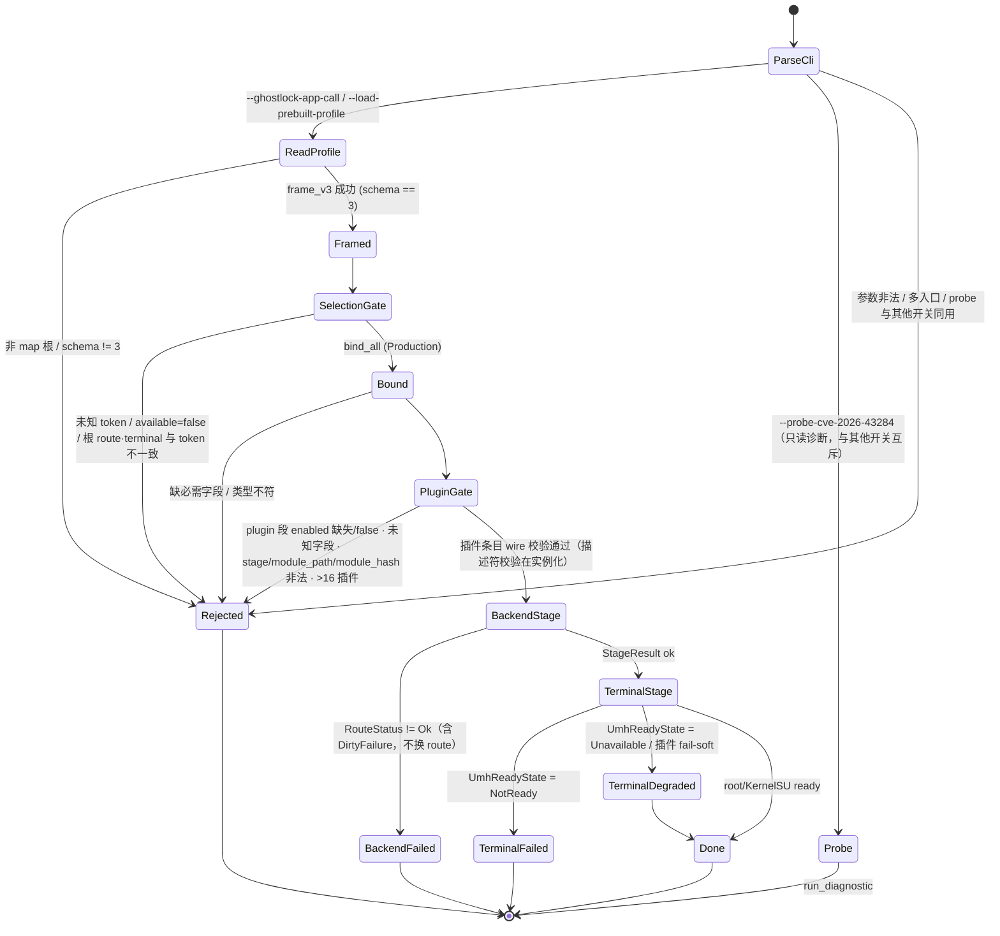

> 选择解析：唯一选择是 `backend.<id>.steps` 的 token；根 `route`/`terminal` 只做一致性校验，不一致即 `Rejected`。`RouteKind::None`（= 4）表示该 backend 无 route 轴（不进 `kRouteCatalog`）；`Auto`（= 0）仅遗留 v1/v2 解码。
>
> 插件默认**关闭**：文档 `plugin` 段里 `enabled` 缺失或为 false 一律 `Rejected`（未启用插件不得出现在 wire）；动态键 `params.*`/`extract.*` 的前缀只认 manifest 显式声明的通配行，无隐式前缀规则。
>
> R2b 后 CLI 只承载**传输 / 运行控制 / 安全 / 可观测**：选择与策略全部来自 GLKv3 文档；staged 入口（`--run-cve-2026-43284`/`--stage`/`--plugin`/`--cve43284-*`/`--allow-vermagic-rewrite`）已删除，dev 回放走 `--ghostlock-app-call` + 同一 Pipeline。`--allow-dev-target` 只放宽**绑定期**的 43284 carrier 校验，链内仍拒 dev carrier（A/B 证据见 `../analysis/device-gates/s4-r2b-20261005-pass.md` §3）。

### 2.2 43499 攻击链状态机

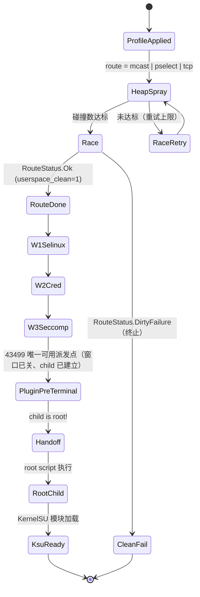

> **43499 只画 `pre_terminal` 一处插件派发**（`backend/cve_2026_43499/steps.cpp:484-490` / `:517-521`，随后移交 rooted child）：`pre_spawn` / `post_spawn` / `post_terminal` **声明但不可用**——race 窗口按**每次写尝试**开关（`steps.cpp:118` 的 `attack_write<M>` 位于 `:100-130` 写循环内），victim/child 就在该写循环里建立（`:480`），不存在「窗口关闭且 child 未建立」的点；root 接管后控制流也不再回宿主。依据：设计 `plugin-runtime-integration-design.md` §12（`ab0561f8`）；该矩阵经探针 `stage_availability` 暴露给 App（§2.4 注、设计 §13）。

### 2.3 43284 链状态机（含 LKM 窗口）

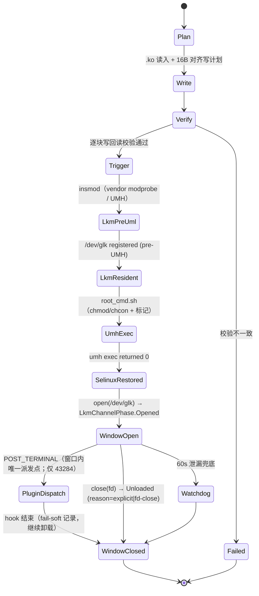

> `pre_spawn` 的触发点**不在 Pipeline 层**：入口 `backend/cve_2026_43499_backend.cpp:111`（`run_setup`）→ `:124/127/130`（`StepSet::run<Route>`，route/race 与 W1/W2/W3 在同一个调用内）→ `:143–158` 才移交 rooted child；`w1()`（`steps.cpp:386`）成功之后、`w2()`（`steps.cpp:157`）之前即 `pre_spawn`。`run<Route>` 模板体内的**确切调用行号待钉死**（native-core step 2 第一件事）。

### 2.4 插件与 LKM 通道状态机

```mermaid
stateDiagram-v2
  [*] --> WireRejected : 文档 plugin 段 enabled 缺失/false（默认关闭）
  WireRejected --> [*]
  [*] --> NotLoaded : enabled=true 且 wire 校验通过
  NotLoaded --> Loaded : load(path, hash) → LoadStatus.Ok
  NotLoaded --> Rejected : PathRejected / PermissionRejected / FileMissing / HashRejected / HashMismatch / OpenFailed
  Loaded --> CallingPreTerminal : 43499 唯一可用阶段（终端接管前）——**step 3b 未落地**
  Loaded --> CallingPostTerminal : 43284 唯一可用阶段（LKM 驻留窗口内）——**step 3a 已接线**
  Loaded --> StageUnavailable : 注册了该 backend 不可用的阶段 → 注册期拒绝
  StageUnavailable --> Rejected
  CallingPreTerminal --> Completed
  CallingPostTerminal --> Completed
  CallingPreTerminal --> FailSoft : 类型化错误（Unsupported/Unavailable/Faulted/Rejected/Closed）
  CallingPostTerminal --> FailSoft
  FailSoft --> Completed : 记录 lkm_window_failed，链路继续
  Completed --> [*]
  Rejected --> [*]
  state "宿主生命周期（组合根，step 3a）" as HostLifecycle {
    [*] --> Registered : PluginHost::from_document（只登记；无 dlopen/文件访问）
    Registered --> Opened : 43284：bind 前 open(WindowState::WaiterClosed)
    Opened --> HostDispatched : 窗口内 POST_TERMINAL（lkm_window.cpp:102）
    HostDispatched --> Closed : pipeline 之后 close()
    Closed --> [*]
  }
  note right of HostLifecycle
    R1 不允许的转换：PI waiter 存活期不得 open。
    43499 只在 pre_terminal anchor 打开（step 3b，未落地），
    绝不在 bind 前打开。
  end note
```

> **step 3a 已接线（2026-10-05）**：宿主由组合根构造（`main.cpp` 的 `PluginHost::from_document` + 43284 专属 `open(WindowState::WaiterClosed)`），43284 在 LKM 驻留窗口内经**中性 `PluginStageSink`** 派发 `POST_TERMINAL`（`lkm_window.cpp:102`；sink 由 `execution_binding.cpp` 的 thunk 转给 `HostStage::PostTerminal`，那是唯一的 `HostStage::` 调用点），**fail-soft**；pipeline 之后 `close()`，诊断仅 `registered() > 0` 时打印（无插件零新增字节）。**真机门禁 PASS**（`device-gates/plugin-runtime-3a-20261005-pass.md`：正例 `called=1`/`calls=4`、`hook_failed` 不失败链、`StageUnavailableOnBackend`、`HashMismatch` 未 dlopen、无插件零字节回归；两条过程教训 = `kmi` 不得手写、试验台须清 `/data/local/tmp/.ghostlock_lkm_ok`）。**43499 的 `pre_terminal` 属 step 3b，未落地**——R1 约束：**PI waiter 存活期不得 open**（映射不得与 waiter 共存）。
>
> **⏸ 用户指令冻结（2026-10-05）**：插件工程与 payload/自定义 handoff **暂停并暂时禁用**——App 隐藏入口且**不再发射** `plugin.*`/`payload.*`；native 侧**字面注释掉**插件宿主接线（构造/打开/派发/卸载——**不是开关**，**恢复需撤销注释**；**native 侧已提交 = `ca968a5a`**、**App 侧在工作树、待提交**；代码与测试保留、**可逆**）；**`payload` owner 不再被接受**。图的类/关系**保留**（代码在、但运行路径**已注释不可达**），**不画成删除**；恢复条件 = **新架构完成 + 用户放行**。
>
> 四个 stage 词汇（`pre_spawn` / `post_spawn` / `pre_terminal` / `post_terminal`）不变，**可用性按 backend 表达**：43499 = `pre_terminal`（`steps.cpp:484-490`/`:517-521`），43284 = `post_terminal`（`lkm_window.cpp:99-107`，LKM 驻留窗口内）；其余阶段的 hook 在 `open()` 时**按 backend 拒绝该 hook**（`StageUnavailableOnBackend`，不拒整插件），全部被拒记 `no_usable_hooks=1`。**可用性来源 = 探针 header 第 5 行 `stage_availability`**（唯一权威 `plugin/schema.hpp::stage_available_on()`；Kotlin 不得硬编码），依据 §2.2 注、设计 §12 `ab0561f8` 与 §13。

### 2.5 Route 状态机（`RouteResultCode`）

```mermaid
stateDiagram-v2
  [*] --> Prepare
  Prepare --> Skipped : RouteKind::None（无 route 轴，不做几何校验）
  Prepare --> Unsupported : Policy::supported == false
  Prepare --> Execute : 几何齐备
  Execute --> Ok : 原语成功
  Execute --> Retryable : 竞争未命中（可重试）
  Execute --> FallbackSafe : 干净失败（无泄漏）
  Execute --> DirtyFailure : 有副作用/未清理（终止）
  Ok --> Disarm
  Retryable --> Disarm
  FallbackSafe --> Disarm
  DirtyFailure --> [*]
  Disarm --> Destroy
  Destroy --> [*]
  Skipped --> [*] : 直接进入 backend 步骤
  Unsupported --> [*]
```

### 2.6 UMH 就绪探针（`UmhReadyState`）与降级

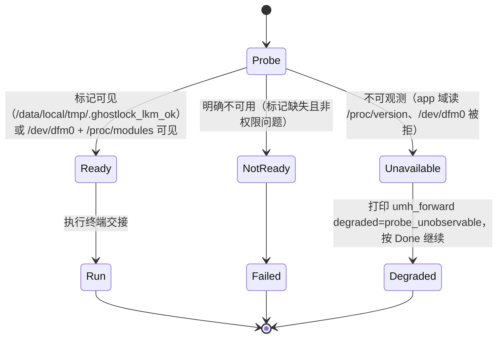

### 2.7 Kotlin 配置/运行状态机

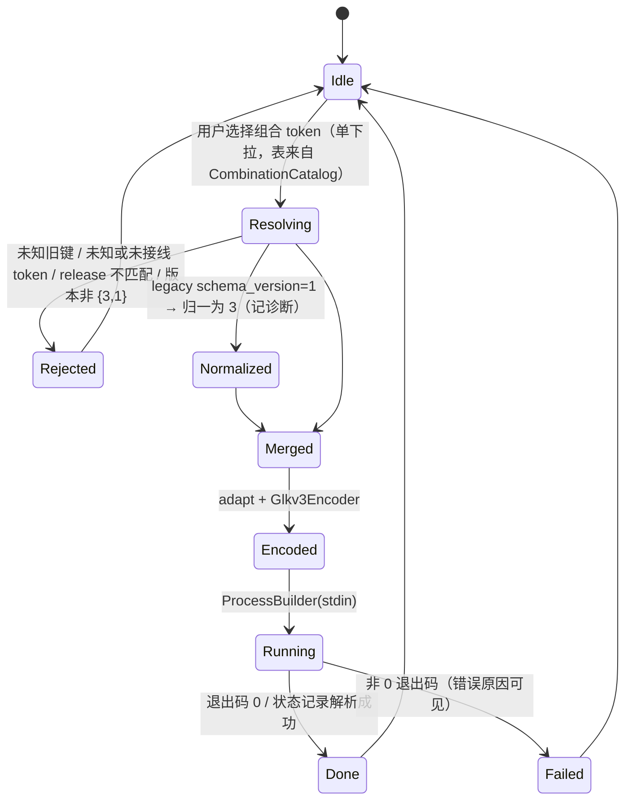

## 3. Class 图

### 3.1 C++（按 `namespace` 分组）

```mermaid
classDiagram
  namespace ghostlock__contract {
    class Document
    class FieldSpec
    class SchemaRegistry
    class CombinationSpec
    class CombinationId
    class CombinationKind
    class PathKind
    class RootProgramKind
    class RootProgram
    class DispatchTarget
    class Capabilities
    class StageResult
    %% 步骤队列（设计稿 docs/archive/README.md（已归档设计稿索引） §4.1/§4.2；M1 落地）
    class StepSpec
    class StepCatalog
    class StepId
    class CanonicalPlan
    class StepExecution
  }
  namespace ghostlock__pipeline {
    class Pipeline
    class Orchestrator
  }
  namespace ghostlock__backend__cve_2026_43499 {
    class BackendPolicy
    class RoutePolicy
    class Steps
    class LeakProvider
    class RootChildPolicy
  }
  namespace ghostlock__backend__cve_2026_43284 {
    class PluginStageSink
    class DiagLine
    class BackendTerminal
    class LkmPolicy
    class PageCacheWrite
    class SessionFrame
    class Entry
  }
  namespace ghostlock__terminal {
    class UmhForwardPolicy
    class HandoffProbe
    class RootScript
  }
  namespace ghostlock__plugin {
    class Loader
    class RuntimeRegistry
    class Controller
    class LkmChannel
    class LkmWindowRuntime
    class Schema
    class PluginProfile
    class PluginWireEntry
    class WireValidator
    class DynamicKeyMatcher
    class DescriptorGate
    class PluginHost
    class Probe
  }
  namespace ghostlock__payload {
    class PayloadTier
    class PayloadPolicy
    class PayloadSchema
  }
  namespace ghostlock__profile__glkv3 {
    class WireType
    class FieldSpec
  }
  namespace ghostlock__platform {
    class AbiSchema
    class DeviceProbeOps
    class Runtime
    %% HOCON 重构：profile 的 `platform` owner 已删除（platform.abi.* → backend.cve_2026_43499.abi.*）——**这是用户裁决的 HOCON 层**；
    %% `platform/vivo/**`（vr_guard/vr_task_tag）**已按 (a) 期删除**（**`4a182217`，10 文件**）；
    %% 本命名空间其余（abi.hpp / DeviceProbeOps 等）是否随迁/改名仍待 native 处置（**不要提前删节点**）。
  namespace ghostlock__session {
    class CoreSession
  }
  class Document {
    +string release
    +string backend_token
    +string terminal_token
    +Section sections
  }
  class FieldSpec {
    +string section
    +string key
    +WireKind wire
    +bool required
    +DefaultValue default_value
  }
  class CombinationSpec {
    +string token
    +string doc
    +BackendKind backend
    +CombinationKind kind
    +RouteKind route
    +PathKind path
    +StepSetKind steps
    +TerminalKind terminal
    +bool available
  }
  class CombinationId {
    +BackendKind backend
    +RouteKind route
    +PathKind path
  }
  class PathKind {
    <<enumeration>>
    Rootchild
    Shizuku
    Umh
  }
  class Pipeline {
    +target static_assert
    +run(session, input)
  }
  class CoreSession {
    +Capabilities capabilities
    +profile values
  }
  class PluginWireEntry {
    +string id
    +string stage
    +string module_path
    +string module_hash
    +size_t param_count
    +size_t extract_count
  }
  class WireType {
    <<enumeration>>
    UInt
    Int
    Bool
    Str
    Bin
    Array
    Union
  }
  class Capability {
    <<enumeration>>
    KernelRead_1_0
    KernelWrite_1_1
    Alias_1_2
    ChildTask_1_3
    FileCacheWrite_1_4
    Exec_1_5
    KernelHook_1_6
    Log_1_7_设计
  }
  class PayloadTier {
    <<enumeration>>
    Exec
    Script
    Ko
    Root
  }
  class RootProgramKind {
    <<enumeration>>
    KernelSU
    FolkPatch
    Custom
  }
  Document --> FieldSpec : binds
  StepCatalog --> StepSpec : kStepCatalog（目录即权威，contract/step_catalog.hpp）
  StepSpec --> StepExecution : 编译期绑死（concept + 折叠 static_assert；未注册 id 编译不过）
  CanonicalPlan --> StepSpec : 归一化（queue → CanonicalPlan）
  SchemaRegistry --> FieldSpec : owns
  CombinationSpec --> CombinationId : 分解
  CombinationSpec --> CombinationKind : 紧凑 id
  CombinationSpec --> PathKind : path
  CombinationSpec --> DispatchTarget : maps
  DispatchTarget --> Pipeline : selects
  Pipeline --> RootChildPolicy : terminal（backend::cve_2026_43499::terminal）
  Pipeline --> UmhForwardPolicy : terminal
  Pipeline --> Loader : 阶段派发（43499 pre_terminal / 43284 post_terminal）——⏸ **已注释（用户指令，不可达）**
  main --> PluginHost : from_document / open / close（组合根，step 3a）——⏸ **已注释（用户指令）**
  PluginHost --> RuntimeRegistry : 注册与记账（registered/dispatch/close）——⏸ **已注释**
  LkmWindowRuntime --> PluginStageSink : attach_plugin_stage()（中性函数指针 + ctx）——⏸ **已注释**
  BackendTerminal --> DiagLine : run.43284 有界结构化行（批 A，≤256 B，无格式串/无分配/不含密钥）
  Entry --> DiagLine : 失败路径具名原因（reason=<EnumName>）
  PluginStageSink --> PluginHost : dispatch(POST_TERMINAL)（经 thunk，**不持有指针**）——⏸ **已注释**
  RealChainContext --> PluginStageSink : 两个 sink 字段（执行接缝）——⏸ **已注释**
  PayloadSchema --> PayloadTier : tier（设计）——⏸ **owner 不再被接受（用户指令，不可达）**
  Pipeline --> PayloadPolicy : 接管后执行（设计，待落地）——⏸ **已注释**
  PayloadPolicy --> RootProgram : 启动 root 管理器（默认档；设计稿 v2）——⏸ **已注释**
  PayloadSchema --> RootProgramKind : payload.root.kind 白名单（设计稿 v2；manager 为可选包名）——⏸ **已注释**
  Loader --> RuntimeRegistry
  Loader --> LkmChannel
  LkmWindowRuntime --> LkmChannel
  Schema --> FieldSpec : kPluginGlkv3Fields（4 静态 + 2 动态 Union）
  Schema --> PluginProfile : 静态四字段视图
  FieldSpec --> WireType : union 成员来自 kUnionScalarTypes（恰好 4）
  WireValidator --> Schema : 路径/类型唯一权威
  WireValidator --> PluginWireEntry : validate_plugin_wire 产出
  WireValidator --> DynamicKeyMatcher : plugin_dynamic_key
  DescriptorGate --> PluginWireEntry : plugin_descriptor_declares（size 门控）
  Probe --> Capability : host_caps（caps_list 白名单；log 为设计，待落地）
  PluginHost --> Capability : required_caps 校验（未知位 ⇒ caps_rejected）
  Controller --> DescriptorGate : 实例化按描述符校验
  CoreSession --> Document : selection
  DeviceProbeOps --> CoreSession : facts
```

> S4 P1：`ghostlock__plugin` 的 `Schema`（`plugin/schema.hpp`）是 `plugin.<id>.*` 的路径/类型**唯一权威**，`WireValidator`（`plugin/wire.cpp::validate_plugin_wire`）做 fail-closed 文档校验（默认关闭、未知字段拒绝、`PluginWireError` 具名错误），`DescriptorGate`（`plugin_descriptor_declares`）按 **size 门控**校验动态键；动态两行的类型是 `profile::glkv3::WireType::Union`，清单拼写 `uint|int|bool|str`，`kUnionScalarTypes` 恰好 4 个成员。
>
> **43284 全链日志（批 A，**已落地** `a04bdb5b`；真机门禁 PASS `device-gates/43284-logging-20261005-pass.md`）**：`DiagLine`（`backend/cve_2026_43284/diag_line.hpp`）产出**有界结构化行** `run.43284 <phase> k=v …`——单行 ≤256 B（超出截断并追加 `truncated=1`）、**无分配**（固定缓冲，诊断绝不失败攻击步骤）、**无格式串语义**、值内控制字符归一为 `_`（防注入第二行）、**绝不含密钥**；正例 **16 行**、失败路径带 `reason=<EnumName>`；**always-on**（不引入 wire 开关）；本批**只做 43284，43499 另排**。
>
> **能力位词表（`Capability`）**：`glk_capability` 现为 7 位（`kernel_read(1<<0)`…`kernel_hook(1<<6)`，`glk_contract_abi.h:103-110`），词表权威是 `contract::Capability` + `capability_token()`（`contract/countermeasure.hpp:293-306`），探针经 `caps_list` 白名单输出 `host_caps`（`plugin/probe.cpp:109-122`/`:277-290`）。**设计扩展（未落地，待 native 设计稿）**：尾部追加 `GLK_CAP_LOG = 1<<7`（token `log`）——ABI 的 `glk_contract_ops.log` 与 host 实现**早已存在**（`glk_contract_abi.h:142`、`plugin/host_ops.cpp:215`、`plugin/loader.cpp:162`），缺的只是能力位；契约 §3.14.7.9。
>
> `ghostlock__payload`（`payload.tier` / `exec` / `script` / `ko`）是**第四类顶层 owner 的设计**（`contract-design.md` §3.15，`c335aabc`，用户已确认）——图中条目为**设计，尚未落地**；实现批次按同批刷新本图与 AGENTS 的 owner 白名单。
>
> **默认档 = root 管理器**：`RootProgramKind{KernelSU, FolkPatch, Custom}` 与 `RootProgram{kind, argv[192]}` 早已在 `contract/identity.hpp:366-380`，但**wire 零键**、运行时硬编码 `$GHOSTLOCK_HOME/ksud`（`execution_binding.cpp:49-56`）；`payload.tier=root`（+ `payload.root.kind/manager/argv`）把它们显式化——**设计稿 v2** `root-manager-selection-design.md`：**KernelSU 及分支共享 `ksud`**（用户口径）⇒ **P1 = `kernelsu`（默认 ksud，`manager` 可选）+ `custom`（用户 argv）+ 存在性/可启动检查（C4d，权威在 native）**；**P2 = `folkpatch`**——官方文档取证（<https://fp.mysqil.com/guide/jailbreak/>）：**加载 `kernelpatch.ko`**（`apd insmod` 手动重定位 + 绕过 modversions(CRC)/vermagic + `init_module` + **软重启生效**；前置条件正是 GhostLock 的 uid0 + Permissive），属**不同谱系**、独立机制与独立门禁；**包名绝不猜**（`schema.hpp:68-77`；E3 三条 404 即证据）。
>
> `RootChildPolicy` 的声明与实现都在 `ghostlock::backend::cve_2026_43499::terminal`（F5 / ADR-0006），`ghostlock__terminal` 只留中性件。`CombinationKind` 是 wire 紧凑 id（uint8，13 值 = Unknown + 12 token，枚举值与顺序不变）；`CombinationId{backend, route, path}` 与 `PathKind{Rootchild=1, Shizuku=2, Umh=3}` 是编译期分解视图，不是 wire 或存储变化。
>
> **⏸ stepset 词汇重命名（用户指令 2026-10-05）——已被 2026-10-05「队列取代 token」裁决吸收：任务取消**：`StepSetKind::W1W2` → **`ShizukuRootchild`**、`W1W3` → **`Rootchild`**（词汇 token `w1_w2`/`w1_w3` → **`shizuku_rootchild`/`rootchild`**；**数字 wire id 1/2 不变**、`pagecache_write`(3) 不动）。语义：`W1W2`＝**跳过 seccomp 绕过**、shell 入口/内核派生启动 ⇒ Shizuku 路径；`W1W3`＝**包含 seccomp 绕过**、app 后代启动 ⇒ rootchild 路径。**两轴正交**：`stepset` = 跑哪些 W 阶段；`frontend`/`terminal` = 谁接管。**只改这一条轴**（`PathKind`/`FrontendKind`/`TerminalKind` 保持原样）；不进 profile/wire 文档 ⇒ **不需真机门禁**。**挂起原因（硬证据）**：`kCombinationCatalog` 显示 **stepset 与 path 不是 1:1**——43284 同一个 `pagecache_write` 对应 **三个 path**（`umh`/`rootchild`/`shizuku`），43499 内 `w1_w3` 同时被 `*_rootchild` 与 `*_umh`（计划）使用 ⇒ **不能用 path/terminal 名命名 stepset**。详见契约 §3.18（含两轴正交论述）。
>
> **步骤队列（设计已定稿：`docs/archive/README.md（已归档设计稿索引）`；M1 起分段落地）——Class C++ 新增节点**：`contract::StepSpec` / `StepCatalog`（`kStepCatalog`，**目录即权威**，`contract/step_catalog.hpp`，host 可编译、守 R1）/ `StepId` / `CanonicalPlan` / `StepExecution`（concept），新增三条关系：**目录 → StepSpec**、**StepSpec → StepExecution（编译期绑死：`StepExecution<Exec>` + 折叠 `static_assert`，未注册 id 编译不过）**、**CanonicalPlan → StepSpec（归一化）**。词汇分两层：`StepSetKind`/`vocabulary-manifest` 的 3 行 `stepset` 保留为**内部归一化 id**（wire 数值不变），**步骤 id 词表是更细的一层**，两层映射**同表声明、可对拍**（设计稿 §4.1/§4.2）。**M2 才改 pipeline 部分**（「编译期固定」→「注册表 + 校验」），本批只登记 M1 的目录节点。
>
> **R1 搬迁（已完成，`native-r1`；提交号待回填）——`support` 归属变化**：`support/util.cpp` **799 → 133 行**（只留 **12 个中性函数**），**14 个原 `support` 函数迁入 `backend::cve_2026_43499::spray`**（`backend/cve_2026_43499/spray.cpp` 728 行 + `spray.hpp` 51 行）；9 处调用点全部改到 `cve_2026_43499::spray::*`；`kernelsnitch.h` 的**唯一 TU 现为 `spray.cpp`**（链 `spray.cpp → leak/address_discovery.h → kernelsnitch.h`）；`decls.hpp` 删 14 条声明并顺带删掉已无引用的 `memory/payload_builder.h`。**Class 图无 `ghostlock__support` 节点**（本图未列该命名空间）⇒ 本批**无节点增删**，只登记归属变化：**`support` 现已收窄为纯中性工具（12 函数）**，攻击相关件归 `backend`。**证据行（原文）**：`include_firewall_test: 176 files, 0 forbidden-layer edges, 0 whitelisted, 0 unexpected, 0 stale`（基线 174/4/4 ⇒ 176 = 174 + 2 新文件；**账本归零**）；host `EXIT=0`（告警 9 = 基线）· lint `EXIT=0` · NDK `EXIT=0` · **真机门禁 PASS**（冷机 route `success=1` · `child is root!` · `exploit complete` · `KernelSU ready` · `native exit=0`；归档 `docs/analysis/device-gates/20261006-015621/`）；**双向证伪**（加回越层 include ⇒ `VIOLATION … 1 unexpected` + FAIL；空账本加 1 条 ⇒ `static assertion failed … ledger must stay empty`）；**搬迁保真**：`spray body byte-identical to HEAD ranges: true` / `util body byte-identical: true`（**攻击语句零改写**，只变命名空间/include/限定）。
>
> **HOCON 重构（native ①②③④ 已落地：`b55708a8` + `23958eb0`；extractor `a6241bc0`；**App 侧 ③ = `c443f5f0`（三侧已定稿）**）：profile owner 结构变了**——**owner 白名单收敛为 `backend.<id>`**（`platform`/`common`/`countermeasure` 已删、`plugin`/`payload` 冻结拒收）（外加**根级标量** `schema_version`/`release`/`kernel_major`/`kernel_minor`/`safe_mode` 与根级 **`available{ <backend> = [tokens] }`**）。**`common` owner 删除**；**`platform` owner 删除**（`platform.abi.*` → `backend.cve_2026_43499.abi.*`，**62 处**；C++ 侧 `ghostlock__platform` 的类型是否随迁/删除**以 native 实现为准**）；**`selection`/`terminal` 从 HOCON 移除**（选择两级：backend → token，运行时写 wire `backend.<id>.steps`）；43284 的 `execution.*` 收纳执行调参，**`kmi`/`lkm_path`/`carrier_path` 从 profile 删除**（wire 保留、运行时现算注入）。详见契约 §3.16 与 `PROFILE_SCHEMA(_ZH)`。
>
> **vr_guard 两期（用户裁决 + `native-plugin` 审计 + 本批实现；沿革不删）**：
> **(b) profile 面（已完成 `b55708a8`）**——`common.vr_guard` 与 `countermeasure.vivo_vr_guard.tracepoint_funcs`（含 wire/manifest 行）删除 ⇒ 无写入者 ⇒ `vr_guard_enabled()` 恒 false ⇒ `steps.cpp` 两处 `VivoPluginPolicies::apply(...)` 可证明 no-op；**`countermeasure` owner 一并移除**；`defex` 已完成删除（`a68e2d5a`）。
> **(a) 删除 vivo 代码（已完成 = `4a182217`，**10 文件**）**——`src/core/platform/vivo/**` **8 文件** + `platform_vivo_test.cpp` + `host/ancillary_stub.cpp` 删除，`steps.cpp` **−95 行**（两处 include、两个祖先块、两个只为它们存在的私有件）⇒ **`platform::vivo` 与 `VivoPluginPolicies` 已不存在**。
> **Class 图本批无节点/关系可删**：本图**从未列出** `platform::vivo` / `VivoPluginPolicies` 节点（上批已核并注明「不要提前删节点」）；**状态机与 Sequence 也未提及 `vr_guard` 阶段或 `w2b`** ⇒ 本批只更新注记（**已核：全图仅本注与 §1 的 IPO 注提到 vr_guard**）。
> **非行为差异（必须记录，避免后人误判日志丢失）**：`w2b` 的 **run-state 标记随祖先块删除** ⇒ **运行日志的 stage 轨迹少一项**（不再有 `enter/complete("w2b")`）；**行为无变化**——字段无写入者 ⇒ policy `enabled()` 恒 false ⇒ **零执行字节**。**证据**：host `EXIT=0`（告警 **9** 基线、**58 tests**、防火墙 **`174 files, 4/4/0/0`（182 → 174）**）· lint **0** · NDK **0**；**真机门禁 PASS 已归档**：`docs/analysis/device-gates/vrguard-a-20261006/`——`child is root!` → handoff `sent=1` → **`KernelSU ready`**，route `success=1`，**设备未重启**；**三条偏差**：① 第一次跑设备重启 = **`KERNEL-PANIC-01` 一次性**（冷机复跑 PASS）② **锁屏 ⇒ 日志落 `/data/local/tmp`** ③ **`w2b` 标记少一项 = 预期**。

### 3.2 Kotlin（按 `package` 分组）

```mermaid
classDiagram
  namespace com__ghostlock__app__data__component {
    class CombinationSpec
    class CombinationCatalog
    class BackendKind
    class FrontendKind
  }
  namespace com__ghostlock__app__data__payload {
    class PayloadLayout
    class PayloadValidator
  }
  namespace com__ghostlock__app__data__plugin {
    class PluginProbe
    class PluginManifest
    class PluginManifestEntry
    class PluginPaths
    class PluginConfigValidator
    class PluginImportService
    class PluginProbeInvoker
    class PluginStore
    class Sha256
  }
  namespace com__ghostlock__app__data__profile {
    class ProfileLayout
    class NativeProfileDocument
    class NativeProfileGlkv3Adapter
    %% 队列承载（`4c20142f`）：ProfileLayout.validateAvailable 双形态 available（列表 / 对象 {route,queue,experimental}）；
    %% canonical 唯一一处归一进 backend.<id>，队列级 route 落 queue_route（geometry Map route 不被覆盖）；
    %% 唯一映射点 = NativeProfile.backendSection()（queue_route → wire 键 route）；回显只认与 available 声明逐值相等。
    class Glkv3Encoder
    class Glkv3Decoder
    class ProfileMerger
    class ProfileResolver
    class ChannelBStdin
    class SessionSecretFrame
    class ProfileExporter
  }
  namespace com__ghostlock__app__data {
    class AndroidProfileConfigController
    class UserProfileStore
    class AndroidGhostlockRepository
    class ExecutionModeMapping
  }
  namespace com__ghostlock__app__ui {
    class GhostlockViewModel
    class GhostlockUI
    class CombinationPresentation
    class PluginPresentation
    class PluginSettingsUI
    class PayloadSettingsUI
    class RootManager
    class RootManagerAction
  }
  namespace com__ghostlock__app__shizuku {
    class GhostlockUserService
  }
  namespace com__ghostlock__app__domain__usecase {
    class RunExploitUseCase
  }
  AndroidProfileConfigController --> ProfileLayout : canonicalize
  AndroidProfileConfigController --> ProfileMerger
  AndroidProfileConfigController --> ProfileResolver
  AndroidProfileConfigController --> NativeProfileDocument
  AndroidProfileConfigController --> NativeProfileGlkv3Adapter
  NativeProfileGlkv3Adapter --> Glkv3Encoder
  AndroidGhostlockRepository --> ChannelBStdin
  ChannelBStdin --> SessionSecretFrame
  GhostlockUserService --> ChannelBStdin
  GhostlockViewModel --> RunExploitUseCase
  RunExploitUseCase --> AndroidGhostlockRepository
  RunExploitUseCase --> ExecutionModeMapping
  ExecutionModeMapping --> CombinationCatalog : 派生 / 回映射
  AndroidGhostlockRepository --> CombinationCatalog : setCombination / 恢复校验
  AndroidProfileConfigController --> CombinationCatalog : token 归一（normalize → resolve）
  GhostlockUI --> CombinationPresentation : 单下拉（计划项置灰）
  CombinationPresentation --> CombinationSpec : 纯投影（doc 摘要 / planned）
  GhostlockUI --> CombinationCatalog : recommended / defaultSpec
  CombinationCatalog --> CombinationSpec : 读 main 资源 combination-manifest.tsv
  ProfileExporter --> NativeProfileGlkv3Adapter
  UserProfileStore --> ProfileLayout
  PluginImportService --> PluginProbeInvoker : 探针调用（--plugin-probe）
  PluginImportService --> PluginProbe : 解析 stdout（PluginProbe.parse）
  PluginImportService --> PluginStore : 原子安装 + 注册表
  PluginImportService --> Sha256 : 导入前本地哈希
  PluginImportService --> PluginManifestEntry : 注册表行
  PluginConfigValidator --> PluginManifestEntry : 只校验已导入插件
  PluginPresentation --> PluginConfigValidator : 类型 / 必填 / 默认值
  PluginPresentation --> PluginManifestEntry
  PluginSettingsUI --> PluginPresentation : 渲染高级设置（只读行）
  GhostlockUI --> PluginSettingsUI : 插件设置页
  GhostlockViewModel --> PluginPresentation : pluginRows
  GhostlockViewModel --> PluginImportService : 选择/导入
  AndroidGhostlockRepository --> PluginImportService
  AndroidGhostlockRepository --> PluginStore : no-backup 存储根
  PayloadSettingsUI --> PayloadLayout : 分档设置页 + 执行前摘要（**UI 已落地**；摘要=告知非门槛）
  GhostlockViewModel --> RootManagerAction : rootManagerAction(succeeded, rootProduced, pkg, launchable)
  RootManagerAction --> RootManager : "打开它 / 说明它 / 什么都不做"
  RootManager --> FrontendKind : of(terminal)（未知 ⇒ null，绝不猜包名）
  AndroidProfileConfigController --> PayloadLayout : payload 段发射（设计，待落地）
```

> S4 P1 插件（`com.ghostlock.app.data.plugin` 在 profile-core 与 app 两个模块同名并存）：描述符解析 `PluginProbe`、注册表 `PluginManifest(Entry)`、路径/根 `PluginPaths`、校验 `PluginConfigValidator`、导入 `PluginImportService`（探针 + 原子安装 + 清单）、UI 投影 `PluginPresentation` / `PluginSettingsUI`。**插件配置无资产**：`plugin.conf` 已取消（2026-10-05 裁决），走既有覆盖存储；`ProfileLayout` 白名单接受 `plugin.<id>.*` 并 fail-closed。
>
> Kotlin 侧**没有** `CombinationKind`：白名单以 `CombinationSpec` 行表示，由 `CombinationCatalog` 从 native 导出的 `combination-manifest.tsv` 解析（两份：`app/src/test/resources/` 对拍 + `profile-core/src/main/resources/` 运行时）。`route = null` ⇔ 清单 `route` 列 `none` ⇔ 无 route 轴（native `RouteKind::None`）；下拉摘要取清单 `doc` 列（`com.ghostlock.app.ui.CombinationPresentation` 的 `combinationSummary` / `combinationOptions`）。
>
> **队列承载（Kotlin 侧，2026-10-06 落地 = `4c20142f`）——无节点增删，仅注**：`ProfileLayout.validateAvailable` **双形态**（旧**列表**形态零破坏；新**对象**形态 `<backend>{ route=<str>, queue=[{…}], experimental=<bool> }`，五类拒绝：纯字符串元素 / 两键都给 / 都没有 / 未知键 / `params` 保留但拒；另**空 queue 拒**、**`stage` 必须随 `seam`**）；canonical **唯一一处**把三键归一进 `backend.<id>`，队列级 route 落 **`queue_route`**（**几何 Map `route` 不被覆盖**）；**唯一映射点 = `NativeProfile.backendSection()`**（`queue_route` → **wire 键仍是 `route`**；无几何时直接用 `route`；两者同时为 str ⇒ fail-closed「refusing to pick a precedence」）；**回显只认「与 `available` 声明逐值相等」**。**沿革**：`route` 撞键会静默覆盖几何 ⇒ **68 资产几何归零**，故必须分离。**M4 待办**：`NativeProfileDocument.from()` 缺 accessor ⇒ **声明 `queue` 的 profile 目前不会把 queue 发上 wire**（连 `app/src/main/.../Profile.kt` 调用点，M4 修）。
>
> **M3/M5 收口（2026-10-06）——本图无节点增删，仅注**：**M3 = `d34caa99` + `6a3d60c6`**（62 资产迁对象形态：`route` 派生、`queue` 由 `stepset-steps.tsv` 展开、零字面量；真机 PASS 归档 `device-gates/20261006-141317`）；**M5 = `e59a8479` + 归档 `af2feefc`**：**token 形态已删 ⇒ 出现即拒**（HOCON 列表形态两条独立具名诊断；native `token-form-removed`；**归一化不再物化 token**；App **停发 wire `steps`**）；**`NativeProfileDocument.from()` 改为「运行时载体优先、回退 `available.<id>` 声明」**——修掉「导出 `.bin` **静默丢队列**」（**两条读取路径行为分叉 = 高危形态** ⇒ 以后新增第二条路径必须同批补跨路径等价对拍）；**golden 3920 / `NO_SELECTION_HEX` 3766**；两份 manifest `62ea112b2caf` 逐字节一致；**M5 真机 PASS**（`24e9accf84b9`）。**Class 图（§3.2 Kotlin / §3.1 contract）节点未变**（改的是取值语义与读取优先级，不是结构）。

> **管理器选择 + 检测 + 跳转（**跳转已落地**；选择/检测在途）**：默认档 = 「**启动 root 管理器**」+ 子菜单（「系统默认 KernelSU（默认）」= **不发射任何 payload 键**；或「**检测到的其它受支持管理器**」）；**未安装的不列出/置灰 + 具名原因**；**白名单只允许有仓库/官方证据的包名**（起点 `root_script.cpp:40-50` 四模式 + `lkm_image.cpp` 的 `me.weishu.kernelsu`；Android 11+ 需 **`<queries>`**，manifest 已声明 5 项；**未核实不得添加**；FolkPatch `me.yuki.folk` 属 P2）；**UI 已可选 ≠ 已发射**——wire `payload.root.*` 属下一批 native（当前 native 只接受 `tier ∈ {exec,script,ko}`）。**本批无新类**（沿用 `RootManager`/`RootManagerAction`）。
>
> **成功后跳转 root 管理器（**已落地** `e500b407` + `4a02d19b`）**：`RootManager`（`app/src/main/kotlin/com/ghostlock/app/ui/RootManagerLaunch.kt`）是 App 侧**唯一包名镜像**（枚举注释直接指向 native `lkm_image.cpp:343-348` 的 `default_root_package()`；未知 ⇒ `null`，**绝不猜**；P1 加行时同步 schema 行）；`RootManagerAction{Launch|Hint|Skip}` + 纯函数 `rootManagerAction(succeeded, rootProduced, packageName, launchable)` 决定「打开它 / 说明它 / 什么都不做」——`force_attack_test` 成功但**不产生 root 状态** ⇒ `Skip`（不得误导用户），不可启动 ⇒ `Hint`（页面必须说明）。
>
> **root 管理器制品提取（选项 a 定案；P2 待实现）**：两条轴禁止重合——**root 管理器轴的制品只来自系统**（`kernelsu` = 系统 `ksud`；`folkpatch` = **从已安装 FolkPatch 管理器 APK 提取内置模块**：`getApplicationInfo(pkg).sourceDir` → APK 内取模块 → **SHA-256** → no-backup 不可变目录 → 路径+哈希交 native **复核**；不可用 ⇒ 置灰 + 具名原因）；**用户自备 `.ko` 走 `payload.tier = ko`**（payload 轴），本轴**不开文件导入 UI**。落地时按结构变更补 `data.payload` / `data.plugin`-style 类与关系。
>
> **payload 页的用户决定（2026-10-05，UI 行为，无结构变化）**：分档页**不再录入哈希**（字段与 native「有则校验」语义保留）、**无授权步骤**、**界面不再有摘要行**（用户原话「本次将：以内核权限运行 xxx 也删掉」，**覆盖先前「保留摘要」裁决**；**运行日志行保留**——两者不可混为一谈）、**无独立检查栏**（运行期校验仍在，native 权威 + 运行前在运行按钮附近提示阻断原因）、**无清除按钮**（切到 `默认（不自定义）` 即等价清空，只发射当前档）；档位文案 **`以内核权限执行脚本`** / **`向内核注入内核扩展`**（以 App 资源为准）。契约 §3.15.2/§3.15.3。
>
> **失败/未完成路径不跳转**：ROOT-JUMP（成功后自动跳转 root 管理器界面，**设计待实现**）要求目标包名与 native 权威**同源**——App 侧集中一处映射并注释指向 `backend/cve_2026_43284/lkm/lkm_image.cpp:345-347`（`default_root_package()`），**禁止第二处包名真相**；`custom`/未实现分支只提示、不跳转。落地时按结构变更补 `data.payload`/UI 的类与关系。
>
> **投影字段语义（规范 §4.4，强制）**：UI 行的 `runUsable`（本次运行是否可用——供运行级选择门控）、`toggleable`（**只要已安装即 true**——控件是否可交互）、`selected`（是否参与本次运行）是**三个不同语义**，不得互相复用；历史教训是 `selectable = descriptor != null && errors.isEmpty()` 被当作控件可交互性 ⇒ 插件「关掉后开关自己变灰、无法自救」（`PluginPresentation.kt:235` → `PluginSettingsUI.kt:174`）。错误一律以**诊断行**呈现，不用禁用控件表达。

### 3.3 Rust（按 `module` 分组）

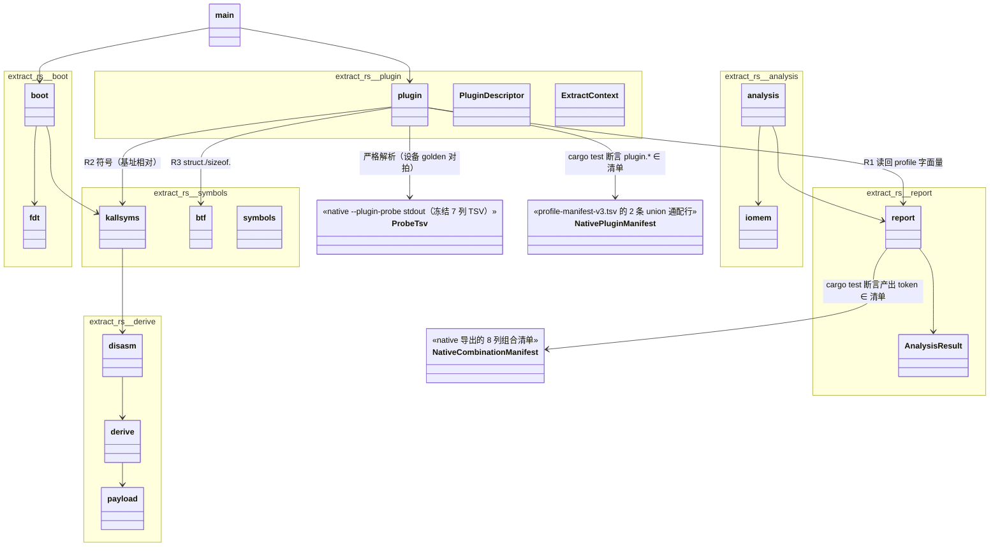

> **插件探针 golden**：`app/src/test/resources/plugin-probe-golden.tsv`（11 行，设备探针 stdout 逐字节）由 native 探针入口产出、由 Kotlin `PluginProbeGoldenTest` 硬断言；它同时是 **extractor P2 的输入契约**——`--plugin-descriptor <probe-stdout.tsv>` 严格解析该 7 列 TSV（§4.3）。写入者仍是 extractor，P1 只校验形状（contract-design §3.14.6/§3.14.7.7）。
>
> 另有同一次导出产出的 `app/src/test/resources/combination-resolve-vectors.tsv`（40 行解析向量，test-only **单副本**、`\s`/`\t`/`\\` 转义、expected 由 native 现算），消费方是 Kotlin `CombinationTokenAgreementTest`，因此不在本 Rust 图内。

## 4. Sequence 图

### 4.1 端到端运行（App 一般执行 → 内核 → handoff）

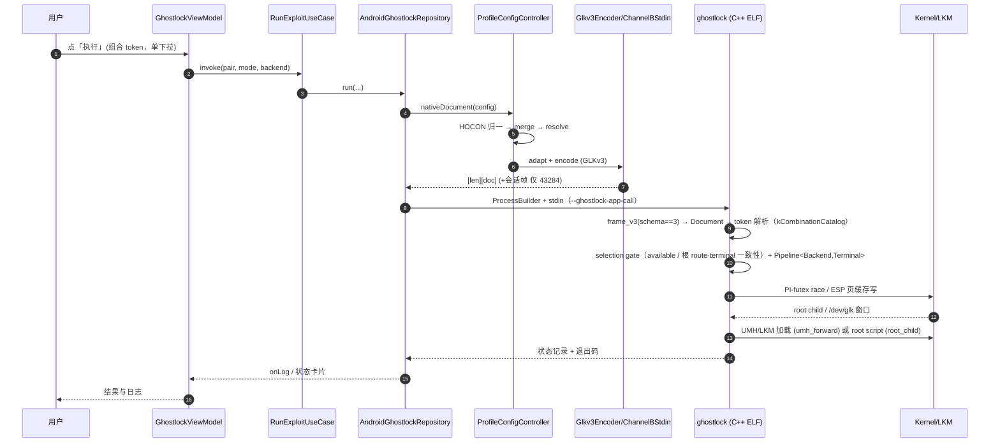

### 4.2 配置解析与导出（assets → wire / 导出 bin）

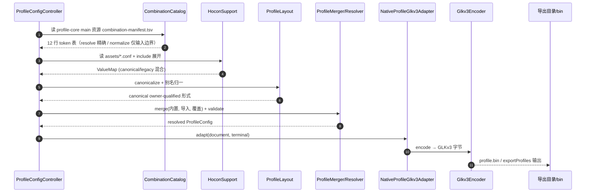

### 4.3 Extractor（boot.img → HOCON profile）

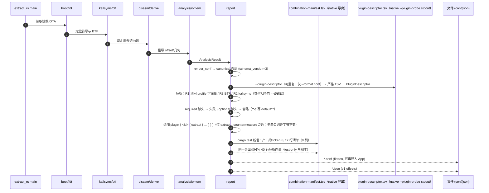

### 4.4 43284 一次运行 + 一个 post_terminal 插件（step 3a 运行时接线）

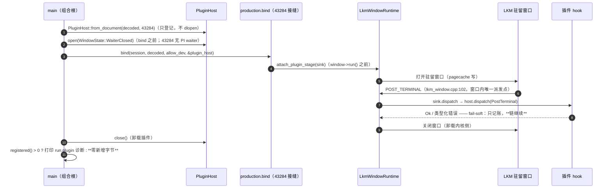

> **一次真实返工（记进图/注）**：最初让窗口直接持有 `PluginHost*` → 5 个既有测试二进制被拖入 host 闭包并链接失败 ⇒ 改为**中性 `PluginStageSink`**（函数指针 + ctx，同 `ChainOps`/`LkmTransport` 惯例），依赖只留在组合接缝（1 条 Makefile 规则），4 条既有规则不动。
> **43499 的 `pre_terminal`（step 3b）未落地**：打开点是 `steps.cpp:484-490`/`:517-521` 的 anchor，**R1：waiter 存活期不得 open**。
## 5. 维护约定

- **一个结构只保留一处权威图**：IPO/状态机/Class/Sequence 都在本文件；其他文档链接本文件，不重复画同一结构。
- 结构变更（新增 backend/terminal/插件/组合 token/新状态）必须同步对应图，并在提交说明里写明更新了哪一张。

## 6. 相关文档

- 格式权威 `../analysis/wire-transport-model.md`；配置流水线 `../analysis/profile-pipeline-flow.md`；组合 token / 维度分解设计 `../analysis/s4-r6b-composition-design.md`（§7 v3）；决策 ADR-0001/0002/0004/**0006**；进度 `../analysis/branch-plan.md`。
- 门禁证据 `../analysis/device-gates/s4-r6b-20261005-pass.md`、`../analysis/device-gates/s4-f4-f3-f5-20261005-pass.md`。
