# 全流程 UML：IPO · 状态机 · Class · Sequence（C++ · Kotlin · Rust）

- 快照：HEAD（`0e9bc50`）——S4-R6b/T5 组合 token 白名单、ADR-0006 terminal 归属、F1 组合维度分解、F3 `RouteKind::None`、F4 token 表导出与跨语言对拍均已落地。
- **本文件是全流程唯一权威图**（IPO / 状态机 / Class / Sequence 四类）；格式细节见 `../analysis/wire-transport-model.md`，配置流水线细节见 `../analysis/profile-pipeline-flow.md`。
- Class 图按**语言原生分组**：C++ = `namespace`，Kotlin = `package`，Rust = `module`。

## 1. IPO（数据级，逐阶段）

| # | 阶段 | IN（类型/字段） | PROCESS（函数/算法） | OUT（类型/字段） | 失败/降级 |
|---|---|---|---|---|---|
| **A1** | Rust 读取镜像 | `boot.img`/OTA zip/URL → `Vec<u8>` | `boot::extract_release`, `fdt::find_fdt_magic`, `arm64_image_size` | raw image + `release` 字符串 | 非 arm64/无 FDT → err |
| **A2** | 符号与类型 | raw image | `kallsyms::decode_names/decode_addresses`, `btf::parse_btf` | 符号表（名→VA）、BTF 结构 | 缺 BTF → 仅 kallsyms |
| **A3** | 反汇编与推导 | 符号表 + 机器码 | `disasm::disassemble_symbol`, `derive::*` | offset/几何（`task_struct`/`cred`/`offset`/route 几何） | 模式不匹配 → 字段缺失 |
| **A4** | 物理布局 | raw image | `iomem::find_kernel_memory_map_entry`, `analysis::*` | `kernel_phys_load/offset`、`delta` | 无 iomem → 缺省 |
| **A5** | 产出 profile | `AnalysisResult` | `report::render_conf`（canonical 布局 + `schema_version = 3`；`--route`/`--steps-path` 决定组合 token）; `render_json`（v1） | `*.conf`（可导入 App）/`*.json` | `cargo test` 断言「生成 ≡ 内置」+「产出的 token ∈ `combination-manifest.tsv`」 |
| **B1** | HOCON 加载 | `assets/kernel_profiles/*.conf` + `index.conf` + 用户导入 | `HoconSupport`（include 展开、`${}` 变量） | `ValueMap`（含 legacy 键） | 未知键 → 报错带点分路径 |
| **B2** | 归一化 | legacy `ValueMap` | `ProfileLayout.canonicalize`（别名表：`selection.steps`/`backend.steps` → 所属 `backend.<id>.steps` 组合 token（`CombinationCatalog.fromLegacySteps`；`normalize` 仅用于输入边界）、`cred/offset` 平台/私有拆分、`meta.*`→`common.*`） | canonical owner-qualified map（steps = 解析后的 canonical token） | 未识别旧键 / 未知 legacy step id → fail-closed |
| **B3** | 合并与校验 | canonical map + 覆盖 + 设备 `uname -r` | `ProfileMerger.resolveMerged` → `ProfileResolver.validateMerged` | `ProfileConfig`（resolved 字段集） | release 不匹配 → 拒绝 |
| **B4** | 建文档 | `ProfileConfig` + `CombinationSpec` + 已启用插件 | `NativeProfileGlkv3Adapter.adapt`（**只发所选 backend 的段 + common + 已启用插件的 `plugin.<id>.*`**；selection 由 `CombinationCatalog` 从 `profile-core/src/main/resources/combination-manifest.tsv` 解析，运行时零 token 字面量；`plugin.<id>.params.*`/`.extract.*` 是 manifest 的 `|` 联合行，具体类型由描述符决定） | GLKv3 `Glkv3Value`（map/sections，`steps` = canonical token，plugin 段仅含 enabled=true） | 缺段 → 该字段不发射；token 未命中 / union 成员未知 → 拒绝 |
| **B5** | 编码 | `Glkv3Value` | `Glkv3Encoder.encode`（最短整数、键 UTF-8 序） | `ByteArray`（根 map，`schema=3`） | 超 1 MiB → 拒绝 |
| **B6** | 分帧 | 文档字节 + (43284) SA 秘密 | `ChannelBStdin.frame` + `SessionSecretFrame.encode` | `[u32be len][doc]`(+仅 43284 `[u32be 84][frame]`) | 43284 缺帧 → 拒绝 |
| **C1** | 判别 | stdin `ByteArray`（仅 `--ghostlock-app-call` / `--load-prebuilt-profile` 两种入口） | `looks_like_glkv3`（首字节 map/fixmap/map16/32） | bool | 非 map → 直接 -1 |
| **C2** | 帧化 | 文档字节 | `frame_v3` + `decode_neutral`（强制 `schema == 3`，owner 前缀白名单） | `profile::Document{release, backend_token, terminal_token, sections[]}`；`ReadResult.storage` 持有缓冲 | `schema != 3`/未知前缀 → -1 |
| **C3** | 选择解析 | Document 根 token + `backend.<id>.steps` | token → `contract::kCombinationCatalog` 行 `CombinationSpec{token, doc, backend, kind, route, path, steps, terminal, available}`（12 行 = **7 可用 + 5 计划**）；`CombinationId{backend, route, path}` 是**分解视图**，`CombinationKind` 仍是 wire 紧凑 id（uint8，枚举值与顺序不变） | `DispatchTarget` + 派生 (route, steps, terminal) | 未知 token（回显）/ 计划项 `available=false` / 缺 `steps` / 根 `route`·`terminal` 与 token 不一致 → 拒绝 |
| **C4** | 绑定 | Document + owner Schema | `SchemaRegistry::bind_all(mode=Production)`（必需性、默认值、`default_used` 诊断）；route 缺省为 `RouteKind::None`（= 4，不进 `kRouteCatalog`），组合要求 route 而文档未给 → 拒绝；`--allow-dev-target` 只在该绑定期放宽 43284 carrier 校验（链内仍拒 dev carrier） | 类型化 View（route 几何、43284 策略、握手参数） | 缺必需 / 类型不符 / route 不一致 / carrier 未过校验 → Rejected |
| **C4b** | 插件校验 | Document `plugin` 段（仅启用插件） | `plugin::validate_plugin_wire`（fail-closed：`enabled` 必须是 true 的 bool、`stage` ∈ 4 个 host token、`module_path` 相对且无 `..`/反斜杠/≤256 B、`module_hash` 64 位小写 hex、动态键经 `plugin_dynamic_key` 匹配、未知字段拒绝、≤16 插件不静默丢弃）；实例化时 `plugin_descriptor_declares` 按 **size 门控**校验（v1 模块无尾部声明 → 拒绝） | `PluginWireEntry[]`（id / stage / module_path / module_hash / param_count / extract_count） | 任一规则失败 → Rejected（错误名由 `plugin_wire_error_name` 给出） |
| **C5** | 后端阶段 | View + `CoreSession` | route：`run_route`→`RouteStatus{code,step,errno,userspace_clean}`；步骤：spray/race/W1/W2/W3 | `StageResult`（ok/failed/degraded） | `DirtyFailure` → 终止（不换 route） |
| **C6** | 终端阶段 | terminal 输入载荷（script / UMH channel） | `RootChildPolicy::run_handoff` 或 `UmhForwardPolicy::run`（`UmhReadyState`: Ready/NotReady/Unavailable） | root child / UMH→LKM 加载 | NotReady → Failed；Unavailable → **Done(降级)** |
| **C6b** | 插件派发（每 backend **仅一个**可用点；task-9 设计，**待落地**） | 43499：终端接管前（`steps.cpp:484-490` / `:517-521`）；43284：LKM 驻留窗口内（`lkm_window.cpp:99-107`） | 同步派发：**43499 = `pre_terminal`**、**43284 = `post_terminal`** | hook 调用结果（fail-soft 记录） | 其余阶段「声明但不可用」（注册期拒绝）；43499 无 `post_terminal`、43284 无 `pre_spawn`/`post_spawn`/`pre_terminal` |
| **C7** | 收尾 | 会话 | 状态记录（`--enable-status-record`）、SELinux 还原、LKM unload | 退出码 + status 记录 | 插件失败 → fail-soft 记录 |
| **D1** | 内核原语 | 进程 syscalls | PI-futex 竞争（waiter 覆盖）／ESP 页缓存写 | `RouteStatus.code=Ok` + `userspace_clean` | 竞争失败 → Retryable |
| **D2** | 提权步骤 | 覆盖后的 cred/task | W1 SELinux permissive → W2 cred/uid0 → W3 seccomp 清除 | `uid=0`、`Enforcing` 可写 | 步骤失败 → Backend failed |
| **D3** | 落地 | root script / helper.ko + 会话秘密 | UMH exec（vendor modprobe）或 root child 执行脚本 → `insmod` | `/dev/glk` 注册、module resident、KernelSU ready | 模块未驻留 → 轮询超时 |
| **D4** | 退出/卸载 | fd/定时器 | 插件窗口 close → LKM unload（`explicit`/`fd-close`/`watchdog`） | 模块卸载、AVB `ok=12 fail=0` | watchdog 60s 兜底 |

> 入口（R2b 后）：`--ghostlock-app-call`（stdin GLKv3，可接会话帧）与 `--load-prebuilt-profile <bin>` 二选一，另有只读 `--probe-cve-2026-43284 <ko>`；运行控制 / 安全 / 可观测开关为 `--force-attack`、`--allow-dev-target`、`--dump-kernel-log <dir>`、`--enable-status-record`（需 app-call）。**选择与策略不得出现在 CLI**：staged 入口已删除，未知参数直接失败。dev 回放构造生产形态文档走同一 app-call 路径。

## 2. 状态机

### 2.1 顶层运行状态机（native `main`）

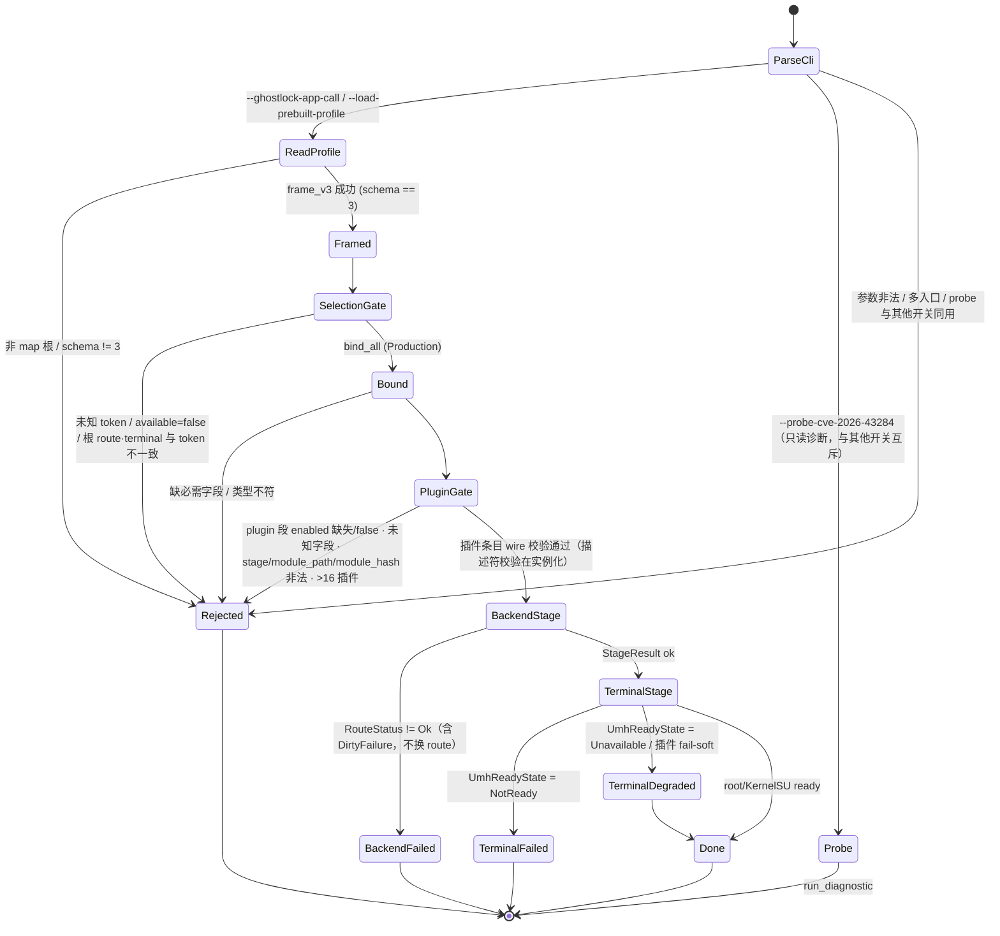

> 选择解析：唯一选择是 `backend.<id>.steps` 的 token；根 `route`/`terminal` 只做一致性校验，不一致即 `Rejected`。`RouteKind::None`（= 4）表示该 backend 无 route 轴（不进 `kRouteCatalog`）；`Auto`（= 0）仅遗留 v1/v2 解码。
>
> 插件默认**关闭**：文档 `plugin` 段里 `enabled` 缺失或为 false 一律 `Rejected`（未启用插件不得出现在 wire）；动态键 `params.*`/`extract.*` 的前缀只认 manifest 显式声明的通配行，无隐式前缀规则。
>
> R2b 后 CLI 只承载**传输 / 运行控制 / 安全 / 可观测**：选择与策略全部来自 GLKv3 文档；staged 入口（`--run-cve-2026-43284`/`--stage`/`--plugin`/`--cve43284-*`/`--allow-vermagic-rewrite`）已删除，dev 回放走 `--ghostlock-app-call` + 同一 Pipeline。`--allow-dev-target` 只放宽**绑定期**的 43284 carrier 校验，链内仍拒 dev carrier（A/B 证据见 `../analysis/device-gates/s4-r2b-20261005-pass.md` §3）。

### 2.2 43499 攻击链状态机

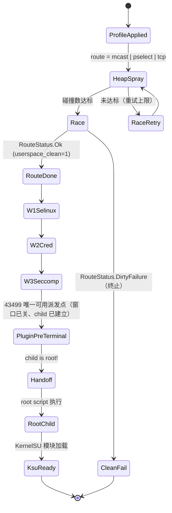

> **43499 只画 `pre_terminal` 一处插件派发**（`backend/cve_2026_43499/steps.cpp:484-490` / `:517-521`，随后移交 rooted child）：`pre_spawn` / `post_spawn` / `post_terminal` **声明但不可用**——race 窗口按**每次写尝试**开关（`steps.cpp:118` 的 `attack_write<M>` 位于 `:100-130` 写循环内），victim/child 就在该写循环里建立（`:480`），不存在「窗口关闭且 child 未建立」的点；root 接管后控制流也不再回宿主。依据：设计 `plugin-runtime-integration-design.md` §12（`ab0561f8`）。

### 2.3 43284 链状态机（含 LKM 窗口）

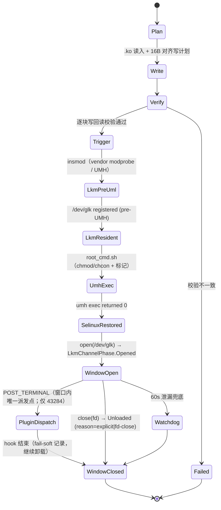

> `pre_spawn` 的触发点**不在 Pipeline 层**：入口 `backend/cve_2026_43499_backend.cpp:111`（`run_setup`）→ `:124/127/130`（`StepSet::run<Route>`，route/race 与 W1/W2/W3 在同一个调用内）→ `:143–158` 才移交 rooted child；`w1()`（`steps.cpp:386`）成功之后、`w2()`（`steps.cpp:157`）之前即 `pre_spawn`。`run<Route>` 模板体内的**确切调用行号待钉死**（native-core step 2 第一件事）。

### 2.4 插件与 LKM 通道状态机

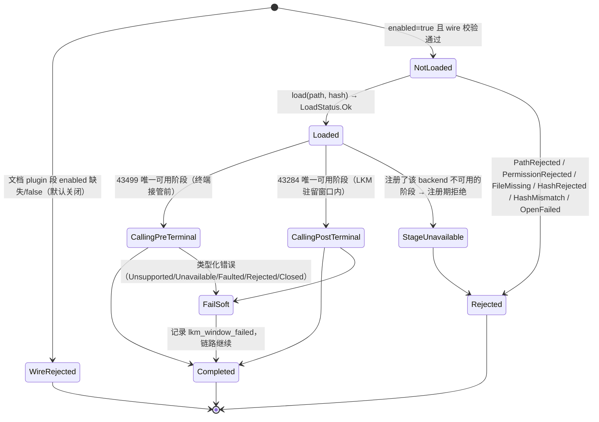

> 四个 stage 词汇（`pre_spawn` / `post_spawn` / `pre_terminal` / `post_terminal`）不变，**可用性按 backend 表达**：43499 = `pre_terminal`（`steps.cpp:484-490`/`:517-521`），43284 = `post_terminal`（`lkm_window.cpp:99-107`，LKM 驻留窗口内）；其余阶段由 host 在 `open()` 时按 backend 校验，**注册期拒绝**（§2.2 注、设计 §12 `ab0561f8`）。

### 2.5 Route 状态机（`RouteResultCode`）

```mermaid
stateDiagram-v2
  [*] --> Prepare
  Prepare --> Skipped : RouteKind::None（无 route 轴，不做几何校验）
  Prepare --> Unsupported : Policy::supported == false
  Prepare --> Execute : 几何齐备
  Execute --> Ok : 原语成功
  Execute --> Retryable : 竞争未命中（可重试）
  Execute --> FallbackSafe : 干净失败（无泄漏）
  Execute --> DirtyFailure : 有副作用/未清理（终止）
  Ok --> Disarm
  Retryable --> Disarm
  FallbackSafe --> Disarm
  DirtyFailure --> [*]
  Disarm --> Destroy
  Destroy --> [*]
  Skipped --> [*] : 直接进入 backend 步骤
  Unsupported --> [*]
```

### 2.6 UMH 就绪探针（`UmhReadyState`）与降级

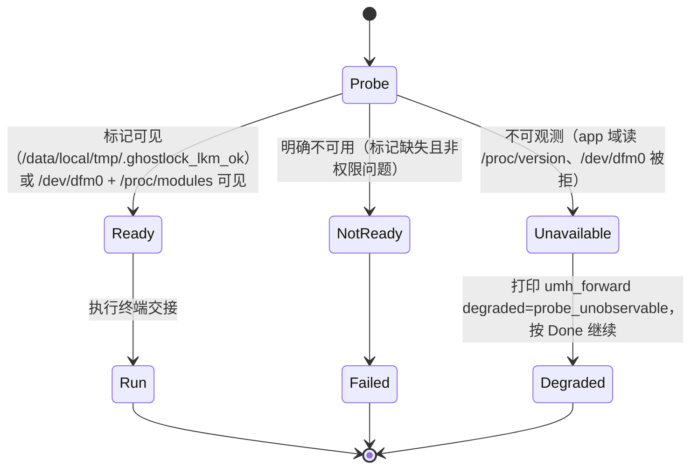

### 2.7 Kotlin 配置/运行状态机

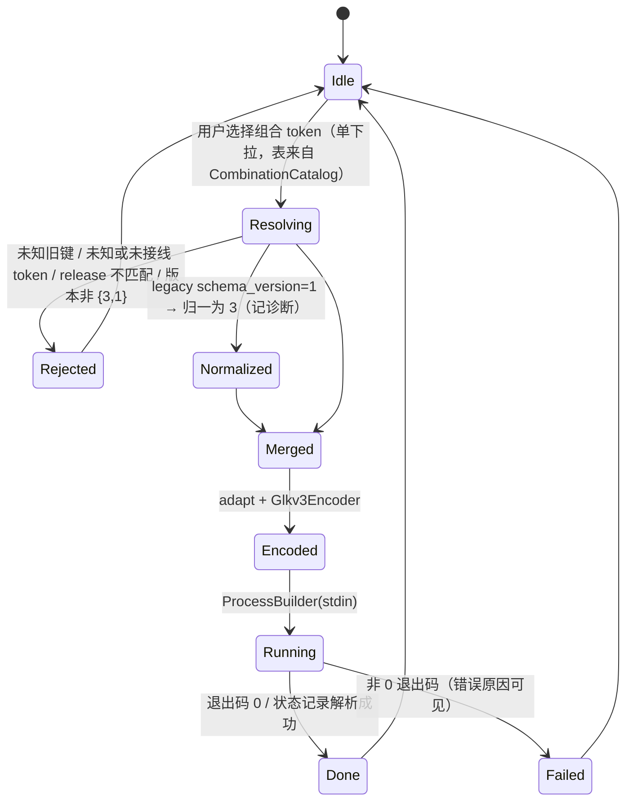

## 3. Class 图

### 3.1 C++（按 `namespace` 分组）

```mermaid
classDiagram
  namespace ghostlock__contract {
    class Document
    class FieldSpec
    class SchemaRegistry
    class CombinationSpec
    class CombinationId
    class CombinationKind
    class PathKind
    class DispatchTarget
    class Capabilities
    class StageResult
  }
  namespace ghostlock__pipeline {
    class Pipeline
    class Orchestrator
  }
  namespace ghostlock__backend__cve_2026_43499 {
    class BackendPolicy
    class RoutePolicy
    class Steps
    class LeakProvider
    class RootChildPolicy
  }
  namespace ghostlock__backend__cve_2026_43284 {
    class BackendTerminal
    class LkmPolicy
    class PageCacheWrite
    class SessionFrame
    class Entry
  }
  namespace ghostlock__terminal {
    class UmhForwardPolicy
    class HandoffProbe
    class RootScript
  }
  namespace ghostlock__plugin {
    class Loader
    class RuntimeRegistry
    class Controller
    class LkmChannel
    class LkmWindowRuntime
    class Schema
    class PluginProfile
    class PluginWireEntry
    class WireValidator
    class DynamicKeyMatcher
    class DescriptorGate
  }
  namespace ghostlock__profile__glkv3 {
    class WireType
    class FieldSpec
  }
  namespace ghostlock__platform {
    class AbiSchema
    class DeviceProbeOps
    class Runtime
  }
  namespace ghostlock__session {
    class CoreSession
  }
  class Document {
    +string release
    +string backend_token
    +string terminal_token
    +Section sections
  }
  class FieldSpec {
    +string section
    +string key
    +WireKind wire
    +bool required
    +DefaultValue default_value
  }
  class CombinationSpec {
    +string token
    +string doc
    +BackendKind backend
    +CombinationKind kind
    +RouteKind route
    +PathKind path
    +StepSetKind steps
    +TerminalKind terminal
    +bool available
  }
  class CombinationId {
    +BackendKind backend
    +RouteKind route
    +PathKind path
  }
  class PathKind {
    <<enumeration>>
    Rootchild
    Shizuku
    Umh
  }
  class Pipeline {
    +target static_assert
    +run(session, input)
  }
  class CoreSession {
    +Capabilities capabilities
    +profile values
  }
  class PluginWireEntry {
    +string id
    +string stage
    +string module_path
    +string module_hash
    +size_t param_count
    +size_t extract_count
  }
  class WireType {
    <<enumeration>>
    UInt
    Int
    Bool
    Str
    Bin
    Array
    Union
  }
  Document --> FieldSpec : binds
  SchemaRegistry --> FieldSpec : owns
  CombinationSpec --> CombinationId : 分解
  CombinationSpec --> CombinationKind : 紧凑 id
  CombinationSpec --> PathKind : path
  CombinationSpec --> DispatchTarget : maps
  DispatchTarget --> Pipeline : selects
  Pipeline --> RootChildPolicy : terminal（backend::cve_2026_43499::terminal）
  Pipeline --> UmhForwardPolicy : terminal
  Pipeline --> Loader : 阶段派发（43499 pre_terminal / 43284 post_terminal）
  Loader --> RuntimeRegistry
  Loader --> LkmChannel
  LkmWindowRuntime --> LkmChannel
  Schema --> FieldSpec : kPluginGlkv3Fields（4 静态 + 2 动态 Union）
  Schema --> PluginProfile : 静态四字段视图
  FieldSpec --> WireType : union 成员来自 kUnionScalarTypes（恰好 4）
  WireValidator --> Schema : 路径/类型唯一权威
  WireValidator --> PluginWireEntry : validate_plugin_wire 产出
  WireValidator --> DynamicKeyMatcher : plugin_dynamic_key
  DescriptorGate --> PluginWireEntry : plugin_descriptor_declares（size 门控）
  Controller --> DescriptorGate : 实例化按描述符校验
  CoreSession --> Document : selection
  DeviceProbeOps --> CoreSession : facts
```

> S4 P1：`ghostlock__plugin` 的 `Schema`（`plugin/schema.hpp`）是 `plugin.<id>.*` 的路径/类型**唯一权威**，`WireValidator`（`plugin/wire.cpp::validate_plugin_wire`）做 fail-closed 文档校验（默认关闭、未知字段拒绝、`PluginWireError` 具名错误），`DescriptorGate`（`plugin_descriptor_declares`）按 **size 门控**校验动态键；动态两行的类型是 `profile::glkv3::WireType::Union`，清单拼写 `uint|int|bool|str`，`kUnionScalarTypes` 恰好 4 个成员。
>
> `RootChildPolicy` 的声明与实现都在 `ghostlock::backend::cve_2026_43499::terminal`（F5 / ADR-0006），`ghostlock__terminal` 只留中性件。`CombinationKind` 是 wire 紧凑 id（uint8，13 值 = Unknown + 12 token，枚举值与顺序不变）；`CombinationId{backend, route, path}` 与 `PathKind{Rootchild=1, Shizuku=2, Umh=3}` 是编译期分解视图，不是 wire 或存储变化。

### 3.2 Kotlin（按 `package` 分组）

```mermaid
classDiagram
  namespace com__ghostlock__app__data__component {
    class CombinationSpec
    class CombinationCatalog
    class BackendKind
    class FrontendKind
  }
  namespace com__ghostlock__app__data__plugin {
    class PluginProbe
    class PluginManifest
    class PluginManifestEntry
    class PluginPaths
    class PluginConfigValidator
    class PluginImportService
    class PluginProbeInvoker
    class PluginStore
    class Sha256
  }
  namespace com__ghostlock__app__data__profile {
    class ProfileLayout
    class NativeProfileDocument
    class NativeProfileGlkv3Adapter
    class Glkv3Encoder
    class Glkv3Decoder
    class ProfileMerger
    class ProfileResolver
    class ChannelBStdin
    class SessionSecretFrame
    class ProfileExporter
  }
  namespace com__ghostlock__app__data {
    class AndroidProfileConfigController
    class UserProfileStore
    class AndroidGhostlockRepository
    class ExecutionModeMapping
  }
  namespace com__ghostlock__app__ui {
    class GhostlockViewModel
    class GhostlockUI
    class CombinationPresentation
    class PluginPresentation
    class PluginSettingsUI
  }
  namespace com__ghostlock__app__shizuku {
    class GhostlockUserService
  }
  namespace com__ghostlock__app__domain__usecase {
    class RunExploitUseCase
  }
  AndroidProfileConfigController --> ProfileLayout : canonicalize
  AndroidProfileConfigController --> ProfileMerger
  AndroidProfileConfigController --> ProfileResolver
  AndroidProfileConfigController --> NativeProfileDocument
  AndroidProfileConfigController --> NativeProfileGlkv3Adapter
  NativeProfileGlkv3Adapter --> Glkv3Encoder
  AndroidGhostlockRepository --> ChannelBStdin
  ChannelBStdin --> SessionSecretFrame
  GhostlockUserService --> ChannelBStdin
  GhostlockViewModel --> RunExploitUseCase
  RunExploitUseCase --> AndroidGhostlockRepository
  RunExploitUseCase --> ExecutionModeMapping
  ExecutionModeMapping --> CombinationCatalog : 派生 / 回映射
  AndroidGhostlockRepository --> CombinationCatalog : setCombination / 恢复校验
  AndroidProfileConfigController --> CombinationCatalog : token 归一（normalize → resolve）
  GhostlockUI --> CombinationPresentation : 单下拉（计划项置灰）
  CombinationPresentation --> CombinationSpec : 纯投影（doc 摘要 / planned）
  GhostlockUI --> CombinationCatalog : recommended / defaultSpec
  CombinationCatalog --> CombinationSpec : 读 main 资源 combination-manifest.tsv
  ProfileExporter --> NativeProfileGlkv3Adapter
  UserProfileStore --> ProfileLayout
  PluginImportService --> PluginProbeInvoker : 探针调用（--plugin-probe）
  PluginImportService --> PluginProbe : 解析 stdout（PluginProbe.parse）
  PluginImportService --> PluginStore : 原子安装 + 注册表
  PluginImportService --> Sha256 : 导入前本地哈希
  PluginImportService --> PluginManifestEntry : 注册表行
  PluginConfigValidator --> PluginManifestEntry : 只校验已导入插件
  PluginPresentation --> PluginConfigValidator : 类型 / 必填 / 默认值
  PluginPresentation --> PluginManifestEntry
  PluginSettingsUI --> PluginPresentation : 渲染高级设置（只读行）
  GhostlockUI --> PluginSettingsUI : 插件设置页
  GhostlockViewModel --> PluginPresentation : pluginRows
  GhostlockViewModel --> PluginImportService : 选择/导入
  AndroidGhostlockRepository --> PluginImportService
  AndroidGhostlockRepository --> PluginStore : no-backup 存储根
```

> S4 P1 插件（`com.ghostlock.app.data.plugin` 在 profile-core 与 app 两个模块同名并存）：描述符解析 `PluginProbe`、注册表 `PluginManifest(Entry)`、路径/根 `PluginPaths`、校验 `PluginConfigValidator`、导入 `PluginImportService`（探针 + 原子安装 + 清单）、UI 投影 `PluginPresentation` / `PluginSettingsUI`。**插件配置无资产**：`plugin.conf` 已取消（2026-10-05 裁决），走既有覆盖存储；`ProfileLayout` 白名单接受 `plugin.<id>.*` 并 fail-closed。
>
> Kotlin 侧**没有** `CombinationKind`：白名单以 `CombinationSpec` 行表示，由 `CombinationCatalog` 从 native 导出的 `combination-manifest.tsv` 解析（两份：`app/src/test/resources/` 对拍 + `profile-core/src/main/resources/` 运行时）。`route = null` ⇔ 清单 `route` 列 `none` ⇔ 无 route 轴（native `RouteKind::None`）；下拉摘要取清单 `doc` 列（`com.ghostlock.app.ui.CombinationPresentation` 的 `combinationSummary` / `combinationOptions`）。

### 3.3 Rust（按 `module` 分组）

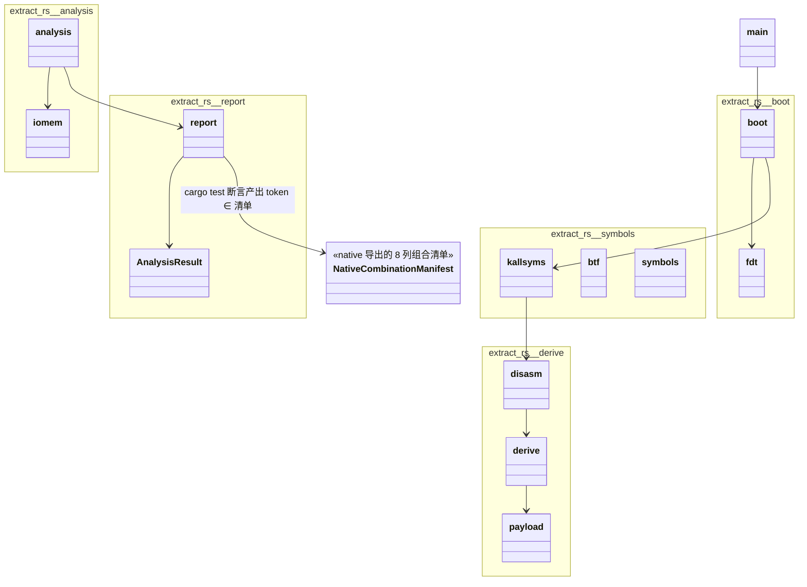

> **插件探针 golden**：`app/src/test/resources/plugin-probe-golden.tsv`（11 行，设备探针 stdout 逐字节）由 native 探针入口产出、由 Kotlin `PluginProbeGoldenTest` 硬断言；与 Rust extractor 无关（extractor 投影 = P2，见 §3.14.6/§3.14.7.7）。
>
> 另有同一次导出产出的 `app/src/test/resources/combination-resolve-vectors.tsv`（40 行解析向量，test-only **单副本**、`\s`/`\t`/`\\` 转义、expected 由 native 现算），消费方是 Kotlin `CombinationTokenAgreementTest`，因此不在本 Rust 图内。

## 4. Sequence 图

### 4.1 端到端运行（App 一般执行 → 内核 → handoff）

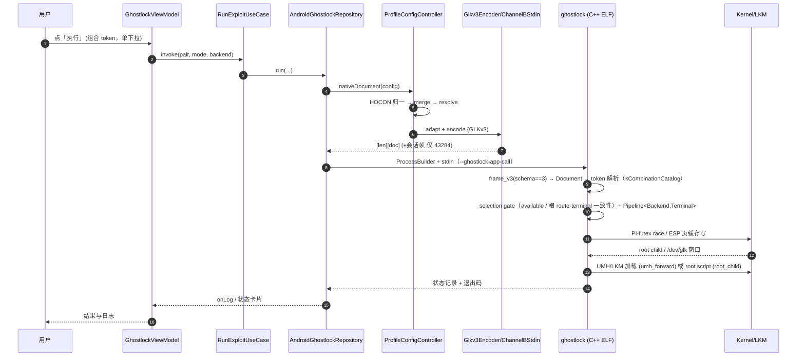

### 4.2 配置解析与导出（assets → wire / 导出 bin）

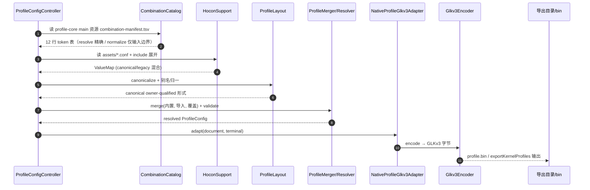

### 4.3 Extractor（boot.img → HOCON profile）

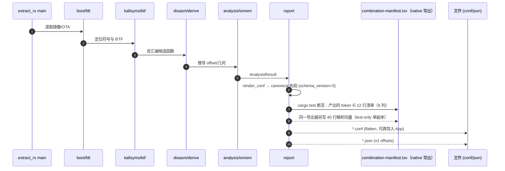

## 5. 维护约定

- **一个结构只保留一处权威图**：IPO/状态机/Class/Sequence 都在本文件；其他文档链接本文件，不重复画同一结构。
- 结构变更（新增 backend/terminal/插件/组合 token/新状态）必须同步对应图，并在提交说明里写明更新了哪一张。

## 6. 相关文档

- 格式权威 `../analysis/wire-transport-model.md`；配置流水线 `../analysis/profile-pipeline-flow.md`；组合 token / 维度分解设计 `../analysis/s4-r6b-composition-design.md`（§7 v3）；决策 ADR-0001/0002/0004/**0006**；进度 `../analysis/branch-plan.md`。
- 门禁证据 `../analysis/device-gates/s4-r6b-20261005-pass.md`、`../analysis/device-gates/s4-f4-f3-f5-20261005-pass.md`。
