# 软件工程教程 · 整理去重版

本版以共享文件夹中的 11 份课件为来源，按知识主题合并整理。重复讲解、重复段落和重复图示只保留一处；删除逐页截图、章节封面和翻页信息，保留不同版本新增的内容、案例、表格及独立图示。

课件包含 2015、2016、2018 年等版本，文中的标准、工具名称、经验数据与教学观点沿用原课件，未作为最新资料重新核验。

## 目录

- [1. 软件与软件工程基础](#chapter-1)
- [2. 软件生命周期与开发模型](#chapter-2)
- [3. 可行性研究、立项与合同](#chapter-3)
- [4. 需求分析与系统建模](#chapter-4)
- [5. 软件策划与项目计划](#chapter-5)
- [6. 软件设计](#chapter-6)
- [7. 软件实现](#chapter-7)
- [8. 软件测试与调试](#chapter-8)

<a id="chapter-1"></a>

## 1. 软件与软件工程基础

### 1.1 软件的组成、程序与文档

软件由程序、数据与文档共同构成。程序实现处理逻辑，数据包括初始化、测试、研发、运行和维护所需的信息，文档说明需求、设计、使用方法与管理过程。课件还讨论了“软件＝知识＋程序＋数据＋文档”的观点：支持者强调软件承载知识，反对者认为知识已体现在后三者之中。

不同开发范型对程序的描述有所不同：

| 范型 | 程序的组成 |
| --- | --- |
| 面向过程 | 算法＋数据结构 |
| 面向对象 | 对象＋消息 |
| 面向数据 | 数据库表＋表上的操作，如存储过程、触发器和视图 |
| 面向构件 | 构件＋构架 |

**文档分类与一致性**

开发文档用于指导开发和维护，管理文档用于支持项目管理与决策。文档应与程序保持一致，需求、设计、实现之间应能逐层追踪。

开发成果的对应链条为：软件合同 → 用户需求报告 → 需求规格说明书 → 概要设计说明书 → 详细设计说明书 → 源程序 → 目标程序。管理文档则按需求、策划、设计、实现、测试、维护和过程改进的顺序形成，记录进度及其变更、软件变更、决策和职责。

产品交付文档包括培训手册、参考手册、用户指南、软件支持手册、产品说明与宣传资料。

**课件中的历史脉络**

| 阶段 | 软件概念与管理观念 |
| --- | --- |
| 20 世纪 50 年代 | 主要将软件理解为程序 |
| 20 世纪 60 年代 | 将开发文档纳入软件组成 |
| 20 世纪 70 年代 | 进一步纳入数据，并关注软件管理 |
| 20 世纪 80 年代 | 强调软件管理是过程管理 |
| 1991 年的 CMM 1.0 | 将开发和管理成果统称为软件工作产品 |
| 课件介绍的 UML 术语 | 将技术与管理成果统称为制品（Artifact） |

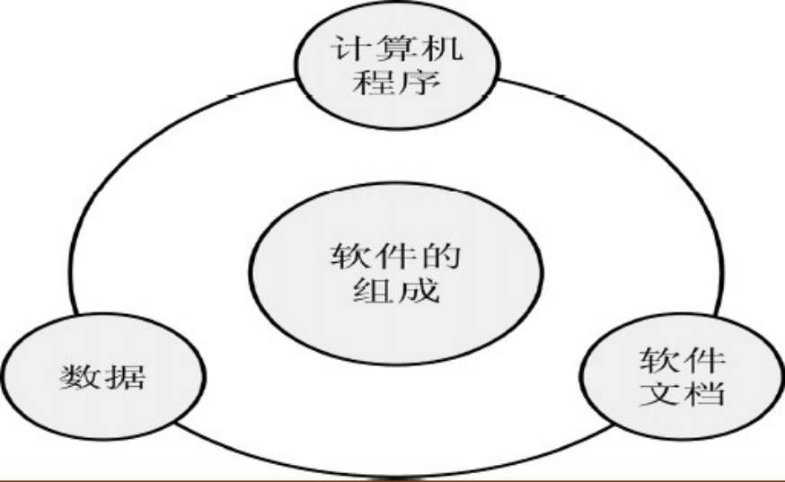

### 1.2 软件演化

第一代:程序设计阶段。 1946 年到 60 年代初,其主要特征是程序生产方式为个体手工方式。

第二代:程序系统阶段。 60 年代初到 70 年代初,软件工程学科诞生。软件的开发方式由个体生产发展到了小组生产,软件的开发与维护费用以惊人的速度增加,维护困难,导致软件危机。

第三代:传统软件工程阶段。 20 世纪 70 年代中期至80 年代中期,软件工程师把工程化的思想加入到软件的开发过程中,用工程化的原则、方法和标准来开发和维护软件。

第四代:面向对象阶段。 20 世纪 80 年代中期至今,面向对象的方法学受到了人们的重视,促进了软件业的飞速发展,软件产业在世界经济中已经占有举足轻重的地位。

**数量越来越多**

**规模越来越大**

**需求越来越广**

**成本越来越高**

### 1.3 软件特点与质量属性

(1)硬件是有形的设备,而软件不像硬件那样具有明显的可见性。人们可以把软件记录在介质上,但是却无法直观地观察到它的形态,而必须通过在计算机上实际地运行才能了解它的功能、性能及其他特性。(软件是设计开发的,而不是传统意义上生产制造的)

(2)软件开发不同于传统意义上的硬件制造,它更多地渗透了人类的智能活动,是人类智力劳动的产物。从软件的设计、实现到测试以及软件开发项目的管理等,人类缜密的逻辑思维、技术水平都起了决定性的作用。

(3)在软件的运行和使用期间,它不会产生像硬件那样的磨损和老化现象,然而却存在着缺陷维护和技术更新的问题。软件维护和硬件维修有着本质的区别,软件维护远远要比更换一个物理配件复杂。

(4)软件的开发和运行必须依附于特定的计算机系统环境。它不像有些设备一样,能够独立地工作,而是受到了物理硬件、网络配置、支撑软件等因素的制约。由此引发了软件的可移植性问题。

(5)软件具有可复用性。它可以很容易地被大量复制,一旦开发出来便可以有多个拷贝,而不像硬件产品那样必须经过完整的生产周期才能得到新产品。

**遗留软件**

软件的特点:

(1)软件固有的特性

**复杂性**

**抽象性**

**依赖性**

(2)软件生产特性

**软件开发特性**

**软件产品形式的特性**

软件维护特性 (纠错性、完善性和适应性)软件使用特性

(1)可维护性

软件必须能够不断进化以满足客户的需求变化,这是软件产品最根本的特性,因为工作环境是不断变化的,软件也必然要跟着变化

(2)可依赖性和安全性

软件可依赖性还包括一些特性:可靠性、保密性、安全性。可靠的软件在系统失败的情况下,也不会导致物理性损害和经济损失。有恶意的人员不能访问或破坏系统

(3)有效性

软件不要浪费内存和处理器等系统资源,因而有效性应包括响应时间、处理时间和内存利用率等方面

(4)可用性

软件必须简单易用,容易被用户接受。这就意味着,它必须是容易理解的、易用的,并且和其他系统是兼容的

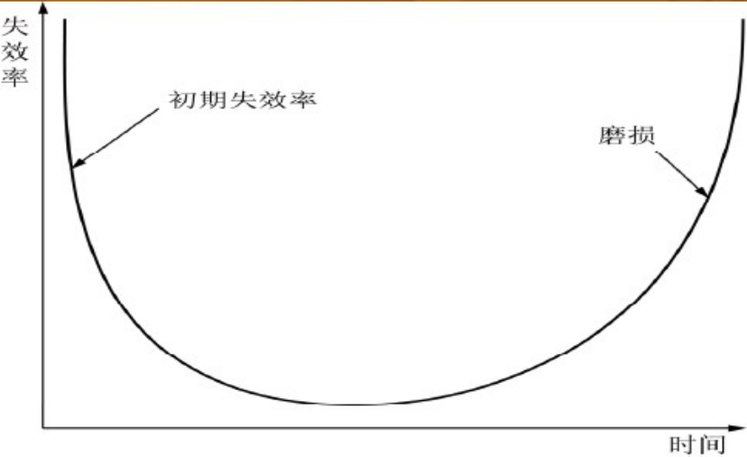

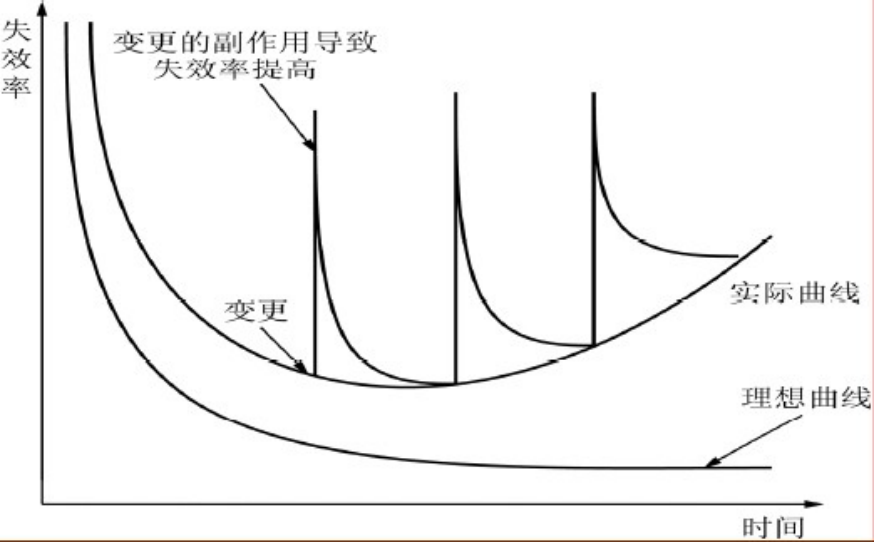

### 1.4 软件分类与应用

按功能分:

(1)系统软件;(2) 支撑软件; (3) 应用软件。

(1)操作系统是最典型的系统软件。

(2)文本编辑器、数据库系统、编译程序、绘图程序等是典型的支撑软件。

(3)地理信息系统软件、航空售票软件、教务系统软件等是典型的应用软件。

按规模分:

(1)微型软件;(2)小型软件;(3)中型软件;(4)大型软件;(5)超大型软件。

(1)一般情况下,微型软件只需要一名开发人员,在 4周以内完成开发,并且代码量不超过 500 行。这类软件一般仅供个人专用,没有严格的分析、设计和测试资料。

(2)小型软件开发周期可以持续到半年,代码量一般控制在5000行以内。这类软件通常没有预留与其他软件的接口,但是需要遵循一定的标准,附有正规的文档资料。

(3)中型软件的开发人员控制在10人以内,要求在2年以内开发5000到50000行代码。这种软件的开发不仅需要完整的计划、文档及审查,还需要开发人员之间,开发人员和用户之间的交流与合作。

(4)大型软件是 10 到100 名开发人员在 1到3年的时间内开发的,具有 50000 到100000 行代码的软件产品。在这种规模的软件开发中,统一的标准、严格的审查制度及有效的项目管理都是必须的。

(5)超大型软件往往涉及上百名甚至上千名成员以上的开发团队,开发周期可以持续到 3年以上,甚至 5年。这种大规模的软件项目通常被划分为若干个小的子项目,由不同的团队开发。

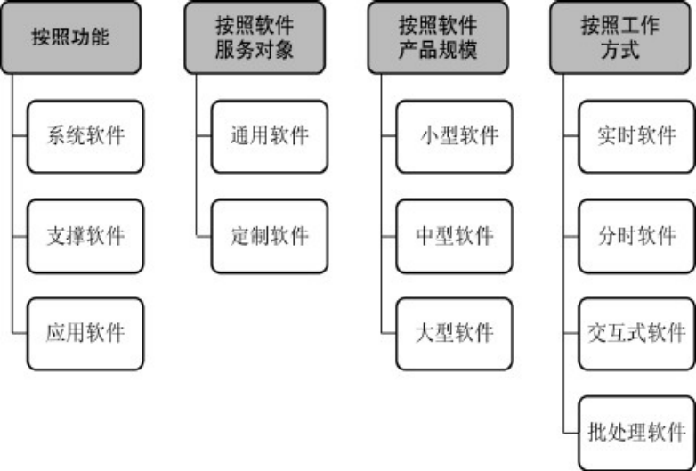

实时系统: 空中交通控制系统嵌入式系统: 数码相机, GPS,手机数据处理系统: 电话帐单,退休金信息系统: 网站,数字图书传感系统: 气象数据系统软件: 操作系统,编译器通信软件: 路由器,移动电话办公系统: 文字处理,视频会议科学计算软件: 仿真模拟,天气预报图形软件: 电影制作, CAD 设计

### 1.5 软件危机、失效原因与案例

软件工程来源于软件危机,即先有软件危机,后有软件工程。

二十世纪六十年代中期,在美国就出现了软件危机(Software Crisis),这种危机表现在研发大型软件时,软件开发的成本增大、进度延期、维护困难和质量得不到保障。

所谓软件危机,就是在软件开发和维护过程中所遇到一系列难以控制的问题。

定义:软件危机就是软件开发过程中存在的一系列严重问题的总称。

1968年北大西洋公约组织(NATO)的计算机科学家在联邦德国召开的国际学术会议上第一次提出了“软件危机”(Software Crisis) 这个名词。

软件危机包括两方面的问题:

(1)如何开发软件

(2)怎样满足对软件日益增长的需求

软件人员编制 1000 行程序,产生错误 20-50 个。

美国航天飞机开发软件的代价,软件平均一行程序花费 1000 美元。

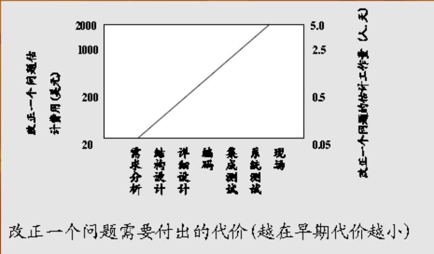

(1)软件独有的特点给开发和维护带来困难

(2)软件人员的错误认识

(3)软件生产技术进步缓慢

(4)软件维护成本和难度急剧增加

(5)软件开发工具自动化程度低

(6)没有一套合适的理论、方法和技术

(7)没有完善的质量保证体系

(8)没有重视文档资料

(1)受医用线性加速器的过度辐射,造成 6人严重烧伤或死亡。(软件包错误)

(2)火星气候轨道航天器撞到了火星的表面。(测试不充分,量纲转换错误)

(3)几架 “黑鹰 ”直升机撞毁,多人罹难。(无线信号与机载计算机系统相互干扰)

(4)称作 CONFIRM 的旅游预订系统在经过1.25 亿美元的投资后流产(1987-1992)。(软件工程运用不当)

(5) F22 战机的一个软件故障(边界值测试的漏洞)。(全球定位系统失灵,电脑系统崩溃)

(6)2007 年10月10日13时28分北京机场信息系统瘫痪。(信息系统安全)

(7)2008 年北京奥运会售票系统(2007年10月30日上午11点)瘫痪。

(8)AT&T 电话和通信1990年1月15日下午的瘫痪(制造交换机的 DSC 公司对软件的一次修改造成的,没有测试修改的源代码)

(9)一位美国技师在安装一个新的区域码软件时,不经意地关闭了该区域的 911 系统。(病人死亡)

(10)1996年6月4日阿丽亚娜(Ariane)5型火箭爆炸。

(校准系统没有得到充分测试)

1961-1964年,IBM OS/360 系统耗资超过 5亿美元,用工 5000人-年,当投入运行仅一个月便发现了 2000 个以上的错误。该系统负责人 F.D.Brooks 描述过: “就象一头巨兽在泥潭中作垂死挣扎,挣扎的越猛,下陷的便越快 ”。

1981 年10 月美国航天飞机(Colombia)首次发射前20 分钟因突然发现软件错误而导致发射推迟。

ARIANE 5 火箭

– 1985-1996 年6 月,耗资 70 亿美元,发射 37 秒后爆炸– 发射失败的原因在于软件的错误软件错误– 程序中试图将 64 位浮点数转换成 16 位整数时产生溢出– 缺少错误处理程序对数据溢出进行管理严格地遵守软件确认过程可以避免这种错误

**爱国者导弹**

– 曾在海湾战争期间对抗伊拉克飞毛腿导弹– 1991 年2 月,一次对抗失利中 28 名美国士兵丧生– 问题的症结在于导弹软件包含一个累加计时误差

Therac25 放射医疗仪事故

– 1986 年由于软件错误导致放射过量, 2 人死亡– 溢出错误是导致问题的主要原因之一千年虫问题– 迫于计算机存储空间的限制,程序员将日期缩减为 2位数– 世界各地更换或升级 2000 年问题软件的花费超过数亿美元其他– 电子邮件的病毒– 拒绝访问等网络攻击– 网络事务的安全问题

1. 技术措施

使用更好的软件开发技术、开发方法和开发工具

2. 组织管理措施

(1)创造良好的组织、严密的管理与协调工作的机制。

软件开发不是某种个体劳动的神秘技巧,而应该是一种组织良好、管理严密、各类人员协同配合、共同完成的工程项目。

(2)摆脱软件危机的主要出路是,按工程化的原则和方法组织软件的开发工作。

(3)强调文档的重要性。 “口说无凭,立字为据! !”是解决软件危机的格言。

(1)软件复杂度;

(2)非线性(多线程)软件;

(3)对意外的输入或条件估计不足;

(4)与外设接口动作异常;

(5)硬件或操作系统与软件不兼容;

(6)管理不善;

(7)测试不充分;

(8)粗心大意;

(9)想走捷径;

(10)不向管理部门通报问题;

(11)风险分析不充分;

(12)数据输入错误;

(13)错误的输出解释;

(14)对软件过于自信;

(15)缺乏生产高质量软件的市场或法律压力。

切记:考虑的潜在软件失效原因越多,系统就越不容易出现失效。

错误 1:没有软件开发的历史数据

错误 2:不重视使用软件费用估值工具软件和计划工具错误 3:忽视用户的需求的变动错误 4:忽视监督项目的进度错误 5:忽视设计复查和代码复查

### 1.6 软件工程的定义、层次与范型

软件工程把系统化、规范化、可度量的方法应用于软件的开发、运行、维护与演化。它结合计算机科学、数学和管理知识，目标是在约定的时间与预算内交付满足用户需求的软件。

其核心是过程、方法和工具：过程组织工作并定义控制点，方法指导分析与构造，工具支持具体活动；质量管理贯穿其中。研究范围包括需求、设计、构造、测试、维护、配置管理、项目管理、过程改进和质量保证。

两种主要范型是：

- **结构化范型**：面向行为或数据，贯穿结构化分析、设计、编程、测试和维护。
- **面向对象范型**：围绕对象组织系统，强调对象的属性、行为及相互联系。

工程化思想同时关注开发方法和工程管理。具体目标、活动和基本原理分别见后续小节。

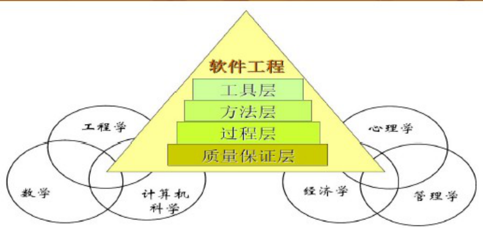

### 1.7 工程目标、基本活动与研究内容

**开发活动**

**软件生命周期模型**

项目管理活动项目的范围(要做的内容)进度(要花费的时间)成本(要耗费的资源)过程改进活动关注质量软件开发的最佳实践

软件开发成本较低软件功能能够满足用户的需求软件性能较好软件可靠性高软件易于使用、维护和移植能按时完成开发任务,并及时交付使用

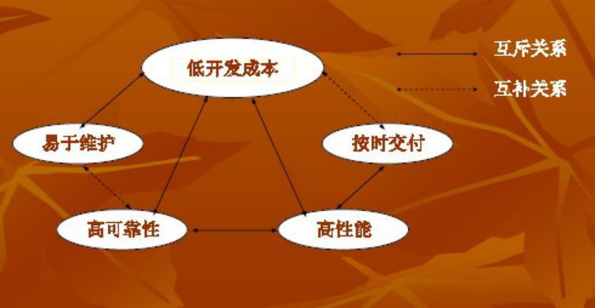

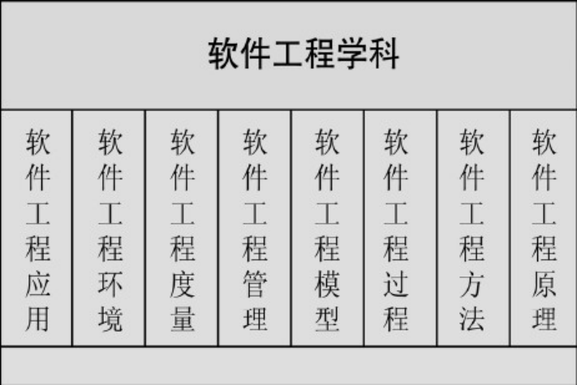

现代软件工程研究的内容,某专家概括为:

(1). 软件开发模型,如:瀑布模型、增量模型、原型模型、螺旋模型、迭代模型等。

(2). 软件开发方法,如:面向过程的方法、面向数据的方法、面向对象的方法 (包括面向业务基础平台的方法、面向工作流方法、面向主体的方法、面向方面的方法、面向代理的方法等等),以及形式化方法。

(3). 软件支持过程,如: CASE 工具 Rose 、北大青鸟系统、Power Designer 、ERWin,以及配置管理工具等。

(4). 软件管理过程,如: ISO9000 、CMM/CMMI 、软件企业文化 (微软企业文件、敏捷文化现象、 IBM 企业文化)。

### 1.8 基本原理与二八定律

软件工程专家B.W.BOEHM 提出软件工程的七条原理:

(1). 用分阶段的生命周期计划,严格管理软件开发。

(2). 坚持进行阶段评审。

(3). 实行严格的产品版本控制。

(4). 采用现代程序设计技术。

(5). 结果应能清楚地审查。文档要有严格要求。

(6). 开发小组的成员要少而精。

(7). 要不断地改进软件工程实践的经验和技术。

上述七条原理,虽然是在面向过程的程序设计时代(结构化时代)提出来的,但是,直到今天,在面向元数据和面向对象的程序设计新时代,它仍然有效。

根据“与时俱进”的原则,还有一条基本原理在软件的开发和管理中特别重要,需要补充进去,作为软件工程的第八条基本原理。

(8)二八定律。对软件项目进度和工作量的估计:一般人主观上认为已经完成了80%,但实际上只完成了20%;对程序中存在问题的估计:80%的问题存在于20%的程序之中;对模块功能的估计:

20%的模块,实现了80%的功能;对人力资源的估计:20%的人,解决了软件中80%的问题;对投入资金的估计:企业信息系统中80%的问题,可以用20%的资金来解决。

研究二八定律的现实意义,在于指导软件开发计划的制订与执行。

如果事先掌握了二八定律,就能自觉地用二八定律去制订、跟踪与执行软件开发计划。

也就是说,计划中要用开始的20%时间,去完成80%的开发进度;剩下20%的进度,要留下80%的时间去完成。只有这样,项目的开发计划与项目的开发进度才能吻合。

### 1.9 软件工程的作用与团队实践

1982年,软件工程的创始人、美藉华人叶祖尧博士,带着自己开创的“软件工程学”理论来到中国,成为当时中国政府计算机领导小组的顾问。

1984年,国家科委在北京召开“软件工程”大会。会议其间,国防科技大学陈火旺院士与孟庆余教授,宴请了美国软件工程专家叶祖尧博士。席间,时任美国马里兰大学计算机系主任的叶祖尧博士说:“软件工程,只有你们长沙(国防科技大学)并行机的研究搞的最好!”巨型机银河机系列与天河机系列的历史证明:叶祖尧的话是对的。

从软件项目团队来讲,解决在规定的时间内,按照规定的成本,完成预期质量目标 (软件的功能、性能和接口达到需求报告标准)的软件。

从软件企业本身来讲,解决持续地规范软件开发过程和软件管理过程,不断地优化软件组织的个人素质和集体素质,从而逐渐增强软件企业的市场竞争实力。

从软件发展进程来讲,克服软件危机,控制软件进度,节约开发成本,提高软件质量。

从院校来讲,以前它只是作为一门课或一本书。现在它成为一个一级学科,一个体系,一个计算机学位,即软件工程硕士学位和软件工程博士学位。

在选择开发工具上,软件工程的基本观点是:工具不是越新越好,而是你越熟悉越好;

在风险评估上,软件工程的基本观点是:任何项目组都存在技术风险和技能风险;

在项目策划上,软件工程的基本观点是:需求分析在前,项目策划在后;

在项目开发进度上,软件工程的基本观点是:宁愿慢些,也要保证软件的质量;

在项目质量上,软件工程的基本观点是:质量蕴涵于开发过程之中,而不是过程之后;

在项目人员上,软件工程的基本观点是:项目组在中途靠增加开发人员来提高开发速度是无效的;

在项目经理的职责上,软件工程的基本观点是: 80% 的时间是写文档, 20% 的时间是内部勾通;

软件工程是软件行业的一门管理科学,也是系统分析员和项目经理以上人员必备的一种领导艺术,为了将我国的软件产业搞上去,使软件产业成为国民经济的支柱产业,使中国早日成为一个软件大国与软件强国,对于软件工程的作用,在软件界怎么强调也不过分。

为了说明软件工程的作用,先来看一个例子。

【例】20世纪90年代初,有两个软件团队,一个较大(10多人),一个较小(6人),都在开发财务系统。

烟台的较大的那个团队,工作不规范,没有文档,没有评审,也没有团队协作精神,结果开发出来的产品可维护性差,没有打开市场,没有产生经济效益和社会效益,致使产品与团队最后同归于尽。

北京的较小的那个团队,同舟共济,工作规范,有正规文档,有阶段评审,分工明确:

一人负责原始凭证和输出报表的收集、归类和整理,这实际上是做需求分析;一人负责科目和数据字典(代码表),这实际上是做信息的标准化与规范化;一人负责记账凭证的录入和修改,这实际上是做数据库的设计和加载工作;一人负责日记账、明细账和总账之间的平衡与对账,这实际上是做数据处理;一人负责统计、报表和查询,这实际上是做数据输出工作;一人负责总体设计和项目管理,这就是项目经理的工作。

较小的那个团队,后来发展成为巨大的用友软件公司。

忽视软件工程过程中的最初阶段往往导致以下昂贵的代价:

(1)不得不重新构造代码;

(2)由于不良的代码结构造成昂贵的维护代价;

(3)产生出含有错误或不可靠的代码;

(4)由于误解而不得不重写代码;

(5)很难集成系统中各独立成分;

(6)项目管理困难;

(7)超出预算和工期。

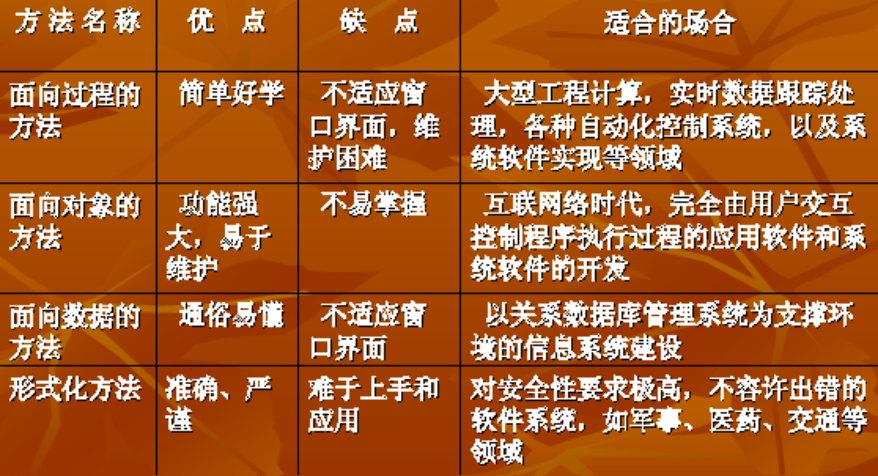

### 1.10 职业道德与行为准则

(1)保密

(2)工作能力

(3)知识产权

(4)计算机滥用

(ACM/IEEE-CS联合制定以规范软件工程行业的职业道德和职业行为)

(1)公众感

(2)客户和雇主

(3)产品

(4)判断力

(5)管理

(6)职业感

(7)同事

(8)自己

<a id="chapter-2"></a>

## 2. 软件生命周期与开发模型

### 2.1 支持过程、管理过程与生命周期

1. 软件过程

【定义】软件工程中的过程,是指软件生命周期(Life Cycle)中的时间序列。

软件过程作为一个时间序列,它自然有起始点和终止点。

可以将一个软件的生命周期划分为市场调研、立项、需求分析、策划、概要设计、详细设计、编程、单元测试、集成测试、运行、维护、退役这几个过程,前一过程的终止点就是后一过程的起始点。过程与阶段(Phase)有关,阶段与里程碑(Milestone)有关。某些重要里程碑上的文档(通过评审和审计之后)又称为基线(Baseline)。

软件工程的支持过程,由支持软件生命周期各个阶段的生产工具所组成。

这些生产工具有需求分析工具、概要设计工具、详细设计工具、编程工具、测试工具、维护工具,工具,软件开发环境,软件工程环境。

2. CASE工具

CASE是一组工具和方法的集合,一般提供给个人使用,可以辅助软件开发生命周期各阶段进行软件开发,在软件开发和/或维护过程中提供计算机辅助支持。

CASE工具主要包括:画图工具,报告生成工具,数据词典、数据库管理系统和规格说明检查工具,代码生成工具和文档资料生成工具等。

目前 CASE 的标准是 UML,最常用的 CASE 工具是 Rational Rose、Sybase PowerDesigner、Microsoft Visio、Microsoft Project、Enterprise Architect 等。这些工具集成在统一的CASE环境中,就可以通过一个公共接口,实现工具之间数据的可传递性,连接系统开发和维护过程中各个步骤,最后,在统一的软、硬件平台上实现系统的全部开发工作。

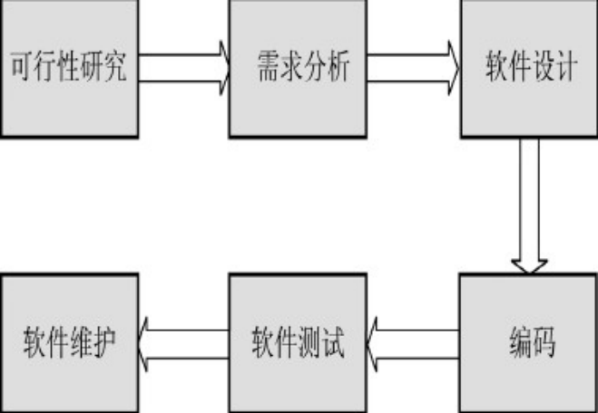

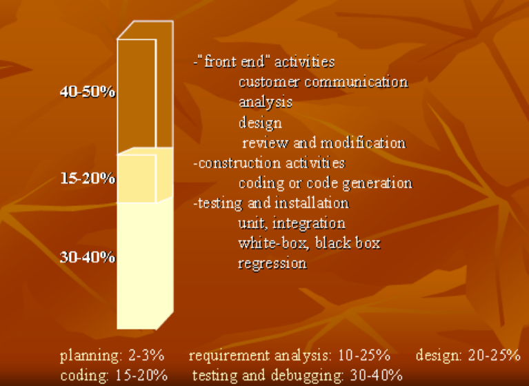

管理过程和支持过程又称为 “软件过程工程 ”。

软件中的过程,分为 “基本过程、支持过程、组织过程 ”三种,基本过程是需求、设计、实现、测试、验收过程;支持过程是支持过程开发和过程管理的各种 CASE 工具;组织过程是建立的有关小组,如软件工程组、质量保证组、测试组、文档组。

软件工程中主要存在 3类过程管理模型:

(1). ISO9000 质量管理和质量保证体系

(2). CMM 过程能力成熟度模型

(3). 企业文化 (微软企业文化、 敏捷文化现象、IBM企业文化等)

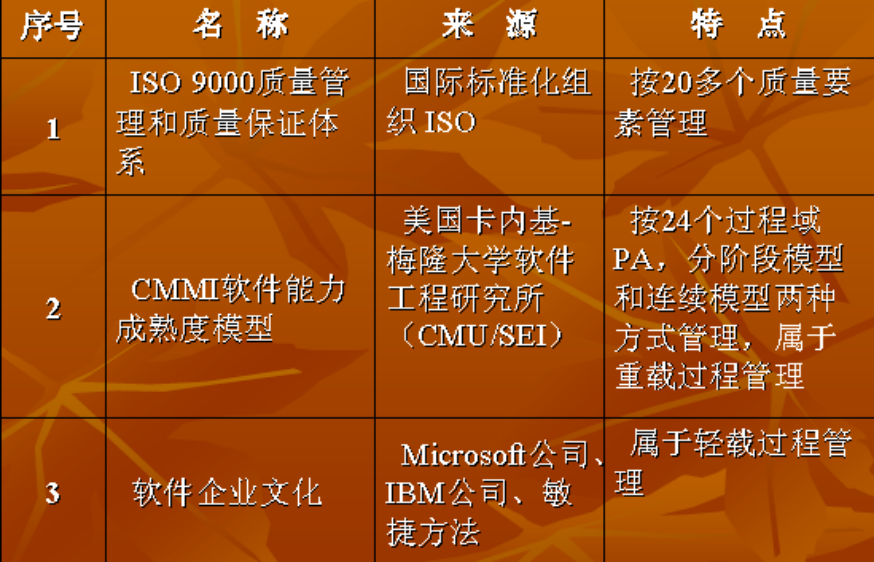

ISO9001质量管理和质量保证体系,其应用范围覆盖了第二产业和第三产业中的所有企业。特别,为了覆盖软件企业,它专门增加了一部分内容,使软件企业能按照它规定的20个过程域进行软件过程改进与软件质量保证。

在中国,软件企业内部的软件组织,都是按照CMMI阶级模型的22个过程域,来进行软件过程改进的。实施CMMI的投入成本高,工作量大,属于重载过程管理。

开发一个软件项目,首先要选择并确定一个适合于该项目的软件生命周期模型,然后按照该软件生命周期模型的开发路线图,进行有条不紊地开发,以达到成功的彼岸。

软件生命周期模型是软件工程课程研究的四大内容之一,它虽然不是软件工程课程研究的重点,但是在宏观上特别重要。因为软件的生命周期与选择的开发模型有关,不同的开发模型,对应不同的生命周期。

任何有生命的动物、植物和人,都有一个生命周期(Life Cycle)。例如,人的生命周期如下表所示。

即使是没有生命的事物或实体,例如,PC机、路由器、家具、房子、汽车,它们也有一个生命周期,这个生命周期就是使用寿命,即使用周期。

| 周期序号 | 周期划分 | 周期名称 | 周期的主要活动 |
| --- | --- | --- | --- |
| 1 | 胚胎至分娩 | 胎儿 | 定期到妇幼保健院或妇产科医院检查 |
| 2 | 0~3岁 | 婴儿 | 请保姆看护,上婴儿室或托儿所 |
| 3 | 3~6岁 | 幼儿 | 上幼儿园,健康、活泼、天真地成长 |
| 4 | 6~12岁 | 儿童 | 上小学,好好学习,天天向上 |
| 5 | 12~18岁 | 少年 | 上中学,参加中考、高考,自古英雄出少年 |
| 6 | 18~30岁 | 青年 | 上大学,攻读硕士、博士学位,应聘就业,开始追求创新,追求异性 |
| 7 | 30~60岁 | 中年 | 上班,追求事业上的成就、成功、贡献,经营幸福的家庭 |
| 8 | 60岁以上 | 老年 | 退休,老有所乐,写回忆录,立遗嘱 |
| 9 | 因病去世 | 死亡 | 丧事从简,长眠于地下 |

为什么不同的软件生命周期模型,可能对应着不同的生命周期。

因为生命周期模型不同,该软件的开发阶段划分、评审次数、基线标准、产品发布、维护方式都有所不同。

软件生命周期模型能清晰、直观地表达软件开发全过程,明确规定了要完成的主要活动和任务,用来作为软件项目工作的基础。一般来说,若以时间为序,软件的生命周期可详细地划分为几个阶段,如下表所示。

| 周期序号 | 周期名称 | 周期序号 | 周期名称 |
| --- | --- | --- | --- |
| 1 | 立项(或签合同)、下达任务书 | 6 | 软件测试 |
| 2 | 需求分析 | 7 | 软件发布与实施 |
| 3 | 概要设计 | 8 | 软件维护 |
| 4 | 详细设计 | 9 | 版本更新或退役 |
| 5 | 编码实现 | | |

现在,来回顾一下前面对软件生命周期模型的定义。

在【定义】中指出:软件生命周期模型是指在整个软件生命周期中,软件开发过程应遵循的开发路线图。或者说,软件生命周期模型是软件开发全部过程、活动和任务的结构框架。

显而易见,这个定义不但非常全面,而且十分准确,它符合所有软件生命周期模型对生命周期的定义与解释。

### 2.2 瀑布模型

1970年温斯顿·罗伊斯(Winston Royce)提出了著名的“瀑布模型”,直到80年代早期,它一直是唯一被广泛采用的软件开发模型。直至今日,该模型仍然具有强大的生命力。

瀑布模型(Waterfall Model)又称流水式过程模型,它可以形象地用阶梯瀑布描述,水由上向下一个阶梯接着一个阶梯地倾泻下来,最后进入一个风平浪静的大湖,这个大湖就是软件企业的产品库,如下图所示。

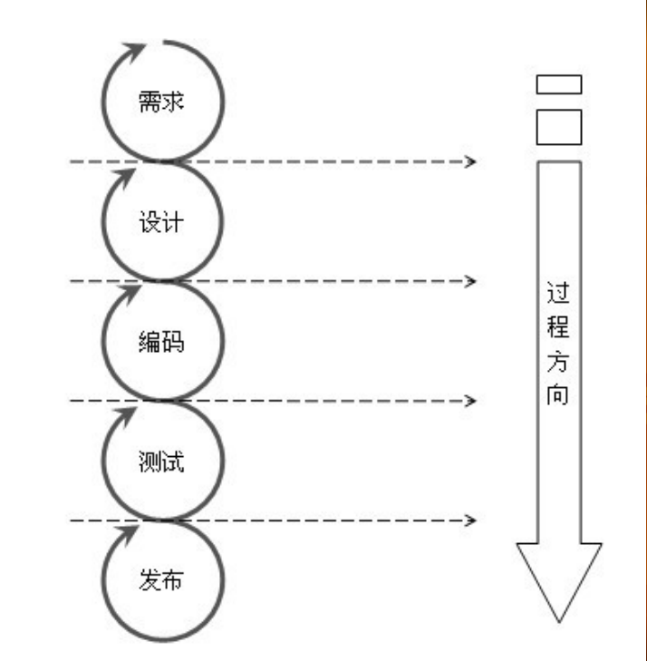

1.模型的本意

在瀑布模型中,软件开发的各项活动严格按照线性方式进行,当前阶段的活动接受上一阶段活动的工作结果,实施完成所需的工作内容。

对当前阶段活动的工作结果需要进行验证,如果验证通过,则该结果作为下一阶段活动的输入,继续进行下一阶段的活动,否则返回上一阶段修改。

瀑布模型认为:项目经理或软件管理人员,只要控制好每级台阶的高度和宽度,在每个台阶处设立里程碑或基线,并组织好对基线的评审与审计,就可以控制好项目的开发成本、进度和质量。

早期的面向过程的结构化分析、结构化设计、结构化编程、结构化测试、结构化维护方法,很适合于瀑布模型。或者说,瀑布模型适合于结构化方法,即面向过程的软件开发方法。

2.模型的特点

(1)里程碑或基线驱动,或者说文档驱动。

(2)过程逆转性很差或者说不可逆转,因为根据上游的错误会在下游进行发散性传播的原理,所以逆转将会延误工期,增加成本,造成重大损失。

3.选择模型的条件

不是任何软件都可以采用瀑布模型的,软件项目或产品选择瀑布模型,必须满足下列条件:

(1)在开发时间内需求没有或很少变化。

(2)分析设计人员对应用领域很熟悉。

(3)低风险项目(对目标、环境很熟悉)。

(4)用户使用环境很稳定。

(5)用户除提出需求以外,很少参与开发工作。

尽管上述条件比较苛刻,但是,软件企业在开发新产品或新项目时,往往还是采用瀑布模型。系统软件和工具软件的开发,也常常采用瀑布模型。

4.模型的优点

开发阶段清晰,便于评审、审计、跟踪、管理和控制。

5.模型的缺点

传统的项目组织方法是按顺序完成每个工作流程,即瀑布式生命周期。瀑布只能一个个台阶地往下流,不可能倒着往上流,这就是它致命的缺点。

瀑布式生命周期通常会导致在项目后期,出现“问题堆积”,更可怕的是,错误的传递会采取发散扩大的方式。

6. 改进措施

为了克服该模型的缺陷,微软采取严格的里程碑管理制度。

CMM / CMMI则采取阶段评审和不符合项(Noncompliance Items)的动态跟踪制度,只有前一阶段的不符合项全部改正后,才允许开发人员进入后一阶段的工作。

所谓不符合项,就是在评审中发现的问题项,它与Bug既有联系,又有区别。对于这些不符合项,软件管理部门要列出表格,记录在案,确定责任人,限定改正时间,动态跟踪到底。

### 2.3 增量模型

增量模型(Incremental Model)是遵循递增方式来进行软件开发的。

软件产品被作为一组增量构件(模块),每次需求分析、设计、实现、集成、测试和交付一块构件,直到所有构件全部实现为止。

这一过程就像小孩子搭积木盖房子一样,如下图所示。

| 第1次集成 | 第1块积木 | | | | | |
| --- | --- | --- | --- | --- | --- | --- |
| 第2次集成 | 第1块积木 | 第2块积木 | | | | |
| 第3次集成 | 第1块积木 | 第2块积木 | 第3块积木 | | | |
| 第4次集成 | 第1块积木 | 第2块积木 | 第3块积木 | 第4块积木 | | |
| 第N次集成 | 第1块积木 | 第2块积木 | 第3块积木 | 第4块积木 | 第N块积木 | |

1.模型的本意

要开发一个大的软件系统,先开发其中的一个核心模块(或子系统),然后再开发其他模块(或子系统),这样一个个模块(或子系统)地增加上去,就像搭积木一样,直至整个系统开发完毕为止。

在每增加一个模块前,先要对该模块进行模块测试。通过后再将此模块加入到系统中,然后还要进行系统集成测试。系统集成测试成功后,再增加新的模块。

这样多次循环,直到系统搭建完毕为止。

2.模型的特点

(1)任务或功能模块驱动,可以分阶段提交产品。

(2)有多个任务单,这些多个任务单的集合,构成项目的一个总《任务书》,或总《用户需求报告》/《需求规格说明书》。

3.选择模型的条件

(1)在整个项目开发过程中,需求都可能发生变化,客户接受分阶段交付。

(2)分析设计人员对应用领域不熟悉,难以一步到位。

(3)中等或高风险项目(工期过紧且可分阶段提交的系统或目标、环境不熟悉)。

(4)用户可参与到整个软件开发过程中。

(5)使用面向对象语言或第四代语言。

(6)软件公司自己有较好的类库、构件库。

4.模型的优点

(1)由于将一个大系统分解为多个小系统,这就等于将一个大风险分解为多个小风险,从而降低了开发难度。

(2)人员分配灵活,刚开始不用投入大量人力资源。如果核心模块产品很受欢迎,则可增加人力实现下一个增量。当配备的人员不能在设定的期限内完成产品时,它提供了一种先推出核心产品的途径。即可先发布部分模块给客户,对客户起到镇静剂的作用。

5.模型的缺点

如果软件系统的组装和拆卸性不强,或开发人员全局把握水平不高(没有数据库设计专家进行系统集成),或者客户不同意分阶段提交产品,或者开发人员过剩,就不宜采用这种模型。

### 2.4 原型模型与快速原型法

许多软件公司在生产软件产品与实施软件项目时,经常采用一种“原型法”,它来源于原型模型。

1.模型的本意

原型模型(Prototype Model)的本意是:在初步需求分析之后,马上向客户展示一个软件产品原型(样品),对客户进行培训,让客户试用,在试用中收集客户意见,根据客户意见立刻修改原型,之后再让客户试用,反复循环几次,直到客户确认为止。

原型模型很适合于企业资源规划ERP(Enterprise Resource Planning)系统,尽管市场上推出了许多公司的分行业ERP“产品”,但是这些“产品”的产品化程度相当低,都必须在实施中做大量的客户化工作。

有些公司的分行业ERP “产品”称作“分行业解决方案”,这个“分行业解决方案”就是分行业的原型,即快速原型法中的原型。

2.模型的特点

原型驱动。开发者必须先有一个原型(样品),至少要有一个原型的核心。

原型模型与迭代模型相同点是:反复循环几次,直到客户确认为止。不同点是:原型模型事先有一个展示性的产品原型(样品),而迭代模型可能没有。

3.选择模型的条件

(1)已有产品或产品的原型(样品),只需客户化的工程项目。

(2)简单而熟悉的行业或领域。

(3)有快速原型开发工具。

(4)进行产品移植或升级。

由于上述条件不太苛刻,所以凡是有软件产品的IT企业,在他们熟悉的业务领域内,当客户招标时,他们都会以原型模型作为软件开发模型,去制作投标书,去讲解投标。

4.模型的优点

开发速度快,用户意见反馈实时,有利于开发商在短时间内推广并实施多个客户。

正因为原型模型具有这些优点,所以它一直是软件企业界的主流开发模型。凡是有软件产品积累的软件公司,他们在投标、开发、实施项目的过程中,都非常喜欢用原型模型。

5.模型的缺点

因为事先有一个展示性的产品原型,所以在一定程度上,不利于开发人员的创新。

6.快速原型法

由于原型模型的开发速度较快,有时也将它称作快速原型法(Rapid Prototyping)。

在开发工具和开发环境迅速发展的今天,在信息系统开发中,原型法和快速原型法又被赋予新的内容:事先没有原型产品,也可以采取这种办法。

基本思路是:采用以面向元数据为主的方法,在需求分析的基础上,利用Power Designer等数据库分析和设计工具,快速建立信息系统的概念数据模型CDM和物理数据模型PDM;然后利用面向对象的编程工具,快速地实现需求分析中确认的流程、功能、性能和接口;之后交付给用户试用,反复循环几次,直到客户确认满意为止。

【例】 1996年8月,当时的某高级工程师,带领一个程熟练的程序员,来到营口港务局通信中心,开发该中心的电话业务信息管理系统。

虽然这两个人手中并无什么“原型”,但是他俩一个是数据库设计高手,一个是编程高手,所以俩人分工负责,一人设计数据库,一人编写程序,双方配合默契,只用一个多月时间,就圆满地完成了开发任务,收回了全部开发费用,获得了客户的好评。

这是一个典型的“快速原型法”例子。

快速原型法选择的条件之一是:项目组中有数据库分析和设计的专家,有面向对象编程的专家,文档制作有成熟的模板,而且系统或项目又不是非常大。

快速原型法选择的条件之二是:项目组的开发环境为分行业的业务基础平台(例如用友业务基础平台),该业务基础平台又完全适合所需开发的系统或项目,而且系统或项目又不是非常大。

以上两个条件,只要符合一个,就可以采用快速原型法。

### 2.5 迭代模型与 RUP

针对瀑布模型的缺陷,人们提出了迭代模型(Iterative Model)。

在多种迭代模型中,要算美国的I. Jacobson、G. Booch和J. Rumbaugh三位软件专家提出的RUP(Rational Unified Process)模型最为成功。如下图表示。

所谓迭代,是指活动的多次重复。从这个意义上讲,原型不断完善和增量不断产生,都是迭代的过程。但这里所讲的迭代模型是RUP推出的一种“逐步求精”的面向对象的软件开发过程模型,被认为软件界迄今为止最完善的、商品化的开发过程模型。

上图表面上是一个二维图,实质上是用一张二维图来表示一个多维空间模型。从宏观上看,它是一个大的迭代过程:横坐标表示软件产品所处的四个阶段状态:先启、精化、构建、产品化(移交),纵坐标表示软件产品在每个阶段中的工作流程。从微观上看,任何一个阶段本身,其内部工作流程也是一个小的迭代过程。

1.模型的本意

在计算方法中,迭代是一种逼近真值的算法。

例如,要寻求某个问题的真值,可以设计一种迭代算法,第1次给定一个初值,这个初值离真值可能很远,进行第1次计算,得到第2个值。第2个值,离真值会近一些,没关系,再把这个值当新的初值,再计算一次,又产生第3个值。第3个值,离真值更近了,误差更小了......这样循环迭代计算N次下去,直到第N值与第N+1值之间的误差足够小为止,就用第N+1个值当做真值的近似值。

在许多问题中,没有误差的真值可能是求不出来的。这就是迭代模型思想的来源。

为使项目能够比较顺利地进行,一种较灵活的方法是:多次执行各个开发工作流程,从而更好地理解需求,设计出更为强壮的软件构架,逐步提高开发组织能力,最终交付一系列逐步完善的实施成果,这就是迭代式生命周期模型。

每次按顺序完成这一系列工作流程就叫做一次迭代,每次迭代,均以次要里程碑结束,按照特定的迭代成功标准,对迭代的结果进行评估。每个阶段都可以进一步细分为迭代。

迭代是产生可执行的产品发布的完整开发循环,所发布的产品是开发过程最终产品的子集,它将通过一次又一次的迭代,实现递增成长,最后形成最终的软件系统或产品。

2.模型的特点

迭代或迭代循环驱动,每一次迭代或迭代循环,均要走完初始(先启)、精化、构建、产品化(移交)这四个阶段。RUP的主要特征如下:

1. 采用迭代的、增量式的开发过程;

2. 采用UML语言描述软件开发过程;

3. 有功能强大的软件工具Rational Rose支撑。

面向对象的方法,尤其是面向对象的CASE工具Rational Rose,适合于迭代模型。

3.模型的选取条件

(1)生命周期模型是以迭代为主要特征的。项目组的管理人员和核心成员,应对迭代的开发方式比较熟悉。

(2)管理人员和核心成员应对软件工程的核心过程:

系统建模、需求分析、系统设计、系统实现、项目管理、配置管理、测试等比较熟悉。

(3) 采用面向对象技术(如OOA,OOD等)的项目组,建议使用迭代式生命周期。

(4)项目组的核心设计人员,应具备一定程度的软件架构的知识,并熟练掌握软件架构设计技能。

(5)项目组全体成员应熟悉UML,并能利用建模工具(如Rational Rose等)进行分析、策划、设计、测试等。

(6)项目组的管理人员应具备风险管理的知识和技能。

(7)拥有实施软件产品开发、组装的软件组织。

4.模型的四个阶段

(1)初始阶段。本阶段主要工作是确定系统的业务用例和定义项目的范围。

(2)精化阶段。本阶段主要工作是分析问题域、细化产品定义,定义系统的构架并建立基线,为构建阶段的设计和实施工作提供一个稳定的基础。

(3)构建阶段。本阶段主要工作是反复地开发,以完善产品,达到用户的要求。

(4)产品化(移交)阶段。本阶段主要工作是将产品交付给用户,包括安装、培训、交付、维护等工作。

5.模型的九个核心流程

(1)业务建模。

(2)需求获取。

(3)分析设计。

(4)实施。

(5)测试。

(6)部署。

(7)配置与变更管理。

(8)项目管理。

(9)环境。

6.模型的优点

在开发早期或中期,用户需求可以变化;在迭代之初,它不要求有一个相近的产品原型;模型的适用范围很广,几乎适用于所有的项目开发。

7.模型的缺点

迭代模型是采取循环的工作方式,每次循环均使工作产品更靠近目标产品一次,这就要求项目组成员具有很高的水平并掌握先进的开发工具。

### 2.6 螺旋模型

1.模型的本意

螺旋模型将瀑布模型和快速原型模型结合起来,强调了其他模型所忽视的风险分析,特别适合于大型复杂的系统。

螺旋模型基本做法是在瀑布模型的每一个开发阶段前,引入一个非常严格的风险识别、风险分析和风险控制,它把软件项目分解成一个个小项目。每个小项目都标识一个或多个主要风险,直到所有的主要风险因素都被确定。如下图所示。

螺旋模型沿着螺线顺时针方向进行若干次迭代,图中的四个象限代表了以下迭代活动:

(1)制定计划:确定软件目标,选定实施方案,弄清项目开发的限制条件;

(2)风险分析:分析评估所选方案,考虑如何识别和消除风险;

(3)实施开发:实施软件开发和验证;

(4)客户评估:评价开发工作,提出修正建议,制定下一步计划。

2.模型的特点

(1)把软件开发过程组成为一个逐步细化的螺旋周期,每经历一个周期,系统就得到进一步的细化和完善;

(2)整个模型紧密围绕开发中的风险分析,推动软件设计向深层扩展和求精;

(3)强调持续的判断、确定和修改用户的任务目标,并按成本、效益来分析候选的软件产品对任务目标的贡献。

3.选择模型的条件

螺旋模型强调风险分析,使得开发人员和用户对每个演化层出现的风险有所了解,继而做出应有的反应,因此特别适用于庞大、复杂并具有高风险的系统。

对于这些系统,风险是软件开发不可忽视且潜在的不利因素,它可能在不同程度上损害软件开发过程,影响软件产品的质量。

减小软件风险的目标是在造成危害之前,及时对风险进行识别及分析,决定采取何种对策,进而消除或减少风险的损害。

4.模型的优点

(1)与瀑布模型相比,螺旋模型支持用户需求的动态变化,为用户参与软件开发的所有关键决策提供了方便,从而降低了软件开发风险。

(2)螺旋模型对可选方案和约束条件的强调,有利于已有软件的重用,也有助于把软件质量作为软件开发的一个重要目标。

(3)减少了过多测试(浪费资金)或测试不足(产品故障多)所带来的风险。

(4)螺旋模型中维护只是模型的另一个周期,在维护和开发之间并没有本质区别。

5.模型的缺点

(1)很难让用户确信这种演化方法的结果是可以控制的。由于建设周期长,而软件技术发展比较快,所以经常出现软件开发完毕后,和当前的技术水平有了较大的差距,无法满足当前用户需求。

(2)采用螺旋模型需要具有相当丰富的风险评估经验和专门知识,在风险较大的项目开发中,如果未能够及时标识风险,势必造成重大损失。

(3)过多的迭代次数会增加开发成本,延迟提交时间。

### 2.7 喷泉模型

1.模型的本意

喷泉模型(Fountain Model)认为,软件开发过程自下而上的各阶段是相互重叠和多次反复进行的,就像喷泉中的水喷上去,又可以落下来,所以叫做喷泉模型。

各个开发阶段没有特定的次序要求,而且可以交互进行,在每个开发阶段中,还可以随时补充其他任何开发阶段中的遗漏。采用喷泉模型的软件过程,如下图所示。

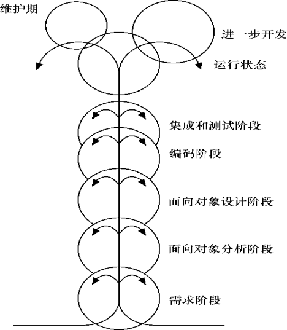

2.模型的特点

喷泉模型是一种以用户需求驱动的模型,主要用于描述面向对象的软件开发过程。

由于各阶段的活动之间无明显界线,所以喷泉模型也称为“喷泉无间隙性模型”。

3.选择模型的条件

喷泉模型主要用于面向对象的软件项目,软件的某个部分通常被重复多次,相关对象在每次迭代中随之加入渐进的软件成分。

4.模型的优点

喷泉模型不像瀑布模型那样,需要分析活动结束后才开始设计活动,设计活动结束后才开始编码活动。

该模型的各个阶段没有明显的界限,开发人员可以同步进行开发。其优点是可以提高软件项目开发效率,节省开发时间。

5.模型的缺点

由于喷泉模型在各个开发阶段是重叠的,因此在开发过程中需要大量的开发人员,因此不利于项目的管理。

这种模型要求严格管理文档,使得审核的难度加大,尤其是面对可能随时加入的各种信息。

### 2.8 敏捷开发与极限编程 XP

1.模型的本意

XP模型,即极限编程模型,它本来是敏捷企业文化现象,但是不少人将它当作一种软件开发模型。

XP模型属于轻量级开发模型,它由一组简单规则(需求、设计、实现、重构、测试、发布)组成,既保持开发人员的自由创造性,又保持对需求变动的适应性,即使在开发的后期,也不怕用户需求的变更。

2.模型的特点

在需求、设计、实现、重构、测试、发布的迭代过程中,XP模型有四条核心原则:“交流” 、“简单” 、“反馈” 和“进取”。

XP开发小组不仅包括开发人员,还包括管理人员和客户。

XP模型强调小组内成员之间要经常进行“交流”,结对编程,在尽量保证质量的前提下力求过程和代码的“简单”化。

来自客户、开发人员和最终用户的具体“反馈”意见,可以提供更多的机会来调整设计,保证把握正确的开发方向。

在XP模型中,采取讲“用户场景故事”的方法,来代替传统模型中的需求分析。

3.选择模型的条件

XP模型克服了传统模型不灵活机动的缺陷,是一种面向客户场景的轻量级模型。它只适合于中小型开发小组。实践表明,XP模型特别适合于情投意合的青年人群的小项目。

4.模型的优点

(1). 由于采用简单策略,不需要长期计划和复杂管理,因而开发周期短;

(2). 由于采用迭代增量开发、反馈修正和反复测试的方法,因而软件质量有保证;

(3). 由于适应用户需求的变化,因而与用户关系和蔼。

5.模型的缺点

XP模型作为一种新的模型,在实际应用中还存在着一些问题,引起了许多争议。

它只适用于小型项目、小型项目组,不大适用于大型项目、大型项目组。

同时,它与ISO9001、CMMI的精神也存在冲突。

敏捷模型避免了传统的重量级软件开发过程复杂、文档繁琐和对变化的适应性弱等弊端,强调软件开发过程中团队成员之间的交流、过程的简洁性、用户反馈、对所做决定的信心以及人性化的特征。

“敏捷”可用于任何软件过程,实现要点是将软件过程设计为:允许项目团队调整并合理安排任务,理解敏捷开发方法的易变性并制定计划,精简并维持最基本的工作产品,强调增量交付策略,快速向客户提供适应产品类型和运行环境的可运行的软件。

敏捷联盟发表了敏捷软件开发宣言 (Agile Alliance 2001a),该宣言由下面四个价值观组成:

(1) 个人和交互胜于过程和工具;

(2) 可用的软件胜于详尽的文档;

(3) 与客户协作胜于合同谈判;

(4) 响应变化胜于遵循计划。

敏捷过程的开发原则 (Agile 方法论)

(1) 将尽早地和不断地向客户提交有价值的和满意的软件

(2) 自始至终地欢迎客户提供需求和需求变化

(3) 经常交付可用的软件,尽可能缩短时间间隔

(4) 在开发过程中,业务人员和开发人员必须每天一起工作

(5) 围绕优秀人员建立项目,给予所需的环境和支持

(6) 面对面的交流,是项目团队传递信息最好的方式

(7) 工作软件 (软件工作产品)所处的状态,是首要的软件度量

(8) 鼓励并支持软件开发的持续性,这样可加快产品化进程,在业务领域中处于领先地位

(9) 采用先进技术和优秀设计,以增强敏捷性

(10) 简单,少而精,只做必须做的

(11) 要相信:最好的架构、需求和设计,出自于自己的团队

(12) 每隔一段时间,团队要反思自己,调整自己今后的行为

XP使用面向对象方法作为推荐的开发范型。XP包含了策划、设计、编码和测试4个框架活动的规则和实践。

(1) 现场客户:面对面的交流,减少沟通的成本。

(2) 计划博弈: XP 要求结合业务和技术情况,快速确定下一次发布的范围。

(3) 系统隐喻:通过一个简单的关于整个系统如何运作的隐喻性描述,来指导全部开发。

(4) 简化设计:由于采用面向对象实现,所以设计可以简单。

(5) 集体拥有代码:即实现无私程序设计。

(6) 结对编程:一个人写代码,另一个人负责保证代码的正确性和可读性。

(7) 测试驱动:强调先编写测试代码,再编写被测试的代码。

(8) 小型发布:与增量式软件开发生命周期相似。

(9) 重构:重新调整、优化系统的内部结构。

(10) 持续集成:冒烟测试方法和一天一个版本的集成习惯。

(11) 代码规范:遵守共同的编程规范。

(12) 一天上午 9点站着开会;结对设计;结队测试与问答;结队编码与重构;集成;下午 5点回家。

### 2.9 模型之间的关系与选择方法

1.瀑布模型与迭代模型之间的关系

瀑布模型与迭代模型,它们两者之间是否有关联?回答是:有!而且关联十分紧密。

在宏观上,迭代模型是动态模型,瀑布模型是静态模型。迭代模型的每一次迭代,实质上都是执行一次瀑布模型,都要经历初始、精化、构造、移交四个阶段,走完瀑布模型的全过程。

在微观上,迭代模型与瀑布模型都是动态模型。迭代模型与瀑布模型在每一个开发阶段(初始、精化、构造、移交)的内部,都有一个小小的迭代过程,只有经历这个小小的迭代过程,该阶段的开发工作才能做细做好。

瀑布模型与迭代模型之间的这种微妙关系,如下图所示:

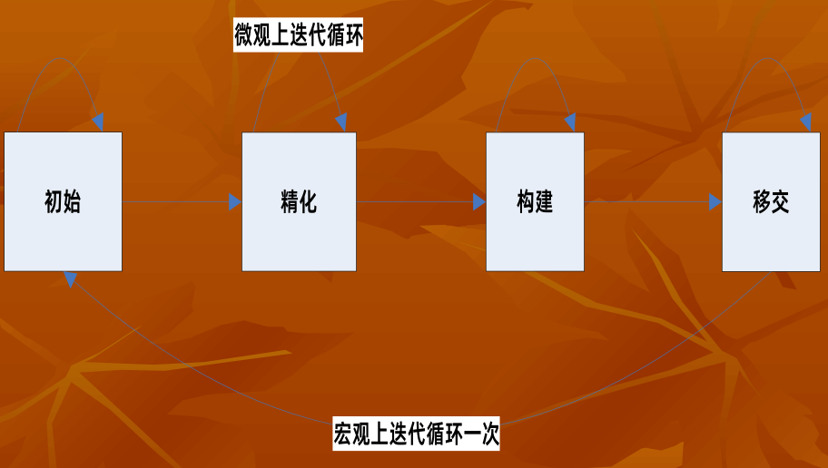

从图中可见:迭代中有瀑布,瀑布中有迭代。即你中有我、我中有你。

瀑布模型与迭代模型之间的关系,完全反映了人们对客观事物的认识论:要认识与掌握某一客观事物,你必须经历过由宏观到微观的多次反复过程。只有从宏观上反复迭代几次,你才能看清全貌,掌握事物的宏观发展规律。只有从微观上反复迭代几次,你才能吃透每个细节,掌握事物的微观发展规律。

2.瀑布模型与增量模型之间的关系

瀑布模型与增量模型之间,也存在一定的关系。增量模型首先开发核心模块,之后再开发其他模块,这样一个一个地开发下去,直至所有模块开发完毕为止。

在开发每一个模块时,开发者一般都是采用瀑布模型,从需求、设计、编程、测试一个阶段接着一个阶段地实现。所以增量模型中有瀑布模型思想,即宏观上是增量模型,微观上是瀑布模型。

增量模型也体现了迭代思想,每增加一个模块,就进行一次迭代,执行一次瀑布模型,所以,增量模型本质上是迭代的。

3.瀑布模型与原型模型之间的关系

瀑布模型与原型模型之间,也存在一定的关系。

原型模型开始有一个原型,在此基础上以后的每一次迭代,都可能是一次瀑布模型的开发方式。

原型模型中不但包含了迭代模型的思想,而且包含了瀑布模型的思想。

4.瀑布模型与螺旋模型之间的关系

螺旋模型是瀑布模型和快速原型模型的结合,快速原型模型是原型模型的简化,原型模型又是迭代模型和瀑布模型的组合,这些模型之间是相互依存的、彼此有关的。

螺旋模型每一次顺时针方向旋转,相当于顺时针方向迭代一次,都是走完一次瀑布模型,这就是它们之间的关系。事实上,喷泉模型与瀑布模型也有关系。

5.XP模型与迭代模型之间的关系

XP模型是一个自由式迭代模型,它比传统的迭代模型简单、自由,甚至毫无约束。船小好调头,这就是XP模型。

6.生命周期模型之间的关系总结

软件工程虽然来源于机器制造工程、建筑工程、计算机硬件工程,但是又与这些工程不完全相同。

在软件施工的过程中,软件工程不可能百分之百地按照事先设计好的软件蓝图进行,而是一边施工、一边修改软件蓝图、一边再按照修改的软件蓝图继续施工,即按照“软件蓝图--软件施工--软件蓝图--软件施工”这个顺序多次循环,循环中又包含着各种生命周期及开发模型之间的关系,最后才能到达胜利的彼岸。

这就是软件工程中各种生命周期及开发模型之间的关系,这就是软件工程与其他工程的区别,这就是软件工程的特色。

软件生命周期模型虽然多种多样,但是在本质上可以归纳为两大类型,即瀑布类型和迭代类型。属于前一类型的有瀑布模型、增量模型和喷泉模型等等。属于后一类型的有迭代模型、原型模型、螺旋模型和XP模型等等。

研究软件生命周期模型对软件企业有什么作用呢?回答是:

第一,作为软件管理人员、项目经理、软件工程师和软件蓝领,对软件开发模型和软件生命周期,都要有一个完整、清晰的概念,在进入IT企业参与软件开发或软件管理时,首先要明确:当前的项目或产品开发到底采用什么软件生命周期模型,由此确定当前的软件开发状态,合理安排项目组成员的工作。只有这样,才能迅速适应IT企业文化,并很快进入软件开发或软件管理的角色。

第二,作为软件过程改进人员,要明确过程改进就是优化软件开发过程,为此必须按照软件开发的常用模型,细化到模型中的各个阶段,把具体的改进措施落实到每一个阶段中。

结合CMMI软件过程模型,把能力成熟度等级的概念,应用于软件开发的每一个阶段,从而进一步加强软件的过程管理。

这就是说,要将软件生命周期模型的研究与过程改进模型CMMI的研究紧密结合起来,将CMMI的精神实质落实到软件生命周期模型中去。

前面介绍了七个软件生命周期模型:瀑布模型、增量模型、迭代模型、原型模型、螺旋模型、喷泉模型和XP模型。

最常用的是瀑布模型和原型模型,其次是增量模型,最难掌握的是迭代模型。因为这七个模型各有所长,所以它们有各自的生存空间。因为它们各有所短,所示才会产生相互竞争。只有通过竞争,才能推动软件生命周期模型研究的发展。

七个模型的比较如下表所示。

| 序号 | 模型名称 | 优点 | 缺点 | 适用范围 |
| --- | --- | --- | --- | --- |
| 1 | 瀑布模型 | 简单好学 | 逆转性差 | 面向过程开发 |
| 2 | 增量模型 | 可以分阶段提交 | 有时用户不同意 | 系统可拆卸和组装 |
| 3 | 迭代模型 | 需求可变 | 风险大 | 有高素质软件团队 |
| 4 | 原型模型 | 开发速度快 | 不利于创新 | 已有产品的原型 |
| 5 | 螺旋模型 | 需求可变 | 建设周期长 | 庞大、复杂、高风险项目 |
| 6 | 喷泉模型 | 提高开发效率 | 不利于项目的管理 | 面向对象开发 |
| 7 | XP模型 | 提高开发效率 | 不适合大团队、大项目 | 小团队,小项目 |

软件企业选取软件生命周期模型的方法是:软件企业在创业时期,由于没有项目或产品的积累,所以他们常常会选取瀑布模型和增量模型。

一旦越过创业时期,由于积累了一些了项目或产品,他们就会选取原型模型。

至于迭代模型,只有当他们掌握了UML及其工具Rational Rose之后,才会加以考虑。

关于软件组织定制“软件生命周期模型裁剪指南”的重要概念。

在一个成熟的IT企业或软件组织内部,根据上述通用的七个模型的普遍原则,结合本单位的开发经验和行业特点的具体实际,还需要定制适合本单位的“软件生命周期模型裁剪指南”,有针对性地对选定模型中定义的生命周期,进行恰当的裁剪,使它完全适合于本单位的需求。

所谓裁剪,就是对原模型中定义的内容进行增加、修改、删除,去掉对本单位不适用的部分,增加对本单位适用的内容,同时进一步细化,从而构成了完全适合本单位的“软件生命周期模型裁剪指南”。

各种软件过程模型反映了软件生命周期表现形式的多样性。在生命周期的不同阶段也可采用不同的软件过程模型。在具体的软件开发过程中,可以选择某种软件过程模型,按照某种开发方法,使用相应的工具进行软件开发。

在选择软件过程模型时需要考虑以下几点。

(1) 符合软件自身的特性,如规模、成本和复杂性等;

(2) 满足软件开发进度的要求;

(3) 对软件开发的风险进行预防和控制;

(4) 具有计算机辅助工具的支持;

(5) 与用户和软件开发人员的知识和技能相匹配;

(6) 有利于软件开发的管理和控制。

一般来说,结构化方法和面向数据结构方法可采用瀑布模型或增量模型进行软件开发;而面向对象方法可采用快速原型模型、喷泉模型或RUP模型进行软件开发。

在实际的软件开发过程中,选择软件过程模型并非是一成不变的,有时还需要针对具体的目标要求进行裁剪、修改等,从而构成完全适合开发目标要求的软件过程模型。

现实中的软件系统有各种各样,软件开发方式也千差万别。对同一个问题,不同的开发组织可能选择不同的开发模型(过程模型)去解决,开发出的软件系统也不可能完全一样,但是其基本目标都是一致的,即应该满足用户的基本功能需求,否则,再好的软件系统也是没有意义的。

### 2.10 基于组件的开发模型

基于组件的开发模型使用现有的组件以及系统框架进行产品开发,由于现有组件大多已经历实际应用的反复检验,因此其可靠性相对新研发组件高出很多。

实际上,从最简单的应用程序到极度复杂的操作系统,现在的新产品开发很少有完全从零开发,都或多或少的使用了现有的组件或系统开发框架,比如大型游戏的开发常常使用现有的图形引擎、声音引擎以及场景管理模块等。使用现有的组件开发新产品不仅极大地提高了产品开发效率,同时由于组件常常是经历了时间考验的,因此产品的质量也得到了提高

基于组件的开发模型充分的体现了软件复用的思想,降低了开发成本和风险,并加快了产品开发。随着技术的发展,现在的软件系统越来越庞大,完全从零开发已近乎不可能,基于现有组件或系统开发已成为一种趋势。

### 2.11 开发模型选择案例

假设你要开发一个软件,它的功能是把73 624.938 5这个数开平方,所得到的结果应该精确到小数点后4位。一旦实现并测试完之后,该产品将被抛弃。你打算选用哪种软件生命周期模型?请说明你做出这样选择的理由。

对这个软件的需求很明确,实现开平方功能的算法也很成熟,因此,既无须通过原型来分析需求也无须用原型来验证设计方案。此外,一旦实现并测试完之后,该产品将被抛弃,因此也无须使用有助于提高软件可维护性的增量模型或螺旋模型来开发该软件。

综上所述,为了开发这个简单的软件,使用大多数人所熟悉的瀑布模型就可以了。

某大型企业计划开发一个“综合信息管理系统”,该系统涉及销售、供应、财务、生产、人力资源等多个部门的信息管理。该企业的想法是按部门优先级别逐个实现,边应用边开发。对此,需要一种比较合适的过程模型。请对这个过程模型做出符合应用需要的选择,并说明选择理由。

增量模型。理由是。。。。

假设计划研发一种产品,技术含量很高,与客户有关的风险也很多,你会采用哪种软件过程模型? 请说明理由。

采用RUP模型。RUP模型在每个步骤后都会形成一个可以发布的产品,这个产品是最终产品的一个子集。这样能够在生命周期中尽早地避免风险,不会像其他过程模型一样,有可能直到最后才发现,面临巨大风险。再者这个模型能产生多个软件样品,每个样品实现某个个别功能一一解决软件开发中的难点,最终达到高技术含量的成品。

<a id="chapter-3"></a>

## 3. 可行性研究、立项与合同

### 3.1 可行性研究与实施步骤

**可行性研究**

可行性研究就是指在项目进行开发之前,对该项目是否能在特定的资源、时间等制约条件下完成做出评估,并且确定它是否值得去开发。可行性研究的目的不在于如何去解决问题,而在于确定问题是否值得去解决,是否能够解决。

可行性研究的结论有三种情况:

(1)可行,按计划进行。

(2)基本可行,需要对解决方案做出修改。

(3)不可行,终止项目。

技术可行性研究就是要回答使用现有的技术能否实现待开发的系统的问题。在用户提出的系统功能、性能及实现系统的各项约束条件下,技术可行性研究从技术角度研究实现系统的可行性。技术可行性研究一般包括风险分析、资源分析和技术分析。

经济可行性研究也叫成本效益分析,它回答的是待开发系统的经济效益能否超过它的开发成本的问题。通过成本效益分析,经济可行性研究从经济角度去判断是否值得为该系统投资。成本效益分析需要估计出开发系统的总成本和将来系统投入使用后带来的总收益。当总收益大于总成本时,该项目才值得开发。

社会可行性研究从政策、法律、制度等社会因素方面考虑项目开发的可能性和合理性。比如,将来软件产品服务的领域是否与国家的政策或法律法规相抵触?

进行可行性研究的步骤不是固化的,而是根据项目的性质、特点以及开发团队的能力有所区别。一个典型的可行性研究的步骤可以归结为以下几步:

(1)明确系统的目标

在这一步,可行性分析人员要访问相关人员,阅读分析可以掌握的材料,确认用户需要解决的问题的实质,进而明确系统的目标以及为了达到这些目标系统所需的各种资源。

(2)分析研究现行系统

现行系统是新系统重要的信息来源。新系统应该完成现行系统的基本功能,并在此基础上对现行系统中存在的问题进行改善或修复。可以从三个方面对现有系统进行分析:系统组织结构定义、系统处理流程分析和系统数据流分析。系统组织结构可以用组织结构图来描述。系统处理流程分析的对象是各部门的业务流程,可以用系统流程图来描述。系统数据流分析与业务流程紧密相连,可以用数据流图和数据字典来表示。

(3)设计新系统的高层逻辑模型

这一步从较高层次设想新系统的逻辑模型,概括地描述开发人员对新系统的理解和设想。

(4)获得并比较可行的方案

开发人员可根据新系统的高层逻辑模型提出实现此模型的不同方案。在设计方案的过程中要从技术、经济等角度考虑各方案的可行性。然后,从多个方案中选择出最合适的方案。

(5)撰写可行性研究报告

可行性研究的最后一步就是撰写可行性研究报告。此报告包括项目简介、可行性分析过程和结论等内容。

**可行性研究报告**

**项目背景**

**管理概要**

**候选方案**

**系统描述**

**经济可行性**

**技术可行性**

**社会可行性**

**其他可行性**

**其他与项目有关的问题**

**市场可行性分析**

**政策可行性分析**

**技术可行性分析**

成本 - 收益分析SWOT(强项、弱项、机会、威胁)分析

1. 软件开发人员与管理人员的工资和福利

2. 办公室的房租

3. 办公用的家具和电器,如桌子、椅子、书柜、照明和空调等

4. 计算机、打印机、网络等硬件设备

5. 电话、传真等通讯设备以及通信费用

6. 办公室消耗,如水电费、打印费、复印费、资料费等

7. 购买必需软件的费用,如买操作系统、数据库、软件开发工具等

8. 公司人员的差旅费、培训费等

9. 产品宣传费用,如广告、网站建设费

10. 为了讨好客户,还要充分考虑用于吃喝玩乐的费用

11. 产品售后、维护费

### 3.2 立项决策与合同内容

软件项目(或产品)的来源一般有两个渠道。一个渠道是通过市场调研之后,认为某产品将会有巨大的市场空间,而软件公司在人力资源、设备资源、抵抗风险、资金和时间上都具备开发该产品的能力,于是决定立项,这类软件产品被称为“非订单软件”,典型例子有网上游戏软件。

另一个渠道是与固定的用户签订软件开发合同,由软件公司启动该项目的开发,这类软件被称为“订单软件”,典型例子有企业资源规划系统ERP和电子商务大型网站。

对于一些大型项目,在签订合同之前,一般有一个招标与投标的过程,只有中标之后,才能签订合同。

开发“非订单软件”需要“立项”,开发“订单软件”需要签订“合同”。所以,“立项”与“合同”是IT企业软件项目(或产品)的两个源头。一旦立项或签订合同成功,企业领导或软件管理部门就要下达“任务书”,开发部门接到任务书后就要组建开发团队,成立项目组。

如果没有软件合同,又要开发软件项目或产品,就必须先立项,然后才能开发或施工。

立项的具体表现形式,就是在市场调研的基础上,分析立项的必要性(是否有市场前景)和可能性(是否有能力实现),并具体列出系统的功能、性能、接口和运行环境等方面的需求,当前客户群和潜在客户群的情况,以及投入产出分析。然后再按照编写参考指南书写立项建议书,并对它进行评审,评审通过后才算正式立项。

【例】某年初冬,某软件公司的老总在西安出差,发现西安市的大中型餐厅有电子点菜系统,客人一点菜,信息马上出现在厨房大师傅眼前,大师傅马上炒菜,服务员很快上菜,感到很有意思。

这个点菜系统叫“餐饮系统”,是北京某软件公司开发的。于是这位老总又飞到北京,不但拜访“餐饮系统”的开发公司,而且还到几家餐饮大店去吃饭,亲身体验“餐饮系统”的使用情况,收集用户意见。

返回烟台后,老总拍着脑袋决定马上立项,快速开发本公司的“餐饮系统”。不到三个月,“餐饮系统”开发完毕,但是在后来的两年中,该系统在烟台市总共也只卖出两套,投入与产出比是五比一。

因为烟台是中等城市,不像北京、西安是大城市,“餐饮系统”的客户群,实在是少得可怜。

立项就是决策,决策必须按照决策程序进行,没有决策程序就要先制定决策程序,不能一个人拍脑袋定决策。高层人员,都要亲自参加《立项建议书》的评审工作,并发表意见。若立项失误,则是企业决策的重大偏差,势必给企业造成各种资源的重大浪费。

立项的文档就是《立项建议书》,它本身不是软件策划的内容,但是它很重要,也很特殊。《立项建议书》的目的,就是在某种程度上代替开发合同或用户需求报告,作为软件策划的基础。《立项建议书》的编制者一般是软件公司的市场销售人员,因为他们熟悉市场行情及客户需求。

【例】 某年2月,珠海有一家软件公司(乙方)与珠海一家大型中药网站公司(甲方),签订了一个“中药网站开发合同”。该合同中的有关条款规定:“软件开发费用共计9万元人民币,开发工期总共为两个月”。并且还规定:“乙方若不按期交付项目,每拖延一天,甲方扣除乙方的软件开发总费用的1%”。至于交付项目的标准与规范,双方都没有做出明确要求或承诺。

请分析一下,该合同有什么问题?后来的事实证明,该合同至少造成了如下几个问题:

(1)开发工期太短,乙方肯定不能按时交付项目。一般来说,分析、设计、实现一个大型网站,工期为半年至一年左右。

(2)开发费用太低,乙方肯定不能获利。至于“每拖延一天,甲方扣除乙方的软件开发总费用的1%”的约定,更是甲方悬在乙方头上的一把利箭。

(3)交付或验收的标准与规范不明确,双方肯定扯皮。

由此可见,正确而合理地签订软件项目开发合同,对软件企业是何等地重要!

任何取得合法营业执照的软件企业,都有自己的合同文本格式。

一般而言,合同文档有两份,一份是主文件,即合同正文;另一份是合同附件,即技术性的文件,它的格式和内容,与立项建议书的主体部分基本相同。例如,附件的内容应覆盖系统的功能点列表、性能点列表、接口列表、资源需求列表、开发进度列表等。

下面给出合同正文的主要内容:

(1)合同名称

(2)甲方单位名称

(3)乙方单位名称

(4)合同内容条款

(5)甲乙双方责任

(6)交付产品方式

(7)交付产品日期

(8)用户培训办法

(9)产品维护办法

(10)付款方式

(11)联系人和联系方式

(12)违约规定

(13)合同份数

(14)双方代表签字

(15)签字日期

### 3.3 招标、投标与风险预防

对于一个大中型软件项目,在签订合同之前,一般由发标单位进行公开招标,软件企业的市场销售人员获取招标信息后,立即反馈给企业销售中心,销售中心和软件研发中心人员迅速进行可行性分析。若可行,市场销售人员抓紧开展公关活动,技术支持人员马上组织有关的售前工程师,按照投标书的编写参考指南,参照招标书的内容,制定并提交投标书,参加竞标活动。

下表给出了《软件项目投标书》的编写参考指南。

| 序号 | 章节名称 | 章节内容 |
| --- | --- | --- |
| 1 | 项目概况 | 按照招标书的内容,陈述项目概况 |
| 2 | 总体解决方案 | 按照招标书的要求,提出项目的总体解决方案:<br> 网络结构总体方案<br> 系统软件配置方案<br> 应用软件设计方案<br> 系统实施方案 |
| 3 | 项目功能、性能和接口描述 | 应用软件的具体功能点列表<br> 应用软件的具体性能点列表<br> 应用软件的具体接口列表 |
| 4 | 项目工期、进度和经费估算 | 项目工作量(单位:人月)估算<br> 项目进度估算:需求、设计、编程、测试、验收的时间表<br> 项目经费(单位:人民币元)估算 |
| 5 | 项目质量管理控制 | 质量标准<br> 质量管理控制方法<br> 项目开发和管理的组织结构及人员配备 |
| 6 | 附录 | 附录1:本软件公司的特点与强项简介<br> 附录2:本软件公司的成功案例<br> 附录3:本软件公司的资质证明材料 |

标书的内容,必须覆盖招标书的内容。因此,投标书的篇幅较长,少则几十页,多则几百页。讲标的内容较短,所以要突出重点,抓住关键,打动人心。

讲解投标书十分重要,又很有学问,讲标的效果直接影响中标率。由于投标单位很多,一个单位讲解投标书的时间,往往限制在20~40分钟之间,所以讲标的内容只能是投标书的精华部分,并且要用PowerPoint工具制作成规范的幻灯片。

讲标人不但要气质高雅,而且要业务精通,口才好,表达能力强,时间与节奏掌握的好,最好是本行业领域的业务专家。

中标后,经过技术谈判和商务谈判,才能正式签订合同。合同正文和合同附件都很重要,都具有法律效应。

**售前调研**

**售前评审**

建议在合同中补加如下“特别声明”

(1)由于甲乙双方在签订合同之际,对项目需求的了解不够深入,因此本合同中的开发内容和计划可能比较空洞,在实际开发过程中,双方可能会变更开发内容和开发计划。

(2)为了避免将来发生纠纷,因此在合同中特别声明:本项目的实际开发内容、开发计划、验收标准以双方确认的《需求规格说明书》为依据,如果需求发生变更,双方将重新协商开发计划和费用。

### 3.4 任务书、项目组织与岗位职责

下达任务书的三个条件,其中任何一个条件成立,下达任务书的时机就成熟了:

(1)软件企业已签订了项目《合同》。

(2)《立项建议书》已通过了项目评审。

(3)作为特殊情况,政府部门或软件组织的上级下达了某项目的指令性软件开发计划。例如,有跨组织、跨部门的某个大项目,软件需求由它的系统总体设计组分配。

《合同》与《立项建议书》一样,是该项目的第一份管理文档。在管理过程中,《合同》起到与《立项建议书》同样的作用。两者都需要由专人精心保管,以便随时查阅。

下达任务的方法是:

(1)有一份《任务书》的正文。包括任务的下达对象、内容、要求完成的日期、决定投入的资源、必要时包括任命项目经理、其他保证措施、奖惩措施等。《任务书》的正文可长可短,若合同或立项建议书很详细,则正文可短。若合同或立项建议书很粗很短,则正文应该详细,当然也应该很长。

(2)有一份《任务书》的附件。一般情况下它就是软件《合同》/《立项建议书》,如果是指令性计划,它的格式和内容,也应与《合同》/《立项建议书》基本相同,即附件的内容应覆盖系统的功能点列表、性能点列表、接口列表、资源需求列表、开发进度列表、阶段评审列表等。

《任务书》与《合同》/《立项建议书》一样重要,它是该项目的第二份管理文档。

高层经理要把立项当作决策,中层经理要亲自抓立项、投标、合同和任务书的具体工作,基层软件蓝领要学习、领会、吃透立项、合同、任务书中的具体内容与要求,并将这些内容与要求联系实际,落实到今后的“需求获取、设计、编码、测试”的行动中去。

一切软件项目或软件产品,都是为了实现用户需求中的“功能、性能、接口”三项具体目标。

因此,从软件的源头(立项、合同和任务书)开始,就要抓住用户需求的“功能、性能、接口”这三项指标,自始至终坚持下去,并在用户需求报告、需求分析规格说明书、概要设计说明书、详细设计说明书、编码实现、测试用例与测试报告、评审与审计、验收与交付中,一脉相承地贯彻执行下去,只有这样,软件开发才能成功。

需要指出的是:这里所讲的立项,就是其他软件工程书上所讲的“项目可行性分析”。应该说,可行性分析是立项的前提,立项是可行性分析的结果。习惯上,在企业一般叫做立项,在机关、学校一般叫做可行性分析。

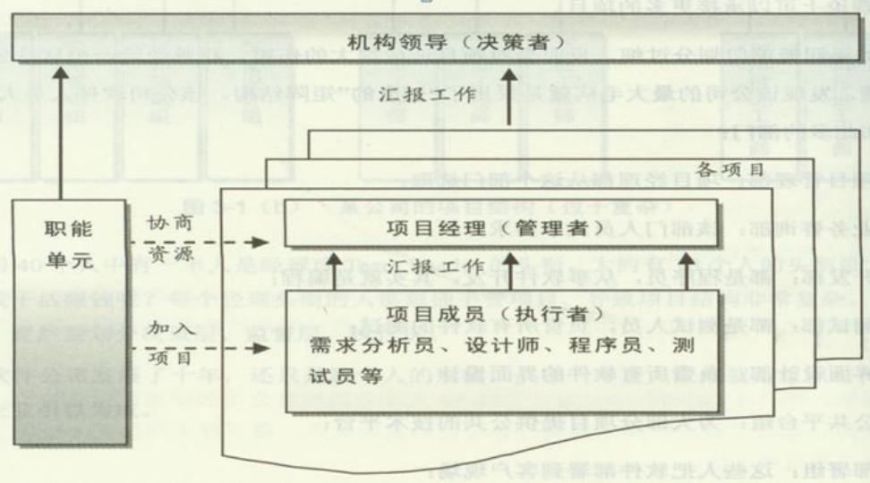

他是项目的决策者,负责立项,任命项目经理,调配本部门的人力资源。

在项目结束时,对项目进行综合评估。

参与立项过程,向机构领导争取资源。

负责 “项目规划与监控,风险跟踪和变更控制,结项管理” 过程域。对项目的需求、进度、质量、成本负最大的责任。

在项目结束时,对本项目进行自我评估,对项目成员的业绩进行评估。

参与客户需求调研,分析需求,撰写需求文档。

参与需求文档,将需求准确地传达给客户和其他项目成员。

根据需求,设计软件系统架构,撰写设计文档。

参与设计评审,将设计方案准确地传达给客户和其他项目成员。

根据需求,设计用户界面原型,不断优化。

建设公共界面库,便于其他人员复用。

对自己承担的模块进行 “设计、编程、调试”,对进度和质量负责。

对所有源代码进行配置管理。

根据计划进行测试,使用Bug跟踪工具,及时将测试信息反馈给相关负责人。

测试工程师及时将共性的质量问题汇报给项目经理。

### 3.5 自主研发产品的立项流程

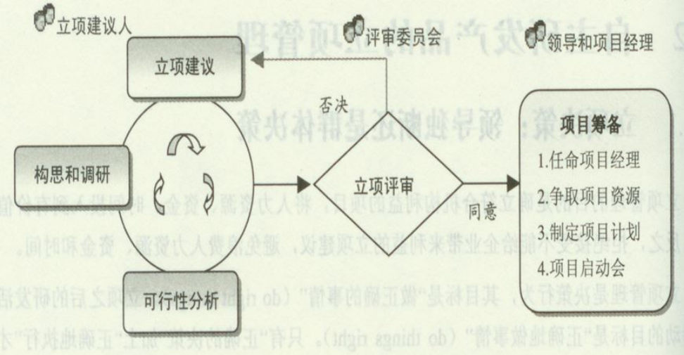

| 关键活动 | 主要工作成果 | 责任人 |
| --- | --- | --- |
| 产品构思和调研 | 《产品构思和调研报告》 | 立项建议人 |
| 可行性分析 | 《可行性分析报告》 | 立项建议人 |
| 立项建议 | 《立项建议书》 | 立项建议人 |
| 立项评审 | 《立项评审检查表》 | 立项评审委员会 |
| | 《立项评审报告》 | 机构领导 |
| 项目筹备 | 《项目总体计划》 | 项目经理 |
| | | 机构领导 |

**产品构思**

(1)产品的主要功能是什么

(2)产品如何开发

(3)谁购买和使用产品

(4)如何销售

**调研**

(1)市场调查

(2)政策调查

(3)同类产品调查

(4)竞争对手调查

(5)用户调查

**调查方式**

(1)从 Internet 上搜查相关资料

(2)从出版物中提取信息

(3)与用户交谈

(4)向用户群体发调查问卷

(5)与同行和专家交谈,听取他们的意见

**产品介绍**

市场需求产品的短期目标和长期目标产品的技术方案Make-or-Buy分析项目估算(人员、经费、设备等)项目开发计划产品营销计划

**评审准备**

**举行评审会议**

**机构领导终审**

立项建议人把《立项建议书》、《可行性分析报告》、《产品构思和调研报告》等材料递交给机构领导,申请立项评审。

机构领导根据项目的特征组建相应的立项评审委员会,并确定主席。一般地,立项评审委员会由机构领导、各级经理、市场人员、技术专家、财务人员等组成。主席应当具备比较丰富的评审经验,能够控制评审会议的进程。主席除了主持评审会议之外,还要负责撰写《立项评审报告》。

主席确定评审会议的时间、地点、设备和参加会议的人员名单(包括评委,立项建议小组,旁听者等),将评审材料发给所有评审委员。

评审委员们必须在举行评审会议之前阅读完毕相关材料,并及时与立项建议人(或小组)交流。

评审委员会按照计划召开立项评审会议。主席宣讲本次评审会议的议程、重点、原则、时间、限制等。

立项建议人(或小组)陈述《立项建议书》的主要内容。各评审委员提出疑问,立项建议人(或小组)解答。双方应当对有争议的内容得出一致的处理意见。

每个评审委员根据“立项评审检查表”认真地评估该项目。主席汇总所有评审委员的评审意见,填写《立项评审报告》,评审会议结束。

主席将《立项评审报告》递交给机构领导。机构领导在《立项评审报告》中签注最终审批意见。一般地,机构领导拥有一票否决权。

如果机构领导的终审结论与评审委员会的结论“一致”,则机构领导和评审委员会共同分担立项评审工作的责任。如果机构领导的终审结论与评审委员会的结论“相反”,机构领导可以行使 “一票否决权”,则机构领导应当对立项评审工作负全部责任。

如果机构领导同意立项,那么进入下一步“项目筹备”。

不论是否同意立项,评审者都可以给出建议,帮助立项建议人改进《立项建议书》或者更好地进行项目筹备。

### 3.6 合同项目的立项流程

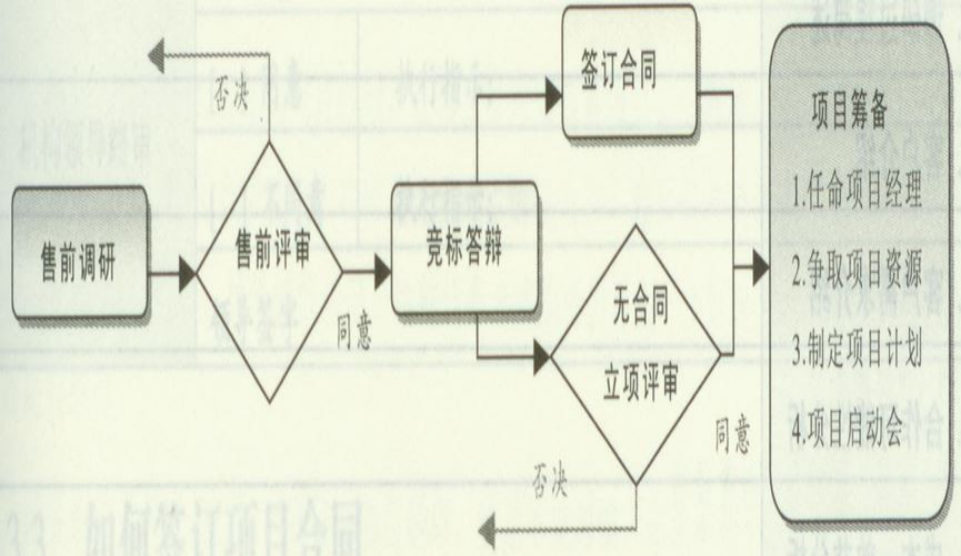

| 关键活动 | 主要工作成果 | 责任人 |
| --- | --- | --- |
| 售前调研 | 《售前调研报告》 | 营销人员和机构领导 |
| 售前评审 | 《售前评审报告》 | 营销人员和机构领导 |
| 合同竞标 | 《投标书》 | 营销人员和项目人员 |
| 签订合同 | 《项目合同》 | 机构领导 |
| 无合同立项评审 | 《无合同立项评审报告》 | 机构领导 |
| 项目筹备 | 《项目任务书》 | 机构领导和项目经理 |

### 3.7 结项管理

| 关键活动 | 主要工作成果 | 责任人 |
| --- | --- | --- |
| 申请结项 | 《申请结项申请书》 | 项目经理 |
| 结项评估 | 《结项评估报告》 | 机构领导 |
| 关闭项目 | 《项目工作总结》 | 所有项目成员 |

正常情况下,当项目开发工作结束时,项目经理撰写《结项申请书》,并递交给机构领导。

机构领导接收《结项申请书》之后,请公司内相关人员(财务人员、市场人员等)共同进行结项评估:

(1) 清算项目的资产(如资金、设备等)。项目剩余的资金应当被公司回收,设备应当重新利用。如果发现非法资产流失情况,应当及时告知机构领导,由领导处理。

(2)对照《项目任务书》评估任务的完成状况(如进度、质量)。与项目成员交流,发掘可以重复利用的知识财富,给出应用建议。

(3)评估该项目的价值,例如市场价值、成本效益、技术积累、客户满意度等。

机构领导汇总评估意见,撰写《结项评估报告》。

所有项目成员撰写工作总结(不限制格式),在公司范围内共享经验教训,项目成员及时将工作移交给维护人员(如果有的话)。

该项目的人力资源和设备资源将被释放,可用于新的项目。

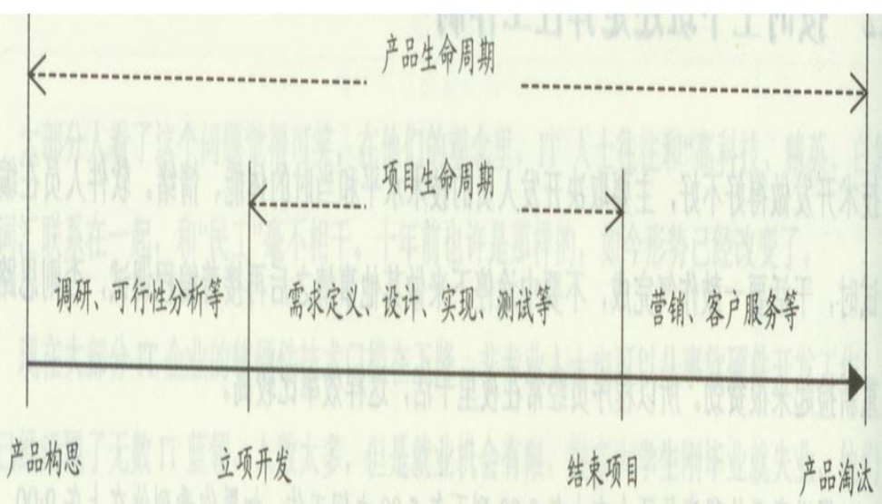

<a id="chapter-4"></a>

## 4. 需求分析与系统建模

### 4.1 需求的定义、分类与层次

需求描述用户要解决的问题、系统必须具备的能力，以及应遵守的性质和限制。需求分析关注目标系统“需要做什么”，先形成需求，再据此设计实现方案。

**按描述对象区分**

| 类型 | 面向对象 | 表达重点 |
| --- | --- | --- |
| 用户需求 | 用户及其管理人员 | 功能、操作方式、界面、报表、业务范围、流程和应用目标；采用易于确认的自然语言与直观图表 |
| 系统需求 | 开发者及用户方技术人员 | 对功能、性能、数据、接口和约束作技术规格定义，作为设计的起点 |

用户需求可以由用户提出，也可以通过调查和沟通挖掘。分析人员应全面理解请求，判断其合理性与可行性，再由相关人员审查确认。

**按需求内容区分**

| 类别 | 内容 |
| --- | --- |
| 功能需求 | 系统提供哪些服务，如何响应输入，在正常、特殊及异常条件下如何行动，以及明确禁止的行为 |
| 非功能需求 | 性能、可靠性、可用性、安全性、资源与时间约束、标准和设计实现限制 |
| 数据需求 | 输入、输出、处理过程中的数据，以及持久保存的数据 |

性能需求应尽量用响应时间、吞吐量、存储容量等指标表达。非功能需求往往影响整个系统，不能只逐个检查功能是否存在。

**按组织层次区分**

高层领导关注战略决策，中层管理关注查询统计，基层人员关注实时业务操作，三者构成需求金字塔。需求文档应覆盖各层次，并包含外部接口、业务规则及质量属性。

需求工程包括需求开发与需求管理：前者形成高质量的需求，后者控制基线、变更、状态与追踪关系。具体活动见下一节。

### 4.2 需求工程过程、文档、验证与管理

需求工程的结果应成为用户、开发、测试和项目管理共同使用的基线。分析人员需要理解业务与数据流程，建立业务、功能、性能、数据及接口模型，再通过评审获得用户确认。早期需求错误会传播到设计、实现和验收阶段，因此需求获取与确认必须受到持续关注。

**需求开发流程**

1. 调查目标系统的环境与业务，评估经济、技术和操作可行性。
2. 识别用户类别、实际任务与目标，区分用户需求、功能需求、业务规则、质量属性和实现建议。
3. 分析信息流、结构、接口与限制，处理遗漏、冲突、不合理请求和潜在需求。
4. 分配系统级需求，确定优先级，编写规格说明和分析模型。
5. 评审并验证需求，获得确认，建立基线。

**两类关键文档**

| 文档 | 读者与用途 | 主要内容 |
| --- | --- | --- |
| 用户需求报告 | 让用户确认目标；作为共同工作、测试与验收的依据 | 运行环境、业务流程、业务功能、性能和业务接口 |
| 需求分析规格说明书 | 指导开发、测试和设计；进一步技术化、定量化 | 业务、功能、数据与接口模型，实体、属性、关系及相关约束 |

规格说明可按以下框架组织：引言与范围；产品概述、用户和环境；外部接口；系统特性及功能需求；非功能需求、质量属性和业务规则；其他需求；词汇表、分析模型与待定问题。

**质量检查与验证**

- 正确、必要、可行，并为需求划分优先级。
- 完整、一致、无二义性，避免缺项、冲突和模糊措辞。
- 可理解、可修改，并尽量独立于具体设计方案。
- 可验证、可量化，使测试人员能够判断是否满足需求。
- 每项需求拥有唯一标识，能够追踪到设计、源代码、测试用例及变更记录。

验证还应检查需求的有效性、完备性、现实性与可检验性。服务器能力、并发用户数和平均响应时间等应给出可测指标。

**需求变更管理**

建立变更选择、分析和决策流程，设置相应的变更控制责任或委员会。收到变更后，分析影响、决定是否实施，跟踪受影响的工作产品，更新需求基线、控制文档及项目计划，并重新协商承诺。需求数据库记录各项状态；定期统计新增、修改和删除数量，用于观察稳定性。需要时采用需求管理工具。

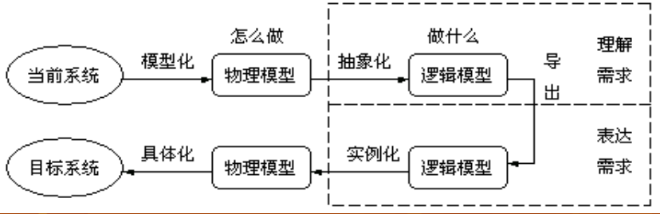

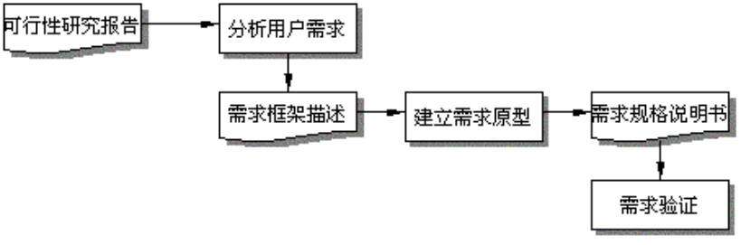

### 4.3 需求获取与迭代

需求获取是开发者与用户共同提取、澄清和确认需求的过程。困难主要来自需求不断变化、表达模糊、业务不够规范，以及双方理解存在差异。需求规约进一步消除二义性和不一致性，将确认的需求写成系统化的规格说明。

三个分析原则是：划分整体与部分，抽象一般与特殊，从多个视图观察问题。

**调查清单**

| 方面 | 需要澄清的问题 |
| --- | --- |
| 物理环境 | 安装地点是否集中，温湿度、电磁干扰等限制 |
| 接口 | 与其他系统的输入输出、数据格式、存储介质 |
| 用户 | 用户类别、职责、权限、培训与误操作风险 |
| 功能 | 执行哪些业务、何时执行，修改维护与升级时机，速度和吞吐量限制 |
| 文档 | 需要哪些文档，读者是谁 |
| 数据 | 格式、频率、准确性、计算精度、流量与保存期限 |
| 安全 | 访问控制、数据隔离、程序隔离、备份频率与异地保存、物理防护 |
| 资源 | 设备、人员、技能、空间、电力、环境保障、时间表与投资限制 |
| 质量保证 | 可靠性、错误检测与隔离、恢复时间、维护范围、资源效率及可移植性 |

**获取方法比较**

| 方法 | 做法 | 优点 | 局限或注意事项 |
| --- | --- | --- | --- |
| 研究资料 | 阅读法规、市场资料、计划、经营分析、合同、账单和报表 | 了解经营与信息处理方式 | 资料偏静态和历史，需与其他方法结合 |
| 问卷调查 | 确定事实和对象，选择开放或固定格式，设计、发放、回收并整理 | 覆盖多人，成本低，便于归纳，可保护隐私 | 回答质量难控制，不利于发现模糊和隐含需求 |
| 用户访谈 | 选择对象，准备内容与时间安排，访谈记录经对方确认后整理 | 能自由沟通、挖掘深层需求、使用个性化问题 | 依赖经验与技巧，访谈及整理耗时 |
| 实地观察 | 明确内容、地点、周期并获得许可，事先通知，观察与记录 | 真实理解复杂流程 | 特定时段未必代表常态，耗时；不要打断工作或预设结论 |

需求获取会反复迭代，每次提高质量和细节程度。迭代也可能推翻此前的设计实现，应在项目时间与资源约束下管理这类风险。

### 4.4 需求分析的必要性与常用方法

在需求中会存在大量的错误,这些错误若未及时发现和更正,会引起软件开发费用增加、软件质量降低;严重时,会造成软件开发的失败。在对以往失败的软件工程项目进行失败原因分析和统计的过程中发现,因为需求不完整而导致失败的项目占13.1%,缺少用户参与导致项目失败占12.4%,需求和需求规格说明书更改占8.7%。可见约三分之一的项目失败都与需求有关。要尽量避免需求中出现的错误,就要进行详细而深入的需求分析。可见需求分析是一个非常重要的过程,它完成的好坏直接影响了后续软件开发的质量。

(1)功能分解方法

功能分解方法是将一个系统看成是由若干功能模块组成的,每个功能又可分解为若干子功能及接口,子功能再继续分解,即功能、子功能和功能接口成为了功能分解方法的3个要素。功能分解方法采用的是自顶向下、逐步求精的理念。

(2)结构化分析方法

结构化分析方法是一种从问题空间到某种表示的映射方法,其逻辑模型由数据流图和数据词典构成并表示。它是一种面向数据流的需求分析方法。它主要适用于数据处理领域问题。

(3)信息建模方法

模型是用某种媒介对相同媒介或其他媒介里的一些事物的表现形式。从一个建模角度出发,模型就是要抓住事物的最重要方面而简化或忽略其他方面。简而言之,模型就是对现实的简化。建立模型的过程,称为建模。

建模可以帮助理解正在开发的系统,这是需要建模的一个基本理由。并且,人对复杂问题的理解能力是有限的。建模可以帮助开发者缩小问题的范围,每次着重研究一个方面,进而对整个系统产生更加深刻的理解。可以明确地说,越大、越复杂的系统,建模的重要性也越大。

信息建模方法常用的基本工具是E-R图,其基本要素由实体、属性和关系构成。它的核心概念是实体和关系,它的基本策略是从现实中找出实体,然后再用属性对其进行描述。

面向对象的分析方法的关键是识别问题域内的对象,分析它们之间的关系,并建立3类模型,它们分别是描述系统静态结构的对象模型、描述系统控制结构的动态模型,以及描述系统计算结构的功能模型。其中,对象模型是最基本、最核心、最重要的。面向对象主要考虑类或对象、结构与连接、继承和封装、消息通信,只表示面向对象的分析中几项最重要特征。类的对象是对问题域中事物的完整映射,包括事物的数据特征(即属性)和行为特征(即服务)。

### 4.5 结构化分析思想与模型

**结构化分析方法概述**

**结构化分析思想**

结构化是把软件系统的功能当作一个大模块,根据分析与设计的不同要求,进行模块分解或者组合。

基本思路就是把整个系统开发过程分成若干阶段,每个阶段进行若干活动,每项活动应用一系列标准、规范、方法和技术,完成一个或多个任务,形成符合需求的软件产品(成果)。

采用“自顶向下,逐步求精”的方式,X系统被分解成3个子系统:

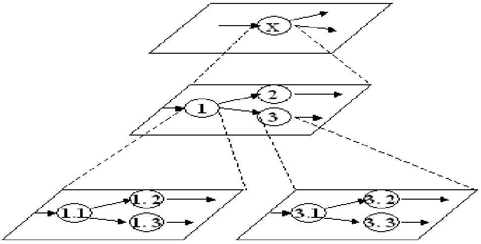

**结构化分析方法**

指导性原则:

在开始建立分析模型之前先理解问题,而不应急于求成,甚至在问题未被很好地理解之前,就产生了一个解决错误问题的软件;

开发模型,使用户能够了解将如何进行人机交互;

记录每个需求的起源和原因,这样能有效地保证需求的可追踪性和可回溯性;

使用多个需求分析视图,建立数据、功能和行为模型。

给需求赋予优先级,优先开发重要的功能,提高开发生产效率;

努力删除含糊性。

结构化方法的局限性:

不提供对非功能需求的有效理解和建模;

不提供对用户选择合适方法的指导,也没有对方法适用的特殊环境的忠告;

往往产生大量文档,系统需求的要素被隐藏在一大堆具体细节的描述中;

产生的模型不注意细节,用户总觉得难以理解,因而很难验证模型的真实性。

结构化分析时一般使用以下工具来描述系统。

(1)数据流程图(Data Flow Diagram,DFD)

(2)数据字典(Data Dictionary,DD)

(3)结构化语言

(4)判定表

(5)判定树

### 4.6 数据流图 DFD

**数据流程图**

**数据流程图的基本成份**

1.数据流

2.加工

3.数据存储

4.源点和终点

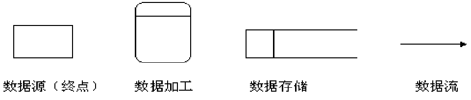

**数据流图的绘制**

1.数据流程图的绘制步骤

(1)找出系统的输入和输出

(2)画数据流程图的内部

(3)为每一个数据流命名

(4)为加工命名

**财务处理系统数据流程顶图**

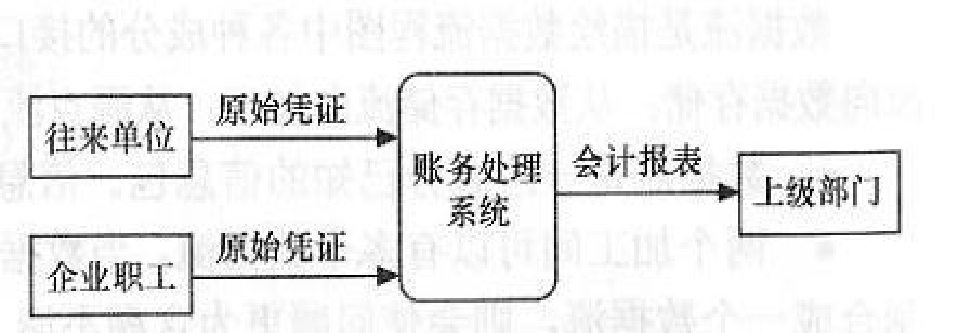

**会计账务处理系统的数据流程图**

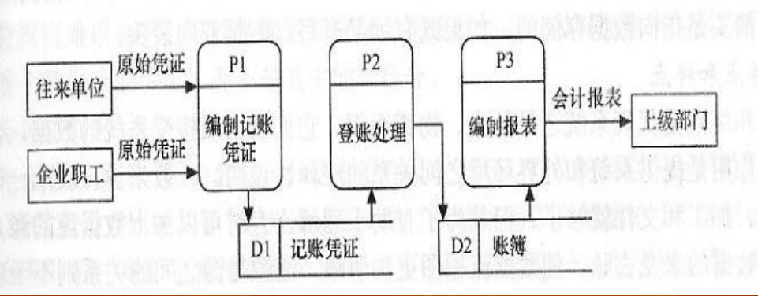

2.分层数据流程图

(1)组成顶层数据流程图描述了整个软件系统的作用范围,对系统的总体功能、输入和输出进行了抽象,反映了系统和环境的关系。

中间层次的数据流程图是通过分解高层数据流和加工得到的。

低层次数据流程图通常有很多中间层,甚至7~9层。这种分解可以不断重复,直到新的数据流程图中每个数据加工的功能明确、相关的数据流被严格定义为止。

(2)分层原则

**父图与子图的关系**

**平衡规则**

**分层程度**

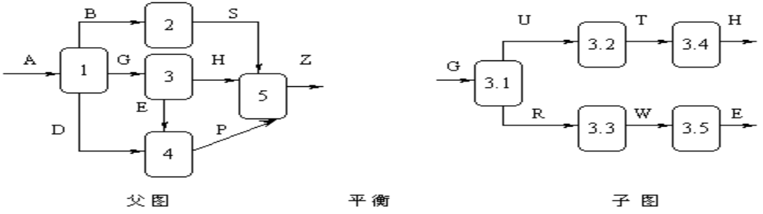

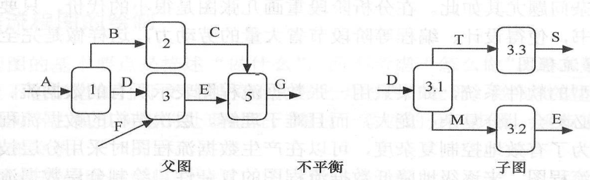

**数据流程图的特征与用途**

用途:

可以依靠数据流程图来实现从用户需求到系统需求的过渡;

数据流程图可以按照功能将系统分解为许多子系统,用做开发者与用户之间的信息交流工具。

数据流程图的特点:

**抽象性**

**概括性**

**分层数据流程图举例**

**教学管理数据流程顶图**

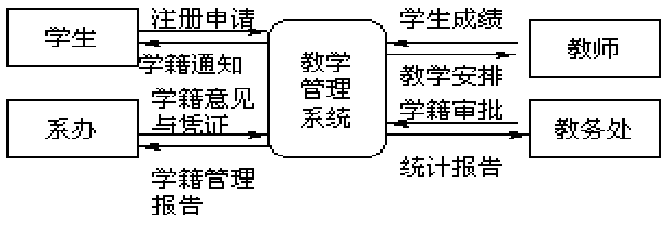

**教学管理数据流程中图**

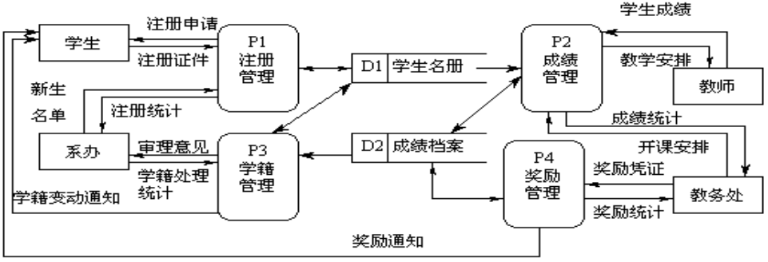

**学籍管理数据流程底图**

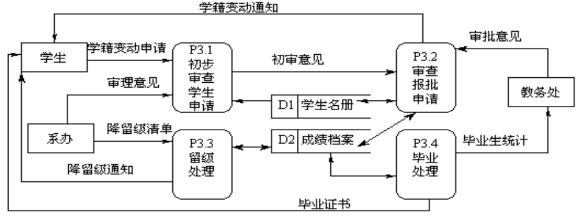

### 4.7 数据字典

**数据字典**

**数据字典的定义与用途**

1.数据字典的定义:数据字典是关于数据信息的集合,是数据流程图中所有元素严格定义的场所。

2.数据字典的用途

数据流程图和数据字典一起构成了系统的逻辑模型;

有助于改进不同的开发人员或不同的开发小组之间的通信;

是存储文件或数据库设计的基础;

在实施阶段,还可参照数据字典描述数据。

3.数据字典的种类

**数据项**

**数据流**

数据存储(文件)

**加工**

**数据字典的定义方法**

数据字典的定义式可使用的符号:

| 符号 | 含义 |
| --- | --- |
| = | 由....组成(定义为....) |
| + | 和(顺序关系的连接)例,x = a+b 表示X由a与b组成 |
| {} | 重复例,x ={a+b} 表示X是由零次或多次重复的a与b组成 |
| [/] | 可选择(选一个)例,x =[a/b] 表示X由a或b中选择一个 |
| () | 可选(也可不选)例,x =(a) 表示a是任选的,可在X中出现0次或1次 |
| ** | 注释 |

**数据流条目**

数据流名:注册申请简述:每学期开学需要学生注册登记别名:无组成:注册申请 = 学号+姓名+入学日期+注册日期数据量:2000次/开学一周峰值:第一周每天下午1:00到5:00点有300次注释:到2013年还将增加到3000人

文件(存储)条目

文件名:成绩档案

简述:包括所有在册学生各门课程的考试成绩和学分信息别名:无组成:成绩档案 = 学号+姓名+课程名称+考试成绩+学分数据量:2000*6次,考试结束一周内峰值:学期最后一周每天下午1:00到5:00点有2000*6次注释:到2013年还将增加到3000人

**数据项条目**

文件名:学号简述:每个在校学生的学生编号别名:无组成:学号 = XX + XX + XXX年级专业序号值类型:7位数字取值范围:

注释:到2013年还将增加到3000人

### 4.8 加工逻辑：结构化语言、判定表与判定树

**加工逻辑的描述方法**

1.结构化语言

例:计算某学生的考试成绩优秀率和中以下的比率若成绩优秀比率大于70%若表现优良则获得一等奖学金否则获得二等奖学金若成绩优秀比率小于70%且大于50%若表现优良则获得二等奖学金否则获得三等奖学金

2.判定表

判定表的构造步骤:

列出所有基本条件,填写判定表的左上限。在本例中,奖学金的发放依据三个条件:成绩优秀比率、成绩中下比率、表现。

列出所有的基本操作,填写判定表的左下限。在本例中,奖学金的发放分为4个等级。

| 条件所指对象 | 各种条件的组合 |
| --- | --- |
| 所有操作 | 在对应的条件组合下,某个操作是否要执行 |

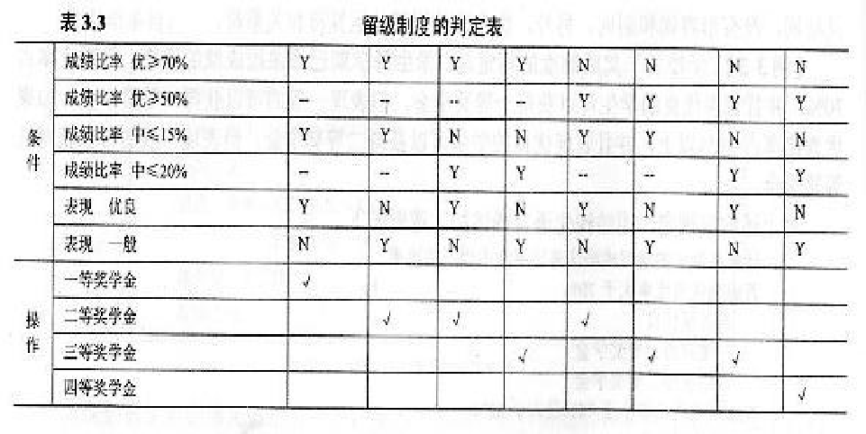

计算所有可能的条件组合,确定规则个数,填写判定表的右上限。

将每一组合指定的操作,添入右下限相应的位置。

简化规则,合并及删除等价的操作。

合并原则是:找出操作在同一行的,检查上面的每一个条件是否影响该操作的执行,如果条件不起作用,则可以合并等价操作,否则不能简化。

如果对判定表进行了化简,就需要将化简后的结果重新排列。

3.判定树

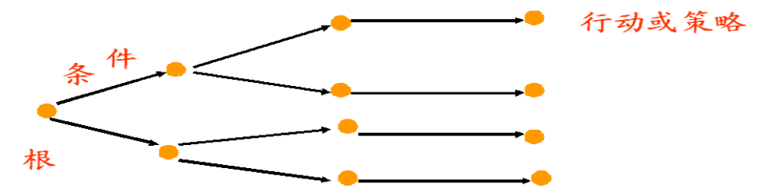

**奖学金发放判定树**

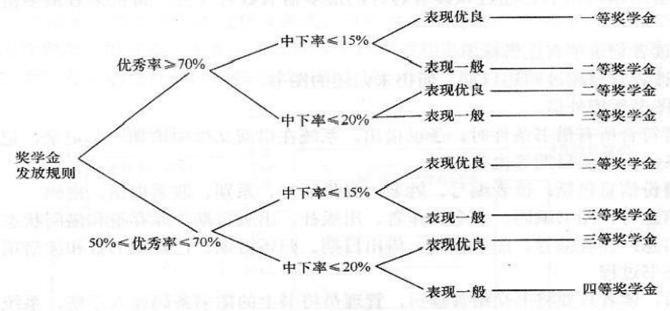

### 4.9 结构化分析案例与需求任务

**图书借阅管理系统顶层数据流图**

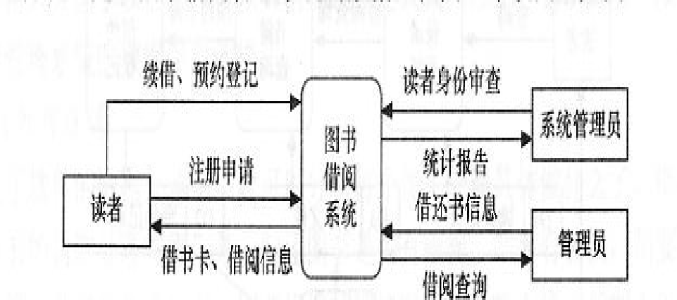

**图书借阅管理系统中层数据流图**

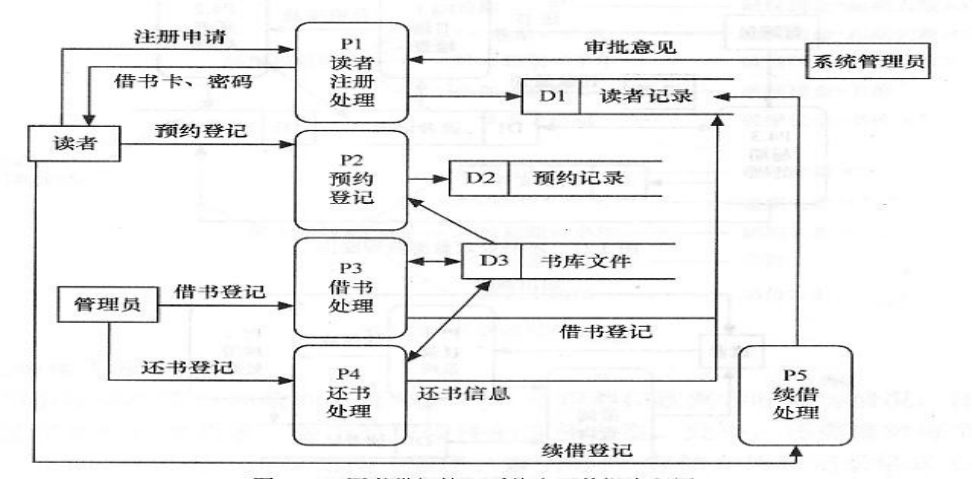

**注册处理数据流程底图**

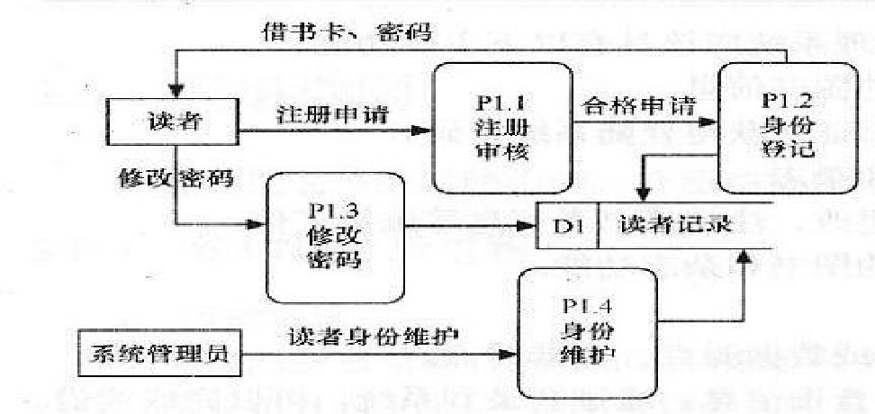

**借书处理数据流程底图**

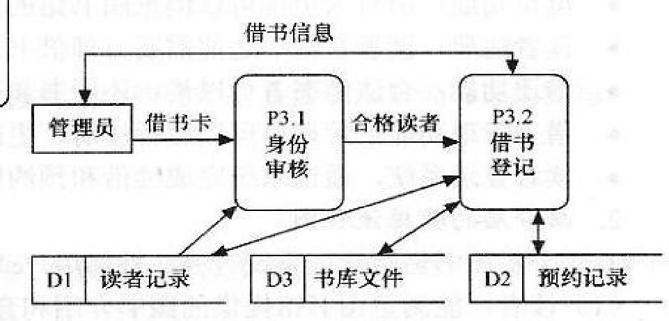

**预约处理数据流程底图**

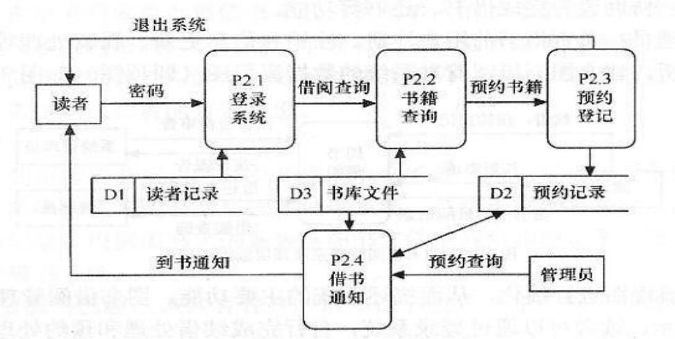

**还书处理数据流程底图**

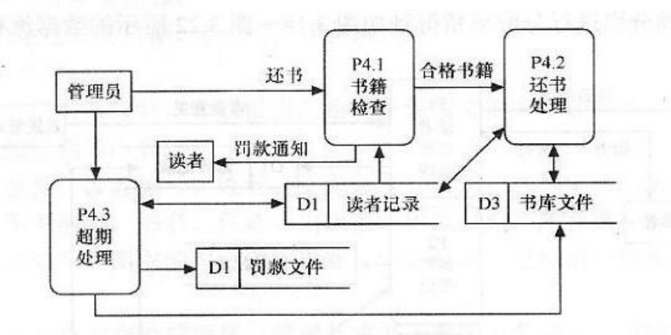

**续借处理数据流程底图**

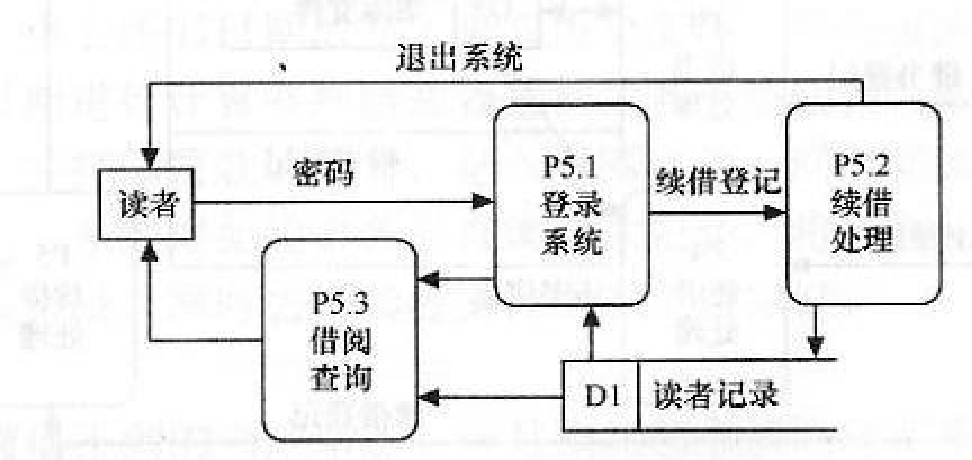

**罚款规则判定树**

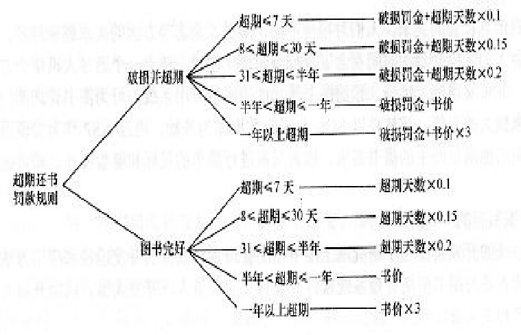

根据信息系统的定义与内容,信息系统的需求分析是最难的,也最具有代表性,这里,通过“图书馆信息系统”的例子,来说明需求分析所需要完成的任务,是再好不过的了。

第1项任务:画出目标系统的组织结构图,列出各部门的岗位角色表,即组织机构模型,如下表所示。

| 序号 | 单位名称 | 单位职责 |
| --- | --- | --- |
| 1 | 馆长室 | 全馆业务的组织领导,全馆信息的查询 |
| 2 | 采编部 | 图书的采购、分编 |
| 3 | 藏书部 | 图书的入库、保存、迁移、出库 |
| 4 | 借书处 | 图书的借书、还书 |
| 5 | 阅览室 | 杂志和书报的开架阅览与借还管理 |
| 6 | 读者服务部 | 读者信息管理、读者网上图书查询 |

| 岗位编号 | 岗位名称 | 所在部门 | 岗位职责 | 相关的业务 |
| --- | --- | --- | --- | --- |
| 1011 | 采购员 | 采编部 | 图书采购、进货合同的签订、出版社的选择 | 进货、合同管理 |
| 1012 | 分编员 | 采编部 | 图书分编 | 协助入库 |
| ...... | ...... | ...... | ...... | ...... |
| ...... | ...... | ...... | ...... | ...... |

第2项任务:画出目标系统的业务操作流程图,即业务模型。它包括物流、资金流、信息流,重点是业务操作的流水步骤。

业务流程图的画法多种多样,各软件组织可根据自身的习惯和特点,制定一套图形规则,在本组织内统一遵守。业务流程图的制作工具,可以是微软的Word 、Visio。

所谓“直式业务流程图”,就是用图的横向坐标表示企业的部门岗位,用图的纵向坐标表示企业的作业流程,用图标画出企业的业务流程。

第3项任务:画出目标系统的数据流图DFD,即单据和报表的流图,掌握业务规则,获得初步数据模型(真正的数据模型是E -R图加上相应的数据字典)。

数据流图中要突出单据流,分清不同单据之间的先后流动次序,以及同一单据中的不同数据项的先后流动次序。数据流图的画法多种多样,各软件组织可根据自身的习惯和特点,制定一套图形规则,在本组织内统一遵守。数据流图的制作工具,可以是微软的桌面办公工具Office(Word, Visio),也可以是Power Designer中的数据流图绘制工具Process Analyst。

完整的数据流图还包括定义数据字典。数据字典是指对数据流图中出现的数据源点和终点、数据加工、数据流向、单据、报表等数据名字进行定义与解释。

对于所有的单据或报表,均要收集并整理。将单据或报表的名称、用途、使用单位、制作单位、频率、高峰时流量,及每个数据项的名称、类型、长度、精度、算法等,都要全部列出,形成原始单据和输出报表的表格。

对每一张单据或报表,都必须用两张表格来描述,其中第一张表格描述单据或报表的公共信息,即单据或报表的“头尾”信息。第二张表格描述单据或报表的数据项信息,即单据或报表的“体”。

| 单据名称 | |
| --- | --- |
| 用途 | |
| 使用单位 | |
| 制作单位 | |
| 频率 | |
| 高峰时数据流量 | |

| 序号 | 数据项中文名 | 数据项英文名 | 数据项类型、长度、精度 | 数据项算法 |
| --- | --- | --- | --- | --- |
| 1 | | | | |
| 2 | | | | |
| 3 | | | | |

第4项任务:列出目标系统的功能点列表,即功能模型。(注:有时将性能模型、界面模型和接口模型的内容都合并到功能模型之中。)功能模型也可以用Use Case图表示,也可以用功能点列表描述。

“图书馆信息系统”的功能点列表,如下表所示。其中“系统响应”这一项,表示将来的目标系统所要做的工作。需要指出,功能列表不是唯一的,也没有标准答案。

| 编号 | 功能名称 | 使用部门 | 使用岗位 | 功能描述 | 输入 | 系统响应 | 输出 |
| --- | --- | --- | --- | --- | --- | --- | --- |
| 1 | 图书入库信息录入 | 分编室 | 分编员 | 给图书分类编号,并录入系统 | 图书编号、条形码、书名、作者、译者、ISBN、出版社、价格、所放位置、现存量、库存总量、入库日期、操作员、内容简介、借阅次数、是否注销 | 录入到图书信息表 | 完成图书的入库 |
| 2 | 读者信息录入 | 借阅处 | 管理员 | 录入读者基础信息 | 读者编号、姓名、性别、出生年月、证件名称、证件号码、电话、登记日期、借书卡条形码、操作员、是否挂失、借阅次数、网上注册姓名、网上注册口令、是否注销 | 录入到读者信息表 | 打印并制作读者“借书卡” |

| 3 | 图书借阅信息录入 | 借阅处 | 管理员 | 录入读者借阅图书信息 | 图书编号、读者编号、借阅日期、应还日期、续借次数、押金、操作员 | 录入到图书借阅信息表,该图书的“现存量”减1 | 从书架上取书,将图书交给读者 |
| --- | --- | --- | --- | --- | --- | --- | --- |
| 4 | 图书归还信息录入 | 借阅处 | 管理员 | 录入读者归还图书信息 | 图书编号、读者编号、归还日期、退还押金、操作员 | 录入到图书归还信息表,该图书的“现存量”加1 | 图书上架 |
| 5 | 图书罚款信息录入 | 借阅处 | 管理员 | 录入读者罚款图书信息 | 图书编号、读者编号、罚款日期、应罚金额、实收金额、是否交款、操作员 | 录入到图书罚款信息表 | 打印罚款收据,收点现金 |
| 6 | 图书注销信息录入 | 分编室 | 分编员 | 录入注销图书信息 | 图书编号、注销数量、注销日期、操作员 | 录入到图书注销信息表 | 打印图书注销信息,并请馆长签字 |

| 7 | 查询读者信息 | 借阅处 | 管理员 | 录入读者信息 | 读者编号 | 按“读者编号”在读者信息表和罚款信息表中查询该读者信息 | 显示“读者编号、姓名、电话、罚款次数” |
| --- | --- | --- | --- | --- | --- | --- | --- |
| 8 | 查询图书信息 | 借阅处 | 管理员 | 录入查询图书信息 | 图书名称/作者姓名 | 按照输入的组合条件,在“图书信息表”中检索该图书 | 显示“图书名称、作者姓名、借阅情况、内容简介” |
| 9 | 读者网上注册 | 网上读者 | 网上读者 | 录入读者网上注册信息 | 网上注册姓名、网上注册口令、读者编号 | 将“网上注册姓名、网上注册口令”存入到读者信息表中 | 显示“注册成功”或“注册失败” |

订购单头:订购单编号、订购金额、订购日期、验收日期、出版社地址、出版社电话、操作员

| 10 | 读者网上登录 | 网上读者 | 网上读者 | 录入读者网上登录信息 | 网上注册姓名、网上注册口令 | 核对“网上注册姓名、网上注册口令” | 显示“登录成功”或“登录失败” |
| --- | --- | --- | --- | --- | --- | --- | --- |
| 11 | 读者网上查询图书信息 | 网上读者 | 网上读者 | 录入读者网上查询图书信息 | 图书名称/作者姓名 | 按照输入的组合条件,在“图书信息表”中检索该图书 | 显示“图书名称、作者姓名、借阅情况、内容简介” |
| 12 | 图书订购 | 采购部 | 采购员 | 录入订购图书信息 | 订购明细:征订编号、订购数量、订购单价 | 录入到图书订购单头和订购明细两张信息表 | 打印订购单,馆长签字确认,邮寄出版社 |

| 13 | 图书借还统计 | 馆长办公室 | 馆长 | 统计图书资源的利用情况 | 统计起止日期 | 统计前100本热门图书的借阅情况、后100本冷门图书的借阅情况、全部图书的平均借阅情况 | 显示“前100本热门图书的借阅情况、后100本冷门图书的借阅情况、图书的平均借阅情况” |
| --- | --- | --- | --- | --- | --- | --- | --- |
| 14 | 补办借书卡 | 借阅处 | 管理员 | 作废原借书卡并补办新借书卡 | 录入读者姓名、工作证名称、工作证号码 | 在读者信息表中查询到读者的基本信息,作废旧借书卡号 | 打印并制作读者新的“借书卡” |

第5项任务:列出系统的性能点列表,即性能模型。

“图书馆信息系统”的性能点列表,如下表所示。

需要指出,性能列表不是唯一的,也没有标准答案。

| 编号 | 性能名称 | 使用部门 | 使用岗位 | 性能描述 | 输入 | 系统响应 | 输出 |
| --- | --- | --- | --- | --- | --- | --- | --- |
| 1 | 读者网上查询图书信息响应时间 | 网上读者 | 网上读者 | 查某本书小于1秒 | 图书名称/作者姓名 | 按照输入的组合条件,进行模糊查询 | 显示“图书名称、作者姓名、是否借出、内容简介” |
| 2 | 后台查询读者信息响应时间 | 图书馆借阅部 | 借阅操作员 | 查某位读者信息小于1秒 | 读者姓名、编号 | 按照输入的组合条件,进行查询 | 显示“读者姓名、编号、身份证号、电话、借书信息、超期借书信息、罚款次数” |
| 3 | 后台查询图书信息响应时间 | 图书馆借阅部 | 借阅操作员 | 查某本书小于1秒 | 图书名称/作者姓名 | 按照输入的组合条件,进行模糊查询 | 显示“图书名称、作者姓名、借阅情况、内容简介” |

第6项任务:列出目标系统的接口列表,即接口模型。

“图书馆信息系统”的接口点列表,如下表所示。

需要指出,接口列表不是唯一的,也没有标准答案。

(1) 凭证记录参数:凭证编号、日期、单据张数、借方合计、贷方合计;

(1) 凭证记录格式:凭证编号、凭证状态、会计期间、凭证字号、日期、单据张数、审核、过账、制单、过账状态、借方合计、贷方合计;

| 编号 | 接口名称 | 接口规范 | 接口标准 | 入口参数 | 出口参数 | 传输速率 |
| --- | --- | --- | --- | --- | --- | --- |
| 1 | 与财务系统接口 | 财务系统规定的接口规范 | 记账凭证与分录的具体格式 | (2) 分录记录参数:凭证编号、日期、借方、贷方、数量、单价、摘要。 | (2) 分录记录格式:分录编号、凭证编号、摘要、科目代码、结算号、结算日期、结算方式、借方、贷方、数量、单价。 | 一张凭证一次处理传送 |

第7项任务:确定目标系统的运行环境,即环境模型。

运行环境包括:核心计算机及网络资源(系统软件、硬件和初始化数据)的配置计划、采购计划、安装调试进度、人员培训计划等内容。

请设计出“图书馆信息系统”的运行环境。

第8项任务:目标系统的界面约定,即界面模型。

界面设计的原则是:方便、简洁、美观、一致。整个目标系统的界面风格定义要统一,某些功能模块的特殊界面要说明。例如,输入设备:键盘、鼠标、条码扫描器、扫描仪等;

输出设备:显示器、打印机、光盘刻录机、磁带机、音箱等;

显示风格:图形界面、字符界面、IE界面等;

显示方式:1024×768,640×480等;

输出格式:显示布局、打印格式等。

第9项任务:对目标系统的开发工期、费用、开发进度、系统风险等问题进行分析与评估。

对于一般企事业单位的信息系统需求分析,完成好上述任务,并与用户达成全面共识,通过评审,得到用户签字确认,就算成功了。

但是,上述任务不是教条,不能完全生搬硬套,而要根据具体问题具体分析,活学活用,举一反三。例如,对于特殊的系统,除了上述任务之外,可能还要增加其他任务,项目经理和系统分析师要严把关口,分析彻底、实事求是、灵活掌握。

【例】介绍网络游戏软件需求分析的任务。

一款网络游戏软件项目的确立,是建立在各种各样的需求上面的,这种需求往往来自于大量玩家的实际需求,或者是出于公司自身发展和实力,其中大量玩家的实际需求最为重要。

面对拥有不同知识和理解层面的游戏玩家,项目负责人对玩家需求的理解程度,在很大程度上决定了此类游戏项目的开发成败。

如何更好地了解、分析、明确玩家需求,并且能够准确、清晰地以文档的形式表达给项目开发成员,保证开发过程按照满足玩家需求为目的,是游戏项目管理者需要面对的问题。

网络游戏需求分析规格说明书,必须包含以下内容:

1. 游戏背景、类型、基本功能;

2. 游戏玩家的主界面;

3. 游戏运行的软硬件环境;

4. 游戏系统机制的定义;

5. 游戏系统的创新特性;

6. 确定游戏运营维护的要求;

7. 确定游戏服务器架设和带宽要求;

8. 游戏总体风格及美术效果标准;

9. 游戏等级及技能、物品、任务、场景等的大概数量;

10. 开发管理及任务分配;

11. 各种游戏特殊效果及其数量;

12. 项目完成的时间及进度。

在网络游戏项目的需求分析中,主要是由项目负责人来确定对玩家需求的理解程度,而玩家调查和市场调研等需求分析活动的目的,就是帮助项目负责人加深对玩家需求的理解,以便于日后在项目开发过程中,作为开发成员的依据和借鉴。

随着网络游戏投入的加大,精细的需求分析也就越来越重要,一次成功的需求分析,不仅需要项目负责人甚至是玩家等所有项目相关人员的共同努力,还和公司的能力范围有一定关系。

### 4.10 分析模型、实体关系与状态转换

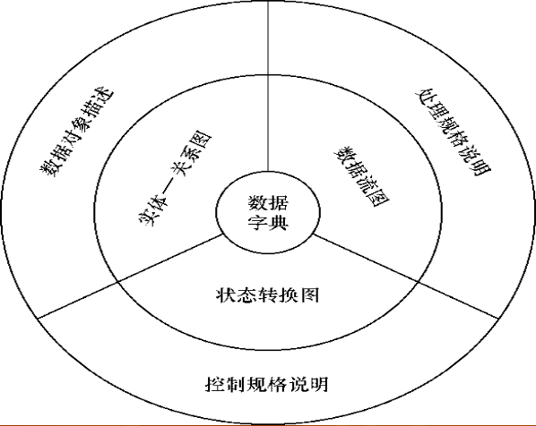

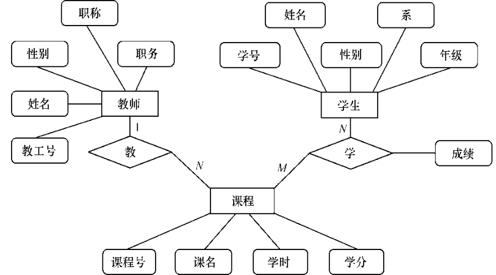

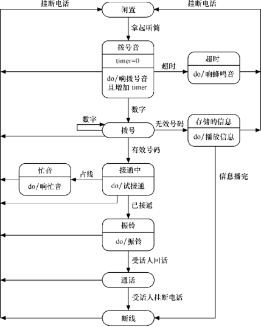

### 4.11 面向对象分析与三种模型

**面向对象方法学概述**

**面向对象技术的由来**

1986年Booch提出的面向对象分析与设计方法论(OOA/OOD)。

1991年Rumbaugh提出的面向对象模型技术(OMT)。

1994年Jacobson提出的面向对象软件工程方法学(OOSE)。

Booch、OMT和Jacobson将他们各自的对象建模方法结合到一起,提出了统一的建模语言UML(Unified Modeling Language)。

**面向对象方法概述**

主要特点:

从问题域中客观存在的事物出发来构造软件系统,用对象作为对这些事物的抽象表示,并以此作为系统的基本构成单位;

事物的静态特征(即可以用一些数据来表达的特征)用对象的属性来表示,事物的动态特征(即事物的行为)用对象的操作来表示;

对象的属性与操作结合为一体,成为一个独立的实体,对外屏蔽其内部细节(称为封装);

对事物进行分类,把具有相同属性和相同操作的对象归为一类,类是这些对象的抽象描述,每个对象是它的类的一个实例;

通过在不同程度上运用抽象原则(忽略事物之间的一些差异),可以得到较一般的类和较特殊的类。特殊类继承一般类的属性和操作,面向对象方法支持这种继承关系的描述与实现,从而简化系统的构造过程及其文档;

复杂对象可以用简单的对象作为其构成部分(称为聚合);

对象之间通过消息进行通信,以实现对象之间的动态联系;

通过关联表达对象之间的静态关系。

面向对象方法的优点与人们习惯的思维方法一致可使软件系统结构更加稳定软件具有更好的可复用性软件更加便于维护与扩充

**面向对象建模**

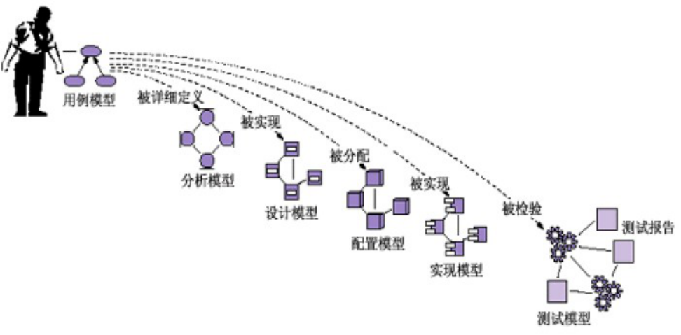

1. 用例模型:包含所有用例及其与用户之间的关系;

2. 对象模型:包含问题域涉及的类及其属性和关系,其作用是更详细地提炼用例,将系统的行为初步分配给提供行为的一组对象;

3. 设计模型:将系统的静态结构定义为子系统、类和接口,并定义由子系统、类和接口之间的协作来实现的用例;

4. 实现模型:包含构件和类到构件的映射;

5. 配置模型:定义计算机的物理节点和构件到这些节点的映射;

6. 测试模型:描述用于验证用例的测试用例。

**对象模型**

对象模型是三个模型中最关键的一个模型,它的作用是描述系统的静态结构,包括构成系统的类和对象,它们的属性和操作,以及它们之间的联系。面向对象的方法强调围绕对象而不是围绕功能来构造系统。对象模型为建立动态模型和功能模型提供了实质性的框架。

要想对一个系统了解得比较清楚,首先应当考察它的静态结构,即在某一时刻它的对象和这些对象之间相互联系的结构;然后应当考察在任何时刻对对象及其联系的改变。系统的这些涉及时序和改变的状况,用动态模型来描述。动态模型着重于系统的控制逻辑。它包括两种图,一种是状态图,一种是事件跟踪图(即顺序图)。

功能模型着重于系统内部数据的传送和处理。它是模型化三角架的第三只脚。功能模型定义“做什么”,更加直接地反映了用户对目标系统的需求。功能模型表明,通过计算,从输入数据能得到什么样的输出数据,不考虑参加计算的数据按什么时序执行。

(1)针对每个类建立的动态模型,描述了类实例的生命周期或运行周期。

(2)状态转换驱使行为发生,这些行为在数据流图中被映射成处理,它们同时与对象模型中的服务相对应。

(3)功能模型中的处理(或用例)对应于对象模型中的类所提供的服务。通常,复杂的处理(或用例)对应于复杂对象提供的服务,简单的处理(或用例)对应于更基本的对象提供的服务。有时一个处理对应多个服务,也有一个服务对应多个处理的时候。

(4)数据流图中的数据存储,以及数据的源点/终点,通常是对象模型中的对象。

(5)数据流图中的数据流,往往是对象模型中的对象的属性值,也可能是整个对象。

(6)用例图中的行为者,可能是对象模型中的对象。

(7)功能模型中的处理(或用例)可能产生动态模型中的事件。

(8)对象模型描述了数据流图中的数据流、数据存储以及数据源点 / 终点的结构。

**面向对象的基本概念**

**类和对象**

1.对象

是指问题域中某些事物的一个抽象,它反映该事物在系统中需要保存的信息和发挥的作用,它是由数据(属性)及其上的操作(也称为服务、方法或行为)组成的封装体。

可以从以下4个方面来认识对象:

(1) 从动态的观点看,对象的操作就是对象的行为。

(2)从存储角度看,对象是私有存储,其中有数据也有操作。其他对象的方法不能直接操纵该对象的私有数据,只有对象私有的方法才可操纵它。

(3)从实现机制看,对象是一个自动机,其中私有数据表示了对象的状态,该状态只能由私有的方法改变它。

(4) 在面向对象的程序设计中,对象是系统中的基本运行实体。

2.类

是指具有相同属性和操作的对象的集合,它代表一种抽象,作为具有类似特性与共同行为的对象的模板,可用来产生对象。

例如: 汽车具有运输功能,它是由车轮、发动机、车身等部分组成,这个描述适合所有的汽车。

3.实例

类是建立对象时使用的“样板”,按照这个样板所建立起来的一个个具体的对象,就是类的实例。

封装、继承和多态

1.封装

封装是指把对象的外部特征与内部实现细节分开,使得一个对象的外部特征对其他对象来说是可访问的, 而它的内部细节对其他对象是隐蔽的。

对象具有封装性的条件如下:

(1)有一个清楚的边界,所有私有数据和操作的代码都被封装在这个边界内,从外面看不见更不能访问;

(2)有确定的接口,这些接口描述这个对象和其他的对象之间相互的作用;

(3)受保护的内部实现,这个实现给出了由软件对象提供的功能的细节,实现细节能在定义这个对象的类的外面访问。

例如,我们用“售报亭”对象描述现实中的一个售报亭。它的属性是亭内各种报刊杂志的名称、定价和钱箱(总金额),它有两个服务(操作):报刊零售和货款清点。封装意味着售报亭对象是由属性和操作结合成一体的一个整体,它对外通过售报亭的窗口提供零售服务。顾客只能从这个窗口请求服务,而不能自己到亭内去拿报纸或找零。货款清点则是一个内部操作,不向客户开放。

2.继承

继承是子类自动地共享基类中定义的数据和方法的机制。

继承刻画了一般性和特殊性继承也体现了类的层次关系

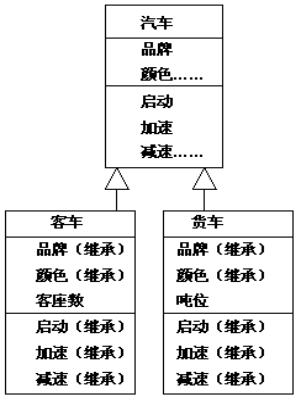

3.多态性

是指在一般类中定义的属性或操作被特殊类继承之后,可以具有不同的数据类型或表现出不同的行为。

多态性的作用在于它允许我们开发灵活的系统,我们只要指定什么应该发生,而不是它应该怎样发生,以便获得一个易修改、易变更的系统。

4.消息

消息是面向对象系统中实现对象间的通信和请求任务的操作。

5.关联泛化关系:主要表现继承机制;

聚合关系:对象间的由分解或组成所构成的关系;

关联关系表示两个类之间除泛化、聚合以外的,存在某种语义上的联系。

**面向对象的分析概述**

面向对象分析的目标是完成对所解问题的分析,解决待建的系统要做什么的问题,并建立系统的模型, 为达到这一目标, 必须完成以下任务。

(1)通过与用户沟通了解用户的基本需求;

(2)从用户的角度认识系统,建立用例模型;

(3)以基本的需求为指南,识别对象和类,包括定义属性和操作;

(4)刻画类的层次结构;

(5)标识类(对象)之间的关系;

(6)识别对象的行为和系统的工作过程;

(7)递进地重复任务(1)至(6),直至完成建立模型。

任务(2)至任务(5)刻画了待建系统的静态结构,任务(6)刻画了系统的动态行为。

**获取用户需求**

**标识对象和类**

**定义类的结构和层次**

**建立对象模型**

**建立动态模型**

**建立功能模型**

### 4.12 用例模型、关系与描述

执行者（参与者、角色）是与系统交互的外部人员、设备或其他系统。用例是系统为某个参与者完成的、可观察结果的完整功能。一个用例的具体执行称为场景或脚本。

用例应实现独立的用户目标，提供可识别的价值，并能用于后续功能检测。例如“取款”是完整目标，“输入密码”通常只是其中一个步骤。用例的规模可以不同，但不宜将流程中的每个动作都拆成一个用例。

**关系的使用**

| 关系 | 用途 |
| --- | --- |
| 包含（include） | 将多个用例重复使用的公共行为提取为单独用例 |
| 扩展（extend） | 表示基本用例在特定情况下附加的行为或变化 |
| 泛化 | 表达一般与特殊的关系，子项在继承共同内容的基础上增加特有行为 |

用例内部应集中完成一个目标，用例之间的关系应保持清晰。复杂关系可分图表达，不必将整个系统所有内容塞进一张图。

**描述模板**

记录名称、唯一编号、参与者、简述、触发器、前置条件、基本事件流、扩展或异常事件流、结束条件、后置条件，以及数据需求、业务规则与其他约束。名称通常采用动词或动宾短语。

**课件中的用例描述实例**

用例描述:

用例名称:取款前置条件:ATM机正常工作主事件流:

(1) 客户将卡插入ATM机,开始用例。

(2) ATM显示欢迎消息并提示客户输入密码。

(3) 客户输入密码。

(4) ATM确认密码有效。如果无效则执行子事件流a。如果与主机联接有问题,则执行异常事件流e。

(5) ATM提供以下选项:存钱、取钱、查询。

(6) 用户选择取钱选项。

(7) ATM提示输入所取金额。

(8) 用户输入所取金额。

(9) ATM确定该账户是否有足够的金额。如果余额不够,则执行子事件流b,如果与主机联接有问题,则执行异常事件流e。

(10) ATM从客户账户中减去所取金额。

(11) ATM向客户提供要取的钱。

(12) ATM打印清单。

(13) ATM退出客户的卡,用例结束。

子事件流a:

a1. 提示用户输入无效密码,请求再次输入;

a2. 如果三次输入无效密码,系统自动关闭,退出客户银行卡。

子事件流b:

b1. 提示用户余额不够。

b2. 返回(5),等待客户重新选择。

后置条件:结束取款事件。

执行异常事件流e的描述省略。

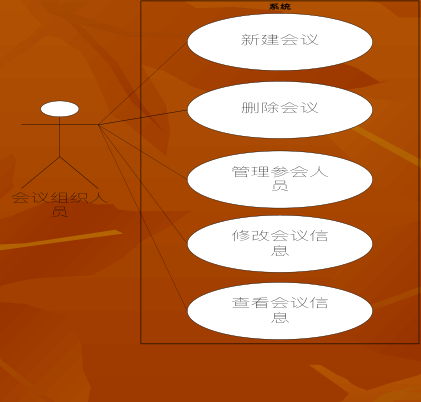

用例编号: 2

用例名称: 会前管理

用例描述: 会议组织人员设置会议的初始信息,如时间、场所、主题等。同时,会议组织人员要把相关参会人员添加到该会议下。如果会议信息有改动,会议组织人员还可以对其进行更改。

前置条件: 会议组织人员登录系统,并经过了身份验证。

后置条件: 会议和人员信息被初始化。

活动步骤:

会议组织人员登录系统。

会议组织人员新建会议。

会议组织人员录入会议的名称、场所、时间、主题、主办方等信息。

会议组织人员把相关的参会人员添加到该会议下。

扩展点:

如果参会人员身份验证失败,则用例结束。

如果实际情况有变动,会议组织人员可对会议信息进行更改。

异常处理:无。

| 编号 | 101 | 用例名称 | 用户注册 |
| --- | --- | --- | --- |
| 使用人员 | 游客 | 扩展点 | 无 |
| 输入 | 用户基本信息 | | |
| 系统响应 | 系统将用户基本信息存入数据库 | | |
| 输出 | 用户可用注册时的用户名和密码登录 | | |
| 前置条件 | 游客申请注册 | 后置条件 | 游客成功注册为会员 |
| 活动步骤 | 游客选择注册<br>系统返回注册页面<br>游客输入相应信息<br>系统验证注册信息<br>游客提交注册信息<br>系统提醒注册成功并返回首页 | | |
| 异常处理 | 游客输入用户名已注册或注册信息与系统验证不一致,系统返回注册页面并给出提示信息<br>系统异常,无法注册,给出相应信息,如网站维护中。 | | |

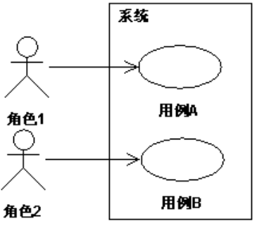

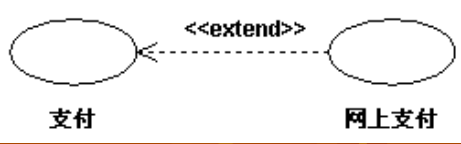

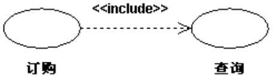

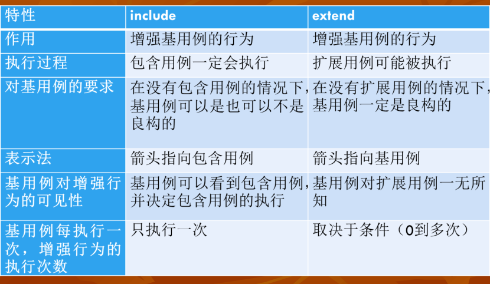

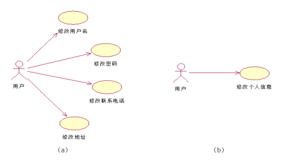

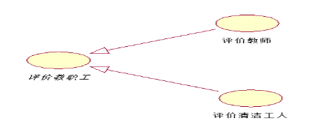

### 4.13 用例识别与建模步骤

建模按以下步骤进行：

1. **确定系统边界与参与者**：识别谁使用主要功能，谁依赖系统完成日常任务，谁负责维护管理，哪些设备、资源或外部系统参与交互，谁关心输出结果。
2. **识别用户目标**：分析各参与者需要的服务、特定任务，以及读取、创建、修改、删除和保存信息的需要；补充事件通知、输入输出及维护功能。
3. **形成基本用例**：将完整目标提炼为用例，检查功能需求是否都得到覆盖。
4. **处理公共与扩展行为**：按上一节的关系规则组织用例，避免重复描述。
5. **建立用例图与文字说明**：图表达参与者和用例的联系，文字记录详细流程和约束；必要时增加非功能需求注解。
6. **与用户确认**：共同检查角色、目标与流程，解决不理解或不认可的问题，再逐步细化。

绘图应减少线条交叉，将语义接近的元素放在相近位置，使用清晰名称，并只突出必要的关系。复杂系统可按子系统或视角绘制多张图。

**订单与网上计算机销售案例**

| 用例名称 | 提交订单 |
| --- | --- |
| 用例编号 | UC002 |
| 参与者 | 会员 |
| 用例描述 | 该用例描述一个系统会员提交一份订单的行为 |
| 触发器 | 当订单被提交时,用例触发。 |
| 前置条件 | 提交订单的一方需要完成登录操作 |
| 后置条件 | 如果订单中的商品有库存,则发货;否则提示用户当前缺货 |
| 基本事件流 | 1 参与者将订单信息提交至系统。<br>2 系统验证用户信息及订单信息合法后作出响应。<br>3 对于订单中的每种产品,系统根据订单中的数量检查产品库存数量。<br>4 系统统计订单中产品的总价格。<br>5 系统从会员的系统账户余额中扣除相应金额。<br>6 系统生成并保存订单信息并将订单发送至分销中心。<br>7 系统生成订单确认页面并发送给会员。 |
| 扩展事件流 | A-2 如果订单信息非法,系统通知会员并提示重新提交订单。<br>A-3 如果订单中产品数量超过产品库存量,则提示会员库存不足,暂无法购买,取消订单同时终止用例。<br>A-5 如果会员账户余额不足,系统给出相应提示,取消订单并终止用例。 |
| 结论 | 当会员收到系统发送的订单确认页面或其他异常信息时,用例结束。 |
| 数据需求 | D-1 订单信息包括订单号、参与者的会员账户名、商品种类数量、商品种类名称以及每种商品的数量。 |
| 业务规则 | B-1 只有当订单中商品信息确认无误后才能要求会员进行支付。 |

以下以“网上计算机销售系统”为例,介绍用例模型的建立过程。

某计算机厂商准备开发一个“网上计算机销售系统”,以方便客户通过Internet网络购买计算机。客户可以通过Web页面登录进入“网上计算机销售系统”,通过Web页面查看、选择、购买标准配置的计算机。客户也可以选择计算机的配置或在线建立自己希望的配置。可配置的构件(如内存)显示在一个可供选择的表中。根据用户选择的每个配置,系统可以计算计算机的价格。客户可选择再线购买计算机,也可以要求销售员在发出定单之前与自己联系,解释定单的细节,协商价格等。

客户在准备发出定单时,必须在线填写关于运送和

发票地址以及付款细节(支票和信用卡)表

格,一旦定单被输入,系统将向用户发送一份确认邮件,并附上定单细节。在等待计算机送到的时候,客户可以在线查询定单的状态。

后端定单处理的步骤是:验证客户的信用和付款方式、向仓库请求所购的计算机,打印发票并请求仓库将计算机运送给客户。在客户定单输入到系统后,销售员发送邮件请求给仓库,附上所定的配置细节。仓库从销售员那里获得发票,并给客户运送计算机。

(1)识别参与者

为了识别“网上计算机销售系统”的角色,我们需要回答下面的一些问题。

1)谁将使用系统的主要功能?客户、销售员、 仓库管理员;

2)谁将需要系统的支持来完成他们的日常工作?销售员、仓库管理员;

3)谁必须维护、管理和确保系统正常工作? 销售员、仓库管理员、系统管理员;

4)系统需要处理哪些硬件设备?无;

5)系统使用了外部资源吗? 无;

6)系统需要与其他什么系统交互吗?需要与银行支付系统交互;

7)谁或者什么对系统产生的结果感兴趣?客户、销售员、仓库管理员;

回答上述问题,我们找到了这样一些重要角色:客户、销售员、仓库、系统管理员、银行支付系统。

最后确定的角色是:客户(Customer)、销售员(Salesperson)、仓库(Warehouse)。

(2)识别用例

结合已经识别的角色来识别用例,并定义和描述它。我们可以回答一些问题,以便帮助确定用例。

下面以销售员为例进行分析。

1)销售员要求系统为他提供什么功能?显示定单合同、验证和接收用户付款、通知仓库;

2)销售员需要读取、创建、撤消、修改或存储系统的某些信息吗?定单合同的有关信息;

3)是否任何一个执行者都想要系统通知有关突发性的、外部的改变?或者必须通知执行者关于系统中发生的事件?销售员需要通知系统的定单状态;

4)系统需要哪些输入/输出?定单细节和打印发票;

5)哪些用例支持或维护系统?为了简化问题,在此暂不考虑维护问题。

为了表示清晰、简洁,结合上述问题,通过分析各个角色需要的功能,得出以下用例:显示标准的计算机配置、定购配置的计算机、请求销售员合同、验证和接收用户付款、通知仓库、修改定单状态和打印发票。其中“请求销售员合同”用例是“定购配置的计算机”的扩展用例。

(3)画用例图

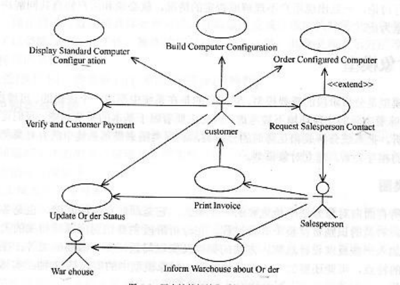

(4) 用例描述

以 “定购配置的计算机”用例为例进行描述。

简述:该用例允许客户输入一份购物定单,该定单包括提供运送和发票地址,以及关于付款的详细情况。

执行者:客户

前置条件:客户进入定单Web页,该页面显示已配置计算机的细节及其价格,当用户点击“定购”按钮时,该用例启动。

主事件流:

(1)系统请求客户输入购买细节,包括销售员的名字、运送信息、发票信息、付款信息以及其他注释;

(2)客户选择“提交”功能,发送定单给厂家;

(3)系统将给予定单唯一的定单号和一个客户账号,并将定单信息存入数据库;

(4)系统将定单号和客户账号与所有定单细节一起发E- mail给客户,作为接收定单的确认通知;

(5)客户在提供所有要求录入的信息之前,激活“提交”功能,系统显示错误信息,它要求提供所漏掉的信息;

(6)其他:客户选择“重填”来恢复一个空白的购物表格,系统允许客户重新输入信息。

后置条件:如果用例成功,购物定单记录在系统的数据库中,否则系统的状态不变。

建立用例模型时,往往会得到很多用例,有些用例可以在设计时再描述它,如退款处理和加入新品种的价格等用例。另外,在设计时我们还可以对某些用例细化,如维护和评价用户信用等用例。

得到了用例模型后,一方面要仔细检查角色和用例的各个环节,同时还要及早地和系统的用户进行讨论,一旦出现用户不理解或否定的情况,就必须和用户协商共同解决问题,直到用户满足为止。

### 4.14 用例案例：机票预订与学生成绩管理

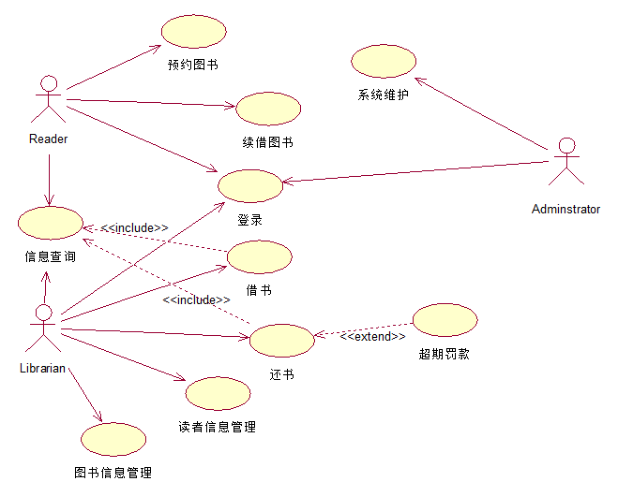

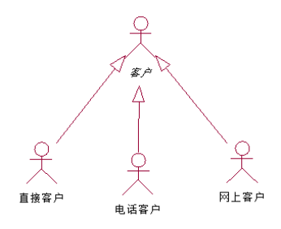

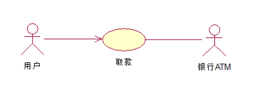

1.情境说明

机票预订系统是某航空公司推出的一款网上购票系统。其中,未登录的用户只能查询航班信息,已登录的用户还可以网上购买机票,查看已购机票,也可以退订机票。系统管理员可以安排系统中的航班信息。此外,该购票系统还与外部的一个信用评价系统有交互。当某用户一个月之内退订两次及以上的机票时,需要降低该用户在信用评价系统中的信用等级。当信用等级过低时,则不允许该用户再次购买机票。

2.确定参与者

在了解完系统语境后,首先应该分析确定系统中的参与者。根据系统的背景说明,我们可以分析出需要订票的用户肯定要参与其中,并且用户根据是否已登录有不同的系统使用权限。负责安排航班信息的管理员和与系统产生交互的外部信用评价系统也应该属于系统的参与者。

通过以上分析可以得出,系统主要由三类参与者,分别是用户、管理员与信用评价系统。其中,用户包括游客与注册用户,表示为参与者的泛化关系。由于用户一定属于二者其中之一,故用户应该是一个抽象参与者。将参与者画到用例图中,如下图所示。

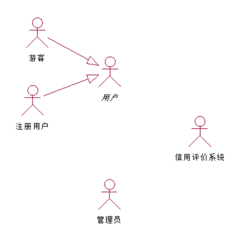

3.确定用例

我们已经分析出系统中的参与者,然后就可以通过分析每个参与者是如何使用系统来确定系统中的用例。在本系统中,游客可以注册系统和查询航班信息;注册用户可以登录系统、查询航班信息、购买机票、查看行程和退订机票;管理员可以登录系统和设定航班安排;信用评价系统可以修改和检查信用等级。需要注意的是,修改和检查信用等级的用例并非是由信用评价系统主动触发的,信用评价系统对这两个用例而言只是副参与者。将用例添加到用例图中并与其参与者之间建立关联关系,如下图所示。

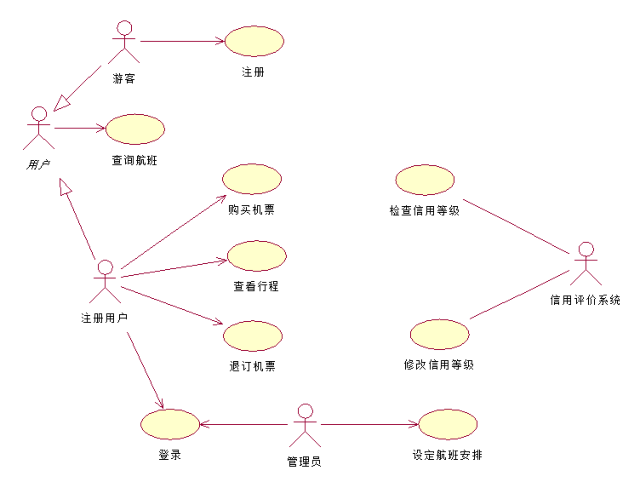

4.确定用例之间的关系

在确定完所有用例之后,我们需要具体考虑各个用例的工作流程从而添加用例之间的依赖关系,以此保证模型的高内聚与低耦合。对于机票预订系统,我们注意到“购买机票”用例在执行时需要先查询相关的航班信息然后再选择感兴趣的航班购票,并且在购票前需要检查该用户的信用等级是否足够高,因此该用例与“查询航班”用例和“检查信用等级”用例之间可以分别建立包含关系。此外,在退订机票时,如果这是该用户本月第二次以上的退订,那么我们需要降低该用户的信用等级,由于这一关系是有条件的,所以二者构成扩展关系。将这些关系添加到用例图中,形成最终的用例图,如下图所示。

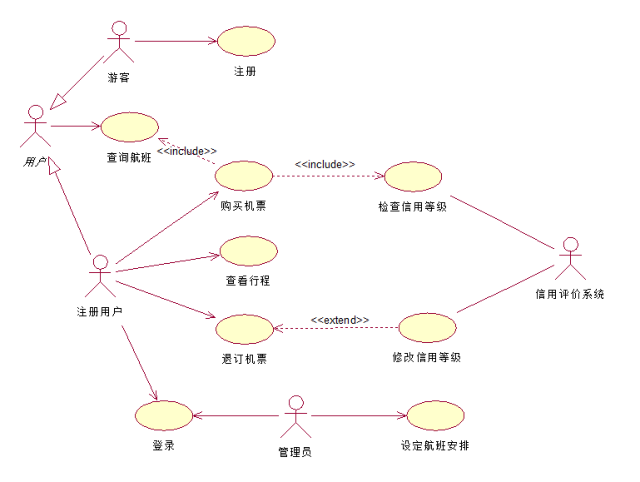

某个学生成绩管理系统的部分参与者和用例总结如下。

教务管理人员:

1教师、学生名单管理。

2学期教学计划管理。

3成绩管理。

课程分配，每次课程分配时可打印任课通知书。

学生:

1选课。

教师:

1成绩管理,并且可以选择是否生成成绩单。

请根据以上信息画出该系统的用例图。

根据题目描述可以分析出系统的参与者与用例。教务管理人员有登录、教学计划管理、名单管理、成绩管理与课程分配用例,打印任课通知书作为课程分配用例的扩展用例存在。学生有登录及选课用例。教师包括登录及成绩管理用例,生成成绩单作为成绩管理用例的扩展用例存在。用例图可参考下图。

### 4.15 对象模型、类与关系

**对象模型**

**类图**

名称:用来区别其他的类。类名可以是一个字符串,也可以是包含路径的名字(一般以大写字母开头,大小写混合,每个单词首字母大写,避免使用特殊符号)。

属性:属性用来描述该类的对象所具有的特征(属性的命名规范一般以小写字母开头,非首单词的首字母大写)。

操作:操作描述对数据的具体处理方法。

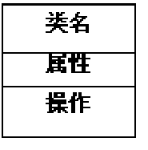

| 可见性 | 英文限定符 | UML标准图示 | Rose图示 | 说明 |
| --- | --- | --- | --- | --- |
| 公有 | public | + | | 其他类可以访问 |
| 私有 | private | - | | 只对本类可见,不能被其他类访问 |
| 保护 | protected | # | | 对本类及其派生类可见 |

**识别类与对象**

1.找出侯选的类与对象

(1)名词识别法

例:顾客带着所要购买的商品到达营业厅的一个销售点终端(终端设在门口附近),销售点终端负责接收数据、显示数据和打印购物单;出纳员与销售点终端交互,通过销售点终端录入每项商品的通用产品代码,如果出现多个同类商品,出纳员还要录入该商品的数量;系统确定商品的价格,并将商品代码、数量信息加入到正在运行的系统;系统显示当前商品的描述信息和价格。

候选对象:顾客、商品、销售点终端、购物单、出纳员。

需要注意的事,不一定每个名词都对应一个对象或类,有时描述可能过细,那么该名词可能就是其他对象的一个属性。另外鉴于需求陈述与用例描述不可能十分规范,我们还必须从这些名词、名词短语中排除同意或近义词的干扰。

(2)系统实体的识别方法

可感知的物理实体,例如汽车、书、信用卡;

人或组织的角色,例如:学生、教师、经理、管理员、供应处;

应该记忆的事件,例如取款、飞行、订购;

两个或多个对象的相互作用,例如购买、结婚;

需要说明的概念,例如保险政策、业务规则。

例如对于前例:

1)可感知的物理实体:销售点终端、商品。

2)人或组织的角色:顾客、出纳员。

3)应该记忆的事件:购物单(记录商品信息)。

4)两个或多个对象的相互作用:此处不适用。

5)需要说明的概念:此处不适用。

2.筛选出正确的类与对象

(1)冗余

(2)无关

(3)笼统

(4)属性

(5)操作

(6)实现

**识别属性**

1.分析(不可能在需求陈述中找到所有的属性)

2.确定属性 (属性的修改通常并不影响系统结构)注意以下问题:

(1)误把对象当作属性

(2)误把关联类的属性当作对象的属性

(3)误把内部状态当成属性

(4)过于细化

(5)存在不一致的属性

(6)属性不能包含一个内部结构

(7)属性在任何时候只能有一个在其允许范围内的确切的值

**识别操作**

有哪些类会与该类交互(包括该类本身)?

所有与该类具有交互行为的会发送哪些消息给该类?该类又会发送哪些消息给这些类?

该类如何响应别的类发送来的消息?在发送消息出去之前,该类需要做何处理?

从该类本身来说,它应该有哪些操作来维持其信息的更新、一致性和完整性?

系统是否要求该类具有另外的一些职责?

例如,对前述的超市购买商品系统的识别结果如下。

(1)与顾客交互的类有购物单,与出纳员类交互的类有销售终端等。

(2)发送给出纳员的消息有:商品购物单。

(3)出纳员对输入消息的响应:检查购物单。

对类操作的识别也可以到建立动态模型时再进一步补充和细化。

识别类的操作时要特别注意以下几类。

(1)注意只有一个或很少操作的类。也许这个类是合法的,但也许可以和其他类合并为一个类。

(2)注意没有操作的类。没有操作的类也许没有存在的必要,其属性可归于其他类。

(3)注意太多操作的类。一个类的责任应当限制在一定的数量内,如果太多将导致维护复杂。因此尽量将此类重新分解。

**识别关联**

关联用于描述类与类之间的连接。

关联名称:用于标记关联。

关联角色:用于反映类在这一关联关系中扮演了什么角色。如果在关联上没有标出角色名,则隐含地用类的名称作为角色名。

关联导向性:是指关联关系只在指定方向上成立,可以使用一个指向符号表示。

例: “消费者”以“顾客”的角色参与“提交定单”的关联

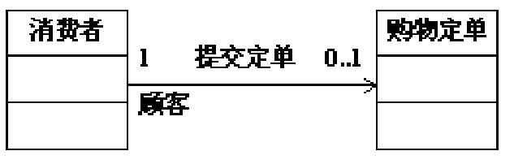

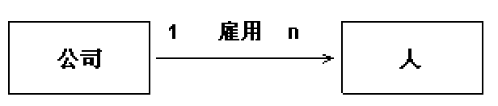

关联的多重性:表示是由类产生的对象之间存在的数量关系,主要有以下几种:

1..1或1 表示1个对象

0..1 表示0到1个对象

0..*或* 表示0到多个对象

1..* 表示1到多个对象

(1)关联类

关联有可能具有自己的属性或操作,对此需要引入一个关联类来进行记录。这时,关联关系中的每个连接与关联类的一个对象相联系,关联类通过一条虚线与关联连接。

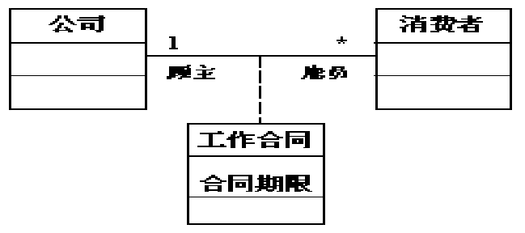

(2)聚合

聚合是一种特殊形式的关联。聚合表示类之间的关系是整体与部分的关系。

**一般聚合关系共享聚合**

**组成**

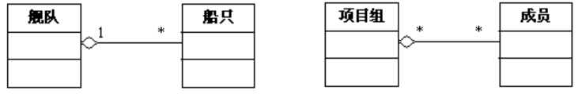

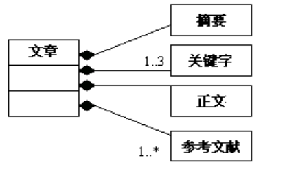

(3)泛化类之间的泛化关系也就是类的继承关系。

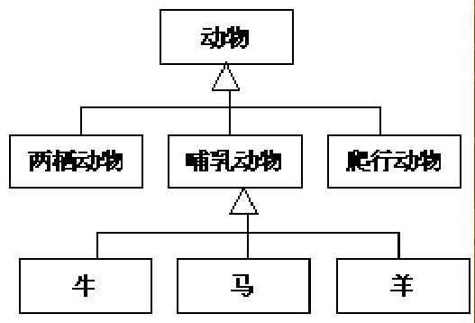

(4)依赖

依赖关系用来描述两个类之间存在的与依赖有关的语义上的连接。其中一个模型元素是独立的,另一个模型元素不是独立的,它依赖于独立的模型元素,需要由独立元素提供服务,如果独立模型改变了,将影响依赖于它的模型元素。

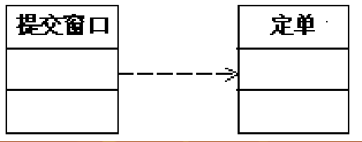

分析确定关联有助于我们考虑问题域的边缘情况,有助于发现那些尚未发现的类与对象。

直接提取动词短语得出的关联需求陈述中隐含的关联根据问题域知识得出的关联

下面以超市购买商品系统为例说明初步确定的关联。

(1) 直接提取动词短语得出的关联:

1)顾客带着所要购买的商品到达营业厅的销售点终端;

2)销售点终端设在门口附近;

3)出纳员与销售点终端交互;

4)销售点终端负责接收数据、显示数据和打印购物单;

5)出纳员录入该商品信息;

6)系统确定商品的价格;

7)系统显示当前商品的描述信息。

(2)需求陈述中隐含的关联:

1)超市拥有多个销售点终端;

2) 系统处理并发的访问;

3)系统维护事务日志;

4)系统必须提供安全性与可靠性。

(3)根据问题域知识得出关联:

1)系统是由一个局域网络组成;

2)购物单处理在后台服务器端。

经过初步分析得出的关联只能作为候选的关联,还需要经过进一步的筛选,以去掉不必要、不正确的关联。筛选标准如下。

(1)已删除的类之间的关联。如果在分析确定类与对象的过程中已经删除掉了某个候选类,则与这个类有关的关联也应该去掉,或重新表达这个关联。

例如,由于已经删除了“系统”、“营业厅”等候选类,因此与这些类有关的关联也应该删除。

(2)与问题无关的或应是现阶段考虑的关联。例如“系统处理并发的访问”并没有标明对象之间的新关联,它告诉我们在实现阶段需要使用实现并发访问的算法,以处理并发事物。

(3)瞬时事件。关联关系应描述问题域的静态结构,而不是一个瞬时事件。例如,“出纳员与销售点终端交互”并不是出纳员与销售终端之间固有的关系,因此应该删去。

(4)避免冗余和遗漏。应该去掉那些可以用其他关联定义的冗余关联;发现了遗漏就应该及时补上。

(5)标明重数。最后应该初步判定各个关联的类型,并粗略地确定关联的重数。但是,无须为此花费过多的精力,因为在分析过程中,随着认识的深入,重数会经常变动。

**超市购买商品的系统类图**

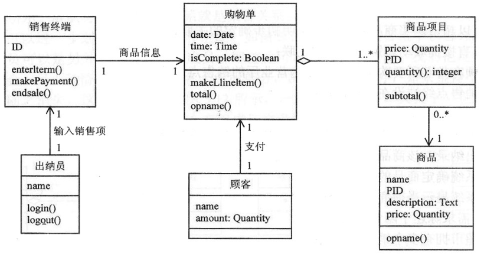

建立静态(对象、概念)模型

建模步骤:

从几方面识别系统的实体对象和类;

分析每个对象的主要属性和操作,达到对类的完整认识的目的;

识别类之间的结构,包括泛化、聚合、组成等;

识别对象、类之间的关系;

修改、补充对象与类,绘制类图,对重点类加以文本描述和说明。

下面仍以“网上计算机销售系统”为例,介绍静态模型的建立过程。

(1)识别对象。综合运用识别对象、类的方法,我们得到的候选类是:Internet网络、计算机、客户、Web页面、标准配置的计算机、价格、销售员、定单、发票、地址、支票、信用卡、表格、邮件、定单的状态、付款方式和仓库等。

对候选类进行筛选时,明确了以下几个问题。

1)配置的计算机与定单之间区别在哪里?

我们不将配置的计算机进行存储,除非它的定单被提交;

2)运送 / 装运是仓库的责任,是在系统范围之外吗?

我们认为是在系统范围之外;

3)配置项可以作为配置计算机中的一个属性吗?

因为配置项具有不同的性质,而不仅仅是一个值,所以我们认为配置项是一个类;

4)“定单状态”是一个类,还是定单的一个属性?

应该是定单的一个属性;

5)销售员是一个类,还是定单或发票的一个属性?

应是定单的一个属性。

经过分析确定的类是:客户、计算机、配置的计算机、配置项、定单、付款、标准的计算机和发票。

识别属性。下图列举了各个类的属性。

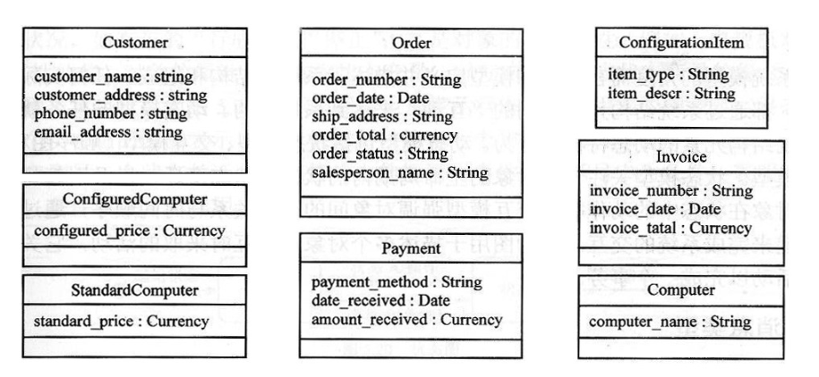

识别关联,建立对象模型。

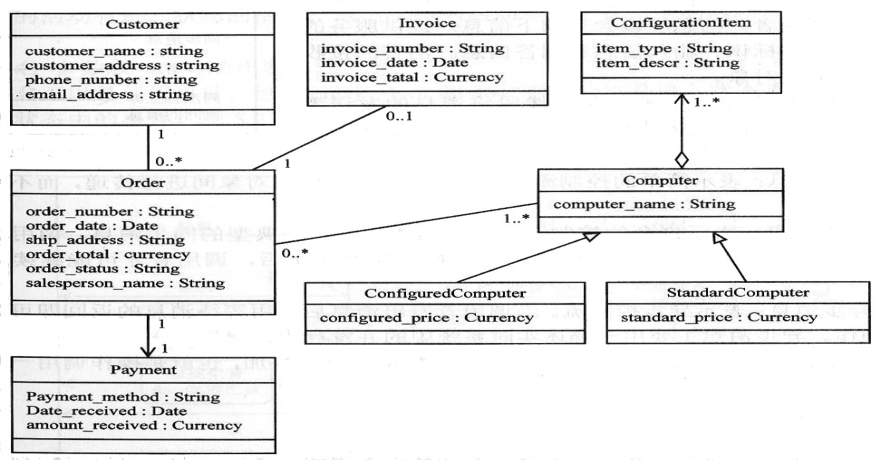

### 4.16 类图与对象图实例

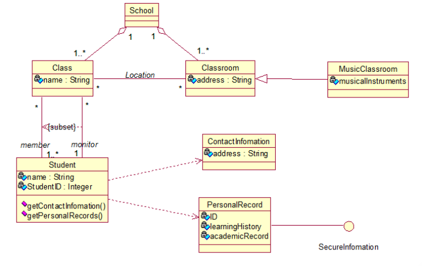

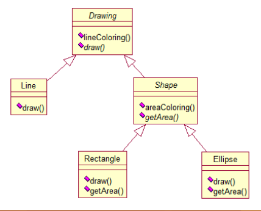

1.情境说明

系统管理员可以安排系统中的航班信息。

2.确定类元素

根据情境描述,我们应该确定出系统主要可以包括哪些类。在本题中,我们可以归结出用户、管理员、机场、航班与机票几个实体类,还应该包括有一个系统控制类来控制整个系统。由于分析阶段尚未进行用户界面设计,因此类图中暂时不涉及边界类,需要在设计阶段再对类图进一步完善。将确定好的类添加到类图中,如下图所示。

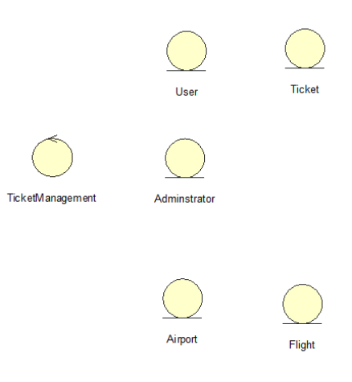

3.添加类的属性与操作

在确定了系统中包括的类之后,我们需要根据类的职责来确定类的属性与操作。在实际开发过程中,这往往是一个需要屡次迭代的过程,即需要多次明确其语义和添加新内容。在最初的分析阶段,只要能大致描述类在整个系统中的作用即可。添加了属性与操作的类图如下图所示。

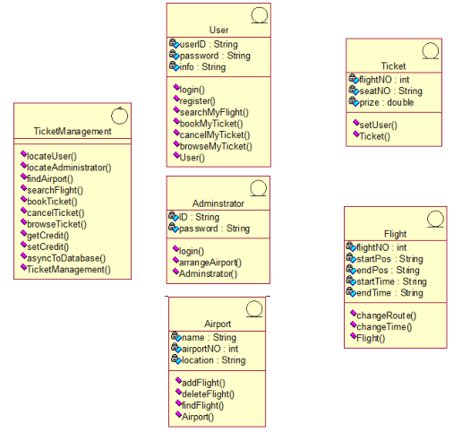

4. 确定类图中的关系

在确定了类的基本内容之后,我们需要添加类图中的关系来完善类图的内容。类图中的类需要通过关系的联系才能互相协作,发挥完整的作用。

在此情境中,类之间主要通过关联关系相互联系。TicketManagement类与User类及Administrator类之间相关联,表示系统中包含的用户及管理员账户。TicketManagement类与Airport类之间的关联表示系统中包括的机场。Airport类与Flight类之间的关联表示机场中运行的航班。Flight类与Ticket类之间的关联表示一趟航班中包含的机票。Ticket类与User类之间的关联表示用户所购买的机票。此外,还要注意这些关联关系两端的多重性和导航性。下图显示了添加了关联关系的类图。至此,类图已基本创建完毕。在实际开发过程中,类图作为指导编程实现最重要的图,还需要不断地修改来完善和丰富其中内容。

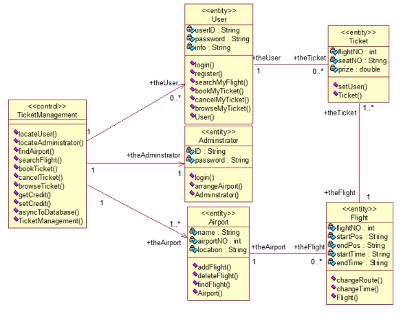

**对象图概述**

**对象图的组成元素**

**对象**

链

对象图显示了某一时刻的一组对象及它们之间的关系。

对象图可以看做是类图的实例,用来表达各个对象在某一时刻的状态。对象图中的建模元素主要有对象和链,对象是类的实例,链是类之间的关联关系的实例。

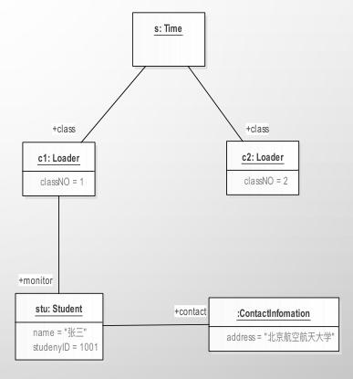

对象是类的实例,是一个封装了状态和行为的具有良好边界和标识符的离散实体。对象通过其类型、名称和状态区别于其他对象而存在。

对象名:在矩形框的顶端显示。

类型:具体的类目

状态:由对象的所有属性以及运行时的当前值组成。

表示法:在对象名后跟一个冒号加上类型名,并且使用下划线与类进行区分。

stu: Student 标准表示法: Student 匿名表示法stu 省略类名的表示法

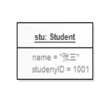

链是关联关系的实例,是两个或多个对象之间的独立连接。因此,链在对象图中的作用就十分类似于关联关系在类图中的作用。

链主要用来导航。链一端的一个对象可以得到另一位置上的一个或一组对象,然后向其发送消息。链的每一端也可以显示一个角色名称,但不能显示多重性。

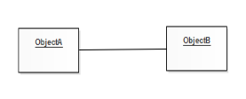

### 4.17 包与包图

包图是用来描述模型中的包和所包含元素的组织方式的图,是维护和控制系统总体结构的重要内容。包图能够组织许多UML中的元素,不过其最常用的用途是用来组织用例图和类图。

包图中包含包元素以及包之间的关系。与其他图类似,包图中可以创建注解和约束。

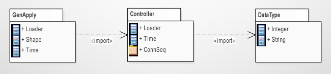

**包的概念**

**包的作用**

**元素的分包原则**

包是用于把模型本身组织成层次结构的通用机制,它不能执行。

包名:与类图相似,包有简单名与路径名两种命名方法。

包中的元素:包中可以容纳各种高级的模型元素,如类和类的关系、状态机、用例图、交互、协作等,甚至是一个完整的UML图。

另外,包中还可以含有包,这被称为包的嵌套。

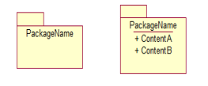

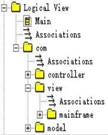

包元素的可见性:控制包外元素对包内元素的访问权限。

公有(+):只要当前包被引入,包内的公共元素即对引入者可见。

保护(#):仅对当前包的子包可见。

私有(-):仅对该包可见,外部无法访问。

另外,如果某元素对于一个包是可见的,则它对于嵌套在这个包中的任何包都是可见的。

包的构造型:可以使用构造型来描述包的种类。UML预定义了一些构造型,用户也可自行定义新的构造型。

高内聚,低耦合:

在外部观察包时,可以将内部元素视作一个整体,方便将多个元素一同处理。

包内部的元素应该保证有相似、相同的语义,或者其元素有同时更改和变化的性质。

在实际应用中,包对包含的元素的作用相当于C++和C#中命名空间的概念或JAVA中的包概念。和这些概念不同的是,UML包中的内容不限于类和接口,包中的元素种类要丰富的多。

元素不能“狡兔三窟”:树形结构的一个节点不能同时拥有两个父节点,一个元素也不允许在两个包中重复出现。

相同包内元素不能重名:包所具有的命名空间的作用要求用一个包中的同种类元素名称必须是唯一的。

包内元素要紧密联系:分在同一个包中的元素应该具有某些相同的性质,即包的高内聚性。

包与包尽可能保持独立:包和包之间需要尽可能减少耦合度,要求包内元素与外部元素有尽可能少的依赖关系。

包之间的依赖关系实际上是从一个更高的层次来描述包内某些元素之间的依赖关系。也就是说,如果不同包中任何元素之间存在着一个依赖,则两个包之间就存在着依赖关系。

包之间的依赖关系首先需要包中的某些元素具有某种外部可见性,即可以被包外部的元素所引用。

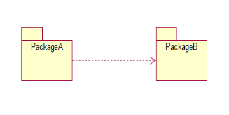

容易出现的问题:循环依赖

循环依赖的出现是令人困惑、也是非常容易产生错误的。尤其是当依赖关系表示包的引入时,循环依赖会导致将模型转化成代码后因为包之间互相引入而出现错误。

解决方案:重新分包,引入第三个包,重新建立依赖关系。

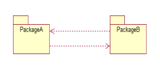

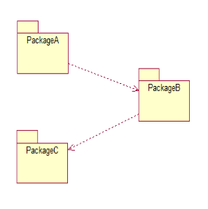

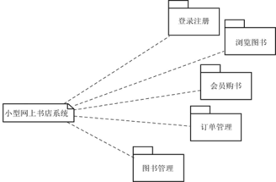

在RATIONAL ROSE中,可以使用包来将各种模型元素进行分类组织,便于用户进行查找和浏览。

以用例为例,我们可以将前述的元素分配到不同的包中进行管理。按照用例所表示的内容,我们可以将“检查信用等级”与“修改信用等级”用例添加到“信用评价”包中,将“登录”与“注册”添加到“登录注册”包中,将“设定航班操作”添加到“后台操作”包中,将其余用例添加到“核心业务”包中。整理后项目的用例模型的包结构如下图所示。

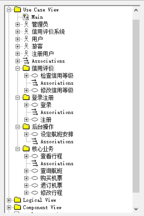

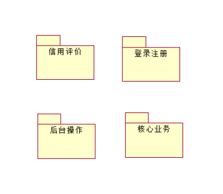

### 4.18 动态模型、消息与状态图

**动态模型**

动态模型包括状态模型、交互模型(顺序图和协作图)和活动模型

**消息类型**

简单消息:表示简单的控制流。用于描述控制如何在对象间进行传递,而不考虑通信细节。

同步消息:表示嵌套的控制流。操作的调用是一种典型的同步消息。调用者发出消息后必须等待消息返回,只有当处理消息的操作执行完毕后,调用者才可能继续执行自己的操作。

异步消息:表示异步控制流。当调用者发出消息后不用等待消息的返回即可继续执行自己的操作。异步消息主要用于描述实时系统中的并发行为。

同步且立即返回消息:这是同步消息和简单消息的叠加,也就是操作调用一旦完成就立即返回。

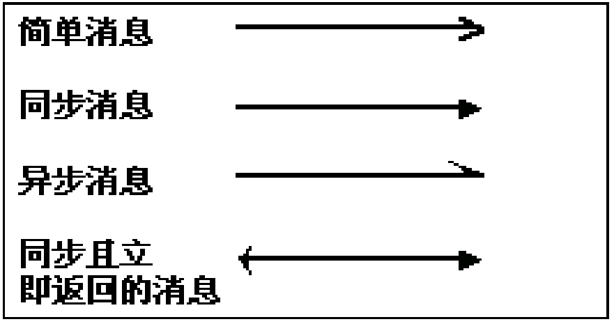

**状态图**

1.状态和转移

状态是一种存在状况,它具有一定的时间稳定性。即在一段有限的时间内保持对象(或系统)的外在情况和内在特性的相对稳定。

状态图提供了对象在其生命周期中可能出现的状态及其行为的描述。一个状态图包括一系列状态、事件以及状态之间的转换,其作用是能够为类图中每一个类进行动态行为说明,以获得对类的方法的细节描述的建模支持。

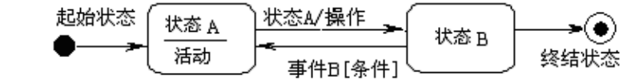

例:

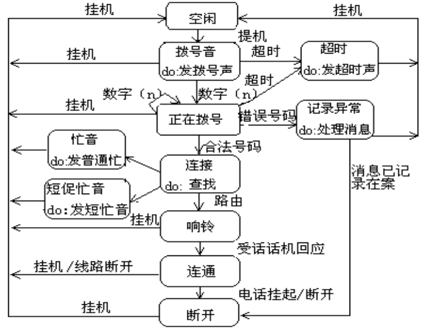

状态有两种不同的行为:事件和活动。事件是一个伴随状态迁移的瞬时发生的行为:活动则是发生在某个状态中的行为,往往需要一定的时间来完成,因此与状态名一起出现在有关的状态之中。

一个状态一般包括3个部分:状态名称、可选的状态变量的变量名、变量值和可选的活动表。

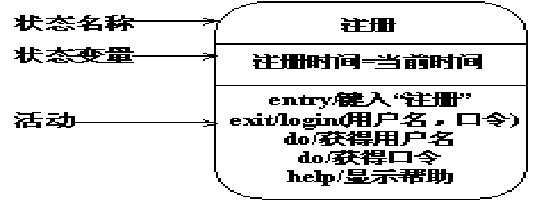

转移是两个状态之间的关系,一个转移由五部分组成:

源状态:即受转移影响的状态;如果一个对象处于源状态,当该对象接收到转移的触发事件时或满足监护条件时,就会激活状态。

事件触发:源状态中的对象接收这个事件使转移合法地激活,并使监护条件满足。

监护条件:是一个布尔表达式,当转移因事件触发器的接收而被触发时对这个布尔表达式求值;如果表达式为真,则激活转移;如果为假,则不激活转移,如果没有其他的转移被此事件触发,则时间丢失。

动作:是一个可执行的原子计算,它可以直接作用于对象。

目标状态:转移完成后对象的状态。

2.事件

事件指的是发生的且引起某些动作执行的事情。事件不能存储,它不具有时间有效性。

UML定义了4种可能的事件:

条件变为真事件。如监护条件变为真值。

来自其他对象的明确信号,也可称为消息。这种信号本身就是一个对象。

来自其他对象的服务请求(操作调用)。

定时事件。

例如:当你按下CD机上的“Play”按钮时,CD机开始播放。在此例中“按下Play按钮”就是事件。而事件引起的动作是“开始播放”。当事件和动作之间正在存在着某种联系时,我们将这种关系称为“因果关系”。这种事件称为状态转移事件。

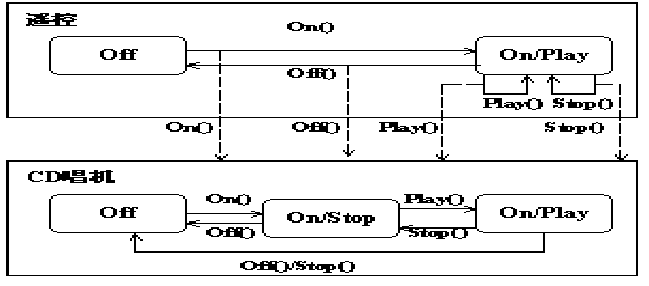

3.子状态

例:汽车行驶状态的子状态图。无论对象处于那个子状态,外部表现出来的仍然是同一个状态(行驶)。

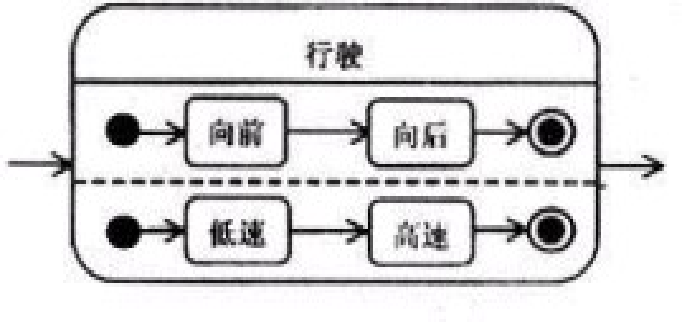

4.识别状态空间

(1)识别对象在问题域中的生命周期

(2)确定对象生命周期阶段划分策略

(3)重新按阶段描述对象生命周期,得到候选状态

(4)识别对象在每个候选状态下的动作,并对状态空间进行调整

(5)分析每个状态的确定因素(对象的数据属性)

(6)检查对象状态的确定性和状态间的互斥性

5.识别状态转移

“定单”类的状态图

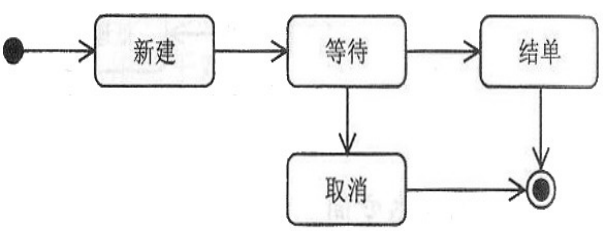

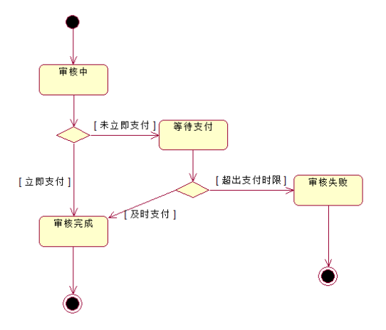

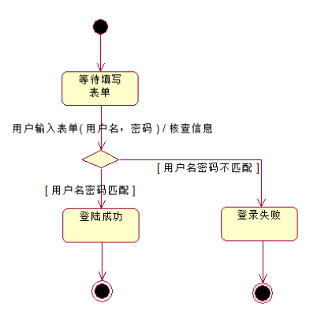

1.情境说明

系统管理员可以安排系统中的航班信息。

2.确定状态

我们假设,航班会在飞行日期前的两个月前开始发售机票,在飞行前一天停止在网上发售机票。在飞机起飞后,将不能查询到该航班信息。因此,在机票预订系统中,航班可以分为三个状态:未开始售票、已开始售票以及已停止售票状态。 将这些状态以及初态和终态添加到状态图中,如下图所示。

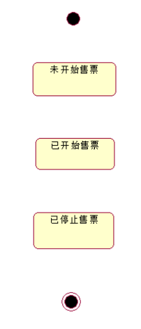

3. 添加转换

在添加了状态后,下一步就是要添加状态的转换。我们可以很容易看出,在这个状态图中,首先由初态进入未开始售票状态,未开始售票状态可以转换为已开始售票状态,其触发器是一个时间事件。已开始售票状态可以转换为已停止售票状态,其触发器同样是一个时间事件。最后由已停止售票状态转换为终态,航班类的状态机结束。将上述转换添加到状态图中,如下图所示。

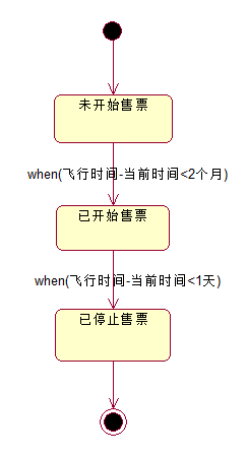

4.刻画子状态机

在完成最上层的状态机后,我们需要再分析是否有某个状态可以被详细建模为几个子状态。在情境中,已停止售票状态可以划分出等待起飞、推迟起飞、已起飞与已取消四个子状态。将这四个子状态与子状态机中的初态与终态添加到已停止售票状态内部,如下图1所示。然后在已停止售票状态的子状态之间建立转换以完成子状态机,完成后的状态图如下图2所示,至此状态图创建完毕。

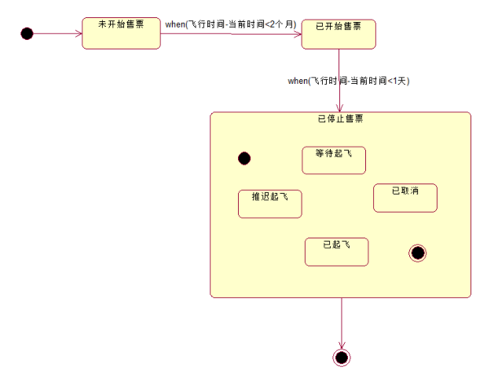

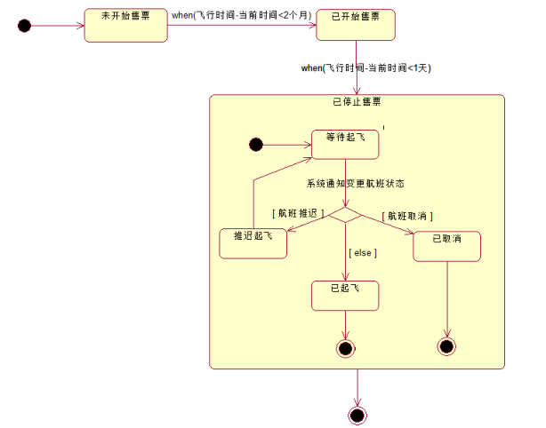

### 4.19 顺序图

顺序图是按时间顺序显示对象交互的图。它显示了参与交互的对象和所交换信息的先后顺序,用来表示用例中的行为,并将这些行为建模成信息交换。

顺序图主要包括四个元素:对象、生命线、激活和消息。在UML中,顺序图将交互关系表示为一张二维图。其中纵向是代表时间维度,时间向下延伸,按时间依次列出各个对象所发出和接收的消息。水平方向是代表对象的维度,排列着参与交互的各个独立的对象。

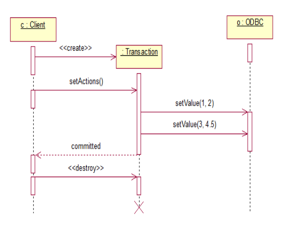

顺序图的三种主要作用:

细化用例的表达。使用顺序图的一大用途,就是将用例所描述的需求与功能转化为更加正式、层次更加分明的细化表达。

有效地描述类职责的分配方式。我们可以根据顺序图中各对象之间的交互关系和发送的消息来进一步明确对象所属类的职责。

丰富系统的使用语境的逻辑表达。系统的使用语境即为系统可能的使用方式和使用环境。

**对象**

**生命线**

**激活**

**消息**

顺序图中的对象与对象图中的概念一样,都是类的实例。顺序图中的对象可以是系统的参与者或者任何有效的系统对象。

对象的创建由头符号来表示,即在对象创建点的生命线顶部使用显示对象名和类名的矩形框来标记。

在位置上,一个被放置于顺序图顶端的对象,意味着在这个交互的开始之前,我们已经拥有这样一个对象了。如果一个对象出现在其它位置上(不在顶端),则说明这个对象是在交互执行到某些步骤的时候被创建出来的。被创建出来的对象可以在接下来的时间里被其他对象的消息所激活,也可以以同样的方式被销毁。

生命线代表了一次交互中的一个参与对象在一段时间内存在。具体地说,在生命线所代表的时间内,对象一直是可以被访问的——可以随时发送消息给它。

在顺序图中,生命线位于每个对象的底部中心位置,显示为一条垂直的虚线,与时间轴平行,带有一个显示对象的头符号。

对于在交互过程中被创建的对象,其生命线从接收到新建对象的消息时开始。对于在交互过程中被销毁的对象,其生命线在接收到销毁对象的消息时或在自身最后的返回消息之后结束,同时用一个“X”标记表明生命线的结束。

激活,又称为控制焦点,表示一个对象执行一个动作所经历的时间段,既可以是直接执行,也可以是安排下级过程执行。同时,激活也可以表示对应对象在这段时间内不是空闲的,它正在完成某个任务,或正被占用。

激活在UML中用一个细长的矩形表示,显示在生命线上,如右图所示。矩形的顶部表示对象所执行动作的开始,底部表示动作的结束。

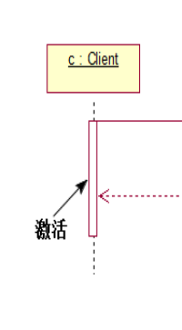

消息是从一个对象(发送者)向另一个对象(接收者)发送信号,或由一个对象(发送者或调用者)调用另一个对象(接收者)的操作。

消息是对象和对象协同工作的信息载体,它代表了一系列实体间的通信内容。

在顺序图中,消息表示为从一个对象的生命线指向另一个对象的生命线的箭头。

最常见的消息是简单消息(又被称为顺序消息)。简单消息的图形表示也同样简单,只要用一根实心箭头就可以。简单消息表示控制流,可以泛指任何交互,但不描述任何通信信息。

在传送一个消息时,对消息的接收往往会产生一个动作。

调用:调用某个对象的一个操作。

返回:传递另一个消息的返回值。

创建:创建一个对象时发送的消息。使用<<CREATE>>构造型。

销毁:销毁一个对象(也允许对象销毁自身)。使用<< DESTROY >>构造型。

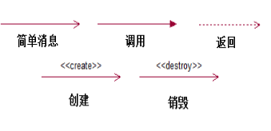

根据消息的并发性来区分,消息可以分为同步消息和异步消息两种。

同步消息:意味着发出该消息的对象将不再继续进行后续工作,专心等待消息接收方返回消息。

异步消息:消息发出者在发出异步消息之后,不必等待接收者的返回消息便可以继续自己的活动和操作。

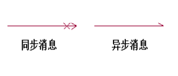

1.确定交互对象

创建顺序图的第一步就是要明确参与该交互的对象。我们注意到该用例由用户发起,因此,用户作为参与者是这个交互过程的发起者。此外,我们假设系统采用MVC(即模型-视图-控制器)设计,因此参与这个交互的对象还包括程序界面、程序逻辑层以及程序数据库。

将确定的交互对象调整好顺序添加到顺序图中,如下图所示。

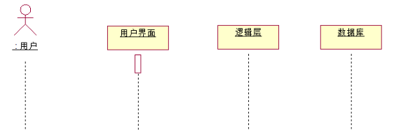

2.添加消息

在确定了参与交互的对象之后,我们就要在对象之间添加消息的传递了。我们可以很容易的分析出整个交互过程:用户首先向界面填写表单并确认,程序界面将用户填写的表单数据发送给程序逻辑层,逻辑层向程序的永久数据发送请求来检查用户数据的合法性,接收到合法性的返回消息后,程序逻辑层再向界面发送消息显示出登录结果。

按照分析的交互过程,我们向顺序图中添加消息,创建出完整的顺序图,如下图所示。

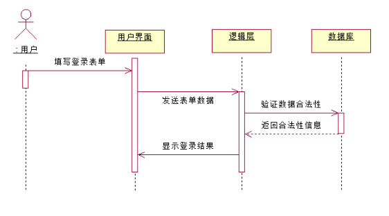

### 4.20 协作图

协作:指的是对一组对象以及对象之间上下文关系的描述,这些对象在上下文中通过交互来完成一个系统的功能。

协作图是表现对象协作关系的图,它展现了多个对象在协同工作达成共同目标的过程中互相通信的情况,通过对象和对象之间的链、发送的消息来显示参与交互的对象。

协作图中的元素主要有对象、消息和链三种。对象和链分别作为协作图中的类元角色和关联角色出现,链上可以有消息在对象间传递。

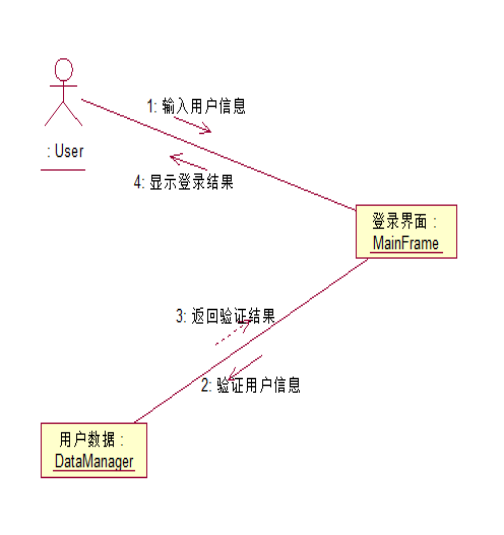

从结构方面来看,协作图包含了一个对象的集合并且定义了它们之间的行为方面的关系,表达了一些系统的静态内容。

从行为方面来看,协作图包含了在各个对象之间进行传递交换的一系列的消息集合,以完成协作的目的。

协作图是一种描述协作在某一语境下的空间组织结构的图形化方式,在使用其进行建模时,主要具有以下三个作用。

通过描绘对象之间消息的传递情况来反映具体使用语境的逻辑表达。

显示对象及其交互关系的空间组织结构。

表达一个操作的实现。

**对象**

链

**消息**

协作图中的对象与顺序图中对象的概念相同,都是表示类的实例。

协作图只关注相互有交互作用的对象和对象关系,而忽略其他对象。

由于协作图中不表示对象的创建与销毁,因此,对象在协作图中的位置没有限制。

与顺序图中对象的表示法不同的是,协作图中的无法显示对象的生命线。

协作图中的链与对象图中的链在语义以及表示法上都相同,都是两个(或多个)对象之间的独立连接,是关联的实例。链同时也是协作图中关联角色的实例,其生命受限于协作的生命。

链连接的两个对象之间允许在交互执行过程中进行消息传递和交互。UML也允许对象自身与自身之间建立一条链。链可以通过对自己命名来进行区分和说明,也可以仅仅做连接而不进行命名。

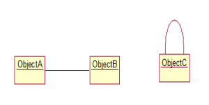

协作图的消息需要附加在对象之间的链上,链用于传输或实现消息的传递。

协作图中的消息通过在链的上方或下方添加一个短箭头来表示,通常需要使用阿拉伯数字作为序号来表示协作图中发送消息的顺序。

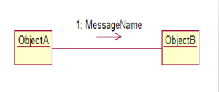

协作图与顺序图的共同点主要有如下3点:

主要元素相同。两种图中的主要元素都是对象与消息,且都支持所有的消息类型。

表达语义相同。两种图都是对系统中的交互建模,描述了系统中某个用例或操作的执行过程,二者的语义是等价的。

对象责任相同。两种图中的对象都担任了发送者与接收者的角色并承担了发送与接收消息的责任。通过对象之间消息的传递来实现系统的功能。

两种图之间的不同点也有如下3点:

协作图偏重于将对象的交互映射到连接它们的链上,这有助于验证类图中对应的类之间关联关系的正确性或建立新的关联关系的必要性。然而顺序图偏重描述交互中消息传递的逻辑顺序。因此协作图更适用于展示系统中的对象结构,而顺序图则擅长表现交互中消息的顺序。

顺序图可以显式地表现出对象创建与撤销的过程,而在协作图中,只能通过消息的描述隐式地表现这一点。

顺序图还可以表示对象的激活情况,而对于协作图来说,由于缺少表示时间的信息,除了对消息进行解释,无法清晰地表示对象的激活情况。

1. 确定交互对象

创建协作图的第一步也是要确定参与该交互的所有对象。我们可以从情境中确定参与该用例交互过程的对象有程序界面、系统控制对象(对应于TICKETMANAGEMENT类的对象)、航班类(FLIGHT类)对象以及机票类(对应于TICKET类)对象。需要注意的是,在查询操作中需要有多个航班类对象与机票类对象参与,因此二者使用多重对象来表示。将确定好的对象添加到协作图中,如下图所示。

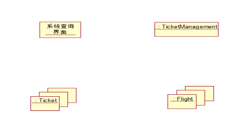

2.确定对象间的链

在确定了参与交互的对象之后,我们需要在存在联系和有消息传递的对象之间用链连接起来。添加链之后的协作图如下图所示。

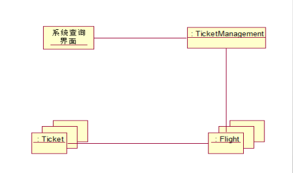

3. 添加消息

制作协作图的最后一步就是在链上按顺序添加消息来表达整个交互过程。在这一情景中,我们可以梳理出对象之间发送消息的顺序如下:系统查询界面向系统控制对象发送查询请求以及查询条件,系统控制对象根据查询条件筛选出符合条件的航班并向每个符合条件的航班发送查询余票请求,航班对象接收到请求后向该航班上的所有机票对象请求检查机票是否可用并得到返回,然后向系统控制对象发送航班余票信息,最后系统控制对象将查询结果发送给系统查询界面。

将消息添加到协作图中,得到完整的交互图,如下图所示。

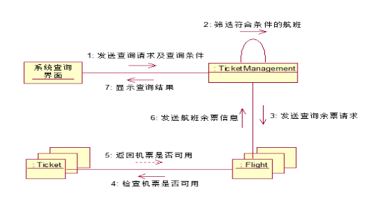

### 4.21 活动图

活动图是UML中一种重要的用于表达系统动态特性的图。

活动图的作用是描述一系列具体动态过程的执行逻辑,展现活动和活动之间转移的控制流,并且它采用一种着重逻辑过程的方式来叙述。

在对软件密集系统建模的时候,有时需要详细地模拟系统在运作时的业务流程。面对这种需要,我们可以分析对象间发生的活动和触发条件,选用活动图对这些动态方面进行建模。

活动图的主要组成元素包括动作、活动、动作流、分支与合并、分叉与汇合、泳道和对象流等。

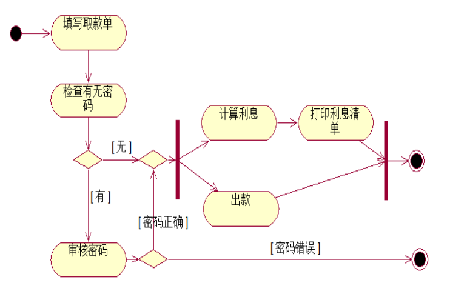

**动作和活动节点**

**开始和终止**

**控制流**

**判断节点**

**合并节点**

**泳道**

动作代表一个原子操作,操作可能是任何合法的行为。

动作可以是并且不限于:创建或删除对象、发送消息、调用接口,甚至数学运算以及返回表达式的求值结果。

活动节点是一系列动作,主要用于实现动作序列的简化和动作图的嵌套。活动节点在图例上的表达方式和动作相同。

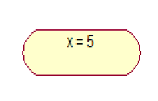

活动图中的开始和终止是两个标记符号,分别标记了业务流程的起始位置和结束位置。

活动图中必须有且仅有一个开始标记,一般至少有一个结束标记。(存在一些特殊的无穷过程不存在终止标记。


控制流是活动图中用于标示控制路径的一种符号。它负责当一个动作或活动节点执行完毕后,将执行主体从当前已完毕的节点转移到过程的下一个动作或动作节点。

控制流从活动图的开始标记开始运行,经过顺序、分支等结构引导着各个动作的连续执行。

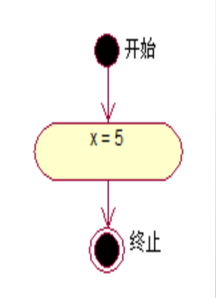

判断节点是活动图中进行逻辑判断、并创造分支的一种方法。

判断节点具有一个进入控制流和至少两个导出控制流。

判断节点具有多个导出流,对于每条导出流而言,应当在表示该控制流的箭头上附加控制条件。

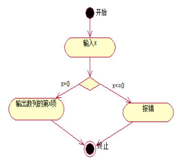

合并节点将多个控制流进行合并,并统一导出到同一个离开控制流。

合并节点仅有逻辑意义而没有时间和数据上的意义:几个动作都指向同一个合并节点也并不意味着这些动作要在进入之后互相等待或进行同步数据之类的操作。

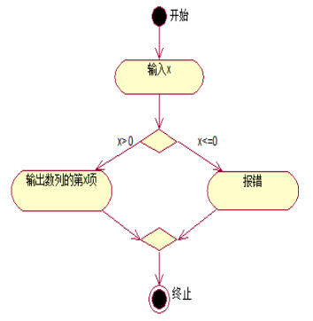

泳道是将活动中的具体活动按照负责进行该活动的对象进行分区,一条泳道中的所有活动由同一个对象来执行。

除了以上的对线性流程进行分区以外,使用泳道表示法可以更清晰地表示并发。

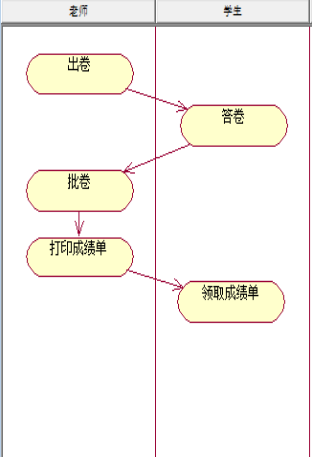

1.确定泳道

开始创建活动图时,首先需要确定参与的对象,即确定该活动图有几个泳道。泳道说明了活动是由那个对象执行的。在本例子中,我们将其分为用户与系统两个泳道,将它们绘制在活动图中,如下图所示。

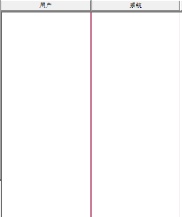

2.按逻辑顺序完成活动图

在添加完泳道后,我们需要梳理整个控制流的过程:用户首先选择购票的航班,此时如果该航班已无余票,则系统提示该航班已无票,用户重新选择航班。如果航班有余票,则系统请求用户确认购票信息,此时用户可以取消购票,也可以确认购票并支付,支付完成后系统修改机票状态并生成订票记录,然后结束整个流程。

按照上述控制流的文字描述完善活动图,注意几个特殊节点的使用。绘制完成的活动图如下图所示。

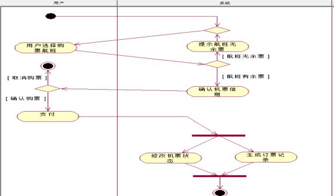

### 4.22 组件图

组件图即是用来描述组件与组件之间关系的一种UML图。组件图在宏观层面上显示了构成系统某一个特定方面的实现结构。

组件图中主要包含三种元素,即组件、接口和关系。组件图通过这些元素描述了系统的各个组件及之间的依赖关系,还有组件的接口及调用关系。此外,组件图还可以使用包来进行组织,使用注解与约束来进行解释和限定。

组件图在面向对象设计过程中起着非常重要的作用:它明确了系统设计,降低了沟通成本,而且按照面向对象方法进行设计的系统和子系统通常保证了低耦合度,提高了可重用性。

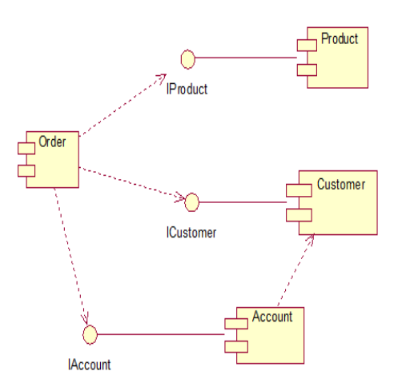

**组件**

**接口**

**组件图中的关系**

组件,是系统设计的一个模块化部分,它隐藏了内部的实现,对外提供了一组接口。

组件是一个封装完好的物理实现单元,它具有自己的身份标示和定义明确的接口。并且由于它对接口的实现过程与外部元素独立,所以组件具有可替换性。

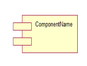

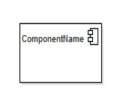

组件在系统中一般存在三种类型,分别为部署组件、工作产品组件和执行组件。

配置组件是构成系统所必要的组件,是运行系统时需要配置的组件。

工作产品组件主要是开发过程的产物,是形成配置组件和可执行文件之前必要的工作产品,是部署组件的来源。工作产品组件并不直接参与到可执行系统中,而是用来产生系统的中间产品。

执行组件代表可运行的系统最终运行产生的运行结果,并不十分常见。

对于一个组件而言,它有两类接口,提供接口与需求接口。

提供接口:又被称为导出接口或供给接口,是组件为其他组件提供服务的操作的集合。

需求接口:又被称为引入接口,是组件向其他组件请求相应服务时要遵循的接口。

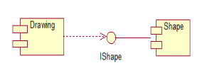

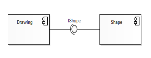

依赖关系组件与需求接口之间建立依赖关系

组件与组件之间建立依赖关系:说明在运行过程中A在某些行为上依靠组件B的支持实现关系组件与提供接口之间建立实现关系

1.确定系统组件

通过对系统的工作产品的规划和设计可以确定系统的主要组件。在本例子中,可以确定系统的主要组件包括:用户端程序、管理员端程序、服务器端程序、数据库操作组件及数据库。将这些组件添加到组件图中,如下图所示。

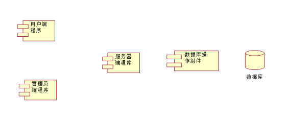

2.确定组件接口与依赖关系

在确定了系统组件之后,就需要考虑组件可以对外部提供什么服务,也即组件的接口和组件之间的相互依赖。在本例子中,数据库操作组件需要对服务器端程序提供操作数据库的接口,命名为“IDATABASE”。另外,用户端程序与管理员端程序需要依赖于服务器端程序的行为(例如查询操作)才能执行,数据库操作组件也需要依赖于数据库的行为(例如执行SQL语句)。

按照以上分析确定组件间的接口与依赖关系,建立起完整的组件图,如下图所示。

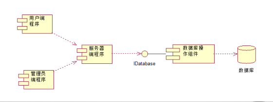

### 4.23 部署图

部署图,是一种展示运行时进行处理的节点和在节点上存在的制品的配置的图。

部署图它阐述了在实际应用中软件和它的运行环境的关系,并且描述了软件部署在硬件上的具体方式。

部署图中的主要元素包括节点与节点之间的关联关系。此外,部署图中也可以使用注解和约束。

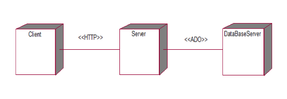

**节点**

**部署图中的关系**

节点是运行时的物理对象,代表一个计算资源。

在UML中,节点被分为两类:

处理器:是一些具有计算能力的节点,并且一般可以运行软件。

设备:是一些不具有计算能力的节点,它们可能作为一些输入输出设备或者本身是处理器的外部连接设备。

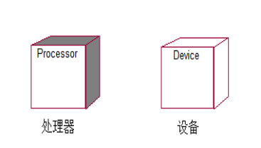

部署图的节点之间使用关联关系来表示节点之间的通信路径,称为连接。

一般对关联关系不进行命名,而是使用构造型来区分不同类型的通信路径或通信的实现方式,例如<<ETHERNET>>、<<TCP/IP>>和<<HTTP>>等能表明通信协议或网络类型的内容。

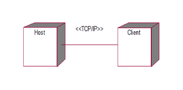

对系统使用部署图进行建模,一般会用于以下三种方式之一:嵌入式系统、B/S系统和全分布式系统。

对系统物理结构建模:

识别系统中的设备,并建模为节点。

使用构造型对不同种类的节点进行限制说明。如果可能,可以利用扩展机制创建适当的图标来表示。至少要区分出处理器与设备。

对图中的节点,分析哪些节点之间需要进行通信,在这些节点之间建立关系并用适当的构造型来描述。

如果需要,添加注解和约束来对模型进一步描述。

1.添加节点

根据系统情境可以分析出,该系统应该包括四个节点,分别是:用户端、管理员端、程序服务器端以及数据库服务器端。这四个节点都应该属于处理器,将其添加到部署图中,如下图所示。

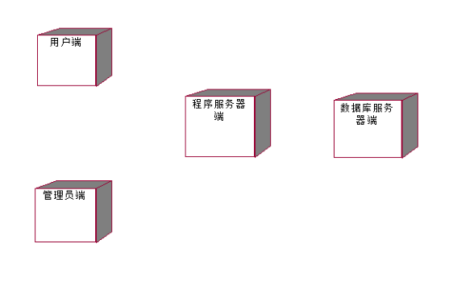

2.添加连接

在确定好系统的节点之后,我们将需要通信的节点连接起来。在此系统中,用户端与管理员端都直接与程序服务器端通信以执行系统逻辑,程序系统服务器与数据库管理系统之间进行通信以进行数据库的查询与更新操作。此外,最好对每一个连接附上合适的构造型来表示通信方式。添加连接的部署图下如图所示。至此,部署图创建完毕。

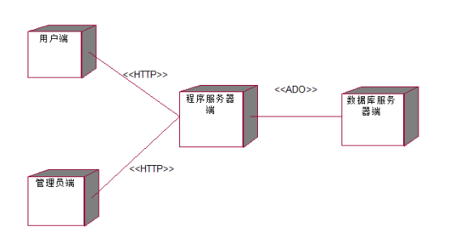

### 4.24 功能模型与 UML 图的分类

功能模型表明了系统中数据之间的依赖关系,以及有关的数据处理功能,它由一组数据流图组成。其中的处理功能可以用IPO图(或表)和伪码等多种方式进一步描述。

通常在建立了对象模型和动态模型之后再建立功能模型。

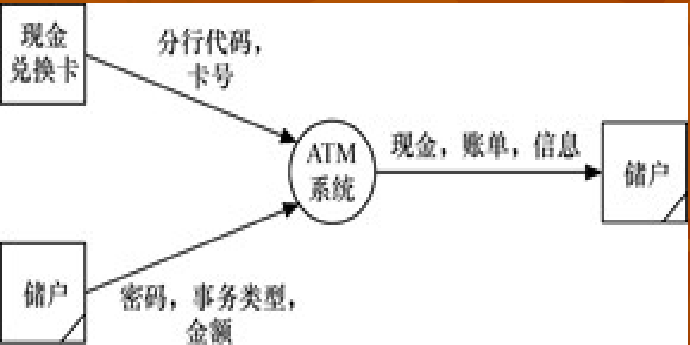

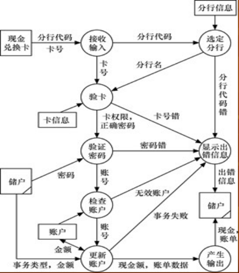

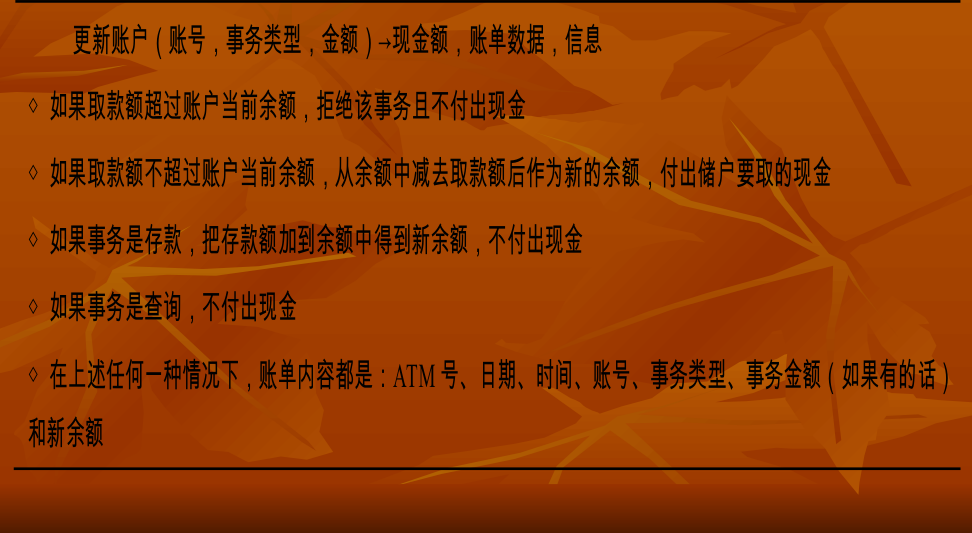

UML的主要内容可以用下述5类图(共9种图形)来定义。

1.用例图(use-case diagram)用例是对系统提供的功能(即系统的具体用法)的描述。用例图从用户的角度描述系统功能,并指出各个功能的操作者。

2.静态图(static diagram)这类图描述系统的静态结构,属于这类图的有类图(class diagram)和对象图(object diagram)。一般说来,对象图没有类图重要,它主要用来帮助对类图的理解,也可用在协作图中,表示一组对象之间的动态协作关系。

3.行为图(behavior diagram)这类图描述系统的动态行为和组成系统的对象间的交互关系,包括状态图(state diagram)和活动图(activity diagram)两种图形。实际使用时,并不需要为每个类都画状态图,仅需要为那些有多个状态,且其行为在不同状态有所不同的类画状态图。

4.交互图(interactive diagram)这类图描述对象间的交互关系,包括顺序图(sequence diagram)和协作图(collaboration diagram)两种图形。

5.实现图(implementation diagram)这类图提供关于系统实现方面的信息,构件图(component diagram)和部署图(deployment diagram)属于这类图。

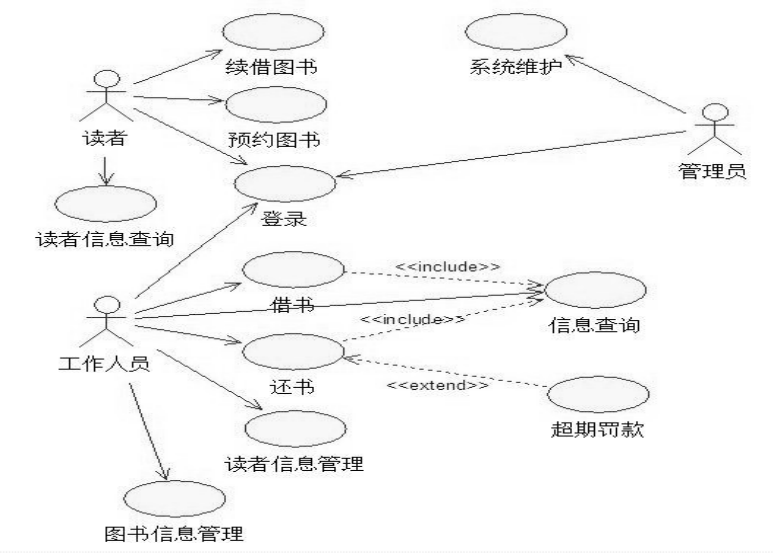

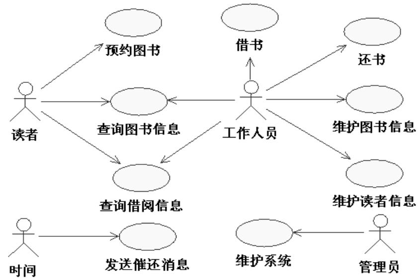

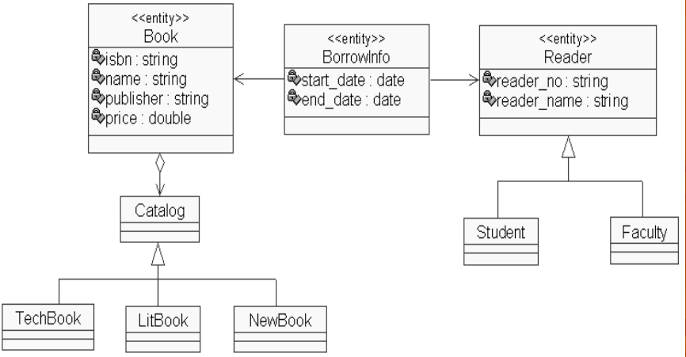

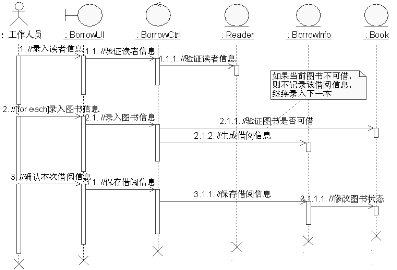


### 4.25 综合案例：项目资源管理与病房监护

例1 建立项目与资源管理系统的Use case图系统的主要功能是:包括项目管理、资源管理和系统管理三大管理功能。

1. 项目管理包括项目的增加、删除、更新。

2. 资源管理包括对资源和技能的添加、删除和更新。

3.系统管理包括系统的启动和关闭、数据的存储和备份等功能。

说明:技能表示人力资源。

**到确定**

项目管理员、资源管理员、系统管理员、备份数据系统。

项目管理,资源管理和系统管理。

2. 确定用例

**资源管理**

**备份系统**

**项目管理员**

**系统管理员**

**项目管理**

**系统管理**

资源管理员PRMS高层Use Case图

3. 对用例进行分解,画出下层的Use case图Use Case图可以自顶而下不断精化,抽象出不同层次的Use Case图。

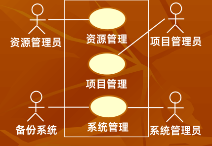

注:这里的“技能”是指人力资源。

图5.22 资源管理子系统的Use Case图资源管理员查找技能查找资源添加技能删除技能更新技能添加资源删除资源更新资源从资源中清除技能<<include>> <<include>> <<include>>把技能指定给资源<<include>> <<Extend>> <<Extend>>

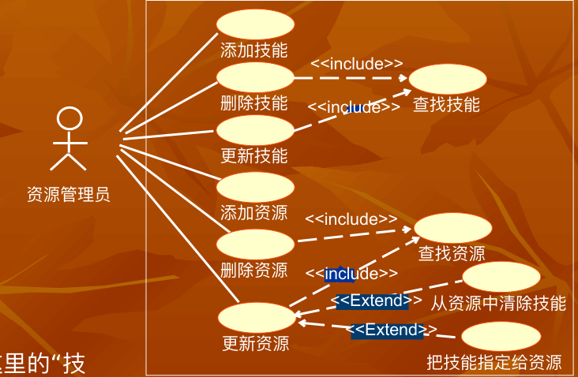

项目管理Use Case图把技能指定给资源从资源中清出技能<<include>> <<Extend>>添加项目删除项目更新项目添加任务删除任务更新任务添加活动删除活动更新活动查找项目<<include>>项目管理员<<Extend>> <<Extend>> <<Extend>> <<Extend>> <<Extend>> <<Extend>> <<Extend>>查找项目

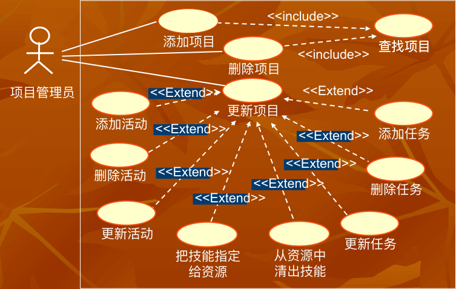

系统管理Use Case图备份资源数据备份项目数据<<include>> << Extend >> << Extend >> <<include>>查找技能添加技能存储数据启动系统关闭系统备份数据系统管理员备份系统<<include>> <<include>>角色:

角色职责:

角色职责识别:

**角色描述模板**

用例名:

功能描述:

主要步骤:

相关用例:

相关信息:(优先级

性能,频度...)

用例描述模板画出相应的执行者与用例描述模板。

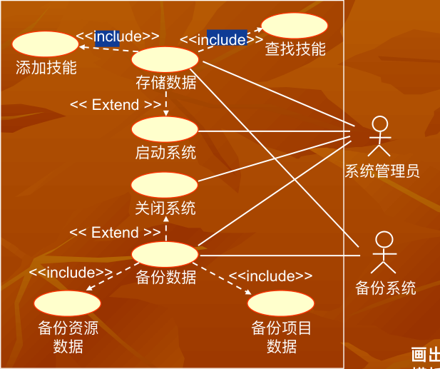


例2—医院病房监护系统

一、问题描述

为了对危重病人进行实时监护,随时了解病人病情,及时进行处理,建立病房监护系统。

病症监视器安置在每个病床,通过网络将病人的病症信号(组合)实时传送到中央监护系统进行分析处理。

在中心值班室里,值班护士使用中央监护系统对病员的情况进行监控,监护系统实时地将病人的病症信号与标准的病诊信号进行比较分析,当病症出现异常时,系统会立即自动报警,并打印病情报告和更新病历。

系统根据医生的要求随时打印病人的病情报告,系统定期自动更新病历。

经过初步的需求分析,得到系统功能要求:

1. 监视病员的病症(血压、体温、脉搏等)

2. 定时更新病历

3. 病员出现异常情况时报警。

4. 随机地产生某一病员的病情报告。

**产生**

**病情报告**

**监视病情**

**更新病历**


二、简单的需求分析说明

对“医院病房监护系统”进行分析,确定系统的主要功能如下:

1. 病症监视器可以将采集到的病症信号(组合),格式化后实时的传送到中央监护系统。

2. 中央监护系统将病人的病症信号开解后与标准的病症信号库里的病症信号的正常值进行比较,当病症出现异常时系统自动报警。

3. 当病症信号异常时,系统自动更新病历并打印病情报告。

4. 值班护士可以查看病情报告并进行打印。

5. 医生可以查看病情报告,要求打印病情报告,也可以查看或要求打印病历。

6. 系统定期自动更新病历。

**需求分析**

1. 通过以下六个问题识别角色

(1) 谁使用系统的主要功能?

(2) 谁需要系统的支持以完成日常工作任务?

(3) 谁负责维护,管理并保持系统正常运行?

(4) 系统需要应付(或处理)哪些硬设备?

(5) 系统需要和哪些外部系统交互?

(6) 谁(或什么)对系统运行产生的结果(值)感兴趣?

三、建立系统的用例模型

值班护士、医生、病人

值班护士、医生

监护器、网络、报警系统

标准病症信号库、病历库

同(2)

通过回答这六个问题以后,再进一步分析可以识别出本系统的四个角色:值班护士,医生,病人,标准病症信号库。

角色:病人

**提供病症信号**

负责生成、实时提

供各种病症信号。

角色:值班护士

**负责监视病人的病**

**情变化**

(1) 使用系统主要功能

(2) 对系统运行结果感兴趣角色: 标准病症信号库角色职责:

**负责向系统提供病症**

**信号的正常值**

(1) 负责保持系统正

**常运行**

(2) 与系统交互

角色:医生

对病人负责,负责

**处理病情的变化**

(1) 需要系统支持

**以完成其日常工作**

(2) 对系统运行结果

**感兴趣**

**角色描述**

回答下面的问题:

(1) 与系统实现有关的主要问题是什么?

(2) 系统需要哪些输入/输出?这些输入/输出从何而来?到哪里去?

(3) 执行者需要系统提供哪些功能?

(4) 执行者是否需要对系统中的信息进行读、创建、修改、删除或存储?

通过分析可以初步识别出系统的用例为:中央监护、病症监护、提供标准病症信号、病历管理、病情报告管理。顶层用例图为:

医院病房监护系统高层用例图值班护士医生病人标准病症信号库病症监护提供标准病症信号中央监护病历管理病情报告管理<<extend>> <<include>> <<include>> <<include>>

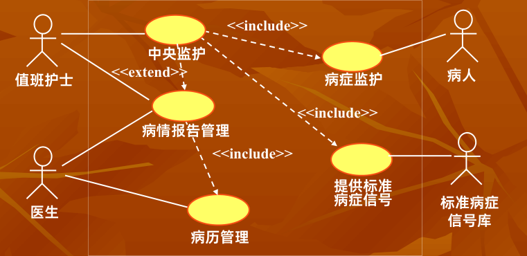

进一步将用例细化,即分解用例:

1. 中央监护

分解: a 分解信号将从病症监护器传送来的组合病症信号分解为系统可以处理的信号。

b 比较信号将病人的病症信号与标准信号比较。

c 报警如果病症信号发生异常(即高于峰值),发出报警信号。

d 数据格式化将处理后的数据格式化以便写入病历库。

2. 病症监护

分解: e 信号采集采集病人的病症信号。

f 模数转化将采集来的模拟信号转化为数字信号。

g 信号数据组合将采集到的脉搏、血压等信号数据组合为一组信号数据。

h 采样频率改变根据病人的情况改变监视器采样频率。

**用例细化**

3.提供标准病症信号 i(此用例不分解)

4. 病历管理

分解为:j 生成病历

**k 查看病历**

- 更新病历

**m 打印病历**

5. 病情报告管理

分解为:n 显示病情报告在显示器上显示病情o 打印病情报告在打印机打印病情报告用例细化

**细化的用例图**

**病人**

**模数转化**

**数据格式化**

**值班护士**

**报警**

**信号采集**

**比较信号**

**标准病症**

**信号库**

**医生**

**信号数据组合**

**采样频率**

**改变**

**提供标准**

**病症信号**

**生成病历**

**查看病历**

**打印病历**

**显示病情报告**

**打印病情报告**

分解信号<< Extend >> << Extend >> << Extend >> <<include>> <<include>> <<include>> << include>> <<include>> <<include>> << include>> << include>>

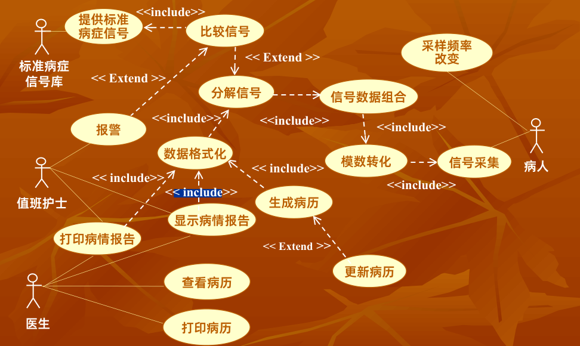

| 用例名: 中央监视 | 执行者: 值班护士、医生 |
| --- | --- |
| 目标: 对病人的病症信号进行监测、处理,超过极限报警。 | |
| 功能描述:<br>1. 分解信号:将从病症监护器传送来的组合病症信号分解为系统可以处理的信号。<br>2. 比较信号:将病人的病症信号与标准信号比较。<br>3. 报警:如果病症信号发生异常(即高于峰值),发出报警信号。<br>4. 数据格式化:将处理后的数据格式化以便写入病历库。 | |
| 其他非功能需求: 高可靠性、实时性 | |
| 主要步骤:<br> 按设定频率连续接收来自各病人的病症信号,并进行分解。<br> 将病人的病症信号与专家系统(标准病症信号库)中的标准信号进行比较判断是否超 <br> 过极限值。<br>若超过极限值,进行报警,并及时更新病历和打印病情报告。 | |
| 相关用例:病症监护、提供标准病症信号、病历管理、病情报告管理。 | |
| 相关信息:(优先级、性能、频执行率):<br>优先级:报警处理具有最高优先级3, 一般病历管理为1, 其他为2.<br>性能:实时性、高可靠性<br>频执行率:根据病情严重程度 12-30次/小时 | |

用例“中央监护”描述模板

<a id="chapter-5"></a>

## 5. 软件策划与项目计划

### 5.1 策划的目的、输入输出与时机

软件策划和软件项目策划是一个意思,既是为软件开发者和管理者制定合理的计划,又是为软件项目跟踪和监控提供考核依据。

软件策划,或者说软件计划,英文单词都是指Planning。但是,策划包含有出谋划策和做计划两个意思,计划只是策划的一个主要结果。

软件策划属于软件管理和软件决策的范畴,是项目经理以上人员的职责范围,是软件企业管理的重大事件之一。要使策划工作十分准确,往往十分困难。

软件项目管理始于软件立项,终于软件交付,中间进程是软件计划的制订、执行、跟踪、修改、评审和审计。

软件估计既是软件策划的核心,又是软件策划的重点与难点。

只有达到CMMI三级以上的软件组织,在其强大的软件测量数据库和软件工程数据库的支持下,其策划工作的误差才能控制在20%以内。

达到了CMMI四级,其策划工作的误差才能控制在10%以内。

达到了CMMI五级,其策划工作的误差才能控制在5%以内。

《合同》/

《立项建议书》

2) 《用户需求报告》

**策划过程**

1)《软件开发计划书》

2)《质量保证计划》

3)《配置管理计划》

4)《里程碑及评审计划》

软件策划的目的,是为软件开发和软件管理制定合理的计划。由于项目的管理者,是按照计划确定的内容和进度对项目进行管理的,所以计划的合理性将直接关系到项目管理的成败。在软件过程中,着重突出了对项目策划活动质量的控制,从而确保了项目得以顺利地进行。

**软件策划的基础**

软件策划的基础,是软件生命周期模型的选取。软件组织和项目经理,要根据项目的特点,在瀑布模型、增量模型、迭代模型、原型模型中选取一种,并经过适当的裁剪后,列入项目计划,作为软件项目策划的理论依据之一。

| 步骤 | 步骤名称 | 步骤内容 |
| --- | --- | --- |
| 1 | 估计软件工作产品的规模及所需的资源 | 软件工作产品,包括需求规格说明书、概要设计说明书、详细设计说明书、源代码、测试计划和测试报告、质量保证计划、软件配置管理计划、里程碑及评审点计划 |
| 2 | 制定时间表 | 包括开发进度时间表和管理进度时间表:软件开发计划、质量保证计划、软件配置管理计划、测试计划、评审计划 |
| 3 | 鉴别和评估风险 | 政策风险、资源风险、市场突变风险、技术风险和技能风险等 |
| 4 | 与相关组或人协商策划中的有关约定 | 策划的结果要实事求是,要得到各有关方面的同意和认可 |

(1) 对供项目策划和跟踪用的三个软件估计已建立文档。这三个估计是:

──工作产品规模估计

──工作量及成本估计

──计算机资源估计;

(2) 软件项目活动和约定,是有计划的并巳建立文档。这里的活动,包括开发活动和管理活动。这里的约定,是指对项目的各种标准、规范、规程的约束;

(3) 受影响的组和个人,同意他们对软件项目的约定。

受影响的组(其中有的组可能只有一个人) 和个人有:

──软件工程组(项目组)──软件估计组──系统测试组──质量保证组──配置管理组──合同管理组──文档支持组。

对软件项目进行策划的时机,中国人习惯的作法与国际通用的作法不大一致。

美国人要先做需求分析,后做软件策划,因为需求不清楚,项目的功能点个数、性能点个数、接口个数、界面个数、实体个数、文档页数都心中无数,策划人员是无法估计工作量、进度、经费和其他资源的,完成项目策划是不现实的。

中国人与美国人相反,中国人习惯在用户需求报告之前,不习惯在用户需求报告之后。不管怎么样,调查研究是十月怀胎,软件策划是一朝分娩,心中无数是不能作软件策划的。因此,我们要逐渐与国际接轨。

### 5.2 软件过程与策划活动

项目策划先选择生命周期模型，再按照组织的裁剪指南定义本项目的软件过程：开发阶段、每阶段的工作步骤和文档标准。开发计划具体规定规模、工作量、成本、进度、质量、人员及其他资源。

策划可以结合三种方式：自顶向下逐步细化任务，自底向上汇总日程与资源，参考同类项目并组织专家协商。

主要活动依次是：定义过程、进行软件估计、分析风险、规划跟踪监督、完成开发计划，并使参与部门或人员就计划达成一致。各项活动的详细内容见下文。

组织应积累测量数据和优秀文档，形成软件测量数据库与文档库，供新项目复用过程经验。策划过程中采用的估计，随后要与实际执行结果持续比较。

### 5.3 规模、成本与资源估计

软件估计覆盖规模、工作量、成本、进度和关键计算机资源。估计值与实际数据应持续进入过程数据库；出现明显偏差时重新估计。复杂性、历史数据不足、工具缺乏和判断错误都会影响准确性。

**软件工作产品规模和工作量的估计方法**

| 序号 | 规模估计方法 | 工作量估计方法 | 工作量估计方法说明 |
| --- | --- | --- | --- |
| 1 | 功能点个数 | N个功能点/人月 | 一个人的月工作量,能完成的功能点个数 |
| 2 | 性能点个数 | N个性能点/人月 | 一个人的月工作量,能完成的性能点个数 |
| 3 | 代码行数 | N行代码/人月 | 一个人的月工作量,能完成的代码行数 |
| 4 | 实体个数 | N个实体/人月 | 一个人的月工作量,能完成的实体个数 |
| 5 | 需求个数(用例Use Case个数) | N个需求数/人月 | 一个人的月工作量,能完成的Use case个数 |
| 6 | 文档页数 | N页文档/人月 | 一个人的月工作量,能完成的文档页数 |

早期的估计方法都是面向过程的,因为只有知道的语言、其源程序的规模与工作量,才能比较准确地用代码行来计算。

软件项目的规模估算历来是比较复杂的事,估算错误已被列入软件项目失败的四大原因之一。下面是对代码行的解释:

LOC 指所有的可执行的源代码行数,包括数据定义、数据类型声明、等价声明、输入/输出格式声明等。一代码行(1 LOC)的价值和人月代码行数可以体现一个软件生产组织的生产能力。组织可以根据对历史项目的审计来核算组织的单行代码价值。

例如,某软件公司统计发现该公司每一万行 C 语言源代码形成的源文件约为 250 K。某项目的源文件大小为 3.75 M,则可估计该项目源代码大约为 15 万行,该项目累计投入工作量为 240 人月,每人月费用为 10000 元(包括人均工资,福利,办公费用公滩等),则该项目中 1 LOC 的价值为:

(240×10000)/150000 = 16 元/ LOC那么,项目的人月均代码行数为: 150000/240=625 LOC/人月。

以上就是早期用代码行方法,进行软件估计的理论基础。如今,在面向对象和面向元数据方法盛行的今天,准确的代码行是很难估计的。

下面介绍的是软件规模估计的流行方法。

方法1:希腊古都法

1.Delphi 法

Delphi法又称希腊古都法。在没有历史数据的情况下,Delphi法是最流行的专家评估技术。

这种方式适用于评定过去与将来新技术与特定程序之间的差别,但专家专的程度及对项目的理解程度是工作中的难点。

Delphi方法鼓励参加者就问题相互讨论,要求有多种软件相关经验人的参与,互相说服对方。

Delphi法要求若干名专家参与,并且要选出一名组长或估计协调人,由他组织软件估计。执行Delphi法的基本步骤是:

1 、协调人向各专家提供项目规格和估计表格;

2 、协调人召集小组会,专家讨论与规模相关的因素;

3 、专家匿名填写迭代表格;

4 、协调人整理出一个估计总结,以迭代表的形式返回专家;

5 、协调人召集小组会,讨论较大的估计差异;

6 、专家复查估计、总结并在迭代表上提交另一个匿名估计;

7 、重复 4-6,直到达到一个最低和最高估计的一致。

方法2:类比法

在有历史数据的情况下,类比法适合评估一些与历史项目在应用领域、环境和复杂度相似的项目,通过新项目与历史项目的比较得到规模估计。

用类比法对软件规模进行估计,其精确度取决于历史项目数据的完整性和准确度。

用好类比法的前提条件之一,就是软件组织有强大的软件测量数据库和文档库,建立起了较好的项目评价与分析机制,使历史项目的数据分析是可信赖的。

执行类比法的基本步骤是:

(1) 整理出项目功能列表和实现每个功能的代码行;

(2) 标识出每个功能列表与历史项目的相同点和不同点,特别要注意历史项目做得不够的地方;

(3) 通过步骤1和2得出各个功能的估计值;

(4) 产生规模估计。

软件项目中用类比法,往往还需要解决可重用代码的估算问题。

方法3:功能点估计法

功能点(实体数、构件数、屏幕数、报表数、文档数)测量,是在需求分析阶段基于系统功能的一种规模估计方法。通过研究需求来确定各种输入、输出、计算和数据库需求的数量和特性。通常的步骤是:

1、计算输入、输出、查询、主控文件和接口需求的数目;

2、将这些数据进行加权乘;

3、估计者根据对复杂度的判断,总数可以用+25%、0、或-25% 调整。

注:对一个软件产品的开发,功能点对项目早期的规模估计很有帮助。然而,在了解产品越多后,功能点可以转换为软件规模测量更常用的 LOC。

方法4:无礼估计法

无礼估计法对各个项目活动的完成时间,按三种不同情况估计:

**一个产品的期望规模**

**一个最低可能估计**

**一个最高可能估计**

用这三个估计用来得到一个产品期望规模和标准偏差的无礼统计估计。无礼的估计可得到代码行的期望值E和标准偏差SD。

除了对软件规模进行估计之外,还要对软件费用与软件资源进行估什。只有这三个估计都完成后,软件估计才算最后完毕。

(2)对软件工作产品成本的费用进行量化估计软件工作产品成本估计的方法

| 序号 | 估计方法 | 估计单位(元) | 方法说明 |
| --- | --- | --- | --- |
| 1 | 直接的劳务费 | 人民币元 | 开发人员的工资和福利 |
| 2 | 管理费 | 人民币元 | 技术管理和行政管理人员的工资和福利 |
| 3 | 差旅费 | 人民币元 | 售前、售中、售后的人员差旅费 |
| 4 | 计算机使用费 | 人民币元 | 网络设备的折旧费和房租水电费 |
| 5 | 其他招待费和公关费 | 人民币元 | 控制在总费用的15%以内 |

(3)对关键计算机资源进行量化估计关键计算机资源估计的方法

| 序号 | 估计方法 | 方法说明 |
| --- | --- | --- |
| 1 | 软件工作产品的规模 | 对存储能力(磁盘容量和内存大小)的要求 |
| 2 | 运行处理的负载 | 对处理器速度的要求 |
| 3 | 通信量 | 对网络通道和带宽的要求 |

### 5.4 风险分析

风险分析活动,是通过对项目的各个方面可能存在的风险进行识别和分析,逐步降低与化解风险,确定避免或减轻风险的策略及措施,以达到回避风险,保证项目顺利进行的目的。

| 序号 | 风险名称 | 风险内容 |
| --- | --- | --- |
| 1 | 政策风险 | IT企业外部和IT企业内部两个方面的政策及政策的变化,将会给项目带来什么风险 |
| 2 | 技术风险 | 新技术的成熟程度及难度系数,将会给项目带来什么风险 |
| 3 | 技能风险 | 项目组成员学习、领会、掌握、运用新技术的能力,将会给项目带来什么风险 |
| 4 | 资源风险 | 保证项目正常进行所需的各种资源的供应程度,将会给项目带来什么风险 |
| 5 | 其他风险 | 目前意想不到的风险,即不可预测的风险,如天灾人祸 |

### 5.5 项目跟踪、监督与开发计划

在项目策划阶段,要为开发计划制定严格的审批流程。开发计划在经过组织批准生效后,将成为进行项目跟踪与监督的基础,并且随着项目的进展,定期地或事件驱动式的对开发计划进行修订和完善。

在开发计划中,描述了如何实施和管理项目定义的软件过程。在项目实践中,通常为项目指定一名项目软件管理器(Project Software Manager),由项目软件经理负责,依据开发计划对项目实施跟踪与监督,并在项目的执行过程中,要求项目中的各级负责人查阅和分析软件测量数据库和文档库,使用组织级的经验对项目进行监控。

(1)软件项目的目的、范围、目标和对象。

(2)软件生命周期的选择与裁剪。

(3)确定软件开发和维护的规范、方法和标准。例如,开发策略、配置管理、质量保证、设计方法、问题跟踪和解决、软件测量等。

(4)软件工作产品的确定。

(5)对工作产品规模的估计。

(6)对工作量和成本的估计。

(7)关键计算机资源的估计和使用情况。

(8)项目的进度、里程碑和评审计划。

(9)风险的识别和评估。

(10)项目工程设施和工具的计划。

| | 组或个人名 | 组或个人名称说明 |
| --- | --- | --- |
| 1 | 软件工程组 | 软件工程组国内叫项目组 |
| 2 | 系统工程组 | 系统工程组是负责下列工作的个人的集合:规定系统需求;将系统需求分配给硬件、软件和其他成分;规定硬件、软件和其他成分之间的界面;以及监控这些成分的设计和开发,以保证它们符合其规格说明。系统工程组就是总体设计组 |
| 3 | 软件质量保证组 | 软件质量保证组是一些计划和实施项目的质量保证活动的个人的集合,工作的目的是保证遵守软件过程的步骤和标准。即SQA组 |
| 4 | 高级管理者 | 高级管理者在高的层次上履行管理职责 |
| 5 | 项目经理 | 项目经理履行的职责是对整个项目的总体业务负责;项目经理是指导、控制、管理和调整项目完成构造软件或硬件系统工作的个人,项目经理是最终向顾客负责的个人 |

软件开发计划采用自然语言描述,可以在描述中加入图表。编制工具可以采用Microsoft公司的Word和Project,一般采用Word 书写文件的主体部分,采用Project形成的文件作为它的附件。

### 5.6 策划文档与管理

1. 软件策划文档

软件策划文档就是《软件开发计划书》,它还包括《质量保证计划》、《软件配置管理计划》、《测试计划》、《里程碑及评审点计划》。

《软件开发计划书》是软件项目策划过程的最终工作产品,所以放在这里详细介绍。其主要内容包括:项目概述、项目组织、生命周期模型、工作产品的规模与工作量估计、项目成本估计、计算机资源估计、项目进度计划、项目风险分析、阶段评审计划。

软件策划的目的,是建立对实际进展的可视性监控,使管理者能在计划发生明显偏离时采取有效措施。

2. 软件策划管理文档

软件策划管理过程的输入是:《软件开发计划书》和项目组的实际工作进度与状态。软件策划管理的输出文档是:

(1)项目周报

(2)项目月报

(3)里程碑报告

(4)重大事件报告

(5)软件开发计划评审报告

(6)项目计划变更申请表

(7)计划更改与批准记录

《软件开发计划书》

2) 项目组的实际工作进度与状态软件策划管理过程

1) 项目周报

2) 项目月报

3) 里程碑报告

4) 重大事件报告

5) 软件开发计划评审报告

6) 项目计划变更申请表

7) 计划更改与批准记录

在CMM框架中,软件策划管理的方法,是面向CMM2的关键过程域SPTO (Software Project Tracking and Oversight)方法。

软件策划完成之后,必须要对策划输出文档进行评审。只有评审获得通过,才能结束策划阶段的工作。

项目经理按计划跟踪项目进度、软件工作产品规模、工作量和成本、关键计算机资源、软件工程技术活动和软件风险,并以此编制项目进展报告。项目经理定期或事件驱动组织软件工程组进行内部评审,以便对照开发计划跟踪,并将评审结果告知软件相关组。当软件开发计划发生20%的偏离时,必须修改《软件开发计划》,并将修改的结果通知有关的组和个人。

计划跟踪与监控时,必须注意软件工程中的“20/80原理”,即“二八定律”

如果说,软件立项就是软件组织的重大决策,那么,软件策划就是贯彻执行重大决策的具体行动。立项或签订合同是软件项目的源头,策划是指导软件项目开发和管理的依据。

为了使软件策划有坚实的基础,使软件开发计划不至于过多偏离项目工程进度、质量、资源的实际(小于20%),最常用的办法是:

(1)策划的时机,选择在《用户需求报告》之后和《需求规格说明书》之前。

(2)软件估计时,查阅软件组织的“软件测量数据库”,参照同类可比项目的历史经验。

(3)由同行专家,对《软件开发计划书》进行评审。

<a id="chapter-6"></a>

## 6. 软件设计

### 6.1 设计任务与三层结构

软件需求是软件设计的基础,软件设计是软件开发的核心。

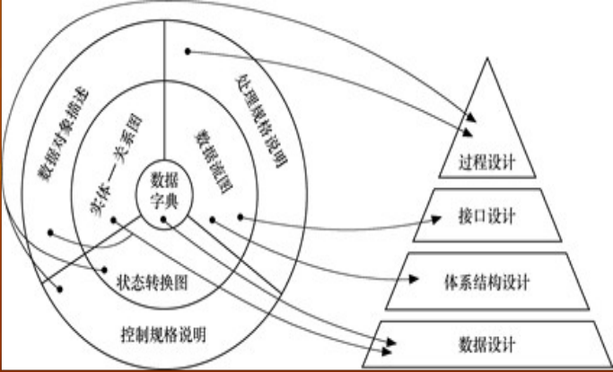

本章首先讨论概要设计与详细设计之间的差异、“三个模型”与“三层结构”之间的关系、软件设计原理,然后详细地论述如何用“面向过程、面向对象和面向元数据”三种不同方法,进行概要设计和详细设计,并且明确地给出了面向对象设计的描述方法和设计步骤,从而解决了软件设计中的难题。

1.概要设计与详细设计的差异

软件设计的输入是《需求分析规格说明书》,输出是《概要设计说明书》和《详细设计说明书》。

概要设计(架构设计)的主要目的,是按某种设计方法,将软件系统分解为多个子系统,再将子系统分解为多个模块或部件,并将系统所有的功能合理地分配到模块或部件中去。

详细设计是面向程序员的,它的主要目的,是按某种设计方法,将软件系统的模块或部件,进行编程实现设计,用以指导程序人员编写代码,形成模块或部件的实现蓝图。

按照“五个面向”的实践理论,软件设计主要是面向元数据设计,软件编程主要是面向对象实现。这里的元数据,是泛指一切组织数据的数据,例如类的名称、属性和方法,实体的名称、属性和关联,数据结构中存储数据的框架等等,它们都是元数据。

所有的设计都是面向模块的,或者说是面向部件的,不是面向组织结构或部门岗位的。一个组织或单位,根据角色的不同授权,可以挂上不同的模块或部件。因此,一个优秀的软件,不会因企事业单位内部的组织结构变动,而导致软件不能使用。

2.三层结构设计

三层体系结构通常被划分为表示层、中间层和数据层三层,各个分层之间通过对外接口来互相访问。分层结构的主要目的,是为了允许各层可以随着需求或技术的变化而独立的升级或替换,例如当替换数据库时只需要变化数据层。

三层结构,就是在原来两层结构(Client/Server)的客户层与数据层之间,加入了一个中间层(也叫业务层),并将应用程序的业务规则、数据访问、合法性校验等工作放到了中间层进行处理,这样就变成了三层结构(Browser/Server)。

三层是指逻辑上的三层,即使这三个层都放置到一台机器上。当然,三层也可以放在两台或三台机器上。

1.表示层(Presentation Tier)表示层通常采用图形化用户界面,在客户端的PC机或工作站上运行。

站在“三个模型”建模思想上看,系统内部支持表示层的模型是“功能模型”,尽管“功能模型”中的功能实现组件都存放在业务层上,但是功能组件的表现方式却在表示层上。该层的主要功能是:

(1). 接受用户的请求,将这些请求反馈给业务逻辑层,等待业务逻辑层的回答信息;

(2). 对业务逻辑层的回答信息,进行显示;

(3). 有时也会兼做业务逻辑层的一些小功能,比如对用户输入数据的验证,以及操作合法性的检验。

2.中间层(Business Tier)中间层也称业务层,它由许多构件或组件组成,这些构件或组件完全体现了用户的业务逻辑或业务规则。

站在“三个模型”建模思想上看,系统内部支持业务层的模型是“业务模型”。尽管Java EE与.NET在实现业务层上的方法略有差异,但是,业务层本质上都是在表示层与数据层之间起桥梁作用。业务层的主要功能是:

(1). 接受从表现层传来的用户请求信息;

(2). 根据用户的请求信息生成SQL语句;

(3). 利用生成的SQL语句从数据层取数据、或修改数据、或删除数据;

(4). 将结果返回给表现层。

3.数据层(Data Tier)

数据层是数据库服务器上的数据库层,它包括数据库管理系统DBMS和数据库DB两部分。

站在“三个模型”建模思想上看,系统内部支持数据层的模型是“数据模型”。该层的主要功能是:

(1). 接受业务层数据处理请求的SQL语句或存储过程;

(2). 利用SQL语句或存储过程,对数据库服务器上数据库的相关表进行存储或检索;

(3). 将存储或检索的结果信息,传递给业务层。

4.三层协调工作

三层之间,通过各自提供的接口来访问,比如用户想登录并操作系统,在表示层输入用户名和密码,表示层会收集相关的数据传递给业务层,业务层将数据经过一些处理和封装之后,再传递给数据层,数据层执行相应数据库中表的操作,并将结果返回业务层,业务层再返回表示层,表示层再显示给用户看。

对登录信息和操作信息,都是这么分层处理、协调工作的。业务层与数据层的信息交换采取批发方式,业务层与表示层的信息交换采取零售方式。

5.三层结构优点

(1). 三层之间的低耦合,所以互不干扰,哪一层出了问题就去找哪一层去解决;

(2). 三层结构减少了客户机的工作量,提高了网络系统的运行效率;

(3).三层结构有利于系统的维护和升级,各个层的维护互不影响。例如,修改表示层,不会影响修改业务层;修改业务层,也不会影响修改数据层。而且,所有层的维护与修改,都是在服务器上进行,不需要到用户现场出差。

6.三层与多层的关系

若将中间层按照应用逻辑进一步划分,三层体系结构就变成了多层体系结构,如下图所示。

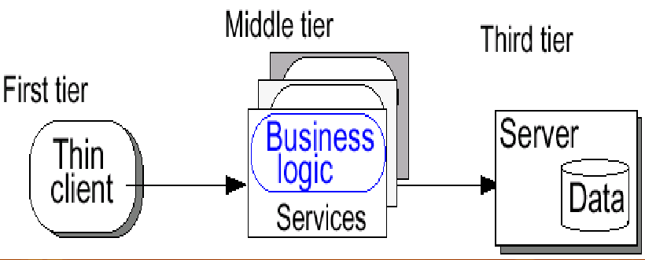

### 6.2 抽象、模块化与信息隐藏

“设计”在IEEE中的定义是:“定义一个系统或部件的架构、组成、接口或其他特征的过程”,或者是“该过程的结果”。

软件设计是一个过程,它是软件生命周期中的一部分,是对软件需求分析后产生软件内部结构的一种描述。软件设计的结果,应能描述软件的架构,即软件中各个部件是如何分解并组合在一起的,这些描述将作为软件构建的基础。

软件设计原理,就是各种软件设计方法都应该遵守的共同基本原理。这些设计原理包括:抽象、模块化、信息隐藏、模块独立性、封装、接口和实现分离。

1.抽象

没有抽象就没有科学。在每个阶段中,抽象的层次逐步降低,在软件结构设计中的模块分层也是由抽象到具体的分析和构造出来的。

抽象是将几个有区别的物体的共同性质或特性,形象地抽取出来。通过抽象忽略事物的细部特征,使开发人员同时只关注少数几个概念。

在软件设计过程中常用的抽象技术有下列几种:

(1) 控制抽象

计算机语言具备控制抽象的能力。计算机只理解一些低级的操作,例如将字节从一个位置移动到另一个位置,对两个字节进行连接。从机器指令到汇编语言,再到高级语言,使你能在更高的层次上进行抽象,以便处理问题,并且可以屏蔽不同机器和指令集间的差异。

面向过程的设计通过清晰的控制流程和部件间的接口,来实现对复杂的软件进行分解,达到降低软件复杂度的目的。面向对象的设计同时进行数据抽象和控制抽象,从而实现使数据和控制融为一体,构成一个完整的对象。

(2) 过程抽象

将处理过程抽象成存储过程、函数或方法,通过提供不同的参数实现具体化。你可以观察到存储过程、函数或方法的最终执行结果,而不必去关心它们内部的实现步骤。

(3) 数据抽象

在数据库建模和面向对象建模时,使用数据抽象,能够设计出数据库的表及表的字段,或设计出类及类的属性。

2.模块化

模块就是指在程序中的数据说明、可执行语句等程序对象的集合,或者是单独命名和编址的元素。如高级语言中的过程、函数、子程序等。每个模块可以完成一个特定的子功能,各个模块可以按一定方法组装起来成为一个整体。

所谓模块化,就是解决一个复杂问题时,自顶向下、逐步求精地把软件系统划分成若干模块的过程。

划分模块并不是越多越好,因为这会增加模块之间接口的工作量。所以划分模块的层次和数量应该避免过多或过少。

3.信息隐藏

信息隐藏的意思,就是指在设计和确定模块时,使得一个模块内包含的信息(过程或数据),对于不需要这些信息的其他模块来说是不能访问的。

假设我是程序中的一个模块,电话机是另一个模块,我在使用电话机时,对电话机的控制是通过几个按键来确定的,输入的数据是我的语音,输出的数据是对方的语音,而这些输入、输出的数据变换以及控制,在电话机内部是怎么实现的我不需要知道,同时也不能加以直接控制,这样,如果电话机坏了,修复或更换后对我的使用是没有任何影响的。

### 6.3 模块独立性、耦合与内聚

4.模块独立性

模块独立性是指每个模块只完成系统要求的独立的子功能,并且与其他模块的联系最少,且接口简单。

“高内聚、低耦合”是两个定性的度量标准。

(1)耦合性

耦合是对不同模块之间相互依赖程度的度量。

紧密耦合是指两个模块之间存在着很强的依赖关系。

松散耦合是指两个模块之间存在一些较弱的依赖关系。

无耦合是指模块之间根本没有任何连接与依赖关系。

模块之间联系越紧密,其耦合性越强,其独立性就越差。模块间的耦合性从低到高可分为以下七种类型,如下图所示:

非直接耦合:就是没有耦合,井水不犯河水。

数据耦合:就是参数传递耦合,它属于低级别耦合。例如,模块间通过参数传递或数据结构来访问。一个模块访问另一个模块时,彼此之间是通过简单数据参数(不是控制参数、公共数据结构或外部变量)来交换输入、输出信息的。这些参数一般称为入口参数和出口参数。

标记耦合:标记耦合指两个模块之间传递的是数据结构,如高级语言的数组名、记录名、文件名,这些名字即为标记,表示传递的信息是这个数据结构的地址。例如,一组模块通过参数表传递记录信息,那么它们之间就是标记耦合。

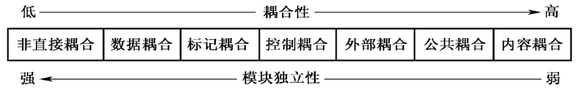

控制耦合:它属于中级别耦合。例如,操作系统中的进程调度程序,通过就绪进程的优先级,来调度进程运行。那么调度程序与进程之间的耦合,就是控制耦合。

外部耦合:它属于高级别耦合。例如,模块间共享全局变量,或共同访问全局数据区中的数据项。

公共耦合:指通过一个公共数据环境相互作用的那些模块间的耦合。公共数据环境可以是全程变量或数据结构、共享的通信、内存的公共覆盖区、以及任何存储介质上的文件和物理设备。

内容耦合:它属于最高级别耦合。例如,一个模块利用分支或跳转技术,转入到另一个模块中去执行,就是内容耦合。

耦合可能发生在软件设计之中,也可能发生在软件编程之中。为了降低模块间的耦合度,可以采取以下措施:

(a)在耦合方式上,降低模块间接口的复杂性。

(b)在传递信息类型上,尽量采用数据耦合,避免使用控制耦合,慎用或有控制地使用公共耦合。在实践中要根据实际情况综合考虑。

对于低内聚的模块,则通过重新分解来实现模块的修改与优化,这样提高了模块内部的紧凑性,必然会降低块间联系,确保从整体上提高模块的独立性。

(2)内聚性

内聚是对同一模块内部各个元素之间彼此结合紧密程度的度量。内聚性越高,则模块内部的结合紧密程度越好。根据内聚性从低到高排列,可分为以下七种不同类型的内聚,如下图所示:

巧合内聚:一个模块内的各处理元素之间没有任何联系。

逻辑内聚:一个模块由执行几个逻辑上相似功能的处理元素所组成,它们通过参数,来决定由处理元素完成的处理功能。

时间内聚:把需要同时执行动作的处理元素组合在一起,形成一个模块,称为时间内聚模块。

过程内聚:构件或操作的组合方式是,允许在调用前面的构件或操作之后,马上调用后面的构件或操作,即使两者之间没有数据进行传递。如果一个模块内处理元素是相关的,而且必须按固定的次序执行,那么这种内聚就叫做过程内聚。过程内聚的模块内往往体现为有次序的流程。

通信内聚:指模块内所有处理元素都在同一个数据结构上的操作。或指各处理元素使用相同的输入数据或者产生相同的输出数据。

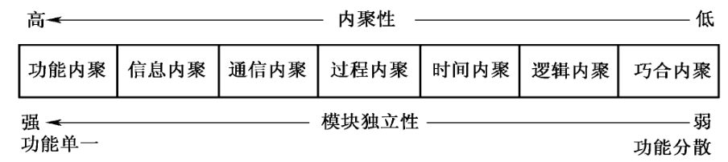

信息内聚:指一个模块内处理元素都密切相关于同一功能且必须顺序执行,前一个处理元素的输出,就是下一个处理元素的输入。

功能内聚:这是最强的内聚,指模块内所有处理元素共同完成一个功能,缺一不可,模块已不可再分割,即模块在功能上具有原子性。

将软件系统划分为模块时,要尽量做到高内聚、低耦合,以提高模块的独立性。在内聚性与耦合性发生矛盾的时候,最好优先考虑耦合性,也就是先保证耦合性低一些。

对于高耦合度的模块,则通过功能重组,将联系紧密的部分组成新的模块,这样可以防止系统僵化,提高模块的可维护性。

也就是说,用分解来降低模块之间的耦合度。

过度地分解会使模块数量增加,集成的成本和错误的数量也会增加。在Hatton的报告中指出,错误密度与模块大小呈开口向上的U形曲线的关系。根据Hatton的测算,一个模块中代码行在200~400之间是错误密度最小的区域,如下图所示。

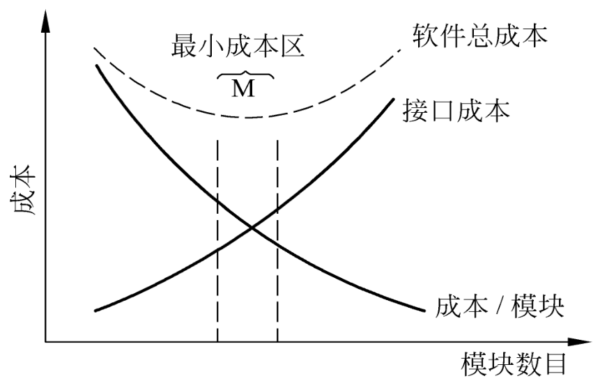

### 6.4 封装与设计原理

5.封装

封装是将信息隐藏在一个实体中,使其内部细节对外部不可见。封装是实现“低耦合高内聚”的技术手段之一。要进行正确的封装,必须遵守下列原则:

(1) 实体间相互隐藏内部实现。

(2) 尽量减少全局的共享数据。

6.接口和实现分离

接口和实现分离的思想起源很早。上世纪五十年代,就出现了“子程序和函数”的概念,人们在实现和调用它们的时候,就运用了这种思想。将接口和实现分离开来,对外只提供接口,隐藏具体实现。接口与实现的分离,保证了实现的独立变化,降低了模块间的耦合。

以上的软件设计原理,都来自于软件实践,反过来又指导软件实践。随着软件实践的发展,软件设计原理还会进一步发展。

需求分析阶段的主要任务是确定系统必须“做什么”,形成软件的需求分析规格说明书,软件设计阶段的主要任务是确定系统“怎么做”,从软件需求规格分析说明书出发,形成软件的具体设计方案。

软件设计可以采用多种方法,如面向过程设计、面向对象设计,下面分别介绍这两种设计方法。

### 6.5 概要设计、层次结构与文档

面向过程设计,又称为结构化设计,或面向功能设计。

该设计方法已经盛行半个世纪,因此非常成熟,尤其是那些过程特征明显的应用系统,至今尚离不开它。

由于面向过程设计可以明显地分为概要设计和详细设计两个阶段,而且两个阶段的描述工具也不相同,所以将这两个阶段的设计分别介绍。

1.面向过程概要设计的主要任务

软件概要设计要做的事情是什么呢?总的来看有五个方面的任务,它们是:

(1). 制定规范:主要是接口规约、命名规则。

(2). 设计软件系统结构(软件结构)。

(3). 数据结构及数据库设计。

(4). 编写概要设计文档。

(5). 评审。

在面向过程方法中,需求分析阶段已经把系统分解成层次结构,而在概要设计阶段,需要进一步划分为模块以及模块的层次结构。划分的具体过程是:

(1). 采用某种设计方法,将一个复杂的系统按功能划分成模块。

(2). 确定每个模块的功能。

(3). 确定模块之间的调用关系。

(4). 确定模块之间的接口,即模块之间传递的信息。

(5). 评价模块结构的质量。

对于大型数据处理的软件系统,要专门对数据结构及数据库进行设计。

在概要设计阶段,主要有以下文档需要编写:

(1). 概要设计说明书。

(2). 数据库设计说明书。

(3). 用户手册。

(4). 修订测试计划。

最后一个任务就是评审。在概要设计中,对设计部分是否完整地实现了需求中规定的功能、性能等要求,设计方案的可行性,关键的处理及内外部接口定义正确性、有效性,各部分之间的一致性等都要进行评审,以免在以后的设计中发现大的问题而返工。

2.面向过程概要设计的主要内容

(1). 画出软件系统的层次结构图。

概要设计阶段的主要内容,是把系统的功能需求分配给软件结构,形成软件的层次结构图,在图中矩形表示功能单元,称为“模块”,此时每个模块还处于黑盒子级,一个模块作用范围的宽度与深度要适度,一般其深度与宽度都不要超过七层。同理,一个模块的扇入与扇出,也都不要超过七个。如下图所示。

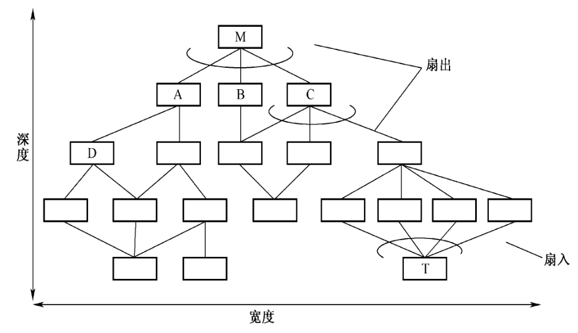

对层次结构图的两点解释:

(a). 层次结构图是软件概要设计阶段最常使用的表示形式之一,用来描绘软件的层次结构,图中的每个方框代表一个模块,方框间的连线表示模块的调用关系,层次结构图适合于在“自顶向下、逐步求精”面向过程设计中使用;

(b). HIPO图是由美国IBM公司发明的“层次图+输入/处理/输出图”的英文缩写,它是层次结构图的变种,是对层次结构图的补充。HIPO图实际上由H图和IPO图组成,H图就是上面提到的层次结构图,为了使HIPO图有可跟踪性,在H图里除了最顶层的方框之外,每个方框都加了编号。

(2). 对层次结构图中内容进一步说明。

(a). 功能模块说明:每个功能用那些小模块实现,以保证每个功能都有相应的小模块来实现;

(b). 模块层次结构说明:可以用视图从多个角度来表示与说明层次结构;

(c). 模块间的调用关系:模块间的接口的总体描述;

(d). 模块间的接口说明:传递的信息及其结构;

(e). 处理方式设计说明:满足功能和性能的算法,用户界面设计。

(3). 数据结构设计说明:详细的表、索引、文件数据结构;与算法相关的逻辑数据结构及其操作。

(4). 运行设计说明:运行时模块的组合、控制、时序;

(5). 出错设计说明:出错信息、出错处理;

(6). 其他设计说明:授权、保密、维护。

### 6.6 结构图与面向数据流的设计

3.面向过程概要设计的主要方法

(1). 功能模块分解方法。

(2). 功能模块调用方法。

(3). 功能模块转化方法。

(4). 数据流图转换为层次结构图方法。

通过以上四种方法的灵活运用,就能完成面向过程概要设计的任务,实现面向过程概要设计的内容。

例如:在结构化设计过程中,要将数据流图(DFD)映射成系统结构图(SC),分别画出变换型数据流和事物型数据流的映射方式。

在不考虑时间因素的前提下开发并精化软件结构在详细设计阶段选出最耗费时间的那些模块,仔细地设计它们的处理过程(算法),以求提高效率使用高级程序设计语言编写程序在软件中孤立出那些大量占用处理机资源的模块必要时重新设计或用依赖于机器的语言重写上述大量占用资源的模块的代码,以求提高效率

### 6.7 人机界面设计

**系统响应时间**

**用户帮助设施**

**出错信息处理**

**命令交互**

### 6.8 详细设计与程序流程图

软件详细设计,又称为软件实现设计。

若在概要设计中将软件系统划分为各个不同的模块,则详细设计就是各个模块的实现设计。

面向过程详细设计,实质上就是面向算法分析设计。即使是采用其他的设计方法,如面向对象设计方法,其方法本身的实现仍然是面向过程的。因此,面向过程详细设计,是其他各种详细设计的基础。

面向过程程序设计技术,采用自顶向下逐步求精的设计方法和单入口单出口的控制结构,并且只包含顺序、选择和循环三种结构,设计的目标之一是使程序的控制流程线性化,即程序的动态执行顺序符合静态书写结构。

详细设计的任务是给出软件模块结构中各个模块的内部过程描述,也就是模块内部的算法设计。

详细设计的工具可以分为图形、表格、语言三种,包括程序流程图、盒图(N-S图)、程序设计语言PDL、PAD图。

一般而言,面向过程详细设计的描述工具有下列五种:

1. 程序流程图(Flowchart)

程序流程图是用图形化的方式,表示程序中一系列的操作以及执行的顺序,其表示元素如下表所示。

程序流程图中使用的主要符号包括顺序、选择、循环结构,它的主要缺点如下,程序流程图本质上不是逐步求精的好工具,它诱使程序员过早的考虑程序的控制流程,而不去考虑程序的全局结构,程序流程图中用箭头代表控制流,因此程序员不受任何约束,可以完全不顾结构程序设计的精神,随意转移控制,程序流程图不易表示数据结构。

| 名称 | 图例 | 说明 |
| --- | --- | --- |
| 终结符 | | 表示流程的开始和结束 |
| 处理 | | 表示程序的计算步骤或处理过程,在方框内填写处理的名称或程序语句 |
| 判断 | | 表示逻辑判断或分支,用于决定执行后续的路径,在菱形框内填写判断的条件 |
| 输入/输出 | | 获取待处理的信息(输入),记录或显示已处理的信息(输出) |
| 连线 | | 连接其他的符号,表示执行顺序或数据流向 |

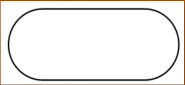


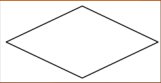

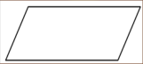

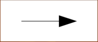

常见的程序流程图结构有三种,如下图所示。

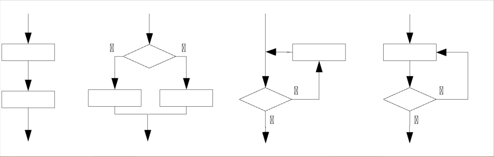

【例】 使用程序流程图,描述并打印N的阶乘,如下图所示。

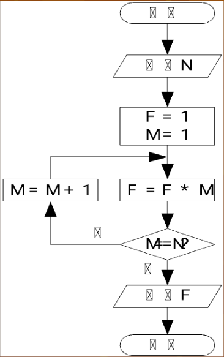

### 6.9 N-S 图、PDL 与判定树

2. N-S图(Nassi-Schneiderman Diagram) Nassi-Schneiderman图是流程图的另一种表达形式,由Nassi和Schneiderman提出,简称N-S图。与流程图对应的三种结构,如下图所示。

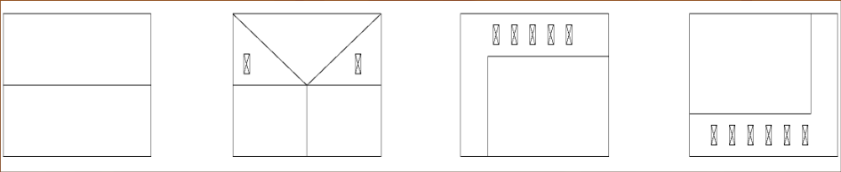

【例】 使用N-S图,描述并打印N的阶乘,如下图所示。

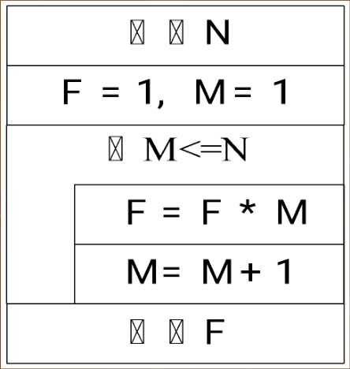

3. 程序设计语言PDL(Program Design Language)程序设计语言PDL也称为伪码,它是用正文形式表示数据结构和处理过程的设计工具,PDL具有以下特点:关键字的固定语法,提供了结构化控制结构、数据说明和模块化的手段,自然语言的自由语法,用于描述处理过程和判定条件,数据说明的手段,既包括简单的数据结构,又包括复杂的数据结构、模块定义和调用的技术,提供各种接口描述模式。

程序设计语言又称结构化英语,它使用结构化编程语言的风格描述程序算法,但不遵循特定编程语言的语法。

【例】 使用程序设计语言描述打印N的阶乘。

```text
读入 N
F = 1
M = 1
当 M <= N 时:
    F = F * M
    M = M + 1
打印 F
```

4. 决策表(Decision Table)决策表(判定表)用于以紧凑的形式描述复杂的逻辑。决策表与if-else、switch-case语句类似,将条件判断与执行的动作联系起来。

决策表通常分成四个区域。

【例】 条件对应于一个变量、关系或预测,其可能的组合在条件选择中列出。动作是一个函数或操作。动作选择描述当条件满足时所执行的动作,如下图所示。

| 条件 | 不能打印 | √ | √ | √ | √ | | | |
| --- | --- | --- | --- | --- | --- | --- | --- | --- |
| | 红灯闪 | √ | √ | | | √ | √ | |
| | 不能识别打印机 | √ | | √ | | √ | | √ |
| 动作 | 检查电源线 | | | √ | | | | |
| | 检查打印机数据线 | √ | | √ | | | | |
| | 检查是否安装驱动程序 | √ | | √ | | √ | | √ |
| | 检查墨盒 | √ | √ | | | √ | √ | |
| | 检查是否卡纸 | | √ | | √ | | | |

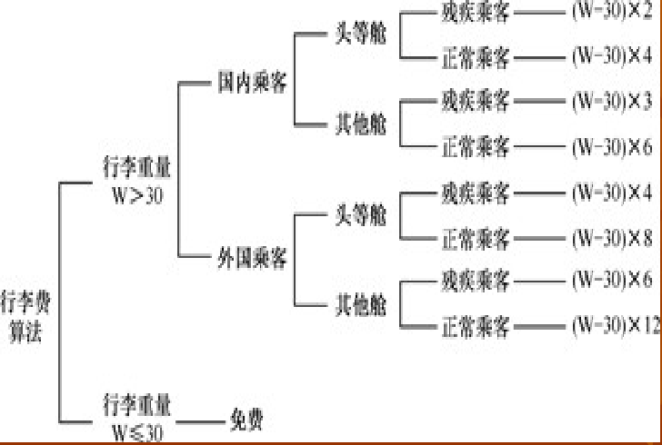

### 6.10 PAD 与面向数据结构的设计

5. PAD (Problem Analysis Diagram)自1973年由日本日立公司发明PAD图形以来,已经在日本国内及中国的软件外包公司得到一定程度的推广。PAD用二维数形结构的图表示程序的控制流,将这种图转换为程序代码比较容易,如下图所示。

PAD图形具有如下优点:

(1). 使用结构优化控制结构的PAD符号,所设计出来的程序必然是程序化程序。

(2). PAD图中最左边的竖线是程序的主线,即第一层控制结构。随着程序层次的增加,PAD图逐层向右延伸,每增加一个层次,图形向右扩展一条竖线。

PAD图中竖线的总条数就是程序的层次数。

(3). 用PAD图表现程序逻辑,易读、易懂、易记。PAD图是二维数型结构的图形,程序从图中最左边上端的结点开始执行,自上而下,从左到右顺序执行。

(4). 很容易将PDA图转换成高级程序语言源程序,有利于提高软件可靠性和软件生产率。

(5). 既可用于表示程序逻辑,也可用于描述数据结构。

(6). PAD图的符号支持自顶向下、逐步求精方法的使用。

由此可见,PAD是一种程序结构可见性好、结构唯一、易于编制、易于检查和易于修改的详细设计表现方法。

【例】 使用PAD图描述打印N的阶乘,如下图所示。

read N;

i=1; p=1;

i <=N;

p=p×i; i =i+1;

Print p;

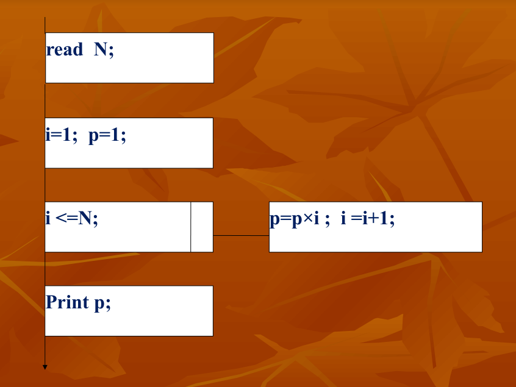

**Jackson方法**

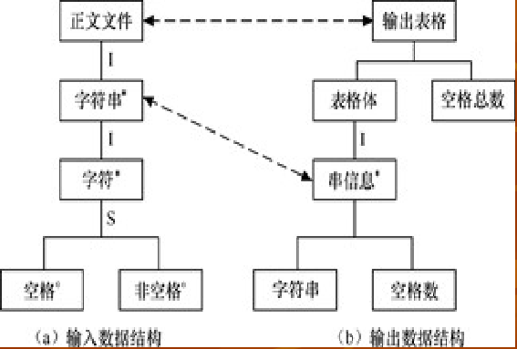

### 6.11 面向对象设计与 UML 描述工具

当对象、类、构件、组件、部件等概念出现之后,传统意义上的软件概要设计(有时又称软件总体设计或软件系统设计),就逐渐改名为软件架构设计。所以说,架构设计就是面向对象中的概要设计,架构中的部件就是模块,而部件实现设计就是面向对象中的详细设计。

UML既是面向对象需求分析的描述工具,又是面向对象架构设计的描述工具,更是面向对象详细设计的描述工具,使得软件开发这三个重要阶段的描述工具不但统一起来了,而且实现了平滑过渡与无缝连接,形成一个从需求到设计的一体化流程,致使这三个阶段之间没有明显的界线。

UML只是一种面向对象的建模图形语言,它本身不是模型,不是过程,不是元数据,更不是方法论。许多人错误地认为,UML是一种建模方法论,因此不会使用面向对象设计,更不知道面向对象设计的具体步骤。因此,在讨论面向对象设计时,尤其是在讨论面向对象设计的步骤时,千万不要将UML视为一种模型或建模方法论。在进行面向对象设计时,首先要解决的两个问题:

(1). 你在设计中决定建立哪几个具体的模型?

(2). 你决定在UML中挑选哪几种图形语言,来描述你的哪几个模型?

本节首先介绍UML中的几种常用图形,然后介绍在面向对象设计中需要建立哪几个种模型,以及面向对象设计的具体步骤。

UML只是目前最常用的一种面向对象建模语言,主要包括七种常用的类型,即用例图、类图、顺序图、状态图、活动图、部件(构件)图和部署图,分别用以不同的建模用途。

虽然UML不包括界面图,但界面图对界面设计很重要,所以也在这里加以介绍,这样总共就有八种图。这八种图分为两大类:

第1类:系统静态建模图(结构图):

(1). 类图,类图可以将一组类及类之间的关系显示出来,通常分为逻辑类和实现类。

在项目的不同开发阶段,应该使用不同的观点来画类图。如果处于分析阶段,则应该画出概念层面的类图。当开始着手软件设计时,则应该画出说明层面的类图。当针对某个特定的技术实现时,则应该画出实现层的类图。

(2). 部件图,又称组件图,以可视化方式提供系统的物理视图,显示系统中组件的依赖关系。组件图给它们提供了将要建立的系统的高层次的架构视图,这将帮助开发者开始建立实现的路标,并决定关于任务分配。

(3). 部署图,显示系统如何物理部署到硬件环境之中,是节点和连线的集合。部署图显示了系统的硬件,安装在硬件上的软件,以及用于连接异构的机器之间的中间件。

(4). 界面图,专门用于屏幕界面的设计。

<a id="chapter-7"></a>

## 7. 软件实现

### 7.1 实现过程与开发资源库

从宏观上讲,软件实现包括详细设计、编程实现、单元测试和集成测试。从微观上讲,软件实现是指编程和单元测试。

本章只讲IT企业的编程实现方法,包括软件实现概论、实现原则、编程语言、编码技术、界面设计、帮助信息、软件实现管理,以及用户指南书写的参考指南。由于程序设计语言发展很快,尤其是面向对象语言和数据库语言功能强大,以及类库、构件库、中间件和业务基础平台的出现,使得编程工作的效率大大提高。

要求了解:

(1)函数的实现及函数库的管理概念

(2)存储过程的实现及存储过程库的管理概念

(3)类的实现及类库的管理概念

(4)构件的实现及构件库的管理概念

(5)中间件的实现及中间件的管理概念

要求理解:

(1)软件实现的输入与输出

(2) 软件实现原则

(3) 软件实现管理

(4) 编码技术

(5) 编码风格、编程规范、界面设计

(6) 帮助和提示信息

要求掌握:

(1)《用户使用手册》的编写方法

(2)《用户安装手册》的编写方法对软件开发人员的希望:

作为一名软件开发人员,若能熟练地掌握J2EE和.Net两个开发平台,那么他就是一名软件实现高手,只要努力工作,就能在软件行业做出优秀的成绩,在社会上获得丰厚的回报。

软件实现的输入是《详细设计说明书》,输出是源程序、目标程序及用户指南。

根据“五个面向理论”,编程实现的主要方法是“面向对象实现”。

因为现在流行的编程语言,基本上都是面向对象的语言,如Delphi,Visual Basic,C++,C#,Java等。所以软件实现,主要的方法都是“面向对象实现”。

宏观上讲,“面向对象实现”的目标是:按照《详细设计说明书》的要求,从公司的函数库、存储过程库、类库、构件库、中间件库中挑选有关的部件,遵照软件公司的程序设计规范,按照《详细设计说明书》中对数据结构、算法分析和模块实现等方面的设计说明,用面向对象的语言,通过穿针引线的方法,将这些部件组装起来,分别实现各模块的功能,从而实现目标系统的功能、性能、接口、界面等要求。

微观上讲,软件实现是指通过编码、调试、单元测试、集成测试等活动创建软件产品的过程。

软件实现与软件设计、软件测试密不可分。软件设计为软件实现提供输入,软件实现的输出是软件测试的输入。尽管软件设计和软件测试是独立的过程,但软件实现本身也涉及到设计和测试工作,它们之间的界限视具体项目而定。

软件实现还会产生大量的软件配置项,例如,源文件、测试用例等,因此软件实现过程还涉及配置管理,如下图所示。

**软件实现**

**编码**

**调试**

**软件设计**

**单元测试**

**集成测试**

**开发计划**

**配置管理**

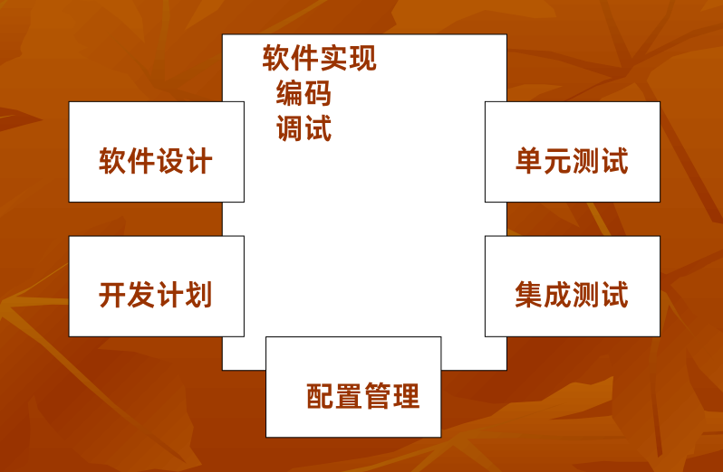

需求分析和软件设计是为了更有效地软件实现,软件测试是为了保证软件实现的正确性,因此,软件实现成为软件工程的核心任务之一。

软件实现在开发过程中占据很大的比例,根据项目性质的不同,大约占30%~80%之间。一般而言,软件企业越大越正规,软件实现的比重就越轻。反之,软件实现的比重就越重。

只有软件实现是软件工程中唯一不可缺少的步骤。因为:有个别特殊项目可能不经过需求分析和设计就直接进入编码实现阶段,有个别特殊项目会省略掉测试,但无论如何,实现过程是不可缺少的。

由于软件设计过程可能贯穿于整个开发过程,因此,有时不应将它看作一个独立的阶段。对某些小型的项目,设计过程通常在实现时完成;对某些大型的项目,会明确地划分架构设计和详细设计两个阶段,即使如此,有些详细设计工作仍会留在实现阶段完成。这就是迭代模型产生的背景之一。

大型软件企业在软件实现工作中,还需要管理好如下问题:

新增函数的实现及函数库的管理,新增存储过程的实现及存储过程库的管理,新增类的实现及类库的管理,新增构件的实现及构件库的管理,新增中间件的实现及中间件的管理。这些库统称为开发财富库。

如果所在的软件组织处在初创时期,函数库、类库、构件库都是空白,那么就只能利用面向对象语言自带的函数和基础类库,从头创业,一边对系统进行编程实现,一边在实践中积累函数、类和构件,逐步建立自己的函数库、类库和构件库,为日后的开发准备财富。

【定义】所谓构件(Component),就是被标识的、且可被复用的软件制品 (Artifact)。

构件与部件、组件基本上是一个意思,有时会认为部件和组件的粒度比构件大一些或范围广一些。

上述定义有三个特点:

第一、构件要被明确标识,即有一个被调用的名字;

第二、构件应该可复用,不可复用的只能称做模块或子系统;

第三、构件是软件制品,在宏观上软件制品可以是项目计划、成本估计、体系构架、需求模型、设计模型、程序代码、窗口界面、文档、数据结构、测试用例等。

微观上的构件,通常是指程序代码级的构件。这种构件在技术上的三个流派:Sun的Java平台、Microsoft的COM+平台、IBM的CORBA平台。构件具有接口标准、通信协议、同步和异步操作。

构件有两种级别:

(1). 可执行文件级别上的构件,它是已通过编译的构件,因而与语言无关。

(2). 源代码级别上的构件,实际上只是构件模板,可以用多种语言实现,当然与语言有关。

大型软件企业内部有构件库。构件库是组织管理构件的仓库,程序员必须知道新增构件的实现及构件库的管理,它是软件实现的重要内容。

构件库管理系统的功能:构件的分类、入库、检索、浏览与存储,对不再使用的构件进行删除,对构件使用情况的统计与评价。

中间件是一个非常大的组件,一般在网络上运行,完成批量数据的传递和通信工作,调用方式是通过一组事先约定的格式与参数进行的。

常见的中间件为文件传输中间件,如IBM公司的消息队列中间件MQ (Message Queue),在网络节点之间进行点对点的数据通信和传输。又如城市医疗保险系统中的中间件,它在市医保局节点和全市各家医院节点之间,进行点对点的数据通信和传输,病号每次划价计费,节点之间就交换一次信息。

在详细设计说明书中,已对新增中间件的功能和算法进行了详述,此处只要将详细设计翻译为源程序即可。

为了提高编程实现的质量,不仅需要有良好的程序设计风格,而且需要编程人员一致遵守的编程规范。

程序设计风格的内容包括:规范化的程序内部文档、数据结构的详细说明、清晰的语句层次结构、遵守某一编程规范。

编程规范的内容包括:命名规范、界面规范、提示及帮助信息规范、热键定义等。

### 7.2 实现原则与语言选择

(1) 尽量简单

在软件实现过程中,应创建简单、易读的代码。相同功能的代码只写一次。

(2) 易于验证。

无论是在编码、测试还是实际操作中,应该很容易地发现其中的错误。自动化的单元测试可帮助产生易于验证的代码。

(3) 适应变化。

外部环境、软件需求和软件设计,在整个开发过程中可能会随时变化,因此要求软件实现时考虑适应这些变化。

(4)遵守某一编程规范。

(5)选择项目组成员最熟悉的工具或语言。

编程语言可分为三类:

1.语言符号

使用文本来构建软件。这些文本遵循一定的语法规则,并提供相应的语义,使用者可以直观地理解软件将完成的工作。如HTML、XML等标记语言。

2.形式化符号

采用精确的、形式化定义的符号来构建软件。形式化符号和形式化方法是系统级编程的重要形式。如Pascal语言。

3.可视化符号

采用可视化的部件来构建软件,通常用于界面元素的编程。如Visual Basic语言。

(1) Java

Java是一种面向对象的编程语言,语法结构与C++类似。Java在虚拟机上运行,通过为不同的平台提供虚拟机,实现了Java跨平台的特性。Java被广泛用于应用服务器端程序和移动设备程序中。

(2) C

C既具有高级语言的特征,又具有低级语言的功能,被广泛应用于系统软件,嵌入式应用软件。

(3) C++

在C基础上发展起来的一种面向对象的语言,C++提供了类,多态,异常处理,模板,标准类库等。

(5) Visual Basic

Visual Basic是一种面向对象、可视化的编程语言,用于开发Windows桌面应用程序和Web应用程序。

(7) C#

C#语法与Java类似,是.Net平台上编程语言。

(10) Delphi

Delphi是一种强类型的高级编译语言,支持面向过程、面向数据和面向对象的三种开发方法。Delphi源自Pascal,提供了大量的快速应用程序开发组件。主要用于数据库应用程序开发。

### 7.3 编码规范、命名与错误处理

1. 编码标准

遵循规范化的源代码布局和命名规范,可以创建可读性好,易于理解的代码。

大型软件企业都有一套开发标准、编码标准、界面标准,在全企业内推广应用,形成自已的企业文化。新员工必须严格遵守,迅速适应。

2.代码布局

代码的布局不影响程序的执行速度、内存使用,以及对用户可见的属性。

代码布局应遵循的基本原则:代码布局能够正确地反映程序的逻辑结构。

好的代码布局能加强程序的可读性。可读性好的代码,更易于理解,易于维护,可以减少修改、调试以及审查的工作量。

通常,程序员通过缩排和空格表示程序内部的逻辑。又称锯齿形程序布局。

3.实体命名

代码中存在大量的实体名,如变量名、方法名、类名、接口名、包名等。好的命名可以提高代码的可读性。

在对一个实体进行命名时,最重要的一点,是名称能够准确地反映实体的本质。先使用一句话来描述实体所代表的事物,然后抽取一个或几个单词作为实体的名称。

研究表明,命名长度在10到16个字符之间,调试代码所需的工作量最少,过长或过短的命名不易于代码的理解。

实体命名可遵循的规则:

(1) 类名和对象:在Java和C++中,通常类名的首字母大写,对象名的首字母小写。

(2) 全局变量:加上统一的前缀,例如,表示所有在线人数可以使用g_totalOnline。

(3) 成员变量:在类的成员变量前添加统计的前缀,例如_或m_,这样可以很容易地区分成员变量和局部变量。

(4) 常量:在Java和C++中,通常以全部大写的单词表示常量,单词间以下划线分隔。例如MAX_VALUE表示最大值。

4.错误处理

程序执行过程中,可能出现可预测和不可预测的错误,错误处理方式将影响到软件的正确性、稳定性以及其他的非功能属性。可以采取以下措施进行处理:

(1)返回一个中性值:当错误发生时,程序继续执行,返回一个中性的值。例如,数值计算返回0;字符串操作返回空字符串。

(2)返回下一个有效值:当一次操作失败后,执行下一次操作。例如,从网络中读取数据失败后,取下一个有效值。

(3)返回前一个有效值:当一次操作失败时,返回上一次成功操作的值。例如,从网络中读取数据失败时,返回上一次读到的有效值。

(4) 返回最相近的有效值:例如,一个方法计算应返回一个非负数,如果计算值小于0,则返回0。

(5) 记录日志:当错误发生时,记录日志文件,并继续执行。

(6) 返回错误代码:返回错误代码,指示错误发生的原因,调用者可根据错误代码进行错误处理。

(7) 调用错误处理函数:用错误处理函数来统一地进行错误处理,这样做的好处是可以集中地对错误进行管理。

(8) 显示错误信息:当错误发生时,向用户提示错误信息。例如,用户录入了非法数据时,向用户提示正确的输入格式。

(9) 退出程序:这种方式对一些安全性要求较高的程序比较适合,防止继续操作可能带来的破坏。

5.代码重构

代码重构是软件进化的重要手段,需要重构的例子有:

(1)重复代码:重复的代码需要做重复的修改,即要修改一个地方,就要平行地修改其他地方。

(2)函数过长:在面向对象的编程中,很少需要超过一屏的函数。出现这种情况,暗示着已使用了过程化编程方式,来进行面向对象的编程。

(3)循环过长:过长的循环体最好变成独立的函数,可有效地降低循环的复杂度。

(4)内聚性差:如果发现某个类是一些不相关的责任的集合,这个类应该分解成多个类,每个类负责一个逻辑相关的责任集合。

(5)参数过多:好的函数通常比较简短,不应有过多的参数。过多的参数通常表示方法没有很好地抽象。

6.成对编程

成对编程的定义:当进行成对编程时,一个程序员输入代码,另一个在旁边观察代码中是否存在错误,并思考下一步要进行的工作。

成对编程的优点:

(1) 可以提高代码的可读性和可理解性,产生高质量的代码。

(2) 提高编程效率,使编程速度更快,代码错误更少。后期测试和纠错的工作量就大大降低。

(3) 成对编程可以提高开发团队的凝聚力和协作精神。

### 7.4 实现管理、延期与度量

1.过程模型

这里讲的过程模型,是指软件开发模型。过程模型从其规范程度可分为两大类,重量级开发模型和轻量级的敏捷开发模型。不同的软件开发模型,对软件实现的重视程度不同。

(1)对于瀑布模型和RUP模型等重量级开发模型,实现阶段必须在前期工作(需求分析、架构设计、详细设计)的基础上才能进行。

(2)对于敏捷开发过程等轻量级开发模型,实现阶段趋向于和其他的软件开发活动(需求、设计、测试)同步执行。敏捷开发过程倾向于将编码、设计、测试混合在一起构成实现活动。

2.开发计划

影响开发计划的因素是:

(1)过程模型影响开发计划。不同的开发模型,有不同的开发计划。因为:开发计划定义了系统部件创建和集成的顺序、质量管理过程和开发任务分配等。

(2)项目大小也影响开发计划。估计项目大小和所需要的工作量,是开发计划和软件项目管理中最具挑战性的问题。准确估计是保证软件项目按质、按量、按时完成的重要因素。

那么,如果开发计划出现延期,怎么办呢?

(1)增加开发人员。行不行?不行!因为:向一个延期的项目添加人员,无异于火上浇油。

(2)减少项目内容。行不行?行!因为:减少项目的内容可以防止项目继续延期。怎样减少呢?在项目初期,应当标识项目特征的优先级。优先级可以为“必须具有”、“最好具有”和“可选项”。这样,如果项目延期了,就可以按优先级来缩减项目内容。

(3)有什么办法使项目不延期呢?有!这就是二八定律。要将二八规律作为制定开发计划的座右铭,落实到工作量估计、进度估计和其他资源估计上去。

3.实现度量常见的度量包括如下五个方面:

(1) 程序大小

**代码行数**

**注释行数**

**类或函数的数量**

**数据声明的数量**

(2) 缺陷跟踪

缺陷情况(严重程度、位置、来源、修正方式、修正人、影响代码行数、花费工时)发现缺陷的平均时间修正缺陷的平均时间修正缺陷引入新错误的数量

(3) 生产力

**项目总工时**

**每个类或函数的工时**

**项目花费**

**每行代码花费**

**每个缺陷花费**

(4) 整体质量

**缺陷总数量**

**每个类或函数的缺陷数量**

**每千行代码的缺陷数量**

(5) 可维护性

每个类公共数据、公共方法、私有数据、私有方法、代码行、注释行的数量。

每个方法的参数、局部变量、调用其他方法、决策点、代码行、注释行的数量。

以上五个方面的度量数据,都是存入软件公司的测量数据库,作为公司软件管理的财富。

### 7.5 屏幕界面设计

本节以程序设计语言PowerBuilder/ Visual Basic/ Delphi为背景,以C/S两层结构为基础,来说明软件实现方法中的有关细节,所以比B/S三层结构复杂。

屏幕界面上看得见的窗口、画面、图像、按钮等对象,在设计与实现中,统称为“控件”。构件分为可视构件和非可视构件两种,控件是一种可视构件。上述控件的有机排列和组合,就构成了用户需求的各种屏幕界面。

屏幕界面设计包括三个级别:

(1) 控件级设计

(2) 窗口级设计

(3) 系统级设计

屏幕界面设计原则是:界面简洁朴素,控件摆放整齐,颜色风格统一,照顾客户习惯。

### 7.6 实现文档、用户指南与安装手册

本节以C/S两层结构为基础,来说明软件实现文档中的有关细节,所以比B/S三层结构复杂。

1.实现文档的组成软件实现文档由源程序清单和用户指南组成。由于面向对象的语言与面向过程的语言有所不同,所以完整的源程序清单有时打印不出来,往往只能打印出部分源程序清单。一般的做法是:不打印出源程序清单,只保留其电子版本。

用户指南主要包括《用户使用手册》和《用户安装手册》。

在特殊情况下,例如,数据库服务器上的存储管理、数据维护、数据备份、数据传输等问题较复杂时,在用户指南中还要增加《系统管理员手册》的内容。

2.用户指南的编写要求

(1)统一采用编写工具Word 进行编写。

(2)用统一的风格和确定的方法,描述产品提供的所有功能。描述之后的功能,应该具有如下特点:对于每一项功能的描述应该完整。

(3)术语部分包括系统术语和基本概念。系统术语在整个系统的含义是统一的,放在前言部分描述。基本概念在各有关章节进行描述。

(4)语言要简洁明快,表达准确。一句话不要太长,中间可以断句几次。

(5)指南格式应统一。

3.用户指南的排版建议

(1)2人以上合作编写,一定要有一人负责统稿。

(2)交稿前一定要最后一次仔细审读。

(3)图以章为序,如图5.1或图5-1(半字线连接章号和图号),图的标题在图的下方。

(4)表以章为序,如表3.1或表3-2,表的标题在表的上方。

(5)命令格式。操作步骤中使用的命令按钮、菜单命令项、标签项等名称用【】界定。如:打开【开始】菜单选择【程序】项......

(6)例题格式。例题以章为序,并用【】界定。如【例3.5】或【例3-5】。

(7)交稿前一定要最后一次仔细审读,尽量减少不应有的文字录入错误,并做到5个衔接、6个统一、7个对应:

5个衔接是:章节号、表序号、图序号、公式号、页码号要连续衔接,不重、不漏。

6个统一是:格式、层次、名词术语、符号、代号、计量单位要统一、一致。

7个对应是:目录与正文标题、标题与内容、正文与插图、正文与表格、图中代号与图注、前后内容要对应,避免重复和矛盾。

(8)严禁用Word 自动格式生成章节标题或序号。

4.用户指南的编写原则

(1)列出应编制文档的目录。

(2)提示编制文档应参考的标准。

(3)指定文档管理员。

(4)提供编制文档所需要的条件,落实文档编写人员、主管和所需经费以及编制工具等。

(5)明确保证文档质量的方法,为了确保文档内容的正确性、合理性,应采取一定的措施,如评审、审稿、鉴定等。

(6)绘制进度表,以图表形式列出各阶段应产生的文档、编制人员、编制主管、编制日期、完成日期、评审日期等。

5.用户指南的审核鉴定

为了保证文档的质量以及文档内容的正确性、合理性,软件工程管理部门应对用户指南进行评审和鉴定工作,提出改进意见,有利于整个文档质量的提高。

6.软件实现管理文档

软件实现管理文档包括《用户指南评审报告》,《模块源程序行统计表(行/模块名)》,《源程序工作量统计表(行/人天)》。这些管理文档均较简单。

### 7.7 实现阶段的工程衔接

对于有经验的程序员来说,只要《详细设计说明书》设计合理、制作规范、评审通过(不符合项为零),软件实现是一件轻松愉快的事情。若IT企业十分成熟,积累的软件财富丰厚,类库、构件库强大,规范和标准齐全,软件过程管理到位,那么软件实现更加简单。

按照本章介绍的软件实现原则、实现方法、实现管理、程序设计风格、屏幕界面控件设计、窗口级定义、系统级定义、帮助信息和用户指南编写等各种规范,就可以逐步实现《详细设计说明书》的内容,使企业走上规范化的经营之路。

程序设计是一种艺术,编程高手不但会设计、实现与管理构件,而且会设计、实现与管理构架。所谓构架,就是在“软件业务基础平台”或“行业软件基础平台”上,搭建的软件系统框架。

基础平台至少具有两个特点:

(1) 屏蔽数据库服务器上具体的数据库管理系统,即与数据库管理系统无关;

(2) 在客户端或浏览器端写程序省事省力。

当前,这样的平台是建立在J2EE或.Net基础之上的。在大型软件企业,一般都有自己开发的业务基础平台,以适应自己行业的业务特点,提高程序员的开发效率。

编程高手发展到一定程度,就会自然产生设计、实现、使用业务平台的想法。是否能实现这种想法,这是区分是否是软件高手的重要标志!

<a id="chapter-8"></a>

## 8. 软件测试与调试

### 8.1 测试、缺陷与调试的基本概念

软件企业的产品在发布前,都需要进行大量的测试工作,而这些工作必须由拥有娴熟技术的专业测试人员来完成。

本章首先论述软件测试中的相关概念,了解软件测试的特点。接下来介绍软件测试模型,以帮助建立清晰的测试流程和思路。然后重点论述黑盒测试、白盒测试和灰盒测试,以及测试用例设计,使对实际测试工作有一个较深入的认识。测试工作者除了需要具备专业的测试技能之外,还应该了解测试计划和测试报告。

软件产品与其他产品最大的不同是其复杂性,从而导致发现并修正软件缺陷的成本特别大。发现软件缺陷的过程叫做软件测试,修正软件缺陷的过程叫做软件纠错或软件维护。在本节中,主要讨论软件测试的几个重要概念。

1.什么是测试

测试的英文单词为Testing,即检验或考试之意。

【定义】所谓测试,就是通过一定的方法或工具,对被测试对象进行检验或考试,目的是发现被测试对象具有某种属性或者存在某些问题。

【例】对严重智障人的测试。要初步测试一个人的智力是否存在严重障碍,可以出如下算术测试题:

1 + 2=? 2 + 2=? 2 × 2=?

如果他的回答全部正确,就可以初步断定不是严重智力障碍,反之,可能是智力严重障碍。

若将上述设计过程写成文档就是测试计划,上述回答问题的人就是被测试对象,出算术题就是测试方法,其中“1+2=?”、“2+2=?”等等就是测试用例,请他回答问题的过程就是测试过程,将测试结果和预期结果相比较就得出测试结论,将测试对象、测试目的、测试方法、测试用例、测试时间、测试场景和测试结论进行记录和分析就产生测试报告。

2.什么是软件测试

软件测试是测试中的特例,因为其测试对象是软件产品,它是人的智力产品,表现异常复杂,所以软件测试有自身的特点与难度,并具有挑战性。

【定义】软件测试是按照规定的测试规程发现软件缺陷的过程。

软件测试的目的是发现软件缺陷,软件测试的目标是尽可能早的发现软件缺陷,因为缺陷发现越早,其修复成本越低。

还可以与时俱进地思考软件测试的定义。软件测试不仅仅局限于测试程序代码,还可以测试软件数据与软件文档。也就是说,软件生命周期中所产生的软件工作产品,都可以作为测试对象,因为它们都会影响最终的软件产品质量。

3.什么是软件缺陷

什么是软件缺陷?Ron Patton在《Software Testing》中定义如下:

(1). 软件未实现产品说明书要求的功能;

(2). 软件出现产品说明书指明不应该出现的错误;

(3). 软件实现了产品说明书未说明的功能;

(4). 软件未实现产品说明书虽未明确提及但应该实现的目标;

(5). 软件难以理解,不易使用,运行速度慢,或者软件测试员、最终用户认为软件不好。

软件缺陷的说法很多,例如错误、失效、失败等等,这里统称为软件缺陷(bug)。

4.软件测试与软件调试

软件测试与软件调试区别在哪里?表面上理解似乎都是为了找到软件中存在的问题。

软件调试是在有问题的程序中设置断点,通过观察断点处的程序运行状态,来缩小问题代码的范围,进而捕获到问题的准确位置,并加以修正,最终解决问题。

测试与调试的区别,表现在如下几个方面:

(1). 软件测试从一个侧面证明程序员的“失败”,而调试是为了找到程序员“失败”的准确位置;

(2). 测试是以已知条件开始,使用预先定义的测试用例,且有预知的正确结果,不可预见的仅是程序是否通过测试,而调试一般是以不可知的内部条件开始,结果是不可预见的;

(3). 测试是有计划的,要进行测试用例设计,而调试是无计划的,不受时间约束;

(4). 测试是发现错误,相关人员修改后,验证错误是否被修复的过程,而调试是一个推理判断过程;

(5). 测试的执行是有规程的,而调试的执行往往靠灵感的产生。

5.软件测试的输入与输出

对软件代码进行测试时,软件测试的输入和输出是什么?

狭义理解,软件测试的输入是测试用例(测试数据),输出是测试结果(测试用例是否通过)。

广义理解,软件测试输入还包括测试计划、测试设计、测试环境和测试步骤等等测试前期计划和准备阶段。软件测试输出还包括缺陷的描述和复现,以及与相关人员沟通和测试报告等。

6.软件测试方法

(1). 测试方法的分类,在宏观上讲有黑盒测试方法、白盒测试方法、灰盒测试(黑加白测试)方法。

也有时将上述三种测试方法归为功能测试方法,这是相对于性能测试方法、兼容性测试方法和易用性测试方法等非功能性测试方法而言的。

(2). 测试方法的另一种分类,是静态测试和动态测试。

静态测试主要指不运行代码进行测试(例如代码走读),动态测试则是指在运行代码中进行测试。

**动态测试**

**静态测试**

**黑盒测试**

**白盒测试**

在不知道程序内部结构,只知道程序规格的情况下采用的测试技术或策略。

在知道程序内部结构的情况下采用的测试技术或策略。

黑盒测试方法和白盒测试方法综合的策略。

不实际运行程序,而是通过检查和阅读等手段来发现错误并评估代码质量的软件测试技术。也称为静态分析技术。

实际运行程序,并通过观察程序运行的实际结果来发现错误的软件测试技术。

**灰盒测试**

### 8.2 测试模型、静态分析与同行评审

软件开发有开发模型,软件测试也有测试模型,最典型的测试模型是V模型,除此之外,还有X模型、H模型、W模型、前置模型和测试驱动模型等等。

模型是理论研究的成果,是指导实际测试工作的依据,但是不能完全照搬。学习各种模型时,重点体会模型阐述的思想,结合自己实际工作,有选择性的运用。

1.早期的软件测试V模型早期的V模型,如下图所示。

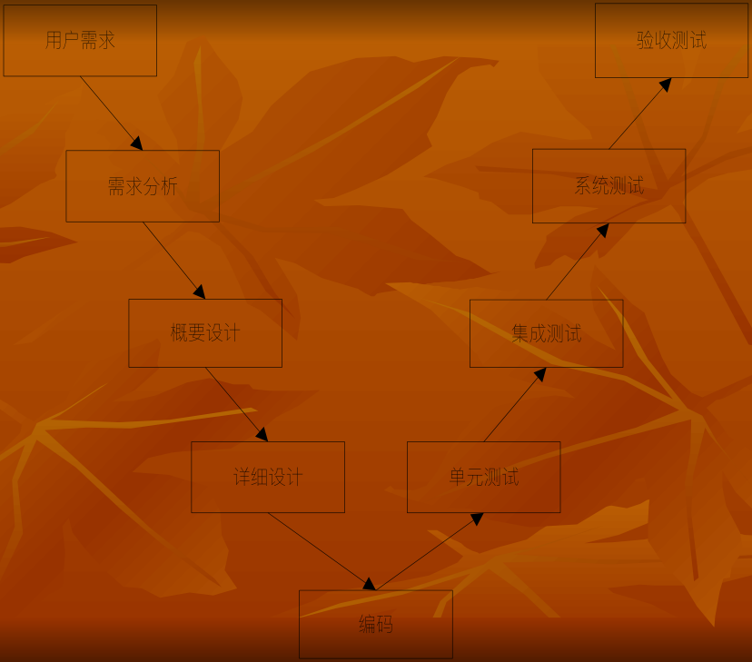

早期的V模型是否存在缺点呢?开发过程包括分析(需求分析)、设计(概要设计和详细设计)和实现(编码)三个主要部分,而早期的V模型右侧的测试阶段似乎都是测试的实际执行阶段,相当于左侧开发中的实现部分。

难道测试工作不需要分析和设计吗?不是。这点在早期的测试V模型中没有反映出来。回顾软件测试的定义,其中一条是尽早地发现软件缺陷。那么请思考,测试工作是否一定要在编码工作结束后才能进行呢?如何体现“尽早地发现软件缺陷”中的“尽早”呢?能否在编码之前就开展测试工作呢?于是就产生了改进的V模型。

2.改进的软件测试V模型改进的V模型,如下图中实线部分所示。

按照改进后的V模型开展测试工作,才能真正的发挥软件测试的作用。

3.X测试模型

X测试模型的基本思想是由Marick提出的,Robin F·Goldsmith引用了一些Marick的想法,并且重新经过组织,形成了现在的X模测试型。

在X测试模型中,模型的左边描述的是针对单独程序片段所进行的相互分离的编码和测试,通过进行频繁的交接,最终集成为可执行的程序,并将可执行的程序移到图中的右上半部分,这些可执行程序还需要进行集成测试。已通过集成测试的程序可以提交给用户,也可以作为更大规模和范围内集成的一部分。图中右上边多根并行的曲线,表示变更可以在各个部分发生。

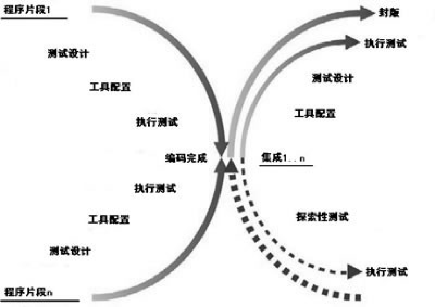

从图的右下方还可知,X模型提出的探索性测试(exploratory testing)是一个亮点。这种测试不进行事先计划,是一种特殊类型的探索性测试,这种探索性测试往往能帮助有经验的测试人员,在测试计划之外发现更多的软件错误。X模型克服了V模型基于严格排列顺序的测试步骤,体现出了测试中的任务交接、频繁重复集成等现象,更贴近实际测试工作。

另外,H模型、W模型、前置模型和测试驱动模型等,都是从不同角度试图更真实的描述测试过程。如果有新的思路,也可以提出一个更优秀、更能真实描述测试工作新的测试模型。

定义:

开发组内部进行的,主要是个人通过检查和阅读等手段来查找错误的活动。

经验:

**限时**

**避免跑题**

**不要现场修改**

**检查要点**

**逻辑错误**

代码标准/规范/风格

开发组内部进行的,分配了相关的角色,采用讲解、提问并使用Checklist方式进行的查找错误的活动。

以会议的形式,制定会议目标、流程和规则,结束后要编写报告参加人员经验丰富的开发人员和本模块相关的开发人员本项目组的新人由另外一名开发者进行讲解、其他开发者主要按照Checklist进行提问并填表、本模块开发者回答问题并记录不要现场修改检查要点设计需求代码标准/规范/风格

开发组、测试组和相关人员(QA、产品经理等)联合进行的,采用讲解、提问并使用Checklist方式进行的查找错误的活动。一般有正式的计划、流程和结果报告。

以会议的形式,制定会议目标、流程和规则,结束后要编写报告。相关资料要在会议前下发并阅读。

**参加人员**

**经验丰富的开发人员**

**和本模块相关的开发人员**

**测试组和相关人员**

由另外一名开发者进行讲解、其他开发者主要按照Checklist进行提问并填表、本模块开发者回答问题并记录不要现场修改检查要点设计需求代码标准/规范/风格文档的完整性和一致性

同行(对等)评审(Peer Review)对等技术评审是由与工作产品开发人员具有同等背景和能力的人员对工作产品进行的一种评审,目的是早期和有效的消除软件工作产品中的缺陷,并可对软件工作产品和其中可预防的缺陷有更好的理解。

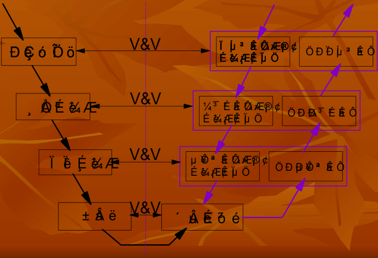

**依据**

**源程序**

看到的是问题的本身而不是征兆发现其他方法无法发现的逻辑错误效率是最初测试效率的3-5倍最多发现75-80%的错误及早发现缺陷

静态分析走查:WalkThrough审查:Inspection评审:Review

### 8.3 黑盒测试与等价类划分

**基于需求的测试**

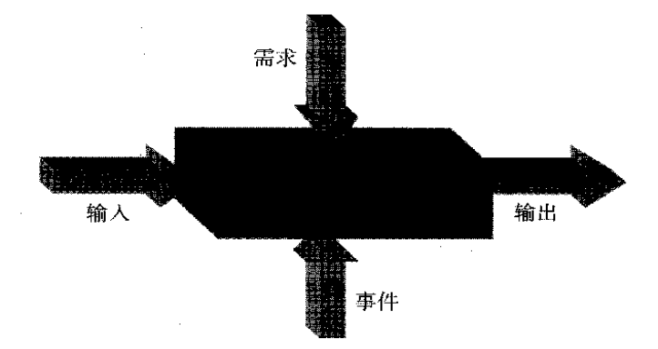

黑盒测试的对象可以是软件单元、软件模块、软件组件、软件子系统和软件系统,甚至可以发散思维到软件文档,软件管理等软件生命周期中的任何可测试对象。

在用黑盒测试方法测试功能模型时,重点是要设计黑盒测试用例。黑盒测试工作要用尽可能少的测试用例,测试出尽可能多的软件需求。下面探讨在黑盒测试中,设计测试用例的五种方法:

1.等价类划分法;

2.边界值分析法;

3.错误推测法;

4.因果图分析法;

5.场景分析法。

等价类划分的具体做法是:把所有可能的输入数据,即软件的输入域,划分成若干部分(子集),使每部分内的数据都是等效的(对于软件而言,等效可以理解为对数据的处理过程以及处理结果都完全一致),然后从每一个子集中选取少数具有代表性的数据,作为测试用例。

1.有效等价类和无效等价类

每一个等价类又可以分为有效等价类和无效等价类。

有效等价类,是指对于软件的需求规格说明书来说是合理的、有意义的输入数据构成的集合。利用有效等价类,可检验软件是否实现了需求规格说明书中所规定的需求。

无效等价类主要是验证程序是否对非法输入数据进行处理。

黑盒测试法方法设计测试用例时,任务之一是划分等价类,区分两种等价类别,任务之二是在每个等价类中,选取一个代表数据作为测试用例。

2.划分等价类并设计测试用例

1.在输入条件规定了取值范围时,可以确立一个有效等价类和两个无效等价类。

【例】如果输入值的范围是从1到999,则一个有效等价类为1<= 输入值<=999,两个无效等价类为小于1和大于999。如果是手工录入数据,还要考虑不输入数据,或者输入非法数据(例如非数值)等特殊情况。

2.当输入条件规定了具体数值,例如个数(或次数)时,可以确立一个有效等价类,两个无效等价类。

【例】用户登录时连续输入错误次数达到3次,则锁定账号。有效等价类为连续3次输入错误,两个无效等价类为连续输入错误次数小于3次和大于3次。

3.当输入条件是一个布尔量,且限制为单选方式时,可确定两个有效等价类。

【例】网络购书时,选择开发票或者不开发票,就可以确定两个等价类;如果是手工输入,例如输入一个人的性别,则可以把男性和女性作为两个等价类,不输入数据和输入非法数据(非男非女)等也是常见的无效等价类。

4.当输入条件是一组数据(假设有N个),且限制是以单选方式输入时,可确定N个有效等价类。

【例】用户的注册信息中,学历的选择包括初中、高中、专科、本科等,可以确定有N个学历有效等价类,同样,如果是手工输入数据,则还应该包含不输入数据、输入非学历数据等无效等价类。

5.当输入条件是一组数据(假设是N个),并且可以允许多选方式输入时,则除了将每个选项作为一个单独的有效等价类外,还应补充选任意两个,选任意N个,作为有效等价类。

【例】用户选择自己的兴趣爱好类别,音乐、体育、绘画等。则有效等价类为所有选项的组合。

6.在规定了输入数据必须遵守的规则的情况下,可确立一个有效等价类(符合规则)和若干个无效等价类(从不同角度违反规则)。

【例】用户名必须是由26个大小写英文字母、数字和下划线组成,长度为6到16位。则有效等价类为符合规则的用户名,还包括不符合规则的若干无效等价类,例如长度不满足规则,包含的字符不满足规则,不输入任何字符等。

三角形问题:接受三个整数a, b, c作为输入,用作三角形的边,程序输出由这三个边确定的三角形的类型:等边三角形、等腰三角形、不等边三角形、非三角形。

解:画出该问题的等价类表,并为每个等价类进行编号,如下表所示。

| 输入条件 | 有效等价类 | 无效等价类 |
| --- | --- | --- |
| 是否三角形的三个边 | (a>0) (1)<br>(b>0) (2)<br>(c>0) (3)<br>(a+b>c) (4)<br>(b+c>a) (5)<br>(a+c>b) (6) | (a<=0) (7)<br>(b<=0) (8)<br>(c<=0) (9)<br>(a+b<=c) (10)<br>(b+c<=a) (11)<br>(a+c<=b) (12) |
| 是否等腰三角形 | (a=b) (13)<br>(b=c) (14)<br>(a=c) (15) | (a!=b)and(b!=c)and(a!=c)(16) |
| 是否等边三角形 | (a=b)and(b=c)and(a=c) (17) | (a!=b) (18)<br>(b!=c) (19)<br>(c!=a) (20) |

根据等价类表,该问题测试用例设计如下表所示。

| 序号 | [a,b,c] | 覆盖等价类 | 输出 |
| --- | --- | --- | --- |
| 1 | 3,4,5 | (1),(2),(3),(4),(5),(6) | 不等边三角形 |
| 2 | 0,1,2 | (7) | 非三角形 |
| 3 | 1,0,2 | (8) | |
| 4 | 1,2,0 | (9) | |
| 5 | 1,2,3 | (10) | |
| 6 | 3,1,2 | (11) | |
| 7 | 1,3,2 | (12) | |
| 8 | 3,3,4 | (1),(2),(3),(4),(5),(6),(13) | 等腰三角形 |
| 9 | 3,4,4 | (1),(2),(3),(4),(5),(6),(14) | |
| 10 | 3,4,3 | (1),(2),(3),(4),(5),(6),(15) | |
| 11 | 3,4,5 | (1),(2),(3),(4),(5),(6),(16) | 非等腰三角形 |
| 12 | 3,3,3 | (1),(2),(3),(4),(5),(6),(17) | 等边三角形 |
| 13 | 3,4,4 | (1),(2),(3),(4),(5),(6),(18) | 非等边三角形 |
| 14 | 3,4,3 | (1),(2),(3),(4),(5),(6),(19) | |
| 15 | 3,3,4 | (1),(2),(3),(4),(5),(6),(20) | |

### 8.4 边界值分析

边界值分析方法是对等价类划分方法的补充。

1.边界值分析方法的考虑

大量的错误常常发生在输入或输出范围的边界上。因此针对各种边界情况设计测试用例,可以查出更多的错误。

使用边界值分析方法设计测试用例,应当选取正好等于、刚刚大于、或刚刚小于边界的值作为测试数据。

2.基于边界值分析方法选择测试用例的原则

1.如果输入条件规定了值的范围,则应取刚刚达到这个范围的边界的值,以及刚刚超越这个范围的边界值作为测试输入数据。

2.如果输入条件规定了值的个数,则用最大个数、最小个数、比最小个数少1、比最大个数多1的数,作为测试数据。

3.根据规格说明的每个输入条件,使用前面的原则1。

4.根据规格说明的每个输入条件,应用前面的原则2。

5.如果程序的规格说明给出的输入域或输出域是有序集合,则应选取集合的第一个元素和最后一个元素测试用例。

6.我们在确定边界值时,还要参考ASCII/Unicode编码表。

例如,为了测试教科书P187-188上的NextDate函数的程序,除了上一小节已经用等价类划分法设计出的测试方案外,还应该用边界值分析法再补充下述测试方案。

| 序号 | 输入数据 | | | 预期输出 | | | 覆盖范围<br>(等价类编号) |
| --- | --- | --- | --- | --- | --- | --- | --- |
| | 年 | 月 | 日 | 年 | 月 | 日 | |
| 5 | 1812 | 1 | 1 | 1812 | 1 | 2 | 1,2,3,6 |
| 6 | 1812 | 12 | 31 | 1813 | 1 | 1 | 1,2,3,6 |
| 7 | 2012 | 1 | 1 | 2012 | 1 | 2 | 1,2,3,6 |
| 8 | 2012 | 12 | 31 | 2013 | 1 | 1 | 1,2,3,6 |

### 8.5 错误推测与输入组合

错误推测法依据经验和直觉，列举可能的错误及容易出错的情形，再有针对性地设计测试用例。

例如,没有获取到输入,系统如何处理。测试工作者总结的常见软件错误,以前产品测试中曾经发现的错误等等。

还有输入数据和输出数据为0的情况。输入表格的值为空格,或输入表格只有一行,这些都是容易发生错误的情况。可选择这些情况,设计测试用例进行测试。

像“愚笨”的用户那样做,随便点点鼠标,测试一下;借助2/8原则,在已经找到缺陷的地方再找找;凭直觉、经验和预感猜测一下。这些思路都可以帮助我们找到更多的软件缺陷。

等价类划分法和边界值分析法都只孤立地考虑各个输入数据的测试功效,而没有考虑多个输入数据的组合效应,可能会遗漏了输入数据易于出错的组合情况。选择输入组合的一个有效途径是利用判定表或判定树为工具,列出输入数据各种组合与程序应作的动作(及相应的输出结果)之间的对应关系,然后为判定表的每一列至少设计一个测试用例。

选择输入组合的另一个有效途径是,把计算机测试和人工检查代码结合起来。例如,通过代码检查发现程序中两个模块使用并修改某些共享的变量,如果一个模块对这些变量的修改不正确,则会引起另一个模块出错,因此这是程序发生错误的一个可能的原因。应该设计测试方案,在程序的一次运行中同时检测这两个模块,特别要着重检测一个模块修改了共享变量后,另一个模块能否像预期的那样正常使用这些变量。反之,如果两个模块相互独立,则没有必要测试它们的输入组合情况。通过代码检查也能发现模块相互依赖的关系。

### 8.6 因果图法

1.因果图表示法

1.分析需求,找出原因、结果、中间状态和约束条件;

2.画出因果图;

3.转换为判定表:即将原因结果作为行(假设有N行),原因结果的组合作为列(2N),用0,1填充表格;

4.为判定表的每一列设计一个测试用例。

从因果图生成的测试用例,包括了所有输入数据的取True与取False的情况,构成的测试用例数目达到最少,且测试用例数目随输入数据数目的增加而线性地增加。

2.因果图法举例:中国象棋中马的走法以中国象棋中马的走法为例子,具体说明:

(1)、如果落点在棋盘外,则不移动棋子;

(2)、如果落点与起点不构成日字型,则不移动棋子;

(3)、如果落点处有自己方棋子,则不移动棋子;

(4)、如果在落点方向的邻近交叉点有棋子(绊马腿),则不移动棋子;

(5)、如果不属于(1)—(4)条,且落点处无棋子,则移动棋子;

(6)、如果不属于(1)—(4)条,且落点处为对方棋子 (非老将),则移动棋子并除去对方棋子;

(7) 、如果不属于(1)—(4)条,且落点处为对方老将,则移动棋子,并提示战胜对方,游戏结束。

在因果图中,用C表示原因,E表示结果,各节点表示状态,取值0表示某状态不出现,取值1表示某状态出现。因果图有四种关系符号,如下图所示。

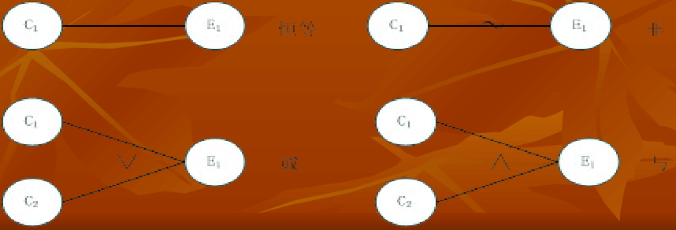

有一个处理单价为1元5角的盒装饮料的自动售货机软件。若投入l元5角硬币,按下 “可乐”、“雪碧”或“红茶”按钮,相应的饮料就送出来。若投入的是2元硬币,在送出饮料的同时退还5角硬币。

首先从软件规格说明中分析原因、结果以及中间状态。分析结果如下表所示。

| 原因 | C1:投入1元5角硬币;<br>C2:投入2元硬币;<br>C3:按“可乐”按钮;<br>C4:按“雪碧”按钮;<br>C5:按“红茶”按钮。 |
| --- | --- |
| 中间状态 | 11:已投币;<br>12:已按钮。 |
| 结果 | E1:退还5角硬币;<br>E2:送出“可乐”按钮;<br>E3:送出“雪碧”按钮;<br>E4:送出“红茶”按钮。 |

**表自动饮料售货机软件分析结果**

根据上表中的原因与结果,结合软件规格说明,连接成如下图所示的自动饮料售货机软件因果图。

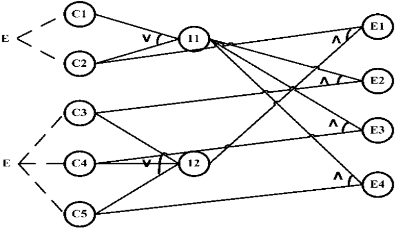

### 8.7 场景分析与 ATM 案例

1.场景分析法的来由

很多软件都是用事件触发的思想,来控制程序运行流程。

例如GUI(图形用户界面Graphical User Interface,又称图形用户接口)软件、游戏软件等。事件触发形成场景,而同一事件不同的触发顺序和处理结果就形成了事件流。

这种在软件设计时常用的思想,可以引入到软件测试中,生动地描绘出事件触发时的情景,有利于设计测试用例,同时使测试用例更容易理解和执行。

2.基本流和备选流

在利用场景法测试一个软件的时候,如果软件按照正确的事件流而实现了一个流程,则称该流程为该软件的“基本流”。

如果出现故障,不能用基本流来表示,那么就要用一个所谓的“备选流”来加以替代。

一个备选流可从基本流开始,在某个特定条件下执行,执行完后重新加入到基本流中。例如,如果从ATM机取款系统中顺利地取出一笔钱,那么ATM机取款系统就执行了一个基本流。反之,ATM机取款系统就要执行一个备选流。

3.场景分析法中设计测试用例的参考步骤

(1). 根据说明书,描述出程序的基本流及各项备选流;

(2). 根据基本流和各项备选流生成不同的场景;

(3). 对每一个场景设计相应的测试用例;

(4). 对生成的所有测试用例重新复审,去掉多余的测试用例。测试用例确定后,对每一个测试用例确定测试数据,进行测试。

这里可以参考我们熟悉流程的系统,例如ATM机取款系统、网上购物系统等,练习使用该方法。

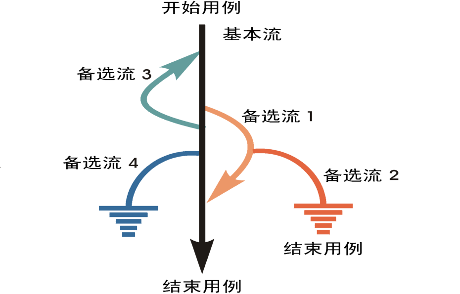

用例开始: ATM 处于准备就绪状态。

准备提款 - 客户将银行卡插入 ATM 机的读卡机。

验证银行卡 - ATM 机从银行卡的磁条中读取帐户代码,并检查它是否属于可以接收的银行卡。

输入 PIN - ATM 要求客户输入 PIN 码(6 位)验证帐户代码和 PIN - 验证帐户代码和 PIN 以确定该帐户是否有效以及所输入的 PIN 对该帐户来说是否正确。对于此事件流,帐户是有效的而且 PIN 对此帐户来说正确无误。

ATM 选项 - ATM 显示在本机上可用的各种选项。在此事件流中,银行客户通常选择“提款”。

输入金额 - 要从 ATM 中提取的金额。对于此事件流,客户需选择预设的金额(100元、200元、500元、1000元、2000元)。

授权 - ATM 通过将卡 ID、PIN、金额以及帐户信息作为一笔交易发送给银行系统来启动验证过程。对于此事件流,银行系统处于联机状态,而且对授权请求给予答复,批准完成提款过程,并且据此更新帐户余额。

出钞 - 提供现金。

返回银行卡 - 银行卡被返还。

收据 - 打印收据并提供给客户。ATM 还相应地更新内部记录。

用例结束: ATM 又回到准备就绪状态。

备选流 1 - 银行卡无效备选流 2 - ATM 内没有现金备选流 3 - ATM 内现金不足备选流 4 - PIN 有误备选流 5 - 帐户不存在备选流 6 - 帐面金额不足备选流 7 - 达到每日最大的提款金备选流 8 - 记录错误备选流 9 - 退出客户可随时决定终止交易(退出)。

备选流 10 - “翘起”ATM 包含大量的传感器,用以监控各种功能,如电源检测器、不同的门和出入口处的测压器以及动作检测器等。

场景 1 - 成功的提款:基本流

场景 2 - ATM 内没有现金:基本流、备选流 2场景 3 - ATM 内现金不足:基本流、备选流 3场景 4 - PIN 有误(还有输入机会):基本流、备选流 4场景 5 - PIN 有误(不再有输入机会):基本流、备选流4场景 6 - 帐户不存在/帐户类型有误:基本流、备选流 5场景 7 - 帐户余额不足:基本流、备选流 6

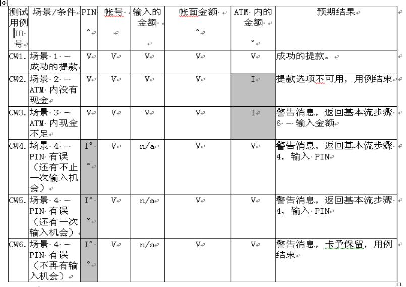

### 8.8 黑盒测试用例设计及优缺点

1.测试中的需求覆盖率

测试报告中有一项测试指标,叫做需求覆盖率,显示测试用例覆盖软件需求的百分比数。这个指标与黑盒测试方法的运用关系密切。

在改进的测试V模型中,第一个明显的测试阶段是测试需求分析,测试人员理解软件需求,将软件需求转化为测试需求。

用户需求。它是指软件实际使用者的需求,是最原始和标准的需求,但用户不善于描述需求,更不知道如何和软件需求分析者沟通。

2.将软件需求转换为测试用例

如何将软件需求转换到测试需求,再将测试需求转换到测试用例?

转换的一般原则是:每一项软件需求都会分解为多个测试需求,每个测试需求都会设计出多个测试用例。

【例】以图书管理系统为例,说明如何将一个软件需求分解为多个测试需求。图书管理系统中读者网上登录这个功能点,需求说明书中这样描述:“登录功能(编号为xxV1-01-001):验证用户名和密码的正确性,登录成功显示系统主页面,登录失败给出提示信息。”现在要问:应该怎样分解需求或转换需求呢?

答:先理解需求。针对需求,给出以下疑问和问题:

(1). 成功登录系统的主页面包含什么具体内容?

(2). 登录失败的失败信息是什么?

(3). 登录失败提示信息的详略程度?是粗略的说登录失败,还是提示用户名不存在,或者密码不正确?

(4). 是否考虑登录时输入验证码的新技术?

(5). 登录的用户名长度是否限制?

(6). 登录时,遇到系统繁忙或者超时,如何处理?

(7). 登录错误次数是否有限制,是否可以防止蛮力破解等攻击方式?

现在分解软件需求,如下表所示。

| 需求功能点序号 | 测试功能点序号 | 测试功能点描述 |
| --- | --- | --- |
| ...... | ...... | ...... |
| XXV1-01-001 | XXV1-T08-T001 | 登录成功,显示系统主页面 |
| | XXV1-T08-T002 | 正常登录失败(用户名,密码错误或者不匹配,或者包含非法字符),提示失败信息 |
| | XXV1-T08-T003 | 系统异常登录失败(系统忙,网络超时等)的提示信息 |
| | XXV1-T08-T004 | 非正常登录方式(非法入侵,蛮力破解等)处理办法 |
| ...... | ...... | ...... |

分解后的测试功能点集合,就是测试需求的清单,也是下一步设计测试用例的依据。

凡是没有出现在清单里的测试需求,都排除在测试任务的范围之外。这样对测试执行人员非常有利,万一有一天,在一个没有被列入测试需求部分发现了问题,测试执行人员应该庆幸有测试需求清单和测试报告可查,以证明他测试了什么,没测试什么,不至于替测试设计人员或者测试经理背黑锅。

接下来设计测试用例,如下表所示。

| 测试功能点序号 | 测试用例序号 | 测试用例描述 |
| --- | --- | --- |
| ...... | ...... | ...... |
| XXV1-T08-T001 | XXV1-T08-T001-TC001 | 输入正确的用户名和密码,系统主页面正确显示 |
| XXV1-T08-T002 | XXV1-T08-T002-TC001 | 输入正确的用户名和错误的密码,出现登录失败的提示信息 |
| | XXV1-T08-T002-TC002 | 输入错误的用户名和正确的密码,出现登录失败的提示信息 |
| | XXV1-T08-T002-TC003 | 用户名包含非法字符,屏蔽非法字符造成的攻击,登录失败,出现登录失败的提示信息和非法输入的提示 |
| | XXV1-T08-T002-TC004 | 密码包含非法字符,屏蔽非法字符造成的攻击,登录失败,出现登录失败的提示信息和非法输入的提示 |

| XXV1-T08-T003 | XXV1-T08-T003-TC001 | 模拟系统忙或者网络超时造成登录失败的情况,登录失败,提示失败信息和大致原因,有别于用户名和密码错误的提示信息,希望信息对用户有参考价值。 |
| --- | --- | --- |
| | XXV1-T08-T003-TC002 | 系统异常登录失败(系统忙,网络超时等)的提示信息 |
| XXV1-T08-T004 | XXV1-T08-T004-TC001 | 输入用户名,尝试输入多次错误密码,测试系统如何处理 |
| | XXV1-T08-T004-TC002 | 尝试用工具实现密码蛮力破解,测试系统如何处理 |
| | XXV1-T08-T004-TC003 | 尝试基本的脚本注入漏洞攻击,测试系统如何处理 |
| ...... | ...... | ...... |

1.黑盒测试的优点

(1). 应用面广。产品要至少经过黑盒测试才能发布,能够胜任黑盒测试工作的人员相对充足,黑盒测试方法的成本低见效快,几乎所有测试部门、测试人员,在产品(功能块,集成模块,系统)第一轮测试时,都会首选黑盒测试方法,该方法最符合企业实际开展测试工作的需要;

(2). 黑盒测试方法,不需要测试人员知道软件内部的逻辑结构和实现方法,熟悉软件需求分析规格说明书或用户需求报告相对容易些,准备工作时间相对短,同时对于一些不提供源代码的项目也同样适用。

(3). 可以借助自动化测试工具提高测试效率。

黑盒测试的工作量很大,但是在产品(功能块,集成模块,系统)第二轮测试中,可以利用工具回放第一轮测试过程中录制的测试脚本,以进行自动化测试。

典型的测试工具如MI公司的QTP。

自动测试工具可以帮助完成大量重复的测试工作,这是很多人最初盲目热衷的理由。但是任何工具都有自己的优势和局限,不要在实际工作中草率的采用自动化测试工具,否则会发现,它总是令人失望。往往学习使用工具,维护脚本就占用了很多时间,测试时间快结束了,可能还没开始执行任何有实际意义的测试工作。一般建议做产品的公司、做行业项目的公司,以及经常要做第二轮功能测试的情况下,可以考虑采用适合的自动化测试工具。

2.黑盒测试的缺点

(1). 很难做到测试技能与各种业务熟悉度紧密结合。黑盒测试工作质量的好坏,取决于测试用例设计的质量。测试用例设计的质量,取决于测试者对行业业务的熟悉程度,很难要求测试人员对各种行业的业务都精通。很多时候都是具有计算机专业背景的人员,根据测试需要接受业务培训,然后进行测试,但是对业务的理解是很有限的,因此限制了黑盒测试工作的质量。

(2). 缺陷的定位有时不够准确,甚至误导开发人员。

“五个面向实践论”中的“面向功能测试”,即指实际工程中,软件测试工作主要是用黑盒子方法进行功能测试。

### 8.9 白盒测试与逻辑覆盖

白盒测试依据详细设计与代码内部结构设计用例，重点检查逻辑、分支、条件和执行路径。穷举所有路径在实际中往往不可行，应按目标选择覆盖准则，并让一个用例尽量承担多个检查任务。

| 覆盖准则 | 要求 |
| --- | --- |
| 语句覆盖 | 每条可执行语句至少执行一次 |
| 判定／分支覆盖 | 每个判定的真、假分支至少各执行一次 |
| 条件覆盖 | 每个基本条件至少各取一次真、假 |
| 判定／条件覆盖 | 同时满足判定覆盖与条件覆盖 |
| 条件组合覆盖 | 每个判定中基本条件结果的各种组合得到测试 |
| 路径覆盖 | 按选定范围覆盖执行路径；基本路径方法见下一节 |

100% 语句覆盖不能说明所有分支或条件都得到检查；条件覆盖的设计目标也不等同于判定覆盖。覆盖率用于说明被检查的范围，不能单独证明没有缺陷。

课件以判定 A、C 和代码块 A—E 的示例说明这些差别。下面集中保留其组合测试数据，各覆盖目的可使用其中不同的用例子集，避免反复列出相同取值。

| 测试用例序号 | a取值 | b取值 | c取值 | d取值 | 说明 |
| --- | --- | --- | --- | --- | --- |
| XX-V1-103-001 | 1 | 1 | 1 | 1 | A为真,C为真,覆盖ABCDE |
| XX-V1-103-002 | 1 | 1 | 1 | 0 | A为真,C为真,覆盖ABCDE |
| XX-V1-103-003 | 1 | 1 | 0 | 1 | A为真,C为真,覆盖ABCDE |
| XX-V1-103-004 | 1 | 1 | 0 | 0 | A为真,C为假,覆盖ABCE |
| XX-V1-103-005 | 1 | 0 | 1 | 1 | A为假,C为真,覆盖ACDE |
| XX-V1-103-006 | 1 | 0 | 1 | 0 | A为假,C为真,覆盖ACDE |
| XX-V1-103-007 | 1 | 0 | 0 | 1 | A为假,C为真,覆盖ACDE |
| XX-V1-103-008 | 1 | 0 | 0 | 0 | A为假,C为假,覆盖ACE |

白盒方法能针对内部逻辑设计检查，便于定位问题；但依赖对实现的了解，可能遗漏未实现的需求，也难以仅靠路径测试穷尽全部行为。

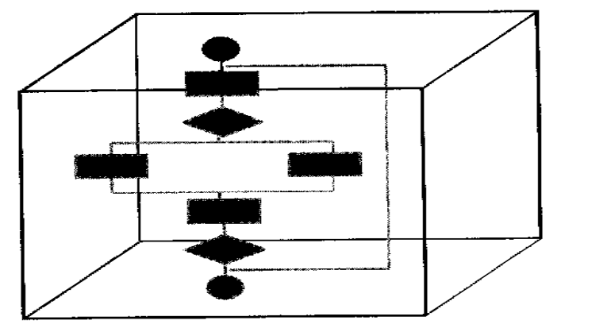

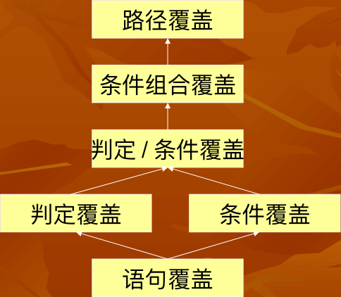

### 8.10 基本路径测试

**把程序流程图映射成流图**

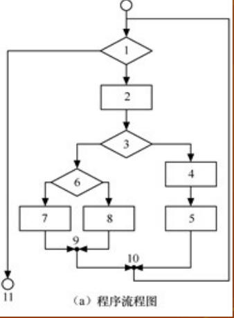

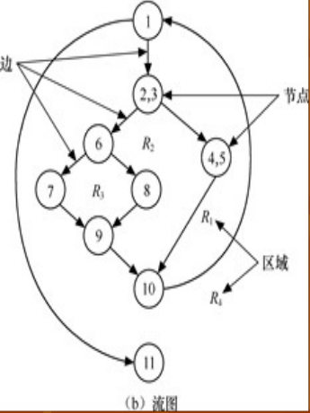

对于下面的程序,假设输入的取值范围是1000<year<2001,使用基本路径测试法为变量year设计测试用例,使满足基本路径覆盖的要求。

```text
IsLeap(year):
    if year % 4 != 0: return 0
    if year % 100 != 0: return 1
    if year % 400 == 0: return 1
    return 0
```

根据源代码绘制程序的控制流图如下图所示。

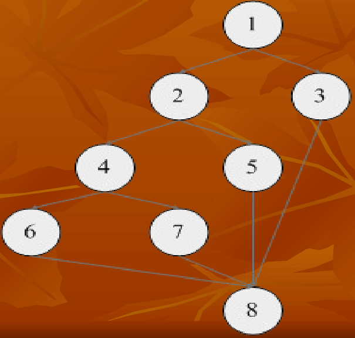

通过控制流图,计算环路复杂度V(G)=区域数=4。

线形无关的路径集为:

1-3-8

1-2-5-8

1-2-4-7-8

1-2-4-6-8

设计测试用例:

路径1:输入数据:year=1999 预期结果:leap=0路径2:输入数据:year=1996 预期结果:leap=1路径3:输入数据:year=1800 预期结果:leap=0路径4:输入数据:year=1600 预期结果:leap=1

### 8.11 灰盒测试

测试人员在需求分析阶段,通过需求说明书了解用户需求,针对需求利用黑盒测试的思路设计测试用例,然后根据已有的编程和测试经验,补充一些白盒测试用例。

在开发阶段,测试人员拿到代码后,一种方法是直接人工阅读代码(也称为静态测试),进行白盒测试。另一种方法是借助于白盒测试工具,实现各种覆盖测试。

IT企业软件测试的基本方法是:宏观上用黑盒测试,微观上用白盒测试;全局用黑盒测试,局部用白盒测试;绝大部分测试人员用黑盒测试,极少数程序人员用白盒测试;以黑盒测试为主,以白盒测试为辅。这就是“五个面向实践论”中的面向功能测试思想。

### 8.12 测试计划、资源、执行与报告

测试团队由测试经理、测试设计人员、测试执行人员三部分人组成。

测试经理负责测试组织与规划,搭建测试环境,监督测试过程。

测试设计人员负责将软件需求转化为测试需求,将测试需求转化为测试用例,并且在必要时设计与实现一些小的测试工具。

测试执行人员,按照测试设计文档,负责具体的测试用例的实施与执行,并记录测试结果,书写测试报告。

产生测试计划之后,接下来就是找个测试模板,完成填空而已。测试计划的编写时间,开始于需求分析阶段之初,结束于软件设计阶段之时。

产生测试计划包括五个基本步骤:熟悉项目情况、确定和排序测试需求、定义测试策略、估计测试工作量和配置测试资源。

软件测试过程,应该包括如下八项流程:

1.熟悉项目情况

测试经理必须充分了解了被测试项目的情况,如何体现充分?可以不断积累问题列表,衡量自己是否真正了解被测项目,例如:

(1). 产品的运行平台和应用领域;

(2). 产品使用者的特点;

(3). 产品主要的功能模块;

(4). 测试的目的和侧重点;

(5). 被测软件的数据是如何传递、存储的;

(6). 产品采用的实现技术;

(7). 同类型产品有哪些,各自的特点和不足;

(8). 该产品的发布,是否被公司看作是一项非常重要而关键的事情;

(9). 产品的前期设计和开发工作,是否有资深的技术人员主导或参与;

(10). 项目开发负责人是谁,主要开发人员都有谁,各负责哪些部分,如何联系;

(11). 项目计划中安排的测试时间是多少;

(12). 开发团队工作进展如何;

(13). 测试人员目前各自的工作量如何。

2.排序测试需求

在测试设计人员的协助下,重点确定测试需求并赋予其优先级。

将需求对客户的重要性作为一个排序标准,客户最关心的、重点强调的、是必须测试的,即使时间来不及,也要想办法和客户协调争取测试时间,因为关键需求没有充分测试,会影响公司在客户心目中的形象,那将比推迟提交软件的代价更惨重下表给出了图书馆信息系统14个功能点的测试优先级排序,供参考。

| 编号 | 功能名称 | 功能描述 | 供参考的测试优先级 |
| --- | --- | --- | --- |
| 1 | 图书入库信息录入 | 给图书分类编号,并录入系统 | 1 |
| 2 | 读者信息录入 | 录入读者基础信息 | 2 |
| 3 | 图书借阅信息录入 | 录入读者借阅图书信息 | 3 |
| 4 | 图书归还信息录入 | 录入读者归还图书信息 | 4 |
| 5 | 图书罚款信息录入 | 录入读者罚款图书信息 | 11 |
| 6 | 图书注销信息录入 | 录入注销图书信息 | 12 |
| 7 | 查询读者信息 | 录入查询读者信息 | 5 |
| 8 | 查询图书信息 | 录入查询图书信息 | 6 |
| 9 | 读者网上注册 | 录入读者网上注册信息 | 8 |
| 10 | 读者网上登陆 | 录入读者网上登陆信息 | 9 |
| 11 | 读者网上查询图书 | 录入读者网上查询图书信息 | 10 |
| 12 | 图书订购 | 录入订购图书信息 | 13 |
| 13 | 图书借还统计 | 统计图书资源的利用情况 | 7 |
| 14 | 补办借书卡 | 作废原借书卡并补办新借书卡 | 14 |

3.定义测试策略

需要考虑模块、功能、性能、接口、版本、配置和工具等各个因素的影响。

测试策略主要包括:测试目的、测试用例、测试方法、测试通过标准和特殊考虑。

一个测试功能点,要定义一个测试策略项,测试策略项中包括了详细的测试信息,测试执行人员参照它,就可以进行实际测试了。下表中,是图书管理系统验证登录界面、输入框设置是否合理的测试策略项的具体定义。

| 测试功能点编号 | XXV1.0-010-018 |
| --- | --- |
| 测试目的 | 测试读者网上登录界面的输入框(用户名和密码),大小设置是否合理 |
| 测试阶段 | 系统测试 |
| 测试类型 | 功能测试 |
| 测试方法 | 手工测试 |
| 测试用例 | 输入允许的最长用户名和密码;<br>输入比允许的最长用户名和密码多一位的字符 |
| 通过标准 | 小于等于允许的用户名和密码长度时,输入框能够完全显示内容;<br>大于允许的用户名和密码长度时,输入框不给予显示 |
| 特殊考虑 | 无 |

4.设计测试用例

对应一个测试策略项,可能需要设计多个测试用例。设计测试用例,可以采用如下的一些技术:

(1). 对输入数据进行等价分配。

(2). 为每一个等价类,分别设计出通过测试用例和失败测试用例。

(3). 绘制状态转换图,分析状态测试,设计状态测试用例。例如,分析出可能的状态,以及从一种状态转入另一种状态所需的输入、条件、状态变量及输出结果。

(4). 从压力条件、重负条件两个方面考虑,设计测试用例,寻找存在的竞争条件。

(5). 坚持二八定律,测试工作绝对不能安排得前松后紧。

(6). 积累经验,凭借直觉,设计测试用例。

5.估计测试工作量

(1) 要确定一个测试项目的测试需求点的数量;

(2) 要验证一个测试需求点包括几个关键测试动作;

(3) 要确定执行一个关键测试动作所需的时间(执行步骤可以用平均时间粗略计算);

(4) 依次累计求和,就可以粗略估计出一个测试项目(或者估计出几个测试需求点的测试工作量)。一个测试项目工作量的粗略估算方法为:

$$
T = \sum_{j=1}^{n} \sum_{i=1}^{m} t_{ij}
$$

其中 $t_{ij}$ 为第 $j$ 个需求点中第 $i$ 个测试动作所需时间。

其中:

i代表一个测试需求点中的一个测试动作;

j代表测试项目中的一个测试需求点;

m代表一个测试需求点有m个测试动作;

n代表测试项目有n个测试需求点。

此外,对软件项目工作量进行估计的Delphi法、类比法、功能点估计法、无礼估计法,在某种程度上也适用于软件测试工作量的估计。

6.配置测试资源

主要是将测试任务和需要的测试资源,分配给具体的测试执行人员。避免出现如下情况发生:

A说“我测试过了”,B说“我以为没有测试,我也测试了”;

A说“你没有测试吗?”,B说“我以为你测试过了”。

最终,测试经理将思考结果记录下来,填写测试计划模板,到此并不代表测试计划编写完成。

如何验证测试计划可行性,主要是测试任务分配部分。因此,要将测试计划在测试团队内进行评审,当然有开发部门人员参与更好,他们能从开发角度分析测试计划的可行性。总之,只有通过评审的测试计划,才能被执行。

7.执行测试

上述六项程序完成后,软件测试人员对项目组提交的软件工作产品或软件最终产品,就执行软件测试。

执行的基本方法是按照设计好的测试用例,一个用例接着一个用例地进行测试,记录每个用例的执行结果,并将执行结果与预期结果比较,一旦发现偏差,就得进行分析,找出偏差原因,确定该偏差是否由软件缺陷所致。

若是缺陷所致,则应尽量确定该缺陷的名称、类型、位置、场景、发现时间、产生原因、危害后果。

8.书写测试报告

测试报告用来对测试结果进行分析说明,经过测试后,证实了软件具有的能力,以及它的缺陷和限制,并给出结论性意见,这些意见既是对软件质量的评价,又是决定该软件能否交付客户使用的依据。测试报告至少要包括几个方面的内容:

(1). 测试任务描述与测试环境说明。

(2). 测试版本比较和测试方法。

(3). 功能测试描述、性能测试描述和确认性测试描述。

(4). 遗留问题描述。

(5). 测试总结。

### 8.13 测试分类、级别与步骤

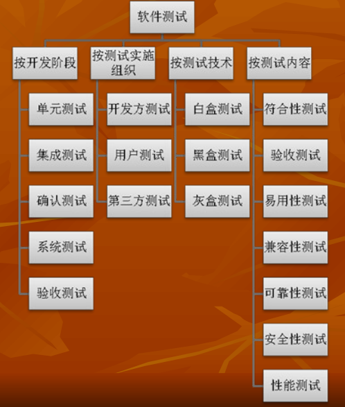

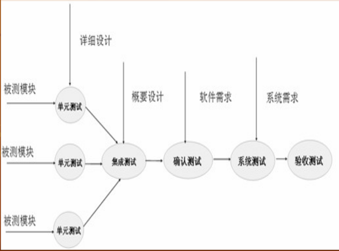

**概要设计**

**详细设计**

**编码**

**集成测试**

**单元测试**

**代码审查**

**需求分析**

**系统测试**

回

归

测

试

**验收测试**

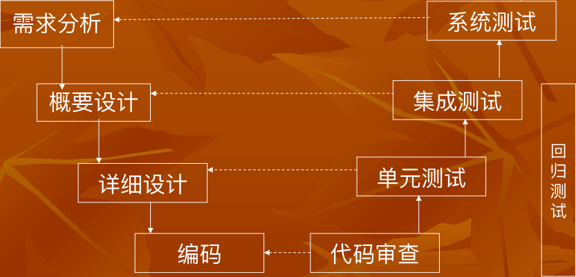

### 8.14 单元测试

单元测试检查软件的基本组成单元，例如函数、子过程或类，依据详细设计验证实现，尽早发现错误。重点如下：

| 检查范围 | 检查内容 |
| --- | --- |
| 模块接口 | 输入输出的个数、类型、顺序；外部变量使用；调用其他模块时的可用性与结果；外部资源的检查及释放 |
| 局部数据结构 | 未使用或未初始化变量、类型转换、数组越界、非法指针、名称错误与数据完整性 |
| 边界条件 | 普通合法与非法数据，边界内外最接近界限的数据 |
| 独立执行路径 | 死代码、计算优先级、精度、比较、赋值、表达式符号、循环变量和控制流 |
| 错误处理 | 是否发现错误，是否正确通知或抛出异常，报告是否真实详细，记录与恢复是否有效 |

测试设计以白盒技术为主，覆盖准则见 8.9；还应检查循环的上下边界、合法范围和内部数据结构。

**驱动与桩**

驱动程序调用被测模块，传入测试数据并收集结果。桩（存根）代替被测模块调用的其他模块，保留必要接口并返回受控结果。它们属于测试设施，通常不作为交付产品的一部分。

自顶向下测试主要需要桩，自底向上主要需要驱动，孤立测试可能同时需要两者。为降低设施开销，可以结合渐增式集成继续完成模块检查。

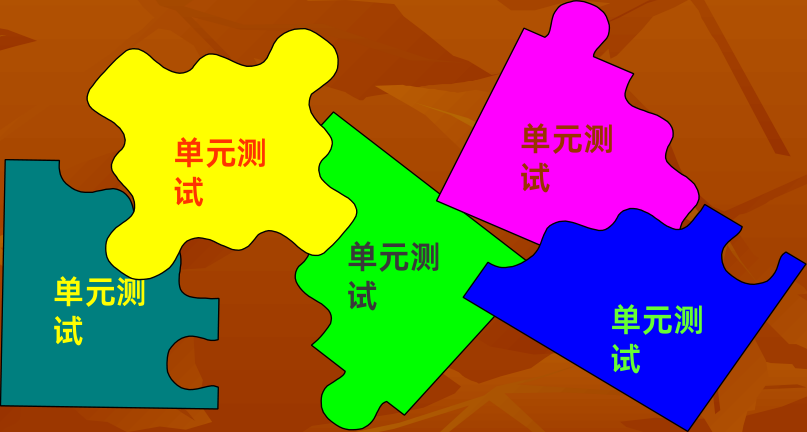

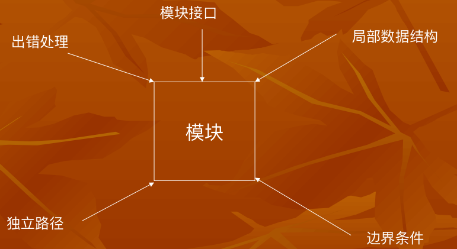

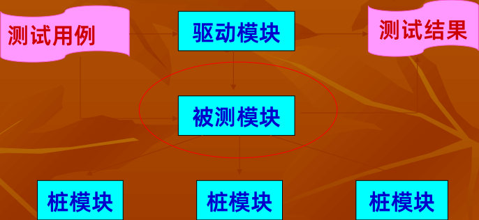

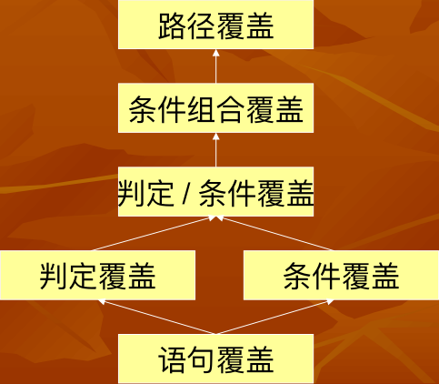

### 8.15 集成测试

集成测试在单元测试的基础上，按概要设计把模块组装成子系统或系统，重点发现接口与协作错误。集成可发生在模块内部、子系统内部和子系统之间。

| 策略 | 组织方式 |
| --- | --- |
| 大爆炸／非渐增式 | 将模块集中组装后测试 |
| 自顶向下 | 从上层控制模块开始，逐步加入下层模块，缺失部分由桩代替 |
| 自底向上 | 从底层模块或模块簇开始，逐步向上集成，使用驱动程序 |
| 三明治 | 结合自顶向下与自底向上 |

设计用例时兼顾正常功能、逆向或故障条件，以及功能和接口覆盖；可结合状态转换、规范导出、等价类、边界及错误推测等技术。它们的基本规则见前面的测试方法章节。

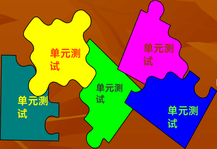

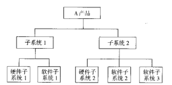

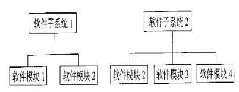

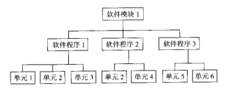

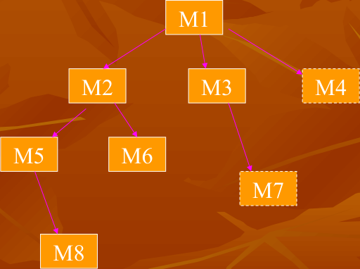

### 8.16 系统测试与专项测试

系统测试将集成后的软件与硬件、外设、支撑软件、数据和人员一起置于实际运行环境，依据系统需求评价缺陷与产品质量。通常由相对独立的人员实施，以黑盒技术为主。

| 专项 | 检查目标与实施方式 |
| --- | --- |
| 功能 | 是否实现并正确实现需求；覆盖功能与相关规则，使用前述黑盒方法 |
| 协议一致性 | 实现是否符合协议；依据规范设计有效与无效交互 |
| 性能 | 响应、吞吐等指标是否达标且能保持；通常与负载测试结合 |
| 压力 | 人为减少内存、磁盘、网络等可用资源，检查功能与性能问题 |
| 容量 | 制造大数据量和高并发访问，检查负载边界 |
| 安全性 | 保护机制是否能抵御非法访问；结合功能检查与故障条件 |
| 恢复 | 制造系统崩溃、硬件故障等情况，验证环境与数据恢复能力 |
| 备份 | 验证备份相关能力，并结合恢复验证 |
| GUI | 界面是否符合设计，交互处理是否正确 |
| 兼容性 | 与其他应用、系统及环境协作是否正常 |
| 可用性 | 是否易学易用、操作是否一致、提示是否明确；通过用户操作、观察与反馈评价 |
| 安装 | 在不同硬件、操作系统和应用环境下安装是否成功，安装后是否正常工作 |
| 文档 | 文档是否准确，按操作手册执行能否得到正确结果 |
| 在线帮助 | 帮助内容是否正确、可用，能否及时支持用户 |
| 数据转换 | 既有数据转换并载入新数据库后是否有效 |

协议、功能和性能测试依照相应规范与需求开展；恢复、备份和故障类测试应关注异常发生后的结果。避免仅检查成功流程。

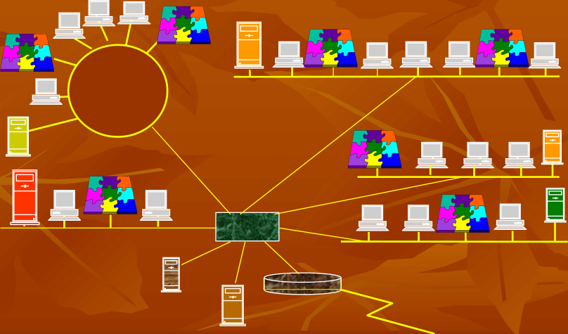

### 8.17 回归测试与验收测试

目标:检查系统变更之后是否引入新的错误或者旧的错误重新出现,尤其是在每次Build之后和稳定期测试的时候工具:一般使用工具,一般依赖于测试用例库和缺陷报告库

目标:关闭所有缺陷报告,确保系统达到预期的交付标准方法:一般需要结合回归测试,并谨慎处理新出现的Bug

测试级别:

**代码审查**

**单元测试**

**集成测试**

**系统测试**

**回归测试**

### 8.18 测试自动化与流程

自动化测试是使用一种自动化测试工具来验证各种测试的需求,包括测试活动的管理和实施。

测试活动自动化在很多情况下提供最大价值通过自动化测试可以缩短软件测试时间测试过程标准化提高软件产品的质量

MercuryInteractive(MI) Segue Rational Compuware和Empirix .......

**测试文档**

**测试计划**

**测试设计**

**测试执行**

**测试记录**

**分析**

**测试总结**

**完毕**

**缺陷跟踪**

**测试计划文档**

**测试用例文档**

**测试记录文档**

**缺陷跟踪报告**

**测试总结报告**

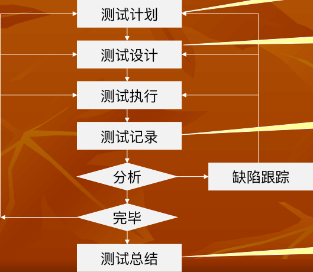

### 8.19 缺陷报告与测试记录

软件测试是一项与软件开发同步并行的工作,尽管正处在摸着石头过河的阶段,但是已经引起行业界的足够重视,并处在迅速发展之中。

对于微软这样的软件巨头,它也承认软件测试工作尚无固定模式可循。

微软主要开发系统软件产品,它的系统软件测试计划和测试报告,并不强调用户需求报告中的功能、性能、接口和界面,而是强调Bug报告。

该报告包括Bug名称、Bug发现场景、Bug分类、Bug排序、Bug重现、Bug入库、Bug修复、Bug统计等内容。Bug报告都存放在一个Bug数据库中,该Bug数据库在微软产品的开发中占有核心地位。具体地说,Bug数据库至少要包括以下几个数据项(字段):

(1). Bug名称;

(2). 被测试的软件产品版本号;

(3). Bug的优先级及严重性;

(4). Bug出现的测试操作步骤;

(5). Bug造成的后果;

(6).备注或说明。

不管是系统软件还是应用软件,不论是采用何种软件测试模型和测试方法。因为软件产品是人类智慧与艺术的结晶,所以软件测试任重道远......。
