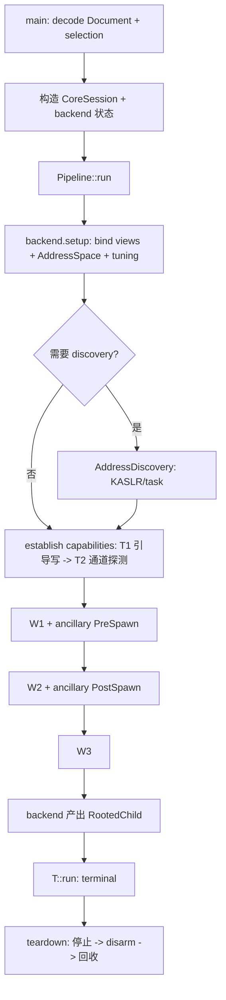

# 顶级架构重写 计划（2026-10-03）

> **全局顺序/状态以 `docs/plan/branch-plan.md`（分支总 plan）为准**；本文件只负责本主题细节。

对应决策：`adr/0001`（Option C 完整重写）· `adr/0002`（CoreSession）· `adr/0003`（profile 注册）·
`adr/0004`（框架收敛裁决 R1–R17）。背景：`placeholder-backend-survey.md`。
闭包状态见 `architecture-findings-register.md`；历轮审查原文见 `architecture-review-log.md`（归档，不是权威）。

## 现状与基线

- 分支 `vr-ko-bypass-dev`；基线 `acc5e7b` **+ 在飞改动**（ancillary vr-task-tag、占位 backend、TCP 5.x
  geometry）。在飞改动**保留**，提交为 `B0`；由 `B0` 干净检出构建基线二进制并记 sha256。
- 问题 P1–P6：`session` god namespace；漏洞原语无模块；`memory` 混合三轴；`route` 混组合层；
  身份/执行跨命名空间；offset 双结构族。

## 目标与约束

目标：按“最可能变化的决策”（Parnas）重排顶级命名空间，给 `KernelMemory` 正确归属。

不可违反：PI 窗口零间接；route 能力 `constexpr`；只允许 `g_exploit_session` 一个可变全局（类型改
`CoreSession`）；W1/W2/W3 顺序、四段生命周期、契约语义不变。门禁按阶段（见验证矩阵）。

## 目标结构

```
src/core
├── contract    真通用：StageResult · 身份词汇(TerminalKind/BackendKind) · BackendIdentity · Capability 父接口 · KernelMemoryOps · AddressDiscoveryOps
├── memory      内核地址词汇 + 地址数学：KernelAddress/域/DIRECT_MAP/P0/struct page · AddressSpace（原 kernel 并入）
├── session     CoreSession（状态容器）：RuntimeConfig · Selection · AddressSpace · Capabilities · backend 状态槽
├── pipeline    组合：Pipeline<Backend, Terminal> · RunResult/RunCode/RunStage · orchestrator · catalog · identities
├── backend::cve_2026_43499
│       ├── backend_profile  TargetProfile/kernel_offsets · RouteKind/kRouteCatalog · execution_settings · typed views
│       └── alias · primitive · route · victim · service · steps · backend_terminal · slide/spray/leak
├── platform    abi（内核 ABI 偏移 + 设备 phys）· runtime（设备探测）· vivo（厂商对策）
├── ancillary   中性阶段钩子机制（Controller/Stage；行为由 platform/backend 注册）
├── terminal    终止接管策略：root_child（含 handoff）· umh_forward · file_write · panic
├── profile     仅 GLK1 容器 framing + 中性 Document（ADR-0003）
└── support     仅通用：RAII/Result/time/number_parse/log
```

命名（R11）：backend 内与顶级同名的子模块加 `backend_` 前缀（`backend_profile`、`backend_terminal`）。

依赖（R1 允许边）：`support/profile(容器) ← 所有`；`memory→support`；`contract→memory`；`session→contract`；
`ancillary→contract`；`platform→{contract,memory,profile,ancillary}`；`terminal→{contract,memory,session,support}`；
`backend→{contract,memory,session,platform,ancillary,terminal,profile}`；
`pipeline→{contract,memory,session,backend,terminal,profile}`。**backend 不 include pipeline**。

## 选择与组件模型（ADR-0004 R2/R3/R10/R12/R18–R21）

- **2 装配轴**：`backend`（漏洞）× `terminal`（提权后接管）；`route` 在 backend 内按 profile 选；
  `platform`/`capabilities` 为横切。
- `Pipeline<Backend, Terminal>::run(CoreSession&)`：先 `B::run(CoreSession&, RootedChild&)`（backend 填
  终端输入、转移 victim 所有权），再 `T::run(CoreSession&, RootedChild&)`；terminal 返回 `Continue` = 契约违反。
- `ComponentSelection = {BackendKind, StepSetKind, TerminalKind}`；catalog 是**稀疏枚举**的合法三元组（不是稠密积），
  每个三元组一个 `DispatchTarget`；非法即 `Rejected`（ADR-0004 R18/R20/R21）。
- **Steps 可见且隶属 backend**：`Backend<StepSet>` 实例化（43499 的 `W1W2`/`W1W3`；43284 的页缓存链）；
  `StepSetKind` 经 **backend 私有 GLK1 section** 下发（不动 header、不 bump 版本）；profile 唯一权威，native 不设默认。
- `TerminalKind` = GLK1 `frontend_id` 语义；每个 terminal 声明 `ActivationContext`（R19/R20）。
- `terminal::RootedChild`（move-only）：pid + command fd + alive/seccomp/ever_rooted + `retire()`/`detach()`。

## 非 43499 backend 预留（CVE-2026-43284）

43284（ESP 对共享 frag 就地解密 → 任意 16B 页缓存写）作为首个非 43499 backend，用以验证 ADR-0004 中性性。
设计见 `docs/plan/cve-2026-43284-backend-plan.md`；评估见 `cve-2026-43284-backend-assessment.md`。两条新条目：

- **非内核内存 capability**：`contract` 增与 `KernelMemoryOps` 平级的 `FileCacheWriteOps`（同族 43503 复用）；
  backend 声明其能力集。现有 T0/T1/T2 阶梯是内核内存形状，覆盖不了页缓存文件写。→ ADR-0004 待补 R。
- **`umh_forward` 转正**：terminal 输入从 `RootedChild` 泛化为 `TerminalInput`（`RootedChild` 为其中一种）；
  UMH terminal 不绑 KernelSU，也不绑具体 root 程序——**root 程序由 App 选择**（ksud、folkpatch 等，作为
  profile/wire 参数）。→ ADR-0004 R10 延续。

其余撞击点：组合根按 `selection.backend` 构造状态槽；43284 私有 GLK1 section（不复用 43499 槽）；无 route。

## 控制流时序（ADR-0004 R13–R17）



capability 分级：T0 route write → T1 `KernelMemory` 引导写 → T2 任意读/`update_bits`（T2 依赖 T1 + 通道；
B 通道 / C pipe 回退）。平台行为按声明需求取用，缺能力则跳过（非致命）。失败传播（E1/E2/E3/Done/terminal）
见 ADR-0004 R16。

## 迁移映射（旧→新）

| 新位置 | 旧来源 |
|---|---|
| `pipeline` | 组合层：Pipeline/RunResult/RunCode/RunStage/ComponentSelection/DispatchTarget/orchestrator/catalog/identities |
| `contract` | StageResult；身份词汇；Capability/KernelMemoryOps/AddressDiscoveryOps |
| `session` | ExploitSession/RuntimeConfig（ADR-0002） |
| `memory` | ResolvedAddresses→AddressSpace + `kernel` 通用地址布局（并入） |
| `backend…::backend_profile` | TargetProfile/kernel_offsets/RouteKind/kRouteCatalog/execution_settings/typed views；binary 绑定 |
| `backend…::primitive` | WriteRequest/WriteMode/PayloadWriteLayout/PiRace/payload/HeapContext/PayloadPage/MmContextSet/ReclaimPair + support/util spray |
| `backend…::route` | Select/Tcp/Multicast policy+类/RouteController/RouteStatus/FdSet（route 私有） |
| `backend…::victim` | VictimContext/VictimChain/VictimRound/victim_process |
| `backend…::alias` / `service` / `steps` / `backend_terminal` / `leak` | 符号别名 / KernelMemory 实现 / W1-W3 / 终止输入 / kernelsnitch |
| `platform::abi` | 内核 ABI 偏移 + 设备 phys 默认（`target.h` 拆分） |
| `platform::runtime` | 环境探测（selinux/seccomp/iomem cache） |
| `platform::vivo` | AncillaryKind/VrGuard/VrTaskTag/VR_TAG_B_OFF/vr 字段 |
| `ancillary` | AncillaryController/AncillaryStage（Context 退役） |
| `terminal` | frontend::{RootChild,UmhForward} + handoff_probe + write_root_script |
| `profile` | 仅 GLK1 framing + Document（ADR-0003） |
| `support` | RAII/Result/time/number_parse/log/put*/futex_op/reserve_standard_io |
| 内化/删除 | `session/stage_types` 拆分；`attack::*` 拆分；`kernel`→memory；top-level route 取消 |

## 执行阶段

**Phase 0 — CoreSession 通用化（前置，ADR-0002）**：详见 `exploit-session-generalization-plan.md`。

**Phase A — 机械结构重排（只搬不改语义；分小批，每批 host+NDK 零告警）**
- `git mv` + 命名空间/include/构建清单（`src/Makefile` 权威；`CMakeLists.txt` 仅 CLion 补全）。
- 接口：`Pipeline<Backend, Terminal>::run(CoreSession&)`；`BackendExecution<B>::run(CoreSession&,
  terminal::RootedChild&) -> StageResult`；`RunStage::{None,Backend,Terminal}`。
- 机制下放 backend；`stage_types` 拆分（StageResult→contract，Victim*→backend）；RouteStatus 归 backend。
- 术语：`Middleware*→Route*`；`frontend→terminal`；`runtime→pipeline`。

**Phase A2 — 语义收敛（独立完整门禁）**
- `attack::*` 拆分；offset SSOT（ADR-0003 注册模型）；profile 分层；`ResolvedAddresses` 拆分；
  ancillary/platform 分层；基础设施去 43499 夹带；传输/入口去绑定；聚合头去耦；剩余夹带。

**Phase A3 — kernelsnitch 拆分/改写（独立，带测试）**：作 `contract::AddressDiscovery` 可选实现；拆子件；
保 `kernelsnitch_scan_bounds_test`；真机泄漏结果不变。

**Phase B — 契约/自动化同步**：`cmp_disasm` TARGETS；README/adding-a-component/AGENTS；Kotlin/wire 对拍；
host 数据流 harness 重接。

**Phase C — KernelMemory 功能（另 PR）**。

## Phase A2 分批（语义收敛，每批 host+NDK+cmp+真机）

- **A2-1（首切片）**：环境探测 `check_selinux_off`/`enforce_readable`/`process_has_seccomp` → `platform::runtime`；
  host 数据流 harness 加 `platform/runtime.hpp` 影集桩。`in_direct_map` 暂留 `attack`（`memory/address_space.h`
  是 host 单测无 target-config 包含的，等 memory 与构建期 target 解耦后再移）。
- **A2-2**：`attack::*` 其余拆分：`install_profile`/`resolve_profile_addresses` → bootstrap；`apply_iomem_cache`
  → platform；`slab_drain`/`perf_find_task` → backend；`write_root_script` → terminal；`timer_*` → support。
- **A2-3**：offset SSOT（ADR-0003 注册模型）；`ResolvedAddresses` 拆 `memory::AddressSpace` + backend alias。
- **A2-4**：ancillary/platform 分层（`platform::runtime`/`vivo`）；profile 分层落地。
- **A2-5**：传输/入口去绑定；聚合头 `common.h` 去耦。

## Phase A · 批 3（A-3）：目录/命名空间搬迁

子批（每批 host+NDK）：
- **A-3a**：组合层 `route/{pipeline,orchestrator,component_catalog,backend_contract,backend_policy,terminal_contract}.hpp` → `pipeline/`；
  `ghostlock::runtime` → `ghostlock::pipeline`；`session/root_child_terminal.*` → `terminal/root_child.*`，
  `ghostlock::session::terminal` → `ghostlock::terminal`。
- **A-3b**：route policy/类 → `backend/cve_2026_43499/route/`，`ghostlock::route` → `ghostlock::backend::cve_2026_43499::route`。
- **A-3c**：`session/backend/*` → `backend/`（扁平中间步），`ghostlock::session::backend` → `ghostlock::backend`；
  per-CVE 子命名空间（`backend::cve_2026_43499`）留 A-4。
- **A-3d**：`session/ancillary/*` → `ancillary/`；`victim_*` → backend victim；`handoff_probe` → terminal。
- **A-3e**：`kernel/*` → `memory/`，`ghostlock::kernel` → `ghostlock::memory`（R6）。

## Phase A · 批 2（A-2）：接口形状 + route 内部化 + terminal 接线 — 逐文件计划

目标：把 `Pipeline<Terminal, Backend, Middleware>` 收敛为 `Pipeline<Backend, Terminal>`；route 降为 backend 内部
选择；terminal 输入改为中性 `terminal::RootedChild`（R10/R12）。**行为与语句/日志顺序不变**，属攻击关键路径，
需完整门禁（host + NDK + cmp_disasm + 真机）。

### 设计决定

- `Pipeline<Backend, Terminal>::run(CoreSession&, const kernel_offsets&, const char*, bool)`：过渡期仍传
  `decoded/debug_dir/force_attack`（A-4 再移入 backend 状态）；内部先 `terminal::RootedChild child{}`，
  `Backend::run(session, decoded, debug_dir, force, child)`，再 `Terminal::run(session, child)`；
  terminal 返回 `Continue` = 契约违反 → Failed。
- `BackendExecution<B>`：`B::run(CoreSession&, const kernel_offsets&, const char*, bool, terminal::RootedChild&) -> StageResult`。
- `TerminalExecution<T>`：`T::run(CoreSession&, terminal::RootedChild&) -> StageResult`。
- backend `run` 非模板：`switch (decoded.route)` → `run_steps<Select/Tcp/MulticastPolicy>`（现 `run<M>` 改私有名），
  `attack_write<M>`/`zero_word<M>` 保持模板（`do_one_write` 符号不变）。
- `ComponentSelection = {BackendKind backend; TerminalKind terminal;}`（去掉 middleware/route 维度）；
  `combination_supported`/`dispatch_target_of(backend, terminal)` 按 `(backend, terminal)` 对枚举；`DispatchTarget`
  每对一个值；orchestrator 每对一个 case。route 可用性由 backend 内部决定（`decoded.route`）。
- **`RootedChild` 载荷**（保持现有清理顺序）：`{pid, command(UniqueFd), uid_read(UniqueFd), alive, seccomp_bypassed,
  ever_rooted}`。backend 在返回 `Continue` 前按“活子进程 / parked 子进程”选择有效的 pid 与 command fd 并**转移**
  （`victim.release_child()` / `pipes.cmd_write` 或 `parked_victim` / `parked_victim_cmd`）；`uid_read` 一并转移，
  terminal 在原来的位置 `reset()`，顺序不变。terminal 不再引用 `cve43499_state`/`VictimContext`。

### 逐文件改动

| 文件 | 改动 |
|---|---|
| `route/component_catalog.hpp` | `ComponentSelection` 去 middleware；`combination_supported`/`dispatch_target_of`/`DispatchTarget` 按 (backend,terminal)；保留 `route_name` 供日志 |
| `route/backend_contract.hpp` | `BackendExecution<B>` 新签名（含 `RootedChild&`，无 middleware 模板） |
| `route/terminal_contract.hpp` | `TerminalExecution<F>` 用 `RootedChild&`；修正 include guard 名 `GHOSTLOCK_TERMINAL_CONTRACT_HPP` |
| `route/pipeline.hpp` | `Pipeline<Backend, Terminal>`；去掉 middleware/catalog 跨积；`pipeline_catalogued` 按对 |
| `route/orchestrator.hpp` | 每 `(backend,terminal)` 一个 case + `static_assert(P::target==...)` |
| `session/backend/cve_2026_43499_backend.hpp` | `run` 非模板；`run_steps<M>` 私有；其余模板不变 |
| `session/backend/cve_2026_43499_backend.cpp` | `run<M>`→`run_steps<M>`；新增 `run` switch + `RootedChild` 转移；改显式实例化 |
| `session/root_child_terminal.{hpp,cpp}` | `run(CoreSession&, RootedChild&)`；改用 `child.pid/command/uid_read/flags`，删 `cve43499_state`/`VictimChain` 引用 |
| `session/stage_types.hpp` | `VictimChain` 暂留（backend 内部）；不对外接口 |
| `main.cpp` | `ComponentSelection{backend, terminal}`；`ids.middleware` 仅作 `decoded.route` fallback |
| 测试 | `component_catalog_test`/`backend_contract_test`/host `backend_dataflow_test` 改 `(backend,terminal)` 与 `RootedChild`；`route_stub` 不变 |
| `tools/cmp_disasm.py` | `do_one_write` TARGETS 不变（`attack_write<Route>`）；预期仍 `--reviewed` PASS |

### 不变量 / 风险

- O3/O4：`RootedChild` 转移不得改变“停止访问 → disarm → 回收”的顺序；`uid_read.reset()` 位置保持。
- `do_one_write`（=`attack_write<Route>`）语句顺序与日志不变；cmp_disasm 逐条复核。
- `run_state` enter/complete 阶段名与顺序不变。
- 若真机 multicast 回归 → 回退 A-2。

### 门禁

host 全绿 + NDK 零告警 + lint 0 + `cmp_disasm --reviewed` + 真机（A301SO/5.15.189 multicast，冷机）。

## 实施约束（T1–T4）

细节见 `architecture-findings-register.md`；本节是执行时的硬约束。

- **T1 偏移/能力形状**：`CoreSession` 新增 `Capabilities` 必须放在 backend 状态槽**之后**，不得移动攻击函数按偏移
  访问的既有字段（Phase 0 已把 backend 字段固定在 `runtime` 之后）。`Capabilities` 须 host-safe、trivially
  copyable、`noexcept`；`available()` 由句柄（空函数指针/空指针）推导，**不设 flag**（避免第二来源）。
- **T2 类型形状（按 R12 更正）**：backend 类型**不**参数化 route（route 由 backend 内部 `switch(profile.route)`
  选择到编译期实例）；terminal **不**由 backend 固定，由 pipeline 选择（R12）；
  `BackendExecution<B>::run(CoreSession&, terminal::RootedChild&) -> StageResult`。符号改名随重写记录（cmp_disasm TARGETS）。
- **T3 `AddressDiscoveryOps`**：`discover` 输出 `{kaslr_base, init_task, target_task, mm_struct}`；失败返回 `-1`/
  `ok=false` 即 **fail-closed**，不保留部分结果、不猜测；`kernelsnitch` 与 `perf_find_task` 两种实现语义一致
  （host 用固定向量测）。
- **T4 可测性**：host 替身 `Capabilities` stub / platform 行为 stub / terminal stub；host 数据流 harness 能注入
  `CoreSession.capabilities`；新增 host 测试登记进 `NATIVE_HOST_TESTS`：能力契约、平台适用性、终结合同、
  include 防火墙、fake backend stub。

## 数据流/不变量

重写不改数据流。不变量：PI 窗口时序、W1→W2→W3→terminal 顺序、route 能力、ancillary detag 先于提权、
单可变全局。所有权 O1–O5、错误分层 E1–E3、控制流/拆卸顺序见 ADR-0004 R13–R17。

## 兼容性与回滚

- 单分支；回滚 = 回到 Phase 0 起点快照 `B0`（含保留的在飞改动），在飞工作不受影响。
- 不新增可变全局；Phase 0 后端字段移入 backend 状态但绝对偏移不变（见 Phase 0 计划）。
- 符号名变 → `cmp_disasm` 期望“同形 + 已复核地址/符号差异”，不是 strict IDENTICAL。

## 验证矩阵

| 阶段 | host | NDK | cmp_disasm | 真机 |
|---|---|---|---|---|
| 0 | 全绿（session_layout_test、数据流 harness） | 零告警 | 先修 stale TARGETS（6 函数）；5 IDENTICAL + do_one_write 已复核 | Xperia 5.15 单 route（RW-00） |
| A（小批） | 每批全绿 | 每批零告警 | —（机械搬迁） | — |
| A2 | 全绿 | 零告警 | 新 TARGETS + 逐条复核 | Xperia 5.15 单 route |
| A3 | 全绿（含 kernelsnitch 测试） | 零告警 | 逐条复核（泄漏不变） | Xperia 5.15 |
| B | 全绿 + Kotlin 对拍 | 零告警 | 基线/TARGETS 一致 | —（无行为改动） |
| C | 全绿（含 stub 契约） | 零告警 | 逐条复核 | Xperia 5.15 接口/通道；vivo 6.1 协调后 |

## 明确保留

- PI 窗口规则、`prepare→execute→disarm→destroy`、攻击函数行为、契约接口语义。
- GLK1 v2 wire（容器中性）、profile 唯一配置权威；`kernelsnitch/` 见 Phase A3。
- `ExploitSession` 字段布局重定义属 ADR-0002，不是本重写的“保留”。

## 开放决策

结构已定（ADR-0004 R1–R17）。仍待实施时定（次要）：ADR-0002 的状态槽实现 / 全局名 / 状态类型名；
T1 引导写的具体调用点。细节“一边做一边定”，不再新增审查章节。

## 进度

- [x] ADR-0001（Option C）· ADR-0002（CoreSession）· ADR-0003（profile 注册）· ADR-0004（框架收敛 R1–R17）
- [x] 计划收敛；审查归档 `architecture-review-log.md`；闭包表 `architecture-findings-register.md`
- [x] 结构冻结（T1–T4 为实施约束，不再开架构审查）
- [ ] 开放决策确认（ADR-0002 实现细节；T1 调用点）— 实现已按推荐默认落地，待确认
- [x] 归位在飞改动为 `B0` + 基线二进制（`e987ed9`；sha256 `ae63a890…`）
- [x] Phase 0 实现（`core_session.*` + `Cve2026_43499State`；偏移保持）
- [x] Phase 0 门禁 `P0-01` PASS：host 22 全绿 + NDK 零告警 + lint 0 + `cmp_disasm --reviewed` +
      真机 A301SO/`5.15.189-…-ab14546557` multicast（`docs/analysis/device-gates/P0-20261003-multicast-direct-pass.md`）
- [x] Phase A1：`frontend → terminal` 术语/身份重命名（native 侧，wire 不变）
- [x] Phase A 批 2：`Pipeline<Backend, Terminal>` + route 内部化 + `RootedChild`（提交 `0ed1029`；host/NDK/lint/cmp + 真机 `A2-01` PASS）
- [x] Phase A 批 3a：组合层 → `pipeline/`、`runtime → pipeline`、`root_child → terminal/`（提交 `3c9312c`；host/NDK/lint/cmp 全绿）
### A-3b 逐文件

- `src/core/route/*` → `src/core/backend/cve_2026_43499/route/`（route_api/route_policy/route_middleware/
  route_controller/route_status/route_lifecycle/select_stack/tcp_zerocopy/multicast_waiter）。
- namespace `ghostlock::route` → `ghostlock::backend::cve_2026_43499::route`；include 路径同步。
- Makefile/CMake 的 `core/route/*.cpp` → `core/backend/cve_2026_43499/route/*.cpp`。

- [x] Phase A 批 3b：route policy/类 → `backend/cve_2026_43499/route/`（host/NDK/lint/cmp 全绿）
- [x] Phase A 批 3c：`session/backend/*` → `backend/`（扁平中间步），`ghostlock::session::backend` → `ghostlock::backend`（host/NDK/lint/cmp 全绿）
- [x] Phase A 批 3d：`ancillary/`、`backend/victim/`、`terminal/handoff_probe`（host/NDK/lint/cmp 全绿）
- [x] Phase A 批 3e：`kernel/*` → `memory/`（`runtime_struct_offsets.h` 归 `profile/`）；`ghostlock::kernel` → `ghostlock::memory`（host/NDK/lint/cmp 全绿）
- [x] **Phase A 机械重排完成（A1 + 批 2 + 批 3a–3e）**；整体真机门禁 `A3-01` PASS（`a43d5ee`，multicast 冷机）
- [ ] Phase A 批 4：`stage_types` 拆分 + route 契约归位（可选细化）
- [x] Phase A2-1：环境探测 → `platform::runtime`（host/NDK/lint/cmp 全绿；真机 `A2-1` PASS，二进制与 `A3-01` 完全一致）
- [x] Phase A2-2a：计时器族 → `support/timing.hpp`（保持 inline；host 影集；真机 `A2-2a` PASS）
- [x] Phase A2-2b：`apply_iomem_cache` → `platform::runtime`（真机 `A2-2b` PASS，首跑抖动已复跑排除）
- [x] Phase A2-2c：bootstrap 三函数 → `backend/cve_2026_43499/bootstrap.*`（落点修正：不进 pipeline，遵守 R1；真机 PASS）
- [x] Phase A2-2d：`write_root_script` → `terminal/root_script.*`（真机 PASS）
- [x] Phase A2-2e：`slab_drain`/`perf_find_task` → `backend/cve_2026_43499/primitives.*`（真机 PASS，首跑抖动已复跑排除）
- [x] Phase A2-3a：`in_direct_map` → `memory/direct_map.hpp`，删除 `attack/`（真机 `A2-3a` PASS；二进制与 A2-2e 逐字节相同）
- [x] Phase A2-3b：`AddressSpace` 拆出 `ResolvedAddresses`（基类前置、布局不变；真机 PASS）
- [ ] Phase A2-3c、A2-4/5：见“Phase A2 分批”
- [ ] Phase B
- [ ] Phase C（另 PR）
- [ ] 完整门禁 + 归档
